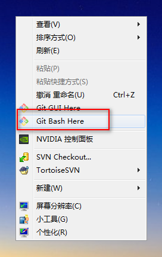
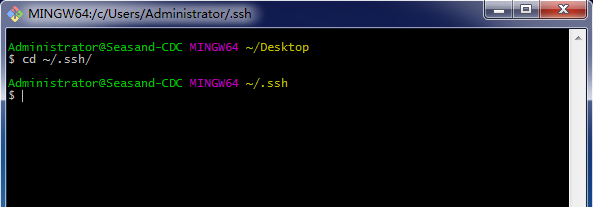
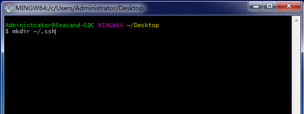
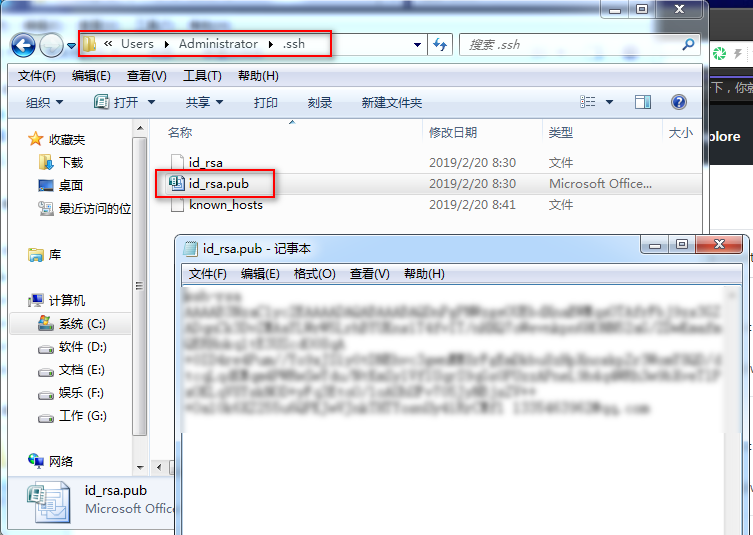
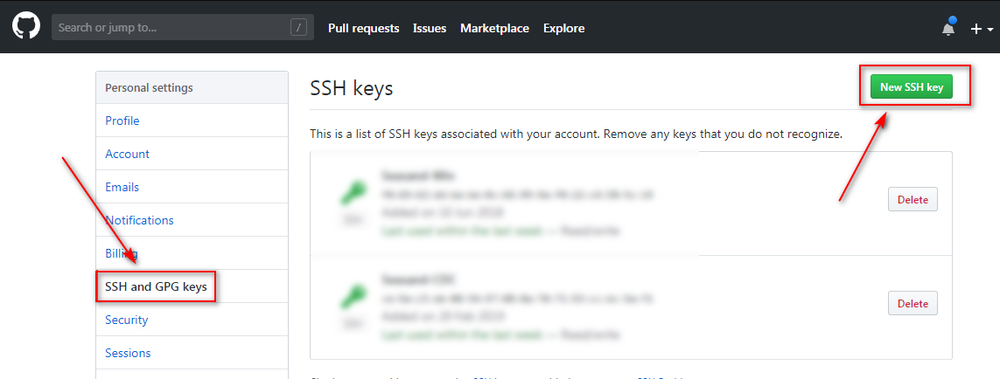
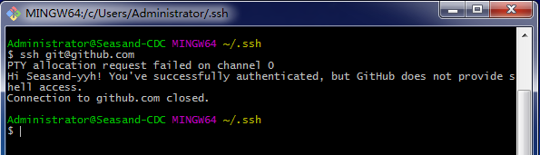

# Windows系统创建Git SSH Key步骤

---

1、打开Git客户端工具，进入.ssh文件夹

~~~plaintext
cd ~/.ssh/
~~~

如果提示 `“No such file or directory”`，可以手动创建一个 .ssh文件夹

~~~plaintext
mkdir ~/.ssh
~~~

2、配置全局的name和email，即github的name和email

~~~plaintext
git config --global user.name "your name here"

git config --global user.email "your email here"
~~~

3、生成ssh key

~~~plaintext
ssh-keygen -t rsa -C "your email here"
~~~

输入以上命令，会提示输入key的保存路径以及key密码。按回车确认，保持默认即可。最后得到了两个文件：id_rsa和id_rsa.pub。

4、打开Admin目录进入.ssh文件夹，用记事本打开id_rsa.pub，复制里面的内容添加到github的ssh设置里即可

5、测试是否添加成功

~~~plaintext
ssh git@github.com
~~~

出现提示：“Hi xxxxx! You've successfully authenticated, but GitHub does not provide shell access.”说明添加成功。

   

---

