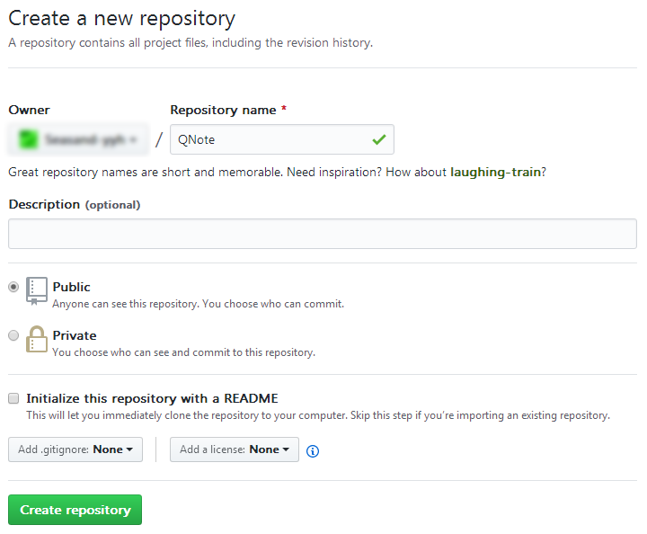
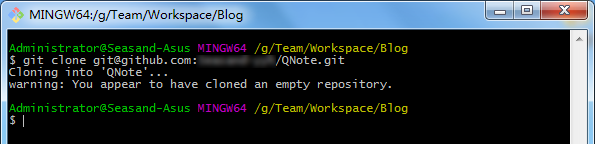

# GitBook+Github Pages搭建个人博客

---

1、在GitHub上新建仓库

2、将仓库clone到本地

3、使用gitbook创建项目

在QNote目录下，添加`book.json`文件，文件内容如下：

~~~javascript
{
  "title": "QNote",
  "description": "学习笔记",
  "author": "Seasand-yyh",
  "language": "zh-hans",
  "extension": null,
  "generator": "site",
  "links": {
	"sharing": {
	  "all": false,
	  "facebook": false,
	  "google": false,
	  "twitter": false,
	  "weibo": false
	},
	"sidebar": {
	  
	}
  },
  "output": null,
  "plugins": ["expandable-chapters", "splitter", "back-to-top-button"]
}
~~~

初始化项目：

~~~plaintext
gitbook install
gitbook init
~~~

生成README.md 和 SUMMARY.md两个文件。

编辑好内容后，执行构建：

~~~plaintext
gitbook build
~~~

可以先在本地进行预览，`http://localhost:4000/` ：

~~~plaintext
gitbook serve
~~~

4、同步到GitHub

在QNote目录下新建`.gitignore`文件，添加过滤内容：

~~~plaintext
node_modules
~~~

推送到GitHub：

~~~plaintext
git push -u origin master
~~~

将gitbook构建生成的`_book`文件夹内容推送到`gh-pages`分支：

~~~plaintext
git subtree push --prefix=_book origin gh-pages
~~~

最后，访问 `https://{username}.github.io/QNote `， 即可。

更多关于gitbook使用方法，参考[GitBook基础教程](#docs/2013-11-15 GitBook基础教程/index)。

   

---

