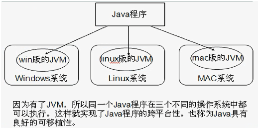
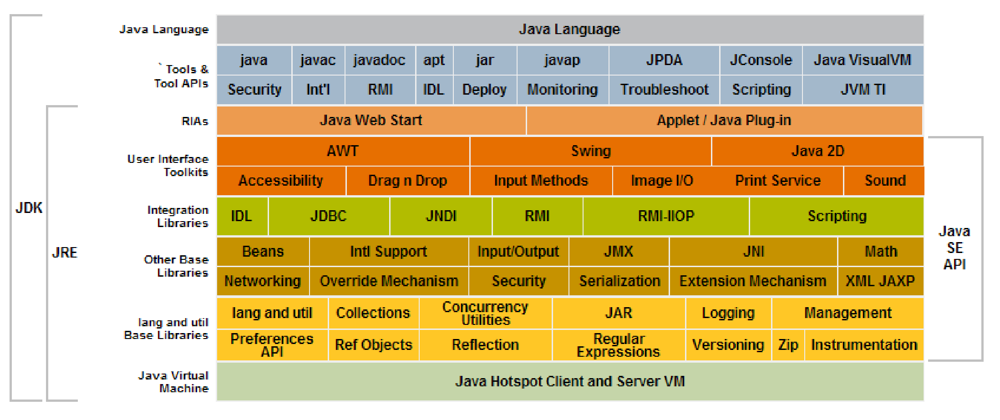

# Java基础知识汇总-Java概述

---

### 软件的概念

软件，是指一系列按照特定顺序组织的计算机数据和指令的集合。软件的交互方式包括图形化界面（Graphical User Interface， GUI）、命令行界面(Command Line Interface，CLI)两种。

### Java简介

Java是Sun（Stanford University Network）公司开发出来的一套编程语言，主要设计者是James Gosling，最早来源于一个叫Green的项目。这个项目原来的目的是为家用电子消费产品开发一个分布式代码系统，这样就可以通过网络对家用电器进行控制。开始Sun的工程师们准备采用C++，但是由于C++过于复杂，安全性差，最后决定基于C++开发一种新语言Oak（Java的前身，1991年出现）。Oak是一种用于网络的、精巧而安全的语言，Sun公司曾以此投标过一个交互式电视项目，结果被SGI打败。于是当时的Oak几乎“无家可归”，恰巧这时Mark Ardreesen开发的Mosaic和Netscape启发了Oak项目组成员，Sun的工程师们用Java编制了HotJava浏览器，得到了Sun公司首席执行官Scott McNealy的支持，触发了Java进军Internet。

> JDK1.0是于1995年5月23日推出。

### Java语言的发展历程

### Java语言的3个方向

* J2SE：Java 2 Platform Standard Edition，包含构成Java语言核心的类，如数据库连接、接口定义、输入输出和网络编程等；
* J2EE：Java 2 Platform Enterprise Edition，包含J2SE中的所有类，并且还包含用于开发企业级应用的类，如EJB、Servlet、JSP、XML和事务控制等；
* J2ME：Java 2 Platform Micro Edition，包含J2SE中的一部分类，用于消费类电子产品的软件开发，如呼机、智能卡、手机、PDA和机顶盒等；

> 其中J2SE是最核心的部分。在2005年，正式更名为Java SE、Java EE、Java ME。

### Java语言的特点

* 简洁高效：它去除了C++中难以理解、容易混淆的特性，更加严谨、简洁；
* 可移植性：使用Java语言编写的程序不用修改或只需很少的修改就能在不同的平台上运行；
* 面向对象：包含面向对象系统分析（OOA）、面向对象系统设计（OOD）、面向对象程序设计（OOP）的完整体系；
* 解释型：通过在不同平台上运行Java解释器，对Java代码进行解释，来达到“一次编写，到处运行”的目的；
* 适合分布式计算：具有强大的、易于使用的联网能力，非常适合开发分布式计算的程序；
* 拥有较好的性能：作为解释型语言，执行效率相对低一些，但是通过诸如JIT（Just in Time）等技术能够提高一定程度；
* 健壮、防患于未然：将许多运行期间的问题在编译期就暴露出来，有效地减少了错误；
* 具有多线程处理能力：Java在多线程处理方面性能超群，且很容易使用；
* 具有较高的安全性：Java语言设计时在安全性方面考虑得很仔细，做了许多探究；
* 是一种动态语言：可以简单、直观地查询运行时信息，可以将代码加入到一个正在运行的程序中；
* 是一种中性结构：Java编译器生成的是一种中性的对象文件格式，是一个与任何计算机系统无关的中性字节码；

### Java跨平台原理分析

通过Java语言编写的应用程序在不同的系统平台上都可以运行。原理是，只要在需要运行Java应用程序的操作系统上，先安装一个Java虚拟机（JVM，Java Virtual Machine），由JVM来负责Java程序在该系统中的运行。Java实现跨平台靠的是JVM，JVM就是一台虚拟的计算机，只要在不同的操作系统上植入不同版本的JVM，Java程序就可以在各个平台上移植。

### JDK、JRE和JVM

* JDK：Java Development Kit，Java开发工具集；
* JRE：Java Runtime Environment，Java运行环境；
* JVM：Java Virtual Machine，Java虚拟机；

总结：JRE = JVM + 核心类库； JDK =  JRE + Java开发工具；

附：为什么JDK中包含一个JRE？

* 开发完的程序，需要使用JRE运行一下；
* JDK中的开发工具都是使用Java语言编写的，为了方便使用才打包成EXE文件，如果没有JRE，这些工具是运行不了的。

   

---

