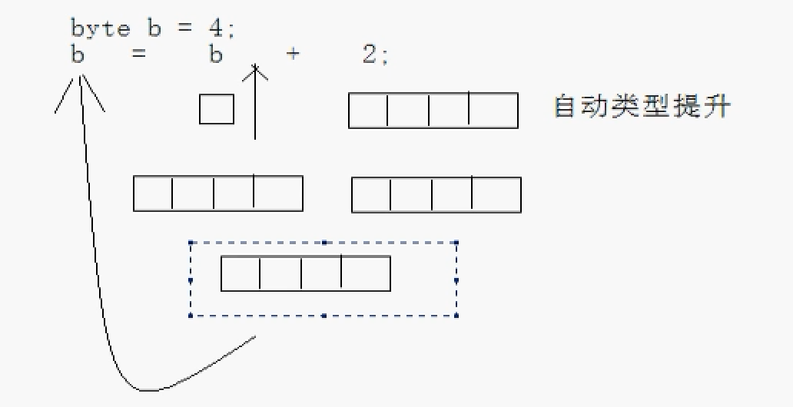

# Java基础知识汇总-语法基础

---

### 注释

##### 概念

在编写代码时在代码上增加的说明文字，这些文字不需要被编译器编译，它们被称为Java的注释。

##### 注释的作用

* 用于注解说明程序，提高程序的可读性；
* 用于调试程序代码；

##### 注释的分类

1）单行注释

单行注释，就是在注释内容前面加双斜线（`//`）, Java编译器在进行程序编译时会忽略掉这部分信息。从双斜线（`//`）开始到行末结束的这部分内容都将成为单行注释。

~~~java
public class Demo {
	public static void main(String[] args) {
		// 此处为单行注释，编译代码时该部分内容不编译
		System.out.println("Hello World!");
	}
}
~~~

2）多行注释

多行注释，就是在注释内容前面以单斜线加一个星形标记（`/*`）开头，并在注释内容末尾以一个星形标记加单斜线（`*/`）结束。当注释内容超过一行时一般使用这种方法。

~~~java
public class Demo {
	public static void main(String[] args) {
		/*
		 * 此处为多行注释，
		 * 编译代码时该部分内容不编译
		 */
		System.out.println("Hello World!");
	}
}
~~~

3）文档注释

文档注释，是以单斜线加两个星形标记（`/**`）开头，并以一个星形标记加单斜线 （`*/`） 结束。用这种方法注释的内容会被解释成程序的正式文档，并能包含进如 javadoc 工具生成的文档里，用以说明该程序的层次结构及其方法。在文档注释中提供了许多类似于“＠author ”的标记，例如： 参数类型、返回值、方法说明等。

~~~java
/**
 * 此处为文档注释
 * @author seasand
 * @version 1.0
 */
public class Demo {
	/**
	 * 此处为文档注释
	 * test方法
	 * @param s
	 * @return
	 */
	public boolean test(String s) {
		s = null;
		return true;
	}
}
~~~

注意事项：

* 单行注释可以嵌套单行注释，也可以嵌套多行注释；
* 多行注释可以嵌套单行注释，但不可以嵌套多行注释。

##### 生成文档注释

对于文档注释，是Java特有的注释，其中注释内容可以被JDK提供的工具 javadoc 所解析，生成一套以网页文件形式体现的该程序的说明文档。

命令：`javadoc -d <directory> -author -version XXX.java`；

~~~plaintext
javadoc -d . -author -version Demo.java
~~~

> 生成文档注释的类必须是public声明的，以及类中声明为public或protected的成员。

### 标识符

##### 概念

通俗地讲，标识符就是在给程序中的事物起名称，例如给类指定名称。除了类名称之外，包名称、属性名称、方法名称、参数名称、变量名称等也都属于标识符的定义范畴。

##### 标识符的定义规则

在Java中每一个标识符都有自己的严格定义要求：

* 标识符由26个英文字母（`a~z、A~Z`）、数字（`0~9`）、下划线（`_`）、美元符（`$`）组成；
* 不能以数字开头；
* 不能是Java中的关键字；
* 标识符是区分大小写的；
* 标识符的命名应尽量有意义；
* JDK1.7之后标识符可以使用中文；

##### Java中的命名规范

* 包名：多单词组成时所有字母都小写。（xxxyyyzzz）
* 类名接口名：多单词组成时，所有单词的首字母大写。（XxxYyyZzz）
* 变量名和函数名：多单词组成时，第一个单词首字母小写，第二个单词开始每个单词首字母大写。（xxxYyyZzz）
* 常量名：所有字母都大写，多单词时每个单词用下划线连接。（XXX_YYY_ZZZ）

### 关键字

##### 概念

关键字是指某一种计算机语言对指定的单词赋予了特殊的含义，是指Java中具备特殊含义的单词，例如 public、 class、 static ，这些都属于关键字，关键字在表现上都是小写字母的形式。

##### 常见关键字

|          |         |            |              |            |           |           |
| -------- | ------- | ---------- | ------------ | ---------- | --------- | --------- |
| abstract | assert  | boolean    | break        | byte       | case      | catch     |
| char     | class   | continue   | const        | default    | do        | double    |
| else     | extends | enum       | final        | finally    | float     | for       |
| goto     | if      | implements | import       | instanceof | int       | interface |
| long     | native  | new        | package      | private    | protected | public    |
| return   | short   | static     | synchronized | super      | strictfp  | this      |
| throw    | throws  | transient  | try          | void       | volatile  | while     |

* Java中的两个保留字：const 和 goto；
* JDK1.4之后增加了assert，JDK1.5之后添加了enum；
* true、false、null虽然不是关键字，但是也作为一个单独标识类型；

### 常量与变量

##### 概念

变量是利用声明的方式，将内存中某个内存块保留下来以供程序使用。可以声明的数据类型为整型、字符型、浮点型或是其他数据类型，作为变量的保存使用。变量可以用来存放数据，而使用变量之前必须先声明它的数据类型。

常量顾名思义就是一个固定的数值，是不可改变的，例如：数字1、2就是一个整型的常量。

变量与常量最大的区别只有一个：常量的内容是固定的，而变量的内容是可以改变的。

### 数据类型

##### 概念

Java的数据类型可以分为基本数据类型与引用数据类型。基本数据类型也称为原始数据类型，它们包括了最基本的boolean、byte、char、short、int、long、float与double等类型。另一种数据类型为引用数据类型，它是以一种特殊的方式指向变量的实体，这种机制类似于C/C++的指针。这类变量在声明时不会分配内存，必须另外进行开辟内存空间的操作，如字符串与数组都属于这种数据类型。

##### 各数据类型数值范围与默认值

| 数据类型               | 大小/位 | 数据范围                                 | 默认值   |
| ---------------------- | ------- | ---------------------------------------- | -------- |
| byte（字节）           | 8       | -128~127                                 | (byte)0  |
| short（短整型）        | 16      | -32768~32767                             | (short)0 |
| int（整型）            | 32      | -2147483648~2147483647                   | 0        |
| long（长整型）         | 64      | -9223372036854775808~9223372036854775807 | 0L       |
| float（单精度浮点型）  | 32      | -3.4E38~3.4E38                           | 0.0f     |
| double（双精度浮点型） | 64      | -1.7E308~1.7E308                         | 0.0d     |
| char（字符）           | 16      | 0~65535                                  | '\u0000' |
| boolean（布尔型）      | -       | true/false                               | false    |

##### 整型

包括byte、short、int、long四种类型，在Java中所有设置的整数内容默认情况下都是 int 型数据。

~~~java
public class Demo {
	public static void main(String[] args) {
		byte b = 1;
		short s;
		int i = 34;
		long l = 1234L;
		
		int num = 99999999999999999999999; //integer number too large
		
		// 整型数据的除法
		int x = 9;
		int y = 5;
		System.out.println(x/y); //1
		System.out.println(x/(double)y); //1.8
	}
}
~~~

##### 浮点型

浮点数就是小数，Java中只要是小数，对应的默认数据类型就是 double 型数据。

~~~java
public class Demo {
	public static void main(String[] args) {
		double num;
		float sum = 3.0f;
		
		double num1 = -6.3e64;
		double num2 = -5.34E16;
		float num3 = 7.32f;
		float num4 = 2.456E67; //超过float的最大值
	}
}
~~~

##### 字符型

在程序中使用单引号“’”声明的内容称为字符，每一个单引号里面只能够保存一位字符。

~~~java
public class Demo {
	public static void main(String[] args) {
		char ch1 = 'a';
		char ch2 = 97;
		System.out.println(ch1); //a
		System.out.println(ch2); //a
		
		System.out.println('a'+1); //98
		System.out.println((char)('a'+1)); //b
	}
}
~~~

* 大写字母的范围：65~90
* 小写字母的范围：97~122
* 数字的范围：48~57

##### 布尔型

布尔型是一种逻辑结果，主要保存 true、false 两类数据，这类数据主要用于一些程序的逻辑使用。

~~~java
public class Demo {
	public static void main(String[] args) {
		boolean flag;
		boolean status = true;
		System.out.println(flag); //false
		System.out.println(status); //true
	}
}
~~~

> Java 里面不允许使用0或1来填充布尔型的变量内容。

##### 常见转义字符

| 转义字符 | 描述   | 转义字符 | 描述   |
| -------- | ------ | -------- | ------ |
| `\f`     | 换页   | `\r`     | 回车   |
| `\\`     | 反斜线 | `\n`     | 换行   |
| `\b`     | 退格   | `\t`     | 制表符 |
| `\'`     | 单引号 | `\"`     | 双引号 |

##### 数据类型转换

数据类型的转换方式分为自动类型转换和强制类型转换。

1）自动类型转换

条件：

* 转换前的数据类型与转换后的类型兼容；
* 转换后的数据类型表示的范围比转化前的范围大；

2）强制类型转换

~~~java
(要转换的数据类型)变量名称;
~~~

这种强制类型的转换是直接编写在程序代码中的，所以也称为显式转换。此外，若是将一个超出该变量可表示范围的值赋值给这个变量时，这种转换称为缩小转换。由于在转换过程中可能会丢失精度，Java并不会自动做这些转换，此时也需要做强制性的转换。

3）表达式的数据类型自动提升

* 所有的byte型、short型和char的值将被提升到int型；
* 如果一个操作数是long型，计算结果就是long型；
* 如果一个操作数是float型，计算结果就是float型；
* 如果一个操作数是double型，计算结果就是double型。

4）转换特征总结

* 数据范围小的数据与数据范围大的数据进行数学计算时，自动向大范围的数据类型转换后计算；
* 数据范围大的数据要变为数据范围小的数据，必须采用强制转换；
* 如果要强制性地将某一数据类型变为其他类型，则必须采用强制类型转换；

##### 数据的溢出

~~~java
public class Demo {
	public static void main(String[] args) {
		int max = Integer.MAX_VALUE;
		int min = Integer.MIN_VALUE;
		System.out.println(max); //2147483647
		System.out.println(min); //-2147483648

		System.out.println(max+1); //-2147483648
		System.out.println(min-1); //2147483647
		System.out.println(min-2); //2147483646
	}
}
~~~

由于计算超过了其数据类型保存的范围，就会出现一个循环的操作：最大值如果继续增加就变为最小值，随后一直向其次的最小值进行循环，反之最小值减1就变为最大值，此种现象称为数据的溢出。

##### 数据损失精度

1）示例一

~~~java
public class Demo{
	public static void main(String[] args){
		byte b = 4;
		b = b+2;
	}
}
~~~

损失精度，原因如下图所示：

修改如下：

~~~java
public class Demo{
	public static void main(String[] args){
		byte b = 4;
		b = (byte)(b+2);
	}
}
~~~

2）示例二

~~~java
public class Demo{
	public static void main(String[] args){
		byte b1 = 4;
		byte b2 = 5;
		byte b;
		b = b1 + b2; //损失精度
		b = 4 + 5; //正常
	}
}
~~~

以上情况，b=4+5 ，4和5都是常量，赋值常量都在byte范围内，Java在编译时期会检查该常量的和是否超出byte类型的范围，如果没有超出就可以赋值，所以正常；但是如果赋值变量，如b=b1+b2，因变量的值是不确定的，比如b1、b2有可能为127，相加的和已经超出byte范围，所以有可能丢失精度，编译器会在编译时做检查，所以默认使用int类型进行存储。

### 进制转换

##### 负数的二进制

##### 十进制和二进制的转换

* 十进制转换为二进制：除2取余，将余数从下往上排列；
* 二进制转换为十进制：乘2的N-1次方，N为位数；

##### 进制转换实现代码

~~~java
public class Trans {
	public static void main(String[] args) {
		toHex(0);
		toOctal(60);
		toBinary(-6);

		System.out.println(Integer.toHexString(0));
		System.out.println(Integer.toOctalString(60));
		System.out.println(Integer.toBinaryString(-6));
	}

	/**
	 * 十进制-->十六进制。
	 * @param num
	 */
	public static void toHex(int num) {
		trans(num, 15, 4);
	}

	/**
	 * 十进制-->八进制。
	 * @param num
	 */
	public static void toOctal(int num) {
		trans(num, 7, 3);
	}

	/**
	 * 十进制-->二进制。
	 * @param num
	 */
	public static void toBinary(int num) {
		trans(num, 1, 1);
	}

	/**
	 * 进制转换功能。
	 * @param num
	 * @param base
	 * @param offset
	 */
	public static void trans(int num, int base, int offset) {
		if (num == 0) {
			System.out.println("0");
			return;
		}

		// 必须先将十六进制的元素进行存储。
		char[] chs = { '0', '1', '2', '3', '4', '5', '6', '7', '8', '9', 'A', 'B', 'C', 'D', 'E', 'F' };

		// 定义一个临时容器，用于存储查到的结果。
		char[] arr = new char[32];
		int pos = arr.length;

		while (num != 0) {
			int temp = num & base;
			arr[--pos] = chs[temp];
			num = num >>> offset;
		}

		for (int x = pos; x < arr.length; x++) {
			System.out.print(arr[x]);
		}
		System.out.println();
	}
}
~~~

### 运算符

##### 概念

Java中的表达式是由操作数与运算符组成的，操作数可以是变量、常量，而运算符就是数学中的运算符号。

Java提供了许多的运算符，这些运算符除了可以进行一般的数学运算外，还可以做逻辑运算、地址运算等。运算符可分为赋值运算符、算术运算符、关系运算符、逻辑运算符、条件运算符等。

##### 赋值运算符

| 符号 | 描述 |
| ---- | ---- |
| =    | 赋值 |
| +=   | 加等 |
| -=   | 减等 |
| `*=`   | 乘等 |
| /=   | 除等 |
| %=   | 模等 |

~~~java
public class Demo {
	public static void main(String[] args) {
		int num = 1;
		num = num + 1;
		
		num += 1;
		num -= 1;
		num *= 1;
		num /= 1;
		num %= 1;
		
		byte x = 6;
		x = x + 3; //编译失败，损失精度
		x += 3; //编译通过，+=为赋值运算符，跟x=6的原理是一样的，因为+=运算符在给x赋值时，自动完成了强转操作
	}
}
~~~

##### 算术运算符

| 符号 | 描述 |
| ---- | ---- |
| +    | 加   |
| -    | 减   |
| `*`  | 乘   |
| /    | 除   |
| %    | 模   |
| ++   | 自增 |
| --   | 自减 |

~~~java
public class Demo {
	public static void main(String[] args) {
		int i = 10;
		int j = 3;
		
		System.out.println(i + "+" + j + "=" + (i+j));
		System.out.println(i + "-" + j + "=" + (i-j));
		System.out.println(i + "*" + j + "=" + (i*j));
		System.out.println(i + "/" + j + "=" + (i/j));
		System.out.println(i + "%" + j + "=" + (i%j));
		
		i++;
		++i;
		i--;
		--i;
		
		//取整操作
		int x = 4532;
		x = x/1000*1000;
		
		//如果对负数取模，可以把模数负号忽略不记；结果的符号跟被模数相关
		5 % 2 = 1;
		5 % -2 = 1;
		-5 % 2 = -1;
		-5 % -2 = -1;
	}
}
~~~

##### 关系运算符

| 符号 | 描述     |
| ---- | -------- |
| >    | 大于     |
| <    | 小于     |
| >=   | 大于等于 |
| <=   | 小于等于 |
| ==   | 等于     |
| !=   | 不等于   |

~~~java
public class Demo {
	public static void main(String[] args) {
		int i = 3;
		int j = 1;
		
		System.out.println("i>j" + (i>j)); //true
		System.out.println("i<j" + (i<j)); //false
		System.out.println("i>=j" + (i>=j)); //true
		System.out.println("i<=j" + (i<=j)); //false
		System.out.println("i==j" + (i==j)); //false
		System.out.println("i!=j" + (i!=j)); //true
	}
}
~~~

##### 逻辑运算符

| 符号 | 描述   |
| ---- | ------ |
| \|   | 或     |
| \|\| | 短路或 |
| &    | 与     |
| &&   | 短路与 |
| ！   | 非     |

逻辑运算结果表

| 条件1 | 条件2 |  &&   | \|\|  |
| :---: | :---: | :---: | :---: |
| true  | true  | true  | true  |
| true  | false | false | true  |
| false | true  | false | true  |
| false | false | false | false |

“&”和“&&”的区别：

* 单&时，左边无论真假，右边都进行运算；
* 双&时，如果左边为真，右边参与运算，如果左边为假，那么右边不参与运算。

“|”和“||”的区别同理，双或时，左边为真，右边不参与运算。

~~~java
public class Demo {
	public static void main(String[] args) {
		boolean a = true;
		boolean b = false;
		
		System.out.println(a && b); //false
		System.out.println(a & b); //false
		System.out.println(a || b); //true
		System.out.println(a | b); //true
		System.out.println(!a); //false
	}
}
~~~

##### 位运算符

| 符号 | 描述       |
| ---- | ---------- |
| &    | 按位与     |
| \|   | 按位或     |
| ^    | 按位异或   |
| ~    | 按位取反   |
| <<   | 左移       |
| >>   | 右移       |
| >>>  | 无符号右移 |

1）常见位操作结果表

| 操作数1 | 操作数2 |  &   |  \|  |  ^   |
| :-----: | :-----: | :--: | :--: | :--: |
|    0    |    0    |  0   |  0   |  0   |
|    0    |    1    |  0   |  1   |  1   |
|    1    |    0    |  0   |  1   |  1   |
|    1    |    1    |  1   |  1   |  0   |

2）移位操作

* `>>`：右移，空出来的位置由符号位填充，正数补0，负数补1；
* `>>>`：无符号右移，空出来的位置一律由0填充；

* `<<`：相当于乘以2的倍数
* `>>`：相当于除以2的倍数

移n位，就是乘以或者除以2的n次幂。

~~~java
public class Demo {
	public static void main(String[] args) {
		int x = 3;
		int y = 6;
		int a = -3;
		
		System.out.println(x & y); //2
		System.out.println(x | y); //7
		System.out.println(x ^ y); //5
		System.out.println(~a); //2
		
		System.out.println(x << 2); //12
		
		System.out.println(x >> 2); //0
		System.out.println(a >> 2); //-1
		
		System.out.println(x >>> 2); //0
		System.out.println(a >>> 2); //1073741823
	}
}
~~~

> 正数的原码、反码、补码都相同；负数的反码是除符号位为1，其它位全取反，补码是反码+1。

##### 三元运算符

| 符号 | 描述       |
| ---- | ---------- |
| ? :  | 三元运算符 |

~~~java
public class Demo {
	public static void main(String[] args) {
		int x = 1;
		int y = 2;
		
		System.out.println(x > y ? x : y); //2
	}
}
~~~

三元运算符是if/else语句的简写形式，其优点是简化了书写，局限性是只有当if/else语句有结果时才可以简化成三元运算符的形式；因为三元运算符是运算符，运算符是要有运算结果的。

##### 其它运算符

| 符号 | 描述       |
| ---- | ---------- |
| ()   | 圆括号     |
| []   | 方括号     |
| .    | 成员运算符 |
| +    | 正号       |
| -    | 负号       |

##### 运算符的优先级

| 优先级 | 符号                    | 结合性   |
| ------ | ----------------------- | -------- |
| 1      | ()                      | 由左至右 |
| 1      | []                      | 由左至右 |
| 2      | !、+（正号）、-（负号） | 由右至左 |
| 2      | ~                       | 由右至左 |
| 2      | ++、--                  | 由右至左 |
| 3      | `*`、/、%                 | 由左至右 |
| 4      | +、-                    | 由左至右 |
| 5      | <<、>>                  | 由左至右 |
| 6      | >、>=、<、<=            | 由左至右 |
| 7      | ==、!=                  | 由左至右 |
| 8      | &                       | 由左至右 |
| 9      | ^                       | 由左至右 |
| 10     | !                       | 由左至右 |
| 11     | &&                      | 由左至右 |
| 12     | \|\|                    | 由左至右 |
| 13     | ?:                      | 由右至左 |
| 14     | =                       | 由右至左 |

##### 自增运算a++与++a

a++会先执行整个语句后再将a的值加1；而++a则先把a的值加1后再执行整个语句。

~~~java
public class Demo {
	public static void main(String[] args) {
		int a = 3, b = 3;
		int x = 6, y = 6;
		
		System.out.println("a++ = " + (a++) + ", a = " + a); //a++ = 3, a = 4
		System.out.println("++b = " + (++b) + ", b = " + b); //++b = 4, b = 4
		System.out.println("x-- = " + (x--) + ", x = " + x); //x-- = 6, x = 5
		System.out.println("--y = " + (--y) + ", y = " + y); //--y = 5, y = 5
	}
}
~~~

##### 短路操作

规律：

* 对于与操作，如果第一个条件为假，则后面的条件不管真假，最终结果都为假；
* 对于或操作，如果第一个条件为真，则后面的条件不管真假，最终结果都为真；

所以，如果使用短路与（&&）而第一个条件又为假，则后面的条件将不再判断；如果使用短路或（||）而第一个条件又为真，则同样后面的条件也不再判断。

~~~java
public class Demo {
	public static void main(String[] args) {
		if(2<1 & 1/0==0) { //ArithmeticException
			System.out.println("test &");
		}

		if(2<1 && 1/0==0) {
			System.out.println("test &&");
		}

		if(2>1 | 1/0==0) { //ArithmeticException
			System.out.println("test |");
		}

		if(2>1 || 1/0==0) {
			System.out.println("test ||");
		}
	}
}
~~~

### 表达式

##### 概念

表达式是由常量、变量或是其它操作数与运算符所组合而成的语句。

### 语句

##### 程序的结构

* 顺序结构：程序自上而下逐行执行，一条语句执行完之后继续执行下一条语句，一直到程序的末尾；
* 选择结构：根据条件的成立与否决定要执行哪些语句；
* 循环结构：根据判断条件的成立与否决定程序段落的执行次数；

##### 选择结构if

~~~java
if(判断条件) {
	语句;
}

if(判断条件) {
	语句1;
} else {
	语句2;
}

if(判断条件) {
	语句1;
} else if(判断条件) {
	语句2;
} 
// 多个else if...
else {
	语句3;
}
~~~

~~~java
public class Demo {
	public static void main(String[] args) {
		int x = 3;
		if(x%2 == 1) {
			System.out.println("x是奇数");
		} else {
			System.out.println("x是偶数");
		}
	}
}
~~~

~~~java
public class Demo {
	public static void main(String[] args) {
		int month=4;
		if(month<0 || month>12) {
			System.out.println("非法数字");
		} else if(month>=3 && mpnth<=5) {
			System.out.println("春季");
		} else if(month>=6 && mpnth<=8) {
			System.out.println("夏季");
		} else if(month>=9 && mpnth<=11) {
			System.out.println("秋季");
		} else {
			System.out.println("冬季");
		}
	}
}
~~~

* if语句在只有**单条语句**的时候，可以省略大括号；
* 在多个嵌套的if...else...语句中，else只跟最相近的那一个if匹配；

##### 选择结构switch

~~~java
switch(表达式) {
	case 选择值1: 
		语句1;
		break;
	case 选择值2: 
		语句2;
		break;
	......
	case 选择值n: 
		语句n;
		break;
	default:
		语句;
}
~~~

执行流程：

* 先计算括号中表达式的结果，结果是数字、字符或枚举；
* 根据表达式的值检查是否符合case选项，如果所有case选项都不符合，则执行default语句；
* 如果符合某个case选项，则执行该case选项包含的语句，一直遇到break才离开switch；如果没有遇到break，则一直执行到该switch语句结尾；
* default不是必须的，并且不管default的书写顺序如何，都是最后一个配对检查的选项；

~~~java
public class Demo {
	public static void main(String[] args) {
		int x = 3, y = 6;
		char op = '+';
		switch(op) {
			case '+': {
				System.out.println("x + y = " + (x+y));
				break;
			}
			case '-': {
				System.out.println("x - y = " + (x-y));
				break;
			}
			case '*': {
				System.out.println("x * y = " + (x*y));
				break;
			}
			case '/': {
				System.out.println("x / y = " + (x/y));
				break;
			}
			case '%': {
				System.out.println("x % y = " + (x%y));
				break;
			}
			default: {
				System.out.println("unknown operation");
				break;
			}
		}
	}
}
~~~

注意事项：

* switch的表达式支持byte、short、int、char类型的数据，JDK1.5增加了枚举类型，JDK1.7增加了字符串。
* 具有相同内容的case项可以合并起来以简化书写，其实是利用了没有break直接跳过的特性。
* case之间与default没有顺序。先执行第一个case，没有匹配的case则执行default。结束switch语句的两种情况：遇到break，执行完switch语句结束。

switch语句缺失break的情况：

~~~java
int x=0;
switch(x) {
	default: System.out.println("d");
	case 1: System.out.println("a");
	case 2: System.out.println("b");
	case 3: System.out.println("c");
}

//d a b c
~~~

switch 语句相当于将当前执行指向某个行号（相当于其他编程语言的goto语句）。如上所示，选项x只能匹配到default，于是跳转到default所在的行；由于没有break跳出，于是顺序往下执行。

##### if语句和switch语句对比

* 对具体个数的数值进行判断：if和switch都可以，但是switch会将选项进行预加载，效率更高；
* 对数据区间进行判断：if语句；
* 对布尔型结果进行判断：if语句；

##### 循环结构for

~~~java
for(初始化表达式; 循环条件表达式; 循环后表达式) {
	语句;
	......
}
~~~

累加求和：

~~~java
public class Demo {
	public static void main(String[] args) {
		int sum = 0;
		for(int i=1; i<=10; i++) {
			sum += i;
		}
		System.out.println(sum);
	}
}
~~~

剪绳子：

~~~java
public class Demo {
	public static void main(String[] args) {
		//3000米长的绳子，每天减一半，多少天小于5米？
		int day = 0;
		for(int len = 3000; len>=5; len/=2) {
			day++;
		}
	}
}
~~~

> 初始化表达式和循环后表达式可以写多个；循环条件表达式为空则默认为真，表示无限循环。

~~~java
public class Demo {
	public static void main(String[] args) {
		for(System.out.println("a");System.out.println("b");System.out.println("c")) {
			System.out.println("d");
		}
	}
}
//编译失败；循环条件表达式必须有布尔值结果
~~~

##### 循环结构while

~~~java
while(循环条件) {
	语句;
	......
	更改循环条件;
}

do {
	语句;
	......
	更改循环条件;
} while(循环条件);
~~~

while语句与do while语句的区别：

* while语句先测试判断条件的真假，再决定是否执行循环主体；
* do while语句先执行一次循环主体，然后再测试循环条件的真假；所以无论循环成立的条件是什么，至少都会执行一次循环主体。

~~~java
public class Demo {
	public static void main(String[] args) {
		int x = 1, sum = 0;
		while(x<=10) {
			sum += x;
			x++;
		}
		System.out.println(sum);
		
		x = 1, sum = 0;
		do{
			sum += x;
			x++;
		}while(x<=10);
		System.out.println(sum);
	}
}
~~~

> do...while语句的while括号后需要加上分号。

##### for语句与while语句对比

* for里面的表达式运行的顺序，初始化表达式只读一次，判断循环条件，为真就执行循环体，然后再执行循环后的操作表达式，接着继续判断循环条件，重复这个过程，直到条件不满足为止；
* while与for可以互换，区别在于for为了循环而定义的变量在for循环结束时在内存中释放；而while循环使用的变量在循环结束后还可以继续使用；
* 最简单无限循环格式：`while(true)` ,` for(;;)`，无限循环存在的原因是并不知道循环多少次，而是根据某些条件，来控制循环。

##### break语句

break语句可以强迫程序中断循环，当程序执行到break语句时，即会离开循环，继续执行循环外的下一个语句。

~~~java
public class Demo {
	public static void main(String[] args) {
		for(int i=0; i<10; i++) {
			if(i==3) {
				break;
			}
			System.out.println("i="+i);
		}
	}
}
~~~

##### continue语句

continue语句可以强迫程序调到循环的起始处，当程序执行到continue语句时，会停止运行剩余的循环主体，回到循环的起始处继续运行。

~~~java
public class Demo {
	public static void main(String[] args) {
		for(int i=0; i<10; i++) {
			if(i==3) {
				continue;
			}
			System.out.println("i="+i);
		}
	}
}
~~~

##### break和continue

* break：应用于选择结构和循环结构；跳出当前循环；
* continue：应用于循环结构；结束本次循环，继续下次循环；
* 这两个语句离开其应用范围的存在是没有意义的；
* 这两个语句单独存在时后面都不能有其它语句，因为执行不到（编译失败警告）；

##### return语句

return语句可以结束方法的执行。

~~~java
public class Demo {
	public static void main(String[] args) {
		fun(3);
	}
	public static void fun(int x) {
		if(x==3) {
			return;
		}
		System.out.println(x);
	}
}
~~~

##### 循环嵌套

应用：九九乘法表

~~~java
public class Demo {
	public static void main(String[] args) {
		for(int i=1; i<=9; i++) {
			for(int j=1; j<=i; j++) {
				System.out.print(i + "*" + j + "=" + (i*j) + "\t");
			}
			System.out.println();
		}
	}
}
~~~

##### 跳出多重循环

1、方式一

~~~java
public class Demo{
	public static void main(String[] args){
		wai: for(int x=0; x<3; x++) {
			nei: for(int y=0; y<4; y++) {
				if(y==2){
					break wai;
				}
			}
		}
	}
}
~~~

2、方式二

~~~java
public class Demo{
	public static void main(String[] args){
		boolean flag = true;
		for(int x=0; x<3 && flag; x++) {
			for(int y=0; y<4; y++) {
				if(y==2){
					flag = false;
					break;
				}
			}
		}
	}
}
~~~

### 数组

##### 概念

数组是由一组相同类型的变量所组成的数据类型，它们是以一个相同的名称来表示的。数组是一组相关数据的集合，一个数组实际上就是一连串的变量。

##### 数组的声明

~~~java
数据类型 数组名[] = new 数据类型[长度];
数据类型[] 数组名 = new 数据类型[长度];

数据类型[] 数组名 = new 数据类型[]{初始值0,初始值1,初始值2,...初始值n};

数据类型[] 数组名 = {初始值0,初始值1,初始值2,...初始值n};
~~~

> 声明数组时不能既指定初始化内容又指定长度。

##### 二维数组的声明

~~~java
数据类型 数组名[][] = new 数据类型[行长度][列长度];
数据类型[][] 数组名 = new 数据类型[行长度][列长度];

数据类型[][] 数组名 = {{初始值1, 初始值2, 初始值3, ...}, {初始值1, 初始值2, ...}, {初始值1, ...}, ...};
~~~

~~~java
int[][] arr = new int[3][2];

int[][] arr = new int[3][];
arr[0] = new int[3];
arr[1] = new int[1];
arr[2] = new int[2];

int[][] arr = { {2,4,6}, {3}, {7,9} };

int[] x[], y;
x = y; //error
x[0] = y;
x[0] = y[0]; //error
x[0][0] = y[0];
~~~

##### 数组的内存空间分配

##### 数组的遍历

~~~java
public class Demo {
	public static void main(String[] args) {
		int[] score = new int[]{86, 92, 73};
		System.out.println("score[0]=" + score[0]);
		System.out.println("score[1]=" + score[1]);
		System.out.println("score[2]=" + score[2]);
		
		for(int i=0; i<score.length; i++) {
			System.out.println("score["+i+"]=" + score[i]);
		}
	}
}
~~~

##### 数组的最值

##### 数组的排序

1）选择排序

~~~java
public static void selectSort(int[] arr) {
	for(int x=0; x<arr.length-1; x++) {
		for(int y=x+1; y<arr.length; y++) {
			if(arr[x] > arr[y]) {
				int temp = arr[x];
				arr[x] = arr[y];
				arr[y] = temp;
			}
		}
	}
}
~~~

2）冒泡排序

~~~java
public static void bubbleSort(int[] arr) {
	for(int x=0; x<arr.length-1; x++) {
		for(int y=0; y<arr.length-1-x; y++) {
			if(arr[y] > arr[y+1]) {
				int temp = arr[y];
				arr[y] = arr[y+1];
				arr[y+1] = temp;
			}
		}
	}
}
~~~

3）Arrays.sort()

~~~java
public class Demo{
	public static void main(String[] args){
		int[] arr = {21, 3, 98, 54, 31, 63, 7, 88};
		Arrays.sort(arr);
	}
}
~~~

##### 数组的查找

1）二分查找

二分查找也叫折半查找，前提是数组必须是有序数组。

~~~java
public static int binarySearch(int[] arr, int key) {
	int min, max, mid;
	min = 0;
	max = arr.length-1;
	while(min<=max) {
		mid = (min+max)/2;
		if(key>arr[mid]) {
			min = mid+1;
		} else if(key<arr[mid]) {
			max = mid-1;
		} else {
			return mid;
		}
	}
	return -1;
}
~~~

~~~java
public static int binarySearch(int[] arr, int key) {
	int min, max, mid;
	min = 0;
	max = arr.length-1;
	mid = (min+max)>>1;
	while(arr[mid]!=key) {
		if(key>arr[mid]) {
			min = mid+1;
		} else if(key<arr[mid]) {
			max = mid-1;
		}
		if(min>max) {
			return -1;
		}
		mid = (min+max)>>1;
	}
	return mid;
}
~~~

##### 复制数组

~~~java
public class Demo {
	public static void main(String[] args) {
		int[] i1 = {1, 2, 3, 4, 5, 6, 7, 8, 9};
		int[] i2 = {11, 22, 33, 44, 55, 66, 77, 88, 99};
		copy(i1, 3, i2, 1, 3);
		//System.arraycopy(i1, 3, i2, 1, 3);
		for(int i=0; i<i2.length; i++) {
			System.out.println(i2[i]);
		}
	}
	public static void copy(int[] s, int s1, int[] o, int s2, int len){
		for(int i=0; i<len; i++) {
			o[s2+i] = s[s1+i];
		}
	}
}
~~~

##### 数组的引用传递

~~~java
public class Demo {
	public static void main(String[] args) {
		int[] temp = {1, 3, 5};
		fun(temp);
		for(int i=0; i<temp.length; i++) {
			System.out.println("temp["+i+"]=" + temp[i]);
		}
	}
	public static void fun(int[] x){
		x[0] = 6;
	}
}
~~~

### 方法

##### 概念

函数就是定义在类中的具有特定功能的一段独立小程序，是一段可重复调用的代码段，函数也称为方法。

##### 方法的定义

~~~java
[修饰符] 返回值类型 方法名称(类型 参数1, 类型 参数2, 类型 参数3, ...) {
    程序语句;
    [return 表达式];
}
~~~

* 返回值类型：函数运行后的结果的数据类型；
* 参数类型：是形式参数的数据类型；
* 形式参数：是一个变量，用于存储调用函数时传递给函数的实际参数；
* 实际参数：传递给形式参数的具体数值；
* return：用于结束函数；
* 返回值：该函数运算后的结果，该结果会返回给调用者；
* 如果不需要传递参数到方法中，只要将括号写出，不必填入任何内容；
* 如果方法没有返回值，则需要在返回值类型处明确写出void；此时的return语句可省略；

##### 方法重载

在同一个类中，允许存在一个以上的同名函数，即方法名相同，但参数的类型和参数的个数不同，通过传递参数的类型及个数的不同可以完成不同功能的方法调用。

同一个类中，名称必须一致，与修饰符、返回值类型无关，只要参数列表不同（类型、个数、顺序），只要不会引起调用的不确定性即可。

~~~java
public class Demo {
	public static void main(String[] args) {
		add(1, 2);
		add(1, 2, 3);
		add(1.1f, 3.2f);
	}
	public static int add(int x, int y){
		return x+y;
	}
	public static int add(int x, int y, int z){
		return x+y+z;
	}
	public static float add(float x, float y){
		return x+y;
	}
}
~~~

> 方法的重载一定只是在参数的类型和个数不同，方法的返回值不起决定作用。

##### 方法的递归调用

递归调用是一种特殊的调用形式，是方法自己调用自己。

~~~java
public class Demo {
	public static void main(String[] args) {
		System.out.println("sum=" + sum(100)); //5050
	}

	public static int sum(int num) {
		if(num==1) {
			return 1;
		} else {
			return num + sum(num-1);
		}
	}
}
~~~

### Java内存区域

##### 简介

* 栈内存：用于存储局部变量，当数据使用完，所占空间会自动释放；
* 堆内存：通过new建立的实例都存放在堆内存，每一个实体都有内存地址值；实体中的变量都有默认初始化值；实体不再被使用，会在不确定的时间内被垃圾回收器回收；
* 方法区：存储函数的地方；
* 本地方法区：是和系统相关的代码存储区域；
* 寄存器：cpu涉及的区域。

   

---

