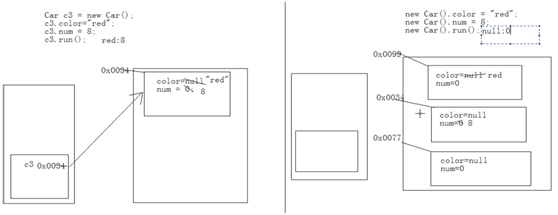
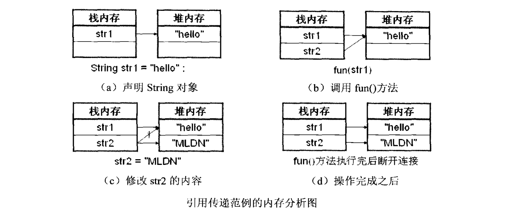

# Java基础知识汇总-面向对象

---

### 面向对象

##### 面向对象的由来

早期的软件开发采用的是结构化的程序开发方式。使用结构化方法开发的软件，其稳定性、可修改性和可重用性都比较差，这是因为结构化方法的本质是功能分解，是围绕实现处理功能的“过程”来构造系统的。然而在软件开发中大部分的用户需求是会随时改变的，所以对于使用结构化开发方式的设计是灾难性的。为了解决软件技术的多变性，并且可以很好地适应用户的变化，产生了面向对象技术。从20世纪70年代开始，相继出现了多种面向对象的程序设计语言，像C++、SmallTalk、Java等都是比较熟知的符合面向对象设计的语言。

##### 面向对象与面向过程

* 面向对象是相对于面向过程而言的；
* 面向对象和面向过程都是一种思想：面向过程，强调的是功能行为；面向对象，将功能封装进对象，强调具备了功能的对象；
* 面向对象是基于面向过程的；

##### 面向对象的三大特征

1）封装性(encapsulation)

它有两个含义：一是指把对象的属性和行为看成一个密不可分的整体，将这两者封装在一个不可分割的独立单位（即对象）中；另一个含义是“信息隐藏”，把不需要让外界知道的信息隐藏起来。

封装机制在程序设计中表现为，把描述对象属性的变量及实现对象功能的方法合在一起，定义为一个程序单位，并保证外界不能任意更改其内部的属性值，也不能任意调动其内部的功能方法。

2）继承性(inheritance)

首先拥有反映事物一般特性的类，然后在其基础上派生出反映特殊事物的类。这样，现在类所描述过的属性及行为，即已定义的变量和方法，在继承产生的类中完全可以使用。被继承的类称为父类、基类或超类，而经继承产生的类称为子类或派生类。根据继承机制，派生类继承超类的所有成员，并相应地增加了自己的一些新成员。

3）多态性(polymorphism)

多态允许程序中出现重名对象，包含方法重载与对象多态两种形式：

* 方法重载：在一个类中，允许多个方法使用同一个名字，但方法的参数不同，完成的功能也不同；
* 对象多态：子类对象可以与父类对象进行相互转换，而且根据其使用的子类的不同，完成的功能也不同；

### 类与对象

##### 类与对象的关系

在面向对象中，类和对象是最基本、最重要的组成单元。类实际上是表示一个客观世界某类群体的一些基本特征抽象，对象就是表示一个个具体的东西。例如，在现实生活中，人就可以表示为一个类，因为人本身属于一种广义的概念，并不是一个具体的事物。而某一个具体的人，就可以称为对象，可以通过各种信息完整地描述这个具体的人，如这个人的姓名、年龄、性别等信息，这些信息在面向对象的概念中就称为属性；当然人是可以吃饭、睡觉的，这些人的行为在类中就称为方法。也就是说如果要使用一个类，就一定要产生对象，每个对象之间是靠各个属性的不同来进行区分的，而每个对象所具备的操作就是类中规定好的方法。

对于同一类事物可以抽取它们具有共性的内容，定义在类中。如生活中的汽车，每一台车都有轮胎数和颜色。那么在通过Java描述汽车这类事物时，就可以将这两个共性属性作为类中的属性进行定义。通过该类建立的每一个汽车实体都具有该属性，并可以有对象特有的属性值。

如上图所示，可以理解为，类就是图纸，汽车就是堆内存中的对象。

##### 类的定义

从类的概念中可以了解到，类是由属性和方法组成的。属性中定义类的一个个具体信息，实际上一个属性就是一个变量，而方法是一些操作的行为。

~~~java
class 类名称 {
	数据类型 属性;
	...
	[修饰符] 返回值类型 方法名称(参数1, 参数2, ...) {
		程序语句;
		[return 表达式];
	}
}
~~~

示例：

~~~java
class Person {
	String name;
	int age;
	public void tell() {
		System.out.println("姓名：" + name + "，年龄：" + age);
	}
}
~~~

##### 对象的创建和使用

~~~java
类名 对象名 = new 类名();

对象名.属性名;
对象名.方法名();
~~~

示例：

~~~java
Person p = new Person();
p.name = "zhangsan";
p.age = 21;
p.tell();
~~~

##### 对象的内存分配

##### 对象的初始化过程

* 将该对象所需的类文件加载进内存；
* 在内存进行方法区的空间分配；
* 通过new在堆内存开辟空间；
* 对象中的属性进行默认初始化；
* 调用对象的构造函数进行初始化；
* 通过构造函数中的super来调用父类的构造函数进行初始化；
* 对象中的属性进行显式初始化；
* 构造代码块初始化；
* 构造函数内部自定义内容初始化；

##### 匿名对象

匿名对象就是没有明确给出名字的对象，一般匿名对象只使用一次。匿名对象在实际开发中基本上都是作为其它类实例化对象的参数传递的。

##### 成员变量和局部变量的区别

* 成员变量定义在类，作用于整个类；局部变量定义在函数，作用于整个函数，或者定义于语句内，作用于整个语句；
* 成员变量在对象创建时，出现在堆内存的对象当中；局部变量在所属区间被运算时，出现在栈内存中；
* 成员变量随着对象的创建而创建，随着对象的消失而消失；局部变量随着所属区间运算结束而立刻被释放；
* 成员变量在堆内存中，有默认初始化值；局部变量没有默认初始化值；

##### 对象的引用强度

从JDK1.2开始，Java把对象的引用分为4种级别，从而使程序能更加灵活地控制对象的声明周期。

* 强引用：当内存不足时，JVM宁可出现OutOfMemoryError而使程序停止，也不会回收此对象来释放空间。
* 软引用：当内存不足时，会回收这些对象的内存，用来实现内存敏感的高速缓存。
* 弱引用：无论内存是否紧张，被垃圾收集器发现就立即回收。
* 虚引用：和没有任何引用一样。

### 构造方法

##### 概念

* 构造方法的名称必须与类的名称一致；
* 构造方法的声明处不能有任何返回值类型的声明；
* 构造方法中是可以有return语句的，但是不能使用return返回一个值；

每一个类中都有一个默认的空参数构造函数，用于给该类对象进行初始化。如果该类中指定了具体的构造函数，那么默认的空参数构造函数就没有了。

##### 构造方法的重载

多个构造函数是以重载的形式存在的。

~~~java
class Person{
	private String name;
	private int age;
	public Person(){
		System.out.println("Person init...");
	}
	public Person(String name){
		this.name = name;
	}
	public Person(int age){
		this.age = age;
	}
	public Person(String name, int age){
		this.name = name;
		this.age = age;
	}
	//getter、setter...
}
~~~

### 引用传递

##### 基本数据类型、引用数据类型的参数传递

~~~java
public class Demo {
	public static void main(String[] args) {
		int x = 2;
		show(x);
		System.out.println(x);
	}
	public static int show(int x) {
		x = 4;
		return x;
	}
}
~~~

~~~java
public class Demo {
	int x = 3;
	public static void main(String[] args) {
		Demo d = new Demo();
		d.x = 5;
		show(d);
		System.out.println(d.x);
	}
	public static void show(Demo d) {
		d.x = 4;
	}
}
~~~

##### 引用传递示例

1）示例一

~~~java
class Demo{
	int temp = 30;
}
public class Test{
	public static void main(String[] args){
		Demo d1 = new Demo();
		d1.temp = 50;
		System.out.println(d1.temp); //50
		fun(d1);
		System.out.println(d1.temp); //1000
	}
	public static void fun(Demo d2){
		d2.temp = 1000;
	}
}
~~~

2）示例二

~~~java
public class Test{
	public static void main(String[] args){
		String str1 = "hello";
		System.out.println(str1); //hello
		fun(str1);
		System.out.println(str1); //hello
	}
	public static void fun(String str2){
		str2 = "MLDN";
	}
}
~~~

3）示例三

~~~java
class Demo{
	String temp = "hello";
}
public class Test{
	public static void main(String[] args){
		Demo d1 = new Demo();
		d1.temp = "world";
		System.out.println(d1.temp); //world
		fun(d1);
		System.out.println(d1.temp); //MLDN
	}
	public static void fun(Demo d2){
		d2.temp = "MLDN";
	}
}
~~~

### 封装

##### 概念

所谓的封装性就是指对外部不可见，即是指隐藏对象的属性和实现细节，仅对外提供公共的访问方式，将不需要对外提供的内容都隐藏起来。

优点：

* 将变化隔离；
* 便于使用；
* 提高复用性；
* 提高安全性；

##### 使用private封装属性

~~~java
class Person{
	String name;
	int age;
	public void print(){
		System.out.println("name:"+name+", age:"+age);
	}
}
public class Test{
	public static void main(String[] args){
		Person p = new Person();
		p.name = "zhangsan";
		p.age = -20;
		p.print();
	}
}
~~~

在上面的程序中，将年龄age设置为-20，这明显是不合理的操作。因此，需要将类中的属性进行封装。

~~~java
class Person{
	private String name;
	private int age;
	public void print(){
		System.out.println("name:"+name+", age:"+age);
	}
}
public class Test{
	public static void main(String[] args){
		Person p = new Person();
		p.name = "zhangsan";
		p.age = -20;
		p.print();
	}
}
~~~

~~~plaintext
error：name has private access in Person
error：age has private access in Person
~~~

将类中的属性加上private关键字之后，就可以保证无法直接去访问类中的属性，但是需要添加相应的setter和getter方法。

~~~java
class Person{
	private String name;
	private int age;
	public void setName(String name){
		this.name = name;
	}
	public String getName(){
		return this.name;
	}
	public void setAge(int age){
		if(age>=0 && age<150){
			this.age = age;
		}
	}
	public int getAge(){
		return this.age;
	}
	public void print(){
		System.out.println("name:"+name+", age:"+age);
	}
}
public class Test{
	public static void main(String[] args){
		Person p = new Person();
		p.setName("zhangsan");
		p.setAge(-20);
		p.print();
	}
}
~~~

在设置age的值时添加了验证的代码，这样就可以避免不合法的赋值操作了。

> 面向对象的封装性不仅仅是指private关键字。

### 继承

##### 概念

继承可以在现有类的基础上进行功能的扩充，通过这种方式能够快速开发出新的类，而不需要编写相同的程序代码。多个类中存在相同属性和行为时，将这些内容抽取到单独一个类中，那么多个类无需再定义这些属性和行为，只要继承那个类即可。这多个类可以称为子类，单独这个类称为父类或者超类。

* 子类可以直接访问父类中的非私有的属性和行为；
* 通过 extends 关键字让类与类之间产生继承关系；
* 继承的出现提高了代码的复用性；
* 继承的出现让类与类之间产生了关系，提供了多态的前提；

~~~plaintext
class 父类{}
class 子类 extends 父类{}
~~~

~~~java
class Person{
	private String name;
	private int age;
	public void setName(String name){
		this.name = name;
	}
	public String getName(){
		return this.name;
	}
	public void setAge(int age){
		this.age = age;
	}
	public int getAge(){
		return this.age;
	}
}
class Student extends Person{
	private String school;
	public void setSchool(String school){
		this.school = school;
	}
	public String getSchool(){
		return this.school;
	}
}
public class Test{
	public static void main(String[] args){
		Student s = new Student();
		s.setName("zhangsan");
		s.setAge(22);
		s.setSchool("XX");
		System.out.println(s);
	}
}
~~~

在使用继承时，子类不能直接访问父类中的私有成员，只能调用父类中的非私有成员。

##### 多继承

在Java中只允许单继承，不能使用多重继承，即一个子类只能继承一个父类。但是允许进行多层继承，即一个子类可以有一个父类，父类还可以有一个父类。

##### 方法的覆写

方法覆写就是指子类定义了与父类中同名的方法。子类中出现与父类一模一样的方法时，会出现覆盖操作，也称为重写或者覆写。父类中的私有方法不可以被覆盖。在子类覆盖方法中，继续使用被覆盖的方法可以通过`super.函数名`获取。

注意：

* 静态方法只能覆盖静态；
* 被子类覆写的方法不能拥有比父类方法更加严格的访问权限；
* 覆盖的方法只能抛出与父类相同的异常或异常的子类；

~~~java
class Person{
	public void print(){
		System.out.println("print Person");
	}
}
class Student extends Person{
	public void print(){
		System.out.println("print Student");
	}
}
~~~

方法覆写时从private变为default不能算是方法覆写，即private方法不能覆写，只相当于在子类新加了一个方法，如下所示：

~~~java
class Person{
	private void print(){
		System.out.println("print Person");
	}
	public void fun(){
        this.print();
	}
}
class Student extends Person{
	void print(){
		System.out.println("print Student");
	}
}
public class Test{
	public static void main(String[] args){
		new Student().fun(); //print Person
	}
}
~~~

##### 方法覆写与方法重载

| 重载                               | 覆写                                     |
| ---------------------------------- | ---------------------------------------- |
| Overloading                        | Overriding                               |
| 方法名称相同，参数的类型或个数不同 | 方法名称、参数的类型、返回值类型全部相同 |
| 对权限没有要求                     | 被覆写的方法不能拥有更严格的权限         |
| 发生在一个类中                     | 发生在继承的类中                         |

### 多态

##### 概念

对象的多态性主要分为以下两种类型：

* 向上转型：子类对象->父类对象
* 向下转型：父类对象->子类对象

1）对象的向上转型

~~~java
class A{
	public void fun1(){
		System.out.println("A fun1");
	}
	public void fun2(){
		this.fun1();
	}
}
class B extends A{
	public void fun1(){
		System.out.println("B fun1");
	}
	public void fun3(){
		System.out.println("fun3");
	}
}
public class Test{
	public static void main(String[] args){
		B b = new B();
		A a = b;
		a.fun1(); //B fun1
	}
}
~~~

虽然使用父类对象调用了fun1方法，但实际上调用的方法是被子类覆写过的方法。也就是说，如果对象发生了向上转型关系后，所调用的方法一定是被子类覆写过的方法。

2）对象的向下转型

~~~java
class A{
	public void fun1(){
		System.out.println("A fun1");
	}
	public void fun2(){
		this.fun1();
	}
}
class B extends A{
	public void fun1(){
		System.out.println("B fun1");
	}
	public void fun3(){
		System.out.println("fun3");
	}
}
public class Test{
	public static void main(String[] args){
		A a = new B();
		B b = (B)a;
		b.fun1(); //B fun1
		b.fun2(); //B fun1
		b.fun3(); //fun3
	}
}
~~~

如果想要调用子类自己的方法，则一定只能用子类声明对象。向下转型的对象其本身必须是子类对象，否则会发生转换异常。

##### 多态下成员变量、成员函数、静态函数的特征

1）成员变量

* 编译时期：参考的是引用型变量所属的类中是否有调用的成员变量，如果有则编译通过，否则编译失败；
* 运行时期：调用的也是引用型变量所属类中的成员变量；

简单说，编译和运行都看等号的左边。

2）成员函数

* 编译时期：参考的是引用型变量所属的类中是否有调用的方法，如果有则编译通过，否则编译失败；
* 运行时期：参考的是对象所属的类中是否有调用的方法，如果有就运行子类自己的，否则运行父类的方法；

因为函数有一个覆盖的特性，非静态方法需要和当前运行的对象进行动态绑定，哪个对象调用了这个方法，这个方法就属于哪个对象，就会运行那个对象中的方法。简单说，编译时期看左边，运行时期看右边。

3）静态函数

* 编译时期：参考的是引用型变量所属的类中是否有该方法；
* 运行时期：参考的也是引用型变量所属的类中的该方法；

因为静态方法是属于类的，不属于对象，它会在类加载的时候，静态绑定到所属的类上。简单说，编译和运行都看等号的左边。

##### 多态的应用

~~~java
abstract class Animal{
	public abstract void eat();
}
class Dog extends Animal{
	public void eat(){
		System.out.println("Dog eat...");
	}
}
class Pig extends Animal{
	public void eat(){
		System.out.println("Pig eat...");
	}
}
public class Test{
	public static void main(String[] args){
		feed(new Dog());
		feed(new Pig());
	}
	public static void feed(Dog dog){
		dog.eat();
	}
	public static void feed(Pig pig){
		pig.eat();
	}
}
~~~

当每增加一个Animal的子类，feed方法就要重载一次。这样如果功能扩充，还必须修改类本身。

~~~java
abstract class Animal{
	public abstract void eat();
}
class Dog extends Animal{
	public void eat(){
		System.out.println("Dog eat...");
	}
}
class Pig extends Animal{
	public void eat(){
		System.out.println("Pig eat...");
	}
}
public class Test{
	public static void main(String[] args){
		feed(new Dog());
		feed(new Pig());
	}
	public static void feed(Animal a){
		a.eat();
	}
}
~~~

在feed()方法中使用了对象的多态性，所以可以接收任意的子类对象。这样无论子类如何增加，feed()方法都不用作任何修改。

### this

##### 概念

this代表其所在函数所属对象的引用。

##### 调用本类中的属性

~~~java
class Person{
	private String name;
	private int age;
	public Person(String n, int a){
		name = n;
		age = a;
	}
	public String getInfo(){
		return "姓名："+name+"，年龄："+age+"。";
	}
}
~~~

从构造方法传递的两个参数名称上很难看出表示的意义，所以为了可以清楚表示参数的意义，程序改造如下：

~~~java
class Person{
	private String name;
	private int age;
	public Person(String name, int age){
		name = name;
		age = age;
	}
	public String getInfo(){
		return "姓名："+name+"，年龄："+age+"。";
	}
}
public class Test{
	public static void main(String[] args){
		Person p = new Person("zhangsan", 22);
		System.out.println(p.getInfo()); //姓名：null，年龄0。
	}
}
~~~

此时并没有把从构造方法传递进去的参数赋值给对象的属性。利用this关键字，代码修改如下：

~~~java
class Person{
	private String name;
	private int age;
	public Person(String name, int age){
		this.name = name;
		this.age = age;
	}
	public String getInfo(){
		return "姓名："+name+"，年龄："+age+"。";
	}
}
public class Test{
	public static void main(String[] args){
		Person p = new Person("zhangsan", 22);
		System.out.println(p.getInfo()); //姓名：zhangsan，年龄22。
	}
}
~~~

##### 调用构造方法

如果一个类中有多个构造方法，可以利用this关键字相互调用。

~~~java
class Person{
	private String name;
	private int age;
	public Person(){
		System.out.println("hello");
	}
	public Person(String name, int age){
		this();
		this.name = name;
		this.age = age;
	}
	public String getInfo(){
		return "姓名："+name+"，年龄："+age+"。";
	}
}
public class Test{
	public static void main(String[] args){
		Person p = new Person("zhangsan", 22); //hello
		System.out.println(p.getInfo()); //姓名：zhangsan，年龄22。
	}
}
~~~

1）使用this调用构造方法必须放在构造方法的第一行，否则编译失败

~~~java
class Person{
	private String name;
	private int age;
	public Person(){
		System.out.println("hello");
	}
	public Person(String name, int age){
		this.name = name;
		this.age = age;
		this();
	}
	public String getInfo(){
		return "姓名："+name+"，年龄："+age+"。";
	}
}
~~~

~~~plaintext
error: call to this must be first statement in constructor
~~~

2）使用this调用构造方法时一定要留一个构造方法作为出口，即程序中至少存在一个构造方法不使用this调用其他构造方法

~~~java
class Person{
	private String name;
	private int age;
	public Person(){
		this("zhangsan", 22);
	}
	public Person(String name){
		this();
		this.name = name;
	}
	public Person(String name, int age){
		this(name);
		this.age = age;
	}
	public String getInfo(){
		return "姓名："+name+"，年龄："+age+"。";
	}
}
~~~

~~~plaintext
error: recursive constructor invocation
~~~

##### 表示当前对象

this表示当前对象，当前对象就是指当前正在调用类中方法的对象。

~~~java
class Person{
	private String name;
	private int age;
	public Person(String name, int age){
		this.name = name;
		this.age = age;
	}
	public boolean compare(Person p){
		if(this==p){
			return true;
		}
		if(this.getName.equals(p.getName()) && this.getAge()==p.getAge()){
			return true;
		}
		return false;
	}
	public String getInfo(){
		return "姓名："+name+"，年龄："+age+"。";
	}
}
public class Test{
	public static void main(String[] args){
		Person p1 = new Person("zhangsan", 22);
		Person p2 = new Person("zhangsan", 22);
		p1.compare(p2); //true
	}
}
~~~

### super

##### 概念

使用super关键字可以从子类中调用父类中的构造方法、普通方法和属性。

##### 调用父类中的属性

##### 调用父类中的普通方法

##### 调用父类中的构造方法

在继承的操作中，子类对象在实例化之前必须先调用父类的构造方法后再调用子类自己的构造方法。

~~~java
class Person{
	public Person(){
		System.out.println("Person run...");
	}
}
class Student{
	public Student(){
		System.out.println("Student run...");
	}
}
public class Test{
	public static void main(String[] args){
		Student s = new Student();
	}
}
~~~

~~~plaintext
Person run...
Student run...
~~~

由此可见，子类对象实例化之前会先默认调用父类的构造方法。实际上，在子类的构造方法中隐含了一个`super()`的语句，如下：

~~~java
class Person{
	public Person(){
		System.out.println("Person run...");
	}
}
class Student{
	public Student(){
		super();
		System.out.println("Student run...");
	}
}
public class Test{
	public static void main(String[] args){
		Student s = new Student();
	}
}
~~~

默认情况下，子类构造方法会使用`super()`来调用父类中的空参数构造方法。如果要调用父类中其它的构造方法，就应该使用super调用父类中的指定构造方法。

~~~java
class Person{
	public Person(){
		System.out.println("Person run...");
	}
	public Person(String name){
		System.out.println("Person run..." + name);
	}
}
class Student{
	public Student(){
		super();
		System.out.println("Student run...");
	}
	public Student(String name){
		super(name);
		System.out.println("Student run..." + name);
	}
}
public class Test{
	public static void main(String[] args){
		Student s = new Student("zhangsan");
	}
}
~~~

> super语句必须放在子类构造方法的第一行。

##### this和super的区别

| 区别点   | this                                                       | super                                        |
| -------- | ---------------------------------------------------------- | -------------------------------------------- |
| 属性访问 | 访问本类中的属性，如果本类中没有此属性，则从父类中继续查找 | 访问父类中的属性                             |
| 方法     | 访问本类中的方法，如果本类中没有此方法，则从父类中继续查找 | 直接访问父类中的方法                         |
| 调用构造 | 调用本类构造方法，必须放在构造方法的首行                   | 调用父类构造方法，必须放在子类构造方法的首行 |
| 特殊     | 表示当前对象                                               | 无此概念                                     |

this代表本类对象的引用，super代表父类所属的空间。在子类所有构造函数的第一行，都有一条隐式的语句：super()；如果父类中没有空参数的构造函数，子类构造函数中必须手动用super来指定要调用父类的构造函数。this和super调用构造函数都只能定义在构造函数的第一行，且不能同时出现。

### static

##### 概念

* 被static修饰的成员变量，会被所有对象共享；
* 静态成员随着类的加载而加载，随着类的消失而消失，并且优先于对象存在；
* 静态成员可以直接被类名调用；
* 静态方法只能调用静态成员，不能调用非静态成员；非静态方法既可以调用静态成员又可以调用非静态成员；
* 在静态方法中不允许出现this、super等关键字；

##### 使用static声明属性

如果在程序中使用static声明属性，则此属性称为全局属性（也叫静态属性）。

~~~java
class Person{
	private String name;
	private int age;
	String country = "A City";
	public String getInfo(){
		return "姓名："+name+"，年龄："+age+"，城市："+country+"。";
	}
}
~~~

如果country由A City改为B City，并且此时已经产生了很多对象，那么就意味着，如果要修改这些对象的城市信息，则要把这些全部的对象中的城市信息同时修改，这样做肯定是不合理的。最好的做法是一次性修改之后，所有对象的城市信息都可以修改。此时就可以把城市的属性使用static关键字进行声明。

~~~java
class Person{
	private String name;
	private int age;
	static String country = "A City";
	public String getInfo(){
		return "姓名："+name+"，年龄："+age+"，城市："+country+"。";
	}
}
~~~

类属性调用

~~~java
// 类名称.static属性
Person.country = "A City";
~~~

##### 使用static声明方法

static也可以用来声明方法，用它声明的方法也被称为类方法。

~~~java
class Person{
	private String name;
	private int age;
	static String country = "A City";
	public static void fun(){
		System.out.println("hello");
	}
	public String getInfo(){
		return "姓名："+name+"，年龄："+age+"，城市："+country+"。";
	}
}
~~~

非static声明的方法可以去调用static声明的属性或方法，但是static声明的方法不能调用非static声明的属性或方法。

### final

##### 概念

final在Java中表示的意思是最终，也可以称为完结器。final修饰符既可以修饰类，又可以修饰方法，还可以修饰变量。使用final关键字声明的类、方法、属性具有以下特点：

* 使用final声明的类不能被继承，不能有子类；
* 使用final声明的方法不能被子类所覆写；
* 使用final声明的变量即成为常量，常量不可以修改；
* 内部类只能访问被final修饰的局部变量；

~~~java
final class A{}
class B extends A{}
~~~

~~~plaintext
error: cannot inherit from final A
~~~

~~~java
class A{
	public final void print(){
		System.out.println("A");
	}
}
class B extends A{
	public final void print(){
		System.out.println("B");
	}
}
~~~

~~~plaintext
error: print() in B cannot override print() in A; overridden method is final
~~~

~~~java
class A{
	private final String INFO = "hello world!";
	public final void print(){
		INFO = "A";
	}
}
~~~

~~~plaintext
error: cannot assign a value to final variable INFO
~~~

### instanceof

##### 概念

使用instanceof关键字可以判断一个对象到底是哪个类的实例。

~~~java
class A{}
class B extends A{}
public class Test{
	public static void main(String[] args){
		A a1 = new A();
		System.out.println(a1 instanceof A); //true
		System.out.println(a1 instanceof B); //false
		A a2 = new B();
		System.out.println(a2 instanceof A); //true
		System.out.println(a2 instanceof B); //true
	}
}
~~~

> 在进行对象的向下转型关系前最好先使用instanceof关键字进行判断后再进行相应的转换操作，这样可以避免类型转换异常的出现。

### main方法

##### main方法说明

* public：表示此方法可以被外部调用；
* static：表示此方法可以被类名直接调用；
* void：主方法是程序的起点，所以不需要任何的返回值；
* main：系统规定好默认调用的方法名称；

##### main方法的参数

1）main方法参数传递的形式

~~~plaintext
java 类名称 参数1 参数2 参数3 ...
~~~

2）获取main方法参数

~~~java
public class Demo{
	public static void main(String[] args){
		for(int i=0; i<args.length; i++){
			System.out.println("第"+(i+1)+"个参数："+args[i]);
		}
	}
}
~~~

> 如果传递的参数中包含空格，可以使用"括起来。如："zhang san"、"xiao ming"。

### 代码块

##### 概念

所谓的代码块，是指使用"{}"括起来的一段代码。根据位置的不同，代码块可以分为普通代码块、构造代码块、静态代码块、同步代码块等。

##### 普通代码块

普通代码块就是指直接在方法或是语句中定义的代码块。

~~~java
public class Demo{
	public static void main(String[] args){
		{
			int x = 10;
			System.out.println(x); //10
		}
		int x = 20;
		System.out.println(x); //20
	}
}
~~~

##### 静态代码块

静态代码块是指使用static关键字声明的代码块。

~~~java
class Demo{
	public Demo(){
		System.out.println("构造方法...");
	}
	{
		System.out.println("构造代码块...");
	}
	static{
		System.out.println("静态代码块...");
	}
}
public class Test{
	public static void main(String[] args){
		new Demo();
	}
	static{
		System.out.println("main方法的静态代码块...");
	}
}
~~~

~~~plaintext
main方法的静态代码块...
静态代码块...
构造代码块...
构造方法...
~~~

不管产生多少个对象，静态代码块只执行一次。

##### 构造代码块

构造代码块是直接写在类中的代码块。

~~~java
class Demo{
	public Demo(){
		System.out.println("1");
	}
	public Demo(int x){
		System.out.println("2");
	}
	{
		System.out.println("3");
	}
}
public class Test{
	public static void main(String[] args){
		new Demo(); //3  1
		new Demo(); //3  1
		new Demo(1); //3  2
	}
}
~~~

构造代码块优先于构造方法执行，而且每次实例化对象都会执行构造代码块中的代码，会执行多次。

##### 同步代码块

同步代码块是指使用synchronized关键字声明的代码块。

~~~java
class Ticket implements Runnable {
	private int num = 100;
	Object lock = new Object();
	@Override
	public void run() {
		while(true) {
			synchronized(lock) {
				if(num>0) {
					try {
						Thread.sleep(100);
					} catch (InterruptedException e) {
						e.printStackTrace();
					}
					System.out.println(Thread.currentThread().getName() + "===" + num--);
				}
			}
		}
	}
}
~~~

##### 静态代码块的一些问题

~~~java
public class Demo{
	static{
		System.out.println("hello world!");
	}
}
~~~

~~~plaintext
hello world!
Exception in thread "main" java.lang.NoSuchMethodError: main
~~~

~~~java
public class Demo{
	static{
		System.out.println("hello world!");
		System.exit(1); //直接退出，可以避免程序寻找主方法
	}
}
~~~

~~~java
public class Demo{
	public static void main(String[] args){
		System.out.println("hello world!");
	}
	static{
		System.exit(0);
	}
}
~~~

上述代码静态代码块会先于main函数执行，这种情况在JDK1.7之后才不被允许。

##### 代码块应用示例

~~~java
class StaticCode {
	static {
		System.out.println("A");
	}
	public void show() {
		System.out.println("B");
	}
}
public class Demo {
	static {
		System.out.println("C");
	}
	public static void main(String[] args) {
		new StaticCode().show();
	}
	static {
		System.out.println("D");
	}
}

//C、D、A、B
~~~

### 内部类

##### 概念

在类内部可以定义成员变量与方法，而且在类内部也可以定义另一个类。将一个类定义在另一个类的里面，对里面那个类就称为内部类（内置类，嵌套类）。如果在类Outer的内部再定义另一个类Inner，此时类Inner就称为内部类，而类Outer就称为外部类。

特点：

* 内部类可以直接访问外部类中的成员，包括私有成员；
* 外部类要访问内部类中的成员必须要建立内部类的对象；

~~~java
标识符 class 外部类{
	//外部类成员
	标识符 class 内部类{
		//内部类成员
	}
}
~~~

1）基本示例

~~~java
class Outer{
	private String info = "hello world!";
	class Inner{
		private void print(){
			System.out.println(info);
		}
	}
	public void fun(){
		new Inner().print();
	}
}
public class Test{
	public static void main(String[] args){
		new Outer().fun();
	}
}
~~~

2）将内部类放到外部

~~~java
class Outer{
	private String info = "hello world!";
	public String getInfo(){
		return this.info;
	}
	public void fun(){
		new Inner(this).print();
	}
}
class Inner{
	private Outer out = null;
	public Inner(Outer out){
		this.out = out;
	}
	private void print(){
		System.out.println(out.getInfo());
	}
}
public class Test{
	public static void main(String[] args){
		new Outer().fun();
	}
}
~~~

3）在外部访问内部类

~~~plaintext
外部类.内部类 内部类对象 = 外部类实例.new 内部类();
~~~

~~~java
class Outer{
	private String info = "hello world!";
	class Inner{
		public void print(){
			System.out.println(info);
		}
	}
}
public class Test{
	public static void main(String[] args){
		//Outer out = new Outer();
		//Outer.Inner in = out.new Inner();
		Outer.Inner in = new Outer().new Inner();
		in.print();
	}
}
~~~

4）内部类可以直接访问外部类中的成员，因为内部类持有外部类的一个引用，即`外部类名.this`；外部类要访问内部类中的成员必须先创建内部类对象。

~~~java
class Outer {
	int num = 4;
	//内部类 
	class Inner {
		int num = 5;
		void method() {
			int num = 6;
			System.out.println("method run1 .."+num);
			System.out.println("method run2 .."+this.num);
			System.out.println("method run3 .."+Outer.this.num);
		}
	}
	public void show() {
		Inner in = new Inner();
		in.method();
		System.out.println("num="+this.num);
	}
}
public class Demo {
	public static void main(String[] args) {
		new Outer().show();
	}
}
~~~

5）当内部类定义在外部类的成员位置上时，可以被private、static成员修饰符修饰。被static修饰的内部类只能访问外部类中的静态成员。

~~~java
class Outer {
	class Inner1{
		public void func() {}
	}
	static class Inner2{
		public static void func() {}
	}
}
public class Demo {
	public static void main(String[] args) {
		Outer.Inner1 in1 = new Outer().new Inner1();
		in1.func();

		Outer.Inner2 in2 = new Outer.Inner2();
		in2.func();
		Outer.Inner2.func();
	}
}
~~~

6）当内部类定义在局部位置上时，也可以直接访问外部类中的成员。但是不允许访问局部中的变量，只能访问被final修饰的局部常量。

~~~java
class Outer {
	public void show(final int y) {
		final int x = 1;
		class Inner {
			public void func() {
				System.out.println(x+y);
			}
		}
	}
}
~~~

内部类定义在局部位置上，访问到了局部变量必须修饰成final；如show方法执行完弹栈，变量x就销毁了；而inner的对象分配在堆中，还没有被销毁，他的引用可能还在，当再次调用inner的func方法时就访问不到x变量了。

> 内部类定义后，生成的class文件是以Outer$Inner.class的形式存在的，在Java程序中可以将$替换为.。

##### 静态内部类

内部类也可以使用static关键字来声明。用static声明的内部类就相当于变成了外部类，但是用static声明的内部类不能访问非static的外部类成员。

内部类被静态修饰，出现访问局限性，只能访问外部类中的静态成员。 内部类被静态后，会随着外部类的加载而加载。如果内部类中定义了静态成员，该内部类必须被静态修饰。 

~~~java
//访问静态内部类中的非静态成员: 直接创建内部类对象。
外部类名.内部类名 变量名 = new 外部类名.内部类名();

//访问静态内部类中的静态成员: 不需要对象。
外部类名.内部类名.内部类的静态成员
~~~

> 记住：内部类只有定义在外部类的成员位置上，才具备这些修饰符。

~~~java
class Outer{
	private static String info = "hello world!";
	static class Inner{
		public void print(){
			System.out.println(info);
		}
	}
}
public class Test{
	public static void main(String[] args){
		new Outer.Inner().print();
	}
}
~~~

~~~java
class Outer {
	private static int num = 4;
	static class Inner {
		void method() {
			System.out.println("method run .."+num);
		}
		static void function() {
			System.out.println("function run..."+num);
		}
	}
	public void show() {
		Inner in = new Inner();
		in.method();
	}
}

public class Demo {
	public static void main(String[] args) {
		new Outer().show();
		Outer out = new Outer();
		out.show();
		//直接在其他类中，访问一个类的内部类。
		Outer.Inner in = new Outer().new Inner();
		in.method();

		//访问静态内部类中的非静态成员: 直接new内部类对象,调用内部类中的非静态成员method.
		Outer.Inner  in = new Outer.Inner();
		in.method();
		//访问静态内部类中的静态成员: 不需要对象。
		Outer.Inner.function();	
	}
}
~~~

##### 局部内部类

内部类定义在局部位置上（比如方法内部）则称为局部内部类。

~~~java
class Outer{
	private String info = "hello world!";
	public void fun(final int temp){
		class Inner{
			public void print(){
				System.out.println(info);
				System.out.println(temp);
			}
		}
		new Inner().print();
	}
}
public class Test{
	public static void main(String[] args){
		new Outer().fun(10);
	}
}
~~~

在方法中定义的内部类不能直接访问方法中的参数。如果方法中的参数想要被内部类所访问，则参数必须加上final关键字。

##### 匿名内部类

匿名内部类就是内部类的简化写法。简单理解，就是建立一个带内容的外部类或者接口的子类匿名对象。

什么时候使用匿名内部类呢？通常在使用方法是接口类型参数，并且该接口中的方法不超过三个时，可以将匿名内部类作为参数传递，增强阅读性。

~~~java
interface A{
	public void print();
}
public class Test{
	public static void fun(A a){
		a.print();
	}
	public static void main(String[] args){
		fun(new A(){
			public void print(){
				System.out.println("hello world!");
			}
		});
	}
}
~~~

##### 内部类的扩展

在一个抽象类中可以定义多个接口或抽象类，在一个接口中也可以定义多个抽象类或接口。

1）在抽象类中定义接口

~~~java
abstract class A{
	public abstract void printA();
	interface B{
		public void printB();
	}
}
class X extends A{
	public void printA(){
		System.out.println("A");
	}
	class Y implements B{
		public void printB(){
			System.out.println("B");
		}
	}
}
public class Test{
	public static void main(String[] args){
		A.B b = new X().new Y();
		b.printB();
	}
}
~~~

2）在接口中定义抽象类

~~~java
interface A{
	public void printA();
	abstract class B{
		public abstract void printB();
	}
}
class X implements A{
	public void printA(){
		System.out.println("A");
	}
	class Y extends B{
		public void printB(){
			System.out.println("B");
		}
	}
}
public class Test{
	public static void main(String[] args){
		A.B b = new X().new Y();
		b.printB();
	}
}
~~~

### 抽象类

##### 概念

抽象就是从多个事物中将共性的，本质的内容抽取出来。Java中可以定义没有方法体的方法，该方法的具体实现由子类完成，该方法称为抽象方法，包含抽象方法的类就是抽象类。多个对象都具备相同的功能，但是功能具体内容有所不同，那么在抽取过程中，只抽取了功能定义，并未抽取功能主体，那么就只有功能声明，没有功能主体的方法称为抽象方法。

抽象类的作用类似“模板”，其目的是要设计者依照它的格式来修改并创建新的类。但是并不能直接由抽象类创建对象，只能通过抽象类派生出的新类，再由它来创建对象。实际上抽象类就是比普通类多定义了一个抽象方法，除了不能直接进行对象的实例化操作之外并没有任何的不同。

抽象类的创建及使用规则如下：

* 抽象类和抽象方法必须用abstract关键字来修饰；
* 包含抽象方法的类必须是抽象类；
* 抽象方法只需要声明而不需要实现，只有方法声明，没有方法体，定义在抽象类中；
* 抽象类不可以被实例化，也就是不可以用new创建对象；
* 抽象类必须被子类继承，子类（如果不是抽象类）必须覆写抽象类中的全部抽象方法，否则该子类也是抽象类；
* 抽象类中可以没有抽象方法；
* 抽象关键字不能和final、static、private关键字共存；

~~~java
abstract class A{
	public abstract void print();
}
class B extends A{
	public void print(){
		System.out.println("hello world!");
	}
}
~~~

> 抽象方法不要使用private声明，因为抽象方法必须被子类覆写，而private声明的方法子类是无法覆写的。

##### 抽象内部类

抽象类中依然可以定义内部的抽象类，而实现的子类也可以根据需要选择是否定义内部类来继承抽象内部类。

~~~java
abstract class A {
	abstract class B {
		public abstract void print();
	}
}
class X extends A {
	class Y extends B {
		public void print() {}
	}
}
~~~

使用 static 声明的内部抽象类就相当于是一个外部的抽象类，继承的时候使用 “外部类.内部类”的形式表示类名称。

~~~java
abstract class A {
	static abstract class B {
		public abstract void print();
	}
}
class X extends A.B {
	public void print() {
		System.out.println("X");
	}
}
public class Test {
	public static void main(String[] args) {
		A.B ab = new X();
		ab.print();
	}
}
~~~

隐藏抽象类子类

~~~java
abstract class A {
	public abstract void print();
	private static class B extends A {
		public void print() {}
	}
	public static A getInstance() {
		return new B();
	}
}
public class Test {
	public static void main(String[] args) {
		A a = A.getInstance();
		a.print();
	}
}
~~~

这样的设计在系统类库中会比较常见，目的是为用户隐藏不需要知道的子类。

### 接口

##### 概念

接口可以被理解为一种特殊的类，是由全局常量和公共的抽象方法组成。

* 接口是对外暴露的规则；
* 接口是程序的功能扩展；
* 接口的出现降低了耦合性；
* 接口可以用来多实现；
* 类与接口之间是实现关系，而且类可以继承一个类的同时实现多个接口；
* 接口与接口之间可以有继承关系；

~~~java
interface 接口名称{
	全局常量;
	抽象方法;
}
~~~

~~~java
interface A{
	public static final String INFO = "hello world!";
	public abstract void print();
	public abstract String getInfo();
}
~~~

接口中的全局常量可以省略掉`public static final`，抽象方法可以省略掉`public abstract`，所以上述代码简化如下：

~~~java
interface A{
	String INFO = "hello world!";
	void print();
	String getInfo();
}
~~~

1）实现接口

接口若要使用也必须通过子类，子类通过implements关键字实现接口。

~~~java
class 子类 implements 接口A,接口B,...{
	
}
~~~

~~~java
interface A{
	String INFO = "hello world!";
	void print();
	String getInfo();
}
interface B{
	public void say();
}
class X implements A,B{
	public void print(){
		System.out.println("A");
	}
	public String getInfo(){
		return INFO;
	}
	public void say(){
		System.out.println("B");
	}
}
public class Test{
	public static void main(String[] args){
		X x = new X();
		x.print();
		x.say();
	}
}
~~~

2）继承抽象类并实现接口

~~~java
class 子类 extends 抽象类 implements 接口A,接口B,...{
	
}
~~~

~~~java
interface A{
	String INFO = "hello world!";
	void print();
	String getInfo();
}
abstract class B{
	public abstract void say();
}
class X extends B implements A{
	public void print(){
		System.out.println("A");
	}
	public String getInfo(){
		return INFO;
	}
	public void say(){
		System.out.println("B");
	}
}
public class Test{
	public static void main(String[] args){
		X x = new X();
		x.print();
		x.say();
	}
}
~~~

3）抽象类实现接口

~~~java
interface A{
	String INFO = "hello world!";
	void print();
	String getInfo();
}
abstract class B implements A{ //此时抽象类中存在3个抽象方法
	public abstract void say();
}
class X extends B{
	public void print(){
		System.out.println("A");
	}
	public String getInfo(){
		return INFO;
	}
	public void say(){
		System.out.println("B");
	}
}
public class Test{
	public static void main(String[] args){
		X x = new X();
		x.print();
		x.say();
	}
}
~~~

4）接口的继承

在Java中接口是不能继承抽象类的，但是允许一个接口继承多个接口。

~~~java
interface 子接口 extends 父接口A,父接口B,...{

}
~~~

~~~java
interface A{
	public void printA();
}
interface B{
	public void printB();
}
interface C extends A,B{
	public void printC();
}
class X implements C{
	public void printA(){
		System.out.println("A");
	}
	public void printB(){
		System.out.println("B");
	}
	public void printC(){
		System.out.println("C");
	}
}
~~~

5）接口的一些特殊示例

~~~java
interface A {
	void showA();
}
interface B {
	void showB();
}
interface C extends A,B {
	void showC();
}
class D implements C {
	public void showA() {}
	public void showB() {}
	public void showC() {}
}
~~~

~~~java
class A {
	public void show() {}
}
interface B {
	public void show();
}
class C extends A implements B {
	public void show() {}
}

//这种情况下C中可以不写show方法，继承A的show方法可以作为B接口的实现
~~~

##### 接口的应用示例

~~~java
interface USB {
	public void enable();
	public void disable();
}

class NoteBook {
	public void run() {
		System.out.println("notebook ");
	}
	public void useUSB(USB u) { //接口类型的变量一定指向自己的子类对象。
		if(u!=null) {
			u.enable();
			u.disable();
		}
	}
}

class UDisk implements USB {
	public void enable() {
		System.out.println("udisk enable");	
	}
	public void disable() {
		System.out.println("udisk disable");	
	}
}

class UMouse implements USB {
	public void enable() {
		System.out.println("UMouse enable");	
	}
	public void disable() {
		System.out.println("UMouse disable");	
	}
}

public class NoteBookDemo {
	public static void main(String[] args) {
		NoteBook book = new NoteBook();
		book.run();
		book.useUSB(null);
		book.useUSB(new UDisk());
		book.useUSB(new UMouse());
	}
}
~~~

##### 抽象类与接口的区别

| 区别点       | 抽象类                                   | 接口                                   |
| ------------ | ---------------------------------------- | -------------------------------------- |
| 定义         | 包含抽象方法的类                         | 抽象方法和全局常量的集合               |
| 组成         | 构造方法、抽象方法、普通方法、常量、变量 | 常量、抽象方法                         |
| 使用         | 子类继承抽象类（extends）                | 子类实现接口（implements）             |
| 关系         | 抽象类可以实现多个接口                   | 接口不能继承抽象类，但允许继承多个接口 |
| 常见设计模式 | 模板设计                                 | 工厂设计、代理设计                     |
| 局限         | 抽象类有单继承的局限                     | 接口没有此局限                         |
| 实际         | 作为一个模板                             | 作为一个标准或表示一种能力             |

* 类与类之间是继承关系，而且是单继承；
* 类与接口之间是实现关系，而且是多实现；
* 接口与接口之间是继承关系，而且是多继承；

##### 抽象类与接口的综合使用

~~~java
interface A{
	public void show1();
	public void show2();
	public void show3();
	public void show4();
}
class B implements A{
	public void show1(){
		System.out.println("show1");
	}
	public void show2(){}
	public void show3(){}
	public void show4(){}
}
class C implements A{
	public void show1(){}
	public void show2(){
		System.out.println("show2");
	}
	public void show3(){}
	public void show4(){}
}
~~~

接口A有4个方法，但是实现类B只关注show1方法，C只关注show2方法，却不得不实现所有的方法。现在在接口与实现类之间加一层抽象类，只做空实现，具体的实现类只需覆盖相应的方法就可以了。

~~~java
interface A{
	public void show1();
	public void show2();
	public void show3();
	public void show4();
}
abstract class D implements A{
	public void show1(){}
	public void show2(){}
	public void show3(){}
	public void show4(){}
}
class B extends D{
	public void show1(){
		System.out.println("show1");
	}
}
class C extends D{
	public void show2(){
		System.out.println("show2");
	}
}
~~~

### 包

##### 概念

在Java中，可以将一个大型项目中的类分别独立出来，分门别类的存到文件里，再将这些文件一起编译执行，这样的程序代码将更易于维护。包（package）是在使用多个类或接口时，为了避免名称重复而采取的一种措施。

~~~java
package 包名称.子包名称;
~~~

示例：

~~~java
package test.demo;
public class Demo{
	public static void main(String[] args){
		System.out.println("hello world!");
	}
}
~~~

因为程序是在包中的，所以此时完整的类名称应该是"包名.类名"，程序编译运行如下：

~~~plaintext
javac -d . Demo.java
java test.demo.Demo
~~~

##### import

如果几个类存放在不同的包中，则在使用类时就必须通过import语句导入。

~~~java
import 包名.子包名.类名;
import 包名.子包名.*;
~~~

> 如果在一个程序中同时导入了两个包的同名类，在使用时就必须明确地写出完整的类名。

##### 静态导入

在JDK1.5之后提供了静态导入的功能。如果一个类中的方法全部都是使用static声明的静态方法，则在导入时就可以直接使用`import static`的方式导入。

1）示例一

~~~java
package cn.seasand.utils;
public class Cal{
	public static int add(int x, int y){
		return x+y;
	}
	public static int sub(int x, int y){
		return x-y;
	}
	public static int multi(int x, int y){
		return x*y;
	}
	public static int div(int x, int y){
		return x/y;
	}
}
~~~

~~~java
package cn.seasand.test;
import static cn.seasand.utils.Cal.*;
public class Test{
	public static void main(String[] args){
		add(1,1);
		sub(1,1);
		multi(1,1);
		div(1,1);
	}
}
~~~

2）示例二

~~~java
import static java.util.Collections.sort;
import static java.lang.System.*;

public class Demo {
	public static void main(String[] args) {
		out.println("Hello world!");

		List<String> list = new ArrayList<String>();
		sort(list);
	}
}
~~~

##### jar包

开发完的Java程序往往会包含大量的class文件，这些class文件如果直接交付给用户，会造成不必要的麻烦。JDK中提供了jar命令，可以将class文件打成一个jar包。当用户得到一个jar文件后，即可通过设置classpath的方式在系统中注册好此jar文件，这样jar包中的类就能供程序使用了，相当于加上了一层文件夹。

JDK中jar命令示例：

jar命令的主要参数：

* C：创建新的文档；
* T：查看文档；
* X：解压缩文档；
* V：生成详细的输出信息；
* F：指定存档的文件名；
* M：加入自定义清单信息；

使用示例：

~~~plaintext
创建：
jar -cvf demo.jar packa packb Demo.class

查看：
jar -tvf demo.jar

解压缩：
jar -xvf demo.jar

自定义jar包的清单文件：
jar -cvfm demo.jar manifest.txt mypack
~~~

MANIFEST清单文件：

`manifest.mf`清单文件通常应用于Java制作的图形界面程序，在清单文件中定义：

~~~plaintext
Main-Class:[空格]带有主函数的类名
[回车]
~~~

再设置一下jar文件的打开方式通过javaw –jar就可以双击执行了。

### 访问控制权限

##### 概念

Java中一共存在4种访问控制权限：

* public：公共访问权限，如果一个类中的成员使用了public访问权限，就可以在所有的类中被访问，而不管是否在同一个包中；
* protected：受保护的访问权限，如果一个类中的成员使用了protected访问权限，则只能被本包及不同包的子类访问；
* default：如果类中的成员没有使用任何的访问权限声明，则就是默认访问权限，可以被本包中的其它类所访问，但是不能被其它包中的类所访问；
* private：私有访问权限，一旦一个类中的成员使用了private访问权限，则只能在本类中被访问；

##### 访问控制权限表

|            | public | protected | default | private |
| ---------- | ------ | --------- | ------- | ------- |
| 同一个类中 | ok     | ok        | ok      | ok      |
| 同一个包中 | ok     | ok        | ok      |         |
| 子包       | ok     | ok        |         |         |
| 不同包中   | ok     |           |         |         |

### Object类

##### 概念

在Java中所有的类都有一个公共的父类Object，一个类只要没有明显地继承另一个类，那就是Object的子类。

~~~java
class Person{}
class Person extends Object{}
~~~

##### Object主要方法一览

| 方法名称                          | 描述                   |
| --------------------------------- | ---------------------- |
| public Object()                   | 构造方法               |
| public boolean equals(Object obj) | 对象比较               |
| public int hashCode()             | 获取hash值             |
| public String toString()          | 对象打印时的字符串形式 |

##### toString方法

~~~java
class Person{
	private String name;
	private int age;
	public Person(String name, int age){
		this.name = name;
		this.age = age;
	}
	public String toString(){
		return "name:"+name+", age:"+age;
	}
}
public class Test{
	public static void main(String[] args){
		Person p = new Person("zhangsan", 22);
		System.out.println(p);
		System.out.println(p.toString());
	}
}
~~~

对象输出时会默认调用toString()方法打印内容。

##### equals方法

Object类提供的equals方法默认是比较地址的。可以在子类中覆盖此方法以达到比较自定义内容的目的。

~~~java
class Person{
	private String name;
	private int age;
	public Person(String name, int age){
		this.name = name;
		this.age = age;
	}
	public boolean equals(Object obj){
		if(this==obj){
			return true;
		}
		if(!(obj instanceof Person)){
			return false;
		}
		Person p = (Person)obj;
		if(p.name.equals(this.name) && p.age==this.age){
			return true;
		}
		return false;
	}
}
public class Test{
	public static void main(String[] args){
		Person p1 = new Person("zhangsan", 22);
		Person p2 = new Person("zhangsan", 22);
		System.out.println(p1.equals(p2)); //true
	}
}
~~~

### 包装类

##### 概念

将基本数据类型进行包装，将8种基本数据类型变成一个类的形式，这就是包装类的作用。

| 基本数据类型 | 包装类    |
| ------------ | --------- |
| byte         | Byte      |
| short        | Short     |
| int          | Integer   |
| long         | Long      |
| float        | Float     |
| double       | Double    |
| char         | Character |
| boolean      | Boolean   |

其中，Byte、Short、Integer、Long、Float、Double都属性Number类的子类，而Character、Boolean是Object的子类。

Number是一个抽象类，主要是将数字包装类中的内容变为基本数据类型。

| 方法                                 | 描述                         |
| ------------------------------------ | ---------------------------- |
| public byte byteValue()              | 以byte的形式返回指定的数值   |
| public abstract double doubleValue() | 以double的形式返回指定的数值 |
| public abstract float floatValue()   | 以float的形式返回指定的数值  |
| public abstract int intValue()       | 以int的形式返回指定的数值    |
| public abstract long longValue()     | 以long的形式返回指定的数值   |
| public short shortValue()            | 以short的形式返回指定的数值  |

##### 装箱与拆箱

将一个基本数据类型变为包装类，这个过程称为装箱操作；而将一个包装类变为基本数据类型的过程称为拆箱操作。

~~~java
public class Demo{
	public static void main(String[] args){
		int x = 10;
		Integer i = new Integer(x); //装箱
		int temp = i.intValue(); //拆箱
		
		float y = 21.3f;
		Float f = new Float(y); //装箱
		float tmp = f.floatValue(); //拆箱
	}
}
~~~

在JDK1.5之前，装箱与拆箱操作必须手工进行。在JDK1.5之后提供了自动的装箱与拆箱操作。

~~~java
public class Demo{
	public static void main(String[] args){
		Integer i = 10; //自动装箱成Integer
		int x = i; //自动拆箱成int
		
		Float f = 21.3f; //自动装箱成Float
		float y = f; //自动拆箱成float
	}
}
~~~

   

---

