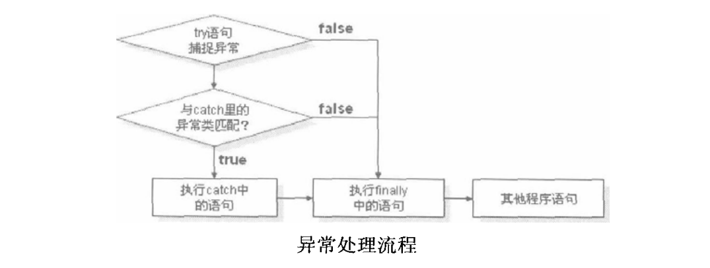

# Java基础知识汇总-异常机制

---

### 异常的基本概念

在Java中程序的错误主要是语法错误和语义错误。一个程序即使在编译时没有错误信息产生，在运行时也有可能出现各种各样的错误导致程序退出，这些错误在Java中统一称为异常。

异常是导致程序中断运行的一种指令流。如果不对异常进行正确的处理，则可能导致程序的中断执行，造成不必要的损失，所以在程序设计中必须要考虑各种异常的发生，并正确地做好相应的处理，这样才能保证程序正常的执行。在Java中一切的异常都秉持着面向对象的设计思想，所有的异常都以类和对象的形式存在。除了Java中提供的各种异常类外，用户也可以根据需要定义自己的异常类。

### 为什么需要异常处理

在没有异常处理的语言中就必须使用判断语句，配合所想到的错误状况来捕捉程序中所有可能发生的错误。但是为了捕捉这些错误，编写出来的程序代码经常会有大量的判断语句，即使这样也未必能完全捕捉到所有的错误，而且这样做势必导致程序运行效率的降低。

Java的异常处理机制恰好改进了这一点。它具有易于使用、可自行定义异常类、处理抛出的异常同时又不会降低程序运行的速度等优点。因此在Java程序设计中，应充分利用Java的异常处理机制，以增进程序的稳定性及效率。

### Java中的异常体系

~~~plaintext
Throwable
|--Error：严重的问题，如运行的类不存在或内存溢出等，通常不需写针对的代码对其处理。
|--Exception：在运行时出现的一些情况，可以定义针对性的处理方式对其进行处理。
~~~

* 异常体系最大的特点，在于该体系中的类和对象都具有可抛性，其中`throws`关键字操作异常类，`throw`关键字操作异常对象。
* Error和Exception的子类名都是以其父类名作为后缀的，如`java.lang.NoClassDefFoundError`、`java.lang.OutOfMemoryError`。

### 初识异常

~~~java
public class Demo{
	public static void main(String[] args){
		int x = 10;
		int y = 0;
		int temp = x/y;
		System.out.println(temp);
	}
}
~~~

~~~plaintext
Exception in thread "main" java.lang.ArithmeticException： /by zero
~~~

### 异常处理策略

* 使用`try...catch...`语句捕获并处理异常；
* 使用`throws`关键字抛出异常；

### 捕获并处理异常

1）异常处理流程

在try语句中捕获可能出现的异常代码，如果在try中发生了异常，则程序会自动跳转到catch语句中找到匹配的异常类型进行相应的处理。最后不管程序是否会产生异常，肯定会执行到finally语句，finally语句就作为异常的统一出口。并且，finally语句是可省略的，如果省略了finally语句，则在catch语句块执行结束后，程序会跳转到try-catch块之后的代码继续执行。

简单总结如下：

* 一旦产生异常，则首先会产生一个异常类的实例对象；
* 在try语句中对此异常对象进行捕获；
* 产生的异常对象与catch语句中的各个异常类型进行匹配，如果匹配成功，则执行catch语句中的代码；

2）代码格式

~~~java
try{
	//有可能出现异常的语句
}catch(异常类 异常对象){
	//异常的处理语句
}finally{
	//一定会运行到的语句
}
~~~

~~~java
public class Demo{
	public static void main(String[] args){
		System.out.println("1");
		int x = 10;
		int y = 0;
		int temp;
		try{
			temp = x/y;
			System.out.println("2");
		}catch(ArithmeticException e){
			System.out.println("3");
		}
		System.out.println("4");
	}
}

//1  3  4
~~~

3）finally块

无论异常是否发生，`finally`括起来的代码一定会被执行，一般用于释放资源。

~~~java
public class Demo{
	public static void main(String[] args){
		System.out.println("1");
		int x = 10;
		int y = 0;
		int temp;
		try{
			temp = x/y;
			System.out.println("2");
		}catch(ArithmeticException e){
			System.out.println("3");
		}finally{
			System.out.println("4");
		}
		System.out.println("5");
	}
}

//1  3  4  5
~~~

`finally`块即使是在`return`后也能执行，除非程序退出了。

~~~java
public class Demo{
	public static void main(String[] args){
		System.out.println("1");
		try{
			System.out.println("2");
			//return;
			//System.exit(0);
		}catch(Exception e){
			System.out.println("3");
		}finally{
			System.out.println("4");
		}
		System.out.println("5");
	}
}
~~~

> finally块作为异常的统一出口，应尽可能不要出现像throw或return这类语句，以避免不必要的问题。

4）多个catch捕获多个异常

若同时存在多个异常，就需要使用多个catch语句进行捕获处理。

~~~java
public class Demo{
	public static void main(String[] args){
		try{
			int x = 10;
			int y = 0;
			int temp = x/y;
			
			int z = Integer.parseInt("abc");
			
			String s = null;
			s.equals("abc");
		}catch(ArithmeticException e){
			e.printStackTrace();
		}catch(NumberFormatException e){
			e.printStackTrace();
		}catch(NullPointerException e){
			e.printStackTrace();
		}catch(Exception e){
			e.printStackTrace();
		}finally{
			System.out.println("finally");
		}
		System.out.println("end");
	}
}
~~~

> 在Java中所有捕获范围小的异常必须放在捕获大的异常之前，否则程序在编译时就会出错。

### 抛出异常

在定义一个方法时可以使用`throws`关键字声明，表示此方法不处理异常，而交给方法的调用者进行处理。

1）使用格式

~~~java
public 返回值类型 方法名称(参数列表) throws 异常类{
	
}
~~~

~~~java
public class Demo{
	public static void main(String[] args){
		try{
			div();
		}catch(ArithmeticException e){
			e.printStackTrace();
		}
	}
	public static void div() throws ArithmeticException{
		int x = 10;
		int y = 0;
		int temp = x/y;
	}
}
~~~

2）main方法throws异常

~~~java
public class Demo{
	public static void main(String[] args) throws Exception{
		div();
	}
	public static void div() throws ArithmeticException{
		int x = 10;
		int y = 0;
		int temp = x/y;
	}
}
~~~

main方法也可以使用throws关键字，但是因为main方法是程序的起点，所以此时再向上抛出异常，则只能将异常抛给JVM进行处理。

### throw

使用throw关键字可以直接抛出一个异常，并且抛出的是异常类的实例化对象。与系统产生的异常类对象实例不同，此时的异常类对象实例是手工产生的。

~~~java
public class Demo{
	public static void main(String[] args){
		try{
			throw new Exception("这是抛出的异常...");
		}catch(Exception e){
			e.printStackTrace();
		}
	}
}
~~~

如果抛出的异常在方法中捕获了，就不需要在方法上throws声明抛出了。

~~~java
public void foo() {
	try {
		throw new Exception();
	} catch(Exception e) {
		
	}
}
~~~

### 关键字throws和throw的区别

* throws用在函数上，用于对功能声明异常，它抛出的是异常类，且可以抛出多个；
* throw用在函数内，用于抛出异常对象，它可以用于结束函数执行。

### 异常处理的细节

* 定义功能时，功能内部处理外部输入参数可能会出现问题，如用户非法输入导致算术除0等等。为了解决这种问题，通常会将问题通过`throws`声明在函数上，其目的是使功能的调用者在使用该功能时能明确做出相应的处理方式；
* 如果一个功能抛出多个异常，在使用该功能时，需要有多个`catch`块对每一个异常进行处理。如果多个异常中有父类异常，必须放在最后捕获，否则编译失败；
* 函数内`throw`抛出了异常（`RuntimeException`除外），函数上一定要用`throws`声明抛出；

### 输出异常信息的方式

| 方法                | 描述                                                         |
| ------------------- | ------------------------------------------------------------ |
| e.getMessage()      | 获取异常信息，返回字符串                                     |
| e.toString()        | 获取异常类名和异常信息，返回字符串                           |
| e.printStackTrace() | 获取异常类名和异常信息，以及异常出现在程序中的位置，返回值void。打印异常堆栈信息。 |

### 编译时检查的异常Exception

### 运行时异常RuntimeException

### Exception与RuntimeException对比

### 方法覆盖情况下的异常

~~~java
class ExceptionA{}
class ExceptionB extends ExceptionA{}
class ExceptionC extends ExceptionA{}
class ExceptionD{}

class A{
	void foo1() throws ExceptionA;
	void foo2() throws ExceptionB,ExceptionC;
}

class B extends A{
	void foo1() throws ExceptionA{};
	void foo1() throws ExceptionB{};
	void foo1() throws ExceptionD{}; //error

	void foo2() throws ExceptionB{};
	void foo2() throws ExceptionC{};
	void foo2() throws ExceptionB,ExceptionC{};
}
~~~

* 子类覆盖的父类方法抛出了异常，子类方法只能抛出相同的异常，或者异常的子类；
* 子类覆盖的父类方法抛出了多个异常，子类方法只能抛出这些异常的子集；
* 父类被覆盖方法没有抛出异常，子类方法也不能抛出异常，可以在方法内进行捕获处理，或者抛出运行时异常。

子类的覆盖方法只能抛出与父类方法相同的异常或者异常的子类。在面向接口编程中，接口制定者对方法存在的问题声明出来，好让接口调用者针对该问题制定相应的处理方案。调用者调用父类的方法时，发现有抛出异常的声明，调用者就会对该异常做相应的处理。而在实际中往往使用的是该父类的子类对象，调用的也是子类的覆盖方法，如果子类的方法抛出了新的异常，调用者所做的异常处理工作就不会对该异常适用了。

### 自定义异常

当Java中提供的异常类不能满足开发要求时，可以根据自己的需求定义自己的异常类。自定义异常类只需要继承Exception即可。

* 自定义异常类继承Exception类或者其子类；
* 通过构造函数定义异常信息；
* 通过throw将自定义异常抛出。

~~~java
class MyException extends Exception{
	public MyException(){
		super();
	}
	public MyException(String msg){
		super(msg);
	}
}
public class Demo{
	public static void main(String[] args){
		try{
			throw new MyException("这是自定义异常...");
		}catch(Exception e){
			e.printStackTrace();
		}
	}
}
~~~

### 异常应用示例

老师用电脑上课，在上课的过程中，出现问题怎么办？比如：电脑蓝屏了，电脑冒烟了，这些问题都要进行描述。 

~~~java
//自定义蓝屏异常
class LanPingException extends Exception {
	LanPingException() {
		super();
	}
	LanPingException(String message) {
		super(message);
	}
}

//自定义冒烟异常
class MaoYanException extends Exception {
	MaoYanException() {
		super();
	}
	MaoYanException(String message) {
		super(message);
	}
}

//讲课中会发生的课时进度无法继续异常
class NoPlanException extends Exception {
	NoPlanException() {
		super();
	}
	NoPlanException(String message) {
		super(message);
	}
}

class Computer {
	private int state = 1;
	Computer(int state) {
		this.state = state;
	}
	public void run() throws LanPingException, MaoYanException {
		System.out.println("电脑开始运行...");
		if(state==2)
			throw new LanPingException("电脑蓝屏啦！");
		if(state==3)
			throw new MaoYanException("电脑冒烟啦！");
	}
	public void reset() {
		state = 1;
		System.out.println("电脑重启...");
	}
}

class Teacher {
	private String name;
	private Computer comp;
	Teacher(String name, int state) {
		this.name = name;
		comp = new Computer(state);
	}

	public void prelect() throws NoPlanException {
		try {
			comp.run();
			System.out.println(name+"讲课...");
		} catch (LanPingException e) {
			System.out.println(e.toString());
			//重启电脑
			comp.reset();
			prelect();
		} catch (MaoYanException e) {
			System.out.println(e.toString());
			test();
			throw new NoPlanException("课时进度停止:"+e.getMessage());
		}
	}
	public void test() {
		System.out.println("大家练习...");
	}
}

public class ExceptionTest {
	public static void main(String[] args) {
		Teacher t = new Teacher("王老师", 3);
		try {
			t.prelect();
		} catch (NoPlanException e) {
			System.out.println(e.toString());
			try {
				new Teacher("张老师", 1).prelect();
			} catch (NoPlanException ex) {
				System.out.println(ex.toString());
				System.out.println("大家放假！");
			}
		}
	}
}
~~~

### 断言

断言就是肯定某一个结果的返回值是正确的，如果最终此结果的返回值是错误的，则通过断言检查肯定会提示错误信息。断言是JDK1.4之后提供的功能。

格式如下：

~~~java
assert boolean表达式;
assert boolean表达式 : 详细的信息;
~~~

如果boolean表达式的结果为true，则什么错误信息都不会提示；如果boolean表达式的结果为false，则会提示错误信息。如果没有声明详细信息的描述，则系统会使用默认的错误信息提示方式。

~~~java
public class Demo{
	public static void main(String[] args){
		int[] arr = {1, 2, 3};
		assert arr.length == 0;
	}
}
~~~

要让断言起作用，在程序运行时需要加上以下参数：

~~~plaintext
# -enableassertions 或 -ea
java -enableassertions Demo
java -ea Demo
~~~

运行结果：

~~~plaintext
Exception in thread "main" java.lang.AssertionError
~~~

此时提示的是系统默认的错误信息，如果想要显示自定义的错误信息，可修改如下：

~~~java
public class Demo{
	public static void main(String[] args){
		int[] arr = {1, 2, 3};
		assert arr.length == 0 : "数组长度不为0";
	}
}
~~~

运行结果：

~~~plaintext
Exception in thread "main" java.lang.AssertionError: "数组长度不为0"
~~~

注意：

* 虽然断言返回的是布尔值，但是不能将其作为条件判断语句；
* 断言虽然有检查运行结果的功能，但是在一般开发中并不提倡使用。

   

---

