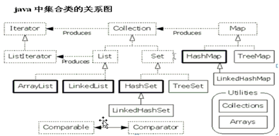
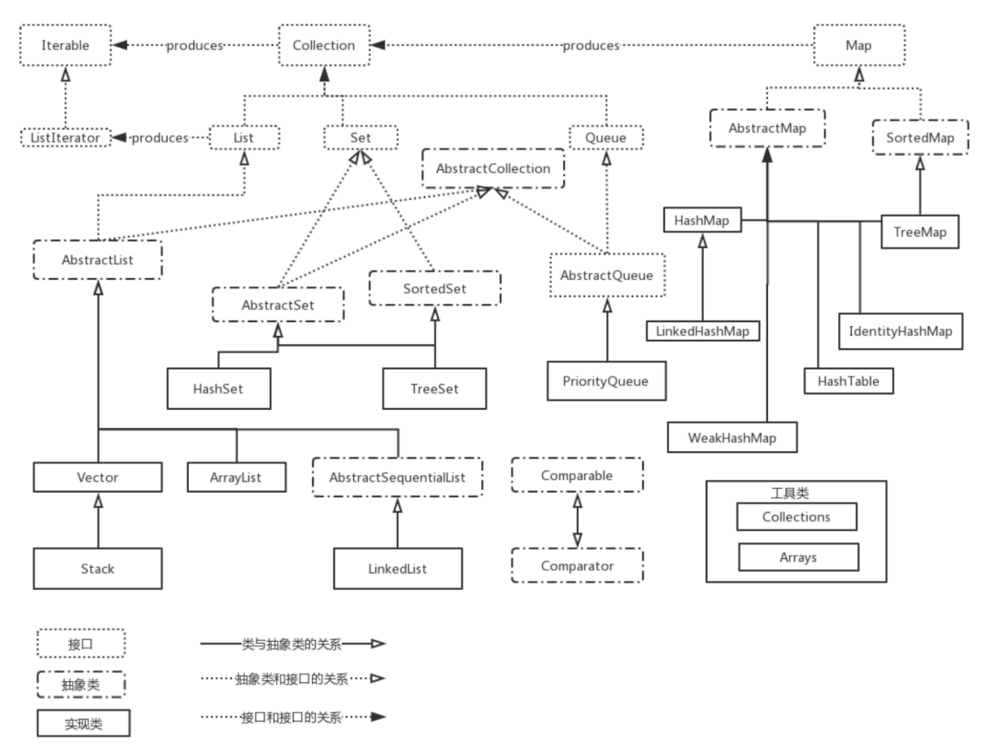
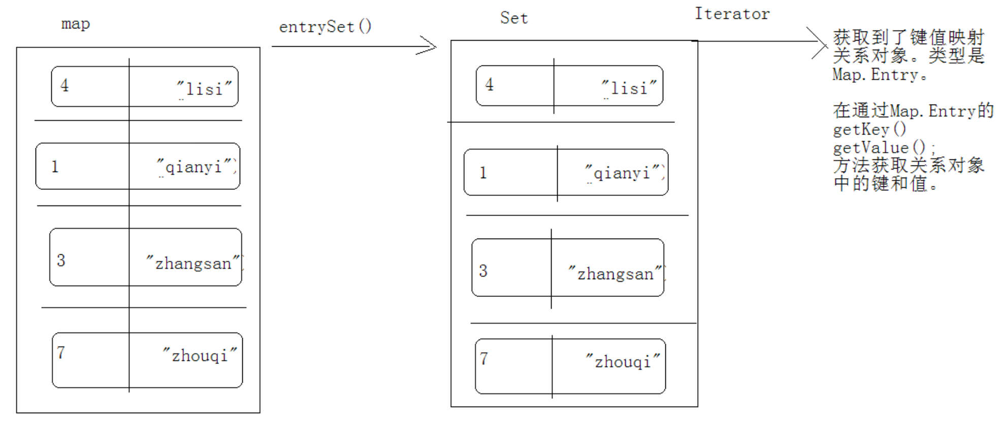
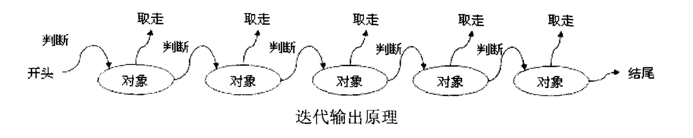
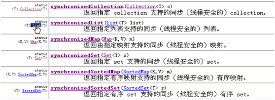

# Java基础知识汇总-集合框架

---

### 集合框架概述

##### 概念

所谓的类集就是一个动态的对象数组，是对一些实现好的数据结构进行了包装，这样在使用时就会非常方便，而且最重要的是类集框架本身不受对象数组长度的限制。

* 这种框架是高性能的，对基本类集（动态数组、链接表、树和散列表）的实现是高效率的，所以一般很少需要人工去对这些“数据引擎”编写代码；
* 框架必须允许不同类型的类集以相同的方式和高度互操作方式工作；
* 类集必须是容易扩展和修改的。为了实现这一目标，类集框架被设计成包含了一组标准接口。

##### 集合与数组的区别

* 集合长度是可变的，数组长度是固定的；
* 集合只能存储对象，数组既可以存储对象又可以存储基本类型；
* 集合中存储的对象可以是任意类型的，数组中只能存储同一类型的数据；

##### 集合框架的体系结构

##### 集合框架的主要接口

| 接口         | 描述                                                         |
| ------------ | ------------------------------------------------------------ |
| Collection   | 是存放一组单值的顶层接口，所谓的单值是指集合中的每个元素都是一个对象。 |
| List         | Collection的子接口，对Collection进行了大量的扩充，里面的内容是允许重复的。 |
| Set          | Collection的子接口，没有对Collection进行扩充，里面不允许存放重复的内容。 |
| Map          | 是存放一对值的顶层接口，即接口中的每个元素都是一对，以key、value的形式保存。 |
| Iterator     | 迭代器接口，用于迭代集合中的元素，只能从前往后单向迭代。     |
| ListIterator | 双向迭代器接口。                                             |
| Enumeration  | 早期的迭代器接口。                                           |
| SortedSet    | 单值的排序接口，实现此接口的集合类，里面的内容可以使用比较器排序。 |
| SortedMap    | 存放一对值的排序接口，实现此接口的集合类，里面的内容按照key排序，使用比较器排序。 |
| Queue        | 队列接口，可以实现队列操作。                                 |
| Map.Entry    | Map的内部接口，每个Map.Entry对象都保存着一对key、value的内容。 |

##### 集合的技巧掌握

1）明确具体集合对象名称的后缀

* 如果后缀是List，都属于List体系，通常都是非同步的。
* 如果后缀是Set，都属于Set体系，通常也是非同步的。
* 这些体系中的其他子类对象，后缀不是所属接口名的，一般都是同步的，比如Vector。

这在常用子类对象中也通用。 

2）明确数据结构

对于JDK1.2版本的子类对象，后缀名是所属的体系，前缀名是就是数据结构的名称。比如：

* ArrayList： 看到Array，就要明确是数组结构，查询快。
* LinkedList：看到Link，就要明确是链表结构，就要想到 add、get、remove、和first、last结合的方法，增删快。
* HashSet：看到hash，就要明确是哈希表，查询巨快。因为唯一性，就要想到元素必须覆盖 hashCode方法和equals方法。 
* TreeSet：看到Tree，就要明确是二叉树，可以对元素排序。有两种排序方式：自然顺序：Comparable接口，覆盖compareTo(一个参数 )；比较器：Comparator接口，覆盖compare(两个参数)；判断元素唯一性的依据就是比较方法的返回结果；

### Collection

##### 概念

Collection接口是存放单值对象的顶层接口，可以向其中保存多个单值（单个对象）数据。

~~~java
public interface Collection<E> extends Iterable<E>{} 
~~~

##### Collection的主要方法

| 方法                                             | 描述                                         |
| ------------------------------------------------ | -------------------------------------------- |
| public boolean add(E e)                          | 向集合添加元素                               |
| public boolean addAll(Collection<? extends E> c) | 向集合添加另一个集合元素                     |
| public void clear()                              | 清除集合的所有元素                           |
| public boolean contains(Object o)                | 判断一个元素是否在集合中                     |
| public boolean containsAll(Collection<?> c)      | 判断一个集合的元素是否在另一个集合中         |
| public boolean equals(Object o)                  | 对象比较                                     |
| public int hashCode()                            | 获取哈希值                                   |
| public boolean isEmpty()                         | 判断集合是否为空                             |
| public Iterator`<E>` iterator()                    | 取得迭代器                                   |
| public boolean remove(Object o)                  | 移除集合的元素                               |
| public boolean removeAll(Collection<?> c)        | 移除集合中属于另一个集合的元素               |
| public boolean retainAll(Collection<?> c)        | 求两个集合的交集                             |
| public int size()                                | 集合的大小                                   |
| public Object[] toArray()                        | 将集合变成对象数组                           |
| public `<T>` T[] toArray(T[] a)                    | 将集合变成对象数组，并指定返回的对象数组类型 |

##### Collection的主要子接口

* List：可以存放重复的元素；
* Set：不能存放重复的元素，依靠hashCode和equals两个方法区分；
* Queue：队列接口；
* SortedSet：可以对集合中的元素排序；

### List

##### 概念

List是Collection的子接口，其中可以保存重复的元素。与Collection不同的是，List接口大量地扩充了Collection接口的内容。

~~~java
public interface List<E> extends Collection<E>{}
~~~

特点：

* 有序，存储元素的顺序和取出元素的顺序一致；
* 该集合中的元素都有索引，所以可以通过索引（角标）来访问元素； 
* 它可以存储重复元素； 

##### List接口扩充的方法

| 方法                                                        | 描述                       |
| ----------------------------------------------------------- | -------------------------- |
| public void add(int index, E e)                             | 在指定位置添加元素         |
| public boolean addAll(int index, Collection`<? extends E>` c) | 在指定位置添加一个集合     |
| E get(int index)                                            | 获取指定位置的元素         |
| public int indexOf(Object o)                                | 查找指定元素的位置         |
| public int lastIndexOf(Object o)                            | 从后向前查找指定元素的位置 |
| public ListIterator`<E>` listIterator()                       | 获取ListIterator           |
| public E remove(int index)                                  | 移除指定位置的元素         |
| public List`<E>` subList(int fromIndex, int toIndex)          | 获取集合的子集合           |
| public E set(int index, E e)                                | 替换指定位置的元素         |

##### ArrayList

ArrayList的底层是数组结构，是长度可变的数组。替代了Vector，因为效率高，特别是查询效率很高， 但是增删的效率很低。是不同步的。

1）添加元素

~~~java
public class Demo{
	public static void main(String[] args){
		List<String> list = new ArrayList<String>();
		list.add("hello");
		list.add("world");
		list.add(0, "hi");
		
		List<String> list2 = new ArrayList<String>();
		list2.add("welcome");
		list.addAll(list2);
	}
}
~~~

2）删除元素

~~~java
public class Demo{
	public static void main(String[] args){
		List<String> list = new ArrayList<String>();
		list.add("hello");
		list.add("world");
		list.add(0, "hi");
		list.remove("world");
		list.remove(0);
		
		List<String> list2 = new ArrayList<String>();
		list2.add("welcome");
		list.addAll(list2);
		list.removeAll(list2);
	}
}
~~~

3）获取元素

~~~java
public class Demo{
	public static void main(String[] args){
		List<String> list = new ArrayList<String>();
		list.add("hello");
		list.add("world");
		list.add(0, "hi");
		for(int i=0; i<list.zise(); i++){
			System.out.println(list.get(i));
		}
	}
}
~~~

4）将集合变为对象数组

~~~java
public class Demo{
	public static void main(String[] args){
		List<String> list = new ArrayList<String>();
		list.add("hello");
		list.add("world");
		list.add(0, "hi");
		Object[] o = list.toArray();
		String[] s = list.toArray(new String[]{});
	}
}
~~~

5）截取集合

~~~java
public class Demo{
	public static void main(String[] args){
		List<String> list = new ArrayList<String>();
		list.add("hello");
		list.add("world");
		list.add(0, "hi");
		List<String> subList = list.subList(1, 2);
	}
}
~~~

6）集合其它操作

~~~java
public class Demo{
	public static void main(String[] args){
		List<String> list = new ArrayList<String>();
		list.add("hello");
		list.add("world");
		list.add(0, "hi");
		boolean b = list.contains("world");
		b = list.isEmpty();
		int index = list.indexOf("hi");
		index = list.lastIndexOf("hi");
	}
}
~~~

##### LinkedList

LinkedList的底层是链表结构，这种结构的好处是，对元素增删的效率很高，但是查询的效率很低。是不同步的。

LinkedList是一个表示链表的操作类。LinkedList实现了Queue接口，除了具备了Queue的操作方法，还新增了以下方法：

| 方法                      | 描述                     |
| ------------------------- | ------------------------ |
| public void addFirst(E e) | 将元素添加到表头         |
| public void addLast(E e)  | 将元素添加到表尾         |
| public boolean offer(E e) | 将指定元素添加到链表尾部 |
| public E removeFirst()    | 移除链表第一个元素       |
| public E removeLast()     | 移除链表最后一个元素     |

1）添加元素

~~~java
public class Demo{
	public static void main(String[] args){
		LinkedList<String> list = new LinkedList<String>();
		list.add("hello");
		list.add("world");
		list.add("hi");
		
		list.addFirst("x");
		list.addLast("y");
	}
}
~~~

2）获取元素

~~~java
public class Demo{
	public static void main(String[] args){
		LinkedList<String> list = new LinkedList<String>();
		list.add("hello");
		list.add("world");
		list.add("hi");
		list.addFirst("x");
		list.addLast("y");
		
		String s = list.element(); //获取表头
		System.out.println(list);
		s = list.peek(); //获取表头
		System.out.println(list);
		s = list.poll(); //获取表头并删除
		System.out.println(list);
	}
}
~~~

3）使用LinkedList模拟队列

~~~java
class Queue {
	private LinkedList list = null;
	public Queue() {
		list = new LinkedList();
	}
	public void add(Object o) {
		list.addLast(o);
	}
	public Object get() {
		return list.removeFirst();
	}
}
~~~

##### Vector

Vector是JDK1.0就存在了，底层是数组结构，可变长数组。Vector是同步的。

原理：一旦原数组长度不够，就会创建新数组，将原数组的元素复制到新数组中，并将新元素添加到新数组中。

~~~java
public class Demo{
	public static void main(String[] args){
		List<String> list = new Vector<String>();
		list.add("hello");
		list.add("world");
		list.add(0, "hi");
		for(int i=0; i<list.zise(); i++){
			System.out.println(list.get(i));
		}
		
		Vector<String> v = new Vector<String>();
		v.addElement("hello");
		v.addElement("world");
		v.addElement("hi");
		for(int i=0; i<v.zise(); i++){
			System.out.println(v.get(i));
		}
	}
}
~~~

##### Stack

栈是采用先进后出方式存储数据的一种数据结构。Stack是Vector的子类。

| 方法                        | 描述           |
| --------------------------- | -------------- |
| public boolean empty()      | 判断栈是否为空 |
| public E peek()             | 获取栈顶元素   |
| public E pop()              | 出栈           |
| public E push(E item)       | 入栈           |
| public int search(Object o) | 在栈中查找     |

~~~java
public class Demo{
	public static void main(String[] args){
		Stack<String> s = new Stack<String>();
		s.push("A");
		s.push("B");
		s.push("C");
		String s = s.peek();
		s = s.pop();
	}
}
~~~

##### List集合对比

ArrayList与LinkedList对比：

ArrayList与Vector对比：

|          | ArrayList                      | Vector                     |
| -------- | ------------------------------ | -------------------------- |
| 推出时间 | JDK1.2之后推出，属于新的集合类 | JDK1.0推出，属于旧的集合类 |
| 同步     | 异步                           | 同步                       |
| 性能     | 性能较高                       | 性能较低                   |
| 线程安全 | 非线程安全                     | 线程安全                   |

### Set

##### 概念

Set接口也是Collection接口的子接口，但是Set接口中不能加入重复的元素。

~~~java
public interface Set<E> extends Collection<E>{}
~~~

特点：

* 不包含重复的元素；
* 这个集合存入元素的顺序和取出元素的顺序不一定一致（具体的容器对象数据结构不同，顺序也有不同）；

##### HashSet

HashSet采用散列的存储方式，所以没有顺序。

~~~java
public class Demo{
	public static void main(String[] args){
		Set<String> set = new HashSet<String>();
		set.add("A");
		set.add("B");
		set.add("C");
		set.add("C");
		set.add("C");
		set.add("D");
		set.add("E");
		System.out.println(set); //[D, A, C, B, E]
	}
}
~~~

对于重复的元素只会添加一次，而且存储的顺序跟添加的顺序不一致。如果要存储自定义对象，就必须覆盖Object类中的equals方法和hashCode方法：

~~~java
class Person {
	private String name;
	private int age;
	public Person(String name, int age){
		this.name = name;
		this.age = age;
	}
	//getter、setter...
	public boolean equals(Object obj){
		if(this==obj){
			return true;
		}
		if(!(obj instanceof Person)){
			return false;
		}
		Person p = (Person) obj;
		if(this.getName().equals(p.getName()) && this.getAge()==p.getAge()){
			return true;
		}else{
			return false
		}
	}
	public int hashCode(){
		return this.getName().hashCode() * this.getAge();
	}
}
public class Demo{
	public static void main(String[] args){
		Set<Person> set = new HashSet<Person>();
		set.add(new Person("zhangsan", 21));
		set.add(new Person("lisi", 22));
		set.add(new Person("lisi", 22));
		set.add(new Person("wangwu", 23));
	}
}
~~~

##### LinkedHashSet

##### TreeSet

TreeSet会按照一定的顺序存储元素：

~~~java
public class Demo{
	public static void main(String[] args){
		Set<String> set = new TreeSet<String>();
		set.add("C");
		set.add("C");
		set.add("C");
		set.add("D");
		set.add("B");
		set.add("A");
		set.add("E");
		System.out.println(set); //[A, B, C, D, E]
	}
}
~~~

因为加入的是字符串，所以会按照字典顺序保存。如果要存储自定义对象，则必须实现Comparable接口：

~~~java
class Person implements Comparable<Person>{
	private String name;
	private int age;
	public Person(String name, int age){
		this.name = name;
		this.age = age;
	}
	//getter、setter...
	public int compareTo(Person p){
		int tmp = this.getName().compareTo(p.getName());
		return tmp==0 ? this.getAge()-p.getAge() : tmp;
	}
}
public class Demo{
	public static void main(String[] args){
		Set<Person> set = new TreeSet<Person>();
		set.add(new Person("zhangsan", 21));
		set.add(new Person("lisi", 22));
		set.add(new Person("lisi", 22));
		set.add(new Person("wangwu", 23));
	}
}
~~~

或者也可以使用比较器Comparator：

~~~java
class Person {
	private String name;
	private int age;
	public Person(String name, int age){
		this.name = name;
		this.age = age;
	}
	//getter、setter...
}
public class Demo{
	public static void main(String[] args){
		Set<Person> set = new TreeSet<Person>(new Comparator<Person>(){
			public int compare(Person p1, Person p2) {
				int tmp = p1.getName.compareTo(p2.getName());
				return tmp==0 ? p1.getAge()-p2.getAge() : tmp;
			}
		});
		set.add(new Person("zhangsan", 21));
		set.add(new Person("lisi", 22));
		set.add(new Person("lisi", 22));
		set.add(new Person("wangwu", 23));
	}
}
~~~

##### SortedSet

SortedSet接口主要用于排序操作，实现此接口的子类都属于排序的子类。

SortedSet接口的主要方法：

| 方法                                      | 描述                       |
| ----------------------------------------- | -------------------------- |
| public Comparator`<? super E>` comparator() | 返回与排序有关的比较器     |
| public E first()                          | 返回第一个元素             |
| public E last()                           | 返回最后一个元素           |
| public SortedSet`<E>` headSet(E e)          | 返回从开始到指定元素的集合 |
| public SortedSet`<E>` subSet(E from, E to)  | 返回指定范围元素的集合     |
| public SortedSet`<E>` tailSet(E e)          | 返回从指定元素到结尾的集合 |

~~~java
public class Demo{
	public static void main(String[] args){
		SortedSet<String> set = new TreeSet<String>();
		set.add("A");
		set.add("B");
		set.add("C");
		set.add("C");
		set.add("C");
		set.add("D");
		set.add("E");
		System.out.println(set);
		System.out.println(set.first());
		System.out.println(set.last());
		System.out.println(set.headSet("C"));
		System.out.println(set.tailSet("C"));
		System.out.println(set.subSet("B", "D"));
	}
}
~~~

##### Set集合对比

### Queue

##### 概念

Queue表示的是队列操作接口，采用FIFO（先进先出）的方式操作。

~~~java
public interface Queue<E> extends Collection<E>{}
~~~

##### Queue中的主要方法

| 方法                      | 描述                 |
| ------------------------- | -------------------- |
| public E element()        | 找到表头             |
| public boolean offer(E e) | 将指定元素添加到表尾 |
| public E peek()           | 获取表头             |
| public E poll()           | 找到并删除表头       |
| public E remove()         | 检索并移除表头       |

##### 

### Map

##### 概念

Map操作的是一对对象，即二元偶对象，Map中的每个元素都使用key、value的形式存储在集合中。

~~~java
public interface Map<K,V>{}
~~~

##### Map接口中的主要方法

| 方法                                                | 描述                               |
| --------------------------------------------------- | ---------------------------------- |
| public void clear()                                 | 清除集合                           |
| public boolean containsKey(Object key)              | 判断指定的key是否存在              |
| public boolean containsValue(Object value)          | 判断指定的value是否存在            |
| public Set`<Map.Entry<K,V>>` entrySet()               | 将Map转换为Set集合                 |
| public boolean equals(Object o)                     | 判断对象是否相等                   |
| public V get(Object key)                            | 根据key取得value                   |
| public int hashCode()                               | 获取哈希值                         |
| public boolean isEmpty()                            | 判断集合是否为空                   |
| public Set`<K>` keySet()                              | 取出全部的key                      |
| public V put(K key, V value)                        | 向集合添加元素                     |
| public void putAll(Map`<? extends K, ? extends V>` t) | 将一个Map中的元素添加到另一个Map中 |
| public V remove(Object key)                         | 根据key删除value                   |
| public int size()                                   | 获取集合大小                       |
| public Collection`<V>` values()                       | 取出全部的value                    |

##### Map.Entry

Map.Entry是Map内部定义的一个接口，专门用来保存key、value形式的数据。

~~~java
public static interface Map.Entry<K,V>{}
~~~

~~~java
public class Demo{
	public static void main(String[] args){
		Map<String, String> map = new HashMap<String, String>();
		map.put("1", "aaa");
		map.put("2", "bbb");
		map.put("3", "ccc");
		
		Set<Map.Entry<String,String>> entrySet = map.entrySet();
		Iterator<Map.Entry<String,String>> it = entrySet.iterator();
		while(it.hasNext()){
			Map.Entry<String,String> entry = it.next();
			System.out.println(entry.getKey()+":"+entry.getValue());
		}
		
		for(Map.Entry<String,String> enrty : map.entrySet()){
			System.out.println(entry.getKey()+":"+entry.getValue());
		}
	}
}
~~~

##### HashMap

~~~java
public class Demo{
	public static void main(String[] args){
		Map<String, String> map = new HashMap<String, String>();
		map.put("1", "aaa");
		map.put("2", "bbb");
		map.put("3", "ccc");
		String str = map.get("2");
		
		boolean b = map.containsKey("1");
		b = map,containsValue("ccc");
		
		Iterator<String> it1 = map.keySet().iterator();
		while(it1.hasNext()){
			System.out.println(it1.next());
		}
		
		Iterator<String> it2 = map.values().iterator();
		while(it2.hasNext()){
			System.out.println(it2.next());
		}
		
		Set<Map.Entry<String,String>> entrySet = map.entrySet();
		Iterator<Map.Entry<String,String>> it3 = entrySet.iterator();
		while(it3.hasNext()){
			Map.Entry<String,String> entry = it3.next();
			System.out.println(entry.getKey()+":"+entry.getValue());
		}
	}
}
~~~

当要存储key为自定义对象的数据时，必须覆盖equals方法和hashCode方法。

##### LinkedHashMap

##### TreeMap

~~~java
public class Demo{
	public static void main(String[] args){
		Map<String, String> map = new TreeMap<String, String>();
		map.put("1", "aaa");
		map.put("2", "bbb");
		map.put("3", "ccc");
		
		Iterator<String> it = map.keySet().iterator();
		while(it.hasNext()){
			String key = it.next();
			System.out.println(key + ":" + map.get(key));
		}
	}
}
~~~

如果要存储key为自定义对象的数据，那么必须实现Comparable接口，或者使用比较器Comparator。

##### WeakHashMap

Map的子类中的数据都是使用强引用存储的，即里面的内容不管是否使用都始终在集合中保留。如果希望集合自动清理暂时不用的数据就可以使用WeakHashMap，这样，当进行垃圾收集时会释放掉集合中的垃圾数据。

~~~java
public class Demo{
	public static void main(String[] args){
		Map<String, String> map = new WeakHashMap<String, String>();
		map.put(new String("1"), new String("aaa"));
		map.put(new String("2"), new String("bbb"));
		map.put(new String("3"), new String("ccc"));
		System.gc();
		System.out.println(map); //一般会被清空
	}
}
~~~

##### IdentityHashMap

Map操作中key的值是不能重复的，重复就会出现覆盖。而使用IdentityHashMap时只要key的地址不相等，就表示不是重复的key，可以重复添加到集合中。

~~~java
public class Demo{
	public static void main(String[] args){
		Map<String, String> map = new IdentityHashMap<String, String>();
		map.put("1", "aaa");
		map.put(new String("2"), "bbb1");
		map.put(new String("2"), "bbb2");
		map.put("3", "ccc");
		System.out.println(map);
	}
}
~~~

##### Hashtable

~~~java
public class Demo{
	public static void main(String[] args){
		Map<String, String> map = new Hashtable<String, String>();
		map.put("1", "aaa");
		map.put("2", "bbb");
		map.put("3", "ccc");
		String str = map.get("2");
		
		Iterator<String> it = map.keySet().iterator();
		while(it.hasNext()){
			String key = it.next();
			System.out.println(key + ":" + map.get(key));
		}
	}
}
~~~

##### Map集合对比

HashMap与Hashtable对比：

|          | HashMap            | Hashtable          |
| -------- | ------------------ | ------------------ |
| 出现时间 | JDK1.2后推出的新类 | JDK1.0出现的旧的类 |
| 同步     | 异步               | 同步               |
| 线程安全 | 非线程安全         | 线程安全           |
| 性能比较 | 性能较高           | 性能较低           |

### 迭代器

##### 概念

迭代是取出集合中元素的一种方式。因为Collection中有iterator方法，所以每一个子类对象都具备迭代器。

所谓的迭代输出就是将元素一个个进行判断，判断其是否有内容，如果有内容就把内容取出。

* 迭代器在Collcection接口中是通用的，它替代了Vector类中的Enumeration(枚举)；
* 迭代器的next方法是自动向下获取元素，要避免出现NoSuchElementException；
* 迭代器的next方法返回值类型是Object，所以要记得类型转换，或者是使用泛型；

##### Iterator

~~~java
public class Demo{
	public static void main(String[] args){
		List<String> list = new ArrayList<String>();
		list.add("A");
		list.add("-");
		list.add("B");
		list.add("-");
		list.add("C");
		Iterator<String> it = list.iterator();
		while(it.hasNext()){
			String s = it.next();
			if("-".equals(s)){
				it.remove();
			}else{
				System.out.println(s);
			}
		}
	}
}
~~~

~~~java
public class Demo{
	public static void main(String[] args){
		List<String> list = new ArrayList<String>();
		list.add("A");
		list.add("-");
		list.add("B");
		list.add("-");
		list.add("C");
		Iterator<String> it = list.iterator();
		while(it.hasNext()){
			String s = it.next();
			if("-".equals(s)){
				list.remove(s); //使用集合的方法删除元素
			}else{
				System.out.println(s);
			}
		}
	}
}
~~~

迭代器在内容删除后就停止了，因为集合本身的内容被破坏，所以迭代出现错误。

在对集合元素进行迭代时，如果对集合元素进行修改，会抛出并发修改异常（ConcurrentModificationException）。迭代器是在集合元素修改前获取的，并不能实时知晓元素的变化。因此，集合中提供了一种迭代器来解决这种问题，即ListIterator。

##### ListIterator

Iterator接口的主要功能主要是由前往后单向迭代，而如果想要实现由前往后或由后往前的双向迭代，则必须使用Iterator的子接口--ListIterator。ListIterator接口只能在List中使用。

~~~java
public class Demo{
	public static void main(String[] args){
		List<String> list = new ArrayList<String>();
		list.add("A");
		list.add("-");
		list.add("B");
		list.add("-");
		list.add("C");
		ListIterator<String> it = list.listIterator();
		while(it.hasNext()){
			String s = it.next();
			System.out.println(s);
			it.set(s+"%"); //替换元素
		}
		it.add("D"); //添加元素
		while(it.hasPrevious()){
			String s = it.previous();
			System.out.println(s);
		}
	}
}
~~~

##### Enumeration

Enumeration是JDK1.0时推出的早期的迭代器接口。

~~~java
public class Demo{
	public static void main(String[] args){
		Vector<String> v = new Vector<String>();
		v.add("A");
		v.add("B");
		v.add("C");
		Enumeration<String> en = v.elements();
		while(en.hasMoreElements()){
			System.out.println(en.nextElement());
		}
	}
}
~~~

##### foreach

~~~java
public class Demo{
	public static void main(String[] args){
		List<String> list = new ArrayList<String>();
		list.add("A");
		list.add("B");
		list.add("C");
		for(String s : list){
			System.out.println(s);
		}
	}
}
~~~

### Properties

##### 概念

Properties本身是Hashtable的子类，虽然也可以像Map那样使用put方法保存任意类型的数据，但是Properties的属性一般都是由字符串组成的。

##### 设置和获取属性

~~~java
public class Demo{
	public static void main(String[] args){
		Properties prop = new Properties();
		prop.setProperty("11", "aaa");
		prop.setProperty("22", "bbb");
		prop.setProperty("33", "ccc");
		String s = prop.getProperty("11");
		prop.list(System.out);
	}
}
~~~

##### 将属性保存到文件

~~~java
public class Demo{
	public static void main(String[] args) throws Exception{
		Properties prop = new Properties();
		prop.setProperty("11", "aaa");
		prop.setProperty("22", "bbb");
		prop.setProperty("33", "ccc");
		OutputStream out = new FileOutputStream("demo.properties");
		prop.store(out, "comment");
		out.close();
	}
}
~~~

##### 从文件读取属性

~~~java
public class Demo{
	public static void main(String[] args) throws Exception{
		InputStream in = new FileInputStream("demo.properties");
		Properties prop = new Properties();
		prop.load(in);
		prop.list(System.out);
		in.close();
	}
}
~~~

##### 操作XML文件

~~~java
public class Demo{
	public static void main(String[] args) throws Exception{
		Properties prop = new Properties();
		prop.setProperty("11", "aaa");
		prop.setProperty("22", "bbb");
		prop.setProperty("33", "ccc");
		OutputStream out = new FileOutputStream("demo.xml");
		prop.storeToXML(out, "comment");
		out.close();
		
		InputStream in = new FileInputStream("demo.xml");
		prop.loadFromXML(in);
		prop.list(System.out);
		in.close();
	}
}
~~~

### Collections

##### 概念

Collections是Java提供的一种操作集合的工具类，可以通过该类方便地操作集合。

##### Collections中的主要方法

| 方法                                                         | 描述                       |
| ------------------------------------------------------------ | -------------------------- |
| public static final List EMPTY_LIST                          | 返回一个空的List集合       |
| public static final Set EMPTY_SET                            | 返回一个空的Set集合        |
| public static final Map EMPTY_MAP                            | 返回一个空的Map集合        |
| public static `<T>` boolean addAll(Collection`<? super T>` c, T...a) | 为集合添加内容             |
| public static `<T extends Object & Comparable<? super T>>` T max(Collection`<? extends T>` c) | 找到集合中的最大值         |
| public static `<T extends Object & Comparable<? super T>>` T min(Collection`<? extends T>` c) | 找到集合中的最小值         |
| public static `<T>` boolean replaceAll(List`<T>` list, T oldVal, T newVal) | 用新的值替换集合中的指定值 |
| public static void reverse(List`<?>` list)                     | 翻转集合                   |
| public static `<T>` int binarySearch(List`<? extends Comparable<? super T>>` list, T key) | 查找集合中的指定内容       |
| public static final `<T>` List`<T>` emptyList()                  | 返回一个空的List集合       |
| public static final `<K,V>` Map`<K,V>` emptyMap()                | 返回一个空的Map集合        |
| public static final `<T>` Set`<T>` emptySet()                    | 返回一个空的Set集合        |
| public static `<T extends Comparable<? super T>>` void sort(List`<T>` list) | 集合排序                   |
| public static void swap(List`<?>` list, int i, int j)          | 交换指定位置的元素         |

##### 返回不可变的集合

Collections可以返回空的List、Set、Map集合，但是这些集合是无法添加数据的，因为这些操作中没有实现add方法。

~~~java
public class Demo{
	public static void main(String[] args){
		List<String> list = Collections.emptyList();
		Set<String> set = Collections.emptySet();
		Map<String> map = Collections.emptyMap();
		list.add("aaa"); //error
	}
}
~~~

##### 为集合添加数据

~~~java
public class Demo{
	public static void main(String[] args){
		List<String> list = new ArrayList<String>();
		Collections.addAll(list, "aaa", "bbb", "ccc");
	}
}
~~~

##### 集合翻转

~~~java
public class Demo{
	public static void main(String[] args){
		List<String> list = new ArrayList<String>();
		Collections.addAll(list, "aaa", "bbb", "ccc");
		Collections.reverse(list);
	}
}
~~~

##### 集合查找

~~~java
public class Demo{
	public static void main(String[] args){
		List<String> list = new ArrayList<String>();
		Collections.addAll(list, "aaa", "bbb", "ccc");
		int index = Collections.binarySearch(list, "aaa");
		index = Collections.binarySearch(list, "abc");
	}
}
~~~

##### 集合替换

~~~java
public class Demo{
	public static void main(String[] args){
		List<String> list = new ArrayList<String>();
		Collections.addAll(list, "aaa", "bbb", "ccc");
		boolean b = Collections.replaceAll(list, "bbb", "BBB");
	}
}
~~~

##### 集合排序

~~~java
public class Demo{
	public static void main(String[] args){
		List<String> list = new ArrayList<String>();
		Collections.addAll(list, "aaa", "bbb", "ccc");
		Collections.sort(list);
	}
}
~~~

##### 交换位置

~~~java
public class Demo{
	public static void main(String[] args){
		List<String> list = new ArrayList<String>();
		Collections.addAll(list, "aaa", "bbb", "ccc");
		Collections.swap(list, 0, 2);
	}
}
~~~

##### 对已有的比较器进行反转

~~~java
public class Demo{
	public static void main(String[] args){
		TreeSet<String> ts = new TreeSet<String>(Collections.reverseOrder());
		
		TreeSet<Person> ts = new TreeSet<Person>(Collections.reverseOrder(new Comparator<Person>(){
			public int compare(Person p1, Person p2) {
				int tmp = p1.getName.compareTo(p2.getName());
				return tmp==0 ? p1.getAge()-p2.getAge() : tmp;
			}
		}));
	}
}
~~~

##### 将非同步集合转换为同步集合

### 数组和集合的相互转换

##### 数组转换为集合

将数组转换为集合，可以有更多的方法对数组元素进行操作。但是因为数组长度是固定的，有些方法不能使用，比如增删。

~~~java
public class Demo{
	public static void main(String[] args){
		String[] arr = {"aaa", "bbb", "ccc"};
		List<String> list = Arrays.asList(arr);
	}
}
~~~

如果数组存的是引用数据类型，就会将数组中每个元素作为集合的元素；如果是基本数据类型，则会将整个数组作为一个元素存到集合中。

~~~java
public class Demo{
	public static void main(String[] args){
		int[] nums1 = {7, 8, 9};
		List<int[]> list1 = Arrays.asList(nums1);
		System.out.println(list1.size()); //1

		Integer[] nums2 = {Integer.valueOf(7), Integer.valueOf(8), Integer.valueOf(9)};
		List<Integer> list2 = Arrays.asList(nums2);
		System.out.println(list2.size()); //3
	}
}
~~~

##### 集合转换为数组

将集合转换为数组，可以限制元素的操作，比如增删。

~~~java
public class Demo{
	public static void main(String[] args){
		List<String> list = new ArrayList<String>();
		list.add("aaa");
		list.add("bbb");
		list.add("ccc");
		String[] arr = list.toArray(new String[list.size()]);
	}
}
~~~

toArray方法参数的数组长度小于size时，内部自动增长；大于size时，多出的位置为null。

   

---

