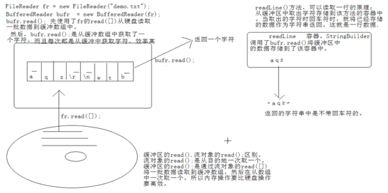

# Java基础知识汇总-IO流

---

### IO体系概述

##### 概念

* IO流用来处理设备之间的数据传输；
* Java对数据的操作是通过流的方式；
* Java用于操作流的对象都在IO包中；
* 流按操作数据的方式分为两种：字符流（Reader、Writer）和字节流（InputStream、OutputStream）；
* 流按流向分为输入流和输出流；

##### Java中的IO继承体系

##### IO流的操作总结

在进行数据操作时，IO包中提供了很多不同功能的对象来操作设备上的数据。在实际开发中，到底用哪个流对象来完成数据处理呢？这是我们最为苦恼的事情。

如何明确具体用哪个流对象呢？通过该规律就明了，规律就是四个明确：

1）明确源和目的

* 源：InputStream、Reader 一定是被读取的。
* 目的：OutputStream、Writer 一定是被写入的。

2）处理的数据是否是纯文本的数据

* 是：使用字符流，Reader、Writer；
* 否：使用字节流，InputStream、OutputStream；

如果是源并且是纯文本，Reader；如果是目的并且是纯文本，Writer。

到这里，两个明确确定完，就可以确定出要使用哪个体系。接下来，就应该明确具体这个体系要使用哪个具体的对象。

3）明确数据所在的设备

源设备：

* 键盘(System.in)
* 硬盘(FileXXX)FileReader、FileInputStream
* 内存(数组)ByteArrayInputStream、CharArrayReader、StringReader
* 网络(Socket)

目的设备：

* 显示器(控制台System.out)
* 硬盘(FileXXX)FileWriter、FileOutputStream
* 内存(数组)ByteArrayOutputStream、CharArrayWriter、StringWriter
* 网络(Socket)

具体使用哪个对象就可以明确了。

4）明确是否需要额外功能

* 是否需要高效？缓冲区Buffered（4个）；
* 是否需要转换？转换流InputStreamReader、OutputStreamWriter；
* 是否操作基本数据类型？ DataInputStream、DataOutputStream；
* 是否操作对象(对象序列化)？ ObjectInputStream、ObjectOutputStream ；
* 需要对多个源合并吗？ SequenceInputStream；
* 需要保证数据的表现形式到目的地吗？ PrintWriter ；

如果数据有规律，并且源和目的都是file，需要随机访问时，可以使用RandomAccessFile工具类。

### File

##### 概念

File类是唯一与文件本身有关的类，使用File类可以进行创建或删除文件等常用操作。

* 用来将文件或者文件夹封装成对象；
* 方便对文件与文件夹的属性信息进行操作；
* File对象可以作为参数传递给流的构造函数。

##### File类的主要方法

| 方法                                              | 描述                               |
| ------------------------------------------------- | ---------------------------------- |
| public static final String pathSeparator          | 路径分隔符（;）                    |
| public static final String separator              | 分隔符（\）                        |
| public File(String pathname)                      | 创建File类对象，传入完整路径       |
| public boolean createNewFile() throws IOException | 创建新文件                         |
| public boolean delete()                           | 删除文件                           |
| public boolean exists()                           | 判断文件是否存在                   |
| public boolean isDirectory()                      | 判断给定的路径是否是一个目录       |
| public long length()                              | 返回文件的大小                     |
| public String[] list()                            | 列出指定目录的全部内容，只列出名称 |
| public File[] listFiles()                         | 列出指定目录的全部内容，会列出路径 |
| public boolean mkdir()                            | 创建一个目录                       |
| public boolean renameTo(File dest)                | 为已有的文件重新命名               |

##### 创建新文件

~~~java
public class Demo{
	public static void main(String[] args){
		File file = new File("D:\\demo.txt");
		File file2 = new File("D:\\temp", "demo.txt");
		try{
			if(!file.exists()){
				file.createNewFile();
			}
		}catch(IOException e){
			e.printStackTrace();
		}
	}
}
~~~

注意：File构造方法`File(String pathname)`当pathname为多级的路径时，创建的file对象只是对最末级的文件或者文件夹进行封装，操作的都是最末级文件或文件夹的属性。

##### 分隔符

~~~java
public class Demo{
	public static void main(String[] args){
		System.out.println(File.pathSeparator); // (;)、(:)
		System.out.println(File.separator); // (\)、(/)
	}
}
~~~

Windows系统的目录分隔符是反斜杠（\），路径分隔符是分号（;）；Linux系统的目录分隔符是正斜杠（/），路径分隔符是冒号（:）。

~~~java
public class Demo{
	public static void main(String[] args){
		String path = "D:"+File.separator+"demo.txt";
		File file = new File(path);
		try{
			file.createNewFile();
		}catch(IOException e){
			e.printStackTrace();
		}
	}
}
~~~

##### 删除文件

~~~java
public class Demo{
	public static void main(String[] args){
		String path = "D:"+File.separator+"demo.txt";
		File file = new File(path);
		if(file.exists()){
			file.delete();
		}
	}
}
~~~

##### 创建文件夹

~~~java
public class Demo{
	public static void main(String[] args){
		String path = "D:"+File.separator+"temp";
		File dir = new File(path);
		if(!dir.exists()){
			file.mkdir();
		}
	}
}
~~~

##### 判断是否目录

~~~java
public class Demo{
	public static void main(String[] args){
		String path = "D:"+File.separator+"temp";
		File file = new File(path);
		if(file.isDirectory()){
			System.out.println(file.getPath()+"是目录");
		}else{
			System.out.println(file.getPath()+"不是目录");
		}
	}
}
~~~

##### 列出文件

1）列出文件名

~~~java
public class Demo{
	public static void main(String[] args){
		String path = "D:"+File.separator+"temp";
		File file = new File(path);
		String[] str = file.list();
		for(String s : str){
			System.out.println(s);
		}
	}
}
~~~

2）列出文件

~~~java
public class Demo{
	public static void main(String[] args){
		String path = "D:"+File.separator+"temp";
		File file = new File(path);
		File[] files = file.listFiles();
		for(File f : files){
			System.out.println(f);
		}
	}
}
~~~

3）使用过滤器

~~~java
public class Demo{
	public static void main(String[] args){
		String path = "D:"+File.separator+"temp";
		File file = new File(path);
		String[] names = file.list(new FilenameFilter() {
			@Override
			public boolean accept(File dir, String name) {
				return name.endsWith(".java");
			}
		});
		for(String name : names){
			System.out.println(name);
		}
	}
}
~~~

~~~java
public class Demo{
	public static void main(String[] args){
		String path = "D:"+File.separator+"temp";
		File file = new File(path);
		File[] files = file.listFiles(new FileFilter() {
			@Override
			public boolean accept(File pathname) {
				return pathname.isHidden();
			}
		});
		for(File f : files){
			System.out.println(f);
		}
	}
}
~~~

4）递归列出

~~~java
public class Demo{
	public static void main(String[] args){
		String path = "D:"+File.separator+"temp";
		File file = new File(path);
		print(file);
	}
	public static void print(File file){
		if(null==file){
			return;
		}
		if(file.isDirectory()){
			File[] files = file.listFiles();
			if(files!=null){
				for(File f : files){
					print(f);
				}
			}
		}else{
			System.out.println(file);
		}
	}
}
~~~

~~~java
public class Demo {
	public static void main(String[] args) throws Exception {
		File dir = new File("c:\\");
		showDir(dir);
	}
	public static void showDir(File dir) {
		System.out.println("dir:" + dir);
		File[] files = dir.listFiles();
		for(File f : files) {
			if(f.isDirectory()) {
				showDir(f);
			} else {
				System.out.println("file:" + f);
			}
		}
	}
}
~~~

### RandomAccessFile

##### 概念

File类只是对文件本身进行操作，如果要对文件内容进行操作，则可以使用RandomAccessFile类。此类属于随机读取类，可以随机地读取一个文件中指定位置的数据。

* 该对象既可以读取又可以写入；
* 该对象中封装了一个byte[]数组；
* 随机访问文件，自身具备读写的方法；
* 通过skipBytes、seek来达到随机访问；

##### RandomAccessFile类的主要方法

| 方法                                                         | 描述                                       |
| ------------------------------------------------------------ | ------------------------------------------ |
| public RandomAccessFile(File file, String mode) throws FileNotFoundException | 构造方法                                   |
| public RandomAccessFile(String name, String mode) throws FileNotFoundException | 构造方法                                   |
| public void close() throws IOException                       | 关闭操作                                   |
| public int read(byte[] b) throws IOException                 | 将内容读取到一个byte数组中                 |
| public final byte readByte() throws IOException              | 读取一个字节                               |
| public final int readInt() throws IOException                | 从文件中读取整型数据                       |
| public void seek(long pos) throws IOException                | 设置读指针的位置                           |
| public final void writeBytes(String s) throws IOException    | 将一个字符串写入到文件中，按字节的方式处理 |
| public final void writeInt(int v) throws IOException         | 将一个int类型数据写入文件                  |
| public int skipBytes(int n) throws IOException               | 指针跳过n个字节                            |

mode：r为只读，w为只写，rw为读写。如果使用rw模式，并且要写入的文件不存在，则系统会自动创建。

##### 写入数据

~~~java
public class Demo{
	public static void main(String[] args){
		String path = "D:"+File.separator+"demo.txt";
		File file = new File(path);
		RandomAccessFile raf = new RandomAccessFile(file, "rw");
		String name = "zhangsan";
		int age = 20;
		raf.writeBytes(name);
		raf.writeInt(age);
		name = "lisi";
		age = 30;
		raf.writeBytes(name);
		raf.writeInt(age);
		name = "wangwu";
		age = 40;
		raf.writeBytes(name);
		raf.writeInt(age);
		raf.close();
	}
}
~~~

##### 读取数据

~~~java
public class Demo{
	public static void main(String[] args){
		String path = "D:"+File.separator+"demo.txt";
		File file = new File(path);
		RandomAccessFile raf = new RandomAccessFile(file, "r");
		
		String name = null;
		int age = 0;
		byte[] buf = new byte[8];
		
		raf.skipBytes(12);
		for(int i=0; i<buf.length; i++){
			buf[i] = raf.readByte();
		}
		name = new String(buf);
		age = raf.readInt();
		
		buf = new byte[8];
		raf.skipBytes(12);
		for(int i=0; i<buf.length; i++){
			buf[i] = raf.readByte();
		}
		name = new String(buf);
		age = raf.readInt();
		
		raf.close();
	}
}
~~~

### 字节流

##### 概念

字节流主要操作字节类型数据，以byte数组为准，主要操作类是OutputStream和InputStream。

##### 字节输入流InputStream

| 方法                                          | 描述                                     |
| --------------------------------------------- | ---------------------------------------- |
| public int available() throws IOException     | 取得输入文件的大小                       |
| public void close() throws IOException        | 关闭输入流                               |
| public abstract int read() throws IOException | 读取内容                                 |
| public int read(byte[] b) throws IOException  | 将内容读到byte数组中，同时返回读入的个数 |

示例代码

1）一个一个字节地读取

读取一个输出一个：

~~~java
public class Demo {
	public static void main(String[] args) throws Exception {
		String path = "D:"+File.separator+"demo.txt";
		InputStream in = new FileInputStream(path);
		byte b = -1;
		while((b=in.read()) != -1) {
			System.out.println(b);
		}
		in.close();
	}
}
~~~

一个一个读取，存到数组：

~~~java
public class Demo{
	public static void main(String[] args) throws Exception{
		String path = "D:"+File.separator+"demo.txt";
		File file = new File(path);
		InputStream in = new FileInputStream(file);
		//byte[] buf = new byte[(int)file.length()];
		byte[] buf = new byte[(int)in.available()];
		for(int i=0; i<buf.length; i++){
			buf[i] = (byte)in.read();
		}
		String str = new String(buf);
		in.close();
	}
}
~~~

如果文件很大，以上方式会不适用。可以根据是否读到文件末尾来判断：

~~~java
public class Demo{
	public static void main(String[] args) throws Exception{
		String path = "D:"+File.separator+"demo.txt";
		File file = new File(path);
		InputStream in = new FileInputStream(file);
		byte[] buf = new byte[1024*5];
		int len = 0;
		int temp = -1;
		while((temp=in.read())!=-1){
			buf[len++] = (byte)temp;
		}
		String str = new String(buf, 0, len);
		in.close();
	}
}
~~~

2）读取到字节数组

~~~java
public class Demo{
	public static void main(String[] args) throws Exception{
		String path = "D:"+File.separator+"demo.txt";
		File file = new File(path);
		InputStream in = new FileInputStream(file);
		//byte[] buf = new byte[(int)file.length()];
		//byte[] buf = new byte[(int)in.available()];
		byte[] buf = new byte[1024];
		int len = in.read(buf);
		String str = new String(buf, 0, len);
		in.close();
	}
}
~~~

一次读取或许读取不完，需要循环读取：

~~~java
public class Demo {
	public static void main(String[] args) throws Exception {
		String path = "D:"+File.separator+"demo.txt";
		InputStream in = new FileInputStream(path);
		byte[] buf = new byte[1024];
		int len = 0;
		while((len=in.read(buf)) > 0) {
			System.out.println(new String(buf, 0, len));
		}
		in.close();
	}
}
~~~

> 文件如果不存在就会抛出异常。

##### 字节输出流OutputStream

| 方法                                                         | 描述                               |
| ------------------------------------------------------------ | ---------------------------------- |
| public void close() throws IOException                       | 关闭数据流                         |
| public void flush() throws IOException                       | 刷新缓冲区                         |
| public void write(byte[] b) throws IOException               | 将一个byte数组写入数据流           |
| public void write(byte[] b, int offset, int len) throws IOException | 将一个指定范围的byte数组写入数据流 |
| public abstract void write(byte b) throws IOException        | 将一个字节数据写入数据流           |

示例代码

1）一个一个字节地写入

~~~java
public class Demo{
	public static void main(String[] args) throws Exception{
		String path = "D:"+File.separator+"demo.txt";
		File file = new File(path);
		OutputStream out = new FileOutputStream(file);
		String str = "hello world!";
		byte[] buf = str.getBytes();
		for(int i=0; i<buf.length; i++){
			out.write(buf[i]);
		}
		out.flush();
		out.close();
	}
}
~~~

2）写入到字节数组

~~~java
public class Demo{
	public static void main(String[] args) throws Exception{
		String path = "D:"+File.separator+"demo.txt";
		File file = new File(path);
		OutputStream out = new FileOutputStream(file);
		String str = "hello world!";
		byte[] buf = str.getBytes();
		out.write(buf);
		out.flush();
		out.close();
	}
}
~~~

3）以追加方式写入

~~~java
public class Demo{
	public static void main(String[] args) throws Exception{
		String path = "D:"+File.separator+"demo.txt";
		File file = new File(path);
		OutputStream out = new FileOutputStream(file, true); //追加
		String str = "hello world!";
		byte[] buf = str.getBytes();
		out.write(buf);
		out.flush();
		out.close();
	}
}
~~~

> 文件如果不存在会自动创建。

##### 复制MP3

~~~java
public class Demo {
	public static void main(String[] args) throws Exception {
		InputStream in = new FileInputStream("demo.mp3");
		OutputStream out = new FileOutputStream("copy.mp3");
		int by = -1;
		while((by=in.read()) != -1) {
			out.write(by);
		}
		in.close();
		out.close();
	}
}
~~~

### 字符流

##### 概念

字符流主要操作字符类型数据，以char数组为准，主要操作类是Writer和Reader。

##### 字符输入流Reader

| 方法                                            | 描述                                   |
| ----------------------------------------------- | -------------------------------------- |
| public abstract void close() throws IOException | 关闭输入流                             |
| public int read() throws IOException            | 读取单个字符                           |
| public int read(char[] c) throws IOException    | 将内容读取到字符数组中，返回读入的长度 |

示例代码

1）一个一个字符地读取

读取一个输出一个：

~~~java
public class Demo {
	public static void main(String[] args) throws Exception {
		String path = "D:"+File.separator+"demo.txt";
		Reader in = new FileReader(path);
		int ch = -1;
		while((ch=in.read()) != -1) {
			System.out.println((char)ch);
		}
		in.close();
	}
}
~~~

一个一个读取，存到数组中：

~~~java
public class Demo{
	public static void main(String[] args) throws Exception{
		String path = "D:"+File.separator+"demo.txt";
		File file = new File(path);
		Reader in = new FileReader(file);
		char[] buf = new char[1024];
		int len = 0;
		int ch = -1;
		while((ch=in.read())!=-1){
			buf[len++] = (char)ch;
		}
		String str = new String(buf, 0, len);
		in.close();
	}
}
~~~

2）读取到字符数组

~~~java
public class Demo{
	public static void main(String[] args) throws Exception{
		String path = "D:"+File.separator+"demo.txt";
		File file = new File(path);
		Reader in = new FileReader(file);
		char[] buf = new char[1024];
		int len = in.read(buf);
		String str = new String(buf, 0, len);
		in.close();
	}
}
~~~

只读取一次可能读取不完，需要循环读取：

~~~java
public class Demo {
	public static void main(String[] args) throws Exception {
		String path = "D:"+File.separator+"demo.txt";
		Reader in = new FileReader(path);
		char[] buf = new char[1024];
		int len = 0;
		while((len=in.read(buf)) > 0) {
			System.out.println(new String(buf, 0, len));
		}
		in.close();
	}
}
~~~

##### 字符输出流Writer

| 方法                                            | 描述           |
| ----------------------------------------------- | -------------- |
| public abstract void close() throws IOException | 关闭输出流     |
| public void write(String s) throws IOException  | 将字符串输出   |
| public void write(char[] c) throws IOException  | 将字符数组输出 |
| public abstract void flush() throws IOException | 刷新缓冲区     |

示例代码

1）写字符数组

~~~java
public class Demo{
	public static void main(String[] args) throws Exception{
		String path = "D:"+File.separator+"demo.txt";
		File file = new File(path);
		Writer out = new FileWriter(file);
		String str = "hello world!";
		char[] buf = str.toCharArray();
		out.write(buf);
		out.flush();
		out.close();
	}
}
~~~

2）写字符串

~~~java
public class Demo{
	public static void main(String[] args) throws Exception{
		String path = "D:"+File.separator+"demo.txt";
		File file = new File(path);
		Writer out = new FileWriter(file);
		String str = "hello world!";
		out.write(str);
		out.flush();
		out.close();
	}
}
~~~

3）追加内容

~~~java
public class Demo{
	public static void main(String[] args) throws Exception{
		String path = "D:"+File.separator+"demo.txt";
		File file = new File(path);
		Writer out = new FileWriter(file, true); //追加
		String str = "hello world!";
		out.write(str);
		out.flush();
		out.close();
	}
}
~~~

##### 字符流的由来

以前处理的数据都是字节数据，使用字节流技术就可以完成了。因为后期编码表的不断出现，识别某一文字的码表不唯一。比如中文，gbk、unicode都可以识别，就出现了编码问题。

~~~plaintext
中文字节数据（gbk）---> 流处理 ---> 解析（gbk）。 
~~~

后期，容易出现这样的问题：

~~~plaintext
中文字节数据（gbk）---> 流处理 ---> 解析（unicode） ---> 数据错误。
~~~

为了处理文字数据，就需要通过字节流技术+编码表相结合来完成。注意，只有文字是这样的，因为文字涉及编码问题。其他数据比如DVD、MP3、图片等是不涉及这个问题的。

虽然字节流+编码表可以解决文字数据处理问题，但是较为麻烦。为了便于使用，将字节流和编码表进行了封装，就出现了便于文字操作的流技术：字符流。其实字符流就是：字节流+编码表。

##### 复制文本文件

~~~java
public class Demo {
	public static void main(String[] args) throws Exception {
		FileReader fr = new FileReader("demo.txt");
		FileWriter fw = new FileWriter("copy.txt");
		char[] buf = new char[1024];
		int len = 0;
		while((len=fr.read(buf)) > 0) {
			fw.write(buf, 0, len);
		}
		fr.close();
		fw.close();
	}
}
~~~

##### LineNumberReader

~~~java
public class Demo {
	public static void main(String[] args) throws Exception {
		FileReader fr = new FileReader("demo.txt");
		LineNumberReader lnr = new LineNumberReader(fr);
		String line = null;
		lnr.setLineNumber(100); //从100开始
		while((line=lnr.readLine()) != null) {
			System.out.println(lnr.getLineNumber() +":"+ line);
		}
		lnr.close();
	}
}
~~~

### 字节流与字符流对比

##### 字符流使用了缓冲区，字节流没有使用缓冲区

~~~java
public class Demo{
	public static void main(String[] args) throws Exception{
		String path = "D:"+File.separator+"demo.txt";
		File file = new File(path);
		OutputStream out = new FileOutputStream(file);
		out.write("hello world!".getBytes());
		//out.close();
	}
}
~~~

此时虽然没有关闭输出流，但是文件中已经存在了内容，证明字节流是直接操作文件本身的。

~~~java
public class Demo{
	public static void main(String[] args) throws Exception{
		String path = "D:"+File.separator+"demo.txt";
		File file = new File(path);
		Writer out = new FileWriter(file);
		out.write("hello world!");
		//out.close();
	}
}
~~~

此时文件中没有任何内容，因为字符流使用了缓冲区，在关闭字符流时会将缓冲区中的内容强制输出。

### 转换流

##### 概念

以文件操作为例，内存中的字符数据需要通过OutputStreamWriter变为字节流才能保存到文件中，读取时需要将读入的字节流通过InputStreamReader变为字符流。转换原理如下：

* 是字符流与字节流之间转换的桥梁；
* 方便了字符流与字节流之间的操作；
* 字节流中的数据都是字符时，转换成字符流操作更高效；
* 可以将字符以指定编码格式存储；
* 可以对文本数据指定编码格式来解读；
* 指定编码表的动作由构造函数完成。

##### InputStreamReader

将输入的字节流变为字符流，即将一个字节流的输入对象变为字符流输入对象。

~~~java
public class Demo{
	public static void main(String[] args) throws Exception{
		String path = "D:"+File.separator+"demo.txt";
		File file = new File(path);
		InputStream in = new FileInputStream(file);
		Reader reader = new InputStreamReader(in);
		char[] buf = new char[1024];
		int len = reader.read(buf);
		String str = new String(buf, 0, len);
		reader.close();
	}
}
~~~

##### OutputStreamWriter

将输出的字符流变为字节流，即将一个字符流的输出对象变为字节流输出对象。

~~~java
public class Demo{
	public static void main(String[] args) throws Exception{
		String path = "D:"+File.separator+"demo.txt";
		File file = new File(path);
		OutputStream out = new FileOutputStream(file);
		Writer writer = new OutputStreamWriter(out);
		writer.write("hello world!");
		writer.close();
	}
}
~~~

可以指定编码：

~~~java
public class Demo{
	public static void main(String[] args) throws Exception{
		FileWriter fw = new FileWriter("demo.txt"); //等价于FileOutputStream+默认编码表GBK

		OutputStreamWriter osw = new OutputStreamWriter(new FileOutputStream("demo.txt"), "UTF-8"); //手动指定编码为UTF-8
	}
}
~~~

##### 综合应用

~~~java
public class Demo {
	public static void main(String[] args) throws Exception {
		BufferedReader bufr = new BufferedReader(new InputStreamReader(System.in));
		BufferedWriter bufw = new BufferedWriter(new OutputStreamWriter(System.out));
		String line = null;
		while((line=bufr.readLine()) != null) {
			if("over".equals(line)) break;
			bufw.write(line.toUpperCase());
			bufw.newLine();
			bufw.flush();
		}
		// 可以不关闭
	}
}
~~~

### 缓冲流

##### 概念

##### 缓冲区

* 缓冲区的出现提高了对数据的读写效率；
* 缓冲区要结合流才可以使用；
* 在流的基础上对流的功能进行了增强；

##### BufferedInputStream

##### BufferedOutputStream

##### BufferedReader

| 方法                                        | 描述                               |
| ------------------------------------------- | ---------------------------------- |
| public BufferedReader(Reader in)            | 构造方法                           |
| public String readLine() throws IOException | 一次性从缓冲区中将内容全部读取进来 |

示例代码

~~~java
public class Demo{
	public static void main(String[] args) throws Exception{
		BufferedReader br = new BufferedReader(new InputStreamReader(System.in));
		String line = null;
		while((line=br.readLine())!=null){
			System.out.println(line);
		}
		br.close();
	}
}
~~~

##### BufferedWriter

##### 复制文本文件

~~~java
public class Demo {
	public static void main(String[] args) {
		BufferedReader bufr = null;
		BufferedWriter bufw = null;
		try {
			bufr = new BufferedReader(new FileReader("demo.txt"));
			bufw = new BufferedWriter(new FileWriter("copy.txt"));
			String line = null;
			while((line=bufr.readLine()) != null) {
				bufw.write(line);
				bufw.newline();
				bufw.flush();
			}
		} catch(Exception e) {
			e.printStackTrace();
		} finally {
			try {
				if(bufr!=null)
					bufr.close();
				if(bufw!=null)
					bufw.close();
			} catch(Exception ex) {
				ex.printStackTrace();
			}
		}
	}
}
~~~

### 内存操作流

##### 概念

当程序中输入和输出的位置设置为内存时，就要使用内存操作流来完成输入和输出功能。

##### ByteArrayInputStream

ByteArrayInputStream的功能主要是将内容写入到内存中。

| 方法                                                         | 描述                         |
| ------------------------------------------------------------ | ---------------------------- |
| public ByteArrayInputStream(byte[] buf)                      | 将内容写入到内存中           |
| public ByteArrayInputStream(byte[] buf, int offset, int length) | 将指定范围的内容写入到内存中 |

##### ByteArrayOutputStream

ByteArrayOutputStream的功能主要是将内存中的数据输出。

| 方法                           | 描述               |
| ------------------------------ | ------------------ |
| public ByteArrayOutputStream() | 构造方法           |
| public void write(int b)       | 将内容从内存中输出 |

##### CharArrayReader

##### CharArrayWriter

##### StringReader

##### StringWriter

##### 综合应用

~~~java
public class Demo{
	public static void main(String[] args) throws Exception{
		String str = "hello world!";
		InputStream in = new ByteArrayInputStream(str.getBytes());
		OutputStream out = new ByteArrayOutputStream();
		int temp = 0;
		while((temp=in.read())!=-1){
			char c = (char)temp;
			out.write(Character.toUpperCase());
		}
		System.out.println(out.toString());
		in.close();
		out.close();
	}
}
~~~

### 数据操作流

##### 概念

DataInputStream和DataOutputStream是与平台无关的数据操作流。通常数据输出流DataOutputStream会按照一定的格式将数据输出，再通过数据输入流DataInputStream按照一定的格式将数据读入，这样可以方便地对数据进行处理。

##### DataInputStream

| 方法                                              | 描述                   |
| ------------------------------------------------- | ---------------------- |
| public DataInputStream(InputStream in)            | 构造方法               |
| public final int readInt() throws IOException     | 从输入流中读取整数     |
| public final float readFloat() throws IOException | 从输入流中读取小数     |
| public final char readChar() throws IOException   | 从输入流中读取一个字符 |

示例代码

~~~java
public class Demo{
	public static void main(String[] args) throws Exception{
		DataInputStream dis = new DataInputStream(new FileInputStream("demo.txt"));
		int i = dis.readInt();
		float f = dis.readFloat();
		double d = dis.readDouble();
		char c = dis.readChar();
		dis.close();
	}
}
~~~

##### DataOutputStream

| 方法                                                       | 描述                             |
| ---------------------------------------------------------- | -------------------------------- |
| public DataOutputStream(OutputStream out)                  | 构造方法                         |
| public final void writeInt(int v) throws IOException       | 将一个int型数据写入到输出流中    |
| public final void writeDouble(double v) throws IOException | 将一个double型数据写入到输出流中 |
| public final void writeChars(String s) throws IOException  | 将一个字符串写入到输出流中       |
| public final void writeChar(int v) throws IOException      | 将一个字符写入到输出流中         |

示例代码

~~~java
public class Demo{
	public static void main(String[] args) throws Exception{
		DataOutputStream dos = new DataOutputStream(new FileOutputStream("demo.txt"));
		dos.writeInt(10);
		dos.writeFloat(1.1f);
		dos.writeDouble(12.34);
		dos.writeChar('a');
		dos.writeChars("abc");
		dos.close();
	}
}
~~~

### 管道流

##### 概念

管道流的主要作用是可以进行两个线程间的通信，分为管道输入流和管道输出流。如果要进行管道输出，则必须把输出流连接在输入流上。

##### PipedInputStream

##### PipedOutputStream

##### 综合应用

~~~java
class Send implements Runnable{
	private PipedOutputStream pos;
	public Send(PipedOutputStream pos){
		this.pos = pos;
	}
	public void run(){
		String info = "hello world!";
		try{
			this.pos.write(info.getBytes());
			this.pos.close();
		}catch(Exception e){
			e.printStackTrace();
		}
	}
}
class Receive implements Runnable{
	private PipedInputStream pis;
	public Receive(PipedInputStream pis){
		this.pis = pis;
	}
	public void run(){
		byte[] buf = new byte[1024];
		int len = 0;
		try{
			len = this.pis.read(buf);
			System.out.println(new String(buf, 0, len));
			this.pis.close();
		}catch(Exception e){
			e.printStackTrace();
		}
	}
}
public class Demo{
	public static void main(String[] args) throws Exception{
		PipedOutputStream pos = new PipedOutputStream();
		PipedInputStream pis = new PipedInputStream();
		pos.connect(pis);
		Send send = new Send(pos);
		Receive receive = new Receive(pis);
		new Thread(send).start();
		new Thread(receive).start();
	}
}
~~~

### 压缩流

##### 概念

##### ZipFile

| 方法                                                         | 描述                 |
| ------------------------------------------------------------ | -------------------- |
| public ZipFile(File file) throws ZipException, IOException   | 构造方法             |
| public ZipEntry getEntry(String name)                        | 根据名称获取ZipEntry |
| public InputStream getInputStream(ZipEntry e) throws IOException | 从ZipEntry获取输入流 |
| public String getName()                                      | 得到压缩文件名称     |

~~~java
public class Demo{
	public static void main(String[] args) throws Exception{
		ZipFile zipFile = new ZipFile(new File("demo.zip"));
		File srcFile = new File("demo.txt");
		ZipEntry entry = zipFile.getEntry("demo.txt");
		InputStream in = zipFile.getInputStream(entry);
		OutputStream out = new FileOutputStream(srcFile);
		int temp = 0;
		while((temp=in.read())!=-1){
			out.write(temp);
		}
		in.close();
		out.close();
	}
}
~~~

##### ZipEntry

每一个压缩文件中都会存在多个子文件，每一个子文件在Java中就用ZipEntry表示。

##### ZipInputStream

~~~java
public class Demo{
	public static void main(String[] args) throws Exception{
		File file = new File("demo.zip");
		File outFile = null;
		ZipFile zipFile = new ZipFile(file);
		ZipInputStream zipIn = new ZipInputStream(new FileInputStream(file));
		ZipEntry entry = null;
		InputStream in = null;
		OutputStream out = null;
		while((entry=zipIn.getNextEntry())!=null){
			outFile = new File(entry.getName());
			if(!outFile.getParentFile().exists()){
				outFile.getParentFile().mkdir();
			}
			if(!outFile.exists()){
				outFile.createNewFile();
			}
			in = zipFile.getInputStream(entry);
			out = new FileOutputStream(outFile);
			int temp = 0;
			while((temp=in.read())!=-1){
				out.write(temp);
			}
			in.close();
			out.close();
		}
	}
}
~~~

##### ZipOutputStream

| 方法                                                    | 描述               |
| ------------------------------------------------------- | ------------------ |
| public ZipOutputStream(OutputStream out)                | 构造方法           |
| public void putNextEntry(ZipEntry e) throws IOException | 设置每一个ZipEntry |
| public void setComment(String comment)                  | 设置注释           |

~~~java
public class Demo{
	public static void main(String[] args) throws Exception{
		File srcFile = new File("demo.txt");
		File zipFile = new File("demo.zip");
		InputStream in = new FileInputStream(srcFile);
		ZipOutputStream out = new ZipOutputStream(new FileOutputStream(zipFile));
		out.putNextEntry(new ZipEntry(srcFile.getName()));
		out.setComment("this is comment.");
		int temp = 0;
		while((temp=in.read())!=-1){
			out.write(temp);
		}
		in.close();
		out.close();
	}
}
~~~

将文件夹进行压缩：

~~~java
public class Demo{
	public static void main(String[] args) throws Exception{
		File srcFile = new File("demo");
		File zipFile = new File("demo.zip");
		InputStream in = null;
		ZipOutputStream out = new ZipOutputStream(new FileOutputStream(zipFile));
		out.setComment("this is comment.");
		if(srcFile.isDirectory()){
			File[] files = srcFile.listFiles();
			for(File f : files){
				in = new FileInputStream(f);
				out.putNextEntry(new ZipEntry(srcFile.getName()+File.separator+f.getName()));
				int temp = 0;
				while((temp=in.read())!=-1){
					out.write(temp);
				}
				in.close();
			}
		}
		out.close();
	}
}
~~~

##### GZIP压缩

GZIPInputStream、GZIPOutputStream

##### Jar压缩

JARFile、JAREntry、JarInputStream、JarOutputStream

### 合并流

##### 概念

合并流的主要功能是将两个文件的内容合并成一个文件。要实现合并流，则必须使用SequenceInputStream。

##### SequenceInputStream

~~~java
public class Demo{
	public static void main(String[] args) throws Exception{
		InputStream is1 = new FileInputStream("demo1.txt");
		InputStream is2 = new FileInputStream("demo2.txt");
		OutputStream out = new FileOutputStream("demo.txt");
		SequenceInputStream sis = new SequenceInputStream(is1, is2);
		int temp = 0;
		while((temp=sis.read())!=-1){
			out.write(temp);
		}
		sis.close();
		out.close();
		is1.close();
		is2.close();
	}
}
~~~

##### 综合应用

~~~java
public class Demo{
	public static void main(String[] args) throws Exception{
		FileInputStream fis1 = new FileInputStream("demo1.txt");
		FileInputStream fis2 = new FileInputStream("demo2.txt");
		FileInputStream fis3 = new FileInputStream("demo3.txt");

		Vector<InputStream> v = new Vector<InputStream>();
		v.add(fis1);
		v.add(fis2);
		v.add(fis3);
		Enumeration<InputStream> en = v.elements();
		SequenceInputStream sis = new SequenceInputStream(en);
		FileOutputStream fos = new FileOutputStream("dest.txt");
		byte[] buf = new byte[1024];
		int len = 0;
		while((len=sis.read(buf)) != -1) {
			fos.write(buf, 0, len);
		}
		sis.close();
		fos.close();
	}
}
~~~

如果改用ArrayList，可以自定义枚举：

~~~java
public class Demo{
	public static void main(String[] args) throws Exception{
		FileInputStream fis1 = new FileInputStream("demo1.txt");
		FileInputStream fis2 = new FileInputStream("demo2.txt");
		FileInputStream fis3 = new FileInputStream("demo3.txt");

		List<InputStream> list = new ArrayList<InputStream>();
		list.add(fis1);
		list.add(fis2);
		list.add(fis3);
		final Iterator<InputStream> it = list.iterator();
		Enumeration<InputStream> en = new Enumeration<InputStream>() {
			@Override
			public boolean hasMoreElements() {
				return it.hasNext();
			}
			@Override
			public InputStream nextElement() {
				return it.next();
			}
		};
		
		//或者使用工具类进行转换
		//Enumeration<InputStream> en = Collections.enumeration(list);

		SequenceInputStream sis = new SequenceInputStream(en);
		FileOutputStream fos = new FileOutputStream("dest.txt");
		byte[] buf = new byte[1024];
		int len = 0;
		while((len=sis.read(buf)) != -1) {
			fos.write(buf, 0, len);
		}
		sis.close();
		fos.close();
	}
}
~~~

### 回退流

##### 概念

在Java的IO中所有的数据都是采用顺序的读取方式，即对于一个输入流来说，都是采用从头到尾的顺序读取的。如果在输入流中某个不需要的内容被读取进来，则只能通过程序将这些不需要的内容处理掉。Java中提供了一种回退输入流，可以把读取进来的某些数据重新退回到输入流的缓冲区中。

##### PushbackInputStream

| 方法                                                         | 描述                           |
| ------------------------------------------------------------ | ------------------------------ |
| public PushbackInputStream(InputStream in)                   | 构造方法                       |
| public int read() throws IOException                         | 读取数据                       |
| public int read(byte[] b, int offset, int len) throws IOException | 读取指定范围的数据             |
| public void unread(int b) throws IOException                 | 回退一个数据到缓冲区           |
| public void unread(byte[] b) throws IOException              | 回退一组数据到缓冲区           |
| public void unread(byte[] b, int offset, int len) throws IOException | 回退指定范围的一组数据到缓冲区 |

~~~java
public class Demo{
	public static void main(String[] args) throws Exception{
		String str = "hello.world.welcome.thank.you!";
		ByteArrayInputStream bis = new ByteArrayInputStream(str.getBytes());
		PushbackInputStream pis = new PushbackInputStream(bis);
		int temp = 0;
		while((temp=pis.read())!=-1){
			if(temp=='.'){
				pis.unread(temp);
				temp = pis.read();
				System.out.println("退回"+(char)temp);
			}else{
				System.out.println((char)temp);
			}
		}
	}
}
~~~

##### PushbackReader

### 打印流

##### 概念

打印流提供了非常方便的打印功能，可以打印任何的数据类型，如小数、整数、字符串等。

##### PrintStream

| 方法                                                         | 描述                           |
| ------------------------------------------------------------ | ------------------------------ |
| public PrintStream(File file) throws FileNotFoundException   | 构造方法                       |
| public PrintStream(OutputStream out)                         | 构造方法                       |
| public PrintStream printf(Locale l, String format, Object...args) | 根据指定的Locale进行格式化输出 |
| public PrintStream printf(String format, Object...args)      | 根据本地环境格式化输出         |
| public void print(boolean b)                                 | 输出任意数据                   |
| public void println(boolean b)                               | 输出任意数据后换行             |

示例代码

1）基本示例

~~~java
public class Demo{
	public static void main(String[] args) throws Exception{
		PrintStream ps = new PrintStream(new FileOutputStream("demo.txt"));
		ps.print("hello");
		ps.println("world");
		ps.close();
	}
}
~~~

2）格式化输出

~~~java
public class Demo{
	public static void main(String[] args) throws Exception{
		PrintStream ps = new PrintStream(new FileOutputStream("demo.txt"));
		String name = "zhangsan";
		int age = 22;
		float score = 88.5f;
		char sex = 'm';
		ps.printf("name:%s, age:%d, score:%f, sex:%c", name, age, score, sex);
		ps.printf("name:%s, age:%s, score:%s, sex:%s", name, age, score, sex); //%d %f %c 可以使用%s 代替
		ps.close();
	}
}
~~~

* %s：表示的内容为字符串；
* %d：表示的内容为整数；
* %f：表示的内容为小数；
* %c：表示的内容为字符；

##### PrintWriter

### 系统输入输出

##### 概念

System类的常量和方法

| 常量/方法                                  | 描述                       |
| ------------------------------------------ | -------------------------- |
| public static final PrintStream out        | 系统标准输出，一般是显示器 |
| public static final PrintStream err        | 系统错误输出               |
| public static final InputStream in         | 系统标准输入，一般是键盘   |
| public static void setOut(PrintStream out) | 重定向标准输出             |
| public static void setErr(PrintStream err) | 重定向错误输出             |
| public static void setIn(InputStream in)   | 重定向标准输入             |

##### System.out

~~~java
public class Demo{
	public static void main(String[] args) throws Exception{
		OutputStream out = System.out;
		out.write("hello world!".getBytes());
		out.close();
	}
}
~~~

##### System.err

~~~java
public class Demo{
	public static void main(String[] args) throws Exception{
		String str = "hello world!";
		try{
			Integer.parseInt(str);
		}catch(Exception e){
			System.err.println(e);
		}
	}
}
~~~

##### System.in

~~~java
public class Demo{
	public static void main(String[] args) throws Exception{
		InputStream in = System.in;
		byte[] buf = new byte[1024];
		int len = in.read(buf);
		String str = new String(buf, 0, len);
	}
}
~~~

~~~java
public class Demo{
	public static void main(String[] args) throws Exception{
		InputStream in = System.in;
		StringBuffer sb = new StringBuffer();
		int temp = 0;
		while((temp=in.read())!=-1){
			char c = (char)temp;
			if(c=='\n'){
				break;
			}
			sb.append(c);
		}
		System.out.println(sb);
	}
}
~~~

~~~java
public class Demo {
	public static void main(String[] args) throws Exception {
		InputStream in = System.in;
		StringBuilder sb = new StringBuilder();
		int ch = 0;
		while((ch=in.read()) != -1) {
			if(ch=="\r")
				continue;
			if(ch=="\n") {
				String s = sb.toString();
				if("over".equals(s)) {
					break;
				} else {
					System.out.println(s.toUpperCase());
					sb.delete(0, sb.length());
				}
			} else {
				sb.append(ch);
			}
		}
	}
}
~~~

注意，从系统中获取到的流对象都是唯一的，如果将其关闭，就不能再使用了。所以一般情况下，从System获取到的流对象，一般不需要关闭，随着程序的停止而结束。

##### 输入/输出重定向

~~~java
public class Demo{
	public static void main(String[] args) throws Exception{
		OutputStream os = new FileOutputStream("demo.txt");
		System.setOut(os);
		System.out.println("hello world!");
		System.setErr(os);
		System.err.println("error!");
	}
}
~~~

~~~java
public class Demo{
	public static void main(String[] args) throws Exception{
		InputStream is = new FileInputStream("demo.txt");
		System.setIn(is);
		InputStream in = System.in;
		byte[] buf = new byte[1024];
		int len = in.read(buf);
		String str = new String(buf, 0, len);
	}
}
~~~

### Scanner

##### 概念

Scanner是JDK1.5提供的专门的数据输入类，此类不仅可以完成输入数据的操作，也可以方便地对输入的数据进行验证。

##### Scanner常用方法

| 方法                                                     | 描述                               |
| -------------------------------------------------------- | ---------------------------------- |
| public Scanner(File source) throws FileNotFoundException | 构造方法                           |
| public Scanner(InputStream source)                       | 构造方法                           |
| public boolean hasNext(Pattern pattern)                  | 判断输入内容是否符合指定的正则标准 |
| public boolean hasNextInt()                              | 判断输入的是否是整数               |
| public boolean hasNextFloat()                            | 判断输入的是否是小数               |
| public String next()                                     | 接收内容                           |
| public String next(Pattern pattern)                      | 接收内容，进行正则校验             |
| public int nextInt()                                     | 接收整数                           |
| public float nextFloat()                                 | 接收小数                           |
| public Scanner useDelimiter(String pattern)              | 设置读取的分隔符                   |

##### 使用Scanner输入数据

1）基础示例

~~~java
public class Demo{
	public static void main(String[] args) throws Exception{
		Scanner scanner = new Scanner(System.in);
		String str = scanner.next(); //默认以空格为分隔符
		str = scanner.next();
		scanner.useDelimiter("\n"); //将分隔符改为换行符
		str = scanner.next();
		str = scanner.next();
		
		if(scanner.hasNextInt()){
			int i = scanner.nextInt();
		}
		if(scanner.hasNextFloat()){
			float f = scanner.nextFloat();
		}
	}
}
~~~

2）输入日期类型数据

~~~java
public class Demo{
	public static void main(String[] args) throws Exception{
		Scanner scanner = new Scanner(System.in);
		String pattern = "^\\d{4}-\\d{2}-\\d{2}$";
		if(scanner.hasNext(pattern)){
			String str = scanner.next(pattern);
			Date date = new SimpleDateFormat("yyyy-MM-dd").parse(str);
		}
	}
}
~~~

3）从文件输入

~~~java
public class Demo{
	public static void main(String[] args) throws Exception{
		File file = new File("demo.txt");
		Scanner scanner = new Scanner(file);
		StringBuffer sb = new StringBuffer();
		while(scanner.hasNext()){
			sb.append(scanner.next());
		}
		System.out.println(sb);
	}
}
~~~

### 对象序列化

##### 概念

对象序列化就是把一个对象变为二进制数据流的一种方法，通过对象序列化可以方便地实现对象的传输或存储。

##### Serializable

如果一个类的对象想被序列化，则对象所在的类必须实现`java.io.Serializable`接口。

~~~java
class Person implements Serializable{
	private String name;
	private int age;
	public Person(){
		
	}
	public Person(String name, int age){
		this.name = name;
		this.age = age;
	}
	public void setName(String name){
		this.name = name;
	}
	public String getName(){
		return name;
	}
	public void setAge(int age){
		this.age = age;
	}
	public int getAge(){
		return age;
	}
}
~~~

> 类的非静态、非瞬态（transient）字段的值将被序列化。

##### 序列化的版本兼容性

在对象进行序列化或反序列化操作时，要考虑JDK版本的问题。如果序列化的JDK版本和反序列化的JDK版本不一致就有可能造成异常，所以引入了一个serialVersionUID的常量，可以通过此常量来验证版本的一致性。在进行反序列化操作时，JVM会把传来的字节流中的serialVersionUID与本地相应实体中的serialVersionUID进行比较，如果相同就认为是一致的，可以进行反序列化，否则就会出现序列化版本不一致的异常。

当实现Serializable接口的实体类没有显式地定义serialVersionUID时，Java序列化机制在编译时会自动生成一个此版本的serialVersionUID。如果不希望自动生成，也可以直接显式定义。只要不修改这个变量值的序列化实体，就可以相互进行序列化和反序列化。

##### ObjectOutputStream

~~~java
public class Demo{
	public static void main(String[] args) throws Exception{
		ObjectOutputStream oos = new ObjectOutputStream(new FileOutputStream("Person.txt"));
		oos.writeObject(new Person("zhangsan", 21));
		oos.close();
	}
}
~~~

> 只有属性值被序列化。

##### ObjectInputStream

~~~java
public class Demo{
	public static void main(String[] args) throws Exception{
		ObjectInputStream ois = new ObjectInputStream(new FileInputStream("Person.txt"));
		Person p = (Person)ois.readObject();
		ois.close();
	}
}
~~~

##### Externalizable

实现Serializable接口的类的对象的内容都将被序列化，如果希望自己指定序列化内容，则可以实现Externalizable接口。

~~~java
public interface Externalizable extends Serializable{
	public void writeExternal(ObjectOutput out) throws IOException;
	public void readExternal(ObjectInput in) throws IOException, ClassNotFoundException;
}
~~~

可以有选择地进行序列化和反序列化：

~~~java
class Person implements Externalizable{
	private String name;
	private int age;
	public Person(){
		
	}
	public Person(String name, int age){
		this.name = name;
		this.age = age;
	}
	public void setName(String name){
		this.name = name;
	}
	public String getName(){
		return name;
	}
	public void setAge(int age){
		this.age = age;
	}
	public int getAge(){
		return age;
	}
	
	public void writeExternal(ObjectOutput out) throws IOException{
		out.writeObject(name);
		out.writeInt(age);
	}
	public void readExternal(ObjectInput in) throws IOException, ClassNotFoundException{
		name = (String)in.readObject();
		age = in.readInt();
	}
}
~~~

##### transient

使用transient关键字声明的属性不会被序列化。

~~~java
class Person implements Serializable{
	private String name;
	private transient int age;
	public Person(){
		
	}
	public Person(String name, int age){
		this.name = name;
		this.age = age;
	}
	public void setName(String name){
		this.name = name;
	}
	public String getName(){
		return name;
	}
	public void setAge(int age){
		this.age = age;
	}
	public int getAge(){
		return age;
	}
}
~~~

### 字符编码

##### 概念

* ASCII：美国标准信息交换码，用一个字节的7位表示；
* ISO8859-1：拉丁码表，欧洲码表，用一个字节的8位表示，只能表示0~255的字符范围，主要在英文应用；
* GBK/GB2312：中文的国标编码，专门用来表示汉字，双字节编码。如果出现英文，则使用ISO8859-1编码。GBK可以表示简体和繁体中文，而GB2312只支持简体，GBK兼容GB2312；
* Unicode：Java的默认编码，使用十六进制表示编码，所有文字都用两个字节来表示，但是不兼容ISO8859-1编码；
* UTF：不定长编码，每一个字符长度为1~6个字节不等，兼容ISO8859-1编码；
* UTF-8：最多用三个字节来表示一个字符；

##### 获取本地编码

~~~java
public class Demo{
	public static void main(String[] args){
		String encoding = System.getProperty("file.encoding");
	}
}
~~~

##### 乱码问题

字符串"你好"，先用GBK编码，再用UTF-8解码，结果是乱码；可是对乱码结果先进行UTF-8编码后，再用GBK解码，结果为什么还是乱码？

~~~java
public class Demo{
	public static void main(String[] args){
		String s = "你好";
		byte[] buf = s.getBytes("GBK");
		String s1 = new String(buf, "UTF-8");
		System.out.println(s1); //乱码

		byte[] buf2 = s1.getBytes("UTF-8");
		String s2 = new String(buf2, "GBK");
		System.out.println(s2); //乱码
	}
}
~~~

如图，用GBK编码后的数值去查UTF-8的码表时不识别，就直接用一个未知字符来表示。而这个未知字符是3个字节的，所以原数字码已经变化了，所以就还原不回来了。

GBK转UTF-8的时候，对UTF-8不认识的会用特殊字符替换，所以转换失败。如果解错了，可以更换一个码表再解。

   

---

