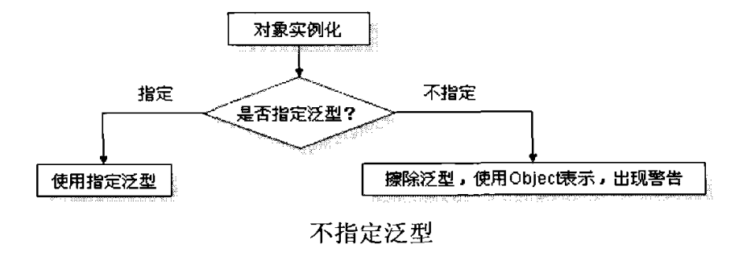

# Java基础知识汇总-泛型

---

### 泛型的基本概念

##### 概念

所谓的泛型（Generics）就是指在对象建立时不指定类中属性的具体类型，而是由外部在声明及实例化对象时指定类型。泛型是JDK1.5出现的技术，是一个安全机制。 

##### 泛型技术的由来

我们知道，集合中可以存储任意类型的对象，但是在取出时，如果要使用具体对象的特有方法时，就需要进行向下转型。如果存储的对象类型不一致，在转型过程中就会出现`ClassCastException`类转换异常，这样就给程序的安全性带来了影响。

在JDK1.5以后有了解决方案，就是泛型技术。解决方案就是，在存储元素时，就不允许存储不同类型的元素，存储了就编译失败。 所以就需要在存储元素时，在容器上明确指定具体的元素类型。这其实和数组的定义很像。

##### 为什么需要使用泛型

设计一个表示坐标点的类Point，坐标由X和Y组成，坐标的表示方法有整数、小数和字符串3种。而要想使用一个类型可以同时接收3种数据类型，则只能使用Object，因为Object类可以接收任意类型的数据，都会自动发生向上转型操作。

~~~java
class Point{
	private Object x;
	private Object y;
	public Point(){}
	public Point(Object x, Object y){
		this.x = x;
		this.y = y;
	}
	public void setX(Object x){
		this.x = x;
	}
	public Object getX(){
		return x;
	}
	public void setY(Object y){
		this.y = y;
	}
	public Object getY(){
		return y;
	}
}
public class Demo{
	public static void main(String[] args){
		Point p1 = new Point();
		p1.setX(10);
		p1.setY(20);
		int x1 = (Integer)p1.getX();
		int y1 = (Integer)p1.getY();
		
		Point p2 = new Point();
		p2.setX(11.2f);
		p2.setY(22.3f);
		float x2 = (Float)p2.getX();
		float y2 = (Float)p2.getY();
		
		Point p3 = new Point();
		p3.setX("10");
		p3.setY("20");
		String x3 = (String)p3.getX();
		String y3 = (String)p3.getY();
	}
}
~~~

Object类可以接收任意的子类对象，也就是说可以把x设置成数字，把y设置成字符串，如下所示：

~~~java
public class Demo{
	public static void main(String[] args){
		Point p = new Point();
		p.setX(10);
		p.setY("20");
		int x = (Integer)p.getX();
		int y = (Integer)p.getY();
	}
}
~~~

程序可以正常通过编译，但是在运行时出现了类转换异常`ClassCastException`。

##### 泛型的基本定义

泛型可以解决数据类型的安全性问题，其主要原理是在类声明时通过一个标识表示类中某个属性的类型或者是某个方法的返回值及参数类型，这样在类声明或实例化时只要指定好需要的类型即可。

其实，泛型无非就是通过`<>`定义了一个形式参数，专门用于接收具体的引用类型。在使用时，一定要传递对应的实际参数类型。在集合中泛型的应用特别多见。

> 当一个类要操作的引用数据类型不确定的时候，可以将该类型定义为一个形参。在用到这个类的时候，由使用者来通过传递类型参数的形式，来确定要操作的具体对象类型。

泛型类定义

~~~java
[访问权限] class 类名称<泛型类型标识1,泛型类型标识2, ... 泛型类型标识n>{
	[访问权限] 泛型类型标识 变量名称;
	[访问权限] 泛型类型标识 方法名称(){};
	[访问权限] 返回值类型声明 方法名称(泛型类型标识 变量名称){};
}
~~~

泛型对象定义

~~~java
类名称<具体类> 对象名称 = new 类名称<具体类>();
~~~

1）基本示例

~~~java
class Point<T>{
	private T var;
	public Point(){}
	public Point(T var){
		this.var = var;
	}
	public void setVar(T var){
		this.var = var;
	}
	public T getVar(){
		return var;
	}
}
public class Demo{
	public static void main(String[] args){
		Point<Integer> p1 = new Point<Integer>();
		p1.setVar(10);
		int var1 = p1.getVar();
		
		Point<String> p2 = new Point<String>();
		p2.setVar("10");
		String var2 = p2.getVar();
	}
}
~~~

2）改进问题代码

~~~java
class Point<T>{
	private T x;
	private T y;
	public Point(){}
	public Point(T x, T y){
		this.x = x;
		this.y = y;
	}
	public void setX(T x){
		this.x = x;
	}
	public T getX(){
		return x;
	}
	public void setY(T y){
		this.y = y;
	}
	public T getY(){
		return y;
	}
}
public class Demo{
	public static void main(String[] args){
		Point<Integer> p1 = new Point<Integer>();
		p1.setX(10);
		p1.setY(20);
		int x1 = p1.getX();
		int y1 = p1.getY();
		
		Point<Float> p2 = new Point<Float>();
		p2.setX(11.2f);
		p2.setY(22.3f);
		float x2 = p2.getX();
		float y2 = p2.getY();
		
		Point<String> p3 = new Point<String>();
		p3.setX("10");
		p3.setY("20");
		String x3 = p3.getX();
		String y3 = p3.getY();
	}
}
~~~

~~~java
public class Demo{
	public static void main(String[] args){
		Point<Integer> p = new Point<Integer>();
		p.setX(10);
		p.setY("20"); //error
		int x = p.getX();
		int y = p.getY();
	}
}
~~~

将Integer设置成泛型后，setY方法就只能接收Integer类型的参数，传递String就会出现错误。加入泛型最大的好处就是避免了类转换异常，将运行时可能发生的错误提前到了编译阶段。

3）指定多个泛型类型

~~~java
class Notepad<K,V>{
	private K key;
	private V value;
	public void setKey(K key){
		this.key = key;
	}
	public K getKey(){
		return key;
	}
	public void setValue(V value){
		this.value = value;
	}
	public V getValue(){
		return value;
	}
}
public class Demo{
	public static void main(String[] args){
		Notepad<String,Integer> np = new Notepad<String,Integer>();
		np.setKey("a");
		np.setValue(123);
	}
}
~~~

> 在泛型的指定中是无法指定基本数据类型的，必须使用包装类。

##### 使用泛型的好处

* 将运行时期的`ClassCastException`异常转移到了编译时期进行检查，并以编译失败来体现，这样有利于程序员尽早发现并解决问题； 
* 避免了向下转型（强转）的麻烦；

##### 泛型的擦除和补偿

泛型的擦除：

泛型技术是用于编译时期的技术，编译器会按照`<>`中的指定类型对元素进行检查。检查不匹配，就编译失败；匹配，就编译通过。通过后，生成的class文件中是没有泛型的。这就是泛型的擦除。

泛型的补偿：

运行时，可以根据具体的元素对象获取其具体的类型，并用该类型对元素进行自动转换。泛型对于程序的设计也有一定优化动作。

##### 泛型的安全警告

在泛型应用中最好在声明类对象时指定好其内部的数据类型，如果不指定，在使用时就会出现不安全的警告信息。

在编译时出现了安全警告，并不会影响程序的运行，这是因为在泛型的操作中为了方便用户的使用，就算没有指定泛型程序也可以正常使用，而所有的类型统一使用Object进行接收。

### 泛型的通配符

##### 匹配任意类型的通配符

在泛型类的操作中，在进行引用传递时泛型类型必须匹配才可以传递，否则是无法传递的。

~~~java
class Info<T>{
	private T var;
	public void setVar(T var){
		this.var = var;
	}
	public T getVar(){
		return var;
	}
}
public class Demo{
	public static void main(String[] args){
		Info<String> info = new Info<String>();
		info.setVar("abc");
		fun(info);
	}
	public static void fun(Info<String> temp){
		temp.getVar();
	}
}
~~~

上面代码看起来没什么问题，但是fun方法应该具有更普适的范围，而不仅仅是针对String的。代码修改为以下：

~~~java
class Info<T>{
	private T var;
	public void setVar(T var){
		this.var = var;
	}
	public T getVar(){
		return var;
	}
}
public class Demo{
	public static void main(String[] args){
		Info<String> info1 = new Info<String>();
		info1.setVar("abc");
		fun(info1);
		
		Info<Integer> info2 = new Info<Integer>();
		info2.setVar(10);
		fun(info2);
	}
	public static void fun(Info<String> temp){
		temp.getVar();
	}
	public static void fun(Info<Integer> temp){
		temp.getVar();
	}
}
~~~

但是此时这两个fun方法并没有构成重载，程序编译失败。联想到String和Integer的父类Object，程序修改如下：

~~~java
class Info<T>{
	private T var;
	public void setVar(T var){
		this.var = var;
	}
	public T getVar(){
		return var;
	}
}
public class Demo{
	public static void main(String[] args){
		Info<String> info = new Info<String>();
		info.setVar("abc");
		fun(info); //error：Info<Object> temp = new Info<String>();
	}
	public static void fun(Info<Object> temp){
		temp.getVar();
	}
}
~~~

尽管String是Object的子类，但是在进行引用传递时无法正常进行操作，说明泛型里是没有继承关系的。可以将fun方法中的参数类型`Info<Object>`改为`Info`，即不指定泛型。如下：

~~~java
class Info<T>{
	private T var;
	public void setVar(T var){
		this.var = var;
	}
	public T getVar(){
		return var;
	}
}
public class Demo{
	public static void main(String[] args){
		Info<String> info = new Info<String>();
		info.setVar("abc");
		fun(info);
	}
	public static void fun(Info temp){
		temp.getVar();
	}
}
~~~

虽然这样程序可以正常运行，但是fun方法参数没有指定任何泛型类型，又回到了没有泛型的年代，这样做有些不合适。为了解决这个问题，Java中引入了通配符"?"，表示可以接收此类型的任意泛型对象。

~~~java
class Info<T>{
	private T var;
	public void setVar(T var){
		this.var = var;
	}
	public T getVar(){
		return var;
	}
}
public class Demo{
	public static void main(String[] args){
		Info<String> info = new Info<String>();
		info.setVar("abc");
		fun(info); //Info<?> temp = new Info<String>();
	}
	public static void fun(Info<?> temp){
		temp.getVar();
	}
}
~~~

如果使用通配符"?"接收泛型对象，则不能接收被泛型指定的内容。

~~~java
public class Demo{
	public static void main(String[] args){
		Info<?> info = new Info<String>();
		info.setVar("abc"); //error：不能确定一定就是String
		info.setVar(null); //ok
	}
}
~~~

##### 泛型的上限

泛型的上限使用extends关键字声明，表示参数化的类型可能是所指定的类型或者是此类型的子类。

定义类

~~~java
[访问权限] 类名称<泛型标识 extends 类>{}
~~~

声明对象

~~~java
类名称<? extends 类> 对象名称
~~~

示例代码

~~~java
class Info<T>{
	private T var;
	public void setVar(T var){
		this.var = var;
	}
	public T getVar(){
		return var;
	}
}
public class Demo{
	public static void main(String[] args){
		Info<Integer> info1 = new Info<Integer>();
		info1.setVar(11);
		fun(info1);
		
		Info<Float> info2 = new Info<Float>();
		info2.setVar(11.22f);
		fun(info2);
		
		Info<String> info3 = new Info<String>();
		info3.setVar("abc");
		fun(info3); //error
	}
	public static void fun(Info<? extends Number> temp){
		temp.getVar();
	}
}
~~~

也可以在类的声明处指定泛型的限定范围：

~~~java
class Info<T extends Number>{
	private T var;
	public void setVar(T var){
		this.var = var;
	}
	public T getVar(){
		return var;
	}
}
public class Demo{
	public static void main(String[] args){
		Info<Integer> info1 = new Info<Integer>();
		info1.setVar(11);
		
		Info<Float> info2 = new Info<Float>();
		info2.setVar(11.22f);
		
		Info<String> info3 = new Info<String>(); //error
		info3.setVar("abc");
	}
}
~~~

##### 泛型的下限

泛型的下限使用super关键字声明，表示参数化的类型可能是所指定的类型或者是此类型的父类型，或者是Object类。

定义类

~~~java
[访问权限] 类名称<泛型标识 super 类>{}
~~~

声明对象

~~~java
类名称<? super 类> 对象名称
~~~

示例代码

~~~java
class Info<T>{
	private T var;
	public void setVar(T var){
		this.var = var;
	}
	public T getVar(){
		return var;
	}
}
public class Demo{
	public static void main(String[] args){
		Info<String> info1 = new Info<String>();
		info1.setVar("abc");
		fun(info1);
		
		Info<Object> info2 = new Info<Object>();
		info2.setVar(new Object());
		fun(info2);
		
		Info<Integer> info3 = new Info<Integer>();
		info3.setVar(10);
		fun(info3); //error
	}
	public static void fun(Info<? super String> temp){
		temp.getVar();
	}
}
~~~

也可以在类的声明处指定泛型的限定范围：

~~~java
class Info<T super String>{
	private T var;
	public void setVar(T var){
		this.var = var;
	}
	public T getVar(){
		return var;
	}
}
public class Demo{
	public static void main(String[] args){
		Info<String> info1 = new Info<String>();
		info1.setVar("abc");
		
		Info<Object> info2 = new Info<Object>();
		info2.setVar(new Object());
		
		Info<Integer> info3 = new Info<Integer>(); //error
		info3.setVar(10);
	}
}
~~~

##### 泛型与子类继承的限制

一个类的子类可以通过对象多态性为其父类实例化，但是在泛型操作中，子类的泛型类型是无法使用父类的泛型类型接收的。

~~~java
Info<Object> info = new Info<String>(); //error
~~~

##### 通配符使用总结

实现一个既能接收Integer类型的List，又能接收String类型的List作为参数的方法：

~~~java
public class Demo{
	public static void main(String[] args){
		fun(new ArrayList<Integer>()); //error
		fun(new ArrayList<String>()); //error
	}
	public static void fun(List<Object> list){
		
	}
}
~~~

使用Object作为泛型类型来接收参数，但是上面的程序是无法通过编译的。改用通配符"?"：

~~~java
public class Demo{
	public static void main(String[] args){
		fun(new ArrayList<Integer>());
		fun(new ArrayList<String>());
	}
	public static void fun(List<?> list){
		
	}
}
~~~

上面代码中的“?”就是一个通配符，它只能在`<>`中使用，这时你可以向fun()方法传递`List<String>`、`List<Integer>`类型的参数了。当传递`List<String>`类型的参数时，表示给“?”赋值为String；当传递`List<Integer>`类型的参数时，表示给“?”赋值为Integer。

但是通配符也有它的缺点，带有通配符的参数不能使用与泛型相关的方法，如下：

~~~java
public class Demo{
	public static void main(String[] args){
		fun(new ArrayList<Integer>());
		fun(new ArrayList<String>());
	}
	public static void fun(List<?> list){
		list.add("hello"); //error
		list.add(10); //error
		
		Object o = list.get(0); //ok
	}
}
~~~

在上面的例子中，fun方法参数`List<?> list`中的通配符可以被赋与任何值，但同时你也不知道通配符到底被赋与了什么值。当你不知道“?”是什么时，会使得你不能使用任何与泛型相关的方法，也就是说fun()方法的参数list不能再使用它的与泛型相关的方法了。例如：`list.add(“hello”);`是错误的，因为List类的add()方法的参数是T类型，而现在你不知道T是什么类型，你怎么去添加String的东西给list呢？如果使用者在调用fun()方法时传递的不是`List<String>`，而是`List<Integer>`时，你添加String当然是不可以的。

当然，还可以调用list的get()方法。就算你不知道“?”是什么类型，但它肯定是Object类型的。所以你可以使用`Object o = list.get(0);`这类语句。

通配符只能出现在引用的定义中，而不能出现在创建对象中。例如：`new ArrayList<?>()`，这是不可以的；而`ArrayList<?> list = null`，这是可以的。

带有上边界的通配符

~~~java
public class Demo{
	public static void main(String[] args){
		fun(new ArrayList<Integer>()); //ok
		fun(new ArrayList<Float>()); //ok
		fun(new ArrayList<String>()); //error
	}
	public static void fun(List<? extends Number> list){
		Number num = list.get(0); //ok
		
		list.add("hello"); //error
		list.add(10); //error
	}
}
~~~

当fun()方法的参数为`List<? extends Number> list`后，说明你只能赋值给“?”为Number或Number的子类型。虽然多了这一个限制，但也有好处，因为你可以使用list的get()方法了。就算你不知道“?”是什么类型，但你知道它一定是Number或Number的子类型。所以：`Number num = list.get(0);`是可以的。但是，还是不能调用`list.add()`方法！

带有下边界的通配符

~~~java
public class Demo{
	public static void main(String[] args){
		fun(new ArrayList<Integer>()); //ok
		fun(new ArrayList<Number>()); //ok
		fun(new ArrayList<Object>()); //ok
		fun(new ArrayList<String>()); //error
	}
	public static void fun(List<? super Integer> list){
		Object o = list.get(0); //ok
		
		list.add(new Integer(100)); //ok
		list.add(10); //ok
	}
}
~~~

这时再去调用list的get()方法还是只能使用Object类型来接收：`Object o = list.get(0);`，因为你不知道“?”到底是Integer的哪个父类。但是你可以调用list的add()方法了，例如：`list.add(new Integer(100));`是正确的，因为无论“?”是Integer、Number还是Object，`list.add(new Integer(100));`都是正确的。

一般情况下，只要是往容器中添加元素时，使用上限；从容器中取出元素时，使用下限。

总结：

* 方法参数带有通配符会更加通用；
* 带有通配符类型的对象，被限制了与泛型相关方法的使用；
* 下边界通配符：可以使用返回值为泛型变量的方法；
* 上边界通配符：可以使用参数为泛型变量的方法。

### 泛型接口

##### 概念

~~~java
[访问权限] interface 接口名称<泛型标识>{}
~~~

~~~java
interface Info<T>{
	public T getVar();
}
~~~

##### 泛型接口的两种实现方式

1）在子类的定义上声明泛型类型

~~~java
interface Info<T>{
	public T getVar();
}
class InfoImpl<T> implements Info<T>{
	private T var;
	public InfoImpl(T var){
		this.var = var;
	}
	public void setVar(T var){
		this.var = var;
	}
	public T getVar(){
		return var;
	}
}
public class Demo{
	public static void main(String[] args){
		Info<String> info = new InfoImpl<String>();
		info.setVar("abc");
	}
}
~~~

2）直接在接口中指定具体类型

~~~java
interface Info<T>{
	public T getVar();
}
class InfoImpl implements Info<String>{
	private String var;
	public InfoImpl(String var){
		this.var = var;
	}
	public void setVar(String var){
		this.var = var;
	}
	public String getVar(){
		return var;
	}
}
public class Demo{
	public static void main(String[] args){
		Info<String> info = new InfoImpl();
		info.setVar("abc");
	}
}
~~~

### 泛型方法

##### 概念

在泛型方法中可以定义泛型参数，此时，参数的类型就是传入数据的类型。

~~~java
[访问权限] <泛型标识> 泛型标识 方法名称([泛型标识 参数名称]){}
~~~

~~~java
class Demo{
	public <T> T fun(T t){
		return t;
	}
}
public class Test{
	public static void main(String[] args){
		Demo d = new Demo();
		String x = d.fun("abc");
		int y = d.fun(10);
	}
}
~~~

> 泛型方法的定义与其所在的类是否是泛型类没有任何关系。静态方法不能访问类上定义的泛型，如果需要泛型，只能定义在方法上。

##### 通过泛型方法返回泛型类实例

如果要通过一个泛型方法返回一个泛型类的实例化对象，则必须在方法的返回类型声明处明确地指定泛型标识。

~~~java
class Info<T extends Number>{
	private T var;
	public void setVar(T var){
		this.var = var;
	}
	public T getVar(){
		return var;
	}
}
public class Demo{
	public static void main(String[] args){
		Info<Integer> info1 = fun(10);
		Info<Float> info2 = fun(11.22f);
	}
	public static <T extends Number> Info<T> fun(T param){
		Info<T> temp = new Info<T>();
		temp.setVar(param);
		return temp;
	}
}
~~~

##### 使用泛型统一传入的参数类型

如果一个方法要求传入的泛型对象的泛型类型一致，也可以通过泛型方法指定。

~~~java
class Info<T>{
	private T var;
	public void setVar(T var){
		this.var = var;
	}
	public T getVar(){
		return var;
	}
}
public class Demo{
	public static void main(String[] args){
		Info<String> info1 = new Info<String>();
		info1.setVar("abc");
		Info<String> info2 = new Info<String>();
		info2.setVar("def");
		add(info1, info2);
	}
	public static <T> void add(Info<T> i1, Info<T> i2){
		System.out.println(i1.getVar()+","+i2.getVar())
	}
}
~~~

##### 接收和返回泛型数组

~~~java
public class Demo{
	public static void main(String[] args){
		Integer[] i = fun1(1, 2, 3, 4, 5, 6);
		fun2(i);
	}
	public static <T> T[] fun1(T...arg){
		return arg;
	}
	public static <T> void fun2(T[] param){
		for(T t : param){
			System.out.println(t);
		}
	}
}
~~~

### 泛型的其它应用

##### 泛型的嵌套设置

可以在一个类的泛型中指定另一个类的泛型。

~~~java
class Info<T,V>{
	private T var;
	private V value;
	public Info(T var, V value){
		this.var = var;
		this.value = value;
	}
	public void setVar(T var){
		this.var = var;
	}
	public T getVar(){
		return var;
	}
	public void setValue(V value){
		this.value = value;
	}
	public V getValue(){
		return value;
	}
}
class Demo<S>{
	private S info;
	public Demo(S info){
		this.info = info;
	}
	public void setInfo(S info){
		this.info = info;
	}
	public S getInfo(){
		return info;
	}
}
public class Test{
	public static void main(String[] args){
		Info<String,Integer> info = new Info<String,Integer>("abc", 21);
		Demo<Info<String,Integer>> demo = new Demo<Info<String,Integer>>();
		demo.setInfo(info);
	}
}
~~~

##### 泛型父类获取子类传递的类型参数

~~~java
public abstract class A<T> {}
public class B extends A<String> {}
public class C extends A<Integer> {}
~~~

如果你需要在A类中得到子类给T赋值的类型，那么可以使用下面的方法：

~~~java
public abstract class A<T> {
	public A() {
		ParameterizedType pType = (ParameterizedType)this.getClass().getGenericSuperclass();
		Class clazz = (Class)pType.getActualTypeArguments()[0];
		System.out.println(clazz.getName());
	}
}
~~~

   

---

