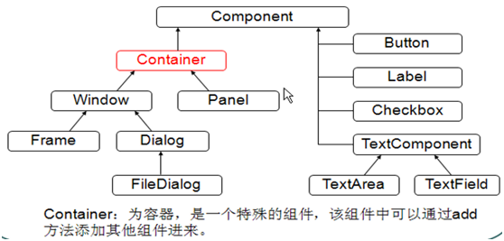
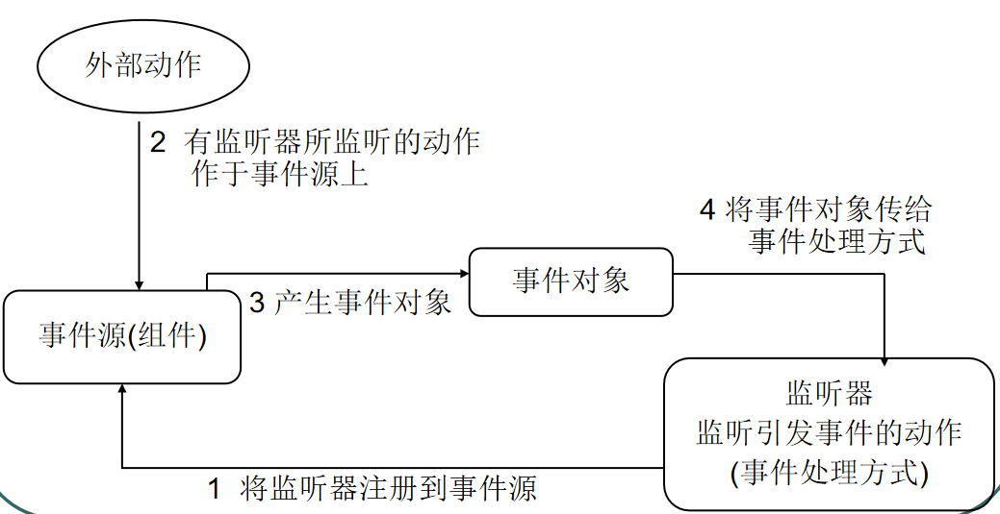
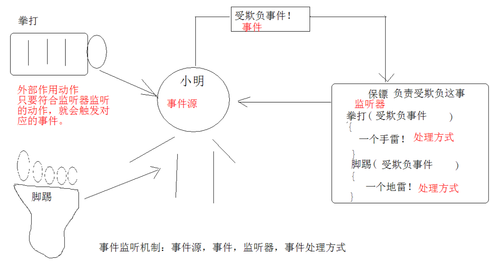
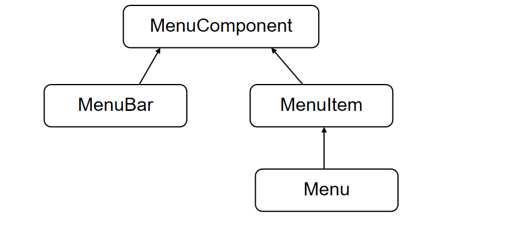

# Java基础知识汇总-GUI

---

### 1、基本概念

GUI：Graphical User Interface，图形用户接口。用图形的方式，来显示计算机操作的界面，这样更方便更直观。

### 2、AWT与Swing

Java为GUI提供的对象都存在java.awt和javax.swing两个包中。

* AWT：Abstract Window Toolkit，抽象窗口工具集，需要调用本地系统方法实现功能，属于重量级控件；
* Swing：在AWT基础上建立的一套图形界面系统，提供了更多的组件，完全由Java实现，增强了移植性，属于轻量级控件；

AWT调用系统组件，不同系统呈现的界面存在差异；Swing在任何系统看到的界面效果一样的；

### 3、组件体系

### 4、布局管理

容器中的组件的排放方式，就是布局。

* FlowLayout：流式布局，从左到右顺序排列，Panel的默认布局；
* BorderLayout：边界布局，东、南、西、北、中，Frame的默认布局；
* CardLayout：卡片布局，选项卡；
* GridLayout：网格布局，规则的矩阵；
* GridBagLayout：网格包布局，非规则的矩阵；
* 设置布局为空，则可以自定义放置组件；

### 5、事件监听机制

* 事件源（组件）
* 事件（Event）
* 监听器（Listener）
* 事件处理（引发事件后处理方式）

用户对组件的操作，就是一个事件，那么产生事件的组件就是事件源。接收并处理事件，与用户进行交互的行为就是事件处理器。这些处理方式都封装在监听器中。

就如同开密码锁，为了安全，密码锁上安装了报警装置，只要锁被砸就会把锁事件通知保安。那么保安就有相应的处理方式。如果锁没有被砸，而是密码输入错误，那么报警装置也会将锁事件通知保安，保安也会处理方式。

那么锁就是事件源，报警装置就是监听器，可以用来监听引发事件的动作。但必须要注册到锁上，否则锁被砸保安是不知道的。对于每一种动作都有不同的处理方式。处理方式由程序员自己定义。

代码流程：

* 确定事件源（容器或组件）；
* 通过事件源对象的addXXXListener()方法将侦听器注册到该事件源上；
* 该方法中接收XXXListener的子类对象，或者XXXListener的子类XXXAdapter的子类对象，一般用匿名内部类来表示；
* 在覆盖方法的时候，方法的参数一般是XXXEvent类型的变量接收；
* 事件触发后会把事件打包成对象传递给该变量。（其中包括事件源对象，通过getSource()或者，getComponent()获取）

### 6、菜单体系

* MenuBar,Menu,MenuItem
* 先创建菜单条，再创建菜单，每一个菜单中建立菜单项。
* 也可以菜单添加到菜单中，作为子菜单。
* 通过setMenuBar()方法，将菜单添加到Frame中。

### 7、示例

~~~java
Frame f = new Frame("my frame");
//f.setSize(600, 500);
//f.setLocation(350, 150);
f.setBounds(350, 150, 600, 500);
f.setLayout(new FlowLayout());

Button btn = new Button("my button");
f.add(btn);

f.setVisible();

f.addWindowListener(new WindowAdapter() {
    @Override
    public void windowClosing(WindowEvent e) {
        System.exit(0);
    }
});

btn.addActionListener(new ActionListener() {
    @Override
    public void actionPerformed(ActionEvent e) {
        System.exit(0);
    }
});
~~~

   

---

