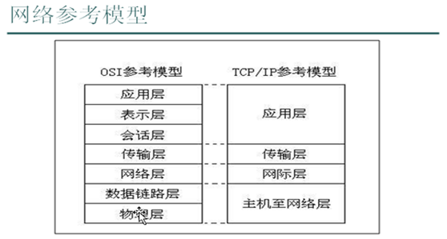
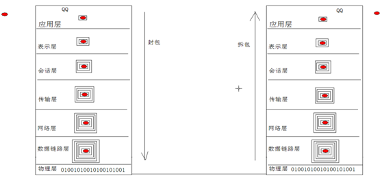
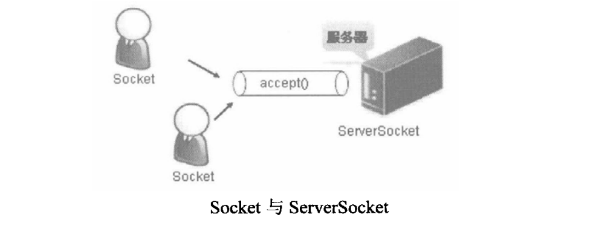
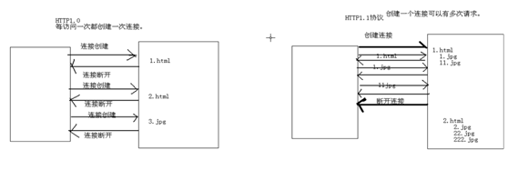

# Java基础知识汇总-网络编程

---

### 网络模型

* OSI参考模型（Open System Interconnection，开放系统互联）
* TCP/IP参考模型

七层协议简述：

* 物理层：主要定义物理设备标准，如网线的接口类型、光纤的接口类型、各种传输介质的传输速率等。它的主要作用是传输比特流（就是由1、0转化为电流强弱来进行传输,到达目的地后在转化为1、0，也就是我们常说的数模转换与模数转换）。这一层的数据叫做比特。
* 数据链路层：主要将从物理层接收的数据进行MAC地址（网卡的地址）的封装与解封装。常把这一层的数据叫做帧。在这一层工作的设备是交换机，数据通过交换机来传输。
* 网络层：主要将从下层接收到的数据进行IP地址（例192.168.0.1)的封装与解封装。在这一层工作的设备是路由器，常把这一层的数据叫做数据包。
* 传输层：定义了一些传输数据的协议和端口号（WWW端口80等），如：TCP（传输控制协议，传输效率低，可靠性强，用于传输可靠性要求高，数据量大的数据），UDP（用户数据报协议，与TCP特性恰恰相反，用于传输可靠性要求不高，数据量小的数据，如QQ聊天数据就是通过这种方式传输的）。 主要是将从下层接收的数据进行分段和传输，到达目的地址后再进行重组。常常把这一层数据叫做段。
* 会话层：通过传输层（端口号：传输端口与接收端口）建立数据传输的通路。主要在你的系统之间发起会话或者接受会话请求（设备之间需要互相认识可以是IP也可以是MAC或者是主机名）。
* 表示层：主要是进行对接收的数据进行解释、加密与解密、压缩与解压缩等（也就是把计算机能够识别的东西转换成人能够能识别的东西（如图片、声音等）。
* 应用层：主要是一些终端的应用，比如说FTP（各种文件下载），WEB（IE浏览），QQ之类的（可以把它理解成我们在电脑屏幕上可以看到的东西．就是终端应用）。

### IP地址与InetAddress

互联网上的每一台计算机都有一个唯一表示自己的标志，这个标志就是IP地址。

1）IP地址格式

~~~plaintext
IP地址=网络地址+主机地址
~~~

* 网络号：用于识别主机所在的网络；
* 主机号：用于识别该网络中的主机；

2）IP地址分类

| 地址分类 | 地址范围                  | 备注                 |
| -------- | ------------------------- | -------------------- |
| A类地址  | 1.0.0.1~126.255.255.254   | 保留给政府机构       |
| B类地址  | 128.0.0.1~191.255.255.254 | 分配给中等规模的公司 |
| C类地址  | 192.0.0.1~223.255.255.254 | 分配给任何需要的人   |
| D类地址  | 224.0.0.1~239.255.255.254 | 用于组播             |
| E类地址  | 240.0.0.1~255.255.255.254 | 用于实验             |

> 在以上的地址分类中可以发现没有127.X.X.X的地址，因为这是保留地址，用于循环测试，比如常见的127.0.0.1就表示本机的IP地址。

3）InetAddress类主要表示IP地址，有两个子类：Inet4Address、Inet6Address，分别用于表示IPv4和IPv6。

~~~java
public class Demo{
	public static void main(String[] args){
		InetAddress addr1 = InetAddress.getLocalHost();
		InetAddress addr2 = InetAddress.getByName("www.baidu.com");
		InetAddress addr3 = InetAddress.getByName("127.0.0.1");
		System.out.println(addr1.getHostName());
		System.out.println(addr1.getHostAddress());
		System.out.println(addr1.isReachable());
		System.out.println(addr2.getHostAddress());
	}
}
~~~

### 端口号

用于标识进程的逻辑地址，不同进程的标识。有效端口：0~65535，其中0~1024系统使用或保留端口。

### URL与URLConnection

1）URL(Uniform Resource Locator)统一资源定位符，可以凭借其直接找到互联网上的资源。

~~~java
public class Demo{
	public static void main(String[] args){
		URL url = new URL("http", "www.baidu.com", 80, "test.html");
		InputStream in = url.openStream();
		Scanner s = new Scanner(in);
		s.useDelimiter("\n");
		while(s.hasNext()){
			System.out.println(s.next());
		}
	}
}
~~~

2）URLConnection是封装访问远程网络资源一般方法的类，通过它可以建立与远程服务器的连接，检查远程资源的一些属性。

~~~java
public class Demo{
	public static void main(String[] args){
		URL url = new URL("http://www.baidu.com");
		URLConnection con = url.openConnection();
		con.getContentLength();
		con.getContentType();
		
		String urlString = "http://127.0.0.1:8080/mywebapps/index.html?name=xxx&passwd=yyy";
		URL url = new URL(urlString);

		System.out.println("Protocol:"+url.getProtocol());
		System.out.println("Host:"+url.getHost());
		System.out.println("Port:"+url.getPort());
		System.out.println("Path:"+url.getPath());
		System.out.println("Query:"+url.getQuery());

		System.out.println("Authority:"+url.getAuthority());
		//System.out.println("Content:"+url.getContent());
		System.out.println("DefaultPort:"+url.getDefaultPort());
		System.out.println("File:"+url.getFile());
		System.out.println("Ref:"+url.getRef());
		System.out.println("UserInfo:"+url.getUserInfo());

		URLConnection connection = url.openConnection();
		InputStream in = connection.getInputStream();
		byte[] buffer = new byte[1024];
		int len = in.read(buffer);
		System.out.println(new String(buffer,0,len)); //此对象获取的流读取到的数据不包含头信息，只有响应体内容
	}
}
~~~

3）URL编码

~~~java
public class Demo{
	public static void main(String[] args){
		String param = "中文内容";
		String encode = URLEncoder.encode(param, "UTF-8");
		System.out.println(encode);
		String decode = URLDecoder.decode(encode, "UTF-8");
		System.out.println(decode);
	}
}
~~~

### TCP

1）Socket

在Socket的程序开发中，服务器端使用ServerSocket等待客户端连接，每一个客户端都使用一个Socket对象来表示。

* Socket就是为网络服务提供的一种机制；
* 通信的两端都有Socket；
* 网络通信其实就是Socket间的通信；
* 数据在两个Socket间通过IO传输；

2）TCP程序流程

* 创建Socket和ServerSocket；
* 建立客户端和服务器端；
* 建立连接后，通过Socket中的IO流进行数据的传输；
* 关闭socket；

3）客户端与服务器端是两个独立的应用程序。

服务端：

* 服务端需要明确它要处理的数据是从哪个端口进入的。
* 当有客户端访问时，要明确是哪个客户端，可通过accept()获取已连接的客户端对象，并通过该对象与客户端通过IO流进行数据传输。
* 当该客户端访问结束，关闭该客户端。

~~~java
public class Server {
	public static void main(String[] args) throws Exception {
		ServerSocket serverSocket = new ServerSocket(8888);
		Socket socket = serverSocket.accept();

		OutputStream out = socket.getOutputStream();
		out.write("Hello World! This is Server！".getBytes());

		InputStream in = socket.getInputStream();
		byte[] buffer = new byte[1024];
		int len = in.read(buffer);
		String data = new String(buffer, 0, len);
		System.out.println("客户端发送来的数据是："+data);

		socket.close();
		serverSocket.close();
	}
}
~~~

客户端：

* 客户端需要明确服务器的ip地址以及端口，这样才可以去试着建立连接，如果连接失败，会出现异常。
* 连接成功，说明客户端与服务端建立了通道，那么通过IO流就可以进行数据的传输，而Socket对象已经提供了输入流和输出流对象，通过getInputStream(),getOutputStream()获取即可。
* 与服务端通讯结束后，关闭Socket。

~~~java
public class Client {
	public static void main(String[] args) throws Exception {
		Socket socket = new Socket("127.0.0.1", 8888);

		OutputStream out = socket.getOutputStream();
		out.write("Hello World! This is Client！".getBytes());

		InputStream in = socket.getInputStream();
		byte[] buffer = new byte[1024];
		int len = in.read(buffer);
		String data = new String(buffer, 0, len);
		System.out.println("服务器发送来的数据是："+data);

		socket.close();
	}
}
~~~

4）示例：客户端键盘录入数据经过服务器转换为大写再由客户端输出。

客户端：

~~~java
public class Client {
	public static void main(String[] args) throws Exception {
		Socket socket = new Socket("127.0.0.1", 8888);

		BufferedReader bufr = new BufferedReader(new InputStreamReader(System.in));
		PrintWriter out = new 		PrintWriter(socket.getOutputStream(),true);//不带缓冲
		BufferedReader in =new BufferedReader(new InputStreamReader(socket.getInputStream()));

		String line = null;
		while((line=bufr.readLine())!=null){
			//out.print(line);
			out.println(line);	//要使用带换行的方法
			if("#over".equals(line)){
				break;
			}
			System.out.println("经过服务器转换的数据是："+in.readLine());
		}
		bufr.close();
		socket.close();
	}
}
~~~

服务端：

~~~java
public class Server {
	public static void main(String[] args) throws Exception {
		ServerSocket serverSocket = new ServerSocket(8888);
		Socket socket = serverSocket.accept();

		BufferedReader in =new BufferedReader(new 		InputStreamReader(socket.getInputStream()));
		PrintWriter out = new PrintWriter(socket.getOutputStream(),true);

		String line = null;
		while((line=in.readLine())!=null){
			if("#over".equals(line)){
				break;
			}
			out.println(line.toUpperCase());
		}

		socket.close();
		serverSocket.close();
	}
}
~~~

5）示例：多线程文件上传。

客户端：

~~~java
public class MultiThreadUploadClient {
	public static void main(String[] args) throws Exception {
		Socket socket = new Socket("127.0.0.1", 8888);
		
		File file = new File("srcFile.txt");
		FileInputStream fis = new FileInputStream(file);
		OutputStream out = socket.getOutputStream();//不带缓冲
		BufferedReader in =new BufferedReader(new InputStreamReader(socket.getInputStream()));
		
		byte[] buffer = new byte[1024];
		int len = 0;
		while((len=fis.read(buffer))!=-1){
			out.write(buffer, 0, len);
		}
		//发送一个文件结束标记
		socket.shutdownOutput();
		
		System.out.println(in.readLine());
		fis.close();
		socket.close();
	}
	
}
~~~

服务端：

~~~java
public class MultiThreadUploadServer {
	public static void main(String[] args) throws Exception {
		ServerSocket serverSocket = new ServerSocket(8888);
		while(true){
			Socket socket = serverSocket.accept();
			new Thread(new Uploader(socket)).start();
		}
	}
	
}
class Uploader implements Runnable{
	Socket socket;
	public Uploader(Socket socket) {
		this.socket = socket;
	}
	@Override
	public void run() {
		InputStream in = null;
		OutputStream fos = null;
		try {
			in = socket.getInputStream();
			PrintWriter out = new PrintWriter(socket.getOutputStream(),true);
			
			File file = new File("destFile.txt");
			int count = 1;
			while(file.exists()){
				file = new File("destFile("+(count++)+").txt");
			}
			fos = new FileOutputStream(file);
			
			byte[] buffer = new byte[1024];
			int len = 0;
			while((len=in.read(buffer))!=-1){
				fos.write(buffer, 0, len);
			}
			out.println("文件上传成功！");
			
		} catch (IOException e) {
			e.printStackTrace();
		} finally{
			if(fos!=null){
				try {
					fos.close();
				} catch (IOException e) {
					e.printStackTrace();
				}
			}
		}
	}
}
~~~

问题总结：

客户端连接上服务端，两端都在等待，没有任何数据传输。通过例程分析：因为read方法或者readLine方法是阻塞式。解决办法：自定义结束标记，使用shutdownInput，shutdownOutput方法。

### UDP

1）UDP程序流程

* 创建DatagramSocket与DatagramPacket；
* 建立发送端，接收端；
* 建立数据包；
* 调用Socket的发送接收方法；
* 关闭Socket；

2）发送端与接收端是两个独立的运行程序

发送端：

~~~java
public class Sender {
	public static void main(String[] args) throws Exception {
		System.out.println("UDP发送端开始运行......");
		//DatagramSocket socket = new DatagramSocket();//使用随机分配的端口
		DatagramSocket socket = new DatagramSocket(7777); //使用指定端口

		String data = "UDP发送的数据";
		byte[] buffer = data.getBytes();
		DatagramPacket packet = new DatagramPacket(buffer, 	buffer.length, InetAddress.getByName("127.0.0.1"), 8888);

		socket.send(packet);
		socket.close();
		System.out.println("UDP发送端发送完毕！");
	}
}
~~~

接收端：

~~~java
public class Receiver {
	public static void main(String[] args) throws Exception {
		System.out.println("UDP接收端开始运行......");
		DatagramSocket socket = new DatagramSocket(8888); //必须指定端口

		byte[] buffer = new byte[1024];
		DatagramPacket packet = new DatagramPacket(buffer, buffer.length);
		socket.receive(packet);

		String ip = packet.getAddress().getHostAddress();
		int port = packet.getPort();
		String data = new String(packet.getData(), 0, packet.getLength());
		System.out.println("从"+ip+":"+port+"接收到的数据是："+data);

		socket.close();
		System.out.println("UDP接收端接收完毕！");
	}
}
~~~

3）聊天程序

~~~java
public class ChatTool {
	public static void main(String[] args) throws Exception {
		DatagramSocket socket = new DatagramSocket(8888);
		new Thread(new SenderThread(socket)).start();
		new Thread(new ReceiverThread(socket)).start();
	}
}
class SenderThread implements Runnable {
	DatagramSocket socket;
	public SenderThread(DatagramSocket socket) {
		this.socket = socket;
	}
	@Override
	public void run() {
		try {
			BufferedReader bufr = new BufferedReader(new InputStreamReader(System.in));
			String line = null;
			byte[] buffer = null;
			while ((line=bufr.readLine())!=null) {
				buffer = line.getBytes();
				DatagramPacket packet = new DatagramPacket(buffer, buffer.length, InetAddress.getByName("127.0.0.1"), 8888);
				//DatagramPacket packet = new DatagramPacket(buffer, buffer.length, InetAddress.getByName("127.0.0.255"), 8888);//255为广播号，整个网段的机器都能接收到，可用于群聊
				socket.send(packet);
				if("#over".equals(line.trim())){
					break;
				}
			}
		} catch (Exception e) {
			e.printStackTrace();
		}
	}
}
class ReceiverThread implements Runnable {
	DatagramSocket socket;
	public ReceiverThread(DatagramSocket socket) {
		this.socket = socket;
	}
	@Override
	public void run() {
		byte[] buffer = new byte[1024];
		DatagramPacket packet = new DatagramPacket(buffer, buffer.length);
		while (true) {
			try {
				socket.receive(packet);
				String ip = packet.getAddress().getHostAddress();
				int port = packet.getPort();
				String data = new String(packet.getData(), 0, packet.getLength());
				if("#over".equals(data)){
					System.out.println(ip+":"+port+"  离开了聊天！");
				}else {
					System.out.println(ip+":"+port+">"+data);
				}
			} catch (Exception e) {
				e.printStackTrace();
			}
		}
	}
}
~~~

### TCP与UDP

UDP：

* 将数据及源和目的封装在数据包中，不需要建立连接；
* 每个数据报大小限制在64K之内；
* 无连接，是不可靠的协议；
* 不需要建立连接，速度快；

TCP：

* 建立连接，形成数据传输的通道；
* 在连接中进行大数据量传输；
* 经过三次握手建立连接，是可靠协议；
* 必须建立连接，效率稍低；

### HTTP1.0与HTTP1.1

### C/S结构与B/S结构

C/S结构：（Client/Sever）

* 客户端和服务端程序都需要开发维护；
* 客户端程序维护起来较为困难；
* 可以将一部分运算分离到客户端来运行，减轻了服务器端的压力。

B/S结构：（Browser/Sever）

* 只需要开发服务器端程序，客户端直接使用系统具备的浏览器软件；
* 只需维护服务器端程序；
* 所有运算都在服务器端执行，压力相对较大。

   

---

