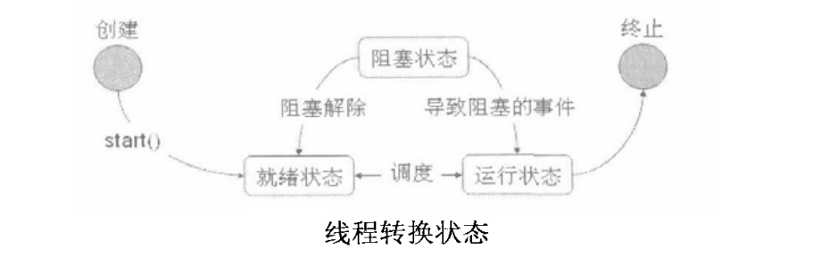

# Java基础知识汇总-多线程

---

### 多线程基本概念

##### 进程与线程

进程是程序的一次动态执行过程，它经历了从代码加载、执行到执行完毕的一个完整过程，这个过程也是进程本身从产生、发展到最终消亡的过程。多进程操作系统能同时运行多个进程（程序），由于CPU具备分时机制，所以每个进程都能循环获得自己的CPU时间片。由于CPU执行速度非常快，使得所有程序好像是在“同时”运行一样。

多线程是实现并发机制的一种有效手段。线程和进程一样，都是实现并发的一个基本单位。线程是比进程更小的执行单位，线程是在进程的基础之上进行的进一步划分。所谓多线程是指一个进程在执行过程中可以产生多个线程，这些线程可以同时存在、同时运行，一个进程可能包含了多个同时执行的线程。

所谓的线程是指程序的运行流程，多线程机制则是指可以同时运行多个程序块，使程序运行的效率变得更高，也可克服传统程序语言无法克服的问题。例如，有些包含循环的线程可能要使用一段时间来运算，此时便可以让另一个线程来做其他的处理。

##### 线程的状态变化

* 创建状态：在程序中使用构造方法创建了一个线程对象后，新的线程对象便处于新建状态。此时，它已经具备了相应的内存空间和其它资源，但还处于不可运行状态。
* 就绪状态：新建线程对象后，调用该线程的start方法就可以启动线程。当线程启动时，线程进入就绪状态。此时，线程将进入线程队列排队，等待CPU服务，这表明他已经具备了运行条件。
* 运行状态：当就绪状态的线程被调用并获得处理器资源时，线程就进入了运行状态。此时，自动调用该线程对象的run方法，run方法定义了该线程的操作和功能。
* 阻塞状态：一个正在执行的线程在某些特殊情况下，如被人为挂起或需要执行耗时的输入/输出操作，将让出CPU并暂时终止自己的执行，进入阻塞状态。在可执行状态下，如果调用sleep、suspend、wait等方法，线程都将进入阻塞状态。阻塞时，线程不能进入排队队列，只有当引起阻塞的原因被消除后，线程才可以进入就绪状态。
* 终止状态：线程调用stop方法或run方法执行结束后，即处于终止状态。处于终止状态的线程不具备继续运行的能力。

##### 线程的生命周期

> 其中的suspend、resume、stop方法不推荐使用，在操作时容易产生死锁问题。

### 线程的实现方式

##### 概念

在Java中要想实现多线程代码有两种手段，一种是继承Thread类，另一种就是实现Runnable接口。

##### 继承Thread类

一个类只要继承了Thread类，此类就称为多线程操作类。在Thread子类中，必须明确地覆盖Thread类中的run方法，此方法为线程的主体。

* 子类覆盖父类中的run方法，将线程运行的代码存放在run中；
* 建立子类对象的同时线程也被创建；
* 通过调用start方法开启线程；

~~~java
class 类名称 extends Thread{
	属性...;
	方法...;
	public void run(){
		线程主体;
	}
}
~~~

代码示例

~~~java
class MyThread extends Thread{
	private String name;
	public MyThread(String name){
		this.name = name;
	}
	public void run(){
		for(int i=0; i<10; i++){
			System.out.println(name+": "+i);
		}
	}
}
public class Demo{
	public static void main(String[] args){
		MyThread t1 = new MyThread("ThreadA");
		MyThread t2 = new MyThread("ThreadB");
		t1.run();
		t2.run();
	}
}
~~~

通过观察运行结果发现，程序是先执行完t1再执行t2的，并没有交错运行，即线程没有被正确地启动。要正确地启动线程，应该调用从Thread类继承而来的start方法。

~~~java
public class Demo{
	public static void main(String[] args){
		MyThread t1 = new MyThread("ThreadA");
		MyThread t2 = new MyThread("ThreadB");
		t1.start();
		t2.start();
	}
}
~~~

run方法和start方法的区别：直接调用run方法时其实还是在main线程里执行，调用start方法是开了新的线程来执行任务。

~~~java
public class Demo{
	public static void main(String[] args){
		MyThread t1 = new MyThread("ThreadA");
		MyThread t2 = new MyThread("ThreadB");
		t1.start();
		t1.start();
		t2.start();
		t2.start();
	}
}
~~~

start方法只能调用一次，如果调用多次，就会抛出`IllegalThreadStateException`异常。

##### 实现Runnable接口

继承Thread类实现多线程会受到单继承局限的影响。在Java中也可以通过实现Runnable接口的方式实现多线程。

* 子类覆盖Runnable接口中的run方法；
* 通过Thread类创建线程，并将实现了Runnable接口的子类对象作为参数传递给Thread类的构造函数；
* Thread类对象调用start方法开启线程；

~~~java
class 类名称 implements Runnable{
	属性...;
	方法...;
	public void run(){
		线程主体;
	}
}
~~~

代码示例

~~~java
class MyThread implements Runnable{
	private String name;
	public MyThread(String name){
		this.name = name;
	}
	public void run(){
		for(int i=0; i<10; i++){
			System.out.println(name+": "+i);
		}
	}
}
public class Demo{
	public static void main(String[] args){
		MyThread mt1 = new MyThread("ThreadA");
		MyThread mt2 = new MyThread("ThreadB");
		Thread t1 = new Thread(mt1);
		Thread t2 = new Thread(mt2);
		t1.start();
		t2.start();
	}
}
~~~

##### Thread和Runnable的关联

Thread类的部分定义如下：

~~~java
public class Thread extends Object implements Runnable{
	private Runnable target;
	public Thread(Runnable target, String name){
		init(null, target, name, 0);
	}
	private void init(ThreadGroup g, Runnable target, String name, long stackSize){
		...
		this.target = target;
		...
	}
	public void run(){
		if(target!=null){
			target.run();
		}
	}
}
~~~

从Thread类的定义可以发现，Thread类也是Runnable接口的子类，但是在Thread类中并没有完全实现Runnable接口中的run方法。Thread类中run方法调用的是Runnable接口中的run方法，也就是说此方法是由Runnable的子类完成的，所以通过继承Thread类来实现多线程必须覆盖run方法。

Thread类和Runnable接口在使用上也是有区别的。如果一个类继承Thread类，则不适合于多个线程共享资源；而实现Runnable接口，就可以方便的实现资源共享。

~~~java
class MyThread extends Thread{
	private int ticket = 5;
	public void run(){
		for(int i=0; i<100; i++){
			if(ticket>0){
				System.out.println("ticket:"+ticket--);
			}
		}
	}
}
public class Demo{
	public static void main(String[] args){
		MyThread mt1 = new MyThread();
		MyThread mt2 = new MyThread();
		MyThread mt3 = new MyThread();
		mt1.start();
		mt2.start();
		mt3.start();
	}
}
~~~

程序启动了3个线程，但是3个线程却分别卖了各自的5张票，并没有达到资源共享的目的。

~~~java
class MyThread implements Runnable{
	private int ticket = 5;
	public void run(){
		for(int i=0; i<100; i++){
			if(ticket>0){
				System.out.println("ticket:"+ticket--);
			}
		}
	}
}
public class Demo{
	public static void main(String[] args){
		MyThread mt = new MyThread();
		new Thread(mt).start();
		new Thread(mt).start();
		new Thread(mt).start();
	}
}
~~~

Runnable相对于Thread来说，具有以下优势：

* 适合多个相同程序代码的线程去处理同一资源的情况；
* 可以避免由于Java单继承带来的局限；
* 增强了程序的健壮性，代码能够被多个线程共享，代码与数据是独立的。

### 线程的主要操作方法

##### Thread类主要方法一览

| 方法                                                         | 描述                                                       |
| ------------------------------------------------------------ | ---------------------------------------------------------- |
| public Thread(Runnable target)                               | 接收Runnable接口子类对象，实例化Thread对象                 |
| public Thread(Runnable target, String name)                  | 接收Runnable接口子类对象，实例化Thread对象，并设置线程名称 |
| public Thread(String name)                                   | 实例化Thread对象，并设置线程名称                           |
| public static Thread currentThread()                         | 返回目前正在执行的线程                                     |
| public final String getName()                                | 返回线程的名称                                             |
| public final int getPriority()                               | 返回线程的优先级                                           |
| public boolean isInterrupted()                               | 判断目前线程是否被中断                                     |
| public final boolean isAlive()                               | 判断线程是否在活动                                         |
| public final void join() throws InterruptedException         | 等待线程死亡                                               |
| public final synchronized void join(long milis) throws InterruptedException | 等待milis毫秒后，线程死亡                                  |
| public void run()                                            | 执行线程                                                   |
| public final void setName(String name)                       | 设定线程的名称                                             |
| public final void setPriority(int newPriority)               | 设定线程的优先级                                           |
| public static void sleep(long milis) throws InterruptedException | 使当前正在执行的线程休眠milis毫秒                          |
| public void start()                                          | 开始执行线程                                               |
| public String toString()                                     | 返回代表线程的字符串                                       |
| public static void yield()                                   | 将目前正在执行的线程暂停，允许其它线程执行                 |
| public final void setDaemon(boolean on)                      | 将一个线程设置成后台运行                                   |

##### 获取和设置线程名称

线程的名称一般在启动线程前设置，但也允许为已经运行的线程设置名称。如果没有分配名称，系统会为其自动分配。

~~~java
class MyThread implements Runnable{
	public void run(){
		for(int i=0; i<50; i++){
			System.out.println(Thread.currentThread.getName()+":"+i);
		}
	}
}
public class Demo{
	public static void main(String[] args){
		MyThread mt = new MyThread();
		new Thread(mt).start();
		new Thread(mt, "AAA").start();
		new Thread(mt, "BBB").start();
		
		Thread t = new Thread(mt);
		t.setName("CCC");
		t.start();
		t.getName();
	}
}
~~~

##### 判断线程是否启动

~~~java
class MyThread implements Runnable{
	public void run(){
		for(int i=0; i<50; i++){
			System.out.println(Thread.currentThread.getName()+":"+i);
		}
	}
}
public class Demo{
	public static void main(String[] args){
		MyThread mt = new MyThread();
		Thread t = new Thread(mt);
		System.out.println(t.isAlive()); //false
		t.start();
		System.out.println(t.isAlive()); //true
		for(int i=0; i<10; i++){
			System.out.println(i);
		}
		System.out.println(t.isAlive()); //true or false ?
	}
}
~~~

##### 线程的强制运行

~~~java
class MyThread implements Runnable{
	public void run(){
		for(int i=0; i<50; i++){
			System.out.println(Thread.currentThread.getName()+":"+i);
		}
	}
}
public class Demo{
	public static void main(String[] args){
		MyThread mt = new MyThread();
		Thread t = new Thread(mt);
		t.start();
		
		for(int i=0; i<50; i++){
			if(i>10){
				try{
					t.join();
				}catch(InterruptedException e){
					
				}
			}
			System.out.println(i);
		}
	}
}
~~~

主线程必须等待t运行完毕才会继续运行。

##### 线程的休眠

~~~java
class MyThread implements Runnable{
	public void run(){
		for(int i=0; i<50; i++){
			try{
				Thread.sleep(500);
			}catch(InterruptedException e){
				
			}
			System.out.println(Thread.currentThread.getName()+":"+i);
		}
	}
}
public class Demo{
	public static void main(String[] args){
		MyThread mt = new MyThread();
		Thread t = new Thread(mt);
		t.start();
	}
}
~~~

##### 中断线程

当一个线程在运行时，另外一个线程可以直接通过interrupt方法中断其运行状态。

~~~java
class MyThread implements Runnable{
	public void run(){
		System.out.println("进入run方法...");
		try{
			Thread.sleep(10000);
			System.out.println("已经完成休眠...");
		}catch(InterruptedException e){
			System.out.println("休眠被终止...");
			return;
		}
		System.out.println("run方法正常结束...");
	}
}
public class Demo{
	public static void main(String[] args){
		MyThread mt = new MyThread();
		Thread t = new Thread(mt);
		t.start();
		try{
			Thread.sleep(2000);
		}catch(InterruptedException e){
			
		}
		t.interrupt();
	}
}
~~~

线程启动之后进入休眠状态，本应休眠10s之后再继续执行，但是主线程启动2s后就将其中断，休眠一旦中断之后就进入了catch中的代码。

##### 后台线程

在Java程序中，只要前台有一个线程在运行，则整个Java进程都不会消失。此时可以设置一个后台线程，这样即使Java进程结束了，此后台线程依然会继续执行。

~~~java
class MyThread implements Runnable{
	public void run(){
		while(true){
			System.out.println(Thread.currentThread.getName());
		}
	}
}
public class Demo{
	public static void main(String[] args){
		MyThread mt = new MyThread();
		Thread t = new Thread(mt);
		t.setDaemon(true); //必须在start之前设置
		t.start();
	}
}
~~~

尽管run方法中是死循环，但是程序依然可以执行完，因为死循环已经设置成后台运行了。

##### 线程的优先级

线程在运行前都会保持在就绪状态，此时，哪个线程的优先级高，哪个线程就有可能会被先执行。

线程优先级

| 定义          | 描述                 | 数值 |
| ------------- | -------------------- | ---- |
| MIN_PRIORITY  | 最低优先级           | 1    |
| NORM_PRIORITY | 中等优先级（默认值） | 5    |
| MAX_PRIORITY  | 最高优先级           | 10   |

~~~java
class MyThread implements Runnable{
	public void run(){
		for(int i=0; i<50; i++){
			try{
				Thread.sleep(500);
			}catch(InterruptedException e){
				
			}
			System.out.println(Thread.currentThread.getName()+":"+i);
		}
	}
}
public class Demo{
	public static void main(String[] args){
		Thread t1 = new Thread(new MyThread(), "AAA");
		Thread t2 = new Thread(new MyThread(), "BBB");
		Thread t3 = new Thread(new MyThread(), "CCC");
		t1.setPriority(Thread.MIN_PRIORITY);
		t2.setPriority(Thread.NORM_PRIORITY);
		t3.setPriority(Thread.MAX_PRIORITY);
		t1.start();
		t2.start();
		t3.start();
	}
}
~~~

并非线程的优先级越高就一定会先执行，哪个线程先执行将由CPU的调度决定。

> 主方法的优先级是NORM_PRIORITY(5)。

##### 线程的礼让

可以使用yield方法将一个线程的操作暂时让给其它线程执行。

~~~java
class MyThread implements Runnable{
	public void run(){
		for(int i=0; i<50; i++){
			System.out.println(Thread.currentThread.getName()+":"+i);
			if(i==3){
				Thread.currentThread().yield();
			}
		}
	}
}
public class Demo{
	public static void main(String[] args){
		MyThread mt = new MyThread();
		Thread t1 = new Thread(mt, "AAA");
		Thread t2 = new Thread(mt, "BBB");
		t1.start();
		t2.start();
	}
}
~~~

~~~java
class Task extends Thread {
	Task(String name) {
		super(name);
	}
	public void run() {
		for(int x=0; x<30; x++) {
			System.out.println(Thread.currentThread().toString()+"......"+x);
			Thread.yield();
		}
	}
}
public class Demo {
	public static void main(String[] args) {
		Task d1 = new Task("AAA");
		Task d2 = new Task("BBB");
		d1.start();
		d2.start();
		//主线程运行到此处，发现d1要加入运行，则主线程释放了执行权处于休眠状态；此时剩下d1与d2在执行；只有当d1执行完，主线程才会重新执行。
		try{d1.join();}catch(InterruptedException e){}
		for(int x=0; x<30; x++) {
			System.out.println(Thread.currentThread().toString()+"......"+x);
		}
	}
}
~~~

##### 停止线程

使线程变成终止状态有以下方法：

* 调用stop()方法：过时；
* run()方法结束：当线程没有了要运行的代码时线程就结束了，意味着任务结束，线程消失；

一般情况下run方法中都会定义循环，开启新的执行路径就是为了对多次的运算和其他代码进行同时的执行。

~~~java
//这种线程任务是毫无意义的，根本就不需要多线程执行。
public void run() {
	System.out.println("ok");	
}

public void run() {
	while(true) {
		System.out.println("ok");
	}
}
~~~

开启多线程会同时并重复做很多运算。结束run方法，只要控制住run方法中的循环即可。控制循环通常需要通过标记来完成，如下：

~~~java
class StopThread implements Runnable {
	private boolean flag = true;
	public void run() {
		while(flag) {
			System.out.println(Thread.currentThread().getName()+"......run");
		}
	}
	public void setFlag() {
		flag = false;
	}
}
public class Demo {
	public static void main(String[] args) {
		StopThread st = new StopThread();
		Thread t1 = new Thread(st);
		Thread t2 = new Thread(st);
		t1.start();
		t2.start();

		int num = 1;
		while(true) {
			if(++num==50) {
				st.setFlag(); //将标记置为false。让t1，t2对应的线程结束。
				break;
			}
			System.out.println(Thread.currentThread().getName()+"....."+num);
		}
		System.out.println("over");
	}
}
~~~

如果读不到标记怎么办？比如在任务中让线程处于了冻结状态。释放了执行资格，无法执行标记，run方法没结束，线程也无法结束。如下：

~~~java
class StopThread implements Runnable {
	private boolean flag = true;
	public synchronized void run() {
		while(flag) {
			try {
				wait();
			} catch (InterruptedException e) {
				e.printStackTrace();
			}
			System.out.println(Thread.currentThread().getName()+"......run");
		}
	}
	public void setFlag() {
		flag = false;
	}
}
public class Demo {
	public static void main(String[] args) {
		StopThread st = new StopThread();
		Thread t1 = new Thread(st);
		Thread t2 = new Thread(st);
		t1.start();
		t2.start();

		int num = 1;
		while(true) {
			if(++num==50) {
				st.setFlag(); //将标记置为false。让t1，t2对应的线程结束。
				break;
			}
			System.out.println(Thread.currentThread().getName()+"....."+num);
		}
		System.out.println("over");
	}
}
~~~

线程执行到wait方法就处于冻结状态了，尽管将标志改变了，但是不会去判断标志，结束不了。

Thread类中有一个interupt方法，可以将线程的冻结状态清除，让线程恢复到具备执行资格的状态。

~~~java
class StopThread implements Runnable {
	private boolean flag = true;
	public synchronized void run() {
		while(flag) {
			try {
				wait();
			} catch (InterruptedException e) {
				e.printStackTrace();
			}
			System.out.println(Thread.currentThread().getName()+"......run");
		}
	}
	public void setFlag() {
		flag = false;
	}
}
public class Demo {
	public static void main(String[] args) {
		StopThread st = new StopThread();
		Thread t1 = new Thread(st);
		Thread t2 = new Thread(st);
		t1.start();
		t2.start();

		int num = 1;
		while(true) {
			if(++num==50) {
				st.setFlag(); //将标记置为false。让t1，t2对应的线程结束。
				t1.interrupt();
				t2.interrupt();
				break;
			}
			System.out.println(Thread.currentThread().getName()+"....."+num);
		}
		System.out.println("over");
	}
}
~~~

##### wait方法和sleep方法的区别

* 两个方法都可以让线程处于冻结状态；
* sleep()必须指定时间，wait()可以指定时间，也可以不指定；
* wait()方法释放CPU执行权，释放锁；
* sleep()方法释放CPU执行权，不释放锁；

### 同步

##### 售票案例

~~~java
class Ticket implements Runnable {
	private int num = 100;
	@Override
	public void run() {
		while(true) {
			if(num>0) {
				System.out.println(Thread.currentThread().getName() + "---" + num--);
			}
		}
	}
}
public class Demo {
	public static void main(String[] args) {
		Ticket t = new Ticket();
		new Thread(t).start();
		new Thread(t).start();
		new Thread(t).start();
		new Thread(t).start();
	}
}
~~~

##### 线程安全问题

多线程操作共享数据会引发安全问题。导致安全问题出现的原因有：

* 多个线程访问出现延迟；
* 线程的随机性；

线程安全问题在理想状态下，不容易出现，但一旦出现对软件的影响是非常大的。

~~~java
class Ticket implements Runnable {
	private int num = 100;
	@Override
	public void run() {
		while(true) {
			if(num>0) {
				try {
					Thread.sleep(100);
				} catch (InterruptedException e) {
					e.printStackTrace();
				}
				System.out.println(Thread.currentThread().getName() + "===" + num--);
			}
		}
	}
}
public class Demo {
	public static void main(String[] args) {
		Ticket t = new Ticket();
		new Thread(t).start();
		new Thread(t).start();
		new Thread(t).start();
		new Thread(t).start();
	}
}
~~~

运行结果：

~~~plaintext
...
Thread-2===3
Thread-1===2
Thread-3===1
Thread-0===0
Thread-1===-1
Thread-2===-2
~~~

程序中的卖票操作分为了两步：1、判断票数是否大于0，大于0表示还有票可卖；2、卖出票，即票数减1。因为程序中加入了延迟操作，那么就有可能一个线程在还没有对票数进行减操作之前，其它线程就已经将票数减少了，所以在最后出现了负数的情况。如下图，线程在进入if判断之后被切换走了，会使if判断被绕过，从而出现了负数的情况。

要解决这样的情况，就必须使用同步。

##### 同步的概念

同步就是指多个操作在同一个时间段内只能有一个线程进行，其它线程要等待此线程完成之后才可以继续执行。同步可以解决线程安全问题。同步的原理就是将需要同步的代码封装起来并加上一把锁。

举个例子，多线程访问共享数据就像多个人排队上一个厕所。一个人进入厕所，首先是关门并上锁，其他人在外面发现这个厕所已经上锁就只能排队等候。当这个人从厕所出来，开锁，即释放了锁，其他人才能继续进入。

同步的前提：

* 同步需要两个或两个以上的线程；
* 多个线程使用的是同一个锁；

同步的弊端：

当线程相当多时，因为每个线程都会去判断同步上的锁，这是很耗费资源的，降低了程序的效率。

##### 同步代码块

代码块上加上synchronized关键字，则此代码块就称为同步代码块。

~~~java
class Ticket implements Runnable {
	private int num = 100;
	Object lock = new Object();
	@Override
	public void run() {
		while(true) {
			synchronized(lock) {
				if(num>0) {
					try {
						Thread.sleep(100);
					} catch (InterruptedException e) {
						e.printStackTrace();
					}
					System.out.println(Thread.currentThread().getName() + "===" + num--);
				}
			}
		}
	}
}
public class Demo {
	public static void main(String[] args) {
		Ticket t = new Ticket();
		new Thread(t).start();
		new Thread(t).start();
		new Thread(t).start();
		new Thread(t).start();
	}
}
~~~

加上同步之后，就不会出现票数为负数的情况了。

##### 同步方法

方法上加上synchronized关键字，就称为同步方法。

~~~java
class Ticket implements Runnable {
	private int num = 100;
	@Override
	public void run() {
		while(true) {
			sale();
		}
	}
	public synchronized void sale() {
		if(num>0) {
			try {
				Thread.sleep(100);
			} catch (InterruptedException e) {
				e.printStackTrace();
			}
			System.out.println(Thread.currentThread().getName() + "===" + num--);
		}
	}
}
public class Demo {
	public static void main(String[] args) {
		Ticket t = new Ticket();
		new Thread(t).start();
		new Thread(t).start();
		new Thread(t).start();
		new Thread(t).start();
	}
}
~~~

同步函数使用的锁是什么呢？函数肯定被对象调用，代表调用函数对象的引用就是this， 也就是说同步函数使用锁是this。

##### 同步函数和同步代码块的区别

* 同步函数比同步代码块写法简单；
* 同步函数使用的锁是this，同步代码块使用的锁是任意指定的对象；
* 建议开发时，使用同步代码块，尤其是需要不同锁时；

##### 静态同步函数的锁

静态同步函数使用的锁是什么？静态随着类的加载而加载的，这时内存中存储的对象至少有一个就是该类字节码文件对象。这个对象的表示方式`类名.class`，它就表示字节码文件对象。

~~~java
class Ticket implements Runnable {
	private static int num = 200;
	private boolean flag = true;
	public void run() {
		if(flag){ //为true就执行同步代码块。
			while(true) {
				synchronized(Ticket.class) {
					if(num>0) {
						try{Thread.sleep(10);}catch(InterruptedException e){}
						System.out.println(Thread.currentThread().getName()+".....code.........."+num--);
					}
				}
			}
		}else{ //为false就执行同步函数。 
			while(true) {
				show();
			}
		}
	}
	public void setFlag() {
		flag = false;
	}
	public static synchronized void show() {
		if(num>0) {
			try{Thread.sleep(10);}catch(InterruptedException e){}
			System.out.println(Thread.currentThread().getName()+"............func....."+num--);
		}
	}
}
public class Demo {
	public static void main(String[] args) {
		Ticket t = new Ticket();
		Thread t1 = new Thread(t);
		Thread t2 = new Thread(t);
		
		t1.start();
		try{Thread.sleep(10);}catch(InterruptedException e){}
		//在开启了t1后，将标记置为false。
		t.setFlag();
		t2.start();
	}
}
~~~

##### 证明同步代码块和同步函数使用同一把锁

通过两个线程来验证同步函数的锁是什么？都是在卖票，一个是在同步代码块中卖票，一个是同步函数中卖票，如果两个线程用的锁是同一个，就会同步，不会出现错误票的情况。

~~~java
class Ticket implements Runnable {
	private int num = 200;
	private boolean flag = true;
	public void run() {
		if(flag){ //为true就执行同步代码块。
			while(true) {
				synchronized(this) {
					if(num>0) {
//						try{Thread.sleep(10);}catch(InterruptedException e){}
						System.out.println(Thread.currentThread().getName()+".....code.........."+num--);
					}
				}
			}
		}else{ //为false就执行同步函数。 
			while(true) {
				show();
			}
		}
	}
	public void setFlag() {
		flag = false;
	}
	public synchronized void show() {//this
		if(num>0) {
//			try{Thread.sleep(10);}catch(InterruptedException e){}
			System.out.println(Thread.currentThread().getName()+"............func....."+num--);
		}
	}
}
public class Demo {
	public static void main(String[] args) {
		Ticket t = new Ticket();
		Thread t1 = new Thread(t);
		Thread t2 = new Thread(t);
		
		t1.start();
		try{Thread.sleep(10);}catch(InterruptedException e){}
		//在开启了t1后，将标记置为false。
		t.setFlag();
		t2.start();
	}
}
~~~

##### 死锁

同步容易出现的一个弊端是死锁。所谓死锁就是指两个线程都在等待彼此先完成，造成了程序的停滞，一般程序的死锁都是在程序运行时出现的。

最常见的死锁情况是同步嵌套，即同步中还有同步，两个同步用的不是一个锁。 记住尽量避免出现同步嵌套的情况。

~~~java
class MyLock {
	public static Object locka = new Object();
	public static Object lockb = new Object();
}
class Task implements Runnable {
	private boolean flag;
	Task(boolean flag) {
		this.flag = flag;
	}
	public void run() {
		if(flag) {
			while(true) {
				synchronized(MyLock.locka) {
					System.out.println("if.....locka");
					synchronized(MyLock.lockb) {
						System.out.println("if.....lockb");
					}
				}
			}
		} else {
			while(true) {
				synchronized(MyLock.lockb) {
					System.out.println("else.....lockb");
					synchronized(MyLock.locka) {
						System.out.println("else.....locka");
					}
				}
			}
		}
	}
}
public class Demo {
	public static void main(String[] args) {
		Task a = new Task(true);
		Task b = new Task(false);
		Thread t1 = new Thread(a);
		Thread t2 = new Thread(b);
		t1.start();
		t2.start();
	}
}
~~~

### 线程间通信

##### 概念

线程间通信，是指多个线程在处理同一个资源，但是处理的动作（即线程的任务）却不相同。简言之，就是多个线程，不同任务，处理同一资源。 

##### 生产者与消费者问题

~~~java
//描述资源
class Resource {
	String name;
	String sex;
}
//描述输入任务
class Input implements Runnable {
	private Resource r ;
	Input(Resource r) {
		this.r = r;
	}
	public void run() {
		int x = 0;
		while(true) {
			synchronized(r) {
				if(x==0) {
					r.name = "Mike";
					r.sex = "man";
				} else {
					r.name = "小红";
					r.sex = "女女女女";
				}
			}
			x = (x+1)%2;
		}
	}
}
//描述输出任务
class Output implements Runnable {
	Resource r;
	Output(Resource r) {
		this.r = r;
	}
	public void run() {
		while(true) {
			synchronized(r) {
				System.out.println(r.name+"....."+r.sex);
			}
		}
	}
}
public class Demo {
	public static void main(String[] args) {
		// 1，创建资源对象。
		Resource r = new Resource();
		// 2，创建任务对象。
		Input in = new Input(r);
		Output out = new Output(r);
		// 3，创建线程对象。
		Thread t1 = new Thread(in);
		Thread t2 = new Thread(out);
		// 4，开启线程。
		t1.start();
		t2.start();
	}
}
~~~

该程序存在的最大问题是生产者重复生产和消费者重复消费。

##### 等待唤醒机制

等待就是将正在执行的线程释放其执行资格和执行权，并存储到线程池中。唤醒的意思就是让线程池中的线程具备执行资格。涉及到的方法如下：

* wait()：等待，将正在执行的线程释放其执行资格和执行权，并存储到线程池中；
* notify()：唤醒，唤醒线程池中被wait的线程，一次唤醒一个，而且是任意的；
* notifyAll()：唤醒全部，可以将线程池中的所有wait线程都唤醒；

这些方法都要使用在同步中才有效。这些方法在使用时必须标明所属锁，这样才可以明确出这些方法操作的到底是哪个锁上的线程。

为什么这些操作线程的方法定义在Object类中？因为这些方法在使用时，必须要标明所属的锁，而锁又可以是任意对象，能被任意对象调用的方法一定是定义在Object类中的。

##### notify与notifyAll

唤醒的操作有两个，分别为notify与notifyAll。一般来说，所有等待的线程都会按照顺序进行排列，如果使用notify方法，则会唤醒第1个等待的线程执行；而如果使用了notifyAll方法，则会唤醒所有等待的线程，哪个线程的优先级高，哪个线程就有可能先执行。

##### 生产者与消费者问题的改进

如果想让生产者不重复生产，消费者不重复取走，则可以增加一个标志位。假设标志位为boolean型变量，如果标志位为true，则表示可以生产，但是不能取走，此时线程执行到了消费者线程则应该等待；如果标志位为false，则表示可以取走，但是不能生产，如果生产者线程运行，则应该等待。

~~~java
//描述资源
class Resource {
	String name;
	String sex;
	boolean flag;
}
//描述输入任务
class Input implements Runnable {
	private Resource r ;
	Input(Resource r) {
		this.r = r;
	}
	public void run() {
		int x = 0;
		while(true) {
			synchronized(r) {
				if(r.flag){
					try{r.wait();}catch(InterruptedException e){}
				}
				if(x==0) {
					r.name = "Mike";
					r.sex = "man";
				} else {
					r.name = "小红";
					r.sex = "女女女女";
				}
				r.flag = true;
				r.notify();
			}
			x = (x+1)%2;
		}
	}
}
//描述输出任务
class Output implements Runnable {
	private Resource r;
	Output(Resource r) {
		this.r = r;
	}
	public void run() {
		while(true) {
			synchronized(r) {
				if(!r.flag) {
					try{r.wait();}catch(InterruptedException e){}
				}
				System.out.println(r.name+"....."+r.sex);
				r.flag = false;
				r.notify();
			}
		}
	}
}
public class Demo {
	public static void main(String[] args) {
		// 1，创建资源对象。
		Resource r = new Resource();
		// 2，创建任务对象。
		Input in = new Input(r);
		Output out = new Output(r);
		// 3，创建线程对象。
		Thread t1 = new Thread(in);
		Thread t2 = new Thread(out);
		// 4，开启线程。
		t1.start();
		t2.start();
	}
}
~~~

代码重构：

~~~java
//描述资源
class Resource {
	private String name;
	private String sex;
	private boolean flag;
	public synchronized void set(String name, String sex) {
		if(flag)
			try{this.wait();}catch(InterruptedException e){}
		this.name = name;
		this.sex = sex;
		flag = true;
		this.notify();
	}
	public synchronized void out() {
		if(!flag)
			try{this.wait();}catch(InterruptedException e){}
		System.out.println(name+".....---...."+sex);
		flag = false;
		this.notify();
	}
}
//描述输入任务
class Input implements Runnable {
	private Resource r ;
	Input(Resource r) {
		this.r = r;
	}
	public void run() {
		int x = 0;
		while(true) {
			if(x==0) {
				r.set("Mike","man");
			} else {
				r.set("小红","女女女女");
			}
			x = (x+1)%2;
		}
	}
}
//描述输出任务
class Output implements Runnable {
	private Resource r;
	Output(Resource r) {
		this.r = r;
	}
	public void run() {
		while(true) {
			r.out();
		}
	}
}
public class Demo {
	public static void main(String[] args) {
		// 1，创建资源对象。
		Resource r = new Resource();
		// 2，创建任务对象。
		Input in = new Input(r);
		Output out = new Output(r);
		// 3，创建线程对象。
		Thread t1 = new Thread(in);
		Thread t2 = new Thread(out);
		// 4，开启线程。
		t1.start();
		t2.start();
	}
}
~~~

##### 多生产者与多消费者问题

多个生产者进行生产，多个消费者进行消费，代码如下：

~~~java
//描述资源
class Resource {
	private String name;
	private int count = 1;
	private boolean flag;
	public synchronized void set(String name) {
		if(flag)
			try{this.wait();}catch(InterruptedException e){}
		this.name = name + count;
		count++;
		System.out.println(Thread.currentThread().getName()+".....生产者......"+this.name);
		flag = true;
		this.notify();
	}
	public synchronized void get() {
		if(!flag)
			try{this.wait();}catch(InterruptedException e){}
		System.out.println(Thread.currentThread().getName()+".........消费者......"+this.name);
		flag = false;
		this.notify();
	}
}
//生产者
class Producer implements Runnable {
	private Resource r;
	Producer(Resource r) {
		this.r = r;
	}
	public void run() {
		while(true) {
			r.set("馒头");
		}
	}
}
//消费者
class Consumer implements Runnable {
	private Resource r;
	Consumer(Resource r) {
		this.r = r;
	}
	public void run() {
		while(true) {
			r.get();
		}
	}
}
public class Demo {
	public static void main(String[] args) {
		Resource r = new Resource();
		Producer pro = new Producer(r);
		Consumer con = new Consumer(r);
		//两个线程负责生产。
		Thread t0 = new Thread(pro);
		Thread t1 = new Thread(pro);
		//两个线程负责消费。
		Thread t2 = new Thread(con);
		Thread t3 = new Thread(con);
		t0.start();
		t1.start();
		t2.start();
		t3.start();
	}
}
~~~

发生的问题：生产者生产的产品没有被消费者消费就又生产了新的产品。

问题在于两点：

* 本方唤醒了本方；
* 被唤醒的本方没有继续去判断flag标记。 

对于第2点，只要将if判断改为while判断即可，代码如下：

~~~java
//描述资源
class Resource {
	private String name;
	private int count = 1;
	private boolean flag;
	public synchronized void set(String name) {
		while(flag)
			try{this.wait();}catch(InterruptedException e){}
		this.name = name + count;
		count++;
		System.out.println(Thread.currentThread().getName()+".....生产者......"+this.name);
		flag = true;
		this.notify();
	}
	public synchronized void get() {
		while(!flag)
			try{this.wait();}catch(InterruptedException e){}
		System.out.println(Thread.currentThread().getName()+".........消费者......"+this.name);
		flag = false;
		this.notify();
	}
}
//生产者
class Producer implements Runnable {
	private Resource r;
	Producer(Resource r) {
		this.r = r;
	}
	public void run() {
		while(true) {
			r.set("馒头");
		}
	}
}
//消费者
class Consumer implements Runnable {
	private Resource r;
	Consumer(Resource r) {
		this.r = r;
	}
	public void run() {
		while(true) {
			r.get();
		}
	}
}
public class Demo {
	public static void main(String[] args) {
		Resource r = new Resource();
		Producer pro = new Producer(r);
		Consumer con = new Consumer(r);
		//两个线程负责生产。
		Thread t0 = new Thread(pro);
		Thread t1 = new Thread(pro);
		//两个线程负责消费。
		Thread t2 = new Thread(con);
		Thread t3 = new Thread(con);
		t0.start();
		t1.start();
		t2.start();
		t3.start();
	}
}
~~~

将if判断改为while循环判断标记后，出现了死锁。因为本方唤醒了本方，而被唤醒的本方一判断标记，就继续等待，这样所有的线程都等待了。必须唤醒对方才行，但是没有直接唤醒对方的动作，所以就使用了notifyAll，唤醒全部。 

~~~java
//描述资源
class Resource {
	private String name;
	private int count = 1;
	private boolean flag;
	public synchronized void set(String name) {
		while(flag)
			try{this.wait();}catch(InterruptedException e){}
		this.name = name + count;
		count++;
		System.out.println(Thread.currentThread().getName()+".....生产者......"+this.name);
		flag = true;
		this.notifyAll();
	}
	public synchronized void get() {
		while(!flag)
			try{this.wait();}catch(InterruptedException e){}
		System.out.println(Thread.currentThread().getName()+".........消费者......"+this.name);
		flag = false;
		this.notifyAll();
	}
}
//生产者
class Producer implements Runnable {
	private Resource r;
	Producer(Resource r) {
		this.r = r;
	}
	public void run() {
		while(true) {
			r.set("馒头");
		}
	}
}
//消费者
class Consumer implements Runnable {
	private Resource r;
	Consumer(Resource r) {
		this.r = r;
	}
	public void run() {
		while(true) {
			r.get();
		}
	}
}
public class Demo {
	public static void main(String[] args) {
		Resource r = new Resource();
		Producer pro = new Producer(r);
		Consumer con = new Consumer(r);
		//两个线程负责生产。
		Thread t0 = new Thread(pro);
		Thread t1 = new Thread(pro);
		//两个线程负责消费。
		Thread t2 = new Thread(con);
		Thread t3 = new Thread(con);
		t0.start();
		t1.start();
		t2.start();
		t3.start();
	}
}
~~~

因为不能直接唤醒对方，所以只能全部唤醒了，但是这样做的效率不太高。

要解决本方只唤醒对方可以通过定义两个锁，即生产锁和消费锁。大致思路如下：

~~~java
synchronized(生产锁) {
	synchronized(消费锁) {
		if(flag)
			生产wait();

		...;

		消费的notify消费(); //这里应该用的是消费锁的上的notify.
	}
}
...
synchronized(消费锁) {
	synchronized(生产锁) {
		if(flag)
			消费的wait();
		
		...;

		生产的notify生产();
	}
}
~~~

这样看上去是可以解决问题的，但是出现了同步嵌套，很容易发生死锁。所以解决办法就是同一个锁，使用while标记判断，使用notifyAll全部唤醒。 但是这种解决方案效率低，因为还会唤醒本方。更加完美的解决方案可以使用Lock和Condition。

### Lock和Condition

##### 概念

JDK1.5后出现了新的接口和类：Lock，比同步函数和同步代码块要好一些。分析发现：

* 同步函数以及同步代码块所做的都是隐式的锁操作；
* 同步函数或者同步代码块使用的锁和监视器是同一个；

Lock接口，是将锁进行单独的封装，而且提供了锁对象的很多功能。比如：lock()获取锁，unlock()释放锁。Lock对锁的操作都是显示操作，所以它的出现要比同步函数或者同步代码块明确的多，更符合面向对象思想。简单一句话：Lock接口的出现替代了同步，即在代码中将同步替换成Lock。

原来在同步中，锁和监视器是同一个对象。现在升级后，锁是一个单独的对象，而且将监视器的方法也单独封装到了一个对象中，这个对象就是升级后Condition。升级后，锁和监视器都进行了单独的封装。锁被封装成了Lock对象， 监视器方法都被封装到了Condition对象（监视器对象）中。说白了，Lock替代了同步，Condition替代了Object中的监视器方法。Condition中提供了监视器的方法有：awati()、signal()、signalAll()；

如何让锁和监视器产生联系呢？直接通过Lock接口中的newCondition()方法就可以获取到能绑定到该Lock对象的上的监视器对象Condition。

官方示例：

~~~java
class BoundedBuffer {
	final Lock lock = new ReentrantLock();
	final Condition notFull = lock.newCondition();
	final Condition notEmpty = lock.newCondition();

	final Object[] items = new Object[100];
	int putptr, takeptr, count;

	public void put(Object x) throws InterruptedException {
		lock.lock();
		try {
			while (count == items.length)
				notFull.await();
			items[putptr] = x;
			if (++putptr == items.length)
				putptr = 0;
			++count;
			notEmpty.signal();
		} finally {
			lock.unlock();
		}
	}

	public Object take() throws InterruptedException {
		lock.lock();
		try {
			while (count == 0)
				notEmpty.await();
			Object x = items[takeptr];
			if (++takeptr == items.length)
				takeptr = 0;
			--count;
			notFull.signal();
			return x;
		} finally {
			lock.unlock();
		}
	}
}
~~~

##### 使用Lock和Condition改进生产者与消费者问题

~~~java
import java.util.concurrent.locks.Condition;
import java.util.concurrent.locks.Lock;
import java.util.concurrent.locks.ReentrantLock;

//描述资源
class Resource {
	private String name;
	private int count = 1;
	private boolean flag;
	//创建一个锁对象。
	private final Lock lock = new ReentrantLock();
	//获取一个该锁上的监视器。 
	private Condition con = lock.newCondition();

	public void set(String name) {
		//获取锁。
		lock.lock();
		try {
			while(flag)
				try{con.await();}catch(InterruptedException e){}
			this.name = name + count;
			count++;
			System.out.println(Thread.currentThread().getName()+".....生产者......"+this.name);
			flag = true;
			con.signalAll();
		} finally {
			//释放锁。
			lock.unlock();
		}
	}

	public void get() {
		lock.lock();
		try {
			while(!flag)
				try{con.await();}catch(InterruptedException e){}
			System.out.println(Thread.currentThread().getName()+".........消费者......"+this.name);
			flag = false;
			con.signalAll();
		} finally {
			lock.unlock();
		}
	}
}
//生产者
class Producer implements Runnable {
	private Resource r;
	Producer(Resource r) {
		this.r = r;
	}
	public void run() {
		while(true) {
			r.set("馒头");
		}
	}
}
//消费者
class Consumer implements Runnable {
	private Resource r;
	Consumer(Resource r) {
		this.r = r;
	}
	public void run() {
		while(true) {
			r.get();
		}
	}
}
public class Demo {
	public static void main(String[] args) {
		Resource r = new Resource();
		Producer pro = new Producer(r);
		Consumer con = new Consumer(r);
		//两个线程负责生产。
		Thread t0 = new Thread(pro);
		Thread t1 = new Thread(pro);
		//两个线程负责消费。
		Thread t2 = new Thread(con);
		Thread t3 = new Thread(con);
		t0.start();
		t1.start();
		t2.start();
		t3.start();
	}
}
~~~

##### 使用Lock和Condition改进多生产者与多消费者问题

Condition接口替代了Object类中的监视器方法，并将监视器方法封装成了Condition。和以前不同的是，以前一个锁上只能有一组监视器方法。现在，一个Lock锁上可以有多组监视器方法对象。这样就可以实现一组负责生产者，一组负责消费者。

之前是有两个锁嵌套，容易死锁，现在方案是只有锁，但是锁上可以加入多个监视器。一个监视生产者，一个监视消费者。多生产者多消费者问题解决如下：

~~~java
import java.util.concurrent.locks.Condition;
import java.util.concurrent.locks.Lock;
import java.util.concurrent.locks.ReentrantLock;

//描述资源
class Resource {
	private String name;
	private int count = 1;
	private boolean flag;
	//创建一个锁对象。
	private final Lock lock = new ReentrantLock();
	//创建一个生产者的监视器。
	private Condition producer_con = lock.newCondition();
	//创建一个消费者的监视器。
	private Condition consumer_con = lock.newCondition();

	public void set(String name) {
		//获取锁。
		lock.lock();
		try {
			while(flag)
				try{producer_con.await();}catch(InterruptedException e){}
			this.name = name + count;
			count++;
			System.out.println(Thread.currentThread().getName()+".....生产者......"+this.name);
			flag = true;
			consumer_con.signal();
		} finally {
			//释放锁。
			lock.unlock();
		}
	}

	public void get() {
		lock.lock();
		try {
			while(!flag)
				try{consumer_con.await();}catch(InterruptedException e){}
			System.out.println(Thread.currentThread().getName()+".........消费者......"+this.name);
			flag = false;
			producer_con.signal();
		} finally {
			lock.unlock();
		}
	}
}
//生产者
class Producer implements Runnable {
	private Resource r;
	Producer(Resource r) {
		this.r = r;
	}
	public void run() {
		while(true) {
			r.set("馒头");
		}
	}
}
//消费者
class Consumer implements Runnable {
	private Resource r;
	Consumer(Resource r) {
		this.r = r;
	}
	public void run() {
		while(true) {
			r.get();
		}
	}
}
public class Demo {
	public static void main(String[] args) {
		Resource r = new Resource();
		Producer pro = new Producer(r);
		Consumer con = new Consumer(r);
		//两个线程负责生产。
		Thread t0 = new Thread(pro);
		Thread t1 = new Thread(pro);
		//两个线程负责消费。
		Thread t2 = new Thread(con);
		Thread t3 = new Thread(con);
		t0.start();
		t1.start();
		t2.start();
		t3.start();
	}
}
~~~

   

---

