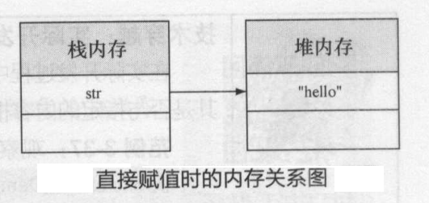
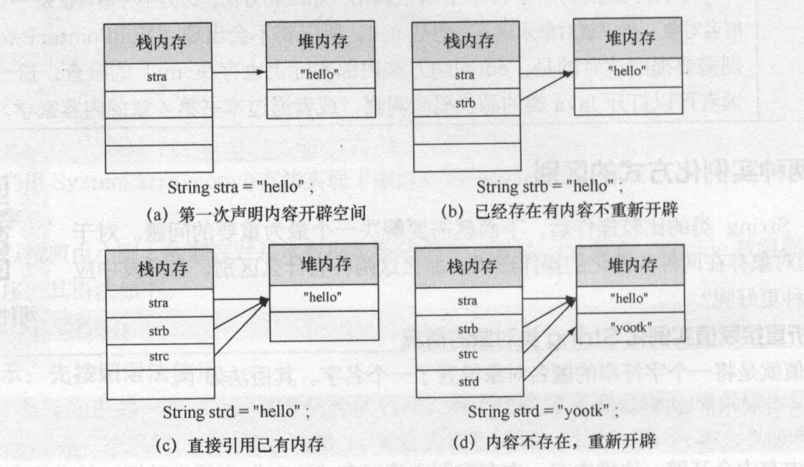
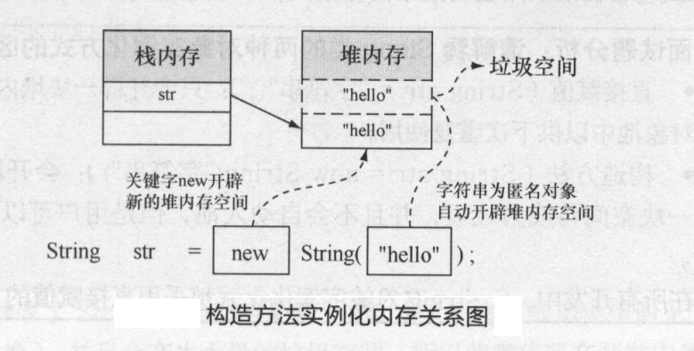
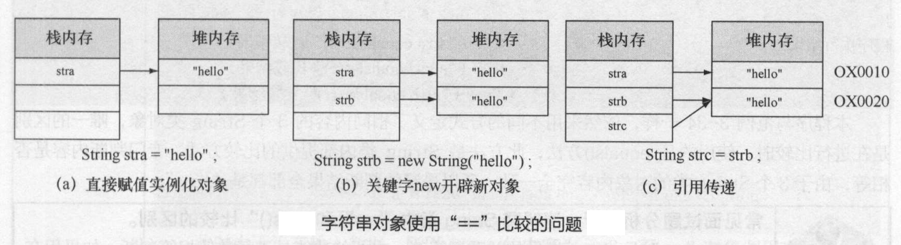
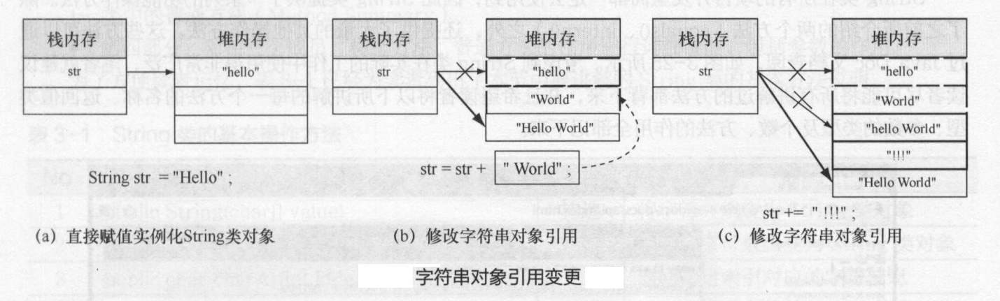

# Java基础知识汇总-Java常用类库

---

### 字符串

##### String的两种实例化方式

1）使用字面量直接赋值

~~~java
public class Demo{
	public static void main(String[] args){
		String str = "hello world!";
	}
}
~~~

> 字符串常量就是String的匿名对象。

2）使用构造方法实例化

~~~java
public class Demo{
	public static void main(String[] args){
		String str = new String("hello world!");
	}
}
~~~

3）两种方式的比较

直接赋值：

~~~java
public class Demo{
	public static void main(String[] args){
		String stra = "hello";
		String strb = "hello";
		String strc = "hello";
		String strd = "yootk";
		System.out.println(stra==strb); //true
		System.out.println(stra==strc); //true
		System.out.println(strb==strc); //true
		System.out.println(stra==strd); //false
	}
}
~~~

构造方法赋值：

~~~java
public class Demo{
	public static void main(String[] args){
		String stra = "hello";
		String strb = new String("hello");
		System.out.println(stra==strb); //false
	}
}
~~~

4）手工入池

~~~java
public class Demo{
	public static void main(String[] args){
		String stra = "hello";
		String strb = new String("hello").intern();
		System.out.println(stra==strb); //true
	}
}
~~~

5）总结

* 直接赋值：只会开辟一块堆内存空间，并且会自动保存在对象池中以供下次重复使用；
* 构造方法：会开辟两块堆内存空间，其中一块空间将成为垃圾，并且不会自动入池，但是可以使用intern方法手工入池；

##### 字符串的比较

1）使用“==”比较

~~~java
public class Demo{
	public static void main(String[] args){
		String stra = "hello";
		String strb = new String("hello");
		String strc = strb;
		System.out.println(stra==strb); //false
		System.out.println(stra==strc); //false
		System.out.println(strb==strc); //true
	}
}
~~~

2）使用“equals()”方法比较

~~~java
public class Demo{
	public static void main(String[] args){
		String stra = "hello";
		String strb = new String("hello");
		String strc = strb;
		System.out.println(stra.equals(strb)); //true
		System.out.println(stra.equals(strc)); //true
		System.out.println(strb.equals(strc)); //true
	}
}
~~~

3）总结

* ==是Java提供的关系运算符，主要的功能是进行数值相等判断，如果用在String对象上表示的是内存地址数值的比较；
* equals是String提供的一个方法，此方法专门负责进行字符串内容的比较；

##### 字符串不可变

字符串的内容一旦定义则不可以改变。

~~~java
public class Demo{
	public static void main(String[] args){
		String str = "Hello ";
		str = str + "World";
		str += "!!!";
		System.out.println(str);
	}
}
~~~

##### String的常用方法

| 方法                                                         | 描述                                                |
| ------------------------------------------------------------ | --------------------------------------------------- |
| public String(char[] value)                                  | 将字符数组变为String对象                            |
| public String(char[] value, int offset, int count)           | 将部分字符数组变为String对象                        |
| public char charAt(int index)                                | 返回指定索引对应的字符                              |
| public char[] toCharArray()                                  | 将字符串以字符数组的形式返回                        |
| public String(byte[] bytes)                                  | 将字节数组变为String对象                            |
| public String(byte[] bytes, int offset, int length)          | 将部分字节数组变为String对象                        |
| public byte[] getBytes()                                     | 将字符串变为字节数组                                |
| public byte[] getBytes(String charsetName) throws UnsupprotedEncodingException | 将字符串以指定的编码变为字节数组                    |
| public boolean equals(Object o)                              | 进行相等判断                                        |
| public boolean equalsIgnoreCase(Object o)                    | 进行相等判断，不区分大小写                          |
| public int compareTo(String s)                               | 比较两个字符串                                      |
| public boolean contains(String s)                            | 判断是否包含指定的字符串                            |
| public int indexOf(String str)                               | 从前向后查找指定字符串的位置                        |
| public int indexOf(String str, int fromIndex)                | 由指定位置从前向后查找指定字符串的位置              |
| public int lastIndexOf(String str)                           | 从后向前查找指定字符串的位置                        |
| public int lastIndexOf(String str, int fromIndex)            | 由指定位置从后向前查找指定字符串的位置              |
| public boolean startsWith(String prefix)                     | 判断是否以指定的字符串开头                          |
| public boolean startsWith(String prefix, int offset)         | 由指定位置判断是否以指定的字符串开头                |
| public boolean endsWith(String suffix)                       | 判断是否以指定的字符串结尾                          |
| public String replaceAll(String regexp, String replacement)  | 用新的内容替换全部旧的内容                          |
| public String replaceFirst(String regexp, String replacement) | 替换首个满足条件的内容                              |
| public String substring(int beginIndex)                      | 从指定索引截取到结尾                                |
| public String substring(int beginIndex, int endIndex)        | 截取部分字符串                                      |
| public String[] split(String regexp)                         | 按照指定的字符串进行分割                            |
| public String[] split(String regexp, int limit)              | 按照指定的字符串进行分割，最后数组的长度由limit决定 |
| public String concat(String str)                             | 字符串连接                                          |
| public String toLowerCase()                                  | 转小写                                              |
| public String toUpperCase()                                  | 转大写                                              |
| public String trim()                                         | 去掉字符串前后的空格                                |
| public int length()                                          | 获取字符串的长度                                    |
| public String intern()                                       | 数据入池                                            |
| public boolean isEmpty()                                     | 判断是否是空字符串（不是null，而是“”，长度为0）     |

##### StringBuffer

1）StringBuffer常用方法

| 方法                                                        | 描述                       |
| ----------------------------------------------------------- | -------------------------- |
| public StringBuffer()                                       | 构造方法                   |
| public StringBuffer append(char c)                          | 追加                       |
| public StringBuffer append(String str)                      | 追加                       |
| public StringBuffer append(StringBuffer sb)                 | 追加                       |
| public int indexOf(String str)                              | 查找指定的字符串           |
| public int indexOf(String str, int fromIndex)               | 从指定位置查找指定的字符串 |
| public StringBuffer insert(int offset, String str)          | 在指定位置插入字符串       |
| public StringBuffer reverse()                               | 翻转内容                   |
| public StringBuffer replace(int start, int end, String str) | 内容替换                   |
| public int length()                                         | 获取长度                   |
| public StringBuffer delete(int start, int end)              | 删除指定范围的内容         |
| public String substring(int start)                          | 截取子串                   |
| public String substring(int start, int end)                 | 截取指定范围的子串         |
| public String toString()                                    | 返回字符串                 |

2）字符串连接

~~~java
public class Demo{
	public static void main(String[] args){
		StringBuffer sb = new StringBuffer();
		sb.append("hello ");
		sb.append("world").append("!!!");
		sb.append("\n");
		sb.append(1).append("\n");
		sb.append('a').append("\n");
		sb.append(true).append("\n");
		System.out.println(sb);
	}
}
~~~

3）插入内容

~~~java
public class Demo{
	public static void main(String[] args){
		StringBuffer sb = new StringBuffer();
		sb.append("world!!!");
		sb.insert(0, "hello ");
		System.out.println(sb);
		sb.insert(sb.length(), "welcome");
		System.out.println(sb);
	}
}
~~~

4）翻转内容

~~~java
public class Demo{
	public static void main(String[] args){
		StringBuffer sb = new StringBuffer();
		sb.append("hello world!!!");
		sb.reverse();
		System.out.println(sb);
	}
}
~~~

5）替换内容

~~~java
public class Demo{
	public static void main(String[] args){
		StringBuffer sb = new StringBuffer();
		sb.append("hello world!!!");
		sb.replace(6, 11, "java");
		System.out.println(sb);
	}
}
~~~

6）截取内容

~~~java
public class Demo{
	public static void main(String[] args){
		StringBuffer sb = new StringBuffer();
		sb.append("hello world!!!");
		String str = sb.substring(6, 11);
		System.out.println(str);
	}
}
~~~

7）删除内容

~~~java
public class Demo{
	public static void main(String[] args){
		StringBuffer sb = new StringBuffer();
		sb.append("hello world!!!");
		sb.delete(6, 11);
		System.out.println(sb);
	}
}
~~~

8）查找内容

~~~java
public class Demo{
	public static void main(String[] args){
		StringBuffer sb = new StringBuffer();
		sb.append("hello world!!!");
		int index = sb.indexOf("hello");
		System.out.println(index);
	}
}
~~~

##### StringBuilder

##### 

### 数值

##### Math

##### Random

##### NumberFormat

1）NumberFormat常用方法

| 方法                                                         | 描述                     |
| ------------------------------------------------------------ | ------------------------ |
| public static Locale[] getAvailableLocales()                 | 返回所有语言环境         |
| public static final NumberFormat getInstance()               | 返回默认的数字格式       |
| public static NumberFormat getInstance(Locale locale)        | 根据指定环境返回数字格式 |
| public static final NumberFormat getCurrencyInstance()       | 返回默认的货币格式       |
| public static NumberFormat getCurrencyInstance(Locale locale) | 根据指定环境返回货币格式 |

2）示例代码

~~~java
public class Demo{
	public static void main(String[] args){
		NumberFormat nf1 = NumberFormat.getInstance();
		nf1.format(1000000);
		NumberFormat nf2 = NumberFormat.getCurrencyInstance();
		nf2.format(1000000);
	}
}
~~~

##### DecimalFormat

1）格式化模板

| 标记   | 位置       | 描述                                                         |
| ------ | ---------- | ------------------------------------------------------------ |
| 0      | 数字       | 代表阿拉伯数字，每一个0代表一位阿拉伯数字，如果该位不存在则显示0 |
| #      | 数字       | 代表阿拉伯数字，每一个#代表一位阿拉伯数字，如果该位不存在则不显示 |
| .      | 数字       | 小数点分隔符或货币的小数分隔符                               |
| -      | 数字       | 负号                                                         |
| ,      | 数字       | 分组分隔符                                                   |
| E      | 数字       | 分隔科学计数法中的尾数和指数                                 |
| ;      | 子模式边界 | 分隔正数和负数子模式                                         |
| %      | 前缀或后缀 | 数字乘以100并显示为百分数                                    |
| \u2030 | 前缀或后缀 | 数字乘以1000并显示为千分数                                   |
| \u00A4 | 前缀或后缀 | 货币记号，由货币号替换。如果两个同时出现，则用国际货币符号替换；如果出现某个模式，则使用货币小数分隔符，而不使用小数分隔符 |
| '      | 前缀或后缀 | 用于在前缀或后缀中为特殊字符加引号，例如“‘#’#”将123格式化为“#123”；要创建单引号本身，则连续使用两个单引号，例如“# o''clock” |

2）示例代码

~~~java
class Formatter{
	public static String format(String pattern, double value){
		DecimalFormat df = new DecimalFormat(pattern);
		return df.format(value);
	}
}
public class Demo{
	public static void main(String[] args){
		Formatter.format("###,###.###", 111222.34567); //111,222.346
		Formatter.format("000,000.000", 11222.34567); //011,222.346
		Formatter.format("###,###.###￥", 111222.34567); //111,222.346￥
		Formatter.format("000,000.000￥", 11222.34567); //011,222.346￥
		Formatter.format("##.###%", 0.345678); //34.568%
		Formatter.format("00.###%", 0.0345678); //03.457%
		Formatter.format("###.###\u2030", 0.345678); //345.678‰
	}
}
~~~

##### BigInteger

1）BigInteger常用方法

| 方法                                                   | 描述                                 |
| ------------------------------------------------------ | ------------------------------------ |
| public BigInteger(String val)                          | 构造方法                             |
| public BigInteger add(BigInteger val)                  | 加法                                 |
| public BigInteger subtract(BigInteger val)             | 减法                                 |
| public BigInteger multiply(BigInteger val)             | 乘法                                 |
| public BigInteger divide(BigInteger val)               | 除法                                 |
| public BigInteger max(BigInteger val)                  | 获取最大值                           |
| public BigInteger min(BigInteger val)                  | 获取最小值                           |
| public BigInteger[] divideAndRemainder(BigInteger val) | 除法，数组第1个值为商，第2个值为余数 |

2）示例代码

~~~java
public class Demo{
	public static void main(String[] args){
		BigInteger v1 = new BigInteger("123456789");
		BigInteger v2 = new BigInteger("987654321");
		System.out.println(v2.add(v1)); //1111111110
		System.out.println(v2.subtract(v1)); //864197532
		System.out.println(v2.multiply(v1)); //121932631112635269
		System.out.println(v2.divide(v1)); //8
		System.out.println(v2.max(v1)); //987654321
		System.out.println(v2.min(v1)); //123456789
		BigInteger[] res = v2.divideAndRemainder(v1);
		System.out.println(res[0] + ":" + res[1]); //8:9
	}
}
~~~

##### BigDecimal

1）BigDecimal常用方法

| 方法                                                | 描述                               |
| --------------------------------------------------- | ---------------------------------- |
| public BigDecimal(double val)                       | 将double表示的形式转变为BigDecimal |
| public BigDecimal(int val)                          | 将int表示的形式转变为BigDecimal    |
| public BigDecimal(String val)                       | 将String表示的形式转变为BigDecimal |
| public BigDecimal add(BigDecimal augend)            | 加法                               |
| public BigDecimal subtract(BigDecimal subtrahend)   | 减法                               |
| public BigDecimal multiply(BigDecimal multiplicand) | 乘法                               |
| public BigDecimal divide(BigDecimal divisor)        | 除法                               |

2）示例代码

~~~java
public class Demo{
	public static void main(String[] args){
		BigDecimal v1 = new BigDecimal(10.345);
		BigDecimal v2 = new BigDecimal(3.33);
		System.out.println(v2.add(v1));
		System.out.println(v2.subtract(v1));
		System.out.println(v2.multiply(v1));
		System.out.println(v2.divide(v1, 2, BigDecimal.ROUND_HALF_UP));
	}
}
~~~

##### 

### 数组

##### Arrays

1）Arrays常用方法

| 方法                                             | 描述                     |
| ------------------------------------------------ | ------------------------ |
| public static boolean equals(int[] a, int[] b)   | 判断两个数组内容是否相等 |
| public static void fill(int[] a, int val)        | 将指定内容填充到数组     |
| public static void sort(int[] a)                 | 排序                     |
| public static int binarySearch(int[] a, int key) | 对有序数组进行检索       |
| public static String toString(int[] a)           | 输出数组信息             |

2）示例代码

~~~java
public class Demo{
	public static void main(String[] args){
		int[] temp = {3, 5, 7, 9, 1, 2, 6, 8};
		Arrays.sort(temp);
		System.out.println(Arrays.toString(temp));
		int pos = Arrays.binarySearch(temp, 9);
		Arrays.fill(temp, 3);
		System.out.println(Arrays.toString(temp));
	}
}
~~~

##### 

### 日期时间

##### Date

##### Calendar

1）Calendar主要方法

| 方法                                 | 描述                           |
| ------------------------------------ | ------------------------------ |
| public static final int YEAR         | 年                             |
| public static final int MONTH        | 月                             |
| public static final int DAY_OF_MONTH | 日                             |
| public static final int HOUR_OF_DAY  | 时                             |
| public static final int MINUTE       | 分                             |
| public static final int SECOND       | 秒                             |
| public static final int MILLISECOND  | 毫秒                           |
| public static Calendar getInstance() | 根据默认时区实例化对象         |
| public boolean after(Object when)    | 判断一个日期是否在指定日期之后 |
| public boolean before(Object when)   | 判断一个日期是否在指定日期之前 |
| public int get(int field)            | 返回指定日历字段的值           |

2）示例代码

~~~java
public class Demo{
	public static void main(String[] args){
		Calendar cal = new GregorianCalendar();
		System.out.println(cal.get(Calendar.YEAR));
		System.out.println(cal.get(Calendar.MONTH)+1);
		System.out.println(cal.get(Calendar.DAY_OF_MONTH));
		System.out.println(cal.get(Calendar.HOUR_OF_DAY));
		System.out.println(cal.get(Calendar.MINUTE));
		System.out.println(cal.get(Calendar.SECOND));
		System.out.println(cal.get(Calendar.MILLISECOND));
	}
}
~~~

##### DateFormat

1）DateFormat主要方法

| 方法                                                         | 描述                       |
| ------------------------------------------------------------ | -------------------------- |
| public static final DateFormat getDateInstance()             | 得到默认日期对象           |
| public static final DateFormat getDateInstance(int style, Locale locale) | 根据Locale得到日期对象     |
| public static final DateFormat getDateTimeInstance()         | 得到默认日期时间对象       |
| public static final DateFormat getDateTimeInstance(int dateStyle, int timeStyle, Locale locale) | 根据Locale得到日期时间对象 |

2）示例代码

~~~java
public class Demo{
	public static void main(String[] args){
		DateFormat df1 = DateFormat.getDateInstance();
		df1.format(new Date());
		DateFormat df2 = DateFormat.getDateTimeInstance();
		df2.format(new Date());
		
		DateFormat df3 = DateFormat.getDateInstance(DateFormat.YEAR_FIELD, new Locale("zh", "CN"));
		df3.format(new Date());
		DateFormat df4 = DateFormat.getDateTimeInstance(DateFormat.YEAR_FIELD, DateFormat.ERA_FIELD, new Locale("zh", "CN"));
		df4.format(new Date());
	}
}
~~~

##### SimpleDateFormat

1）日期格式化模板标记

| 标记 | 描述           |
| ---- | -------------- |
| y    | 年，yyyy       |
| M    | 月，MM         |
| d    | 月中的天数，dd |
| H    | 小时，HH       |
| m    | 分，mm         |
| s    | 秒，ss         |
| S    | 毫秒，SSS      |

2）示例代码

~~~java
public class Demo{
	public static void main(String[] args) throws Exception{
		String str = "2013-10-20 10:11:30.478";
		SimpleDateFormat df1 = new SimpleDateFormat("yyyy-MM-dd HH:mm:ss.SSS");
		SimpleDateFormat df2 = new SimpleDateFormat("yyyy年MM月dd日HH:时mm分ss秒SSS毫秒");
		Date d = df1.parse(str);
		str = df2.format(d);
	}
}
~~~

##### 

### 系统相关

##### System

1）System的主要方法

| 方法                                                         | 描述                          |
| ------------------------------------------------------------ | ----------------------------- |
| public static void exit(int status)                          | 系统退出，status非0就表示退出 |
| public static void gc()                                      | 运行垃圾收集器                |
| public static long currentTimeMillis()                       | 返回以毫秒为单位的当前时间    |
| public static void arraycopy(Object src, int srcPos, Object dest, int destPos, int length) | 复制数组                      |
| public static Properties getProperties()                     | 取得当前系统的所有属性        |
| public static String getProperty(String key)                 | 根据键值取得属性的具体内容    |

2）示例代码

~~~java
public class Demo{
	public static void main(String[] args){
		long start = System.currentTimeMillis();
		long end = System.currentTimeMillis();
		long offset = end - start;
		
		System.getProperties().list(System.out);
		System.getProperty("os.name");
	}
}
~~~

##### Runtime

在Java中Runtime类表示运行时操作类，是一个封装了JVM进程的类，每一个JVM都对应着一个Runtime类的实例，此实例由JVM运行时为其实例化。

1）Runtime的主要方法

| 方法                                                   | 描述                |
| ------------------------------------------------------ | ------------------- |
| public static Runtime getRuntime()                     | 取得Runtime类实例   |
| public long freeMemory()                               | 返回JVM的空闲内存量 |
| public long maxMemory()                                | 返回JVM的最大内存量 |
| public void gc()                                       | 运行垃圾收集器      |
| public Process exec(String command) throws IOException | 执行本机命令        |

2）示例代码

~~~java
public class Demo{
	public static void main(String[] args){
		Runtime runtime = Runtime.getRuntime();
		System.out.println("max memory:"+runtime.maxMemory());
		System.out.println("free memory:"+runtime.freeMemory());
		byte[] b = new byte[1024*1024*100];
		System.out.println("free memory:"+runtime.freeMemory());
		runtime.gc();
		System.out.println("free memory:"+runtime.freeMemory());
	}
}
~~~

~~~java
public class Demo{
	public static void main(String[] args) throws Exception{
		Runtime runtime = Runtime.getRuntime();
		Process process = runtime.exec("notepad.exe");
		Thread.sleep(5000);
		process.destroy();
	}
}
~~~

##### Process

##### 

### 

   

---

