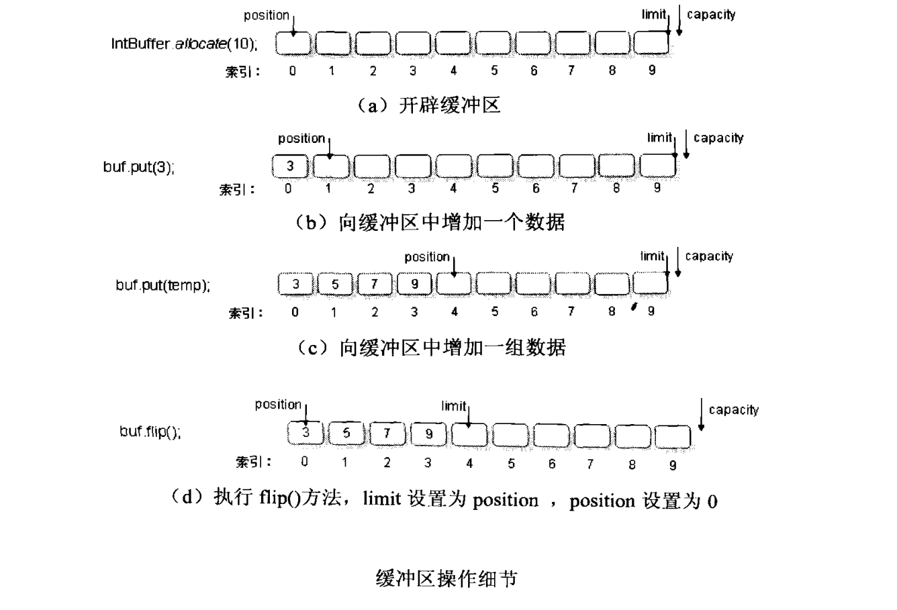
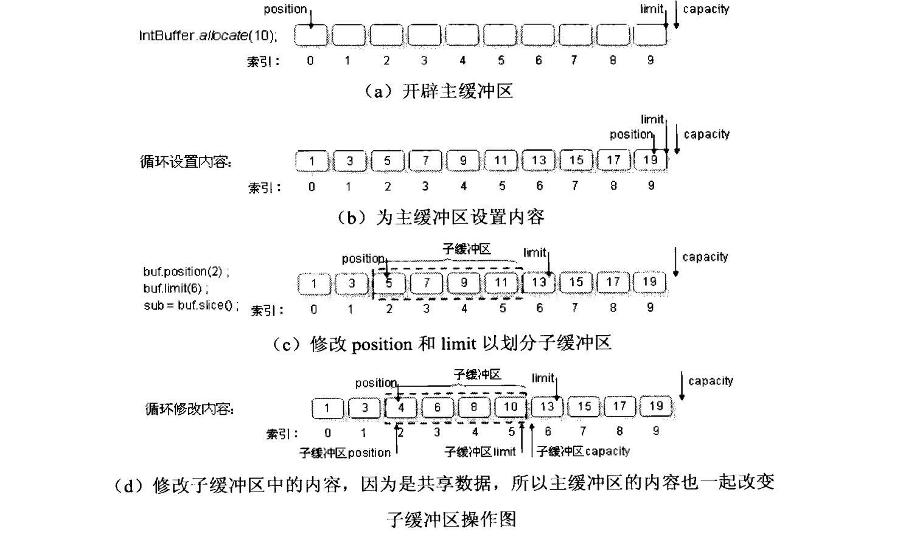
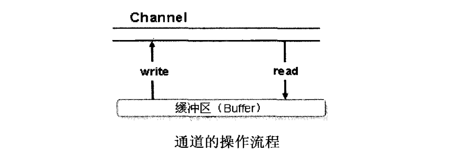

# Java基础知识汇总-NIO

---

### NIO基本概念

NIO提供了一个全新的底层IO模型。与最初的java.io包中面向流的概念不同，NIO中采用了面向块的概念。这意味着在尽可能的情况下，IO操作以大的数据块为单位进行，而不是一次一个字节或字符进行。采用这样的方式Java的IO性能已经有了很大的提高。

NIO中提供与平台无关的非阻塞IO（nonblocking IO），与面向线程的、阻塞式IO方式相比，多道通信、非阻塞式IO技术可以使应用程序更有效地处理大量连接的情况。

* 多路选择的非封锁式IO设施；
* 支持文件锁和内存映射；
* 支持正则表达式的模式匹配设施；
* 字符集编码器与译码器；

### 缓冲区Buffer

在基本IO操作中所有的操作都是直接以流的形式完成的，而在NIO中所有的操作都要使用到缓冲区处理，且所有的读写操作都是通过缓冲区完成的。缓冲区（Buffer）是一个线性的、有序的数据集，只能容纳某种特定的数据类型。

1）Buffer的常用方法

| 方法                                          | 描述                                       |
| --------------------------------------------- | ------------------------------------------ |
| public final int capacity()                   | 返回此缓冲区的容量                         |
| public final int limit()                      | 返回此缓冲区的限制                         |
| public final Buffer limit(int newLimit)       | 设置缓冲区的限制                           |
| public final int position()                   | 返回缓冲区的操作位置                       |
| public final Buffer position(int newPosition) | 设置缓冲区的操作位置                       |
| public final Buffer clear()                   | 清空缓冲区                                 |
| public final Buffer flip()                    | 重设缓冲区，在写入之前调用，改变缓冲的指针 |
| public final Buffer reset()                   | 恢复缓冲区中的标记位置                     |
| public final boolean hasRemaining()           | 判断在当前位置和限制之间是否有内容         |

2）在NIO中针对每一种基本数据类型都有一种对应的缓冲区操作类，ByteBuffer、ShortBuffer、IntBuffer、LongBuffer、FloatBuffer、DoubleBuffer、CharBuffer。

| 方法                                                         | 描述                                       |
| ------------------------------------------------------------ | ------------------------------------------ |
| public static 缓冲区类型 allocate(int capacity)              | 分配缓冲区空间                             |
| public 基本数据类型 get()                                    | 取得当前位置的内容                         |
| public 基本数据类型 get(int index)                           | 取得指定位置的内容                         |
| public 缓冲区类型 put(基本数据类型 x)                        | 写入指定基本数据类型的数据                 |
| public final 缓冲区类型 put(数据类型[] src)                  | 写入一组指定的基本数据类型的数据           |
| public final 缓冲区类型 put(数据类型[] src, int offset, int length) | 写入一组指定的基本数据类型的数据           |
| public 缓冲区类型 slice()                                    | 创建子缓冲区，其中一部分与原缓冲区共享数据 |
| public 缓冲区类型 asReadOnlyBuffer()                         | 将缓冲区设置为只读缓冲区                   |

3）缓冲区的状态变量

* position：表示下一个缓冲区读取或写入的操作指针，当向缓冲区中写入数据时此指针就会改变，指针永远放到写入的最后一个元素之后。例如，如果写入了4个位置的数据，则position会指向第5个位置；
* limit：表示还有多少数据需要存储或读取，position<=limit；
* capacity：表示缓冲区的最大容量，limit<=capacity，此值在分配缓冲区时被设置，一般不会更改；

4）基本示例

~~~java
public class Demo{
	public static void main(String[] args){
		IntBuffer buf = IntBuffer.allocate(10);
		System.out.println(buf.capacity()); //10
		System.out.println(buf.limit()); //10
		System.out.println(buf.position()); //0
		
		int[] temp = {5, 7, 9};
		buf.put(3);
		buf.put(temp);
		System.out.println(buf.capacity()); //10
		System.out.println(buf.limit()); //10
		System.out.println(buf.position()); //4
		
		buf.flip();
		System.out.println(buf.capacity()); //10
		System.out.println(buf.limit()); //4
		System.out.println(buf.position()); //0
		
		while(buf.hasRemaining()){
			System.out.println(buf.get());
		}
	}
}
~~~

5）创建子缓冲区

~~~java
public class Demo{
	public static void main(String[] args){
		IntBuffer buf = IntBuffer.allocate(10);
		for(int i=0; i<10; i++){
			buf.put(2*i+1);
		}
		buf.position(2);
		buf.limit(6);
		
		IntBuffer sub = buf.slice();
		for(int i=0; i<sub.capacity(); i++){
			int temp = sub.get();
			sub.put(temp-1);
		}
		
		buf.flip();
		buf.limit(buf.capacity());
		while(buf.hasRemaining()){
			System.out.println(buf.get());
		}
	}
}
~~~

6）创建只读缓冲区

~~~java
public class Demo{
	public static void main(String[] args){
		IntBuffer buf = IntBuffer.allocate(10);
		for(int i=0; i<10; i++){
			buf.put(2*i+1);
		}
		
		IntBuffer read = buf.asReadOnlyBuffer();
		read.flip();
		while(read.hasRemaining()){
			System.out.println(read.get());
		}
	}
}
~~~

7）创建直接缓冲区

~~~java
public class Demo{
	public static void main(String[] args){
		ByteBuffer buf = ByteBuffer.allocateDirect(10);
		byte[] temp = {1, 3, 5, 7, 9};
		buf.put(temp);
		buf.flip();
		
		while(buf.hasRemaining()){
			System.out.println(buf.get());
		}
	}
}
~~~

> 只有ByteBuffer可以创建直接缓冲区。

### 通道Channel

通道（Channel）可以用来读取和写入数据，通道类似于之前的输入\输出流，但是程序不会直接操作通道，所有的内容都是先读到或写入到缓冲区中，在通过缓冲区中取得或写入的。通道与传统的流操作不同，传统的流操作分为输入或输出流，而通道本身是双向操作的，既可以完成输入也可以完成输出。

1）FileChannel

FileChannel是Channel的子类，可以进行文件的读写操作。

~~~java
public class Demo{
	public static void main(String[] args){
		String[] info = {"hello world", "hello java", "welcome"};
		ByteBuffer buf = ByteBuffer.allocate(1024);
		for(int i=0; i<info.length; i++){
			buf.put(info[i].getBytes());
		}
		buf.flip();
		
		FileOutputStream out = new FileOutputStream(new File("demo.txt"));
		FileChannel c = out.getChannel();
		c.write(buf);
		c.close();
		out.close();
	}
}
~~~

2）使用通道进行读写操作

~~~java
public class Demo{
	public static void main(String[] args){
		FileInputStream in = new FileInputStream(new File("demo_in.txt"));
		FileChannel cIn = in.getChannel();
		FileOutputStream out = new FileOutputStream(new File("demo_out.txt"));
		FileChannel cOut = out.getChannel();
		
		ByteBuffer buf = ByteBuffer.allocate(1024);
		int temp = 0;
		for((temp = cIn.read(buf)) != -1){
			buf.flip();
			cOut.write(buf);
			buf.clear();
		}
		
		cIn.close();
		cOut.close();
		in.close();
		out.close();
	}
}
~~~

### 内存映射

内存映射可以把文件映射到内存中，这样文件内的数据就可以用内存读\写指令来访问，而不是使用InputStream、OutputStream这样的IO操作类，采用此种方式读取文件的速度是最快的。

Java中访问文件内容的4种方法：

* RandomAccessFile，随机读取数据，访问速度较慢；
* FileInputStream，文件输入流，访问速度较慢；
* 缓冲读取（例如BufferedReader），访问速度较快；
* 内存映射（MappedByteBuffer），访问速度最快；

~~~java
public class Demo{
	public static void main(String[] args){
		File file = new File("demo.txt");
		FileInputStream in = new FileInputStream(file);
		FileChannel c = in.getChannel();
		
		MappedByteBuffer buf = c.map(FileChannel.MapMode.READ_ONLY, 0, file.length());
		byte[] data = new byte[(int)file.length()];
		int index = 0;
		while(buf.hasRemaining()){
			data[index++] = buf.get();
		}
		String str = new String(data);
		
		c.close();
		in.close();
	}
}
~~~

### 选择器Selector

在原来使用IO和Socket构造网络服务时，所有的网络服务将使用阻塞的方式进行客户端的连接，而如果使用了NIO则可以构造一个非阻塞的网络服务。

1）Selector常用方法

| 方法                                               | 描述                             |
| -------------------------------------------------- | -------------------------------- |
| public static Selector open() throws IOException   | 打开一个选择器                   |
| public abstract int select() throws IOException    | 选择一组键，通道已经为IO做好准备 |
| public abstract Set`<SelectionKey>` selectedKeys() | 返回此选择器已选择的key          |

2）ServerSocketChannel常用方法

| 方法                                                         | 描述                                                   |
| ------------------------------------------------------------ | ------------------------------------------------------ |
| public abstract SelectableChannel configureBlocking(boolean block) throws IOException | 调整此通道的阻塞模式，true为阻塞，false为非阻塞        |
| public final SelectionKey register(Selector s, int ops) throws ClosedChannelException | 向指定的选择器注册通道并设置Selector域，返回一个选择键 |
| public static ServerSocketChannel open() throws IOException  | 打开服务器的套接字通道                                 |
| public abstract ServerSocket socket()                        | 返回与此通道关联的服务器套接字                         |

3）4种Selector域

| 域                                 | 描述                             |
| ---------------------------------- | -------------------------------- |
| public static final int OP_ACCEPT  | 相当于ServerSocket的accept()操作 |
| public static final int OP_CONNECT | 连接操作                         |
| public static final int OP_READ    | 读操作                           |
| public static final int OP_WRITE   | 写操作                           |

4）建立一个非阻塞的服务器端

~~~java
public class Demo{
	public static void main(String[] args){
		int port = 8888;
		InetSocketAddress addr = new InetSocketAddress(port);
		Selector selector = Selector.open();
		ServerSocketChannel c = ServerSocketChannel.open();
		c.configureBlocking(false);
		ServerSocket s = c.socket();
		s.bind(addr);
		c.register(selector, SelectionKey.OP_ACCEPT);
		System.out.println("server run on "+port+" ...");
	}
}
~~~

5）SelectionKey常用方法

| 方法                                        | 描述                                   |
| ------------------------------------------- | -------------------------------------- |
| public abstract SelectableChannel channel() | 返回创建此key的通道                    |
| public final boolean isAcceptable()         | 判断此通道是否可以接收新的连接         |
| public final boolean isConnectable()        | 判断此通道是否可以完成套接字的连接操作 |
| public final boolean isReadable()           | 判断此通道是否可以进行读操作           |
| public final boolean isWriteable()          | 判断此通道是否可以进行写操作           |

6）示例代码

~~~java
public class Demo{
	public static void main(String[] args) throws Exception{
		int ports = {8000, 8001, 8002, 8003, 8004, 8005, 8006};
		Selector selector = Selector.open();
		for(int i=0; i<ports.length; i++){
			ServerSocketChannel c = ServerSocketChannel.open();
			c.configureBlocking(false);
			ServerSocket s = c.socket();
			InetSocketAddress addr = new InetSocketAddress(ports[i]);
			s.bind(addr);
			c.register(selector, SelectionKey.OP_ACCEPT);
			System.out.println("server run on "+ports[i]+" ...");
		}
		
		int keysAdd = 0;
		while((keysAdd=selector.select()) > 0){
			Set<SelectionKey> selectedKeys = selector.selectedKeys();
			Iterator<SelectionKey> it = selectedKeys.iterator();
			while(it.hasNext()){
				SelectionKey key = (SelectionKey) it.next();
				if(key.isAcceptable()){
					ServerSocketChannel server = (ServerSocketChannel) key.channel();
					SocketChannel client = server.accept();
					client.configureBlocking(false);
					ByteBuffer buf = ByteBuffer.allocate(1024);
					buf.put(("当前时间：" + new Date()).getBytes());
					buf.flip();
					client.write(buf);
					client.close();
				}
			}
			selectedKeys.clear();
		}
	}
}
~~~

客户端可以直接使用普通的Socket创建或者使用Telnet命令进行连接。

### 文件锁FileLock

在Java NIO中提供了文件锁的功能，这样当一个线程将文件锁定之后，其它线程是无法操作此文件的。文件锁定方式有两种：

* 共享锁：允许多个线程进行文件的读取操作；
* 独占锁：只允许一个线程进行文件的读/写操作；

1）FileLock常用方法

| 方法                                              | 描述                    |
| ------------------------------------------------- | ----------------------- |
| public final boolean isShared()                   | 判断是否为共享锁        |
| public final FileChannel channel()                | 返回此锁定的FileChannel |
| public abstract void release() throws IOException | 释放锁定                |
| public final long size()                          | 返回锁定区域的大小      |

2）示例代码

~~~java
public class Demo{
	public static void main(String[] args){
		File file = new File("demo.txt");
		FileOutputStream out = new FileOutputStream(file, true);
		FileChannel c = out.getChannel();
		FileLock lock = c.tryLock();
		if(lock!=null){
			System.out.println(file.getName() + "文件锁定");
			Thread.sleep(300000);
			lock.release();
			System.out.println(file.getName() + "文件解锁");
		}
		c.close();
		out.close();
	}
}
~~~

### 字符集Charset

在NIO中为了保证程序可以适应各种不同的编码，所以提供了编码器和解码器，通过解码器程序可以方便地读取各个平台上不同编码的数据，之后再通过编码器将程序的内容以正确的编码进行输出。

1）Charset常用方法

| 方法                                                         | 描述                  |
| ------------------------------------------------------------ | --------------------- |
| public static SortedMap<String, Charset> availableCharsets() | 取得全部字符集        |
| public static Charset forName(String charsetName)            | 返回指定的Charset对象 |
| public abstract CharsetEncoder newEncoder()                  | 创建编码器            |
| public abstract CharsetDecoder newDecoder()                  | 创建解码器            |

2）示例代码

~~~java
public class Demo{
	public static void main(String[] args){
		SortedMap<String, Charset> all = Charset.availableCharsets();
		Iterator<Map.Entry<String, Charset>> it = all.entrySet().iterator();
		while(it.hasNext()){
			Map.Entry<String, Charset> e = it.next();
			System.out.println(e.getKey()+":"+e.getValue());
		}
		
		Charset c = Charset.forName("ISO-8859-1");
		CharsetEncoder encoder = c.newEncoder();
		CharsetDecoder decoder = c.newDecoder();
		CharBuffer cBuf = CharBuffer.wrap("hello world!");
		ByteBuffer buf = encoder.encode(cBuf);
		System.out.println(decoder.decode(buf));
	}
}
~~~

   

---

