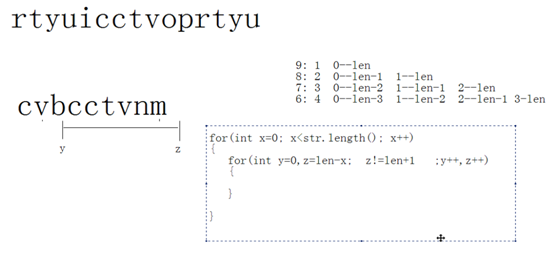

# Java基础习题汇总

---

### 语法基础

1）

~~~java
boolean b = true;
if(b=false)
	System.out.println("a");
else if(b)
	System.out.println("b");
else if(!b)
	System.out.println("c");
else
	System.out.println("d");
~~~

将false赋值给b，b的值是false，即整个表达式结果是false，可以参与判断；但是这种写法只限布尔值类型的赋值。

2）

~~~java
int x = 1, y = 1;
if(x++==2 & ++y==2) {
	x = 7;
}
System.out.println("x="+x+",y="+y); //x=2,y=2

int x = 1, y = 1;
if(x++==2 && ++y==2) {
	x = 7;
}
System.out.println("x="+x+",y="+y); //x=2,y=1

int x = 1, y = 1;
if(x++==1 | ++y==1) {
	x = 7;
}
System.out.println("x="+x+",y="+y); //x=7,y=2;

int x = 1, y = 1;
if(x++==1 || ++y==1) {
	x =7;
}
System.out.println("x="+x+",y="+y); //x=7,y=1
~~~

3）

~~~java
int x = 2, y=3;
switch(x) {
	default:
		y++;
	case 3:
		y++;
	case 4:
		y++;
}
System.out.println("y="+y); //y=6
~~~

4）

~~~java
String s1 = "abcd";
String s2 = new String("abcd");
System.out.println(s1==s2); //false
System.out.println(s1.equals(s2)); //true
String s3 = "ab" + "cd";
System.out.println(s1==s3); //true
~~~

5）

~~~java
Integer a = new Integer(127);
Integer b = new Integer(127);
System.out.println(a==b); //false
System.out.println(a.equals(b)); //true

Integer c = 127;
Integer d = 127;
System.out.println(c==d); //true
System.out.println(c.equals(d)); //true

Integer e = 128;
Integer f = 128;
System.out.println(e==f); //false
System.out.println(e.equals(f)); //true
~~~

6）求最大相同子串

~~~java
//s1为较长串，s2为较短串。
public static String getMaxSubString(String s1, String s2) {
    for(int x=0; x<s2.length(); x++) {
        for(int y=0,z=s2.length()-x; z!=s2.length()+1; y++,z++) {
            String temp = s2.substring(y,z);
            if(s1.contains(temp)) {
                return temp;
            }
        }
    }
    return null;
}
~~~

7）

~~~java
int i = 3;
i = i++;
System.out.println("i="+i); //i=3
~~~

8）

~~~java
class Demo {
	public static void main(String[] args) {
		int x=0,y=1;
		if(++x==y--&x++==1||--y==0)
			System.out.println("x="+x+",y="+y); //x=2,y=0
		else
			System.out.println("y="+y+",x="+x);
	}
}
~~~

9）

~~~java
class Demo {
	public static void main(String[] args) {
		int a=3,b=8;

		int c=(a>b)?a++:b++;
		System.out.println("a="+a+"\tb="+b+"\tc="+c);  //3 9 8

		int d=(a>b)?++a:++b;
		System.out.println("a="+a+"\tb="+b+"\td="+d); // 3 10 10
		
		int e=(a<b)?a++:b++;
		System.out.println("a="+a+"\tb="+b+"\te="+e);  //4 10 3

		int f=(a<b)?++a:++b;
		System.out.println("a="+a+"\tb="+b+"\tf="+f);  //5 10 5
	}
}
~~~

10）

~~~java
class Demo {
	public static void main(String[] args) {
		int m=0,n=3;
		if(m>0)
			if(n>2)
				System.out.println("A");
		else
			System.out.println("B");
	}
}
~~~

11）

~~~java
public class Demo { 
	public static void main(String []args) { 
		int i = 0, j = 5; 
		tp: for (;;) { 
			i++; 
			for(;;) {
				if(i > j--)
					break tp; 
			}
		} 
		System.out.println("i = " + i + ", j = "+ j); // i= 1，j = -1;
	} 
} 	
~~~

12）

~~~java
class Demo {
	public static void main(String[] args) {
		String foo="blue"; 
		boolean[] bar=new boolean[2]; //boolean类型的数组的默认值是false
		if(bar[0]) { 
      			foo="green"; 
   		} 
		System.out.println(foo);
	}
}
~~~

13）

~~~java
class Test { 
	public static void main(String[] args) { 
		String foo=args[1]; 
		String bar=args[2]; 
		String baz=args[3]; 
	} 
}

d:\>java Test Red Green Blue 

what is the value of baz? 
A. baz has value of "" 
B. baz has value of null 
C. baz has value of "Red" 
D. baz has value of "Blue" 
E. baz has value of "Green" 
F. the code does not compile 
G. the program throw an exception 

//G
~~~

14）

~~~java
public static void main(String[] args) {
	String strValue="ABCDEFG"; 
	strValue.substring(3); 
	strValue.concat("123");
	System.out.println("result=" + strValue); //ABCDEFG
	
	String value = new String ("ABCDEFG");
	System.out.println(strValue == value); //false
}
~~~

15）

~~~java
public class Test {

	static boolean isTrue() {
		System.out.println("isTrue");
		return true;
	}

	static boolean isFalse() {
		System.out.println("isFalse");
		return false;
	}

	public static void main(String[] args) {
		if (isTrue() || isFalse()) {
			System.out.println(" || operate return true");
		}
		if (isFalse() & isTrue()) {
			System.out.println(" & operate return true");
		}
	}

}

isTrue
 || operate return true
isFalse
isTrue
~~~

### 面向对象

1）写出程序结果

~~~java
class Demo {	
	public static void func() {
		try {
			throw  new Exception();
		} finally {
			System.out.println("B");
		}
	}
	public static void main(String[] args) {
		try {
			func();
			System.out.println("A");
		} catch(Exception e) {
			System.out.println("C");
		}
		System.out.println("D");
	}
}
~~~

抛出了一个编译时被检测的异常，该异常还没有被catch，那就必须要用throws在函数上声明。因为没有声明，所以编译失败。如果有异常throws声明，那么结果是:BCD。

2）写出程序结果

~~~java
class Test {
	Test() {
		System.out.println("Test");
	}
}
class Demo extends Test {
	Demo() {
		System.out.println("Demo");
	}
	public static void main(String[] args) {
		new Demo();
		new Test();
	}
}
~~~

Test、Demo、Test

3）写出程序结果

~~~java
interface A{}  
class B implements A {
	public String func() {
		return "func";
	}
}
class Demo {
	public static void main(String[] args) {
		A a=new B();
		System.out.println(a.func());
	}
}
~~~

接口型引用指向自己的子类对象，这是多态形式。当调用非静态函数时，编译时看左边，运行时看右边。发现左边a引用变量所属的接口中并没有定义过func方法。所以编译失败。

4）写出程序结果

~~~java
class Fu {
	boolean show(char a) {
		System.out.println(a);
		return true;
	}
}
class Demo extends Fu {
	public static void main(String[] args) {
		int i=0;
		Fu f=new Demo();
		Demo d=new Demo();
		for(f.show('A'); f.show('B')&&(i<2);f.show('C')) {
			i++;
			d.show('D');
		}	
	}
	boolean show(char a) {
		System.out.println(a);
		return false;
	}
}
~~~

A、B。无论是f还是d调用show方法，运行都是子类中的show方法。因为覆盖了父类中的show方法。 

5）写出程序结果

~~~java
interface A {}
class B implements A {
	public String test() {
		return "yes";
	}
}
class Demo {
	static A get() {
		return new B();
	}
	public static void main(String[] args) {
		A a=get(); //A a = new B();
		System.out.println(a.test()); //编译失败，接口中并未定义test方法。
	}
}
~~~

6）写出程序结果:

~~~java
class Super {
	int i=0;
	public Super(String a) {
		System.out.println("A");
		i=1;	
	}
	public Super() {
		System.out.println("B");
		i+=2;
	}
}
class Demo extends Super {
	public Demo(String a) {
		//super();默认调用了父类中空参数的构造函数。 
		System.out.println("C");
		i+=5;				
	}
	public static void main(String[] args) {
		int i=4;
		Super d=new Demo("A");//多态。 子类实例化。
		System.out.println(d.i);
	}
}

//B C 7
~~~

7）

~~~java
interface Inter {
	void show(int a,int b);
	void func();
}
class Demo {
	public static void main(String[] args) {
		//补足代码；调用两个函数，要求用匿名内部类

		Inter in = new Inter() {
			public void show(int a,int b) {}
			void func() {}
		};
		in.show(4,5);
		in.func();
	}
}
~~~

8）写出程序结果

~~~java
class TD {
	int y=6;
	class Inner {
		static int y=3;  //非静态内部类中不允许定义静态成员。 编译失败。
		void show() {
			System.out.println(y);
		}
	}
}
class TC {
	public static void main(String[] args) {
		TD.Inner ti=new TD().new Inner();
		ti.show();
	}
}
~~~

9）选择题，写出错误答案错误的原因，用单行注释的方式。

~~~java
class Demo {
	 int show(int a,int b){return 0;}
}
class SubDemo extends Demo {
	private int show(int a,long b){return 0;}
}

下面那些函数可以存在于Demo的子类中。	
A.public int show(int a,int b){return 0;}//可以，因为覆盖。
B.private int show(int a,int b){return 0;}//不可以，因为覆盖失败。 权限不够。
C.private int show(int a,long b){return 0;}//可以，因为是子类的特有方法。 
D.public short show(int a,int b){return 0;}//不可以存在，会发生调用的不确定性。
E.static int show(int a,int b){return 0;}//不行，静态只能覆盖静态。
~~~

10）写出程序结果

~~~java
class Fu {
	int num=4;
	void show() {
		System.out.println("showFu");
	}
}
class Zi extends Fu {
	int num=5;
	void show() {
		System.out.println("showZi");
	}
}
class T {
	public static void main(String[] args) {
		Fu f=new Zi();
		Zi z=new Zi();
		System.out.println(f.num); //4
		System.out.println(z.num); //5
		f.show(); //showZi
		z.show(); //showZi	
	}
}
~~~

考的是多态中成员调用的特点：成员变量，编译和运行都看左边。成员函数(非静态):编译看左边，运行看右边。

11）

~~~java
interface A {
	void show();
}
interface B {
	void add(int a,int b);
}
class C implements A,B {
	//程序代码
	private int a,b;
	//private int sum;
	public void show() {
		System.out.println(a+b);
		//System.out.println(sum);
	}
	public void add(int a,int b) {
		this.a = a;
		this.b = b;
		//sum = a+b;
	}
}
class D {
	public static void main(String[] args) {
		C c=new C();
		c.add(4,2);
		c.show();//通过该函数打印以上两个数的和。
	}
}
~~~

12）写出程序结果

~~~java
class Demo {
	public static void main(String[] args) {
		try {
			showExce(); 
			System.out.println("A");
		} catch(Exception e) {
			System.out.println("B");
		} finally {
			System.out.println("C");
		}
		System.out.println("D");
	}
	public static void showExce()throws Exception {
		throw new Exception();
	}
}

//B C D
~~~

13）写出程序结果

~~~java
class Super {
	int i=0;
	public Super(String s) {
		i=1;	
	}
}
class Demo extends Super {
	public Demo(String s) {
		//super();//很遗憾，父类中没有定义空参数的构造函数。编译失败。 
		i=2;			
	}
	public static void main(String[] args) {
		Demo d=new Demo("yes");
		System.out.println(d.i);
	}
}
~~~

14）写出程序结果

~~~java
class Super {
	public int get(){return 4;}
}
class Demo15 extends Super {
	public long get(){return 5;}			
	public static void main(String[] args) {
		Super s=new Demo15();
		System.out.println(s.get());//get方法并没有覆盖，而且产生了不确定性。编译失败。
	}
}
~~~

15）写出程序结果

~~~java
class Demo {	
	public static void func() {
		try {
			throw  new Exception();//因为这句话可以用来结束函数。
			System.out.println("A");// 该语句不可能执行到，编译失败。 
		} catch(Exception e) {
			System.out.println("B");
		}
	}
	public static void main(String[] args) {
		try {
			func();
		} catch(Exception e) {
			System.out.println("C");
		}
		System.out.println("D");
	}
}
~~~

16）

~~~java
class Demo {	
	public void func() {
		//位置1；
		new Inner(); //可以的。
	}
	class Inner{}
	public static void main(String[] args) {
		Demo d=new Demo();
		// 位置2 
		new Inner(); //不行，因为主函数是静态的，内部类是非静态
		new d.Inner(); //--> new new Demo().Inner();不行，格式错误。 
		new Demo.Inner(); //不行。因为Inner是非静态。
	}
}

A.在位置1写 new Inner();// 对.
B.在位置2写 new Inner();// no.		
C.在位置2写 new d.Inner();//格式错误
D.在位置2写 new Demo.Inner();//no
~~~

17）写出程序结果

~~~java
class Exc0 extends Exception{}
class Exc1 extends Exc0{}

class Demo {
	public static void main(String[] args) {
		try {
			throw new Exc1();
		} catch(Exception e) {//编译失败，多catch时，父类catch向下放。
			System.out.println("Exception");
		} catch(Exc0 e) {
			System.out.println("Exc0");
		}
	}
}
~~~

18）写出程序结果

~~~java
class Test { 
	public static String output=""; 
	public static void foo(int i) { 
		try { 
			if(i==1)
				throw new Exception(); 	
			output+="1"; 
		} catch(Exception e) { 
			output+="2"; 
			return; 
		} finally { 
			output+="3"; 
		} 
		output+="4"; 
	}
	public static void main(String args[]) { 
		foo(0);
		System.out.println(output);//134
		foo(1); 
		System.out.println(output); //13423
	}
} 
~~~

19）写出程序结果

~~~java
public class Demo {     
	private static int j = 0; 
	private static boolean methodB(int k) {
		j += k; 
		return true; 
	}
	public static void methodA(int  i) { 
        boolean b;   
		b = i < 10 | methodB (4); 
		b = i < 10 || methodB (8); 
	}
	public static void main (String args[] ) {
		methodA (0); 
		System.out.println(j); //4
	} 
}
~~~

20）补足compare函数内的代码，不许添加其他函数

~~~java
class Circle {	
	private double radius;
	public Circle(double r) {
		radius=r;
	}
	public Circle compare(Circle cir) {
		//程序代码：
		//cir接收到了cir2对象，怎么表示cir1呢？
		//函数内部要使用调用该函数的对象时，用this来表示这个对象。
		/*
		if(this.raidus>cir.radius)
			return this;
		return cir;
		*/
		reutrn this.radius>cir.radius?this:cir;
	}
}
class TC {
	public static void main(String[] args) {
		Circle cir1=new Circle(1.0);
		Circle cir2=new Circle(2.0);
		Circle cir;
		cir=cir1.compare(cir2);
		if(cir1==cir)
			System.out.println("圆1的半径比较大");
		else
			System.out.println("圆2的半径比较大");
	}
}
~~~

21）

~~~java
public class Test { 
	public static void leftshift(int i, int j) { 
   		i+=j; 
	} 
	public static void main(String args[]) { 
		int i = 4, j = 2; 
		leftshift(i, j); 
		System.out.println(i); //4
	} 
} 
~~~

22）

~~~java
public class Demo { 
	public static void main(String[] args) { 
		int[] a=new int[1]; 
		modify(a); 
		System.out.println(a[0]); //1
	}
	public static void modify(int[] a) { 
		a[0]++;
	} 
} 
~~~

23）

~~~java
class A {
	void fun1() {
		System.out.println(fun2());
	}

	int fun2() {
		return 123;
	}
}

class B extends A {
	int fun2() {
		return 456;
	}
}

public class Test {
	public static void main(String argv[]) {
		A a;
		B b = new B();
		b.fun1();
		a = b;
		a.fun1();
	}
}

456
456
~~~

24）

~~~java
class A{
	private void print(){
		System.out.println("A");
	}
	public void fun(){
		this.print();
	}
}
class B extends A{
	public void print(){
		System.out.println("B");
	}
}
public class Demo{
	public static void main(String[] args){
		new B().fun(); //A,  A类中print方法为private，无法覆盖
	}
}
~~~

### 异常机制

~~~java
public class Test {
	public static void main(String[] args) {
		try {
			new Test().methodA(5);
		} catch (IOException e) {
			System.out.println("caught IOException");
		} catch (Exception e) {
			System.out.println("caught Exception");
		} finally {
			System.out.println("no Exception");
		}
	}
	void methodA(int i) throws IOException {
		if (i % 2 != 0)
			throw new IOException("methodA IOException");
	}
}

//caught IOException
//no Exception
~~~

### 集合框架

### IO流

### 泛型

### GUI

### 网络编程

### 反射机制

### 注解

### 枚举

### 多线程

1）

~~~java
class MyThread extends Thread {
	public void run() {
		try {
			Thread.currentThread().sleep(3000);
		} catch (InterruptedException e) {
		}
		System.out.println("MyThread running");
	}
}

public class Test {
	public static void main(String argv[]) {
		MyThread t = new MyThread();
		t.run();
		t.start();
		System.out.println("Thread Test");
	}
}

MyThread running
Thread Test
MyThread running
~~~

### 设计模式

### 正则表达式

### 字符串

   

---

