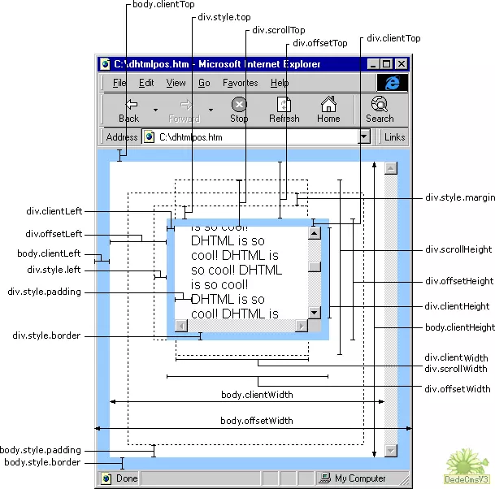

# 浏览器中关于位置的属性总结

---

### 概览

### offset系列

* event.offsetX、event.offsetY

鼠标相对于事件源元素（srcElement）的X，Y坐标。

* div.offsetLeft、div.offsetTop

div.offsetTop 指 div相对于版面或由 offsetParent 属性指定的父坐标的计算上侧位置，整型，单位像素。

div.offsetLeft 指 div相对于版面或由 offsetParent 属性指定的父坐标的计算左侧位置，整型，单位像素。

* div.offsetWidth、div.offsetHeight

div.offsetWidth 指 div自身的绝对宽度，不包括因overflow而未显示的部分，也就是其实际占据的宽度，整型，单位像素。

div.offsetHeight 指 div自身的绝对高度，不包括因overflow而未显示的部分，也就是其实际占据的高度，整型，单位像素。

附：offsetTop与style.top区别

* offsetTop 返回的是数字，而 style.top 返回的是字符串，除了数字外还带有单位：px。
* offsetTop 只读，而 style.top 可读写。
* 如果没有给 HTML 元素指定过 top 样式，则 style.top 返回的是空字符串。

以上规则对offsetLeft 与 style.left、offsetWidth 与 style.width、offsetHeight 与 style.height 也同样适用。

### client系列

* event.clientX、event.clientY

鼠标相对于浏览器窗口可视区域的X，Y坐标（窗口坐标），可视区域不包括工具栏和滚动条。IE事件和标准事件都定义了这2个属性。

* div.clientLeft、div.clientTop

这两个属性返回的是元素周围边框的厚度，如果不指定一个边框或者不定位该元素，它的值就是0。

* div.clientWidth、div.clientHeight

这两个属性大体上显示了元素内容的像素高度和宽度，理论上说这些测量不考虑任何通过样式表加入元素中的页边距，边框等。

### scroll系列

* div.scrollLeft、div.scrollTop

如果元素是可以滚动的，可以通过这两个属性得到元素在水平和垂直方向上滚动的距离，单位是像素。对于不可以滚动的元素，这些值总是0。

* div.scrollWidth、div.scrollHeight

不管有多少对象在页面上可见，他们得到的是整体。

### page系列

* event.pageX、event.pageY

鼠标相对于文档的X，Y坐标，类似于event.clientX、event.clientY，但它们使用的是文档坐标而非窗口坐标，包括窗口自身的控件和滚动条。这2个属性不是标准属性，但得到了广泛支持。IE事件中没有这2个属性。

### screen系列

* event.screenX、event.screenY

鼠标相对于用户显示器屏幕左上角的X，Y坐标。

### 图示

### 不同浏览器支持情况

* scrollTop、scrollLeft 的兼容性处理

~~~javascript
function scroll() {
	return {
		top: document.documentElement.scrollTop || document.body.scrollTop,
		left: document.documentElement.scrollLeft || document.body.scrollLeft
	};
}
~~~

* pageX、pageY 的兼容性处理

~~~javascript
function page(e) {
	return {
		x: e.clientX + scroll().left,
		y: e.clientY + scroll().top
	};
}
~~~

* JQuery 中的兼容性处理

JQuery 的 event 事件对象，包含有 event.offsetX， event.clientX，event.pageX，event.screenX等属性（firefox 浏览器中， offsetX 为 undefined）。firefox 获取 offsetX / offsetY 的值，需要通过 event 对象的属性 originalEvent。

~~~javascript
$("#div").mousedown(function(event) {
	console.log(event.offsetX, event.offsetY);
	console.log(event.clientX, event.clientY);
	console.log(event.pageX, event.pageY);
	console.log(event.screenX, event.screenY);

	/* firefox */
	console.log(event.originalEvent.layerX, event.originalEvent.layerY);
});
~~~

   

---

