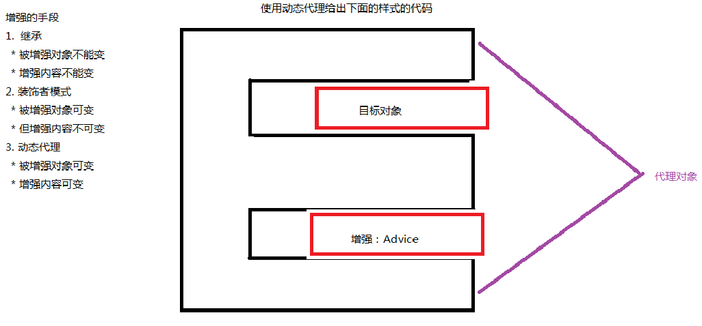
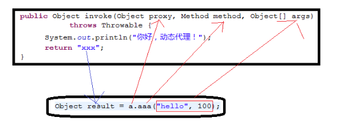
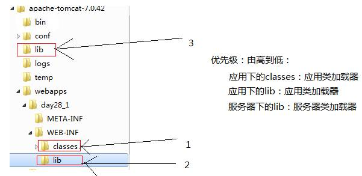

# JavaWeb基础学习笔记-基础提高

---

### Servlet3.0新特性

1、概述

Servlet3.0的主要新特性有如下三部分：

* 使用@WebServlet、@WebFilter、@WebListener三个注解来替代web.xml文件中的Servlet、Filter、Listener的配置；
* Servlet异步处理：当Servlet处理比较费时的问题时，这会让客户感觉到很卡。当使用异步处理时可以把已经处理好的内容先一步响应给客户端浏览器，然后使用另一个线程来完成费时的操作，也就是把内容一部分一部分的显示出来；
* 上传组件：不用再使用fileupload等第三方的上传组件，使用Servlet3.0的上传组件会更方便。

2、@WebServlet、@WebFilter、@WebListener 示例

~~~java
@WebServlet(
	urlPatterns={"/AServlet"}, 
	initParams={@WebInitParam(name="paramName",value="paramValue")},
	loadOnStartup=1
)
public class AServlet extends HttpServlet {
	public void init(ServletConfig config) throws ServletException {
		System.out.println(config.getInitParameter("paramName"));
	}
	public void doGet(HttpServletRequest request, HttpServletResponse response) throws ServletException, IOException {
		request.setCharacterEncoding("utf-8");
		response.setContentType("text/html;charset=utf-8");
		response.getWriter().print("Hello World!");
	}
}
~~~

~~~java
@WebFilter(
	urlPatterns={"/*"}, 
	dispatcherTypes={DispatcherType.REQUEST, DispatcherType.FORWARD}
)
public class AFilter implements Filter {
	public void destroy() {}
	public void doFilter(ServletRequest request, ServletResponse response, FilterChain chain) throws IOException, ServletException {
		System.out.println("start filter");
		chain.doFilter(request, response);
		System.out.println("end filter");
	}
	public void init(FilterConfig fConfig) throws ServletException {}
}
~~~

~~~java
@WebListener()
public class AListener implements ServletContextListener {
	public void contextDestroyed(ServletContextEvent arg0) {
		System.out.println("服务器关闭了");
	}
	public void contextInitialized(ServletContextEvent arg0) {
		System.out.println("服务器启动了");
	}
}
~~~

3、Servlet异步处理

Servlet异步处理就是让Servlet在处理费时的请求时不要阻塞，而是一部分一部分的显示。也就是说，在使用Servlet异步处理之后，页面可以一部分一部分的显示数据，而不是一直卡，等到请求响应结束后一起显示。

在使用异步处理之前，一定要在@WebServlet注解中给出asyncSupported=true，不然默认Servlet是不支持异步处理的。如果存在过滤器，也要设置@WebFilter的asyncSupportedt=true。

~~~java
@WebServlet(urlPatterns = {"/MyServlet"}, asyncSupported=true )
public class MyServlet extends HttpServlet {
	
}
~~~

注意，响应类型必须是text/html，所以：`response.setContentType(“text/html;charset=utf-8”)`;

使用异步处理大致可以分为两步：

* Servlet正常响应数据；
* Servlet异步响应数据；

在Servlet正常响应数据时，没什么可说的，可通知`response.getWriter().print()`来向客户端输出。但输出后要使用`response.getWriter().flush()`刷新，不然数据只是在缓冲区中，不能向客户端发送数据的。

异步响应数据需要使用`request.startAsync()`方法获取AsyncContext对象。然后调用AsyncContext对象的start()方法启动异步响应，start()方法需要一个Runnable类型的参数，在Runnable的run()方法中给出异步响应的代码。

~~~java
AsyncContext ac = request.startAsyncContext(request, response); 
ac.start(new Runnable() {
	public void run() {
		for(char i = 'a'; i <= 'z'; i++) {
			try {
				Thread.sleep(100);
				asyncContext.getResponse().getWriter().print(i + "&nbsp;");
				asyncContext.getResponse().getWriter().flush();
			} catch (Exception e) {
				e.printStackTrace();
			}
		}
		asyncContext.complete();
	}
});
~~~

注意在异步处理线程中使用response做响应后，要使用`response.getWriter().flush()`来刷新流，不然数据是不能响应到客户端浏览器的。

Tomcat需要知道异步响应是否结束，如果响应不结束，虽然客户端浏览器会看到响应的数据，但是鼠标上只是有个圈圈不停的转啊转，表示还没有结束响应。Tomcat会等待到超时为止，这个超时的时间可以通过AsyncContext类的getTimeout()方法获取，Tomcat默认为20000毫秒。当然也可以通过setTimeOut()方法设置，以毫秒为单位，ac.setTimeout(1000*10)。

如果异步线程已经结束了响应，那么可以在异步线程中调用AsyncContext.complete()方法，这样Tomcat就知道异步线程已经完成了工作了。

~~~java
@WebServlet(urlPatterns = {"/AServlet"}, asyncSupported=true)
public class AServlet extends HttpServlet {
	public void doGet(HttpServletRequest request, HttpServletResponse response) throws ServletException, IOException {
		response.setContentType("text/html;charset=utf-8");
		PrintWriter out = response.getWriter();
		out.println("Servlet  begin  "); 
		out.println("Servlet  begin  ");
		out.println("Servlet  begin  ");
		out.println("Servlet  begin  ");
		out.println("Servlet  begin  ");
		out.println("Servlet  begin  ");
		out.println("Servlet  begin  ");
		out.println("Servlet  begin  ");
		out.println("Servlet  begin  ");
		out.println("Servlet  begin  ");
		out.println("Servlet  begin  ");
		out.println("Servlet  begin  ");
		out.println("Servlet  begin  ");
		out.println("Servlet  begin  ");
		out.println("Servlet  begin  ");

		out.flush(); 
		final AsyncContext asyncContext = request.startAsync(request, response); 
		asyncContext.setTimeout(1000 * 20); 
		asyncContext.start (new Runnable() {
			public void run() {
				try {
					Thread.sleep(1000);
					asyncContext.getResponse().getWriter().print("马上开始" + " ");
					asyncContext.getResponse().getWriter().flush();
					Thread.sleep(2000);
				} catch (Exception e1) {
					
				}
				for(char i = 'a'; i <= 'z'; i++) {
					try {
						Thread.sleep(100);
						asyncContext.getResponse().getWriter().print(i + "&nbsp;");
						asyncContext.getResponse().getWriter().flush(); 
					} catch (Exception e) {
						e.printStackTrace();
					}
				}
				asyncContext.complete(); 
			}
		});
		// asyncContext.start(businessHandleThread);
		// 也可以用这种方法启动异步线程
		out.println("Servlet end  ");
	}
}
~~~

> IE如果不能正常输出，这说明响应体大小不足512B，那你需要多输出点东西。

4、文件上传

Servlet3.0提供了文件上传的处理方案，只需要在Servlet上添加@MultipartConfig注解即可。

~~~java
@WebServlet(urlPatterns={"/UploadServlet"})
@MultipartConfig(maxFileSize=1024)
public class UploadServlet extends HttpServlet {}
~~~

当然也可以为@MultipartConfig注解指定属性值，它有四个属性：

* int filesizeThreshold：指定缓存的大小，当超出这个大小后，文件会保存到磁盘上；
* String location：指定临时文件的目录；
* long maxFilesize：指定上传单个文件的大小限制，如果上传的谁的超出了这个大小，那么就会抛出异常；
* long maxRequestSize：指定整个表单的大小限制。

当在Servlet上使用了@MultipartConfig注解后，那么就可以使用request.getPart(“fieldName”)来获取`<input:file>`的内容，其中Part表示一个文件表单项。

~~~jsp
<form action="/a1/UploadServlet" method="post" enctype="multipart/form-data">
	用户名：<input type="text" name="username"/> 
	照　片：<input type="file" name="file1" /> 
	<input type="submit" value="提交"/>
</form>
~~~

~~~java
@WebServlet(urlPatterns={"/UploadServlet"})
@MultipartConfig(maxFileSize=1024 * 1024)
public class UploadServlet extends HttpServlet {
	public void doPost(HttpServletRequest request, HttpServletResponse response) throws ServletException, IOException {
		request.setCharacterEncoding("utf-8");
		response.setContentType("text/html;charset=utf-8");

		String username = request.getParameter("username"); 
		response.getWriter().print("size: " + username + " ");

		Part part = request.getPart("file1") ;
		response.getWriter().print("size: " + part.getSize () + " ");
		response.getWriter().print("type: " + part.getContentType () + " ");
		response.getWriter().print("name: " + part.getName () + " ");

		String name = part.getHeader("content-disposition") ;  
		String fileNameTmp = name.substring(name.indexOf("filename=")+10);  
		String fileName = fileNameTmp.substring(0,fileNameTmp.indexOf("\""));

		System.out.println("fileName: " + fileName);

		String savepath = this.getServletContext().getRealPath("/uploads");
		part.write(savepath + "/" + fileName); 
	}
}
~~~

> Servlet3.0新特性需发布到Tomcat7.0或以上版本。

### 动态代理

1、学习动态代理的目的

动态代理技术都是在框架中使用，例如：Struts1、Struts2、Spring和Hibernate中都使用了动态代理技术。如果你不想自己写个框架，那么你基本上是用不上动态代理技术的。

我们学习动态代理技术的目的是为了更好的理解框架内部的原理，也就是说是为了将来我们学习框架打基础。动态代理技术有点小难度，而且明白了动态代理技术可能一时也想不到适合在什么情况下使用它，这些东西都会在学习框架时渐渐明白。

2、运行时实现指定的接口

想实现某个接口，你需要写一个类，然后在类名字的后面给出“implements”XXX接口，这才是实现某个接口：

~~~java
public interface MyInterface {
	void fun1();
	void fun2();
}

public class MyInterfaceImpl implements MyInterface {
	public void fun1() {
		System.out.println("fun1()");
	}
	public void fun2() {
		System.out.println("fun2()");
	}
}
~~~

上面的代码对我们来说没有什么新鲜感，我们要说的是动态代理技术可以通过一个方法调用就可以生成一个对指定接口的实现类对象。

~~~java
Class[] cs = {MyInterface.class};
MyInterface mi = (MyInterface)Proxy.newProxyInstance(loader, cs, h);
~~~

上面代码中，Proxy类的静态方法newProxyInstance()方法生成了一个对象，这个对象实现了cs数组中指定的接口。没错，返回值mi是MyInterface接口的实现类。你不要问这个类是哪个类，你只需要知道mi是MyInterface接口的实现类就可以了。你现在也不用去管loader和h这两个参数是什么东东，你只需要知道，Proxy类的静态方法newProxyInstance()方法返回的方法是实现了指定接口的实现类对象，甚至你都没有看见实现类的代码。

动态代理就是在运行时生成一个类，这个类会实现你指定的一组接口，而这个类没有.java文件，是在运行时生成的，你也不用去关心它是什么类型的，你只需要知道它实现了哪些接口即可。

目标对象：被增强的对象；
代理对象：需要目标对象，然后在目标对象上添加了增强后的对象；
目标方法：增强的内容；
代理对象 = 目标对象 + 增强；

3、newProxyInstance()方法的参数

Proxy类的newInstance()方法有三个参数：

* ClassLoader loader：它是类加载器类型，你不用去理睬它，你只需要知道怎么可以获得它就可以了：MyInterface.class.getClassLoader()就可以获取到ClassLoader对象。没错，只要你有一个Class对象就可以获取到ClassLoader对象；
* Class[] interfaces：指定newProxyInstance()方法返回的对象要实现哪些接口，没错，可以指定多个接口，例如上面例子我们只指定了一个接口：`Class[] cs = {MyInterface.class}`;
* InvocationHandler h：它是最重要的一个参数，它是一个接口，它的名字叫调用处理器。你想一想，上面例子中mi对象是MyInterface接口的实现类对象，那么它一定是可以调用fun1()和fun2()方法了，难道你不想调用一下fun1()和fun2()方法么，它会执行些什么东东呢？其实无论你调用代理对象的什么方法，它都是在调用InvocationHandler的invoke()方法。

~~~java
public static void main(String[] args) {
	Class[] cs = {MyInterface.class};
	ClassLoader loader = MyInterface.class.getClassLoader();
	InvocationHandler h = new InvocationHandler() {
		public Object invoke(Object proxy, Method method, Object[] args) throws Throwable {
			System.out.println("无论你调用代理对象的什么方法，其实都是在调用invoke()...");
			return null;
		}
	};

	MyInterface mi = (MyInterface)Proxy.newProxyInstance(loader, cs, h);
	mi.fun1();
	mi.fun2();
}
~~~

InvocationHandler接口只有一个方法，即invoke()方法，它是对代理对象所有方法的唯一实现。也就是说，无论你调用代理对象上的哪个方法，其实都是在调用InvocationHandler的invoke()方法。

想象中的类：

~~~java
class X implements MyInterface {
	private InvocationHandler h;
	public X(InvocationHandler h) {
		this.h = h;
	}

	public void fun1() {
		h.invoke();
	}
	public void fun2() {
		h.invoke();
	}
}
~~~

注意，X类是我们用来理解代理对象与InvocationHandler之间的关系的，但它是不存在的类，是我们想象出来的。也就是说，它是用来说明，无论你调用代理对象的哪个方法，最终调用的都是调用处理器的invoke()方法。

4、InvocationHandler的invoke()方法

InvocationHandler的invoke()方法的参数有三个：

* Object proxy：代理对象，也就是Proxy.newProxyInstance()方法返回的对象，通常我们用不上它；
* Method method：表示当前被调用方法的反射对象，例如mi.fun1()，那么method就是fun1()方法的反射对象；
* Object[] args：表示当前被调用方法的参数，当然mi.fun1()这个调用是没有参数的，所以args是一个零长数组。

最后要说的是invoke()方法的返回值为Object类型，它表示当前被调用的方法的返回值，当然mi.fun1()方法是没有返回值的，所以invoke()返回的就必须是null了。

~~~java
public static void main(String[] args) {
	Class[] cs = {MyInterface.class};
	ClassLoader loader = MyInterface.class.getClassLoader();
	InvocationHandler h = new InvocationHandler() {
		public Object invoke(Object proxy, Method method, Object[] args) throws Throwable {
			System.out.println("当前调用的方法是：" + method.getName());
			return null;
		}
	};
	MyInterface mi = (MyInterface)Proxy.newProxyInstance(loader, cs, h);
	mi.fun1();
	mi.fun2();
}
~~~

5、动态代理的用途

动态代理的用途与装饰模式很相似，就是为了对某个对象进行增强，所有使用装饰者模式的案例都可以使用动态代理来替换。下面我们用一个例子来说明动态代理的用途。

我们来写一个Waiter接口，它只有一个serve()方法。MyWaiter是Waiter接口的实现类：

~~~java
public interface Waiter {
	public void serve();
}

public class MyWaiter implements Waiter {
	public void serve() {
		System.out.println("服务...");
	}
}
~~~

现在我们要对MyWaiter对象进行增强，要让它在服务之前以及服务之后添加礼貌用语，即在服务之前说“您好！”，在服务之后说：“很高兴为您服务！”。

~~~java
public class MainApp1 {
	public static void main(String[] args) {
		ClassLoader loader = MainApp1.class.getClassLoader();
		Class[] cs = {Waiter.class};
		Waiter target = new MyWaiter();
		MyInvocationHandler h = new MyInvocationHandler(target);
		Waiter waiter = (Waiter)Proxy.newProxyInstance(loader, cs, h);
		waiter.serve();
	}
}

class MyInvocationHandler implements InvocationHandler {
	public Waiter target;
	public MyInvocationHandler(Waiter target) {
		this.target = target;
	}
	public Object invoke(Object proxy, Method method, Object[] args) throws Throwable {
		System.out.println("您好！");
		Object result = method.invoke(target, args);
		System.out.println("很高兴为您服务！");
		return result;
	}
}
~~~

### 类加载器

1、什么是类加载器

类加载器就是用来加载类的东西。类加载器也是一个类：ClassLoader。类加载器可以被加载到内存，是通过类加载器完成的。Java提供了三种类加载器，分别是：

* bootstrap classloader：引导类加载器，加载rt.jar中的类；
* sun.misc.Launcher$ExtClassLoader：扩展类加载器，加载lib/ext目录下的类；
* sun.misc.Launcher$AppClassLoader：系统类加载器，加载CLASSPATH下的类，即我们写的类，以及第三方提供的类；

通常情况下，Java中所有类都是通过这三个类加载器加载的。类加载器之间存在上下级关系，系统类加载器的上级是扩展类加载器，而扩展类加载器的上级是引导类加载器。

2、JVM眼中的相同的类

在JVM中，不可能存在一个类被加载两次的情况。一个类如果已经被加载了，当再次试图加载这个类时，类加载器会先去查找这个类是否已经被加载过了，如果已经被加载过了，就不会再去加载了。

但是，如果一个类使用不同的类加载器去加载是可以出现多次加载的情况的。也就是说，在JVM眼中，相同的类需要有相同的class文件，以及相同的类加载器。当一个class文件，被不同的类加载器加载了，JVM会认识这是两个不同的类，这会在JVM中出现两个相同的Class对象，甚至会出现类型转换异常。

3、类加载器的代理模式

当系统类加载器去加载一个类时，它首先会让上级去加载，即让扩展类加载器去加载类，扩展类加载器也会让它的上级引导类加载器去加载类。如果上级没有加载成功，那么再由自己去加载。

例如我们自己写的Person类，一定是存放到CLASSPATH中，那么一定是由系统类加载器来加载。当系统类加载器来加载类时，它首先把加载的任务交给扩展类加载去，如果扩展类加载器加载成功了，那么系统类加载器就不会再去加载。这就是代理模式了。

相同的道理，扩展类加载器也会把加载类的任务交给它的“上级”，即引导类加载器，引导类加载器加载成功，那么扩展类加载器也就不会再去加载了。引导类加载器是用C语言写的，是JVM的一部分，它是最上层的类加载器了，所以它就没有“上级了”。它只负责去加载“内部人”，即JDK中的类，但我们知道Person类不是我们自己写的类，所以它加载失败。

当扩展类加载器发现“上级”不能加载类，它就开始加载工作了，它加载的是lib\ext目录下的jar文件，当然，它也会加载失败，所以最终还是由系统类加载器在CLASSPATH中去加载Person，最终由系统类加载器加载到了Person类。

代理模式保证了JDK中的类一定是由引导类加载加载的。这就不会出现多个版本的类，这也是代理模式的好处。

4、自定义类加载器

我们也可以通过继承ClassLoader类来完成自定义类加载器。自定义类加载器的目的一般是为了加载网络上的类，因为这会让class在网络中传输，为了安全，那么class一定是需要加密的，所以需要自定义的类加载器来加载（自定义的类加载器需要做解密工作）。

ClassLoader加载类都是通过loadClass()方法来完成的，loadClass()方法的工作流程如下：

* 调用findLoadedClass ()方法查看该类是否已经被加载过了，如果该没有加载过，那么这个方法返回null；
* 判断findLoadedClass()方法返回的是否为null，如果不是null那么直接返回，这可以避免同一个类被加载两次；
* 如果findLoadedClass()返回的是null，那么就启动代理模式（委托机制），即调用上级的loadClass()方法，获取上级的方法是getParent()，当然上级可能还有上级，这个动作就一直向上走；
* 如果getParent().loadClass()返回的不是null，这说明上级加载成功了，那么就加载结果；
* 如果上级返回的是null，这说明需要自己出手了，这时loadClass()方法会调用本类的findClass()方法来加载类；
* 这说明我们只需要重写ClassLoader的findClass()方法，这就可以了。如果重写了loadClass()方法覆盖了代理模式。

OK，通过上面的分析，我们知道要自定义一个类加载器，只需要继承ClassLoader类，然后重写它的findClass()方法即可。那么在findClass()方法中我们要完成哪些工作呢？

* 找到class文件，把它加载到一个byte[]中；
* 调用defineClass()方法，把byte[]传递给这个方法即可。

~~~java
public class FileSystemClassLoader extends ClassLoader {
	private String classpath ;

	public FileSystemClassLoader() {}

	public FileSystemClassLoader (String classpath) {
		this.classpath = classpath;
	}

	@Override
	public Class<?> findClass(String name) throws ClassNotFoundException {
		try {
			byte[] datas = getClassData(name); 
			if(datas  == null) {
				throw new ClassNotFoundException("类没有找到：" + name);
			}
			return this.defineClass (name, datas, 0, datas.length);
		} catch (IOException e) {
			e.printStackTrace();
			throw new ClassNotFoundException("类找不到：" + name);
		}
	}

	private byte[] getClassData(String name) throws IOException {
		name = name.replace(".", "\\") + ".class";
		File classFile = new File(classpath, name);
		return FileUtils .readFileToByteArray(classFile);
	}
}
~~~

~~~java
ClassLoader loader = new FileSystemClassLoader("F:\\classpath");
Class clazz = loader.loadClass("cn.demo.utils.CommonUtils");
Method method = clazz.getMethod("md5", String.class);
String result = (String) method.invoke(null, "abcde");
System.out.println(result);
~~~

5、Tomcat的类加载器

Tomcat会为每个项目提供一个类加载器，Tomcat提供的类加载器负责加载自己项目下的类，即WEB-INF\lib和WEB-INF\classes下的类。**但Tomcat提供的类加载器不会使用传统的代理模式，而是自己先去加载，如果加载不到，再使用代理模式。Tomcat提供的类加载器有这样一个好处，就是可以使自己项目下的类优先被加载！**

Tomcat提供了两种类加载器：

* 服务器类加载器：${CATALINA_HOME}\lib，服务器类加载器，它负责加载这个下面的类。
* 应用类加载器：${CONTEXT_HOME}\WEB-INF\lib、${CONTEXT_HOME}\WEB-INF\classes，应用类加载器，它负责加载这两个路径下的类。

   

---

