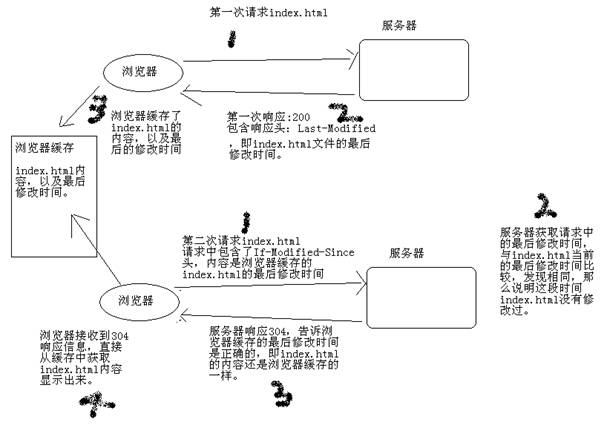

# JavaWeb基础学习笔记-HTTP

---

### HTTP概述

HTTP（Hypertext Transport Protocol），即超文本传输协议。这个协议详细规定了浏览器和万维网服务器之间互相通信的规则。

HTTP就是一个通信规则，通信规则规定了客户端发送给服务器的内容格式，也规定了服务器发送给客户端的内容格式。客户端发送给服务器的格式叫“请求协议”，服务器发送给客户端的格式叫“响应协议”。

### 请求协议

请求协议的格式如下：

~~~plaintext
请求首行；
请求头信息；
空行；
请求体
~~~

浏览器发送给服务器的内容就是这个格式的，如果不是这个格式服务器将无法解读。在HTTP协议中，有很多请求方法，其中最为常用的就是GET和POST。不同的请求方法之间的区别，后面会一点一点地介绍。

1、GET请求

打开IE，在访问hello项目的index.jsp之前打开HttpWatch，并点击“Record”按钮，然后访问index.jsp页面。查看请求内容如下：

~~~plaintext
GET /hello/index.jsp HTTP/1.1 
Host: localhost
User-Agent: Mozilla/5.0 (Windows NT 5.1; rv:5.0) Gecko/20100101 Firefox/5.0
Accept: text/html,application/xhtml+xml,application/xml;q=0.9,*/*;q=0.8
Accept-Language: zh-cn,zh;q=0.5
Accept-Encoding: gzip, deflate
Accept-Charset: GB2312,utf-8;q=0.7,*;q=0.7
Connection: keep-alive
Cookie: JSESSIONID=369766FDF6220F7803433C0B2DE36D98 
~~~

* GET /hello/index.jsp HTTP/1.1：GET请求，请求服务器路径为/hello/index.jsp，协议版本为1.1；
* Host:localhost：请求的主机名为localhost；
* User-Agent: Mozilla/5.0 (Windows NT 5.1; rv:5.0) Gecko/20100101 Firefox/5.0：与浏览器和OS相关的信息。有些网站会显示用户的系统版本和浏览器版本信息，这都是通过获取User-Agent头信息而来的；
* Accept: text/html,application/xhtml+xml,application/xml;q=0.9,*/*;q=0.8：告诉服务器，当前客户端可以接收的文档类型，其实这里包含了`*/*`，就表示什么都可以接收；
* Accept-Language: zh-cn,zh;q=0.5：当前客户端支持的语言，可以在浏览器的工具栏选项中找到语言相关信息；
* Accept-Encoding: gzip, deflate：支持的压缩格式。数据在网络上传递时，可能服务器会把数据压缩后再发送；
* Accept-Charset: GB2312,utf-8;q=0.7,*;q=0.7：客户端支持的编码；
* Connection: keep-alive：客户端支持的链接方式，保持一段时间链接，默认为3000ms；
* Cookie: JSESSIONID=369766FDF6220F7803433C0B2DE36D98：因为不是第一次访问这个地址，所以会在请求中把上一次服务器响应中发送过来的Cookie在请求中一并发送回去；这个Cookie的名字为JSESSIONID。

2、POST请求

在表单提交内容，发送的POST请求：

~~~plaintext
POST /hello/index.jsp HTTP/1.1 
Accept: image/gif, image/jpeg, image/pjpeg, image/pjpeg, application/msword, application/vnd.ms-excel, application/vnd.ms-powerpoint, application/x-ms-application, application/x-ms-xbap, application/vnd.ms-xpsdocument, application/xaml+xml, */*
Referer: http://localhost:8080/hello/index.jsp
Accept-Language: zh-cn,en-US;q=0.5
User-Agent: Mozilla/4.0 (compatible; MSIE 7.0; Windows NT 5.1; Trident/4.0; InfoPath.2; .NET CLR 2.0.50727; .NET CLR 3.0.4506.2152; .NET CLR 3.5.30729)
Content-Type: application/x-www-form-urlencoded
Accept-Encoding: gzip, deflate
Host: localhost:8080
Content-Length: 13
Connection: Keep-Alive
Cache-Control: no-cache
Cookie: JSESSIONID=E365D980343B9307023A1D271CC48E7D
 
keyword=hello 
~~~

POST请求是可以有请求体的，而GET请求不能有请求体。

* Referer: http://localhost:8080/hello/index.jsp： 请求来自哪个页面，例如你在百度上点击链接到了这里，那么Referer是http://www.baidu.com ； 如果你是在浏览器的地址栏中直接输入的地址，那么就没有Referer这个请求头了；
* Content-Type: application/x-www-form-urlencoded：表单的数据类型，说明会使用url格式编码数据；url编码的数据都是以“%”为前缀，后面跟随两位的16进制；
* Content-Length:13：请求体的长度，这里表示13个字节；
* keyword=hello：请求体内容。hello是在表单中输入的数据，keyword是表单字段的名字；

Referer请求头是比较有用的一个请求头，它可以用来做统计工作，也可以用来做防盗链。

* 统计工作：例如公司网站在百度上做了广告，但不知道在百度上做广告对网站的访问量是否有影响，那么可以对每个请求中的Referer进行分析，如果Referer为百度的很多，那么说明用户都是通过百度找到公司网站的。
* 防盗链：公司网站上有一个下载链接，而其他网站盗链了这个地址，例如在网站上的index.html页面中有一个链接，点击即可下载JDK7.0。但有某个人的微博中盗链了这个资源，它也有一个链接指向我们网站的JDK7.0，也就是说登录它的微博，点击链接就可以从我网站上下载JDK7.0，这导致我们网站的广告没有人看，但下载的却是我网站的资源。这时可以使用Referer进行防盗链，在资源被下载之前，我们对Referer进行判断，如果请求来自本网站，那么允许下载，如果非本网站，先跳转到本网站看广告，然后再允许下载。

### 响应协议

响应协议的格式如下：

~~~plaintext
响应首行；
响应头信息；
空行；
响应体
~~~

响应内容是由服务器发送给浏览器的内容，浏览器会根据响应内容来显示。

~~~plaintext
HTTP/1.1 200 OK 
Server: Apache-Coyote/1.1
Content-Type: text/html;charset=UTF-8
Content-Length: 724
Set-Cookie: JSESSIONID=C97E2B4C55553EAB46079A4F263435A4; Path=/hello
Date: Wed, 25 Sep 2012 04:15:03 GMT
  
<!DOCTYPE HTML PUBLIC "-//W3C//DTD HTML 4.01 Transitional//EN">
<html>
  <head>
    <base href="http://localhost:8080/hello/">
    
    <title>My JSP 'index.jsp' starting page</title>
	<meta http-equiv="pragma" content="no-cache">
	<meta http-equiv="cache-control" content="no-cache">
	<meta http-equiv="expires" content="0">    
	<meta http-equiv="keywords" content="keyword1,keyword2,keyword3">
	<meta http-equiv="description" content="This is my page">
	<!--
	<link rel="stylesheet" type="text/css" href="styles.css">
	-->
  </head>
  
  <body>
<form action="" method="post">
  关键字：<input type="text" name="keyword"/>
  <input type="submit" value="提交"/>
</form>
  </body>
</html> 
~~~

* HTTP/1.1 200 OK：响应协议为HTTP1.1，状态码为200，表示请求成功，OK是对状态码的解释；
* Server: Apache-Coyote/1.1：服务器的版本信息；
* Content-Type: text/html;charset=UTF-8：响应体使用的编码为UTF-8；
* Content-Length: 724：响应体为724字节；
* Set-Cookie: JSESSIONID=C97E2B4C55553EAB46079A4F263435A4; Path=/hello：响应给客户端的Cookie；
* Date: Wed, 25 Sep 2012 04:15:03 GMT：响应的时间，这可能会有8小时的时区差；

1、响应码

响应头对浏览器来说很重要，它说明了响应的真正含义。例如200表示响应成功了，302表示重定向，这说明浏览器需要再发一个新的请求。

* 200：请求成功，浏览器会把响应体内容（通常是html）显示在浏览器中；
* 404：请求的资源没有找到，说明客户端错误地请求了不存在的资源；
* 500：请求资源找到了，但服务器内部出现了错误；
* 302：重定向，当响应码为302时，表示服务器要求浏览器重新再发一个请求，服务器会发送一个响应头Location，它指定了新请求的URL地址；
* 304：当用户第一次请求index.html时，服务器会添加一个名为Last-Modified响应头，这个头说明了index.html的最后修改时间，浏览器会把index.html内容，以及最后响应时间缓存下来。当用户第二次请求index.html时，在请求中包含一个名为If-Modified-Since请求头，它的值就是第一次请求时服务器通过Last-Modified响应头发送给浏览器的值，即index.html最后的修改时间，If-Modified-Since请求头就是在告诉服务器，我这里浏览器缓存的index.html最后修改时间是这个，您看看现在的index.html最后修改时间是不是这个，如果还是，那么您就不用再响应这个index.html内容了，我会把缓存的内容直接显示出来。而服务器端会获取If-Modified-Since值，与index.html的当前最后修改时间比对，如果相同，服务器会发响应码304，表示index.html与浏览器上次缓存的相同，无需再次发送，浏览器可以显示自己的缓存页面，如果比对不同，那么说明index.html已经做了修改，服务器会响应200。

响应头： Last-Modified，最后的修改时间；
请求头： If-Modified-Since，把上次请求的index.html的最后修改时间还给服务器；
状态码：304，比较If-Modified-Since的时间与文件真实的时间一样时，服务器会响应304，而且不会有响正文，表示浏览器缓存的就是最新版本。

2、其他响应头

1）告诉浏览器不要缓存的响应头：

* Expires: -1；
* Cache-Control: no-cache；
* Pragma: no-cache；

2）自动刷新响应头，浏览器会在3秒之后请求http://www.baidu.com ；

* Refresh: 3;url=http://www.baidu.com

3、HTML中指定响应头

在HTMl页面中可以使用`<meta http-equiv="" content="">`来指定响应头，例如在index.html页面中给出`<meta http-equiv="Refresh" content="3;url=http://www.baidu.com">`，表示浏览器只会显示index.html页面3秒，然后自动跳转到http://www.baidu.com 。

   

---

