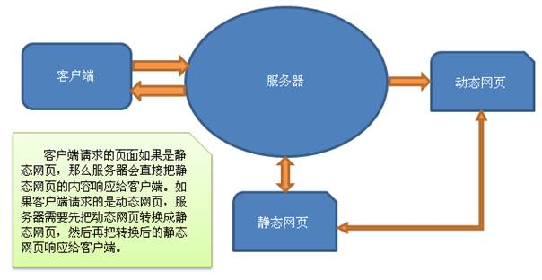
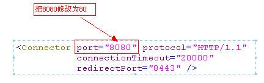
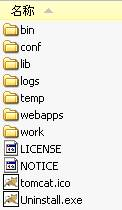

# JavaWeb基础学习笔记-Tomcat

---

### 常见软件系统体系结构C/S与B/S

1、C/S

C/S结构即客户端/服务器（Client/Server）结构，需要编写服务器端程序以及客户端程序，例如QQ，我们安装的就是QQ的客户端程序。

* 缺点：软件更新时需要同时更新客户端和服务器端两端，比较麻烦；
* 优点：安全性比较好。

2、B/S

B/S结构即浏览器/服务器（Browser/Server）结构。

* 优点：只需要编写服务器端程序；
* 缺点：安全性较差。

### WEB资源

1、Web资源介绍

* HTML：静态资源 ；
* JSP/Servlet ：动态资源。

当然，除了JavaWeb程序，还有其他Web程序，例如：ASP、PHP等。

2、静态资源和动态资源的区别

3、访问Web资源

打开浏览器，在地址栏输入URL： `协议名://域名:端口/路径`，例如：http://www.baidu.com:80/index.html 。

### Web服务器

Web服务器的作用是接收客户端的请求，给客户端作出响应。对于JavaWeb程序而言，还需要有JSP/Servlet容器。JSP/Servlet容器的基本功能是把动态资源转换成静态资源，当然JSP/Servlet容器不只有这些功能，我们会在后面一点一点学习。

我们需要使用的是Web服务器和JSP/Servlet容器，通常这两者会集于一身。下面是常见的JavaWeb服务器：

| 名称      | 所属   | 描述                                    |
| --------- | ------ | --------------------------------------- |
| Tomcat    | Apache | 当前应用最广的JavaWeb服务器             |
| JBoss     | Redhat | 支持JavaEE，应用比较广，EJB容器         |
| GlassFish | Oracle | Oracle开发的JavaWeb服务器，应用不是很广 |
| Resin     | Caucho | 支持JavaEE，应用越来越广                |
| Weblogic  | Oracle | 支持JavaEE，适合大型项目                |
| Websphere | IBM    | 支持JavaEE，适合大型项目                |

### Tomcat概述

Tomcat服务器由Apache提供，开源免费。由于Sun和其他公司参与到了Tomcat的开发中，所以最新的JSP/Servlet规范总是能在Tomcat中体现出来。当前最新版本是Tomcat8，在Tomcat7中支持Servlet3.0，而Tomcat6只支持Servlet2.5。

### Tomcat安装配置

1、下载Tomcat

下载Tomcat可以到 http://tomcat.apache.org 下载。Tomcat分为安装版和解压版：

* 安装版：一台电脑上只能安装一个Tomcat；
* 解压版：无需安装，解压即可用，解压多少份都可以，所以我们选择解压版。

2、安装Tomcat

安装版Tomcat的安装过程十分简单。对于解压版，把解压版Tomcat解压到一个没有中文，没有空格的路径中即可，建议路径不要太深，因为我们需要经常进入Tomcat安装目录，例如：`F:\apache-tomcat-7.0.42`。

3、启动和关闭Tomcat

在启动Tomcat之前，我们必须要配置环境变量：

* JAVA_HOME：必须先配置JAVA_HOME，因为Tomcat启动需要使用JDK；
* CATALANA_HOME：如果是安装版，那么还需要配置这个变量，这个变量用来指定Tomcat的安装路径，例如：`F:\apache-tomcat-7.0.42`；

启动：进入%CATALANA_HOME%\bin目录，找到startup.bat ，双击即可；

关闭：进入%CATALANA_HOME%\bin目录，找到shutdown.bat ，双击即可；

startup.bat会调用catalina.bat，而catalina.bat会调用setclasspath.bat，setclasspath.bat会使用JAVA_HOME环境变量，所以我们必须在启动Tomcat之前把JAVA_HOME配置正确。

启动问题：点击startup.bat后窗口一闪即消失？

解决方法：检查JAVA_HOME环境变量配置是否正确；

4、进入Tomcat主页

打开浏览器，访问：http://localhost:8080 ，即可看到Tomcat的主页。

5、配置端口号

打开%CATALANA_HOME%\conf\server.xml文件：

http默认端口号为80，也就是说在URL中不给出端口号时就表示使用80端口。当然你也可以修改为其它端口号。当把端口号修改为80后，在浏览器中只需要输入：http://localhost 就可以访问Tomcat主页了。

### Tomcat目录结构

* bin：该目录下存放的是二进制可执行文件。如果是安装版，那么这个目录下会有两个exe文件：tomcat6.exe、tomcat6w.exe，前者是在控制台下启动Tomcat，后者是弹出GUI窗口启动Tomcat；如果是解压版，那么会有startup.bat和shutdown.bat文件。startup.bat用来启动Tomcat，但需要先配置JAVA_HOME环境变量才能启动，shutdawn.bat用来停止Tomcat；
* conf：这是一个非常重要的目录，这个目录下有四个最为重要的文件：

1）server.xml：配置整个服务器信息。例如修改端口号，添加虚拟主机等；

2）tomcatusers.xml：存储tomcat用户的文件，这里保存的是tomcat的用户名及密码，以及用户的角色信息。可以按照该文件中的注释信息添加tomcat用户，然后就可以在Tomcat主页中进入Tomcat Manager页面了；

3）web.xml：部署描述符文件，这个文件中注册了很多MIME类型，即文档类型。这些MIME类型是客户端与服务器之间说明文档类型的，如用户请求一个html网页，那么服务器还会告诉客户端浏览器响应的文档是text/html类型的，这就是一个MIME类型。客户端浏览器通过这个MIME类型就知道如何处理它了，当然是在浏览器中显示这个html文件了。但如果服务器响应的是一个exe文件，那么浏览器就不可能显示它，而是应该弹出下载窗口才对。MIME就是用来说明文档的内容是什么类型的；

4）context.xml：对所有应用的统一配置；

* lib：Tomcat的类库，里面是一大堆jar文件。如果需要添加Tomcat依赖的jar文件，可以把它放到这个目录中，当然也可以把应用依赖的jar文件放到这个目录中，这个目录中的jar所有项目都可以共享，但这样你的应用放到其他Tomcat下时就不能再共享这个目录下的Jar包了，所以建议只把Tomcat需要的Jar包放到这个目录下；
* logs：这个目录中都是日志文件，记录了Tomcat启动和关闭的信息，如果启动Tomcat时有错误，那么异常也会记录在日志文件中；
* temp：存放Tomcat的临时文件，这个目录下的东西可以在停止Tomcat后删除；
* webapps：存放web项目的目录，其中每个文件夹都是一个项目；如果这个目录下已经存在了目录，那么都是tomcat自带的项目。其中ROOT是一个特殊的项目，在地址栏中没有给出项目目录时，对应的就是ROOT项目。例如，http://localhost:8080/examples ， 进入示例项目，其中examples就是项目名，即文件夹的名字；
* work：运行时生成的文件，最终运行的文件都在这里。通过webapps中的项目生成的。可以把这个目录下的内容删除，再次运行时会再次生成work目录。当客户端用户访问一个JSP文件时，Tomcat会通过JSP生成Java文件，然后再编译Java文件生成class文件，生成的java和class文件都会存放到这个目录下。
* LICENSE：许可证。
* NOTICE：说明文件。

### Web应用

静态网站：

* 在webapps目录下创建一个目录（命名必须不包含中文和空格），这个目录称之为项目目录；
* 在项目目录下创建一个html文件；

动态网站：

* 在webapps目录下创建一个项目目录；
* 在项目目录下创建如下内容：1、创建WEB-INF目录并在WEB-INF目录下创建web.xml文件；2、创建静态或动态页面；

### 配置外部应用

我们的项目放在webapps下，如果放到外面，也希望Tomcat可以找到它，可以把应用放到Tomcat之外，这就是外部应用了。例如我们把上面写的hello应用从webapps目录中剪切到C盘下，即C:/hello。现在hello这个Web应用已经不在Tomcat中了，这时我们需要在Tomcat中配置外部应用的位置，配置的方式一共有两种：

1、打开conf/server.xml文件，找到`<Host>`元素，在其中添加`<Context>`元素，代码如下：

~~~xml
<Host name="localhost" appBase="webapps" unpackWARs="true" autoDeploy="true">
	<Context path="my_hello" docBase="c:/hello" />
</Host>
~~~

* path：指定当前应用的名称；
* docBase：指定应用的物理位置；

浏览器访问路径：http://localhost:8080/my_hello/index.html 。

2、打开conf/catalina/localhost目录，在该目录下创建my_hello.xml文件，在该文件中编写`<Context>`元素，代码如下：

~~~xml
<Context docBase="c:/hello" />
~~~

* 文件名：指定当前应用的名称；
* docBase：指定应用的物理位置；

浏览器访问路径：http://localhost:8080/my_hello/index.html 。

### 映射虚拟主机

我们的目标是，在浏览器中输入：http://www.mydomain.com 就可以访问我们的项目。要完成这一目标，我们需要做三件事：

* 修改端口号为80；
* 在本机上可以解析域名为127.0.0.1，这需要修改C:\WINDOWS\system32\drivers\etc\hosts文件，添加对http://www.mydomain.com 和127.0.0.1的绑定关系；
* 在server.xml文件中添加一个`<Host>`（主机）；

1、打开%CATALANA_HOME%\conf\server.xml文件，修改端口号为80：

~~~xml
<Connector port="80" protocol="HTTP/1.1" connectionTimeout="20000" redirectPort="8443" />
~~~

2、绑定http://www.mydomain.com 和127.0.0.1的关系，打开C:\WINDOWS\system32\drivers\etc\hosts文件，添加以下内容：

~~~plaintext
127.0.0.1  www.mydomain.com
~~~

3、server.xml文件中添加一个`<Host>`：

~~~xml
<Host name="www.mydomain.com" appBase="c:/mywebapps" unpackWARs="true" autoDeploy="true"></Host>
~~~

* name=”www.mydomain.com” ： 指定虚拟主机名为www.mydomain.com ；
* appBase=”c:/mywebapps”：指定当前虚拟主机的应用程序存放目录为c:/mywebapps；

在mywebapps目录下创建名为ROOT的应用，因为一个主机只可以有一个名为ROOT的应用，名为ROOT的应用在浏览器中访问是可以不给出应用名称。这样，本机就可以通过www.mydomain.com 来访问了。

### 理解server.xml

~~~xml
<Server>
	<Service>
		<Connector>
		<Engine>
			<Host>
				<Context>
~~~

* `<Server>`：根元素，表示整个服务器的配置信息；
* `<Service>`：`<Server>`的子元素，在`<Server>`中只能有一个`<Service>`元素，它表示服务；
* `<Connector>`：`<Service>`的子元素，在`<Service>`中可以有N个`<Connector>`元素，它表示连接；
* `<Engine>`：`<Service>`的子元素，在`<Service>`中只能有一`<Engine>`元素，该元素表示引擎，它是`<Service>`组件的核心；
* `<Host>`：`<Engine>`的子元素，在`<Engine>`中可以有N个`<Host>`元素，每个`<Host>`元素表示一个虚拟主机。所谓虚拟主机就像是真的主机一样，每个主机都有自己的主机名和项目目录。例如`<Host name=”localhost” appBase=”webapps”>`表示主机名为localhost，这个主机的项目存放在webapps目录中。访问这个项目下的主机时，需要使用localhost主机名，项目都存放在webapps目录下；
* `<Context>`：`<Host>`元素的子元素，在`<Host>`中可以有N个`<Context>`元素，每个`<Context>`元素表示一个应用。如果应用在`<Host>`的appBase指定的目录下，那么可以不配置`<Context>`元素，如果是外部应用，那么就必须配置`<Context>`。如果要为应用指定资源，也需要配置`<Context>`元素；

我们可以把`<Server>`看作是一个大酒店：

* `<Service>`：酒店的服务部门；
* `<Connector>`：服务员；
* `<Engine>`：后厨；
* `<Host>`：后厨中的一个区，例如川菜区是一个`<Host>`、粤菜区是一个`<Host>`；
* `<Context>`：后厨的一个厨师；

用户发出一个请求：http://localhost:8080/hello/index.jsp 。 发现是http/1.1协议，而且还是8080端口，所以就交给了处理这一请求的“服务员（处理HTTP请求的`<Connector>`）”，“服务员”再把请求交给了“后厨（`<Engine>`）”，因为请求是要一盘水煮鱼，所以由“川菜区（`<Host>`）”负责，因为“大老王师傅（`<Context>`）”做水煮鱼最地道，所以由它完成。

* `<Connector>`：关心请求中的http和8080；
* `<Host>`：关心localhost；
* `<Context>`：关心hello；

   

---

