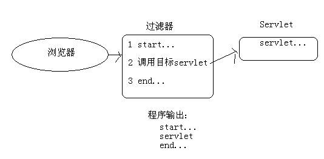
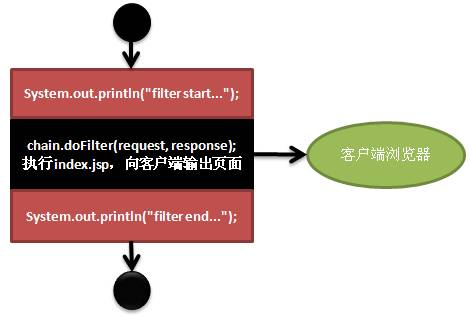
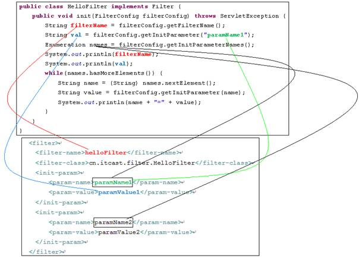
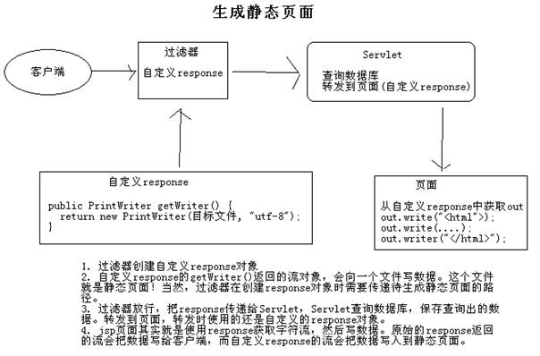

# JavaWeb基础学习笔记-Filter

---

### 概述

1、什么是过滤器

过滤器是JavaWeb三大组件之一，它与Servlet很相似。不过过滤器是用来拦截请求的，而不是处理请求的。

当用户请求某个Servlet时，会先执行部署在这个请求上的Filter。如果Filter“放行”，那么会继续执行用户请求的Servlet；如果Filter不“放行”，那么就不会执行用户请求的Servlet。

其实可以这样理解，当用户请求某个Servlet时，Tomcat会去执行注册在这个请求上的Filter，然后是否“放行”由Filter来决定。可以理解为，Filter来决定是否调用Servlet。当执行完成Servlet的代码后，还会执行Filter后面的代码。

2、过滤器之helloworld

1）其实过滤器与Servlet很相似，写过滤器就是写一个类，实现Filter接口：

~~~java
public class HelloFilter implements Filter {
	public void init(FilterConfig filterConfig) throws ServletException {
		
	}
	public void doFilter(ServletRequest request, ServletResponse response, FilterChain chain) throws IOException, ServletException {
		System.out.println("Hello Filter");
	}
	public void destroy(){
		
	}
}
~~~

2）第二步也与Servlet一样，在web.xml文件中部署Filter：

~~~xml
<filter>
	<filter-name>helloFilter</filter-name>
	<filter-class>cn.seasand.code.filter.HelloFilter</filter-class>
</filter>
<filter-mapping>
	<filter-name>helloFilter</filter-name>
	<url-pattern>/index.jsp </url-pattern>
</filter-mapping>
~~~

当用户访问index.jsp页面时，会执行HelloFilter的doFilter()方法。在示例中，index.jsp页面是不会被执行的，如果想执行index.jsp页面，那么我们需要放行。

~~~java
public void doFilter(ServletRequest request, ServletResponse response, FilterChain chain) throws IOException, ServletException {
	System.out.println("filter start..."); 
	chain.doFilter(request, response); 
	System.out.println("filter end..."); 
}
~~~

有很多人总是错误的认为，一个请求在给客户端输出之后就算是结束了，这是不对的。其实很多事情都需要在给客户端响应之后才能完成。

### 过滤器的生命周期

我们已经学习过Servlet的生命周期，那么Filter的生命周期也就没有什么难度了。

* init(FilterConfig)：在服务器启动时会创建Filter实例，并且每个类型的Filter只创建一个实例，从此不再创建。在创建完Filter实例后，会马上调用init()方法完成初始化工作，这个方法只会被执行一次；
* doFilter(ServletRequest req, ServletResponse res, FilterChain chain)：这个方法会在用户每次访问“目标资源（`<url->pattern>index.jsp</url-pattern>`）”时执行，如果需要“放行”，那么需要调用FilterChain的doFilter(ServletRequest req, ServletResponse res)方法，如果不调用FilterChain的doFilter()方法，那么目标资源将无法执行；
* destroy()：服务器会在创建Filter对象之后，把Filter放到缓存中一直使用，通常不会销毁它。一般会在服务器关闭时销毁Filter对象，在销毁Filter对象之前，服务器会调用Filter对象的destory()方法。

### FilterConfig

你已经看到了吧，Filter接口中的init()方法的参数类型为FilterConfig类型。它的功能与ServletConfig相似，与web.xml文件中的配置信息对应。下面是FilterConfig的功能介绍：

* ServletContext getServletContext()：获取ServletContext的方法；
* String getFilterName()：获取Filter的配置名称；与`<filter-name>`元素对应；
* String getInitParameter(String name)：获取Filter的初始化配置，与`<init-param>`元素对应；
* Enumeration getInitParameterNames()：获取所有初始化参数的名称；

### FilterChain

doFilter()方法的参数中有一个类型为FilterChain的参数，它只有一个方法：doFilter(ServletRequest req, ServletResponse res)。

前面我们说doFilter()方法的放行，让请求流访问目标资源。但这么说不严密，其实调用该方法的意思是，“我（当前Filter）”放行了，但不代表其他人（其他过滤器）也放行。也就是说，一个目标资源上，可能部署了多个过滤器。就好比在你去北京的路上有多个打劫的匪人（过滤器），其中第一伙匪人放行了，但不代表第二伙匪人也放行了。所以调用FilterChain类的doFilter()方法表示的是执行下一个过滤器的doFilter()方法，或者是执行目标资源。

如果当前过滤器是最后一个过滤器，那么调用chain.doFilter()方法表示执行目标资源，如果不是最后一个过滤器，那么chain.doFilter()表示执行下一个过滤器的doFilter()方法。

### 多个过滤器执行顺序

一个目标资源可以指定多个过滤器，过滤器的执行顺序是在web.xml文件中的部署顺序。

~~~java
public class MyFilter1 extends HttpFilter {
	public void doFilter(HttpServletRequest request, HttpServletResponse response, FilterChain chain) throws IOException, ServletException {
		System.out.println("filter1 start...");
		chain.doFilter(request, response);//放行，执行MyFilter2的doFilter()方法
		System.out.println("filter1 end...");
	}
}

public class MyFilter2 extends HttpFilter {
	public void doFilter(HttpServletRequest request, HttpServletResponse response, FilterChain chain) throws IOException, ServletException {
		System.out.println("filter2 start...");
		chain.doFilter(request, response);//放行，执行目标资源
		System.out.println("filter2 end...");
	}
}
~~~

~~~xml
<filter>
	<filter-name>myFilter1 </filter-name>
	<filter-class>cn.demo.filter.MyFilter1</filter-class>
</filter>
<filter-mapping>
	<filter-name>myFilter1</filter-name>
	<url-pattern>/index.jsp</url-pattern>
</filter-mapping>

<filter>
	<filter-name>myFilter2</filter-name>
	<filter-class>cn.demo.filter.MyFilter2</filter-class>
</filter>
<filter-mapping>
	<filter-name>myFilter2</filter-name>
	<url-pattern>/index.jsp</url-pattern>
</filter-mapping>
~~~

~~~jsp
<body>
	This is my JSP page.  
	<h1>index.jsp</h1>
	<% System.out.println("index.jsp"); %>
</body>
~~~

当有用户访问index.jsp页面时，输出结果如下：

~~~plaintext
filter1 start...
filter2 start...
index.jsp
filter2 end...
filter1 end...
~~~

### 四种拦截方式

我们来做个测试，写一个过滤器，指定过滤的资源为b.jsp，然后我们在浏览器中直接访问b.jsp，你会发现过滤器执行了。

但是，当我们在a.jsp中request.getRequestDispathcer(“/b.jsp”).forward(request,response)时，就不会再执行过滤器了。也就是说，默认情况下，只能直接访问目标资源才会执行过滤器，而forward执行目标资源，不会执行过滤器。

~~~java
public class MyFilter extends HttpFilter {
	public void doFilter(HttpServletRequest request, HttpServletResponse response, FilterChain chain) throws IOException, ServletException {
		System.out.println("myfilter...");
		chain.doFilter(request, response);
	}
}	
~~~

~~~xml
<filter>
	<filter-name>myfilter</filter-name>
	<filter-class>cn.demo.filter.MyFilter</filter-class>
</filter>
<filter-mapping>
	<filter-name>myfilter</filter-name>
	<url-pattern>/b.jsp</url-pattern>
</filter-mapping>
~~~

~~~jsp
<body>
	<h1>b.jsp</h1>
</body>
~~~

~~~jsp
<h1>a.jsp</h1>
	<%
		request.getRequestDispatcher("/b.jsp").forward(request, response);
	%>
</body>
~~~

* 直接访问b.jsp时（http://localhost:8080/filtertest/b.jsp ），会执行过滤器内容；
* 访问a.jsp（http://localhost:8080/filtertest/a.jsp） ，但a.jsp会forward到b.jsp，这时就不会执行过滤器；

其实过滤器有四种拦截方式，分别是：REQUEST、FORWARD、INCLUDE、ERROR。

* REQUEST：直接访问目标资源时执行过滤器。包括：在地址栏中直接访问、表单提交、超链接、重定向，只要在地址栏中可以看到目标资源的路径，就是REQUEST；
* FORWARD：转发访问执行过滤器。包括RequestDispatcher#forward()方法、<jsp:forward>标签都是转发访问；
* INCLUDE：包含访问执行过滤器。包括RequestDispatcher#include()方法、<jsp:include>标签都是包含访问；
* ERROR：当目标资源在web.xml中配置为`<error-page>`中时，并且真的出现了异常，转发到目标资源时，会执行过滤器。

可以在`<filter-mapping>`中添加0~n个`<dispatcher>`子元素，来说明当前访问的拦截方式。

~~~xml
<filter-mapping>
	<filter-name>myfilter</filter-name>
	<url-pattern>/b.jsp</url-pattern>
	<dispatcher>REQUEST</dispatcher> 
	<dispatcher>FORWARD</dispatcher> 
</filter-mapping>

<filter-mapping>
	<filter-name>myfilter</filter-name>
	<url-pattern>/b.jsp</url-pattern>
</filter-mapping> 

<filter-mapping>
	<filter-name>myfilter</filter-name>
	<url-pattern>/b.jsp</url-pattern>
	<dispatcher>FORWARD</dispatcher> 
</filter-mapping>
~~~

其实最为常用的就是REQUEST和FORWARD两种拦截方式，而INCLUDE和ERROR都比较少用。其中INCLUDE比较好理解，我们这里不再给出代码，可以通过FORWARD方式修改，来自己测试。而ERROR方式不易理解，下面给出ERROR拦截方式的例子：

~~~xml
<filter-mapping>
	<filter-name>myfilter</filter-name>
	<url-pattern>/b.jsp</url-pattern>
	<dispatcher>ERROR</dispatcher> 
</filter-mapping>
<error-page>
	<error-code>500</error-code>
	<location>/b.jsp</location> 
</error-page>
~~~

~~~jsp
<body>
	<h1>a.jsp</h1>
	<%
	if(true)
		throw new RuntimeException("出错了..."); 
	%>
</body>
~~~

### 过滤器的应用场景

* 执行目标资源之前做预处理工作，例如设置编码，这种通常都会放行，只是在目标资源执行之前做一些准备工作； 
* 通过条件判断是否放行，例如校验当前用户是否已经登录，或者用户IP是否已经被禁用；
* 在目标资源执行后，做一些后续的特殊处理工作，例如把目标资源输出的数据进行处理 ；

### 设置目标资源

在web.xml文件中部署Filter时，可以通过`“*”`来执行目标资源：

~~~xml
<filter-mapping>
	<filter-name>myfilter</filter-name>
	<url-pattern>/*</url-pattern> 
</filter-mapping>
~~~

这一特性与Servlet完全相同。通过这一特性，我们可以在用户访问敏感资源时，执行过滤器，例如：`<url-pattern>/admin/*<url-pattern>`，可以把所有管理员才能访问的资源放到/admin路径下，这时可以通过过滤器来校验用户身份。

还可以为`<filter-mapping>`指定目标资源为某个Servlet，例如：

~~~xml
<servlet>
	<servlet-name>myservlet</servlet-name>
	<servlet-class>cn.demo.servlet.MyServlet</servlet-class>
</servlet>
<servlet-mapping>
	<servlet-name>myservlet</servlet-name>
	<url-pattern>/abc</url-pattern>
</servlet-mapping>
<filter>
	<filter-name>myfilter</filter-name>
	<filter-class>cn.demo.filter.MyFilter</filter-class>
</filter>
<filter-mapping>
	<filter-name>myfilter</filter-name>
	<servlet-name>myservlet</servlet-name> 
</filter-mapping>
~~~

当用户访问http://localhost:8080/filtertest/abc 时，会执行名字为myservlet的Servlet，这时会执行过滤器。

### Filter小结

1、Filter的三个方法：

* void init(FilterConfig)：在Tomcat启动时被调用；
* void destroy()：在Tomcat关闭时被调用；
* void doFilter(ServletRequest,ServletResponse,FilterChain)：每次有请求时都调用该方法；

2、FilterConfig类：与ServletConfig相似，用来获取Filter的初始化参数。

* ServletContext getServletContext()：获取ServletContext的方法；
* String getFilterName()：获取Filter的配置名称； 
* String getInitParameter(String name)：获取Filter的初始化配置，与`<init-param>`元素对应；
* Enumeration getInitParameterNames()：获取所有初始化参数的名称；

3、FilterChain类：

* void doFilter(ServletRequest,ServletResponse)：放行，表示执行下一个过滤器，或者执行目标资源。可以在调用FilterChain的doFilter()方法的前后添加语句，在FilterChain的doFilter()方法之前的语句会在目标资源执行之前执行，在FilterChain的doFilter()方法之后的语句会在目标资源执行之后执行。

4、四各拦截方式：REQUEST、FORWARD、INCLUDE、ERROR，默认是REQUEST方式。

* REQUEST：拦截直接请求方式；
* FORWARD：拦截请求转发方式；
* INCLUDE：拦截请求包含方式；
* ERROR：拦截错误转发方式。

### 案例1：统计每个IP地址的访问次数

因为一个网站可能有多个页面，无论哪个页面被访问，都要统计访问次数，所以使用过滤器最为方便。因为需要分IP统计，所以可以在过滤器中创建一个Map，使用IP为key，访问次数为value。当有用户访问时，获取请求的IP，如果IP在Map中存在，说明以前访问过，那么在访问次数上加1，即可；IP在Map中不存在，那么设置次数为1。把这个Map存放到ServletContext中。

~~~jsp
<body>
	<h1>分IP统计访问次数</h1>
	<table align="center" width="50%" border="1">
		<tr>
			<th>IP地址</th>
			<th>次数</th>
		</tr>
		<c:forEach items="${applicationScope.ipCountMap }" var="entry">
		<tr>
			<td>${entry.key }</td>
			<td>${entry.value }</td>
		</tr>
		</c:forEach>
	</table>
</body>
~~~

~~~java
public class IPFilter implements Filter {
	private ServletContext context;

	public void init(FilterConfig fConfig) throws ServletException {
		context = fConfig.getServletContext(); 
		Map<String, Integer> ipCountMap = Collections.synchronizedMap(new LinkedHashMap<String, Integer>());
		context.setAttribute("ipCountMap", ipCountMap);
	}

	@SuppressWarnings("unchecked")
	public void doFilter(ServletRequest request, ServletResponse response, FilterChain chain) throws IOException, ServletException {
		HttpServletRequest req = (HttpServletRequest) request;
		String ip = req.getRemoteAddr(); 
		Map<String, Integer> ipCountMap = (Map<String, Integer>) context.getAttribute("ipCountMap");
		Integer count = ipCountMap.get(ip); 
		if (count == null) {
			count = 1;
 		} else {
			count += 1; 
		}
		ipCountMap.put(ip, count); 
		context.setAttribute("ipCountMap", ipCountMap); 
		chain.doFilter(request, response); 
	}

	public void destroy(){}
}
~~~

~~~xml
<filter>
	<display-name>IPFilter</display-name>
	<filter-name>IPFilter</filter-name>
	<filter-class>cn.demo.filter.ip.IPFilter</filter-class>
</filter>
<filter-mapping>
	<filter-name>IPFilter</filter-name>
	<url-pattern>/*</url-pattern>
</filter-mapping>
~~~

### 案例2：解决全站字符乱码（POST和GET中文编码问题）

1、乱码问题

1）获取请求参数中的乱码问题：

* POST请求：`request.setCharacterEncoding(“utf-8”)`；
* GET请求：`new String(request.getParameter(“xxx”).getBytes(“iso-8859-1”), “utf-8”)`；

2）响应的乱码问题：`response.setContextType(“text/html;charset=utf-8”)`。

基本上在每个Servlet中都要处理乱码问题，所以应该把这个工作放到过滤器中来完成。

2、分析

其实全站乱码问题的难点就是处理GET请求参数的问题。如果只是处理POST请求的编码问题，以及响应编码问题，那么这个过滤器就太简单了。

~~~java
public class EncodingFilter extends HttpFilter {
	public void doFilter(HttpServletRequest request, HttpServletResponse response, FilterChain chain) throws IOException, ServletException {
		String charset = this.getInitParameter("charset"); 
		if(charset == null || charset.isEmpty()) {
			charset = "UTF-8";
		}
		request.setCharacterEncoding(charset); 
		response.setContentType("text/html;charset=" + charset); 
		chain.doFilter(request, response);
	}
}
~~~

如果是POST请求，当执行目标Servlet时，Servlet中调用request.getParameter()方法时，就会根据request.setCharacterEncoding()设置的编码来转码。这说明在过滤器中调用request.setCharacterEncoding()方法会影响在目标Servlet中的request.getParameter()方法的行为。

但是如果是GET请求，我们又如何能影响request.getParameter()方法的行为呢？这是不好做到的。我们不可能先调用request.getParameter()方法获取参数，然后手动转码后，再施加在到request中。因为request只有getParameter()，而没有setParameter()方法。

处理GET请求参数编码问题，需要在Filter中放行时，把request对象给“调包”了，也就是让目标Servlet使用我们“调包”之后的request对象。这说明我们需要保证“调包”之后的request对象中所有方法都要与“调包”之前一样可以使用，并且getParameter()方法还要有能力返回转码之后的参数。

这可能让你想起了“继承”，但是这里不能用继承，而是“装饰者模式（Decorator Pattern）”。

下面是三种对a对象进行增强的手段：

* 继承：AA类继承a对象的类型A类，然后重写fun1()方法，其中重写的fun1()方法就是被增强的方法。但是，继承必须要知道a对象的真实类型，然后才能去继承。如果我们不知道a对象的确切类型，而只知道a对象是IA接口的实现类对象，那么就无法使用继承来增强a对象了；
* 装饰者模式：AA类去实现a对象相同的接口IA接口，还需要给AA类传递a对象，然后在AA类中所有的方法实现都是通过代理a对象的相同方法完成的，只有fun1()方法在代理a对象相同方法的前后添加了一些内容，这就是对fun1()方法进行了增强；
* 动态代理：动态代理与装饰者模式比较相似，而且是通过反射来完成的。

对request对象进行增强的条件，刚好符合装饰者模式的特点。因为我们不知道request对象的具体类型，但我们知道request是HttpServletRequest接口的实现类。这说明我们写一个类EncodingRequest，去实现HttpServletRequest接口，然后再把原来的request传递给EncodingRequest类。在EncodingRequest中对HttpServletRequest接口中的所有方法的实现都是通过代理原来的request对象来完成的，只有对getParameter()方法添加了增强代码。

JavaEE已经给我们提供了一个HttpServletRequestWrapper类，它就是HttpServletRequest的包装类，但它没有做任何的增强。你可能会说，写一个装饰类，但不做增强，其目的是什么呢？使用这个装饰类的对象，和使用原有的request有什么分别呢？

HttpServletRequestWrapper类虽然是HttpServletRequest的装饰类，但它不是用来直接使用的，而是用来让我们去继承的。当我们想写一个装饰类时，还要对所有不需要增强的方法做一次实现是很心烦的事情，但如果你去继承HttpServletRequestWrapper类，那么就只需要重写需要增强的方法即可了。

~~~java
public class EncodingRequest extends HttpServletRequestWrapper {
	private String charset;
	public EncodingRequest(HttpServletRequest request, String charset) {
		super(request);
		this.charset = charset;
	}
	public String getParameter (String name) {
		HttpServletRequest request  = (HttpServletRequest) getRequest();
		String method = request.getMethod() ;
		if(method.equalsIgnoreCase("post")) {
			try {
				request.setCharacterEncoding(charset); 
			} catch (UnsupportedEncodingException e) {
				
			}
		} else if(method.equalsIgnoreCase("get")) {
			String value = request.getParameter(name); 
			try {
				value = new String(name.getBytes("ISO-8859-1"), charset); 
			} catch (UnsupportedEncodingException e) {
				
			}
			return value;
		}
		return request.getParameter(name);
	}
}
~~~

~~~java
public class EncodingFilter extends HttpFilter {
	public void doFilter(HttpServletRequest request, HttpServletResponse response, FilterChain chain) throws IOException, ServletException {
		String charset = this.getInitParameter("charset"); 
		if(charset == null || charset.isEmpty()) {
			charset = "UTF-8";
		} 
		response.setCharacterEncoding(charset);
		response.setContentType("text/html;charset=" + charset);
		EncodingRequest req = new EncodingRequest(request, charset); 
		chain.doFilter(req, response); 
	}
}
~~~

~~~xml
<filter>
	<filter-name>EncodingFilter</filter-name>
	<filter-class>cn.demo.filter.EncodingFilter</filter-class>
	<init-param>
		<param-name>charset</param-name>
		<param-value>UTF-8</param-value>
	</init-param>
</filter>
<filter-mapping>
	<filter-name>EncodingFilter</filter-name>
	<url-pattern>/*</url-pattern>
</filter-mapping>
~~~

### 案例3：页面静态化

你到“当当”搜索最多的是什么分类？没错，就是Java分类。你猜猜，你去搜索Java分类时，“当当”会不会去查询数据库呢？当然会了，不查询数据库怎么获取Java分类下的图书呢。其实每天都有很多人去搜索“Java分类”的图书，每次都去访问数据库，这会有性能上的缺失。如果是在访问静态页面（HTML）那么就会快的多了。静态页面本身就比动态页面快很多倍，而且动态页面总是要去数据库查询，这会更加降低速度。

页面静态化是把动态页面生成的html保存到服务器的文件上，然后再有相同请求时，不再去执行动态页面，而是直接给用户响应上次已经生成的静态页面。而且静态页面还有助与搜索引擎找到你。

1、分析

我们的目标是在用户第一次访问页面时生成静态页面，然后让请求重定向到静态页面上去。当用户再次访问时，直接重定向到静态页面上去。

我们需要为不同的请求生成静态页面，例如用户访问BookServlet?category=1时，我们要生成静态页面，当用户访问BookServlet?category=2时，也要生成静态页面。即不同的参数生成不同的静态页面。我们可以使用category为key，静态页面的路径为value，保存到一个Map中，然后再把Map保存到ServletContext中。没有对应的静态页面时，我们生成静态页面，再重定向到静态页面，如果存在静态页面，那么直接重定向即可。

~~~java
public class StaticResponse extends HttpServletResponseWrapper {
	private PrintWriter pw;
	public StaticResponse(HttpServletResponse response, String filepath) throws FileNotFoundException, UnsupportedEncodingException {
		super(response);
		pw = new PrintWriter(filepath, "UTF-8"); 
	}
	public PrintWriter getWriter() throws IOException {
		return pw;
	}
	public void close() throws IOException {
		pw.close(); 
	}
}
~~~

~~~java
public class StaticFilter implements Filter {
	private ServletContext sc;
	public void destroy() {}
	public void doFilter(ServletRequest request, ServletResponse response, FilterChain chain) throws IOException, ServletException {
		HttpServletRequest req = (HttpServletRequest) request;
		HttpServletResponse res = (HttpServletResponse) response;
		String key = "key_" + request.getParameter("category"); 
		Map<String,String> map = (Map<String, String>) sc.getAttribute("pages"); 
		if(map == null) {
			map = new HashMap<String,String>();
			sc.setAttribute("pages", map);
		} 
		if(map.containsKey(key)) {
			res.sendRedirect(req.getContextPath() + "/staticPages/" + map.get(key));
			return;
		} 
		String html = key + ".html"; 
		String realPath = sc.getRealPath("/staticPages/" + html); 
		StaticResponse sr = new StaticResponse(res, realPath); 
		chain.doFilter(request, sr); 
		sr.close(); 
		res.sendRedirect(req.getContextPath() + "/staticPages/" + html); 
		map.put(key, html); 
	}
	public void init(FilterConfig fConfig) throws ServletException {
		this.sc = fConfig.getServletContext();
	}
}
~~~

   

---

