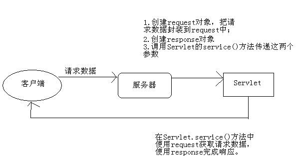
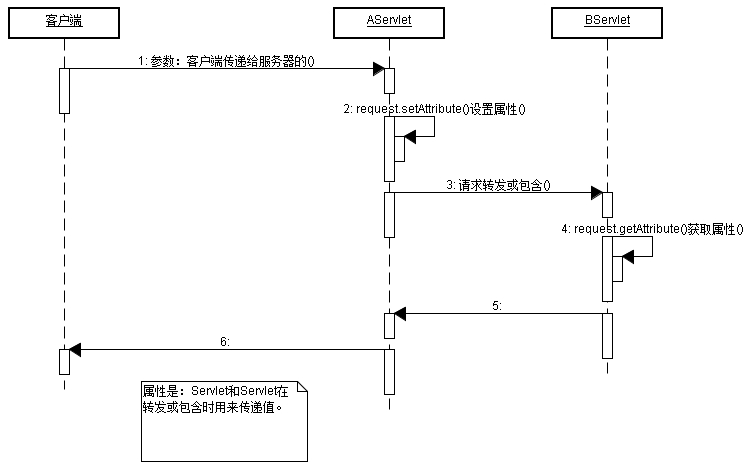
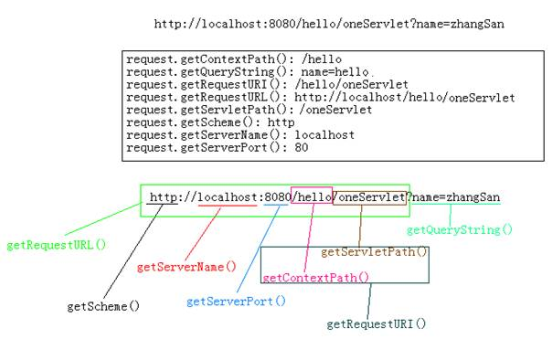
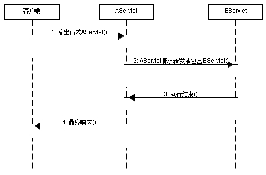
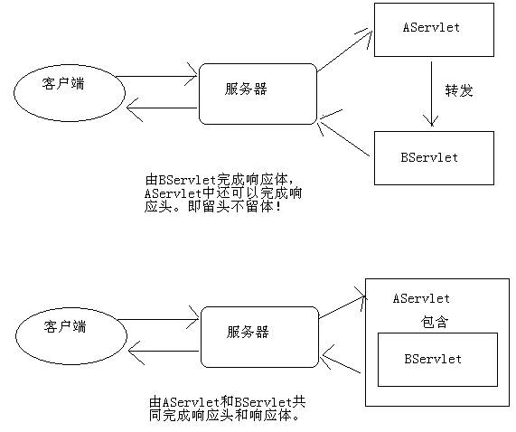
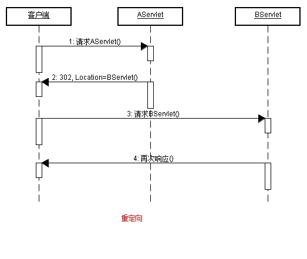
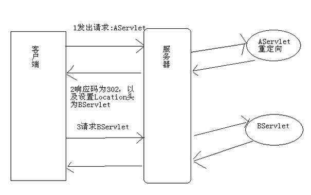

# JavaWeb基础学习笔记-Request和Response

---

### 请求响应流程图

### Request

1、Request概述

Request是`Servlet.service()`方法的一个参数，类型为`javax.servlet.http.HttpServletRequest`。在客户端发出每个请求时，服务器都会创建一个request对象，并把请求数据封装到request中，然后再调用`Servlet.service()`方法时传递给`service()`方法，这说明在`service()`方法中可以通过request对象来获取请求数据。Request的功能可以分为以下几种：

* 封装了请求头数据；
* 封装了请求正文数据，如果是GET请求，那么就没有正文；
* request是一个域对象，可以把它当成Map来添加获取数据；
* request提供了请求转发和请求包含功能。

2、Request域方法

Request是域对象。在JavaWeb中一共四个域对象，其中ServletContext就是域对象，它在整个应用中只创建一个ServletContext对象。Request也是其中一个，Request可以在一个请求中共享数据。
一个请求会创建一个request对象，如果在一个请求中经历了多个Servlet，那么多个Servlet就可以使用request来共享数据。下面是Request的域方法：

* void setAttribute(String name, Object value)：用来存储一个对象，也可以称之为存储一个域属性。例如：`servletContext.setAttribute(“xxx”, “XXX”)`，在request中保存了一个域属性，域属性名称为xxx，域属性的值为XXX。请注意，如果多次调用该方法，并且使用相同的name，那么会覆盖上一次的值，这一特性与Map相同；
* Object getAttribute(String name)：用来获取request中的数据，当前在获取之前需要先去存储才行，例如：`String value = (String)request.getAttribute(“xxx”);`，获取名为xxx的域属性；
* void removeAttribute(String name)：用来移除request中的域属性，如果参数name指定的域属性不存在，那么本方法什么都不做；
* Enumeration getAttributeNames()：获取所有域属性的名称；

3、Request获取请求头数据

Request与请求头相关的方法有：

* String getHeader(String name)：获取指定名称的请求头；
* Enumeration getHeaderNames()：获取所有请求头名称；
* int getIntHeader(String name)：获取值为int类型的请求头。

4、Request获取请求相关的其它方法

Request中还提供了与请求相关的其他方法，有些方法是为了我们更加便捷的方法请求头数据而设计，有些是与请求URL相关的方法。

* int getContentLength()：获取请求体的字节数，GET请求没有请求体，没有请求体返回-1；
* String getContentType()：获取请求类型，如果请求是GET，那么这个方法返回null；如果是POST请求，那么默认为`application/x-www-form-urlencoded`，表示请求体内容使用了URL编码；
* String getMethod()：返回请求方法，例如：GET；
* Locale getLocale()：返回当前客户端浏览器的Locale。java.util.Locale表示国家和言语，这个东西在国际化中很有用；
* String getCharacterEncoding()：获取请求编码，如果没有setCharacterEncoding()，那么返回null，表示使用ISO-8859-1编码；
* void setCharacterEncoding(String code)：设置请求编码，只对请求体有效。注意，对于GET而言，没有请求体，所以此方法只能对POST请求中的参数有效。
* String getContextPath()：返回上下文路径，例如：/hello；
* String getQueryString()：返回请求URL中的参数，例如：name=zhangSan；
* String getRequestURI()：返回请求URI路径，例如：/hello/oneServlet；
* StringBuffer getRequestURL()：返回请求URL路径，例如：http://localhost/hello/oneServlet ， 即返回除了参数以外的路径信息；
* String getServletPath()：返回Servlet路径，例如：/oneServlet；
* String getRemoteAddr()：返回当前客户端的IP地址；
* String getRemoteHost()：返回当前客户端的主机名，但这个方法的实现还是获取IP地址；
* String getScheme()：返回请求协议，例如：http；
* String getServerName()：返回主机名，例如：localhost；
* int getServerPort()：返回服务器端口号，例如：8080；

~~~java
System.out.println("request.getContentLength(): " + request.getContentLength());
System.out.println("request.getContentType(): " + request.getContentType());
System.out.println("request.getContextPath(): " + request.getContextPath());
System.out.println("request.getMethod(): " + request.getMethod());
System.out.println("request.getLocale(): " + request.getLocale());
System.out.println("request.getQueryString(): " + request.getQueryString());
System.out.println("request.getRequestURI(): " + request.getRequestURI());
System.out.println("request.getRequestURL(): " + request.getRequestURL());
System.out.println("request.getServletPath(): " + request.getServletPath());
System.out.println("request.getRemoteAddr(): " + request.getRemoteAddr());
System.out.println("request.getRemoteHost(): " + request.getRemoteHost());
System.out.println("request.getRemotePort(): " + request.getRemotePort());
System.out.println("request.getScheme(): " + request.getScheme());
System.out.println("request.getServerName(): " + request.getServerName());
System.out.println("request.getServerPort(): " + request.getServerPort());
~~~

5、Request获取请求参数

1）最为常见的客户端传递参数方式有两种：

* 浏览器地址栏直接输入：一定是GET请求；
* 超链接：一定是GET请求；
* 表单：可以是GET，也可以是POST，这取决于`<form>`的`method`属性值；

2）GET请求和POST请求的区别：

GET请求：

* 请求参数会在浏览器的地址栏中显示，所以不安全；
* 请求参数长度限制长度在1K之内；
* GET请求没有请求体，无法通过`request.setCharacterEncoding()`来设置参数的编码；

POST请求：

* 请求参数不会显示浏览器的地址栏，相对安全；
* 请求参数长度没有限制；

3）下面是使用Request获取请求参数的API：

* String getParameter(String name)：通过指定名称获取参数值；

~~~java
public void doGet(HttpServletRequest request, HttpServletResponse response) throws ServletException, IOException {
	String v1 = request.getParameter("p1");
	String v2 = request.getParameter("p2");
	System.out.println("p1=" + v1);
	System.out.println("p2=" + v2);
}

public void doPost(HttpServletRequest request, HttpServletResponse response) throws ServletException, IOException {
	String v1 = request.getParameter("p1");
	String v2 = request.getParameter("p2");
	System.out.println("p1=" + v1);
	System.out.println("p2=" + v2);		
}
~~~

* String[] getParameterValues(String name)：当多个参数名称相同时，可以使用方法来获取；

~~~java
public void doGet(HttpServletRequest request, HttpServletResponse response) throws ServletException, IOException {
	String[] names = request.getParameterValues("name"); 
	System.out.println(Arrays.toString(names)); 
}
~~~

* Enumeration getParameterNames()：获取所有参数的名字；

~~~java
public void doPost(HttpServletRequest request, HttpServletResponse response) throws ServletException, IOException {
	Enumeration names = request.getParameterNames() ;
	while(names.hasMoreElements()) {
		System.out.println(names.nextElement());
	}
}
~~~

* Map getParameterMap()：获取所有参数封装到Map中，其中key为参数名，value为参数值，因为一个参数名称可能有多个值，所以参数值是String[]，而不是String。

~~~java
Map<String,String[]> paramMap = request.getParameterMap();
for(String name : paramMap.keySet()) {
	String[] values = paramMap.get(name);
	System.out.println(name + ": " + Arrays.toString(values));
}
~~~

6、请求转发和请求包含

无论是请求转发还是请求包含，都表示由多个Servlet共同来处理一个请求。例如Servlet1来处理请求，然后Servlet1又转发给Servlet2来继续处理这个请求。

1）请求转发

在AServlet中，把请求转发到BServlet：

~~~java
public class AServlet extends HttpServlet {
	public void doGet(HttpServletRequest request, HttpServletResponse response) throws ServletException, IOException {
		System.out.println("AServlet");
		RequestDispatcher rd = request.getRequestDispatcher("/BServlet"); 
		rd.forward(request, response) ;
	}
}

public class BServlet extends HttpServlet {
	public void doGet(HttpServletRequest request, HttpServletResponse response) throws ServletException, IOException {
		System.out.println("BServlet");
	}
}
~~~

2）请求包含

在AServlet中，把请求包含到BServlet：

~~~java
public class AServlet extends HttpServlet {
	public void doGet(HttpServletRequest request, HttpServletResponse response) throws ServletException, IOException {
		System.out.println("AServlet");
		RequestDispatcher rd = request.getRequestDispatcher("/BServlet");
		rd.include (request, response);
	}
}

public class BServlet extends HttpServlet {
	public void doGet(HttpServletRequest request, HttpServletResponse response) throws ServletException, IOException {
		System.out.println("BServlet");
	}
}
~~~

3）请求转发与请求包含比较

* 如果在AServlet中请求转发到BServlet，那么在AServlet中就不允许再输出响应体，即不能再使用`response.getWriter()`和`response.getOutputStream()`向客户端输出，这一工作应该由BServlet来完成；如果是使用请求包含，那么没有这个限制；
* 请求转发虽然不能输出响应体，但还是可以设置响应头的，例如：`response.setContentType(”text/html;charset=utf-8”)`;
* 请求包含大多是应用在JSP页面中，完成多页面的合并；
* 请求转发大多是应用在Servlet中，转发目标大多是JSP页面；

> 简言之，请求转发是留头不留体，请求包含是留头又留体。（请求头、请求体）

4）请求转发与重定向比较

* 请求转发是一个请求，而重定向是两个请求；
* 请求转发后浏览器地址栏不会有变化，而重定向会有变化，因为重定向是两个请求；
* 请求转发的目标只能是本应用中的资源，重定向的目标可以是其他应用；
* 请求转发对AServlet和BServlet的请求方法是相同的，即要么都是GET，要么都是POST，因为请求转发是一个请求；重定向的第二个请求一定是GET；

### Response

1、Response概述

Response是`Servlet.service`方法的一个参数，类型为`javax.servlet.http.HttpServletResponse`。在客户端发出每个请求时，服务器都会创建一个response对象，并传入给`Servlet.service()`方法。response对象是用来对客户端进行响应的，这说明在`service()`方法中使用response对象可以完成对客户端的响应工作。Response对象的功能分为以下四种：

* 设置响应头信息；
* 发送状态码；
* 设置响应正文；
* 重定向；

2、Response响应正文

Response是响应对象，向客户端输出响应正文（响应体）可以使用response的响应流。Repsonse一共提供了两个响应流对象：

* `PrintWriter out = response.getWriter()`：获取字符流；
* `ServletOutputStream out = response.getOutputStream()`：获取字节流；

当然，如果响应正文内容为字符，那么使用response.getWriter()，如果响应内容是字节，例如下载时，那么可以使用response.getOutputStream()。

> 注意，在一个请求中，不能同时使用这两个流。也就是说，要么你使用repsonse.getWriter()，要么使用response.getOutputStream()，但不能同时使用这两个流，不然会抛出IllegalStateException异常。

1）字符响应流

* 字符编码

在使用response.getWriter()时需要注意默认字符编码为ISO-8859-1，如果希望设置字符流的字符编码为utf-8，可以使用`response.setCharaceterEncoding(“utf-8”)`来设置，这样可以保证输出给客户端的字符都是使用UTF-8编码的。

但客户端浏览器并不知道响应数据是什么编码的。如果希望通知客户端使用UTF-8来解读响应数据，那么还是使用`response.setContentType("text/html;charset=utf-8")`方法比较好，因为这个方法不只会调用`response.setCharaceterEncoding(“utf-8”)`，还会设置content-type响应头，客户端浏览器会使用content-type头来解读响应数据。

* 缓冲区

response.getWriter()是PrintWriter类型，所以它有缓冲区，缓冲区的默认大小为8KB。也就是说，在响应数据没有输出8KB之前，数据都是存放在缓冲区中，而不会立刻发送到客户端。当Servlet执行结束后，服务器才会去刷新流，使缓冲区中的数据发送到客户端。如果希望响应数据马上发送给客户端：

* 向流中写入大于8KB的数据；
* 调用response.flushBuffer()方法来手动刷新缓冲区；

3、设置响应头信息

可以使用response对象的setHeader()方法来设置响应头，使用该方法设置的响应头最终会发送给客户端浏览器。

* response.setHeader(“content-type”, “text/html;charset=utf-8”)：设置content-type响应头，该头的作用是告诉浏览器响应内容为html类型，编码为utf-8，而且同时会设置response的字符流编码为utf-8，即response.setCharaceterEncoding(“utf-8”)；
* response.setHeader("Refresh","5; URL=http://www.baidu.com")：5秒后自动跳转到百度主页。

4、设置状态码及其他方法

* response.setContentType("text/html;charset=utf-8")：等同与调用`response.setHeader(“content-type”, “text/html;charset=utf-8”)`；
* response.setCharacterEncoding(“utf-8”)：设置字符响应流的字符编码为utf-8； 
* response.setStatus(200)：设置状态码；
* response.sendError(404, “您要查找的资源不存在”)：当发送错误状态码时，Tomcat会跳转到固定的错误页面去，但可以显示错误信息。

5、重定向

1）什么是重定向

当你访问http://www.sun.com 时，你会发现浏览器地址栏中的URL会变成http://www.oracle.com/us/sun/index.htm ，这就是重定向了。重定向是服务器通知浏览器去访问另一个地址，即再发出另一个请求。

2）完成重定向

响应码为200表示响应成功，而响应码为302表示重定向，所以完成重定向的第一步就是设置响应码为302。因为重定向是通知浏览器再发起第二个请求，所以浏览器需要知道第二个请求的URL，所以完成重定向的第二步是设置Location头，指定第二个请求的URL地址。

~~~java
public class AServlet extends HttpServlet {
	public void doGet(HttpServletRequest request, HttpServletResponse response) throws ServletException, IOException {
		response.setStatus(302); 
		response.setHeader("Location", "http://www.baidu.com"); 
	}
}
~~~

上面代码的作用是：当访问AServlet后，会通知浏览器重定向到百度主页。客户端浏览器解析到响应码为302后，就知道服务器让它重定向，所以它会马上获取响应头Location，然发出第二个请求。

3）便捷的重定向方式

~~~java
public class AServlet extends HttpServlet {
	public void doGet(HttpServletRequest request, HttpServletResponse response) throws ServletException, IOException {
		response.sendRedirect("http://www.baidu.com");
	}
}
~~~

response.sendRedirect()方法会设置响应头为302，以设置Location响应头。如果要重定向的URL是在同一个服务器内，那么可以使用相对路径，例如：

~~~java
public class AServlet extends HttpServlet {
	public void doGet(HttpServletRequest request, HttpServletResponse response) throws ServletException, IOException {
		response.sendRedirect("/demo/BServlet");
	}
}
~~~

重定向的URL地址为：http://localhost:8080/demo/BServlet 。

4）重定向小结

* 重定向是两次请求；
* 重定向的URL可以是其他应用，不局限于当前应用；
* 重定向的响应头为302，并且必须要有Location响应头；
* 重定向就不要再使用`response.getWriter()`或`response.getOutputStream()`输出数据，不然可能会出现异常；

   

---

