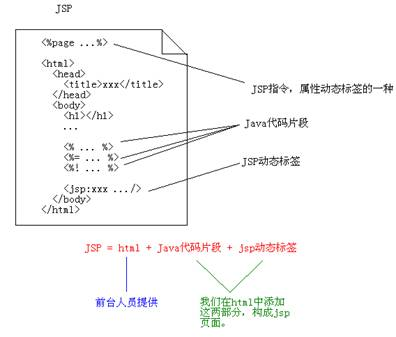
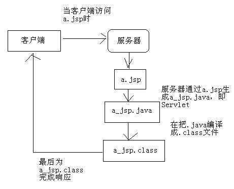
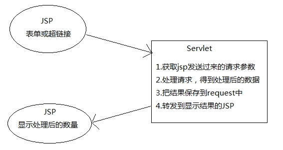
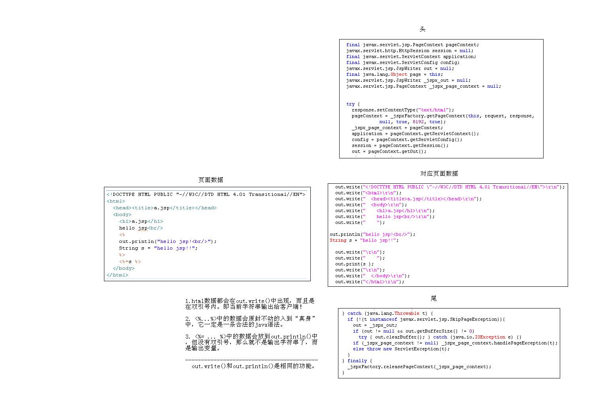
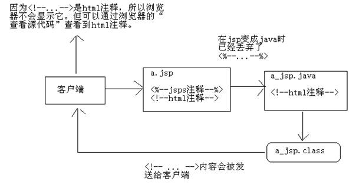
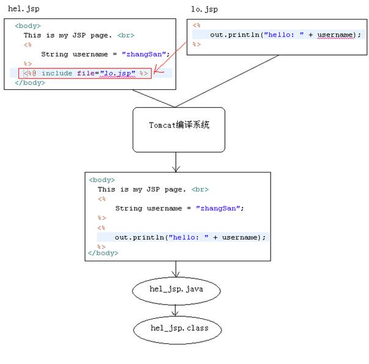
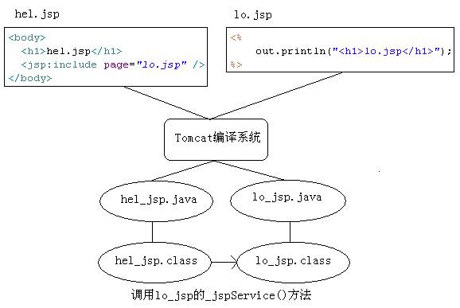

# JavaWeb基础学习笔记-JSP

---

### JSP概述

1、什么是JSP

JSP（Java Server Pages）是JavaWeb服务器端的动态资源。它与HTML页面的作用是相同的，显示数据和获取数据。

2、JSP的组成

JSP = HTML + Java脚本（代码片段） + JSP动态标签

### JSP语法

1、JSP脚本

JSP脚本就是Java代码片段，它分为三种：

* `<%...%>`：Java语句；
* `<%=…%>`：Java表达式；
* `<%!...%>`：Java定义类成员；

~~~xml
<%@ page language="java" import="java.util.*" pageEncoding="UTF-8"%>
<!DOCTYPE HTML PUBLIC "-//W3C//DTD HTML 4.01 Transitional//EN">
<html>
<head><title>JSP演示</title></head>
<body>
	<h1>JSP演示</h1>
	<%
		// Java语句
		String s1 = "hello jsp";
		// 不会输出到客户端，而是在服务器端的控制台打印
		System.out.println(s1);
	%>
	<!-- 输出到客户端浏览器上 -->
	输出变量：<%=s1 %> 
	输出int类型常量：<%=100 %> 
	输出String类型常量：<%="你好" %> 
	 
	使用表达式输出常量是很傻的一件事，因为可以直接使用html，下面是输出上面的常量：
	 
	100 
	你好 
</body>
</html>
~~~

2、内置对象out

out对象在JSP页面中无需创建就可以使用，它的作用是用来向客户端输出。

~~~xml
<body>
	<h1>out.jsp</h1>
	<%
		//向客户端输出
		out.print("你好！");
	%>
</body>
~~~

其中`<%=…%>`与`out.print()`功能是相同的，它们都是向客户端输出，例如：`<%=s1%>`等同于`<% out.print(s1); %>` ；`<%=”hello”%>`等同于`<% out.print(“hello”); %>`，也等同于直接在页面中写hello一样。

3、多个`<%...%>`可以通用

在一个JSP中多个`<%...%>`是相通的。例如：

~~~xml
<body>
	<h1>out.jsp</h1>
	<%
		String s = "hello";
	%>
	<%
		out.print(s);
	%>
</body>
~~~

循环打印表格：

~~~xml
<body>
	<h1>表格</h1>
	<table border="1" width="50%">
		<tr>
			<th>序号</th>
			<th>用户名</th>
			<th>密码</th>
		</tr>
	<%
		for(int i = 0; i < 10; i++) {	
	%>
		<tr>
			<td><%=i+1 %></td>
			<td>user<%=i %></td>
			<td><%=100 + 1 %></td>
		</tr>
	<%
		}
	%>
	</table>
</body>
~~~

### JSP的原理

1、JSP是特殊的Servlet

JSP是一种特殊的Servlet，当JSP页面首次被访问时，容器（Tomcat）会先把JSP编译成Servlet，然后再去执行Servlet，所以JSP其实就是一个Servlet。

JSP和Servlet的分工：

2、JSP存放目录

JSP生成的Servlet存放在`${CATALANA}/work`目录下，它是JSP的“真身”。我们打开看看其中的内容，了解一下JSP的“真身”。你会发现，在JSP中的静态信息（例如`<html>`等）在“真身”中都是使用`out.write()`完成打印，这些静态信息都是作为字符串输出给了客户端。JSP的整篇内容都会放到名为`_jspService`的方法中。你可能会说`<@page>`不在“真身”中，`<@page>`我们明天再讲。

a_jsp.java的_jspService()方法：

~~~java
public void _jspService(final javax.servlet.http.HttpServletRequest request , final javax.servlet.http.HttpServletResponse response) throws java.io.IOException, javax.servlet.ServletException {

	final javax.servlet.jsp.PageContext pageContext;
	javax.servlet.http.HttpSession session = null;
	final javax.servlet.ServletContext application;
	final javax.servlet.ServletConfig config;
	javax.servlet.jsp.JspWriter out = null;
	final java.lang.Object page = this;
	javax.servlet.jsp.JspWriter _jspx_out = null;
	javax.servlet.jsp.PageContext _jspx_page_context = null;

	try {
		response.setContentType("text/html;charset=UTF-8");
		pageContext = _jspxFactory.getPageContext(this, request, response, null, true, 8192, true);
		_jspx_page_context = pageContext;
		application = pageContext.getServletContext();
		config = pageContext.getServletConfig();
		session = pageContext.getSession();
		out = pageContext.getOut();
		_jspx_out = out;
		//… 
	} catch(Exception e) {
		
	}
}
~~~

### JSP脚本

JSP脚本一共三种形式：

* `<%...%>`：内容会直接放到“真身”中；
* `<%=…%>`：内容会放到out.print()中，作为out.print()的参数；
* `<%!…%>`：内容会放到_jspService()方法之外，被类直接包含；

前面已经讲解了`<%...%>`和`<%=…%>`，但还没有讲解`<%!...%>`的作用。现在我们已经知道了，JSP其实就是一个类，一个Servlet类。`<%!...%>`的作用是在类中添加方法或成员的，所以`<%!...%>`中的内容不会出现在_jspService()中。

~~~jsp
<%!
	private String name;
	public String hello() {
		return "hello JSP!";
	}
%>
~~~

### JSP注释

我们现在已经知道JSP是需要先编译成`.java`，再编译成`.class`的。其中`<%-- ... --%>`中的内容在JSP编译成`.java`时会被忽略的，即JSP注释。

也可以在JSP页面中使用HTML注释：`<!-- … -->`，但这个注释在JSP编译成的`.java`中是存在的，它不会被忽略，而且会被发送到客户端浏览器。但是在浏览器显示服务器发送过来的HTML时，因为`<!-- … -->`是HTML的注释，所以浏览器是不会显示它的。

### JSP指令

1、概述

JSP指令的格式：`<%@指令名 attr1="" attr2="" %>`。一般都会把JSP指令放到JSP文件的最上方，但这不是必须的。JSP中有三大指令：page、include、taglib。最为常用，也最为复杂的就是page指令了。

2、page指令

page指令是最为常用的指令，也是属性最多的指令。page指令没有必须属性，都是可选属性，例如`<%@page %>`，没有给出任何属性也是可以的。在JSP页面中，任何指令都可以重复出现。例如
`<%@ page language=”java”%>`、`<%@ page import=”java.util.*”%>`、`<%@ page pageEncoding=”utf-8”%>` 这也是可以的。

1）page指令的pageEncoding和contentType

pageEncoding指定当前JSP页面的编码。这个编码是给服务器看的，服务器需要知道当前JSP使用的编码，不然服务器无法正确把JSP编译成java文件。所以这个编码只需要与真实的页面编码一致即可。在MyEclipse中，在JSP文件上点击右键，选择属性就可以看到当前JSP页面的编码了。

contentType属性与response.setContentType()方法的作用相同。它会完成两项工作，一是设置响应字符流的编码，二是设置content-type响应头。例如：`<%@ contentType=”text/html;charset=utf-8”%>`，它会使“真身”中出现`response.setContentType(“text/html;charset=utf-8”)`。

无论是page指令的pageEncoding还是contentType，它们的默认值都是ISO-8859-1。我们知道ISO-8859-1是无法显示中文的，所以JSP页面中存在中文的话，一定要设置这两个属性。

其实pageEncoding和contentType这两个属性的关系很“暧昧”：

* 当设置了pageEncoding，而没有设置contentType时： contentType的默认值为pageEncoding；
* 当设置了contentType，而没有设置pageEncoding时： pageEncoding的默认值与contentType；

也就是说，当pageEncoding和contentType只出现一个时，那么另一个的值与出现的值相同。如果两个都不出现，那么两个属性的值都是ISO-8859-1。所以通常我们至少设置它们两个中的其中一个。

2） page指令的import属性

import是page指令中一个很特别的属性，import属性值对应“真身”中的import语句。import属性值可以使逗号：`<%@page import=”java.net.*,java.util.*,java.sql.*”%>`。

import属性是唯一可以重复出现的属性：
`<%@page import=”java.util.*” import=”java.net.*” import=”java.sql.*”%>`。

但是，我们一般会使用多个page指令来导入多个包：
`<%@ page import=”java.util.*”%>`、`<%@ page import=”java.net.*”%>`、`<%@ page import=”java.text.*”%>`。

3）page指令的errorPage和isErrorPage

我们知道，在一个JSP页面出错后，Tomcat会响应给用户错误信息（500页面）。如果你不希望Tomcat给用户输出错误信息，那么可以使用page指令的errorPage来指定错误页，也就是自定义错误页面。例如：`<%@page errorPage=”xxx.jsp”%>`，这时，在当前JSP页面出现错误时，会请求转发到xxx.jsp页面。

~~~jsp
<%@ page import="java.util.*" pageEncoding="UTF-8"%>
<%@ page errorPage="b.jsp" %>
<%
	if(true)
		throw new Exception("出错了...");
%>
~~~

~~~jsp
<%@ page pageEncoding="UTF-8"%>
<html>
<body>
	<h1>出错啦！</h1>
</body>
</html>
~~~

在上面代码中，a.jsp抛出异常后，会请求转发到b.jsp。在浏览器的地址栏中还是a.jsp，因为是请求转发。而且客户端浏览器收到的响应码为200，表示请求成功。如果希望客户端得到500，那么需要指定b.jsp为错误页面。

~~~jsp
<%@ page language="java" import="java.util.*" pageEncoding="UTF-8"%>
<%@ page isErrorPage="true" %>
<html>
<body>
	<h1>出错啦！</h1>
	<%=exception.getMessage() %>
</body>
</html>
~~~

注意，当isErrorPage为true时，说明当前JSP为错误页面，即专门处理错误的页面。那么这个页面中就可以使用一个内置对象exception了。其他页面是不能使用这个内置对象的。

> 温馨提示：IE会在状态码为500时，并且响应正文的长度小于等于512B时不给予显示，而是显示“网站无法显示该页面”字样。这时你只需要添加一些响应内容即可，例如上例中的b.jsp中给出一些内容，IE就可以正常显示了。

web.xml中配置错误页面：

不只可以通过JSP的page指令来配置错误页面，还可以在web.xml文件中指定错误页面。这种方式其实与page指令无关，但想来想去还是在这个位置来讲解比较合适。

~~~xml
<error-page>
	<error-code>404</error-code>
	<location>/error404.jsp</location>
</error-page>
<error-page>
	<error-code>500</error-code>
	<location>/error500.jsp</location>
</error-page>
<error-page>
	<exception-type>java.lang.RuntimeException</exception-type>
	<location>/error.jsp</location>
</error-page> 
~~~

`<error-page>`有两种使用方式：

* `<error-code>`和`<location>`子元素；
* `<exception-type>`和`<location>`子元素；

其中`<error-code>`是指定响应码；`<location>`指定转发的页面；`<exception-type>`是指定抛出的异常类型。在上例中：

* 当出现404时，会跳转到error404.jsp页面；
* 当出现RuntimeException异常时，会跳转到error.jsp页面；
* 当出现非RuntimeException的异常时，会跳转到error500.jsp页面。

这种方式会在控制台看到异常信息，而使用page指令时不会在控制台打印异常信息。

4）page指令的autoFlush和buffer

buffer表示当前JSP的输出流（out隐藏对象）的缓冲区大小，默认为8kb。autoFlush表示在out对象的缓冲区满时如何处理，当autoFlush为true时，表示缓冲区满时把缓冲区数据输出到客户端；当autoFlush为false时，表示缓冲区满时，抛出异常。autoFlush的默认值为true。

5）page指令的isELIgnored

page指令的isELIgnored属性表示当前JSP页面是否忽略EL表达式，默认值为false，表示不忽略（即支持）。

6）page指令的其他属性

* language：只能是Java，这个属性可以看出JSP最初设计时的野心，希望JSP可以转换成其他语言。但是，到现在JSP也只能转换成Java代码；
* info：JSP说明性信息；
* isThreadSafe：默认为false。为true时，JSP生成的Servlet会去实现一个过时的标记接口SingleThreadModel，这时JSP就只能处理单线程的访问；
* session：默认为true，表示当前JSP页面可以使用session对象，如果为false表示当前JSP页面不能使用session对象；
* extends：指定当前JSP页面生成的Servlet的父类；

7）`<jsp-config>`

在web.xml页面中配置`<jsp-config>`也可以完成很多page指定的功能。

~~~xml
<jsp-config>
	<jsp-property-group>
		<url-pattern>*.jsp</url-pattern> 
		<el-ignored>true</el-ignored> 
		<page-encoding>UTF-8</page-encoding> 
		<scripting-invalid>true</scripting-invalid> 
	</jsp-property-group>
</jsp-config>
~~~

3、include指令

include指令表示静态包含，目的是把多个JSP合并成一个JSP文件。include指令只有一个属性：file，指定要包含的页面，例如：`<%@include file=”b.jsp”%>`。

静态包含：当hel.jsp页面包含了lo.jsp页面后，在编译hel.jsp页面时，需要把hel.jsp和lo.jsp页面合并成一个文件，然后再编译成Servlet（Java文件）。

很明显，在ol.jsp中在使用username变量，而这个变量在hel.jsp中定义的，所以只有这两个JSP文件合并后才能使用，通过include指令完成对它们的合并。

4、taglib指令

在JSP页面中使用第三方的标签库时，需要使用taglib指令来“导包”，例如：`<%@ taglib prefix="c" uri="http://java.sun.com/jsp/jstl/core" %>`。其中prefix表示标签的前缀，这个名称可以随便起。uri是由第三方标签库定义的，所以你需要知道第三方定义的uri。

### JSP九大内置对象

1、什么是JSP九大内置对象

在JSP中无需创建就可以使用的9个对象，它们是：

* out（JspWriter）：等同于response.getWriter()，用来向客户端发送文本数据；
* config（ServletConfig）：对应“真身”中的ServletConfig；
* page（当前JSP的真身类型）：当前JSP页面的“this”，即当前对象；
* pageContext（PageContext）：页面上下文对象，它是一个域对象；
* exception（Throwable）：只有在错误页面中可以使用这个对象；
* request（HttpServletRequest）：即HttpServletRequest类的对象；
* response（HttpServletResponse）：即HttpServletResponse类的对象；
* application（ServletContext）：即ServletContext类的对象；
* session（HttpSession）：即HttpSession类的对象，不是每个JSP页面中都可以使用，如果在某个JSP页面中设置<%@page session=”false”%>，说明这个页面不能使用session。

在这9个对象中有很多是极少会被使用的，例如：config、page、exception基本不会使用。有两个对象不是每个JSP页面都可以使用的：exception、session。

2、通过“真身”来对照JSP

我们知道JSP页面的内容出现在“真身”的_jspService()方法中，而在_jspService()方法开头部分已经创建了9大内置对象。

~~~java
public void _jspService(HttpServletRequest request, HttpServletResponse response) throws java.io.IOException, ServletException {

	PageContext pageContext = null; 
	HttpSession session = null; 
	ServletContext application = null; 
	ServletConfig config = null; 
	JspWriter out = null; 
	Object page = this; 
	JspWriter _jspx_out = null;
	PageContext _jspx_page_context = null;

	try {
		response.setContentType("text/html;charset=UTF-8");
		pageContext = _jspxFactory.getPageContext(this, request, response, null, true, 8192, true);
		_jspx_page_context = pageContext;
		application = pageContext.getServletContext();
		config = pageContext.getServletConfig();
		session = pageContext.getSession();
		out = pageContext.getOut();
		_jspx_out = out;

		//从这里开始，才是JSP页面的内容 
	}
}
~~~

3、pageContext对象

在JavaWeb中一共四个域对象，其中Servlet中可以使用的是request、session、application三个对象。而在JSP中可以使用pageContext、request、session、application四个域对象。

pageContext 对象是PageContext类型，它的主要功能有：

* 域对象功能；
* 代理其它域对象功能；
* 获取其他内置对象；

1）域对象功能

pageContext也是域对象，它的范围是当前页面。它的范围也是四个域对象中最小的。

* void setAttribute(String name, Object value)；
* Object getAttrbiute(String name, Object value)；
* void removeAttribute(String name, Object value)；

2）代理其它域对象功能

还可以使用pageContext来代理其它3个域对象的功能，也就是说可以使用pageContext向request、session、application对象中存取数据，例如：

~~~java
pageContext.setAttribute("x", "X"); 
pageContext.setAttribute("x", "XX", PageContext.REQUEST_SCOPE); 
pageContext.setAttribute("x", "XXX", PageContext.SESSION_SCOPE); 
pageContext.setAttribute("x", "XXXX", PageContext.APPLICATION_SCOPE); 
~~~

* void setAttribute(String name, Object value, int scope)：在指定范围中添加数据；
* Object getAttribute(String name, int scope)：获取指定范围的数据；
* void removeAttribute(String name, int scope)：移除指定范围的数据；
* Object findAttribute(String name)：依次在page、request、session、application范围查找名称为name的数据，如果找到就停止查找。这说明在这个范围内有相同名称的数据，那么page范围的优先级最高。

3）获取其他内置对象

一个pageContext对象等于所有内置对象，即1个顶9个。这是因为可以使用pageContext对象获取其它8个内置对象：

* JspWriter getOut()：获取out内置对象；
* ServletConfig getServletConfig()：获取config内置对象；
* Object getPage()：获取page内置对象；
* ServletRequest getRequest()：获取request内置对象；
* ServletResponse getResponse()：获取response内置对象；
* HttpSession getSession()：获取session内置对象；
* ServletContext getServletContext()：获取application内置对象；
* Exception getException()：获取exception内置对象；

### JSP动作标签

1、概述

动作标签的作用是用来简化Java脚本的。JSP动作标签是JavaWeb内置的动作标签，它们是已经定义好的动作标签，我们可以拿来直接使用。

如果JSP动作标签不够用时，还可以使用自定义标签。JavaWeb一共提供了20个JSP动作标签，但有很多基本没有用，这里只介绍一部分动作标签。

JSP动作标签的格式：`<jsp:标签名 …>`。

2、`<jsp:include>`

`<jsp:include>`标签的作用是用来包含其它JSP页面的。你可能会说，前面已经学习了include指令了，它们是否相同呢？虽然它们都是用来包含其它JSP页面的，但它们的实现的级别是不同的。

include指令是在编译级别完成的包含，即把当前JSP和被包含的JSP合并成一个JSP，然后再编译成一个Servlet。include动作标签是在运行级别完成的包含，即当前JSP和被包含的JSP都会各自生成Servlet，然后在执行当前JSP的Servlet时完成包含另一个JSP的Servlet。它与RequestDispatcher的include()方法是相同的。

hel.jsp

~~~jsp
<body>
	<h1>hel.jsp</h1>
	<jsp:include page="lo.jsp" />
</body>
~~~

lo.jsp

~~~jsp
<%
	out.println("<h1>lo.jsp</h1>");
%>
~~~

其实`<jsp:include>`在“真身”中不过是一句方法调用，即调用另一个Servlet而已。

3、`<jsp:forward>`

forward标签的作用是请求转发，forward标签的作用与RequestDispatcher#forward()方法相同。

hel.jsp

~~~jsp
<body>
	<h1>hel.jsp</h1>
	<jsp:forward page="lo.jsp" />
</body>
~~~

lo.jsp

~~~jsp
<%
	out.println("<h1>lo.jsp</h1>");
%>
~~~

注意，最后客户端只能看到lo.jsp的输出，而看不到hel.jsp的内容。也就是说在hel.jsp中的`<h1>hel.jsp</h1>`是不会发送到客户端的。`<jsp:forward>`的作用是“别在显示我，去显示它吧！”。

4、`<jsp:param>`

还可以在`<jsp:include>`和`<jsp:forward>`标签中使用`<jsp:param>`子标签，它是用来传递参数的。下面用`<jsp:include>`来举例说明`<jsp:param>`的使用。

a.jsp

~~~jsp
<%@ page language="java" import="java.util.*" pageEncoding="UTF-8"%>
<!DOCTYPE HTML PUBLIC "-//W3C//DTD HTML 4.01 Transitional//EN">
<html>
<head><title>a.jsp</title></head>
<body>
	<h1>a.jsp</h1>
	

	<jsp:include page="/b.jsp">
		<jsp:param value="zhangSan" name="username"/> 
	</jsp:include>
</body>
</html>
~~~

b.jsp

~~~jsp
<%@ page language="java" import="java.util.*" pageEncoding="UTF-8"%>
<!DOCTYPE HTML PUBLIC "-//W3C//DTD HTML 4.01 Transitional//EN">
<html>
<head><title>b.jsp</title></head>
<body>
	<h1>b.jsp</h1>
	

	<%
		String username = request.getParameter("username"); 
		out.print("你好：" + username);
	%>
</body>
</html>
~~~

### JavaBean

1、概述

1）什么是JavaBean

JavaBean是一种规范，也就是对类的要求。它要求Java类的成员变量提供getter/setter方法，这样的成员变量被称之为JavaBean属性。JavaBean还要求类必须提供仅有的无参构造器，例如：`public User() {…}`。

~~~java
package cn.seasand.code.domain;
public class User {
	private String username;
	private String password;
	public String getUsername() {
		return username;
	}
	public void setUsername(String username) {
		this.username = username;
	}
	public String getPassword() {
		return password;
	}
	public void setPassword(String password) {
		this.password = password;
	}
}
~~~

2）JavaBean属性

JavaBean属性是具有getter/setter方法的成员变量。

* 也可以只提供getter方法，这样的属性叫只读属性；
* 也可以只提供setter方法，这样的属性叫只写属性；
* 如果属性类型为boolean类型，那么读方法的格式可以是get或is。例如名为abc的boolean类型的属性，它的读方法可以是getAbc()，也可以是isAbc()；

JavaBean属性名要求：前两个字母要么都大写，要么都小写：

~~~java
public class User {
	private String iD; //错误
	private String ID;
	private String qQ; //错误
	private String QQ;
}
~~~

JavaBean可能存在属性，但不存在这个成员变量，例如：

~~~java
public class User {
	public String getUsername() {
		return "zhangSan";
	}
}
~~~

上例中User类有一个名为username的只读属性，但User类并没有username这个成员变量。还可以并变态一点：

~~~java
public class User {
	private String hello;
	public String getUsername() {
		return hello;
	}
	public void setUsername(String username) {
		this.hello = username;
	}
}
~~~

上例中User类中有一个名为username的属性，它是可读可写的属性，而User类的成员变量名为hello。也就是说JavaBean的属性名取决于方法名称，而不是成员变量的名称。

2、内省

内省的目标是得到JavaBean属性的读、写方法的反射对象，通过反射对JavaBean属性进行操作的一组API。例如User类有名为username的JavaBean属性，通过两个Method对象（一个是getUsenrmae()，一个是setUsername()）来操作User对象。

如果你还不能理解内省是什么，那么我们通过一个问题来了解内省的作用。现在我们有一个Map，内容如下：

~~~java
Map<String, String> map = new HashMap<String, String>();
map.put("username", "admin");
map.put("password", "admin123");
~~~

~~~java
public class User {
	private String username;
	private String password;
	public User(String username, String password) {
		this.username = username;
		this.password = password;
	}
	public User() {
	}
	public String getUsername() {
		return username;
	}
	public void setUsername(String username) {
		this.username = username;
	}
	public String getPassword() {
		return password;
	}
	public void setPassword(String password) {
		this.password = password;
	}
	public String toString() {
		return "User [username=" + username + ", password=" + password + "]";
	}
}
~~~

现在需要把map的数据封装到一个User对象中。User类有两个JavaBean属性，一个叫username，另一个叫password。

你可能想到的是反射，通过map的key来查找User类的Field。这么做是没有问题的，但我们要知道类的成员变量是私有的，虽然也可以通过反射去访问类的私有的成员变量，但我们也要清楚反射访问私有的东西是有“危险”的，所以还是建议通过getUsername和setUsername来访问JavaBean属性。

1）内省之获取BeanInfo

我们这里不想去对JavaBean规范做过多的介绍，所以也就不再过多介绍BeanInfo的“出身”了。你只需要知道如何得到它，以及BeanInfo有什么。通过`java.beans.Introspector`的getBeanInfo()方法来获取`java.beans.BeanInfo`实例。

~~~java
BeanInfo beanInfo = Introspector.getBeanInfo(User.class);
~~~

2）得到所有属性描述符（PropertyDescriptor）

通过BeanInfo可以得到这个类的所有JavaBean属性的PropertyDescriptor对象，然后就可以通过PropertyDescriptor对象得到这个属性的getter/setter方法的Method对象了。

~~~java
PropertyDescriptor[] pds = beanInfo.getPropertyDescriptors();
~~~

每个PropertyDescriptor对象对应一个JavaBean属性：

* String getName()：获取JavaBean属性名称；
* Method getReadMethod：获取属性的读方法；
* Method getWriteMethod：获取属性的写方法。

3）完成Map数据封装到User对象中

~~~java
public void fun1() throws Exception {
	Map<String,String> map = new HashMap<String,String>();
	map.put("username", "admin");
	map.put("password", "admin123");

	BeanInfo beanInfo = Introspector.getBeanInfo(User.class);
	PropertyDescriptor[] pds = beanInfo.getPropertyDescriptors();
	User user = new User();
	for(PropertyDescriptor pd : pds) {
		String name = pd.getName();
		String value = map.get(name);
		if(value != null) {
			Method writeMethod = pd.getWriteMethod();
			writeMethod.invoke(user, value);
		}
	}
	System.out.println(user);
}
~~~

3、commons-beanutils

提到内省，不能不提commons-beanutils这个工具。它底层使用了内省，对内省进行了大量的简化。使用beanutils需要的jar包：

* commons-beanutils.jar；
* commons-logging.jar；

1）设置JavaBean属性

~~~java
User user = new User();
BeanUtils.setProperty(user, "username", "admin"); 
BeanUtils.setProperty(user, "password", "admin123"); 
System.out.println(user);
~~~

2）获取JavaBean属性

~~~java
User user = new User("admin", "admin123");
String username = BeanUtils.getProperty(user, "username"); 
String password = BeanUtils.getProperty(user, "password"); 
System.out.println("username=" + username + ", password=" + password);
~~~

3）封装Map数据到JavaBean对象中

~~~java
Map<String,String> map = new HashMap<String,String>();
map.put("username", "admin");
map.put("password", "admin123");

User user = new User();
BeanUtils.populate(user, map); 
System.out.println(user);
~~~

4、JSP与JavaBean相关的动作标签

在JSP中与JavaBean相关的标签有：

* `<jsp:useBean>`：创建JavaBean对象；
* `<jsp:setProperty>`：设置JavaBean属性；
* `<jsp:getProperty>`：获取JavaBean属性；

我们需要先创建一个JavaBean类：

~~~java
package cn.seasand.code.domain;
public class User {
	private String username;
	private String password;
	public User(String username, String password) {
		this.username = username;
		this.password = password;
	}
	public User() {
	}
	public String getUsername() {
		return username;
	}
	public void setUsername(String username) {
		this.username = username;
	}
	public String getPassword() {
		return password;
	}
	public void setPassword(String password) {
		this.password = password;
	}
	public String toString() {
		return "User [username=" + username + ", password=" + password + "]";
	}
}
~~~

1）`<jsp:useBean>`

`<jsp:useBean>`标签的作用是创建JavaBean对象：

* 在当前JSP页面创建JavaBean对象；
* 把创建的JavaBean对象保存到域对象中；

~~~jsp
<jsp:useBean id="user1" class="cn.seasand.code.domain.User" />
~~~

上面代码表示在当前JSP页面中创建User类型的对象，并且把它保存到page域中了。下面我们把`<jsp:useBean>`标签翻译成Java代码：

~~~jsp
<%
	cn.seasand.code.domain.User user1 = new cn.seasand.code.domain.User();
	pageContext.setAttribute("user1", user1);
%>
~~~

这说明我们可以在JSP页面中完成下面的操作：

~~~jsp
<jsp:useBean id="user1" class="cn.seasand.code.domain.User" />
<%=user1 %>
<%
	out.println(pageContext.getAttribute("user1"));
%>
~~~

`<jsp:useBean>`标签默认是把JavaBean对象保存到page域，还可以通过scope标签属性来指定保存的范围：

~~~jsp
<jsp:useBean id="user1" class="cn.seasand.code.domain.User" scope="page"/>
<jsp:useBean id="user2" class="cn.seasand.code.domain.User" scope="request"/>
<jsp:useBean id="user3" class="cn.seasand.code.domain.User" scope="session"/>
<jsp:useBean id="user4" class="cn.seasand.code.domain.User" scope="applicatioin"/>
~~~

`<jsp:useBean>`标签其实不一定会创建对象。其实它会先在指定范围中查找这个对象，如果对象不存在才会创建，我们需要重新对它进行翻译：

~~~jsp
<jsp:useBean id="user4" class="cn.seasand.code.domain.User" scope="applicatioin"/>
<%-- 等价于 --%>
<%
	cn.seasand.code.domain.User user4 = (cn.seasand.code.domain.User)application.getAttribute("user4");
	if(user4 == null) {
		user4 = new cn.seasand.code.domain.User();
		application.setAttribute("user4", user4);
	}
%>
~~~

2）`<jsp:setProperty>`和`<jsp:getProperty>`

`<jsp:setProperty>`标签的作用是给JavaBean设置属性值，而`<jsp:getProperty>`是用来获取属性值。在使用它们之前需要先创建JavaBean：

~~~jsp
<jsp:useBean id="user1" class="cn.seasand.code.domain.User" />
<jsp:setProperty property="username" name="user1" value="admin"/>
<jsp:setProperty property="password" name="user1" value="admin123"/>

用户名：<jsp:getProperty property="username" name="user1"/> 
密　码：<jsp:getProperty property="password" name="user1"/> 
~~~

   

---

