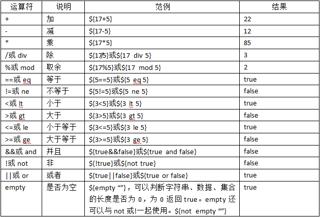
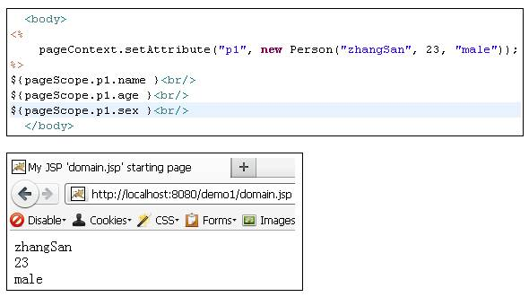
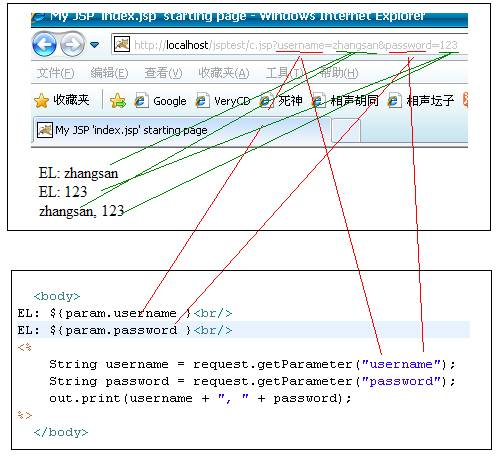
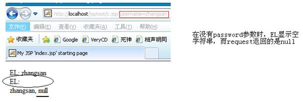
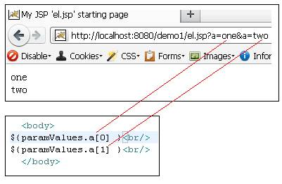
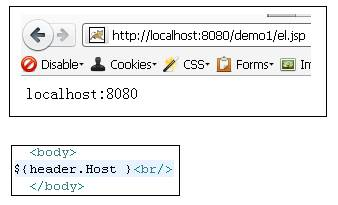
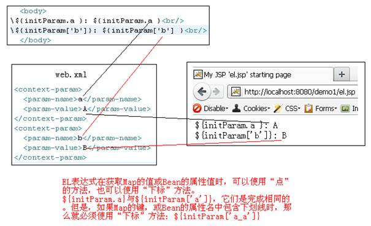
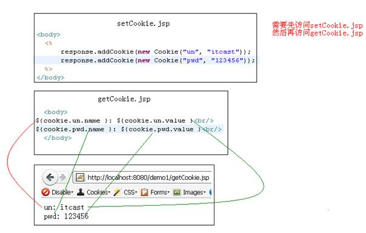
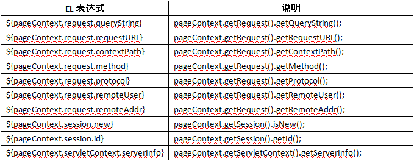

# JavaWeb基础学习笔记-EL表达式

---

### EL概述

1、EL的作用

JSP2.0要把HTML和CSS分离、要把HTML和Javascript分离、要把Java脚本替换成标签。标签的好处是非Java人员都可以使用，JSP2.0 – 纯标签页面，即：不包含`<% … %>`、`<%! … %>`，以及`<%= … %>`。

EL（Expression Language）是一门表达式语言，它对应`<%=…%>`。我们知道在JSP中，表达式会被输出，所以EL表达式也会被输出。

2、EL的格式

格式：`${…}`，例如：`${1 + 2}`。

3、关闭EL

* 如果希望整个JSP忽略EL表达式，需要在page指令中指定`isELIgnored=”true”`。
* 如果希望忽略某个EL表达式，可以在EL表达式之前添加`\`，例如：` \${1 + 2} `。

4、EL运算符

5、EL不显示null

当EL表达式的值为null时，会在页面上显示空白，即什么都不显示。

### EL表达式格式

先来了解一下EL表达式的格式。现在还不能演示它，因为需要学习了EL11个内置对象后才方便显示它。

* 操作List和数组：`${list[0]}`、`${arr[0]}`；
* 操作bean的属性：`${person.name}`、`${person['name']}`，对应`person.getName()`方法；
* 操作Map的值：`${map.key}`、`${map['key']}`，对应`map.get(key)`。

### EL内置对象

EL一共有11个内置对象，无需创建即可以使用。这11个内置对象中有10个是Map类型的，最后一个是pageContext对象。

| 对象             | 描述 |
| ---------------- | ---- |
| pageScope        |      |
| requestScope     |      |
| sessionScope     |      |
| applicationScope |      |
| param            |      |
| paramValues      |      |
| header           |      |
| headerValues     |      |
| initParam        |      |
| cookie           |      |
| pageContext      |      |

1、域相关内置对象

域内置对象一共有四个：

* pageScope：`${pageScope.name}`等同于`pageContext.getAttribute(“name”)`；
* requestScope：`${requestScope.name}`等同于`request.getAttribute(“name”)`；
* sessionScoep： `${sessionScope.name}`等同于`session.getAttribute(“name”)`；
* applicationScope：`${applicationScope.name}`等同于`application.getAttribute(“name”)`；

如果在域中保存的是JavaBean对象，那么可以使用EL来访问JavaBean属性。因为EL只做读取操作，所以JavaBean一定要提供get方法，而set方法没有要求。

~~~java
public class Person {
	private String name;
	private int age;
	private String sex;
	public String getName() {
		return name;
	}
	public void setName(String name) {
		this.name = name;
	}
	public int getAge() {
		return age;
	}
	public void setAge(int age) {
		this.age = age;
	}
	public String getSex() {
		return sex;
	}
	public void setSex(String sex) {
		this.sex = sex;
	}
}
~~~

全域查找：`${person}`表示依次在pageScope、requesScopet、sessionScope、appliationScope四个域中查找名字为person的属性。

2、请求参数相关内置对象

param和paramValues这两个内置对象是用来获取请求参数的。

* param：`Map<String,String>`类型，param对象可以用来获取参数，与`request.getParameter()`方法相同。

注意，在使用EL获取参数时，如果参数不存在，返回的是空字符串，而不是null。这一点与使用`request.getParameter()`方法是不同的。

* paramValues：paramValues是`Map<String, String[]>`类型，当一个参数名，对应多个参数值时可以使用它。

3、请求头相关内置对象

header和headerValues是与请求头相关的内置对象：

* header： `Map<String,String>`类型，用来获取请求头。

* headerValues：headerValues是`Map<String,String[]>`类型。当一个请求头名称，对应多个值时，使用该对象，这里就不在赘述。

4、应用初始化参数相关内置对象

* initParam：initParam是`Map<String,String>`类型，它对应web.xml文件中的`<context-param>`参数。

5、Cookie相关内置对象

* cookie：cookie是`Map<String,Cookie>`类型，其中key是Cookie的名字，而值是Cookie对象本身。

6、pageContext对象

pageContext：pageContext是PageContext类型！可以使用pageContext对象调用getXXX()方法，例如pageContext.getRequest()，可以`${pageContext.request}`，也就是读取JavaBean属性。

### EL函数库

1、什么是EL函数库

EL函数库是由第三方对EL的扩展，我们现在学习的EL函数库是由JSTL添加的。

EL函数库就是定义一些有返回值的静态方法，然后通过EL语言来调用它们。当然，不只是JSTL可以定义EL函数库，我们也可以自定义EL函数库。

EL函数库中包含了很多对字符串的操作方法，以及对集合对象的操作。例如：`${fn:length(“abc”)}`会输出3，即字符串的长度。

2、导入函数库

因为是第三方的东西，所以需要导入，导入需要使用taglib指令。

~~~jsp
<%@ taglib prefix="fn" uri="http://java.sun.com/jsp/jstl/functions" %>
~~~

3、EL函数库介绍

| 方法                                                         | 描述                                 |
| ------------------------------------------------------------ | ------------------------------------ |
| String toUpperCase(String input)                             | 转大写                               |
| String toLowerCase(String input)                             | 转小写                               |
| int indexOf(String input, String substring)                  | 查找子串                             |
| boolean contains(String input, String substring)             | 判断是否包含子串                     |
| boolean containsIgnoreCase(String input, String substring)   | 判断是否包含子串，忽略大小写         |
| boolean startsWith(String input, String substring)           | 判断是否以自定字符串开头             |
| boolean endsWith(String input, String substring)             | 判断是否以自定字符串结尾             |
| String substring(String input, int beginIndex, int endIndex) | 截取子串                             |
| String substringAfter(String input, String substring)        | 截取指定串之后的                     |
| String substringBefore(String input, String substring)       | 截取指定串之前的                     |
| String escapeXml(String input)                               | 把字符串的“>”、“<”等等进行转义       |
| String trim(String input)                                    | 去掉两端空格                         |
| String replace(String input, String substringBefore, String substringAfter) | 替换                                 |
| String[] split(String input, String delimiters)              | 拆分                                 |
| int length(Object obj)                                       | 可以获取字符串、数组、各种集合的长度 |
| String join(String array[], String separator)                | 将数组以指定符号连接                 |

~~~jsp
<%@taglib prefix="fn" uri="http://java.sun.com/jsp/jstl/functions" %>
<%
	String[] strs = {"a", "b", "c"};
	List list = new ArrayList();
	list.add("a");
	pageContext.setAttribute("arr", strs);
	pageContext.setAttribute("list", list);
%>

${fn:length(arr) } <!--3-->
${fn:length(list) } <!--1-->
${fn:toLowerCase("Hello") }  <!-- hello -->
${fn:toUpperCase("Hello") }  <!-- HELLO -->
${fn:contains("abc", "a")} <!-- true -->
${fn:containsIgnoreCase("abc", "Ab")} <!-- true -->
${fn:contains(arr, "a")} <!-- true -->
${fn:containsIgnoreCase(list, "A")} <!-- true -->
${fn:endsWith("Hello.java", ".java")} <!-- true -->
${fn:startsWith("Hello.java", "Hell")} <!-- true -->
${fn:indexOf("Hello-World", "-")} <!-- 5 -->
${fn:join(arr, ";")} <!-- a;b;c -->
${fn:replace("Hello-World", "-", "+")} <!-- Hello+World -->
${fn:join(fn:split("a;b;c;", ";"), "-")} <!-- a-b-c -->

${fn:substring("0123456789", 6, 9)} <!-- 678 -->
${fn:substring("0123456789", 5, -1)} <!-- 56789 -->
${fn:substringAfter("Hello-World", "-")} <!-- World -->
${fn:substringBefore("Hello-World", "-")} <!-- Hello -->
${fn:trim("     a b c     ")} <!-- a b c -->
${fn:escapeXml("<html></html>")}  <!-- <html></html> -->
~~~

4、自定义EL函数库

* 编写一个类，定义一个有返回值的静态方法；
* 编写demo.tld文件，可以参照fn.tld文件来写；
* 把demo.tld文件放到/WEB-INF目录下；
* 在页面中添加taglib指令，导入自定义标签库。

1）demoFuncations.java

~~~java
package cn.demo.el.funcations;
public class DemoFuncations {
	public static String test() {
		return "自定义EL函数库测试";
	}
}
~~~

2）demo.tld（放到classes下）

~~~xml
<?xml version="1.0" encoding="UTF-8" ?>
<taglib xmlns="http://java.sun.com/xml/ns/j2ee" xmlns:xsi="http://www.w3.org/2001/XMLSchema-instance" xsi:schemaLocation="http://java.sun.com/xml/ns/j2ee http://java.sun.com/xml/ns/j2ee/web-jsptaglibrary_2_0.xsd" version="2.0">
	<tlib-version>1.0</tlib-version>
	<short-name>demo</short-name>
	<uri>http://www.demo.cn/jsp/functions</uri>

	<function>
		<name>demo</name>
		<function-class>cn.demo.el.funcations.DemoFuncations</function-class>
		<function-signature>String test()</function-signature>
	</function>
</taglib>
~~~

3）index.jsp

~~~jsp
<%@ page language="java" import="java.util.*" pageEncoding="UTF-8"%>
<%@ taglib prefix="demo" uri="/WEB-INF/demo.tld" %>
<!DOCTYPE HTML PUBLIC "-//W3C//DTD HTML 4.01 Transitional//EN">
<html>
<body> 
	<h1>${demo:test() }</h1>
</body>
</html>
~~~

   

---

