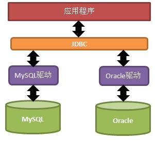
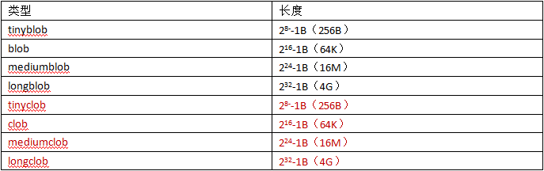
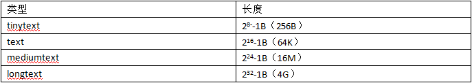

# JavaWeb基础学习笔记-JDBC

---

### 概述

1、什么是JDBC

JDBC（Java DataBase Connectivity）就是Java数据库连接，说白了就是用Java语言来操作数据库。原来我们操作数据库是在控制台使用SQL语句来操作数据库，JDBC是用Java语言向数据库发送SQL语句。

2、JDBC原理

早期SUN公司的天才们想编写一套可以连接天下所有数据库的API，但是当他们刚刚开始时就发现这是不可完成的任务，因为各个厂商的数据库服务器差异太大了。后来SUN开始与数据库厂商们讨论，最终得出的结论是，由SUN提供一套访问数据库的规范（就是一组接口），并提供连接数据库的协议标准，然后各个数据库厂商会遵循SUN的规范提供一套访问自己公司的数据库服务器的API。SUN提供的规范命名为JDBC，而各个厂商提供的，遵循了JDBC规范的，可以访问自己数据库的API被称之为驱动。

JDBC是接口，而JDBC驱动才是接口的实现，没有驱动无法完成数据库连接。每个数据库厂商都有自己的驱动，用来连接自己公司的数据库。当然还有第三方公司专门为某一数据库提供驱动，这样的驱动往往不是开源免费的。

3、JDBC核心类（接口）介绍

JDBC中的核心类有：DriverManager、Connection、Statement，和ResultSet。

1）DriverManger（驱动管理器）的作用有两个：

* 注册驱动：这可以让JDBC知道要使用的是哪个驱动；
* 获取Connection：如果可以获取到Connection，那么说明已经与数据库连接上了。

2）Connection对象表示连接，与数据库的通讯都是通过这个对象展开的：

* Connection最为重要的一个方法就是用来获取Statement对象；

3）Statement是用来向数据库发送SQL语句的，这样数据库就会执行发送过来的SQL语句：

* void executeUpdate(String sql)：执行更新操作（insert、update、delete等）；
* ResultSet executeQuery(String sql)：执行查询操作，数据库在执行查询后会把查询结果，查询结果就是ResultSet；

4）ResultSet对象表示查询结果集，只有在执行查询操作后才会有结果集的产生。结果集是一个二维的表格，有行有列。操作结果集要学习移动ResultSet内部的“行光标”，以及获取当前行上的每一列上的数据：

* boolean next()：使“行光标”移动到下一行，并返回移动后的行是否存在；
* XXX getXXX(int col)：获取当前行指定列上的值，参数就是列数，列数从1开始，而不是0。

### 基础示例

1、导入mysql数据库的驱动jar包：`mysql-connector-java-5.1.13-bin.jar`；

2、获取连接

获取连接需要两步，一是使用DriverManager来注册驱动，二是使用DriverManager来获取Connection对象。

1）注册驱动

注册驱动就只有一句话：

~~~java
Class.forName("com.mysql.jdbc.Driver");
~~~

DriverManager类的registerDriver()方法的参数是java.sql.Driver，但java.sql.Driver是一个接口，实现类由mysql驱动来提供，mysql驱动中的java.sql.Driver接口的实现类为com.mysql.jdbc.Driver。那么注册驱动的代码如下：

~~~java
DriverManager.registerDriver(new com.mysql.jdbc.Driver());
~~~

上面代码虽然可以注册驱动，但是出现硬编码（代码依赖mysql驱动jar包），如果将来想连接Oracle数据库，那么必须要修改代码的。并且其实这种注册驱动的方式是注册了两次驱动。

JDBC中规定，驱动类在被加载时，需要自己“主动”把自己注册到DriverManger中，下面我们来看看com.mysql.jdbc.Driver类的源代码：

~~~java
public class Driver extends NonRegisteringDriver implements java.sql.Driver {
	static {
		try {
			java.sql.DriverManager.registerDriver(new Driver());
		} catch (SQLException E) {
			throw new RuntimeException("Can't register driver!");
		}
	}
}
~~~

com.mysql.jdbc.Driver类中的static块会创建本类对象，并注册到DriverManager中。这说明只要去加载com.mysql.jdbc.Driver类，那么就会执行这个static块，从而也就会把com.mysql.jdbc.Driver注册到DriverManager中，所以可以把注册驱动类的代码修改为加载驱动类。

~~~java
Class.forName("com.mysql.jdbc.Driver");
~~~

2）获取连接

获取连接的也只有一句代码：`DriverManager.getConnection(url,username,password)`，其中username和password是登录数据库的用户名和密码。url相对复杂一点，它是用来找到要连接的数据库“网址”，就好比你要在浏览器中查找百度时，也需要提供一个url。下面是mysql的url：`jdbc:mysql://localhost:3306/mydb1`，JDBC规定url的格式由三部分组成，每个部分中间使用冒号分隔：

* 第一部分是jdbc，这是固定的；
* 第二部分是数据库名称，连接mysql数据库，第二部分当然是mysql了；
* 第三部分是由数据库厂商规定的，我们需要了解每个数据库厂商的要求，mysql的第三部分分别由数据库服务器的IP地址（localhost）、端口号（3306），以及DATABASE名称(mydb1)组成。

下面是获取连接的语句：

~~~java
Connection con = DriverManager.getConnection("jdbc:mysql://localhost:3306/mydb1", "root", "123");
~~~

还可以在url中提供参数：

~~~java
jdbc:mysql://localhost:3306/mydb1?useUnicode=true&characterEncoding=UTF8
~~~

useUnicode参数指定这个连接数据库的过程中，使用的字符集是Unicode字符集；characherEncoding参数指定连接数据库的过程中，使用的字符集编码为UTF-8编码。请注意，mysql中指定UTF-8编码是给出的是UTF8，而不是UTF-8。

3、获取Statement

在得到Connectoin之后，说明已经与数据库连接上了，下面是通过Connection获取Statement对象的代码：

~~~java
Statement stmt = con.createStatement();
~~~

Statement是用来向数据库发送要执行的SQL语句的。

4、发送SQL增、删、改语句

~~~java
String sql = "insert into user value('zhangSan', '123')";
int m = stmt.executeUpdate(sql);
~~~

其中int类型的返回值表示执行这条SQL语句所影响的行数。我们知道，对insert来说，最后只能影响一行，而update和delete可能会影响0~n行。如果SQL语句执行失败，那么executeUpdate()会抛出一个SQLException。

5、发送SQL查询语句

~~~java
String sql = "select * from user";
ResultSet rs = stmt.executeQuery(sql);
~~~

请注意，执行查询使用的不是executeUpdate()方法，而是executeQuery()方法。executeQuery()方法返回的是ResultSet，ResultSet封装了查询结果，我们称之为结果集。

6、读取结果集中的数据

ResultSet就是一张二维的表格，它内部有一个“行光标”，光标默认的位置在“第一行上方”，我们可以调用rs对象的next()方法把“行光标”向下移动一行。当第一次调用next()方法时，“行光标”就到了第一行记录的位置，这时就可以使用ResultSet提供的getXXX(int col)方法来获取指定列的数据了：

* rs.next();  //光标移动到第一行
* rs.getInt(1);  //获取第一行第一列的数据

当你使用rs.getInt(1)方法时，你必须可以肯定第1列的数据类型就是int类型，如果你不能肯定，那么最好使用rs.getObject(1)。在ResultSet类中提供了一系列的getXXX()方法，比较常用的方法有：

* Object getObject(int col)
* String getString(int col)
* int getInt(int col)
* double getDouble(int col)

7、关闭

与IO流一样，使用后的东西都需要关闭。关闭的顺序是先得到的后关闭，后得到的先关闭。

~~~java
rs.close();
stmt.close();
con.close();
~~~

8、小结

~~~java
public static Connection getConnection() throws Exception {
	Class.forName("com.mysql.jdbc.Driver");
	String url = "jdbc:mysql://localhost:3306/mydb1";
	return DriverManager.getConnection(url, "root", "123");
}

@Test
public void insert() throws Exception {
	Connection con = getConnection();
	Statement stmt = con.createStatement();
	String sql = "insert into user values('zhangSan', '123')";
	stmt.executeUpdate(sql);
	System.out.println("插入成功！");
}

@Test
public void update() throws Exception {
	Connection con = getConnection();
	Statement stmt = con.createStatement();
	String sql = "update user set password='456' where username='zhangSan'";
	stmt.executeUpdate(sql);
	System.out.println("修改成功！");
}

@Test
public void delete() throws Exception {
	Connection con = getConnection();
	Statement stmt = con.createStatement();
	String sql = "delete from user where username='zhangSan'";
	stmt.executeUpdate(sql);
	System.out.println("删除成功！");
}

@Test
public void query() throws Exception {
	Connection con = getConnection();
	Statement stmt = con.createStatement();
	String sql = "select * from user";
	ResultSet rs = stmt.executeQuery(sql);
	while(rs.next()) {
		String username = rs.getString(1);
		String password = rs.getString(2);
		System.out.println(username + ", " + password);
	}
}

@Test
public void query() {
	Connection con = null;
	Statement stmt = null;
	ResultSet rs = null;
	try {
		con = getConnection(); 
		stmt = con.createStatement();
		String sql = "select * from user";
		rs = stmt.executeQuery(sql);
		while(rs.next()) {
			String username = rs.getString(1);
			String password = rs.getString(2);
			System.out.println(username + ", " + password);
		}
	} catch(Exception e) {
		throw new RuntimeException(e);
	} finally {
		try {
			if(rs != null) rs.close();
			if(stmt != null) stmt.close();
			if(con != null) con.close();
 		} catch(SQLException e) {}
	}
}
~~~

### JDBC对象介绍

1、JDBC中的主要类（接口）

在JDBC中常用的类有：

* DriverManager；
* Connection；
* Statement；
* ResultSet；

2、DriverManager

其实我们今后只需要会用DriverManager的getConnection()方法即可：

~~~java
Class.forName("com.mysql.jdbc.Driver"); //注册驱动
String url = "jdbc:mysql://localhost:3306/mydb1";
String username = "root";
String password = "123";
Connection con = DriverManager.getConnection(url, username, password);
~~~

注意，上面代码可能出现的两种异常：

1）ClassNotFoundException：这个异常是在第1句上出现的，出现这个异常有两个可能：

* 你没有给出mysql的jar包；
* 你把类名称打错了，查看类名是不是`com.mysql.jdbc.Driver`。

2）SQLException：这个异常出现在第5句，出现这个异常就是三个参数的问题，往往username和password一般不是出错，所以需要认真查看url是否打错。

对于DriverManager.registerDriver()方法了解即可，因为我们今后注册驱动只会Class.forName()，而不会使用这个方法。

3、Connection

Connection最为重要的方法就是获取Statement：

* Statement stmt = con.createStatement(); 

后面在学习ResultSet方法时，还要学习一下下面的方法：

* Statement stmt = con.createStatement(int, int );

4、Statement

Statement最为重要的方法是：

* int executeUpdate (String sql)：执行更新操作，即执行insert、update、delete语句，其实这个方法也可以执行create table、alter table，以及drop table等语句，但我们很少会使用JDBC来执行这些语句；
* ResultSet executeQuery (String sql)：执行查询操作，执行查询操作会返回ResultSet，即结果集；
* boolean execute ()：Statement还有一个boolean execute()方法，这个方法可以用来执行增、删、改、查所有SQL语句。该方法返回的是boolean类型，表示SQL语句是否有结果集。如果使用execute()方法执行的是更新语句，那么还要调用int getUpdateCount()来获取insert、update、delete语句所影响的行数。如果使用execute()方法执行的是查询语句，那么还要调用ResultSet getResultSet()来获取select语句的查询结果。

5、ResultSet之滚动结果集

ResultSet表示结果集，它是一个二维的表格。ResultSet内部维护一个行光标（游标），ResultSet提供了一系列的方法来移动游标：

| 方法                      | 描述                                                         |
| ------------------------- | ------------------------------------------------------------ |
| void beforeFirst()        | 把光标放到第一行的前面，这也是光标默认的位置                 |
| void afterLast()          | 把光标放到最后一行的后面                                     |
| boolean first()           | 把光标放到第一行的位置上，返回值表示调控光标是否成功         |
| boolean last()            | 把光标放到最后一行的位置上                                   |
| boolean isBeforeFirst()   | 当前光标位置是否在第一行前面                                 |
| boolean isAfterLast()     | 当前光标位置是否在最后一行的后面                             |
| boolean isFirst()         | 当前光标位置是否在第一行上                                   |
| boolean isLast()          | 当前光标位置是否在最后一行上                                 |
| boolean previous()        | 把光标向上挪一行                                             |
| boolean next()            | 把光标向下挪一行                                             |
| boolean relative(int row) | 相对位移，当row为正数时，表示向下移动row行，为负数时表示向上移动row行 |
| boolean absolute(int row) | 绝对位移，把光标移动到指定的行上                             |
| int getRow()              | 返回当前光标所在行                                           |

上面方法分为两类，一类用来判断游标位置的，另一类是用来移动游标的。如果结果集是不可滚动的，那么只能使用next()方法来移动游标，而beforeFirst()、afterLast()、first()、last()、previous()、relative()方法都不能使用。

1）获取结果集元数据：

* 得到元数据：rs.getMetaData()，返回值为ResultSetMetaData；
* 获取结果集列数：int getColumnCount()；
* 获取指定列的列名：String getColumnName(int colIndex)；

2）结果集特性：结果集是否支持滚动，要从Connection类的createStatement()方法说起。也就是说创建的Statement决定了使用Statement创建的ResultSet是否支持滚动。当使用Connection的createStatement时，已经确定了Statement生成的结果集是什么特性。

* 是否可滚动
* 是否敏感
* 是否可更新

Statement createStatement(int resultSetType, int resultSetConcurrency) ：

resultSetType的可选值：

| 类型                              | 描述                                           |
| --------------------------------- | ---------------------------------------------- |
| ResultSet.TYPE_FORWARD_ONLY       | 不滚动结果集                                   |
| ResultSet.TYPE_SCROLL_INSENSITIVE | 滚动结果集，但结果集数据不会再跟随数据库而变化 |
| ResultSet.TYPE_SCROLL_SENSITIVE   | 滚动结果集，但结果集数据不会再跟随数据库而变化 |

可以看出，如果想使用滚动的结果集，我们应该选择TYPE_SCROLL_INSENSITIVE。其实很少有数据库驱动会支持TYPE_SCROLL_SENSITIVE的特性，通常我们也不需要查询到的结果集再受到数据库变化的影响。

resultSetConcurrency的可选值：

| 类型             | 描述                                               |
| ---------------- | -------------------------------------------------- |
| CONCUR_READ_ONLY | 结果集是只读的，不能通过修改结果集而反向影响数据库 |
| CONCUR_UPDATABLE | 结果集是可更新的，对结果集的更新可以反向影响数据库 |

~~~java
Statement stmt = con.createStatement(ResultSet.TYPE_SCROLL_INSENSITIVE, CONCUR_READ_ONLY);
~~~

6、ResultSet之获取列数据

可以通过next()方法使ResultSet的游标向下移动，当游标移动到你需要的行时，就需要来获取该行的数据了，ResultSet提供了一系列的获取列数据的方法：

* String getString(int columnIndex)：获取指定列的String类型数据；
* int getInt(int columnIndex)：获取指定列的int类型数据；
* double getDouble(int columnIndex)：获取指定列的double类型数据；
* boolean getBoolean(int columnIndex)：获取指定列的boolean类型数据；
* Object getObject(int columnIndex)：获取指定列的Object类型的数据。

上面方法中，参数columnIndex表示列的索引，**列索引从1开始，而不是0**，这一点与数组不同。如果你清楚当前列的数据类型，那么可以使用getInt()之类的方法来获取，如果你不清楚列的类型，那么你应该使用getObject()方法来获取。

ResultSet还提供了一套通过列名称来获取列数据的方法 ：

* String getString(String columnName)：获取名称为columnName的列的String数据；
* int getInt(String columnName)：获取名称为columnName的列的int数据；
* double getDouble(String columnName)：获取名称为columnName的列的double数据；
* boolean getBoolean(String columnName)：获取名称为columnName的列的boolean数据；
* Object getObject(String columnName)：获取名称为columnName的列的Object数据；

### PreparedStatement

1、SQL攻击

在需要用户输入的地方，用户输入的是SQL语句的片段，最终用户输入的SQL片段与我们DAO中写的SQL语句合成一个完整的SQL语句。例如用户在登录时输入的用户名和密码都是为SQL语句的片段。

~~~sql
CREATE TABLE user(
	uid         CHAR(32) PRIMARY KEY,
	username	VARCHAR(30) UNIQUE KEY NOT NULL,
	PASSWORD 	VARCHAR(30)
);
INSERT INTO user VALUES('U_1001', 'zs', 'zs');
SELECT * FROM user;
~~~

~~~java
public void login(String username, String password) {
	Connection con = null;
	Statement stmt = null;
	ResultSet rs = null;
	try {
		con = JdbcUtils.getConnection();
		stmt = con.createStatement();
		String sql = "SELECT * FROM user WHERE " +
					"username='" + username + 
					"' and password='" + password + "'";
		rs = stmt.executeQuery(sql);
		if(rs.next()) {
			System.out.println("欢迎" + rs.getString("username"));
		} else {
			System.out.println("用户名或密码错误！");
		}
	} catch (Exception e) {
		throw new RuntimeException(e);
	} finally {
		JdbcUtils.close(con, stmt, rs);
	}		
}
~~~

~~~java
login("a' or 'a'='a", "a' or 'a'='a");
~~~

~~~sql
SELECT * FROM tab_user WHERE username='a' or 'a'='a' and password='a' or 'a'='a'
~~~

这行代码会使我们登录成功。因为是输入的用户名和密码是SQL语句片段，最终与我们的login()方法中的SQL语句组合在一起。

2、PreparedStatement是什么

PreparedStatement叫预编译声明。PreparedStatement是Statement的子接口，你可以使用PreparedStatement来替换Statement。PreparedStatement的好处：

* 防止SQL攻击； 
* 提高代码的可读性，以可维护性；
* 提高效率；

3、PreparedStatement的使用

* 使用Connection的prepareStatement(String sql)：即创建它时就让它与一条SQL模板绑定；
* 调用PreparedStatement的setXXX()系列方法为问号设置值；
* 调用executeUpdate()或executeQuery()方法，但要注意，调用没有参数的方法；

~~~java
String sql = "select * from tab_student where s_number=?";
PreparedStatement pstmt = con.prepareStatement(sql);
pstmt.setString(1, "S_1001");
ResultSet rs = pstmt.executeQuery();
rs.close();
pstmt.clearParameters(); 
pstmt.setString(1, "S_1002");
rs = pstmt.executeQuery();
~~~

在使用Connection创建PreparedStatement对象时需要给出一个SQL模板，所谓SQL模板就是有“?”的SQL语句，其中“?”就是参数。在得到PreparedStatement对象后，调用它的setXXX()方法为“?”赋值，这样就可以得到把模板变成一条完整的SQL语句，然后再调用PreparedStatement对象的executeQuery()方法获取ResultSet对象。

注意PreparedStatement对象独有的executeQuery()方法是没有参数的，而Statement的executeQuery()是需要参数（SQL语句）的。因为在创建PreparedStatement对象时已经让它与一条SQL模板绑定在一起了，所以在调用它的executeQuery()和executeUpdate()方法时就不再需要参数了。

PreparedStatement最大的好处就是在于重复使用同一模板，给予其不同的参数来重复的使用它。这才是真正提高效率的原因。所以，建议大家在今后的开发中，无论什么情况，都去需要PreparedStatement，而不是使用Statement。

### JdbcUtils工具封装

数据库配置文件dbconfig.properties：

~~~plaintext
driverClassName=com.mysql.jdbc.Driver
url=jdbc:mysql://localhost:3306/mydb1?useUnicode=true&characterEncoding=UTF8
username=root
password=123
~~~

~~~java
public class JdbcUtils {
	private static final String dbconfig = "dbconfig.properties" ;
	private static Properties prop = new Properties() ;
	static {
		try {
			InputStream in = Thread.currentThread().getContextClassLoader().getResourceAsStream(dbconfig);
			prop.load(in);
			Class.forName(prop.getProperty("driverClassName"));
		} catch(IOException e) {
			throw new RuntimeException(e);
		}
	} 

	public static Connection getConnection () {
		try {
			return DriverManager.getConnection(prop.getProperty("url"),
					prop.getProperty("username"), prop.getProperty("password"));
		} catch (Exception e) {
			throw new RuntimeException(e);
		}
	}
}
~~~

### 时间类型

1、Java中的时间类型

java.sql包下给出三个与数据库相关的日期时间类型，分别是：

* Date：表示日期，只有年月日，没有时分秒。会丢失时间；
* Time：表示时间，只有时分秒，没有年月日。会丢失日期；
* Timestamp：表示时间戳，有年月日时分秒，以及毫秒。

这三个类都是java.util.Date的子类。

2、时间类型相互转换

把数据库的三种时间类型赋给java.util.Date，基本不用转换，因为这是把子类对象给父类的引用，不需要转换。

~~~java
java.sql.Date date = …
java.util.Date d = date;

java.sql.Time time = …
java.util.Date d = time;

java.sql.Timestamp timestamp = …
java.util.Date d = timestamp;
~~~

当需要把java.util.Date转换成数据库的三种时间类型时，这就不能直接赋值了，这需要使用数据库三种时间类型的构造器。java.sql包下的Date、Time、TimeStamp三个类的构造器都需要一个long类型的参数，表示毫秒值。创建这三个类型的对象，只需要有毫秒值即可。我们知道java.util.Date有getTime()方法可以获取毫秒值，那么这个转换也就不是什么问题了。

~~~java
java.utl.Date d = new java.util.Date();
java.sql.Date date = new java.sql.Date(d.getTime()); //会丢失时分秒
Time time = new Time(d.getTime()); //会丢失年月日
Timestamp timestamp = new Timestamp(d.getTime());
~~~

3、代码示例

~~~sql
CREATE TABLE dt(
	d DATE,
	t TIME,
	ts TIMESTAMP
)
~~~

~~~java
@Test
public void fun1() throws SQLException {
	Connection con = JdbcUtils.getConnection();
	String sql = "insert into dt value(?,?,?)";
	PreparedStatement pstmt = con.prepareStatement(sql);

	java.util.Date d = new java.util.Date();
	pstmt.setDate(1, new java.sql.Date(d.getTime()));
	pstmt.setTime(2, new Time(d.getTime()));
	pstmt.setTimestamp(3, new Timestamp(d.getTime()));
	pstmt.executeUpdate();
}
~~~

~~~java
@Test
public void fun2() throws SQLException {
	Connection con = JdbcUtils.getConnection();
	String sql = "select * from dt";
	PreparedStatement pstmt = con.prepareStatement(sql);
	ResultSet rs = pstmt.executeQuery();

	rs.next();
	java.util.Date d1 = rs.getDate(1);
	java.util.Date d2 = rs.getTime(2);
	java.util.Date d3 = rs.getTimestamp(3);

	System.out.println(d1);
	System.out.println(d2);
	System.out.println(d3);
}
~~~

### 大数据

1、什么是大数据

所谓大数据，就是指大的字节数据，或者大的字符数据。标准SQL中提供了如下类型来保存大数据类型：

但是，在mysql中没有提供tinyclob、clob、mediumclob、longclob四种类型，而是使用如下四种类型来处理文本大数据：

2、代码示例

首先我们需要创建一张表，表中要有一个mediumblob（16M）类型的字段：

~~~sql
CREATE TABLE tab_bin(
	id 	     INT PRIMARY KEY AUTO_INCREMENT,
	filename VARCHAR(100),
	data 	 MEDIUMBLOB
);
~~~

向数据库插入二进制数据需要使用PreparedStatement为原setBinaryStream(int, InputSteam)方法来完成：

~~~java
con = JdbcUtils.getConnection();
String sql = "insert into tab_bin(filename,data) values(?, ?)";
pstmt = con.prepareStatement(sql);
pstmt.setString(1, "a.jpg");
InputStream in = new FileInputStream("f:\\a.jpg"); 
pstmt.setBinaryStream(2, in); 
pstmt.executeUpdate();
~~~

读取二进制数据，需要在查询后使用ResultSet类的getBinaryStream()方法来获取输入流对象。也就是说，PreparedStatement有setXXX()，那么ResultSet就有getXXX()：

~~~java
con = JdbcUtils.getConnection();
String sql = "select filename,data from tab_bin where id=?";
pstmt = con.prepareStatement(sql);
pstmt.setInt(1, 1);
rs = pstmt.executeQuery();
rs.next();

String filename = rs.getString("filename");
OutputStream out = new FileOutputStream("F:\\" + filename) ;

InputStream in = rs.getBinaryStream("data") ;
IOUtils.copy(in, out) ;
out.close();
~~~

还有一种方法，就是把要存储的数据包装成Blob类型，然后调用PreparedStatement的setBlob()方法来设置数据：

~~~java
con = JdbcUtils.getConnection();
String sql = "insert into tab_bin(filename,data) values(?, ?)";
pstmt = con.prepareStatement(sql);
pstmt.setString(1, "a.jpg");
File file = new File("f:\\a.jpg");
byte[] datas = FileUtils.getBytes(file); //获取文件中的数据
Blob blob = new SerialBlob(datas); //创建Blob对象
pstmt.setBlob(2, blob); //设置Blob类型的参数
pstmt.executeUpdate();
~~~

~~~java
con = JdbcUtils.getConnection();
String sql = "select filename,data from tab_bin where id=?";
pstmt = con.prepareStatement(sql);
pstmt.setInt(1, 1);
rs = pstmt.executeQuery();
rs.next();

String filename = rs.getString("filename");
File file = new File("F:\\" + filename) ;
Blob blob = rs.getBlob("data");
byte[] datas = blob.getBytes(0, (int)file.length());
FileUtils.writeByteArrayToFile(file, datas);
~~~

> 在my.ini中添加如下配置：max_allowed_packet=10485760

### 批处理

1、Statement批处理

批处理就是一批一批的处理，而不是一个一个的处理。当你有10条SQL语句要执行时，一次向服务器发送一条SQL语句，这么做效率上很差。处理的方案是使用批处理，即一次向服务器发送多条SQL语句，然后由服务器一次性处理。批处理只针对更新（增、删、改）语句。

可以多次调用Statement类的addBatch(String sql)方法，把需要执行的所有SQL语句添加到一个“批”中，然后调用Statement类的executeBatch()方法来执行当前“批”中的语句。

* void addBatch(String sql)：添加一条语句到“批”中；
* int[] executeBatch()：执行“批”中所有语句。返回值表示每条语句所影响的行数据；
* void clearBatch()：清空“批”中的所有语句。

~~~java
for(int i = 0; i < 10; i++) {
	String number = "S_10" + i;
	String name = "stu" + i;
	int age = 20 + i;
	String gender = i % 2 == 0 ? "male" : "female";
	String sql = "insert into stu values('" + number + "', '" + name + "', " + age + ", '" + gender + "')";
	stmt .addBatch(sql);
}
stmt.executeBatch ();
~~~

当执行了“批”之后，“批”中的SQL语句就会被清空。也就是说，连续两次调用executeBatch()相当于调用一次。因为第二次调用时，“批”中已经没有SQL语句了。还可以在执行“批”之前，调用Statement的clearBatch()方法来清空“批”。

2、PreparedStatement批处理

PreparedStatement的批处理有所不同，因为每个PreparedStatement对象都绑定一条SQL模板。所以向PreparedStatement中添加的不是SQL语句，而是给“?”赋值。

~~~java
con = JdbcUtils.getConnection();
String sql = "insert into stu values(?,?,?,?)";
pstmt = con.prepareStatement(sql);
for(int i = 0; i < 10; i++) {
	pstmt.setString(1, "S_10" + i);
	pstmt.setString(2, "stu" + i);
	pstmt.setInt(3, 20 + i);
	pstmt.setString(4, i % 2 == 0 ? "male" : "female");
	pstmt.addBatch() ;
}
pstmt.executeBatch ();
~~~

   

---

