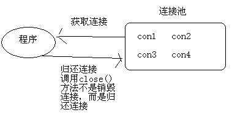
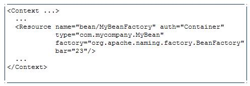
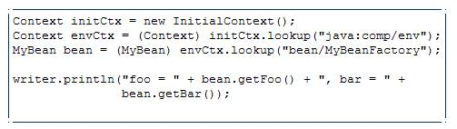
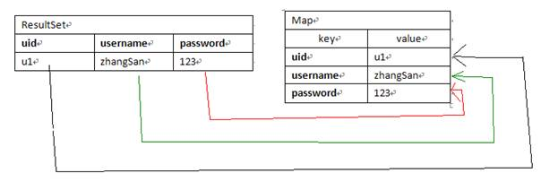
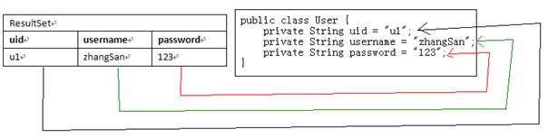
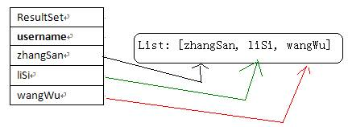
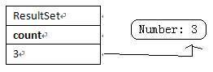

# JavaWeb基础学习笔记-数据库连接池

---

### 概述

1、数据库连接池的概念

用池来管理Connection，这可以重复使用Connection。有了池，我们就不用自己来创建Connection，而是通过池来获取Connection对象。当使用完Connection后，调用Connection的close()方法也不会真的关闭Connection，而是把Connection“归还”给池，池就可以再利用这个Connection对象了。

2、JDBC数据库连接池接口（DataSource）

Java为数据库连接池提供了公共的接口：javax.sql.DataSource，各个厂商可以让自己的连接池实现这个接口，这样应用程序可以方便的切换不同厂商的连接池。

3、自定义连接池

分析：自定义连接池需要有一个List，用来保存连接对象。在自定义连接池的构造器中创建5个连接对象放到List中，当有人调用了自定义连接池的getConnection()时，那么就从List拿出一个返回；当List中没有连接可用时，抛出异常。

我们需要对Connection的close()方法进行增强，所以我们需要重写自定义连接池的Connection类，对Connection进行装饰，即对close()方法进行增强。因为需要在调用close()方法时把连接“归还”给池，所以自定义连接池的Connection类需要拥有池对象的引用，并且池类还要提供“归还”的方法。

~~~java
public class MyPool implements DataSource  {
	private static Properties props = new Properties();
	private List<Connection> list = new ArrayList<Connection>();
	static {
		InputStream in = MyPool.class.getClassLoader().getResourceAsStream("dbconfig.properties");
		try {
			props.load(in);
			Class.forName(props.getProperty("driverClassName"));
		} catch (Exception e) {
			throw new RuntimeException(e);
		}
	}

	public MyPool () throws SQLException {
		for (int i = 0; i < 5; i++) {
			Connection con = DriverManager.getConnection(
					props.getProperty("url"), 		
					props.getProperty("username"),
					props.getProperty("password")); 
			MyConnection conWapper = new MyConnection(con, this); 
			list.add(conWapper); 
		}
	}

	public void add (Connection con) {
		list.add(con);
	}

	public Connection getConnection () throws SQLException {
		if(list.size() > 0) {
			return list.remove(0);
		}
		throw new SQLException("没连接了");
	}
	//...... 
}
~~~

~~~java
public class MyConnection extends ConnectionWrapper {
	private MyPool pool;
	public MyConnection(Connection con, MyPool pool) {
		super(con);
		this.pool = pool ;
	}
	@Override
	public void close() throws SQLException {
		pool.add(this);
	}
}
~~~

### DBCP

1、什么是DBCP

DBCP是Apache提供的一款开源免费的数据库连接池。Hibernate3.0之后不再对DBCP提供支持，因为Hibernate声明DBCP有致命的缺陷。DBCP因为Hibernate的这一毁谤很是生气，并且说自己没有缺陷。

2、DBCP的使用

~~~java
public void fun1() throws SQLException {
	BasicDataSource ds = new BasicDataSource();
	ds.setUsername("root");
	ds.setPassword("123");
	ds.setUrl("jdbc:mysql://localhost:3306/mydb1");
	ds.setDriverClassName("com.mysql.jdbc.Driver");

	ds.setMaxActive(20); 
	ds.setMaxIdle(10); 
	ds.setInitialSize(10) ;
	ds.setMinIdle(2) ;
	ds.setMaxWait(1000) ;

	Connection con = ds.getConnection();
	System.out.println(con.getClass().getName());
	con.close() ;
}
~~~

3、DBCP的配置信息

~~~plaintext
#基本配置
driverClassName=com.mysql.jdbc.Driver
url=jdbc:mysql://localhost:3306/mydb1
username=root
password=123

#初始化池大小，即一开始池中就会有10个连接对象，默认值为0
initialSize=0

#最大连接数，默认值为8，如果设置为非正数，表示没有限制，即无限大
#如果设置maxActive=50时，池中最多可以有50个连接，当然这50个连接中包含被使用的和没被使用的（空闲）
#例如你是一个包工头，你一共有50个工人，但这50个工人有的当前正在工作，有的正在空闲
maxActive=8

#最大空闲连接，默认值为8，如果设置为负数，表示没有限制，即无限大
#当设置maxIdle=20时，例如你是包工头，你允许最多有20个工人空闲，如果现在有30个空闲工人，那么要开除10个
maxIdle=8

#最小空闲连接，默认值为0
#如果设置minIdel=5时，例如你的工人只有3个空闲，那么你需要再去招2个回来，保证有5个空闲工人
minIdle=0

#最大等待时间，默认值为-1，表示无限期等待，不会抛出异常
#当设置maxWait=5000时，现在你的工人都出去工作了，又来了一个工作，需要一个工人。这时就要等待有工人回来，如果等待5000毫秒还没回来，那就抛出异常
#没有工人的原因：最多工人数为50，已经有50个工人了，不能再招了，但50人都出去工作了。
maxWait=-1

#连接属性
#就是原来放在url后面的参数，可以使用connectionProperties来指定；如果已经在url后面指定了，那么就不用在这里指定了。
#useServerPrepStmts=true：MySQL开启预编译功能
#cachePrepStmts=true：MySQL开启缓存PreparedStatement功能
#prepStmtCacheSize=50：缓存PreparedStatement的上限
#prepStmtCacheSqlLimit=300：当SQL模板长度大于300时，就不再缓存它
connectionProperties=useUnicode=true;characterEncoding=UTF8;useServerPrepStmts=true;cachePrepStmts=true;prepStmtCacheSize=50;prepStmtCacheSqlLimit=300

#连接的默认提交方式，默认值为true
defaultAutoCommit=true

#连接是否为只读连接
#Connection有一对方法：setReadOnly(boolean)和isReadOnly()
#如果是只读连接，那么你只能用这个连接来做查询。
#指定连接为只读是为了优化，这个优化与并发事务相关。如果两个并发事务，对同一行记录做增、删、改操作，是不是一定要隔离它们？如果两个并发事务，对同一行记录只做查询操作，那么是不是就不用隔离它们了？
#如果没有指定这个属性值，那么是否为只读连接，这就由驱动自己来决定了，即Connection的实现类自己来决定。
defaultReadOnly=false

#指定事务的事务隔离级别，可选值：NONE,READ_UNCOMMITTED, READ_COMMITTED, REPEATABLE_READ, SERIALIZABLE
#如果没有指定，那么由驱动中的Connection实现类自己来决定
defaultTransactionIsolation=REPEATABLE_READ
~~~

### C3P0

1、C3P0简介

C3P0也是开源免费的连接池，C3P0被很多人看好。

2、C3P0的使用

C3P0中池类是：ComboPooledDataSource。

~~~java
public void fun1() throws PropertyVetoException, SQLException {
	ComboPooledDataSource ds = new ComboPooledDataSource();
	ds.setJdbcUrl("jdbc:mysql://localhost:3306/mydb1");
	ds.setUser("root");
	ds.setPassword("123");
	ds.setDriverClass("com.mysql.jdbc.Driver");

	ds.setAcquireIncrement(5) ;
	ds.setInitialPoolSize(20) ;
	ds.setMinPoolSize(2) ;
	ds.setMaxPoolSize(50) ;

	Connection con = ds.getConnection();
	System.out.println(con);
	con.close();
}
~~~

配置文件要求：

* 文件名称：必须叫c3p0-config.xml
* 文件位置：必须在src下

C3P0也可以指定配置文件，而且配置文件可以是properties，也可以是xml的，当然xml的高级一些了。但是C3P0的配置文件名必须为c3p0-config.xml，并且必须放在类路径下。

~~~xml
<?xml version="1.0" encoding="UTF-8"?>
<c3p0-config>
	<default-config> 
		<property name="jdbcUrl">jdbc:mysql://localhost:3306/mydb1</property>
		<property name="driverClass">com.mysql.jdbc.Driver</property>
		<property name="user">root</property>
		<property name="password">123</property>
		<property name="acquireIncrement">3</property>
		<property name="initialPoolSize">10</property>
		<property name="minPoolSize">2</property>
		<property name="maxPoolSize">10</property>
	</default-config>
	<named-config name="oracle-config"> 
		<property name="jdbcUrl">jdbc:mysql://localhost:3306/mydb1</property>
		<property name="driverClass">com.mysql.jdbc.Driver</property>
		<property name="user">root</property>
		<property name="password">123</property>
		<property name="acquireIncrement">3</property>
		<property name="initialPoolSize">10</property>
		<property name="minPoolSize">2</property>
		<property name="maxPoolSize">10</property>
	</named-config>
</c3p0-config>
~~~

C3P0的配置文件中可以配置多个连接信息，可以给每个配置起个名字，这样可以方便的通过配置名称来切换配置信息。上面文件中默认配置为mysql的配置，名为oracle-config的配置也是mysql的配置。

~~~java
public void fun2() throws PropertyVetoException, SQLException {
	ComboPooledDataSource ds = new ComboPooledDataSource(); 
	Connection con = ds.getConnection();
	System.out.println(con);
	con.close();
}

public void fun2() throws PropertyVetoException, SQLException {
	ComboPooledDataSource ds = new ComboPooledDataSource("orcale-config") ;
	Connection con = ds.getConnection();
	System.out.println(con);
	con.close();
}
~~~

### Tomcat配置连接池

1、Tomcat配置JNDI资源

JNDI（Java Naming and Directory Interface），Java命名和目录接口。JNDI的作用就是：在服务器上配置资源，然后通过统一的方式来获取配置的资源。

我们这里要配置的资源当然是连接池了，这样项目中就可以通过统一的方式来获取连接池对象了。

配置JNDI资源需要到`<Context>`元素中配置`<Resource>`子元素：

* name：指定资源的名称，这个名称可以随便设置，在获取资源时需要这个名称；
* factory：用来创建资源的工厂，这个值基本上是固定的，不用修改；
* type：资源的类型，我们要给出的类型当然是我们连接池的类型了；
* bar：表示资源的属性，如果资源存在名为bar的属性，那么就配置bar的值。对于DBCP连接池而言，你需要配置的不是bar，因为它没有bar这个属性，而是应该去配置url、username等属性。

~~~xml
<Context>
	<Resource name="mydbcp" 
			type="org.apache.tomcat.dbcp.dbcp.BasicDataSource" 
			factory="org.apache.naming.factory.BeanFactory" 
			username="root" 
			password="123" 
			driverClassName="com.mysql.jdbc.Driver" 
			url="jdbc:mysql://127.0.0.1/mydb1" 
			maxIdle="3" 
			maxWait="5000" 
			maxActive="5" 
			initialSize="3"/>
</Context>  
~~~

~~~xml
<Context>
	<Resource name="myc3p0" 
			type="com.mchange.v2.c3p0.ComboPooledDataSource" 
			factory="org.apache.naming.factory.BeanFactory" 
			user="root" 
			password="123" 
			classDriver="com.mysql.jdbc.Driver" 
			jdbcUrl="jdbc:mysql://127.0.0.1/mydb1" 
			maxPoolSize="20" 
			minPoolSize ="5" 
			initialPoolSize="10" 
			acquireIncrement="2"/>
</Context>
~~~

2、获取资源

配置资源的目的当然是为了获取资源了。只要你启动了Tomcat，那么就可以在项目中任何类中通过JNDI获取资源的方式来获取资源了。

获取资源：

* Context：javax.naming.Context；
* InitialContext：javax.naming.InitialContext；
* lookup(String)：获取资源的方法，其中”java:comp/env”是资源的入口（这是固定的名称），获取过来的还是一个Context，这说明需要在获取到的Context上进一步进行获取。”bean/MyBeanFactory”对应`<Resource>`中配置的name值，这回获取的就是资源对象了。

~~~java
Context cxt = new InitialContext(); 
DataSource ds = (DataSource)cxt.lookup("java:/comp/env/mydbcp");
Connection con = ds.getConnection();
System.out.println(con);
con.close();

Context cxt = new InitialContext(); 
Context envCxt = (Context)cxt.lookup("java:/comp/env");
DataSource ds = (DataSource)env.lookup("mydbcp");
Connection con = ds.getConnection();
System.out.println(con);
con.close();
~~~

上面两种方式是相同的效果。

### DBUtils

1、DBUtils简介

DBUtils是Apache Commons组件中的一员，开源免费。DBUtils是对JDBC的简单封装，但是它还是被很多公司使用。DBUtils的Jar包：dbutils.jar。

2、DBUtils主要类

1）DbUtils：都是静态方法，一系列的close()方法；

2）QueryRunner：

* update()：执行insert、update、delete；
* query()：执行select语句；
* batch()：执行批处理。

3、QueryRunner之更新

QueryRunner的update()方法可以用来执行insert、update、delete语句。

1）创建QueryRunner

构造器：QueryRunner();

2）update()方法

int update(Connection con, String sql, Object… params)

~~~java
@Test
public void fun1() throws SQLException {
	QueryRunner qr = new QueryRunner();
	String sql = "insert into user values(?,?,?)";
	qr.update(JdbcUtils.getConnection(), sql, "u1", "zhangSan", "123");
}
~~~

还有另一种方式来使用QueryRunner

1）创建QueryRunner

构造器：QueryRunner(DataSource)

2）update()方法

int update(String sql, Object… params)

这种方式在创建QueryRunner时传递了连接池对象，那么在调用update()方法时就不用再传递Connection了。

~~~java
@Test
public void fun2() throws SQLException {
	QueryRunner qr = new QueryRunner(JdbcUtils.getDataSource());
	String sql = "insert into user values(?,?,?)";
	qr.update(sql, "u1", "zhangSan", "123");
}
~~~

4、ResultSetHandler

我们知道在执行select语句之后得到的是ResultSet，然后我们还需要对ResultSet进行转换，得到最终我们想要的数据。你可以希望把ResultSet的数据放到一个List中，也可能想把数据放到一个Map中，或是一个Bean中。

DBUtils提供了一个接口ResultSetHandler，它就是用来ResultSet转换成目标类型的工具。你可以自己去实现这个接口，把ResultSet转换成你想要的类型。

DBUtils提供了很多个ResultSetHandler接口的实现，这些实现已经基本够用了，我们通常不用自己去实现ResultSet接口了。

* MapHandler：单行处理器，把结果集转换成`Map<String,Object>`，其中列名为键；
* MapListHandler：多行处理器，把结果集转换成`List<Map<String,Object>>`；
* BeanHandler：单行处理器，把结果集转换成Bean，该处理器需要Class参数，即Bean的类型；
* BeanListHandler：多行处理器，把结果集转换成`List<Bean>`；
* ColumnListHandler：多行单列处理器，把结果集转换成`List<Object>`，使用ColumnListHandler时需要指定某一列的名称或编号，例如：`new ColumListHandler(“name”)`表示把name列的数据放到List中；
* ScalarHandler：单行单列处理器，把结果集转换成Object。一般用于聚集查询，例如`select count(*) from tab_student`。

Map处理器：

Bean处理器：

Column处理器：

Scalar处理器：

5、QueryRunner之查询

QueryRunner的查询方法是：

* `public <T> T query(String sql, ResultSetHandler<T> rh, Object… params)`；
* `public <T> T query(Connection con, String sql, ResultSetHandler<T> rh, Object… params)`；

query()方法会通过sql语句和params查询出ResultSet，然后通过rh把ResultSet转换成对应的类型再返回。

~~~java
@Test
public void fun1() throws SQLException {
	DataSource ds = JdbcUtils.getDataSource();
	QueryRunner qr = new QueryRunner(ds);
	String sql = "select * from tab_student where number=?";
	Map<String,Object> map = qr.query(sql, new MapHandler(), "S_2000");
	System.out.println(map);
}

@Test
public void fun2() throws SQLException {
	DataSource ds = JdbcUtils.getDataSource();
	QueryRunner qr = new QueryRunner(ds);
	String sql = "select * from tab_student";
	List<Map<String,Object>> list = qr.query(sql, new MapListHandler() );
	for(Map<String,Object> map : list) {
		System.out.println(map);
	}
}

@Test
public void fun3() throws SQLException {
	DataSource ds = JdbcUtils.getDataSource();
	QueryRunner qr = new QueryRunner(ds);
	String sql = "select * from tab_student where number=?";
	Student stu = qr.query(sql, new BeanHandler<Student>(Student.class) , "S_2000");
	System.out.println(stu);
}

@Test
public void fun4() throws SQLException {
	DataSource ds = JdbcUtils.getDataSource();
	QueryRunner qr = new QueryRunner(ds);
	String sql = "select * from tab_student";
	List<Student> list = qr.query(sql, new BeanListHandler<Student>(Student.class)) ;
	for(Student stu : list) {
		System.out.println(stu);
	}
}

@Test
public void fun5() throws SQLException {
	DataSource ds = JdbcUtils.getDataSource();
	QueryRunner qr = new QueryRunner(ds);
	String sql = "select * from tab_student";
	List<Object> list = qr.query(sql, new ColumnListHandler("name")) ;
	for(Object s : list) {
		System.out.println(s);
	}
}

@Test
public void fun6() throws SQLException {
	DataSource ds = JdbcUtils.getDataSource();
	QueryRunner qr = new QueryRunner(ds);
	String sql = "select count(*) from tab_student";
	Number number = (Number)qr.query(sql, new ScalarHandler() );
	int cnt = number.intValue() ;
	System.out.println(cnt);
}
~~~

6、QueryRunner之批处理

QueryRunner还提供了批处理方法：batch()。

我们更新一行记录时需要指定一个`Object[]`为参数，如果是批处理，那么就要指定`Object[][]`为参数了。即多个`Object[]`就是`Object[][]`了，其中每个`Object[]`对应一行记录：

~~~java
@Test
public void fun10() throws SQLException {
	DataSource ds = JdbcUtils.getDataSource();
	QueryRunner qr = new QueryRunner(ds);
	String sql = "insert into tab_student values(?,?,?,?)";
	Object[][] params = new Object[10][]; //表示 要插入10行记录
	for(int i = 0; i < params.length; i++) {
		params[i] = new Object[]{"S_300" + i, "name" + i, 30 + i, i%2==0?"男":"女"};
	}
	qr.batch (sql, params);
}
~~~

   

---

