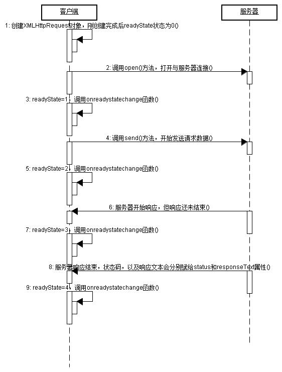

# JavaWeb基础学习笔记-Ajax

---

### 概述

1、什么是AJAX

AJAX（Asynchronous Javascript And XML）翻译成中文就是“异步Javascript和XML”。即使用Javascript语言与服务器进行异步交互，传输的数据为XML（当然，传输的数据不只是XML）。

AJAX还有一个最大的特点就是，当服务器响应时，不用刷新整个浏览器页面，而是可以局部刷新。这一特点给用户的感受是在不知不觉中完成请求和响应过程。

* 与服务器异步交互；
* 浏览器页面局部刷新；

2、同步交互与异步交互

* 同步交互：客户端发出一个请求后，需要等待服务器响应结束后，才能发出第二个请求；
* 异步交互：客户端发出一个请求后，无需等待服务器响应结束，就可以发出第二个请求。

3、AJAX的优缺点

优点：

* AJAX使用Javascript技术向服务器发送异步请求；
* AJAX无须刷新整个页面；
* 因为服务器响应内容不再是整个页面，而是页面中的局部，所以AJAX性能高；

缺点：

* AJAX并不适合所有场景，很多时候还是要使用同步交互；
* AJAX虽然提高了用户体验，但无形中向服务器发送的请求次数增多了，导致服务器压力增大；
* 因为AJAX是在浏览器中使用Javascript技术完成的，所以还需要处理浏览器兼容性问题；

### AJAX技术

1、基础使用

1）因为AJAX也需要请求服务器，异步请求也是请求服务器，所以我们需要先写好服务器端代码，即编写一个Servlet。这里，Servlet很简单，只需要输出“Hello AJAX!”。

~~~java
public class AServlet extends HttpServlet {
	public void doGet(HttpServletRequest request, HttpServletResponse response) throws ServletException, IOException {
		System.out.println("Hello AJAX!");
		response.getWriter().print("Hello AJAX!");
	}
}
~~~

2）AJAX核心（XMLHttpRequest）

其实AJAX就是在Javascript中多添加了一个对象：XMLHttpRequest对象，所有的异步交互都是使用XMLHttpRequest对象完成的。也就是说，我们只需要学习一个Javascript的新对象即可。

注意，各个浏览器对XMLHttpRequest的支持也是不同的。大多数浏览器都支持DOM2规范，都可以使用：`var xmlHttp = new XMLHttpRequest()`来创建对象；但IE有所不同，IE5.5以及更早版本需要：`var xmlHttp = new ActiveXObject(“Microsoft.XMLHTTP”)`来创建对象；而IE6中需要：`var xmlHttp = new ActiveXObject(“Msmxl2.XMLHTTP”)`来创建对象；而IE7以及更新版本也支持DOM2规范。

为了处理浏览器兼容问题，给出下面方法来创建XMLHttpRequest对象：

~~~javascript
function createXMLHttpRequest() {
	var xmlHttp;
	// 适用于大多数浏览器，以及IE7和IE更高版本
	try{
		xmlHttp = new XMLHttpRequest();
	} catch (e) {
		// 适用于IE6
		try {
			xmlHttp = new ActiveXObject("Msxml2.XMLHTTP");
		} catch (e) {
			// 适用于IE5.5，以及IE更早版本
			try{
				xmlHttp = new ActiveXObject("Microsoft.XMLHTTP");
			} catch (e){}
		}
	}			
	return xmlHttp;
}
~~~

3）打开与服务器的连接（open方法）

当得到XMLHttpRequest对象后，就可以调用该对象的open()方法打开与服务器的连接了。open()方法的参数如下：

~~~javascript
open(method, url, async)
~~~

* method：请求方式，通常为GET或POST；
* url：请求的服务器地址，例如：/ajaxdemo1/AServlet，若为GET请求，还可以在URL后追加参数；
* async：这个参数可以不给，默认值为true，表示异步请求；

~~~javascript
var xmlHttp = createXMLHttpRequest();
xmlHttp.open("GET", "/ajaxdemo1/AServlet", true);
~~~

4）发送请求

当使用open打开连接后，就可以调用XMLHttpRequest对象的send()方法发送请求了。send()方法的参数为POST请求参数，即对应HTTP协议的请求体内容，若是GET请求，需要在URL后连接参数。

注意：若没有参数，需要给出null为参数。若不给出null为参数，可能会导致FireFox浏览器不能正常发送请求。

~~~javascript
xmlHttp.send(null);
~~~

5）接收服务器响应

当请求发送出去后，服务器端Servlet就开始执行了，但服务器端的响应还没有接收到。接下来我们来接收服务器的响应。

XMLHttpRequest对象有一个onreadystatechange事件，它会在XMLHttpRequest对象的状态发生变化时被调用。下面介绍一下XMLHttpRequest对象的5种状态：

| 状态 | 描述                                                         |
| ---- | ------------------------------------------------------------ |
| 0    | 初始化未完成状态，只是创建了XMLHttpRequest对象，还未调用open()方法 |
| 1    | 请求已开始，open()方法已调用，但还没调用send()方法           |
| 2    | 请求发送完成状态，send()方法已调用                           |
| 3    | 开始读取服务器响应                                           |
| 4    | 读取服务器响应结束                                           |

onreadystatechange事件会在状态为1、2、3、4时引发。下面代码会被执行四次，对应XMLHttpRequest的四种状态。

~~~javascript
xmlHttp.onreadystatechange = function() {
	alert('hello');
};
~~~

但通常我们只关心最后一种状态，即读取服务器响应结束时，客户端才会做出改变。我们可以通过XMLHttpRequest对象的readyState属性来得到XMLHttpRequest对象的状态。

~~~javascript
xmlHttp.onreadystatechange = function() {
	if(xmlHttp.readyState == 4) {
		alert('hello');	
	}
};
~~~

其实我们还要关心服务器响应的状态码是否为200，若服务器响应为404，或500，那么就表示请求失败了。我们可以通过XMLHttpRequest对象的status属性得到服务器的状态码。

最后，我们还需要获取到服务器响应的内容，可以通过XMLHttpRequest对象的responseText得到服务器响应内容。

~~~javascript
xmlHttp.onreadystatechange = function() {
	if(xmlHttp.readyState == 4 && xmlHttp.status == 200) {
		alert(xmlHttp.responseText);	
	}
};
~~~

6）小结

* 创建XMLHttpRequest对象；
* 调用open()方法打开与服务器的连接；
* 调用send()方法发送请求；
* 为XMLHttpRequest对象指定onreadystatechange事件函数，这个函数会在XMLHttpRequest的1、2、3、4，四种状态时被调用；

XMLHttpRequest对象的5种状态：

| 状态 | 描述                                                         |
| ---- | ------------------------------------------------------------ |
| 0    | 初始化未完成状态，只是创建了XMLHttpRequest对象，还未调用open()方法 |
| 1    | 请求已开始，open()方法已调用，但还没调用send()方法           |
| 2    | 请求发送完成状态，send()方法已调用                           |
| 3    | 开始读取服务器响应                                           |
| 4    | 读取服务器响应结束                                           |

通常我们只关心4状态。XMLHttpRequest对象的status属性表示服务器状态码，它只有在readyState为4时才能获取到。XMLHttpRequest对象的responseText属性表示服务器响应内容，它只有在readyState为4时才能获取到。

2、发送POST请求

POST请求必须设置ContentType请求头的值为application/x-www-form-encoded 。表单的enctype默认值就是为application/x-www-form-encoded ，因为默认值就是这个，所以大家可能会忽略这个值。当设置了`<form>`的enctype=” application/x-www-form-encoded” 时，等同于设置了Cotnent-Type请求头。但在使用AJAX发送请求时，就没有默认值了，这需要我们自己来设置请求头：

~~~javascript
xmlHttp.setRequestHeader("Content-Type", "application/x-www-form-urlencoded");
~~~

当没有设置Content-Type请求头为application/x-www-form-urlencoded时，Web容器会忽略请求体的内容。所以，在使用AJAX发送POST请求时，需要设置这一请求头，然后使用send()方法来设置请求体内容。

~~~javascript
xmlHttp.send("b=B");
~~~

这时Servlet就可以获取到这个参数。

~~~java
public void doPost(HttpServletRequest request, HttpServletResponse response) throws ServletException, IOException {
	System.out.println(request.getParameter("b"));
	System.out.println("Hello AJAX!");
	response.getWriter().print("Hello AJAX!");
}
~~~

~~~jsp

<h1>AJAX2</h1>
<button onclick="send()">测试</button>

~~~

3、封装Ajax

~~~javascript
// 创建request对象
function createXMLHttpRequest() {
	try {
		return new XMLHttpRequest();//大多数浏览器
	} catch (e) {
		try {
			return ActvieXObject("Msxml2.XMLHTTP");//IE6.0
		} catch (e) {
			try {
				return ActvieXObject("Microsoft.XMLHTTP");//IE5.5及更早版本	
			} catch (e) {
				alert("哥们儿，您用的是什么浏览器啊？");
				throw e;
			}
		}
	}
}

/*
 * option对象有如下属性：
 *
 * 请求方式 method, 
 * 请求的url url, 
 * 是否异步 asyn, 
 * 请求体 params, 
 * 回调方法 callback,
 * 服务器响应数据转换成什么类型 type
 */
function ajax(option) {
	/*
	 * 1. 得到xmlHttp
	 */
	var xmlHttp = createXMLHttpRequest();
	/*
	 * 2. 打开连接
	 */
	if(!option.method) {//默认为GET请求
		option.method = "GET";
	}
	if(option.asyn == undefined) {//默认为异步处理
		option.asyn = true;
	}
	xmlHttp.open(option.method, option.url, option.asyn);
	/*
	 * 3. 判断是否为POST
	 */
	if("POST" == option.method) {
		xmlHttp.setRequestHeader("Content-Type", "application/x-www-form-urlencoded");
	}
	/*
	 * 4. 发送请求
	 */
	xmlHttp.send(option.params);
	/*
	 * 5. 注册监听
	 */
	xmlHttp.onreadystatechange = function() {
		if(xmlHttp.readyState == 4 && xmlHttp.status == 200) {//双重判断
			var data;
			// 获取服务器的响应数据，进行转换！
			if(!option.type) {//如果type没有赋值，那么默认为文本
				data = xmlHttp.responseText;
			} else if(option.type == "xml") {
				data = xmlHttp.responseXML;
			} else if(option.type == "text") {
				data = xmlHttp.responseText;
			} else if(option.type == "json") {
				var text = xmlHttp.responseText;
				data = eval("(" + text + ")");
			}
			// 调用回调方法
			option.callback(data);
		}
	};
};
~~~

### JSON

1、什么是JSON

JSON(JavaScript Object Notation) 是一种轻量级的数据交换格式。JSON是用字符串来表示Javascript对象，例如可以在Servlet中发送一个JSON格式的字符串给客户端Javascript，Javascript可以执行这个字符串，得到一个Javascript对象。

2、JSON对象语法

1）JSON 语法：

* 数据在名称/值对中
* 数据由逗号分隔
* 花括号保存对象
* 方括号保存数组

~~~javascript
var person = {"name":"zhangSan", "age":"18", "sex":"male"};
alert(person.name + ", " + person.age + ", " + person.sex);
~~~

注意，key也要在双引号中。

2）JSON值：

* 数字（整数或浮点数）
* 字符串（在双引号中）
* 逻辑值（true 或 false）
* 数组（在方括号中）
* 对象（在花括号中）
* null

~~~javascript
var person = {"name":"zhangSan", "age":"18", "sex":"male", "hobby":["cf", "sj", "ddm"] };
alert(person.name + ", " + person.age + ", " + person.sex + ", " + person.hobby);
~~~

带有方法的JSON对象：

~~~javascript
var person = {"name":"zhangSan", "getName":function() {return this.name;}};
alert(person.name);
alert(person.getName());
~~~

3、Java对象转换成JSON对象

Apache提供的json-lib小工具，它可以方便的使用Java语言来创建JSON字符串，也可以把JavaBean转换成JSON字符串。

1）json-lib核心jar包

json-lib的核心jar包有：　

* json-lib.jar

json-lib的依赖jar包有：

* commons-lang.jar
* commons-beanutils.jar
* commons-logging.jar
* commons-collections.jar
* ezmorph.jar

2）json-lib中的核心类

在json-lib中只有两个核心类：

* JSONObject；
* JSONArray；

3）JSONObject

JSONObject类本身是一个Map，所以学习它很方便。

~~~java
JSONObject jo = new JSONObject();
jo.put("name", "zhangSan");
jo.put("age", "18");
jo.put("sex", "male");
System.out.println(jo.toString()); 

Person person = new Person("liSi", 18, "female");
JSONObject jo = JSONObject.fromObject(person) ;
System.out.println(jo.toString());

Map map = new HashMap();
map.put("name", "wangWu");
map.put("age", "81");
map.put("sex", "male");
JSONObject jo = JSONObject.fromObject(map) ;
System.out.println(jo.toString());

String xml = "<person><name>zhaoLiu</name><age>59</age><sex>female</sex></person>";
XMLSerializer serial = new XMLSerializer();
JSONObject jo = (JSONObject)serial.read(xml); 
System.out.println(jo.toString());
~~~

4）JSONArray

JSONArray本身是一个List，所以使用起来很方便。

~~~java
JSONArray ja = new JSONArray();
Person p1 = new Person("zhangSan", 18, "male");
Person p2 = new Person("liSi", 23, "female");
ja.add(p1);
ja.add(p2);
System.out.println(ja.toString());

Person p1 = new Person("zhangSan", 18, "male");
Person p2 = new Person("liSi", 23, "female");
List<Person> list = new ArrayList<Person>();
list.add(p1);
list.add(p2);
JSONArray ja = JSONArray.fromObject(list) ;
System.out.println(ja.toString());

Person p1 = new Person("zhangSan", 18, "male");
Person p2 = new Person("liSi", 23, "female");
Person[] persons = {p1, p2};
JSONArray ja = JSONArray.fromObject(persons) ;
System.out.println(ja.toString());
~~~

5）JS解释服务器发送过来的JSON字符串

服务器发送过来JSON字符串后，客户端需要对其进行解析。这时客户端需要使用eval()方法对JSON字符串进行执行。但要注意，eval()方法在执行JSON时，必须把JSON字符串使用一对圆括号括起来。

~~~javascript
var json = "{\"name\":\"zhangSan\", \"age\":\"18\", \"sex\":\"male\"}";
var person = eval("(" + json + ")");
alert(person.name + ", " + person.age + ", " + person.sex);
~~~

   

---

