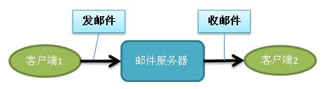
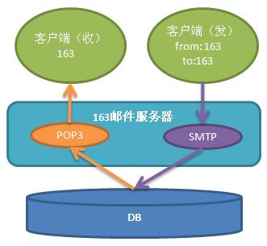
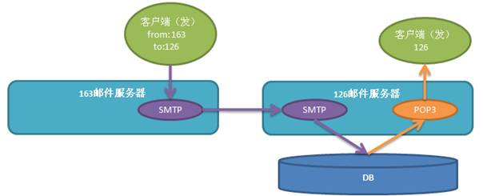
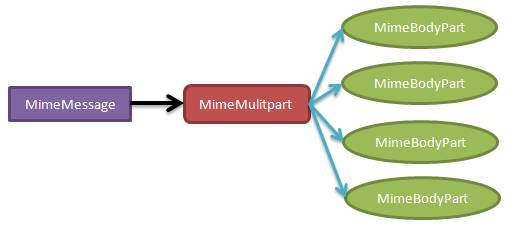

# JavaWeb基础学习笔记-JavaMail

---

### 邮件协议

1、收发邮件

发邮件是从客户端把邮件发送到邮件服务器，收邮件是把邮件服务器的邮件下载到客户端。

我们在163、126、QQ、sohu、sina等网站注册的Email账户，其实就是在邮件服务器中注册的。这些网站都有自己的邮件服务器。

2、邮件协议概述

与HTTP协议相同，收发邮件也是需要有传输协议的。

* SMTP：（Simple Mail Transfer Protocol，简单邮件传输协议）发邮件协议；
* POP3：（Post Office Protocol Version 3，邮局协议第3版）收邮件协议；
* IMAP：（Internet Message Access Protocol，因特网消息访问协议）收发邮件协议。

3、理解邮件收发过程

其实你可以把邮件服务器理解为邮局。如果你需要给朋友寄一封信，那么你需要把信放到邮筒中，这样你的信会“自动”到达邮局，邮局会把信邮到另一个省市的邮局中，然后这封信会被送到收信人的邮箱中。最终收信人需要自己经常查看邮箱是否有新的信件。

其实每个邮件服务器都由SMTP服务器和POP3服务器构成，其中SMTP服务器负责发邮件的请求，而POP3负责收邮件的请求。

当然，有时我们也会使用163的账号，向126的账号发送邮件。这时邮件是发送到126的邮件服务器，而对于163的邮件服务器是不会存储这封邮件的。

4、邮件服务器名称

* SMTP服务器的端口号为25，服务器名称为smtp.xxx.xxx。
* POP3服务器的端口号为110，服务器名称为pop3.xxx.xxx。

例如：

* 163：smtp.163.com和pop3.163.com；
* 126：smtp.126.com和pop3.126.com；
* qq：smtp.qq.com和pop3.qq.com；
* sohu：smtp.sohu.com和pop3.sohu.com；
* sina：smtp.sina.com和pop3.sina.com。

### telnet收发邮件

1、BASE64加密

BASE64是一种加密算法，这种加密方式是可逆的，它的作用是使加密后的文本无法用肉眼识别。Java提供了`sun.misc.BASE64Encoder`这个类，用来对做Base64的加密和解密。但我们知道，使用sun包下的东西会有警告，甚至在eclipse中根本使用不了这个类（需要设置）。所以我们还是听Sun公司的话，不要去使用它内部使用的类，我们去使用Apache commons组件中的codec包下的Base64这个类来完成BASE64加密和解密。

~~~java
package cn.demo;
import org.apache.commons.codec.binary.Base64;

public class Base64Utils {
	public static String encode(String s) {
		return encode(s, "utf-8");
	}
	public static String decode(String s) {
		return decode(s, "utf-8");
	}
	public static String encode(String s, String charset) {
		try {
			byte[] bytes = s.getBytes(charset);
			bytes = Base64.encodeBase64(bytes);
			return new String(bytes, charset);
		} catch (Exception e) {
			throw new RuntimeException(e);
		}
	}
	public static String decode(String s, String charset) {
		try {
			byte[] bytes = s.getBytes(charset);
			bytes = Base64.decodeBase64(bytes);
			return new String(bytes, charset);
		} catch (Exception e) {
			throw new RuntimeException(e);
		}
	}
}
~~~

2、telnet发邮件

~~~plaintext
# 连接163的smtp服务器:
telnet smtp.163.com 25

# 与服务器打招呼：ehlo 你的名字
ehlo xxx

# 发出登录请求：
auth login

# 输入加密后的邮箱名：(demo@163.com)
aXRjYXN0X2N4ZkAxNjMuY29t

# 输入加密后的邮箱密码：(demo)
aXRjYXN0

# 输入谁来发送邮件，即from：
mail from:<demo@163.com>

# 输入把邮件发给谁，即to：
rcpt to:<demo@126.com>

# 发送填写数据请求：
data

# 开始输入数据，数据包含：from、to、subject，以及邮件内容。如果输入结束后，以一个“.”为一行，表示输入结束：
from:<demo@163.com>
to:<demo@126.com>
subject: 测试邮件

这是一封测试邮件。
.

# 注意，在标题和邮件正文之间要有一个空行。当要退出时，一定要以一个“.”为单行，表示输入结束。

# 最后一步：
quit
~~~

3、telnet收邮件

1）telnet收邮件的步骤

POP3无需使用Base64加密。收邮件连接的服务器是pop3.xxx.com，POP3协议的默认端口号是110。请注意，这与发邮件完全不同。如果你在163有邮箱账户，那么你想使用telnet收邮件，需要连接的服务器是pop3.163.com。

* 连接pop3服务器：telnet pop3.163.com 110；
* user命令：user 用户名，例如：user demo@163.com；
* pass命令：pass 密码，例如：pass demo；
* stat命令：stat命令用来查看邮箱中邮件的个数，所有邮件所占的空间；
* list命令：list命令用来查看所有邮件，或指定邮件的状态，例如：list 1是查看第一封邮件的大小，list是查看邮件列表，即列出所有邮件的编号，及大小；
* retr命令：查看指定邮件的内容，例如：retr 1# ，是查看第一封邮件的内容；
* dele命令：标记某邮件为删除，但不是马上删除，而是在退出时才会真正删除；
* quit命令：退出。如果在退出之前已经使用dele命令标记了某些邮件，那么会在退出是删除它们。

### JavaMail

1、JavaMail概述

Java Mail是由Sun公司提供的专门针对邮件的API，主要Jar包：mail.jar、activation.jar。

在使用MyEclipse创建web项目时，需要小心。如果只是在web项目中使用Java Mail是没有什么问题的，发布到Tomcat上运行一点问题都没有，但是如果是在web项目中写测试那就出问题了。在MyEclipse中，会自动给web项目导入javax.mail包中的类，但是不全（其实是只有接口，而没有接口的实现类）。所以只靠MyEclipse中的类是不能运行Java Mail项目的，但是如果这时你再去自行导入mail.jar时，就会出现冲突。

处理方案：到下面路径中找到javaee.jar文件，把javax.mail删除。

`D:\Program Files\MyEclipse\Common\plugins\com.genuitec.eclipse.j2eedt.core_10.0.0.me201110301321\data\libraryset\EE_5`。

2、JavaMail中主要类

java mail中主要类：javax.mail.Session、javax.mail.internet.MimeMessage、javax.mail.Transport。

* Session：表示会话，即客户端与邮件服务器之间的会话。想获得会话需要给出账户和密码，当然还要给出服务器名称。在邮件服务中的Session对象，就相当于连接数据库时的Connection对象。
* MimeMessage：表示邮件类，它是Message的子类。它包含邮件的主题（标题）、内容、收件人地址、发件人地址，还可以设置抄送和暗送，甚至还可以设置附件。
* Transport：用来发送邮件，它是发送器。

3、JavaMail之Hello World

在使用telnet发邮件时，还需要自己来处理Base64编码的问题，但使用JavaMail就不必理会这些问题了，都由JavaMail来处理。

1）第一步：获得Session

~~~java
Session session = Session.getInstance(Properties prop, Authenticator auth); 
~~~

其中prop需要指定两个键值，一个是指定服务器主机名，另一个是指定是否需要认证。

~~~java
Properties prop = new Properties();
prop.setProperty("mail.host", "smtp.163.com"); //设置服务器主机名
prop.setProperty("mail.smtp.auth", "true"); //设置需要认证
~~~

其中Authenticator是一个接口表示认证器，即校验客户端的身份。我们需要自己来实现这个接口，实现这个接口需要使用账户和密码。

~~~java
Authenticator auth = new Authenticator() {
	public PasswordAuthentication getPasswordAuthentication () {
		new PasswordAuthentication("username", "password"); //用户名和密码
	}
};
~~~

通过上面的准备，现在可以获取得Session对象了：

~~~java
Session session = Session.getInstance(prop, auth);
~~~

2）第二步：创建MimeMessage对象

创建MimeMessage需要使用Session对象来创建：

~~~java
MimeMessage msg = new MimeMessage(session);
~~~

然后需要设置发信人地址、收信人地址、主题，以及邮件正文：

~~~java
msg.setFrom(new InternetAddress("demo@163.com")); //设置发信人
msg.addRecipients(RecipientType.TO, "demo@qq.com,demo@sina.com"); //设置多个收信人
msg.addRecipients(RecipientType.CC, "demo@sohu.com,demo@126.com"); //设置多个抄送
msg.addRecipients(RecipientType.BCC, "demo@hotmail.com"); //设置暗送
msg.setSubject("这是一封测试邮件"); //设置主题（标题）
msg.setContent("当然是hello world!", "text/plain;charset=utf-8"); //设置正文
~~~

第三步：发送邮件

~~~java
Transport.send(msg); //发送邮件
~~~

4、JavaMail发送带有附件的邮件

一封邮件可以包含正文以及附件N个，所以正文与N个附件都是邮件的一个部份。

上面的hello world案例中，只是发送了带有正文的邮件，所以在调用setContent()方法时直接设置了正文。如果想发送带有附件邮件，那么需要设置邮件的内容为MimeMultiPart。

~~~java
MimeMulitpart parts = new MimeMulitpart(); //多部件对象，可以理解为是部件的集合
msg.setContent(parts); //设置邮件的内容为多部件内容。
~~~

然后我们需要把正文和N个附件创建为“主体部件”对象（MimeBodyPart），添加到MimeMuiltPart中即可。

~~~java
MimeBodyPart part1 = new MimeBodyPart(); //创建一个部件
part1.setCotnent("这是正文部分", "text/html;charset=utf-8"); //给部件设置内容
parts.addBodyPart(part1); //把部件添加到部件集中。
~~~

下面我们创建一个附件：

~~~java
MimeBodyPart part2 = new MimeBodyPart(); //创建一个部件
part2.attachFile("F:\\a.jpg"); //设置附件
part2.setFileName("hello.jpg"); //设置附件名称
parts.addBodyPart(part2); //把附件添加到部件集中
~~~

注意，如果在设置文件名称时，文件名称中包含了中文的话，那么需要使用MimeUitlity类来给中文编码：

~~~java
part2.setFileName(MimeUitlity.encodeText("美女.jpg"));
~~~

   

---

