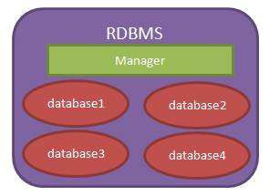
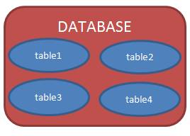
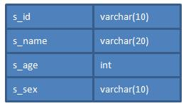
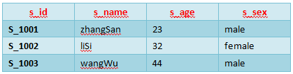
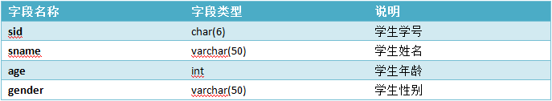
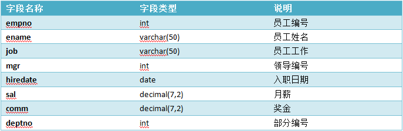
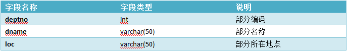
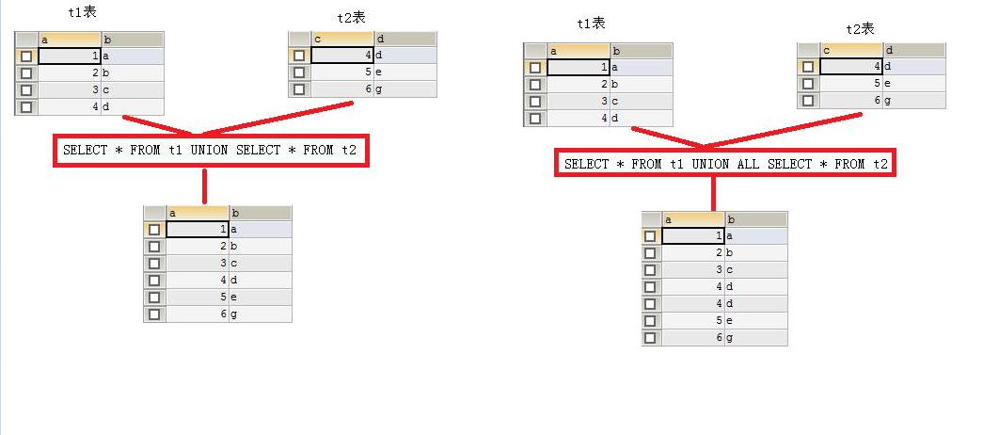
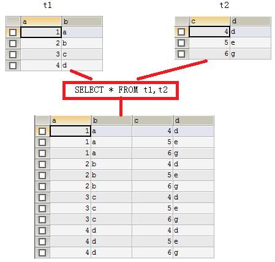

# JavaWeb基础学习笔记-MySQL

---

### 数据库概念

1、什么是数据库

数据库就是用来存储和管理数据的仓库。数据库存储数据的优势：

* 可存储大量数据；
* 方便检索；
* 保持数据的一致性、完整性；
* 安全，可共享；
* 通过组合分析，可产生新数据。

2、数据库的发展历程

* 没有数据库，使用磁盘文件存储数据；
* 层次结构模型数据库；
* 网状结构模型数据库；
* 关系结构模型数据库：使用二维表格来存储数据；
* 关系-对象模型数据库；

MySQL就是关系型数据库。

3、常见数据库

* Oracle（神喻）：甲骨文；
* DB2：IBM；
* SQL Server：微软；
* Sybase：赛尔斯；
* MySQL：甲骨文；

4、理解数据库

* RDBMS = 管理员（manager）+仓库（database）
* database = N个table
* table：（1）表结构：定义表的列名和列类型；（2）表记录：一行一行的记录；

我们现在所说的数据库泛指“关系型数据库管理系统（RDBMS - Relational Database Management System ）”，即“数据库服务器”。

当我们安装了数据库服务器后，就可以在数据库服务器中创建数据库，每个数据库中还可以包含多张表。

数据库表就是一个多行多列的表格。在创建表时，需要指定表的列数，以及列名称、列类型等信息。而不用指定表格的行数，行数是没有上限的。下面是tab_student表的结构：

当把表格创建好了之后，就可以向表格中添加数据了，向表格添加数据是以行为单位的。下面是s_student表的记录：

5、应用程序与数据库

应用程序使用数据库完成对数据的存储。

### MySQL基本命令

1、启动和关闭MySQL服务器

~~~plaintext
# 启动
net start mysql
# 关闭
net stop mysql
~~~

在启动MySQL服务后，打开windows任务管理器，会有一个名为mysqld.exe的进程运行，所以mysqld.exe才是MySQL服务器程序。

2、客户端登录退出MySQL

在启动MySQL服务器后，我们需要使用管理员用户登录MySQL服务器，然后来对服务器进行操作。登录MySQL需要使用MySQL的客户端程序：mysql.exe

~~~plaintext
# 登录
mysql -u root -p 123 -h localhost
~~~

* -u：后面的root是用户名，这里使用的是超级管理员root；
* -p：后面的123是密码，这是在安装MySQL时就已经指定的密码；
* -h：后面给出的localhost是服务器主机名，它是可以省略的，例如：`mysql -u root -p 123`；

在登录成功后，打开windows任务管理器，会有一个名为mysql.exe的进程运行，所以mysql.exe是客户端程序。

~~~plaintext
# 退出
quit或exit
~~~

### SQL语句

1、SQL概述

1）什么是SQL

SQL（Structured Query Language）是“结构化查询语言”，它是对关系型数据库的操作语言。它可以应用到所有关系型数据库中，例如：MySQL、Oracle、SQL Server等。SQL标准（ANSI/ISO）有：

* SQL-92：1992年发布的SQL语言标准；
* SQL:1999：1999年发布的SQL语言标签；
* SQL:2003：2003年发布的SQL语言标签；

这些标准就与JDK的版本一样，在新的版本中总要有一些语法的变化，不同时期的数据库对不同标准做了实现。虽然SQL可以用在所有关系型数据库中，但很多数据库还都有标准之后的一些语法，我们可以称之为“方言”。例如MySQL中的LIMIT语句就是MySQL独有的方言，其它数据库都不支持。当然，Oracle或SQL Server也都有自己的方言。

2）语法要求

* SQL语句可以单行或多行书写，以分号结尾；
* 可以用空格和缩进来来增强语句的可读性；
* 关键字不区别大小写，建议使用大写；

2、分类

* DDL（Data Definition Language）：数据定义语言，用来定义数据库对象：库、表、列等；
* DML（Data Manipulation Language）：数据操作语言，用来定义数据库记录（数据）；
* DCL（Data Control Language）：数据控制语言，用来定义访问权限和安全级别；
* DQL（Data Query Language）：数据查询语言，用来查询记录（数据）。

3、DDL

1）基本操作

~~~sql
--查看所有数据库名称
SHOW DATABASES；

--切换数据库
USE mydb1； --切换到mydb1数据库
~~~

2）操作数据库

~~~sql
--创建数据库
CREATE DATABASE [IF NOT EXISTS] mydb1；
~~~

创建数据库，例如：`CREATE DATABASE mydb1`，创建一个名为mydb1的数据库。如果这个数据已经存在，那么会报错。但是如果用`CREATE DATABASE IF NOT EXISTS mydb1`，在名为mydb1的数据库不存在时创建该库，这样可以避免报错。

~~~sql
--删除数据库
DROP DATABASE [IF EXISTS] mydb1；
~~~

删除数据库，例如：`DROP DATABASE mydb1`，删除名为mydb1的数据库。如果这个数据库不存在，那么会报错。`DROP DATABASE IF EXISTS mydb1`，就算mydb1不存在，也不会的报错。

~~~sql
--修改数据库编码
ALTER DATABASE mydb1 CHARACTER SET utf8;
~~~

修改数据库mydb1的编码为utf8。注意，在MySQL中所有的UTF-8编码都不能使用中间的“-”，即UTF-8要书写为UTF8。

3）数据类型

MySQL与Java一样，也有数据类型。MySQL中数据类型主要应用在列上。

常用类型：

| 类型      | 描述                                                         |
| --------- | ------------------------------------------------------------ |
| int       | 整型                                                         |
| double    | 浮点型，例如double(5,2)表示最多5位，其中必须有2位小数，即最大值为999.99 |
| decimal   | 泛型型，在表单钱方面使用该类型，因为不会出现精度缺失问题     |
| char      | 固定长度字符串类型                                           |
| varchar   | 可变长度字符串类型                                           |
| text      | 字符串类型                                                   |
| blob      | 字节类型                                                     |
| date      | 日期类型，格式为：yyyy-MM-dd                                 |
| time      | 时间类型，格式为：hh:mm:ss                                   |
| timestamp | 时间戳类型                                                   |

4）操作表

* 创建表：

~~~sql
CREATE TABLE 表名(
	列名 列类型,
	列名 列类型,
	......
);
~~~

例如：

~~~sql
CREATE TABLE stu(
	sid	    CHAR(6),
	sname	VARCHAR(20),
	age		INT,
	gender	VARCHAR(10) 
);

CREATE TABLE emp(
	eid		CHAR(6),
	ename	VARCHAR(50),
	age		INT,
	gender	VARCHAR(6),
	birthday	DATE,
	hiredate	DATE,
	salary	DECIMAL(7,2),
	resume	VARCHAR(1000)
);
~~~

* 查看当前数据库中所有表名称：SHOW TABLES；　
* 查看指定表的创建语句：SHOW CREATE TABLE emp，查看emp表的创建语句；
* 查看表结构：DESC emp，查看emp表结构；
* 删除表：DROP TABLE emp，删除emp表；
* 修改表：

~~~sql
-- 1. 修改之添加列：给stu表添加classname列：
ALTER TABLE stu ADD (classname varchar(100));

-- 2. 修改之修改列类型：修改stu表的gender列类型为CHAR(2)：
ALTER TABLE stu MODIFY gender CHAR(2);

-- 3. 修改之修改列名：修改stu表的gender列名为sex：
ALTER TABLE stu change gender sex CHAR(2);

-- 4. 修改之删除列：删除stu表的classname列：
ALTER TABLE stu DROP classname;

-- 5. 修改之修改表名称：修改stu表名称为student：
ALTER TABLE stu RENAME TO student;
~~~

4、DML

1）插入数据

语法：INSERT INTO 表名(列名1,列名2, …) VALUES(值1, 值2)

~~~sql
INSERT INTO stu(sid, sname,age,gender) VALUES('s_1001', 'zhangSan', 23, 'male');

INSERT INTO stu(sid, sname) VALUES('s_1001', 'zhangSan'); 
~~~

语法：INSERT INTO 表名 VALUES(值1,值2,…)

因为没有指定要插入的列，表示按创建表时列的顺序插入所有列的值：

~~~sql
INSERT INTO stu VALUES('s_1002', 'liSi', 32, 'female');
~~~

注意：所有字符串数据必须使用单引号。

2）修改数据

语法：UPDATE 表名 SET 列名1=值1, … 列名n=值n [WHERE 条件]

~~~sql
UPDATE stu SET sname=’zhangSanSan’, age=’32’, gender=’female’ WHERE sid=’s_1001’;

UPDATE stu SET sname=’liSi’, age=’20’ WHERE age>50 AND gender=’male’;

UPDATE stu SET sname=’wangWu’, age=’30’ WHERE age>60 OR gender=’female’;

UPDATE stu SET gender=’female’ WHERE gender IS NULL

UPDATE stu SET age=age+1 WHERE sname=’zhaoLiu’;
~~~

3）删除数据

语法：DELETE FROM 表名 [WHERE 条件]

~~~sql
DELETE FROM stu WHERE sid=’s_1001’003B
DELETE FROM stu WHERE sname=’chenQi’ OR age > 30;
DELETE FROM stu; 
~~~

语法：TRUNCATE TABLE 表名

~~~sql
TRUNCATE TABLE stu;
~~~

虽然TRUNCATE和DELETE都可以删除表的所有记录，但原理不同。DELETE的效率没有TRUNCATE高。

TRUNCATE其实属性DDL语句，因为它是先DROP TABLE，再CREATE TABLE。而且TRUNCATE删除的记录是无法回滚的，但DELETE删除的记录是可以回滚的。

5、DCL

1）创建用户

语法：CREATE USER 用户名@地址 IDENTIFIED BY '密码';

~~~sql
CREATE USER user1@localhost IDENTIFIED BY '123'; 
CREATE USER user2@’%’ IDENTIFIED BY '123'; 
~~~

2）给用户授权

语法：GRANT 权限1, … , 权限n ON 数据库.* TO 用户名

~~~sql
GRANT CREATE,ALTER,DROP,INSERT,UPDATE,DELETE,SELECT ON mydb1.* TO user1@localhost;
GRANT ALL ON mydb1.* TO user2@localhost;
~~~

3）撤销授权

语法：REVOKE 权限1, … , 权限n ON 数据库.* FORM 用户名

~~~sql
REVOKE CREATE,ALTER,DROP ON mydb1.* FROM user1@localhost;
~~~

4）查看用户权限

语法：SHOW GRANTS FOR 用户名

~~~sql
SHOW GRANTS FOR user1@localhost;
~~~

5）删除用户

语法：DROP USER 用户名

~~~sql
DROP USER user1@localhost;
~~~

6）修改用户密码

语法：

USE mysql;
UPDATE USER SET PASSWORD=PASSWORD(‘密码’) WHERE User=’用户名’ and Host=’IP’;
FLUSH PRIVILEGES;

~~~sql
USE mysql;
UPDATE USER SET PASSWORD=PASSWORD('1234') WHERE User='user2' and Host=’localhost’;
FLUSH PRIVILEGES;
~~~

### 数据查询语法（DQL）

DQL就是数据查询语言，数据库执行DQL语句不会对数据进行改变，而是让数据库发送结果集给客户端。

语法：

~~~sql
SELECT selection_list /*要查询的列名称*/
FROM table_list /*要查询的表名称*/
WHERE condition /*行条件*/
GROUP BY grouping_columns /*对结果分组*/
HAVING condition /*分组后的行条件*/
ORDER BY sorting_columns /*对结果分组*/
LIMIT offset_start, row_count /*结果限定*/
~~~

示例表：

~~~sql
CREATE TABLE stu (
	sid	   CHAR(6),
	sname  VARCHAR(50),
	age    INT,
	gender VARCHAR(50)
);

INSERT INTO stu VALUES('S_1001', 'liuYi', 35, 'male');
INSERT INTO stu VALUES('S_1002', 'chenEr', 15, 'female');
INSERT INTO stu VALUES('S_1003', 'zhangSan', 95, 'male');
INSERT INTO stu VALUES('S_1004', 'liSi', 65, 'female');
INSERT INTO stu VALUES('S_1005', 'wangWu', 55, 'male');
INSERT INTO stu VALUES('S_1006', 'zhaoLiu', 75, 'female');
INSERT INTO stu VALUES('S_1007', 'sunQi', 25, 'male');
INSERT INTO stu VALUES('S_1008', 'zhouBa', 45, 'female');
INSERT INTO stu VALUES('S_1009', 'wuJiu', 85, 'male');
INSERT INTO stu VALUES('S_1010', 'zhengShi', 5, 'female');
INSERT INTO stu VALUES('S_1011', 'xxx', NULL, NULL);
~~~

~~~sql
CREATE TABLE emp(
	empno    INT,
	ename    VARCHAR(50),
	job	     VARCHAR(50),
	mgr      INT,
	hiredate DATE,
	sal      DECIMAL(7,2),
	comm     decimal(7,2),
	deptno   INT
) ;

INSERT INTO emp values(7369,'SMITH','CLERK',7902,'1980-12-17',800,NULL,20);
INSERT INTO emp values(7499,'ALLEN','SALESMAN',7698,'1981-02-20',1600,300,30);
INSERT INTO emp values(7521,'WARD','SALESMAN',7698,'1981-02-22',1250,500,30);
INSERT INTO emp values(7566,'JONES','MANAGER',7839,'1981-04-02',2975,NULL,20);
INSERT INTO emp values(7654,'MARTIN','SALESMAN',7698,'1981-09-28',1250,1400,30);
INSERT INTO emp values(7698,'BLAKE','MANAGER',7839,'1981-05-01',2850,NULL,30);
INSERT INTO emp values(7782,'CLARK','MANAGER',7839,'1981-06-09',2450,NULL,10);
INSERT INTO emp values(7788,'SCOTT','ANALYST',7566,'1987-04-19',3000,NULL,20);
INSERT INTO emp values(7839,'KING','PRESIDENT',NULL,'1981-11-17',5000,NULL,10);
INSERT INTO emp values(7844,'TURNER','SALESMAN',7698,'1981-09-08',1500,0,30);
INSERT INTO emp values(7876,'ADAMS','CLERK',7788,'1987-05-23',1100,NULL,20);
INSERT INTO emp values(7900,'JAMES','CLERK',7698,'1981-12-03',950,NULL,30);
INSERT INTO emp values(7902,'FORD','ANALYST',7566,'1981-12-03',3000,NULL,20);
INSERT INTO emp values(7934,'MILLER','CLERK',7782,'1982-01-23',1300,NULL,10);
~~~

~~~sql
CREATE TABLE dept(
	deptno INT,
	dname  varchar(14),
	loc    varchar(13)
);

INSERT INTO dept values(10, 'ACCOUNTING', 'NEW YORK');
INSERT INTO dept values(20, 'RESEARCH', 'DALLAS');
INSERT INTO dept values(30, 'SALES', 'CHICAGO');
INSERT INTO dept values(40, 'OPERATIONS', 'BOSTON');
~~~

1、基础查询

1）查询所有列

~~~sql
SELECT * FROM stu;
~~~

2）查询指定列

~~~sql
SELECT sid, sname, age FROM stu;
~~~

2、条件查询

条件查询就是在查询时给出WHERE子句，在WHERE子句中可以使用如下运算符及关键字：

| 符号                    | 描述 |
| ----------------------- | ---- |
| =、!=、<>、<、<=、>、>= |      |
| BETWEEN…AND             |      |
| IN(set)                 |      |
| IS NULL                 |      |
| AND                     |      |
| OR                      |      |
| NOT                     |      |

~~~sql
-- 查询性别为女，并且年龄50的记录
SELECT * FROM stu WHERE gender='female' AND age<50;

-- 查询学号为S_1001，或者姓名为liSi的记录
SELECT * FROM stu WHERE sid ='S_1001' OR sname='liSi';

-- 查询学号为S_1001，S_1002，S_1003的记录
SELECT * FROM stu WHERE sid IN ('S_1001','S_1002','S_1003');

-- 查询学号不是S_1001，S_1002，S_1003的记录
SELECT * FROM tab_student WHERE s_number NOT IN ('S_1001','S_1002','S_1003');

-- 查询年龄为null的记录
SELECT * FROM stu WHERE age IS NULL;

-- 查询年龄在20到40之间的学生记录
SELECT * FROM stu WHERE age>=20 AND age<=40;
-- 或者
SELECT * FROM stu WHERE age BETWEEN 20 AND 40;

-- 查询性别非男的学生记录
SELECT * FROM stu WHERE gender!='male';
-- 或者
SELECT * FROM stu WHERE gender<>'male';
-- 或者
SELECT * FROM stu WHERE NOT gender='male';

-- 查询姓名不为null的学生记录
SELECT * FROM stu WHERE NOT sname IS NULL;
-- 或者
SELECT * FROM stu WHERE sname IS NOT NULL;
~~~

3、模糊查询

当想查询姓名中包含a字母的学生时就需要使用模糊查询了。模糊查询需要使用关键字LIKE。

~~~sql
-- 查询姓名由5个字母构成的学生记录
SELECT * FROM stu WHERE sname LIKE '_____';
-- 模糊查询必须使用LIKE关键字。其中 “_”匹配任意一个字母，5个“_”表示5个任意字母。

-- 查询姓名由5个字母构成，并且第5个字母为“i”的学生记录
SELECT * FROM stu WHERE sname LIKE '____i';

-- 查询姓名以“z”开头的学生记录
SELECT * FROM stu WHERE sname LIKE 'z%';
-- 其中“%”匹配0~n个任何字母。

-- 查询姓名中第2个字母为“i”的学生记录
SELECT * FROM stu WHERE sname LIKE '_i%';

-- 查询姓名中包含“a”字母的学生记录
SELECT * FROM stu WHERE sname LIKE '%a%';
~~~

4、字段控制查询

1）去除重复记录

去除重复记录（两行或两行以上记录中系列的上的数据都相同），例如emp表中sal字段就存在相同的记录。当只查询emp表的sal字段时，那么会出现重复记录，那么想去除重复记录，需要使用DISTINCT：

~~~sql
SELECT DISTINCT sal FROM emp;
~~~

2）查看雇员的月薪与佣金之和

因为sal和comm两列的类型都是数值类型，所以可以做加运算。如果sal或comm中有一个字段不是数值类型，那么会出错。

~~~sql
SELECT *, sal+comm FROM emp;
~~~

comm列有很多记录的值为NULL，因为任何东西与NULL相加结果还是NULL，所以结算结果可能会出现NULL。下面使用了把NULL转换成数值0的函数IFNULL：

~~~sql
SELECT *, sal+IFNULL(comm,0) FROM emp;
~~~

3）给列名添加别名

在上面查询中出现列名为sal+IFNULL(comm,0)，这很不美观，现在我们给这一列给出一个别名，为total：

~~~sql
SELECT *, sal+IFNULL(comm,0) AS total FROM emp;
~~~

给列起别名时，是可以省略AS关键字的：

~~~sql
SELECT *, sal+IFNULL(comm,0) total FROM emp;
~~~

5、排序

~~~sql
-- 查询所有学生记录，按年龄升序排序
SELECT * FROM stu ORDER BY age ASC;
-- 或者
SELECT * FROM stu ORDER BY age;

-- 查询所有学生记录，按年龄降序排序
SELECT * FROM stu ORDER BY age DESC;

-- 查询所有雇员，按月薪降序排序，如果月薪相同时，按编号升序排序
SELECT * FROM emp ORDER BY sal DESC,empno ASC;
~~~

6、聚合函数

聚合函数是用来做纵向运算的函数：

| 函数名  | 描述                                                         |
| ------- | ------------------------------------------------------------ |
| COUNT() | 统计指定列不为NULL的记录行数                                 |
| MAX()   | 计算指定列的最大值，如果指定列是字符串类型，那么使用字符串排序运算 |
| MIN()   | 计算指定列的最小值，如果指定列是字符串类型，那么使用字符串排序运算 |
| SUM()   | 计算指定列的数值和，如果指定列类型不是数值类型，那么计算结果为0 |
| AVG()   | 计算指定列的平均值，如果指定列类型不是数值类型，那么计算结果为0 |

1）COUNT

当需要纵向统计时可以使用COUNT()。

~~~sql
-- 查询emp表中记录数：
SELECT COUNT(*) AS cnt FROM emp;

-- 查询emp表中有佣金的人数：
SELECT COUNT(comm) cnt FROM emp;
-- 注意，因为count()函数中给出的是comm列，那么只统计comm列非NULL的行数。

-- 查询emp表中月薪大于2500的人数：
SELECT COUNT(*) FROM emp WHERE sal > 2500;

-- 统计月薪与佣金之和大于2500元的人数：
SELECT COUNT(*) AS cnt FROM emp WHERE sal+IFNULL(comm,0) > 2500;

-- 查询有佣金的人数，以及有领导的人数：
SELECT COUNT(comm), COUNT(mgr) FROM emp;
~~~

2）SUM和AVG

当需要纵向求和时使用sum()函数。

~~~sql
-- 查询所有雇员月薪和：
SELECT SUM(sal) FROM emp;

-- 查询所有雇员月薪和，以及所有雇员佣金和：
SELECT SUM(sal), SUM(comm) FROM emp;

-- 查询所有雇员月薪+佣金和：
SELECT SUM(sal+IFNULL(comm,0)) FROM emp;

-- 统计所有员工平均工资：
SELECT SUM(sal)/COUNT(sal) FROM emp;
-- 或者
SELECT AVG(sal) FROM emp;
~~~

3）MAX和MIN

~~~sql
-- 查询最高工资和最低工资：
SELECT MAX(sal), MIN(sal) FROM emp;
~~~

7、分组查询

当需要分组查询时需要使用GROUP BY子句，例如查询每个部门的工资和，这说明要使用部分来分组。

1）分组查询

~~~sql
-- 查询每个部门的部门编号和每个部门的工资和：
SELECT deptno, SUM(sal) FROM emp GROUP BY deptno;

-- 查询每个部门的部门编号以及每个部门的人数：
SELECT deptno,COUNT(*) FROM emp GROUP BY deptno;

-- 查询每个部门的部门编号以及每个部门工资大于1500的人数：
SELECT deptno,COUNT(*) FROM emp WHERE sal>1500 GROUP BY deptno;
~~~

2）HAVING子句

~~~sql
-- 查询工资总和大于9000的部门编号以及工资和：
SELECT deptno, SUM(sal) FROM emp GROUP BY deptno HAVING SUM(sal) > 9000;
~~~

注意，WHERE是对分组前记录的条件，如果某行记录没有满足WHERE子句的条件，那么这行记录不会参加分组；而HAVING是对分组后数据的约束。

8、LIMIT

LIMIT用来限定查询结果的起始行，以及总行数。

~~~sql
-- 查询5行记录，起始行从0开始
SELECT * FROM emp LIMIT 0, 5;
-- 注意，起始行从0开始，即第一行开始。

-- 查询10行记录，起始行从3开始
SELECT * FROM emp LIMIT 3, 10;
~~~

分页查询：如果一页记录为10条，希望查看第3页记录应该怎么查呢？

* 第一页记录起始行为0，一共查询10行；
* 第二页记录起始行为10，一共查询10行；
* 第三页记录起始行为20，一共查询10行；

### 完整性约束

完整性约束是为了表的数据的正确性。如果数据不正确，那么一开始就不能添加到表中。

1、主键

当某一列添加了主键约束后，那么这一列的数据就不能重复出现，这样每行记录中其主键列的值就是这一行的唯一标识。例如学生的学号可以用来做唯一标识，而学生的姓名是不能做唯一标识的，因为学习有可能同名。主键列的值不能为NULL，也不能重复。指定主键约束使用PRIMARY KEY关键字。

* 创建表：定义列时指定主键；

~~~sql
CREATE TABLE stu(
	sid	    CHAR(6) PRIMARY KEY,
	sname	VARCHAR(20),
	age		INT,
	gender	VARCHAR(10) 
);
~~~

* 创建表：定义列之后独立指定主键；

~~~sql
CREATE TABLE stu(
	sid	    CHAR(6),
	sname	VARCHAR(20),
	age		INT,
	gender	VARCHAR(10),
	PRIMARY KEY(sid)
);
~~~

* 修改表时指定主键；

~~~sql
ALTER TABLE stu ADD PRIMARY KEY(sid);
~~~

* 删除主键（只是删除主键约束，而不会删除主键列）；

~~~sql
ALTER TABLE stu DROP PRIMARY KEY;
~~~

2、主键自增长

MySQL提供了主键自动增长的功能，这样用户就不用再为是否有主键是否重复而烦恼了。当主键设置为自动增长后，在没有给出主键值时，主键的值会自动生成，而且是最大主键值+1，也就不会出现重复主键的可能了。

* 创建表时设置主键自增长（主键必须是整型才可以自增长）：

~~~sql
CREATE TABLE stu(
		sid INT PRIMARY KEY AUTO_INCREMENT,
		sname	VARCHAR(20),
		age		INT,
		gender	VARCHAR(10)
);
~~~

* 修改表时设置主键自增长：

~~~sql
ALTER TABLE stu CHANGE sid sid INT AUTO_INCREMENT;
~~~

* 修改表时删除主键自增长：

~~~sql
ALTER TABLE stu CHANGE sid sid INT;
~~~

3、非空

指定非空约束的列不能没有值，也就是说在插入记录时，对添加了非空约束的列一定要给值；在修改记录时，不能把非空列的值设置为NULL。

指定非空约束：

~~~sql
CREATE TABLE stu(
	sid 	INT PRIMARY KEY AUTO_INCREMENT,
	sname 	VARCHAR(10) NOT NULL,
	age		INT,
	gender	VARCHAR(10)
);
~~~

当为sname字段指定为非空后，在向stu表中插入记录时，必须给sname字段指定值，否则会报错：

~~~sql
INSERT INTO stu(sid) VALUES(1);
~~~

插入的记录中sname没有指定值，所以会报错。

4、唯一

还可以为字段指定唯一约束。当为字段指定唯一约束后，那么字段的值必须是唯一的，这一点与主键相似。例如给stu表的sname字段指定唯一约束：

~~~sql
CREATE TABLE tab_ab(
	sid INT PRIMARY KEY AUTO_INCREMENT,
	sname VARCHAR(10) UNIQUE
);

INSERT INTO sname(sid, sname) VALUES(1001, 'zs');
INSERT INTO sname(sid, sname) VALUES(1002, 'zs');
~~~

当两次插入相同的名字时，MySQL会报错。

5、外键

主外键是构成表与表关联的唯一途径。外键是另一张表的主键，例如员工表与部门表之间就存在关联关系，其中员工表中的部门编号字段就是外键，是相对部门表的外键。

* 创建t_user表，指定uid为主键列：

~~~sql
CREATE TABLE t_user(
	uid		INT PRIMARY KEY AUTO_INCREMENT,
	uname	VARCHAR(20) UNIQUE NOT NULL
);
~~~

* 创建t_section表，指定sid为主键列，u_id为相对t_user表的uid列的外键：

~~~sql
CREATE TABLE t_section(
	sid	INT PRIMARY KEY AUTO_INCREMENT,
	sname	VARCHAR(30),
	u_id	INT,
	CONSTRAINT fk_t_user FOREIGN KEY(u_id) REFERENCES t_user(uid)
);
~~~

* 修改t_section表，指定u_id为相对t_user表的uid列的外键：

~~~sql
ALTER TABLE t_section 
ADD CONSTRAINT fk_t_user 
FOREIGN KEY(u_id) 
REFERENCES t_user(uid);
~~~

* 修改t_section表，删除u_id的外键约束：

~~~sql
ALTER TABLE t_section
DROP FOREIGN KEY fk_t_user;
~~~

6、表与表之间的关系

* 一对一：例如t_person表和t_card表，即人和身份证。这种情况需要找出主从关系，即谁是主表，谁是从表。人可以没有身份证，但身份证必须要有人才行，所以人是主表，而身份证是从表。设计从表可以有两种方案：
1）在t_card表中添加外键列（相对t_user表），并且给外键添加唯一约束；
2）给t_card表的主键添加外键约束（相对t_user表），即t_card表的主键也是外键。
* 一对多（多对一）：最为常见的就是一对多。一对多和多对一，这是从哪个角度去看得出来的。t_user和t_section的关系，从t_user来看就是一对多，而从t_section的角度来看就是多对一，这种情况都是在多方创建外键。
* 多对多：例如t_stu和t_teacher表，即一个学生可以有多个老师，而一个老师也可以有多个学生。这种情况通常需要创建中间表来处理多对多关系。例如再创建一张表t_stu_tea表，给出两个外键，一个相对t_stu表的外键，另一个相对t_teacher表的外键。

### MySQL编码

1、查看编码

~~~sql
SHOW VARIABLES LIKE 'char%';
~~~

因为当初安装时指定了字符集为UTF8，所以所有的编码都是UTF8。

* character_set_client：你发送的数据必须与client指定的编码一致，服务器会使用该编码来解读客户端发送过来的数据；
* character_set_connection：通过该编码与client一致，该编码不会导致乱码。当执行的是查询语句时，客户端发送过来的数据会先转换成connection指定的编码。但只要客户端发送过来的数据与client指定的编码一致，那么转换就不会出现问题；
* character_set_database：数据库默认编码，在创建数据库时，如果没有指定编码，那么默认使用database编码；
* character_set_server：MySQL服务器默认编码；
* character_set_results：响应的编码，即查询结果返回给客户端的编码。这说明客户端必须使用result指定的编码来解码；

2、控制台编码

修改character_set_client、character_set_results、character_set_connection为GBK，就不会出现乱码了。但其实只需要修改character_set_client和character_set_results。

控制台的编码只能是GBK，而不能修改为UTF8，这就出现一个问题。客户端发送的数据是GBK，而character_set_client为UTF8，这就说明客户端数据到了服务器端后一定会出现乱码。既然不能修改控制台的编码，那么只能修改character_set_client为GBK了。

服务器发送给客户端的数据编码为character_set_result，它如果是UTF8，那么控制台使用GBK解码也一定会出现乱码。因为无法修改控制台编码，所以只能把character_set_result修改为GBK。

* 修改character_set_client变量：set character_set_client=gbk;
* 修改character_set_results变量：set character_set_results=gbk;

设置编码只对当前连接有效，这说明每次登录MySQL提示符后都要去修改这两个编码，但可以通过修改配置文件来处理这一问题：配置文件路径：D:\Program Files\MySQL\MySQL Server 5.1\ my.ini

### 数据库备份与还原

1、生成SQL脚本

在控制台使用mysqldump命令可以用来生成指定数据库的脚本文本。但要注意，脚本文本中只包含数据库的内容，而不会存在创建数据库的语句。所以在恢复数据时，还需要自已手动创建一个数据库之后再去恢复数据。

~~~sql
mysqldump –u用户名 –p密码 数据库名>生成的脚本文件路径
~~~

注意，mysqldump命令是在Windows控制台下执行，无需登录mysql。

2、执行SQL脚本

执行SQL脚本需要登录mysql，然后进入指定数据库，才可以执行SQL脚本。

执行SQL脚本不只是用来恢复数据库，也可以在平时编写SQL脚本，然后使用执行SQL 脚本来操作数据库。大家都知道，在黑屏下编写SQL语句时，就算发现了错误，可能也不能修改了。所以我建议大家使用脚本文件来编写SQL代码，然后执行之。

~~~sql
SOURCE C:\mydb1.sql
~~~

注意，在执行脚本时需要先行核查当前数据库中的表是否与脚本文件中的语句有冲突。例如在脚本文件中存在create table a的语句，而当前数据库中已经存在了a表，那么就会出错。

还可以通过下面的方式来执行脚本文件：

~~~sql
mysql –u用户名 –p密码 数据库<要执行脚本文件路径
mysql -uroot -p123 mydb1<c:\mydb1.sql
~~~

### 多表查询

1、合并结果集

合并结果集就是把两个select语句的查询结果合并到一起。合并结果集有两种方式：

* UNION：去除重复记录，例如：`SELECT * FROM t1 UNION SELECT * FROM t2`；
* UNION ALL：不去除重复记录，例如：`SELECT * FROM t1 UNION ALL SELECT * FROM t2`。

被合并的两个结果：列数、列类型必须相同。

2、连接查询

连接查询就是求出多个表的乘积，例如t1连接t2，那么查询出的结果就是t1*t2。

连接查询会产生笛卡尔积，假设集合A={a,b}，集合B={0,1,2}，则两个集合的笛卡尔积为{(a,0),(a,1),(a,2),(b,0),(b,1),(b,2)}。可以扩展到多个集合的情况。

那么多表查询产生这样的结果并不是我们想要的，那么怎么去除重复的，不想要的记录呢，当然是通过条件过滤。通常要查询的多个表之间都存在关联关系，那么就通过关联关系去除笛卡尔积。

你能想像到emp和dept表连接查询的结果么？emp一共14行记录，dept表一共4行记录，那么连接后查询出的结果是56行记录。也就你只是想在查询emp表的同时，把每个员工的所在部门信息显示出来，那么就需要使用主外键来去除无用信息了。

使用主外键关系做为条件来去除无用信息：

~~~sql
SELECT * FROM emp,dept WHERE emp.deptno=dept.deptno ;
~~~

上面查询结果会把两张表的所有列都查询出来，也许你不需要那么多列，这时就可以指定要查询的列了。

~~~sql
SELECT emp.ename,emp.sal,emp.comm,dept.dname 
FROM emp,dept 
WHERE emp.deptno=dept.deptno;
~~~

还可以为表指定别名，然后在引用列时使用别名即可：

~~~sql
SELECT e.ename,e.sal,e.comm,d.dname 
FROM emp AS e,dept AS d
WHERE e.deptno=d.deptno; 
~~~

1）内连接

上面的连接语句就是内连接，但它不是SQL标准中的查询方式，可以理解为方言。SQL标准的内连接为：

~~~sql
SELECT * FROM emp e INNER JOIN dept d ON e.deptno=d.deptno;
~~~

2）外连接

* 左连接

左连接是先查询出左表（即以左表为主），然后查询右表，右表中满足条件的显示出来，不满足条件的显示NULL。

这么说你可能不太明白，我们还是用上面的例子来说明。其中emp表中“张三”这条记录中，部门编号为50，而dept表中不存在部门编号为50的记录，所以“张三”这条记录，不能满足e.deptno=d.deptno这条件。但在左连接中，因为emp表是左表，所以左表中的记录都会查询出来，即“张三”这条记录也会查出，但相应的右表部分显示NULL。

~~~sql
SELECT * FROM emp e LEFT OUTER JOIN dept d ON e.deptno=d.deptno;
~~~

* 右连接

右连接就是先把右表中所有记录都查询出来，然后左表满足条件的显示，不满足显示NULL。例如在dept表中的40部门并不存在员工，但在右连接中，如果dept表为右表，那么还是会查出40部门，但相应的员工信息为NULL。

~~~sql
SELECT * FROM emp e RIGHT OUTER JOIN dept d ON e.deptno=d.deptno;
~~~

3）自然连接

大家也都知道，连接查询会产生无用笛卡尔积，我们通常使用主外键关系等式来去除它。而自然连接无需你去给出主外键等式，它会自动找到这一等式：

两张连接的表中名称和类型完全一致的列作为条件，例如emp和dept表都存在deptno列，并且类型一致，所以会被自然连接找到。

当然自然连接还有其他的查找条件的方式，但其他方式都可能存在问题。

~~~sql
SELECT * FROM emp NATURAL JOIN dept; 
SELECT * FROM emp NATURAL LEFT JOIN dept; 
SELECT * FROM emp NATURAL RIGHT JOIN dept; 
~~~

3、子查询

子查询就是嵌套查询，即SELECT中包含SELECT，如果一条语句中存在两个，或两个以上SELECT，那么就是子查询语句了。

1）子查询出现的位置：

* where后，作为条件的一部分；
* from后，作为被查询的一张表；

当子查询出现在where后作为条件时，还可以使用如下关键字：any、all。

2）子查询结果集的形式：

* 单行单列（用于条件）
* 单行多列（用于条件）
* 多行单列（用于条件）
* 多行多列（用于表）

~~~sql
-- 工资高于甘宁的员工。
SELECT * FROM emp WHERE sal > (SELECT sal FROM emp WHERE ename='甘宁');

-- 工资高于30部门所有人的员工信息
SELECT * FROM emp WHERE sal > ALL (SELECT sal FROM emp WHERE deptno=30);

-- 查询工作和工资与殷天正完全相同的员工信息
SELECT * FROM emp WHERE (job,sal) IN (SELECT job,sal FROM emp WHERE ename='殷天正');

-- 查询员工编号为1006的员工名称、员工工资、部门名称、部门地址
SELECT e.ename, e.sal, d.dname, d.loc 
FROM emp e, (SELECT dname,loc,deptno FROM dept) d 
WHERE e.deptno=d.deptno AND e.empno=1006;
~~~

4、连接查询总结：

连接不限于两张表，连接查询也可以是三张、四张，甚至N张表的连接查询。通常连接查询不可能需要整个笛卡尔积，而只是需要其中一部分，那么这时就需要使用条件来去除不需要的记录，这个条件大多数情况下都是使用主外键关系去除。

两张表的连接查询一定有一个主外键关系，三张表的连接查询就一定有两个主外键关系，所以在大家不是很熟悉连接查询时，首先要学会去除无用笛卡尔积，那么就是用主外键关系作为条件来处理。如果两张表的查询，那么至少有一个主外键条件，三张表连接至少有两个主外键条件。

   

---

