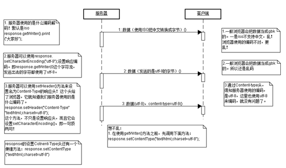

# JavaWeb基础学习笔记-Web资源编码

---

### 请求编码

1、直接在地址栏中给出中文

请求数据是由客户端浏览器发送服务器的，请求数据的编码是由浏览器决定的。例如在浏览器地址栏中给出：http://localhost:8080/hello/AServlet?name=中文 ，那么其中“中文”是什么编码的呢？不同浏览器使用不同的编码，所以这是不确定的！

* IE：使用GB2312；
* FireFox：使用GB2312；
* Chrome：使用UTF-8；

通常没有哪个应用要求用户在浏览器地址栏中输入请求数据的，所以大家只需了解一下即可。

2、在页面中发出请求

通常向服务器发送请求数据都需要先请求一个页面，然后用户在页面中输入数据。页面中有超链接和表单，通过超链接和表单就可以向服务器发送数据了。因为页面是服务器发送到客户端浏览器的，所以这个页面本身的编码由服务器决定。而用户在页面中输入的数据也是由页面本身的编码决定的。

~~~html
<!DOCTYPE html>
<html>
<head>
	<title>index.html</title>
	<meta http-equiv="content-type" content="text/html; charset=UTF-8"> 
</head> 
<body>
	<form action="/hello/servlet/AServlet">
		名称:<input type="text" name="name"/>
		<input type="submit" value="提交"/>
	</form>
	<a href="/hello/servlet/AServlet?name=中文">链接</a>
</body>
</html>
~~~

当用户在index.html页面中输入数据时，都是UTF-8编码的，因为这个页面本身就是UTF-8编码的。
页面中输入数据的编码就是页面的编码。

3、GET请求编码

当客户端通过GET请求发送数据给服务器时，使用`request.getParameter()`获取的数据是被服务器误认为ISO-8859-1编码的，也就是说客户端发送过来的数据无论是UTF-8还是GBK，服务器都认为是ISO-8859-1，这就说明我们需要在使用`request.getParameter()`获取数据后，再转换成正确的编码。例如客户端以UTF-8发送的数据，使用如下转码方式：

~~~java
String name = request.getParameter("name");
name = new String(name.getBytes("iso-8859-1"), "utf-8");
~~~

Tomcat设置GET请求参数编码：

4、POST请求编码

当客户端通过POST请求发送数据给服务器时，可以在使用`request.getParameter()`获取请求参数之前先通过`request.setCharacterEncoding()`来指定编码，然后再使用`reuqest.getParameter()`方法来获取请求参数，那么就是用指定的编码来读取了。也就是说，如果是POST请求，服务器可以指定编码。但如果没有指定编码，那么默认还是使用ISO-8859-1来解读。

~~~java
request.setCharacterEncoding("utf-8");
String name = request.getParameter("name");
~~~

### 响应编码

响应：服务器发送给客户端数据。响应是由response对象来完成，如果响应的数据不是字符数据，那么就无需去考虑编码问题。当然，如果响应的数据是字符数据，那么就一定要考虑编码的问题了。

~~~java
response.getWriter().print("中文");
~~~

上面代码因为没有设置`repsonse.getWriter()`字符流的编码，所以服务器使用默认的编码（ISO-8859-1）来处理，因为ISO-8859-1不支持中文，所以一定会出现编码的。所以在使用`response.getWriter()`发送数据之前，一定要设置`response.getWriter()`的编码，这需要使用`response.setCharacterEncoding()`方法：

~~~java
response.setCharacterEncoding("utf-8");
response.getWriter().print("中文");
~~~

上面代码因为在使用`response.getWriter()`输出之前已经设置了编码，所以输出的数据为utf-8编码。但是，因为没有告诉浏览器使用什么编码来读取响应数据，所以很可能浏览器会出现错误的解读，那么还是会出现乱码的。当然，通常浏览器都支持来设置当前页面的编码，如果用户在看到编码时，去设置浏览器的编码，如果设置得正确那么乱码就会消失。但是我们总不能让用户自己去设置编码，而且应该直接通知浏览器，服务器发送过来的数据是什么编码，这样浏览器就直接使用服务器告诉他的编码来解读，这需要使用content-type响应头。

~~~java
response.setContentType("text/html;charset=utf-8");
response.getWriter().print("中文");
~~~

上面代码使用`setContentType()`方法设置了响应头content-type编码为utf-8，这不只是在响应中添加了响应头，还等于调用了一次`response.setCharacterEncoding("utf-8")`，也就是说，通常我们只需要调用一次`response.setContentType("text/html;charset=utf-8")`即可，而无需再去调用`response.setCharacterEncoding("utf-8")`了。

在静态页面中，使用`<meta>`来设置`content-type`响应头，例如：

~~~html
<meta http-equiv="content-type" content="text/html; charset=UTF-8">
~~~

### URL编码

通过页面传输数据给服务器时，如果包含了一些特殊字符是无法发送的。这时就需要先把要发送的数据转换成URL编码格式，再发送给服务器。

其实需要我们自己动手给数据转换成URL编码的只有GET超链接，因为表单发送数据会默认使用URL编码，也就是说，不用我们自己来编码。

例如：“传智”这两个字通过URL编码后得到的是：“%E4%BC%A0%E6%99%BA”。URL编码是先需要把“传智”转换成字节，例如我们现在使用UTF-8把“传智”转换成字符，得到的结果是：“[-28, -68, -96, -26, -103, -70]”，然后再把所有负数加上256，得到[228, 188, 160, 230, 153, 186]，再把每个int值转换成16进制，得到[E4, BC, A0, E6, 99, BA]，最后再每个16进制的整数前面加上“%”。

通过URL编码，把“传智”转换成了“%E4%BC%A0%E6%99%BA”，然后发送给服务器。服务器会自动识别出数据是使用URL编码过的，然后会自动把数据转换回来。

当然，在页面中我们不需要自己去通过上面的过程把“传智”转换成“%E4%BC%A0%E6%99%BA”，而是使用Javascript来完成即可。当后面我们学习了JSP后，就不用再使用Javascript了。

~~~html

<a href="javascript:_go();">链接</a>
~~~

因为URL默认只支持ISO-8859-1，这说明在URL中出现中文和一些特殊字符可能无法发送到服务器。所以我们需要对包含中文或特殊字符的URL进行URL编码。服务器会自动识别数据是否使用了URL编码，如果使用了服务器会自动把数据解码，无需我们自己动手解码。

   

---

