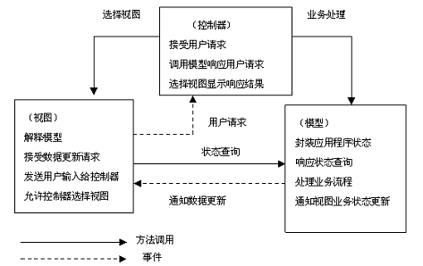
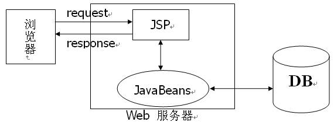
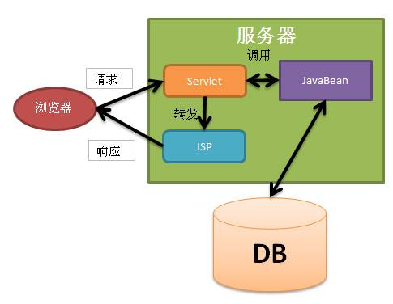
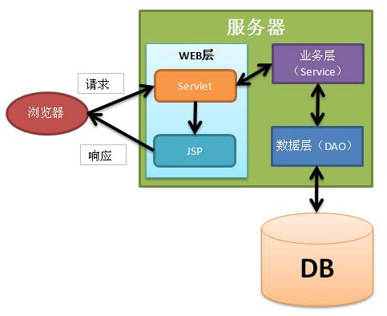

# JavaWeb基础学习笔记-MVC

---

### MVC设计模式

MVC模式（Model-View-Controller）是软件工程中的一种软件架构模式，把软件系统分为三个基本部分：模型（Model）、视图（View）和控制器（Controller）。

MVC模式最早为Trygve Reenskaug提出，为施乐帕罗奥多研究中心（Xerox PARC）的Smalltalk语言发明的一种软件设计模式。

MVC对程序的后期维护和扩展提供了方便，并且使程序某些部分的重用提供了方便。而且MVC也使程序简化，更加直观。

* 控制器Controller：对请求进行处理，负责请求转发；
* 视图View：界面设计人员进行图形界面设计；
* 模型Model：程序编写程序应用的功能（实现算法等等）、数据库管理；

注意，MVC不是Java的东西，几乎现在所有B/S结构的软件都采用了MVC设计模式。但是要注意，MVC在B/S结构软件并没有完全实现，例如在我们今后的B/S软件中并不会有事件驱动。

### JavaWeb与MVC

JavaWeb经历了JSP Model1、JSP Model1二代、JSP Model2三个时期。

1、JSP Model1第一代

JSP Model1是JavaWeb早期的模型，它适合小型Web项目，开发成本低。Model1第一代时期，服务器端只有JSP页面，所有的操作都在JSP页面中，连访问数据库的API也在JSP页面中完成。也就是说，所有的东西都耦合在一起，对后期的维护和扩展极为不利。

2、JSP Model1第二代

JSP Model1第二代有所改进，把业务逻辑的内容放到了JavaBean中，而JSP页面负责显示以及请求调度的工作。虽然第二代比第一代好了些，但还让JSP做了过多的工作，JSP中把视图工作和请求调度（控制器）的工作耦合在一起了。

3、JSP Model2

JSP Model2模式已经可以清晰的看到MVC完整的结构了。

* JSP：视图层，用来与用户打交道，负责接收用来的数据，以及显示数据给用户；
* Servlet：控制层，负责找到合适的模型对象来处理业务逻辑，转发到合适的视图；
* JavaBean：模型层，完成具体的业务工作，例如：开启、转账等。

JSP Model2适合多人合作开发大型的Web项目，各司其职，互不干涉，有利于开发中的分工，有利于组件的重用。但是，Web项目的开发难度加大，同时对开发人员的技术要求也提高了。

### JavaWeb经典三层框架

我们常说的三层框架是由JavaWeb提出的，也就是说这是JavaWeb独有的。所谓三层是表述层（WEB层）、业务逻辑层（Business Logic），以及数据访问层（Data Access）。

* WEB层：包含JSP和Servlet等与WEB相关的内容；
* 业务层：业务层中不包含JavaWeb API，它只关心业务逻辑；
* 数据层：封装了对数据库的访问细节；

注意，在业务层中不能出现JavaWeb API，例如request、response等。也就是说，业务层代码是可重用的，甚至可以应用到非Web环境中。业务层的每个方法可以理解成一个万能方法，例如转账业务方法。业务层依赖数据层，而Web层依赖业务层。

   

---

