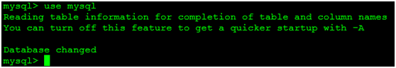

# CentOS6安装MySQL

---

### 卸载系统已有的MySQL

1、查看系统已经安装的MySQL：

~~~plaintext
rpm -qa | grep -i mysql
~~~

2、卸载：

~~~plaintext
rpm -e --nodeps mysql
rpm -e --nodeps mysql-libs
rpm -e --nodeps mysql-server
~~~

3、查看是否还有MySQL软件：

~~~plaintext
rpm -qa | grep -i mysql
~~~

如果有的话则继续删除。

4、查看并删除残留的目录：

~~~plaintext
whereis mysql
~~~

然后删除MySQL目录

~~~plaintext
rm -rf /usr/lib64/mysql
rm -rf /usr/share/mysql
rm -rf /var/lib/mysql
rm /etc/my.cnf
~~~

### 安装MySQL

1、上传MySQL安装包到服务器`/usr/local`目录下：

2、解压：

~~~plaintext
tar -zvxf mysql-5.7.20-linux-glibc2.12-x86_64.tar.gz
~~~

3、重命名：

~~~plaintext
mv mysql-5.7.20-linux-glibc2.12-x86_64 mysql
~~~

4、在mysql目录下创建data目录：

~~~plaintext
cd /usr/local/mysql
mkdir data
~~~

5、创建mysql的用户组和用户，并对mysql目录设置用户组和用户：

~~~plaintext
groupadd mysql
useradd -g mysql mysql
chown -R mysql:mysql /usr/local/mysql
chown -R mysql:mysql /usr/local/mysql/data
~~~

6、修改配置文件`my.cnf`文件：

~~~plaintext
vim /etc/my.cnf
~~~

修改内容如下：

~~~plaintext
[mysql]
default-character-set=utf8
socket=/tmp/mysql.sock
[mysqld]
skip-name-resolve
port = 3306
basedir=/usr/local/mysql
datadir=/usr/local/mysql/data
max_connections=200
character-set-server=utf8
default-storage-engine=INNODB
lower_case_table_names=1
max_allowed_packet=16M
~~~

7、设置`/etc/my.cnf`的权限：

~~~plaintext
chmod 644 /etc/my.cnf
~~~

### 启动MySQL服务

1、安装mysql服务：

~~~plaintext
cd /usr/local/mysql/bin
./mysqld --user=mysql --basedir=/usr/local/mysql/ --datadir=/usr/local/mysql/data --initialize
~~~

安装完毕后，可以尝试启动mysql服务：

~~~plaintext
cd /usr/local/mysql/support-files
./mysql.server start
~~~

2、设置开机启动：

~~~plaintext
#复制启动脚本到资源目录
cp /usr/local/mysql/support-files/mysql.server /etc/rc.d/init.d/mysqld
#增加mysqld服务控制脚本执行权限
chmod +x /etc/rc.d/init.d/mysqld
#将mysqld服务加入到系统服务
chkconfig --add mysqld
#检查mysqld服务是否已经生效
chkconfig --list mysqld
~~~

3、启动mysql服务：

~~~plaintext
service mysqld {start|stop|restart|status}
~~~

### 测试验证

1、登录mysql，此版本最新版不许空密码登录，实际上有个初始化密码保存在`/root/.mysql_secret`这个文件里面，用这个密码第一次登录后，再修改密码。因此先`cat`查看下初始化密码（随机的，每次安装看到的密码都不一样）：

~~~plaintext
cat /root/.mysql_secret
~~~

2、连接测试：

~~~plaintext
cd /usr/local/mysql/bin/
mysql -uroot -p
~~~

此处特别说明：
如果出现`-bash: mysql: command not found` 错误，这种错误一般是由于安装了一键安装脚本后没有对命令做链接，可以用下面的命令找到mysql命令的绝对路径：

~~~plaintext
find / -name mysql
~~~

假设查找到的路径为`/usr/local/mysql/bin/mysql`，可以使用下面的命令设置一个链接：

~~~plaintext
ln -s /usr/local/mysql/bin/mysql /usr/bin/mysql
~~~

然后就可以使用mysql命令了。

3、修改密码：

~~~plaintext
mysql> set password=password('123456');
~~~

4、方法二（mysql5.7版本）：

~~~plaintext
vim /etc/my.cnf
~~~

在`[mysqld]`添加`skip-grant-tables`。

重启mysqld服务：

~~~plaintext
service mysqld restart
~~~

空密码登录：

~~~plaintext
mysql
~~~

切换到mysql数据库：

~~~plaintext
use mysql
~~~

查看：

~~~plaintext
select * from user;
~~~

修改密码：

~~~plaintext
update user set authentication_string=password('root'),password_expired='N',password_last_changed=now() where User='root';
~~~

刷新：

~~~plaintext
flush privileges;
~~~

注释掉`/etc/my.cnf`里面的`skip-grant-tables`；

再重启mysqld服务：

~~~plaintext
service mysqld restart
~~~

使用密码即可登录；

5、设定远程登录mysql：

在Linux下为了安全，默认是不允许mysql本机以外的机器访问mysql数据库服务，因此需要重新授权root。方便远程访问。

~~~plaintext
mysql> GRANT ALL PRIVILEGES ON *.* TO root@'%' identified by '123456' with grant option;
mysql> flush privileges;
~~~

6、设置环境变量，方便使用mysql：

~~~plaintext
vim /etc/profile
~~~

添加以下内容：

~~~plaintext
export PATH=$PATH:/usr/local/mysql/bin
~~~

使更改生效：

~~~plaintext
source /etc/profile
~~~

### 完成安装

1、防火墙开启3306端口：

~~~plaintext
vim /etc/sysconfig/iptables
~~~

2、添加以下内容：

~~~plaintext
-A INPUT -m state --state NEW -m tcp -p tcp --dport 3306 -j ACCEPT
~~~

3、重启防火墙：

~~~plaintext
service iptables restart
~~~

### 参考文档

* [CentOS6.6安装二进制压缩包mysql5.6](http://blog.itpub.net/29485627/viewspace-2135947/)
* [CentOS6.5上安装MySQL5.7压缩版](https://www.cnblogs.com/duwanjiang/p/8461168.html)
* [CentOS6.4下MySQL的安装与配置](http://www.cnblogs.com/xiaoluo501395377/archive/2013/04/07/3003278.html)
* [mysql用户名密码登录不上](https://www.cnblogs.com/zhaoxd07/p/5580543.html)
* [mysql5.7修改root密码无法登陆原因](https://blog.csdn.net/xyajia/article/details/76746883)

   

---

