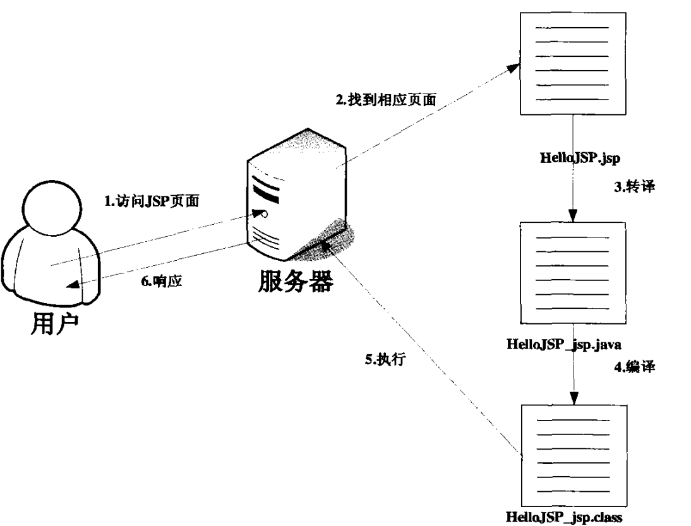

# JavaWeb基础知识汇总-JSP

---

### JSP简介

JSP是Java Server Pages的缩写，是由Sun公司于1996年6月推出的技术，通过在传统的HTML页面中插入JSP脚本代码从而构成JSP页面。JSP是基于Java Servlet及整个Java体系的Web开发技术，可以利用这一技术来构建安全的、跨平台的动态Web站点。

JSP具有如下特点：

* 程序逻辑和显示分离；
* 可重用组件；
* 使用标签简化页面开发；
* 具有Java的特点；

### JSP运行机制

编写demo.jsp页面，如下：

~~~jsp
<html>
<head><title>Demo</title></head>
<body>
	<% out.println("hello world!"); %>
</body>
</html>
~~~

打开浏览器访问该页面，然后在Tomcat的work目录下，可以找到对应的java文件以及class文件。

~~~java
out.write("<html>\r\n");
out.write("<head>\r\n");
out.write("<title>Demo</title>\r\n");
out.write("</head>\r\n");
out.write("<body>\r\n");
out.write("\t");
out.println("hello world!");
out.write("\r\n");
out.write("</body>\r\n");
out.write("</html>\r\n");
~~~

可以把JSP页面的执行分为两个阶段：

* 转译阶段：JSP页面转换成Servlet类；
* 请求阶段：Servlet类执行，将响应结果发送至客户端；

* 客户端访问JSP页面；
* 服务器找到相应的JSP页面；
* 服务器将JSP页面转译成Servlet源代码；
* 服务器将Servlet源代码编译成class文件；
* 服务器将class文件加载到内存并执行；
* 服务器将执行class文件后生成的HTML代码发送给客户端，客户端浏览器根据HTML进行相应的显示。

如果JSP页面是第一次执行，那么会经过这两个阶段；如果不是，那么只会执行请求阶段。所以第二次执行JSP页面会比第一次明显快很多。如果修改了JSP页面，服务器将发现该修改，并重新执行转译阶段和请求阶段。

### JSP脚本元素

##### JSP声明语句

JSP声明语句以`<%!`开始，以`%>`结束，其语法格式为：

~~~jsp
<%! 声明语句 %>
~~~

使用JSP声明语句声明的变量为全局变量，当有多个用户在执行此JSP页面时，将共享该变量。

~~~jsp
<html>
<head><title>Demo</title></head>
<body>
	<%! int a=1; %>
	<% out.println("a="+a); a++; %>
</body>
</html>
~~~

##### JSP Scriptlets

JSP Scriptlets以`<%`开始，以`%>`结束，其中包含有效的符合Java语法规则的Java代码，其语法格式为：

~~~jsp
<% Java代码 %>
~~~

~~~jsp
<html>
<head><title>Demo</title></head>
<body>
	<%
		String str = "hello world!";
		out.println(str);
	%>
</body>
</html>
~~~

##### JSP表达式

JSP表达式以`<%=`开始，以`%>`结束，JSP表达式中的代码会首先执行，然后转换成字符串并显示在页面上。其语法格式为：

~~~jsp
<%= Java代码 %>
~~~

~~~jsp
<html>
<head><title>Demo</title></head>
<body>
	<% String str = "hello world!"; %>
	<%= str %>
</body>
</html>
~~~

##### 注释

1）HTML注释

~~~jsp
<html>
<head><title>Demo</title></head>
<body>
	<!-- 这是HTML注释 -->
	<% out.println("hello world!"); //注释 %>
</body>
</html>
~~~

2）JSP注释

~~~jsp
<html>
<head><title>Demo</title></head>
<body>
	<%-- 这是JSP注释 --%>
	<% out.println("hello world!"); //注释 %>
</body>
</html>
~~~

### JSP指令元素

##### page指令

page指令主要用来设定JSP页面的全局属性，该配置将作用于整个JSP页面，包括静态包含的文件。

1）page指令的属性

| 属性         | 描述                                                 |
| ------------ | ---------------------------------------------------- |
| language     | 声明所使用的脚本语言种类                             |
| extends      | 指定该JSP页面生成的Servlet继承于哪个父类             |
| import       | 指定导入的包                                         |
| session      | 指定JSP页面是否可以使用session对象                   |
| buffer       | 指定输出流是否具有缓冲区                             |
| autoFlush    | 指定缓冲区是否自动进行强制输出                       |
| isThreadSafe | 指定JSP是否线程安全的                                |
| info         | 指定JSP文件的信息                                    |
| errorPage    | 如果当前JSP发生异常，则跳转到能过处理该异常的JSP页面 |
| isErrorPage  | 指定是否为能够处理异常的JSP页面                      |
| contentType  | 指定JSP的MIME类型及网页编码格式                      |
| pageEncoding | 指定编码格式                                         |
| isELIgnore   | 指定JSP是否支持EL表达式                              |

2）language属性

~~~jsp
<%@ page language="java" %>
<html>
<head><title>Demo</title></head>
<body>
	<% out.println("hello world!"); %>
</body>
</html>
~~~

> language属性暂时只支持java。

3）extends属性

4）import属性

~~~jsp
<%@ page import="java.util.*" %>
<html>
<head><title>Demo</title></head>
<body>
	<% out.println("hello world!"); %>
</body>
</html>
~~~

默认导入的包：`java.lang.*`、`javax.servlet.*`、`javax.servlet.jsp.*`、`javax.servlet.http.*`。

5）session属性

~~~jsp
<%@ page session="true" %>
<html>
<head><title>Demo</title></head>
<body>
	<% out.println("hello world!"); %>
</body>
</html>
~~~

> session默认值为true。

6）buffer属性

~~~jsp
<%@ page buffer="8KB" %>
<html>
<head><title>Demo</title></head>
<body>
	<% out.println("hello world!"); %>
</body>
</html>
~~~

设置具体的数值，如40KB，默认为8KB；设置为none表示不具有缓冲功能。

7）autoFlush属性

~~~jsp
<%@ page autoFlush="true" %>
<html>
<head><title>Demo</title></head>
<body>
	<% out.println("hello world!"); %>
</body>
</html>
~~~

> autoFlush属性默认值为true。

8）isThreadSafe属性

~~~jsp
<%@ page isThreadSafe="true" %>
<html>
<head><title>Demo</title></head>
<body>
	<% out.println("hello world!"); %>
</body>
</html>
~~~

> isThreadSafe属性默认值为true。

9）info属性

~~~jsp
<%@ page info="hello world!" %>
<html>
<head><title>Demo</title></head>
<body>
	<% out.println(getServletInfo()); %>
</body>
</html>
~~~

10）errorPage属性

11）isErrorPage属性

~~~jsp
<%@ page isErrorPage="false" %>
<html>
<head><title>Demo</title></head>
<body>
	<% out.println("hello world!"); %>
</body>
</html>
~~~

> isErrorPage属性默认值为false。

12）contentType属性

~~~jsp
<%@ page contentType="text/html;charset=utf-8" %>
<html>
<head><title>Demo</title></head>
<body>
	<% out.println("hello world!"); %>
</body>
</html>
~~~

13）pageEncoding属性

~~~jsp
<%@ page pageEncoding="utf-8" %>
<html>
<head><title>Demo</title></head>
<body>
	<% out.println("hello world!"); %>
</body>
</html>
~~~

14）isELIgnore属性

~~~jsp
<%@ page isELIgnore="false" %>
<html>
<head><title>Demo</title></head>
<body>
	<% out.println("hello world!"); %>
</body>
</html>
~~~

> isELIgnore属性默认值为false。

##### include指令

include指令用于在JSP文件中插入一个包含文本或代码的文件，将被包含文件所执行的结果插入到include指令所在的位置。只有当被包含的文件执行完后，该JSP才会恢复执行。语法格式如下：

~~~jsp
<%@ include file="被包含文件的地址" %>
~~~

示例代码：

content.txt

~~~plaintext
txt content.
~~~

content.jsp

~~~jsp
<%@ page import="java.util.*" %>
<%=new Date() %>
~~~

~~~jsp
<html>
<head><title>Demo</title></head>
<body>
	<% out.println("hello world!"); %>
	<%@ include file="content.txt" %>
	<%@ include file="content.jsp" %>
</body>
</html>
~~~

##### taglib指令

taglib指令用于指定标签库并指定标签库的前缀。

~~~jsp
<%@ taglib uri="http://java.sun.com/jsp/jstl/core" prefix="c" %>
<html>
<head><title>Demo</title></head>
<body>
	<c:out value="hello world!" />
</body>
</html>
~~~

### JSP动作元素

##### 概念

##### JSP动作元素一览

| 动作元素    | 描述 |
| ----------- | ---- |
| include     |      |
| forward     |      |
| param       |      |
| plugin      |      |
| params      |      |
| fallback    |      |
| useBean     |      |
| setProperty |      |
| getProperty |      |
| root        |      |
| declaration |      |
| scriptlet   |      |
| expression  |      |
| text        |      |
| output      |      |
| attribute   |      |
| body        |      |
| element     |      |
| invoke      |      |
| doBody      |      |

##### 动态包含include

动作元素include用来包含静态和动态的文件。如果被包含的文件为静态文件，那么只是加到JSP页面中，不会进行任何处理；如果被包含的文件为动态文件，那么会先进行处理，然后将处理的结果加到JSP页面中。语法格式如下：

~~~jsp
<jsp:include page="被包含文件地址" flush="默认为false" />
~~~

示例代码：

content.txt

~~~plaintext
txt content.
~~~

content.jsp

~~~jsp
<%@ page import="java.util.*" %>
<%=new Date() %>
~~~

~~~jsp
<html>
<head><title>Demo</title></head>
<body>
	<% out.println("hello world!"); %>
	<jsp:include page="content.txt" />
	<jsp:include page="content.jsp" />
</body>
</html>
~~~

##### 静态包含与动态包含的区别

content.txt

~~~jsp
<%@ page import="java.util.*" %>
<%=new Date() %>
~~~

~~~jsp
<html>
<head><title>Demo</title></head>
<body>
	<% out.println("hello world!"); %>
	<%@ include file="content.txt" %>
</body>
</html>
~~~

静态包含：将页面的内容包含进来，不管被包含文件的类型（txt或jsp），只要文件中有JSP代码，就会执行该代码；相当于将context.txt中的内容复制到JSP中，再执行JSP；所以能看到日期输出。

content.txt

~~~jsp
<%@ page import="java.util.*" %>
<%=new Date() %>
~~~

~~~jsp
<html>
<head><title>Demo</title></head>
<body>
	<% out.println("hello world!"); %>
	<jsp:include page="content.txt" />
</body>
</html>
~~~

动态包含：如果被包含文件是静态的，则直接将内容以文本形式包含进来，不进行处理；如果被包含的文件是动态的，则先执行，再将执行结构包含进来；所以看到了直接原样输出的代码。

总结：

* 静态包含：将所有被包含的文件包含进来之后，再进行编译等处理，即“先包含再处理”；
* 动态包含：先将所有要被包含的代码处理完成后，再将处理的结果包含进来，即“先处理再包含”。

##### 请求转发forward

forward动作元素用来转移用户的请求，使得用户请求的页面从一个页面跳转到另一个页面。这种跳转为服务器端跳转，所以用户的地址栏不会发生任何变化。语法格式如下：

~~~jsp
<jsp:forward page="跳转文件URL地址" />
~~~

示例代码：

demo.jsp

~~~jsp
<html>
<head><title>Demo</title></head>
<body>
	<% out.println("hello world!"); %>
	<jsp:forward page="to.jsp" />
	<% out.println("you can never see me!"); %>
</body>
</html>
~~~

to.jsp

~~~jsp
<html>
<head><title>To</title></head>
<body>
	<% out.println("forward to here!"); %>
</body>
</html>
~~~

> forward动作元素之后的代码将不会被执行。

##### 

### 

   

---

