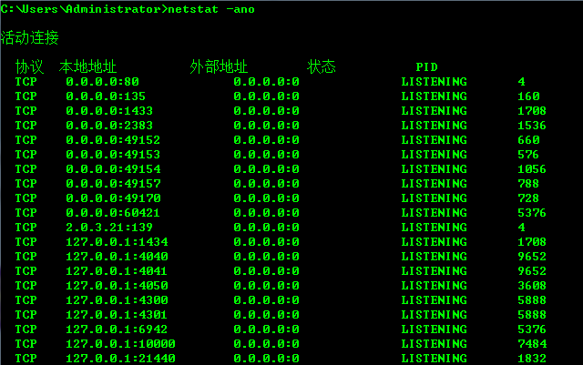

# Windows系统下强制结束Tomcat服务

---

Windows操作系统下Tomcat异常关闭，但是8080端口仍然占用，会导致Tomcat不能重新启动，需要强制结束。

1、查找Tomcat 8080端口的PID，命令如下：

~~~plaintext
netstat -ano
~~~

找到并记录下8080端口对应的PID。

2、根据PID结束掉Tomcat服务，命令如下：

~~~plaintext
taskkill /F /PID [PID]
~~~

   

---

