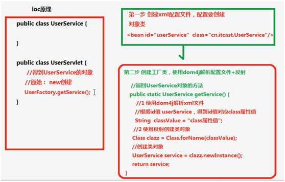
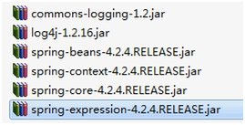
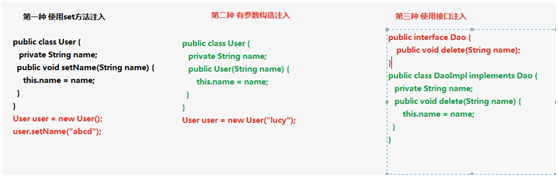
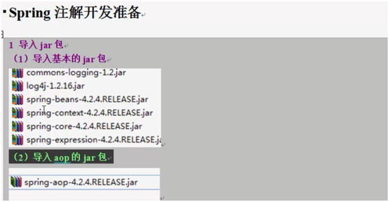
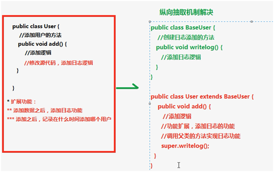
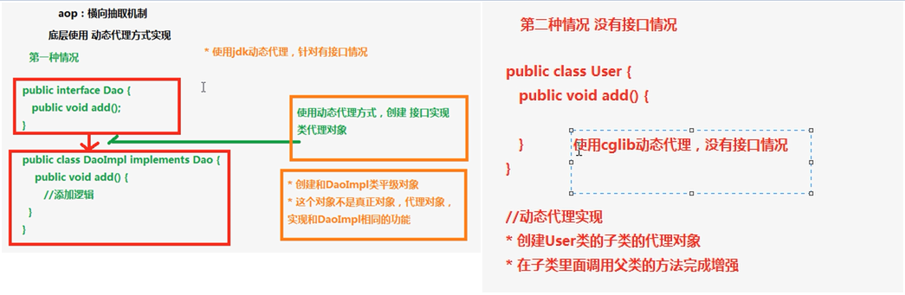
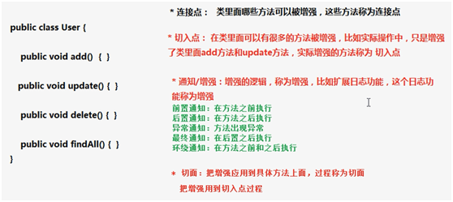

# Spring快速入门

---

### Spring概念

Spring是开源的轻量级框架。Spring核心主要分为两部分：

* AOP：面向切面编程，即扩展功能不是通过修改源码实现。
* IOC：控制反转。比如有一个类，在类里面有方法（不是静态的方法），要调用里面的方法，传统的做法是创建类的对象，再使用对象调用方法。创建类对象的过程，需要使用new关键字。在IOC中对象的创建不是通过new方式实现的，而是交给Spring来创建类的对象。

Spring是一站式框架，在JavaEE三层结构中，每一层都提供不同的解决方案：

* Web层：SpringMVC
* Service层：Spring的IOC
* DAO层：Spring的jdbcTemplate

### Spring的IOC操作

1、IOC底层技术

* XML配置文件
* Dom4J解析XML
* 工厂设计模式
* 反射

2、IOC实现原理

3、IOC操作的两种方式

* IOC的配置文件方式
* IOC的注解方式

4、代码实现

1）导入jar包

使用Spring最基本功能的时候，导入4个核心的jar包就可以了，同时也要导入支持日志输出的jar包。

2）创建实体类

~~~java
package cn.seasand.code.domain;
public class User {
	public void sayHi(){
		System.out.println("hello spring!");
	}
}
~~~

3）创建Spring配置文件，配置创建类

Spring核心配置文件名称和位置不是固定的，建议放到src下，并命名为applicationContext.xml。

~~~xml
<?xml version="1.0" encoding="UTF-8"?>
<beans xmlns="http://www.springframework.org/schema/beans" xmlns:xsi="http://www.w3.org/2001/XMLSchema-instance" xsi:schemaLocation="http://www.springframework.org/schema/beans http://www.springframework.org/schema/beans/spring-beans-3.0.xsd">
	<bean id="user" class="cn.seasand.code.domain.User"></bean>
</beans>
~~~

4）测试

~~~java
public void test() {
	ApplicationContext context = new ClassPathXmlApplicationContext("applicationContext.xml");
	User user = (User) context.getBean("user");
	System.out.println(user);
	user.sayHi();
}
~~~

### Bean的实例化方式

1、使用类的无参构造函数

~~~java
package cn.seasand.code.domain;
public class User{
	public void sayHi(){
		System.out.println("hello spring!");
	}
}
~~~

~~~xml
<?xml version="1.0" encoding="UTF-8"?>
<beans xmlns="http://www.springframework.org/schema/beans" xmlns:xsi="http://www.w3.org/2001/XMLSchema-instance" xsi:schemaLocation="http://www.springframework.org/schema/beans http://www.springframework.org/schema/beans/spring-beans-3.0.xsd">
	<bean id="user" class="cn.seasand.code.domain.User"></bean>
</beans>
~~~

注意：若类没有无参构造函数，则会抛出异常：No default constructor found。

2、使用静态工厂创建

~~~java
package cn.seasand.code.domain;
public class User {
	public void sayHi() {
		System.out.println("hello spring!");
	}
}
public class UserFactory {
	public statis User getUser() {
		return new User();
	}
}
~~~

~~~xml
<?xml version="1.0" encoding="UTF-8"?>
<beans xmlns="http://www.springframework.org/schema/beans" xmlns:xsi="http://www.w3.org/2001/XMLSchema-instance" xsi:schemaLocation="http://www.springframework.org/schema/beans http://www.springframework.org/schema/beans/spring-beans-3.0.xsd">
	<bean id="user" class="cn.seasand.code.domain.UserFactory" factory-method="getUser"></bean>
</beans>
~~~

3、使用实例工厂创建

~~~java
package cn.seasand.code.domain;
public class User {
	public void sayHi() {
		System.out.println("hello spring!");
	}
}
public class UserFactory {
	public User getUser() {
		return new User();
	}
}
~~~

~~~xml
<?xml version="1.0" encoding="UTF-8"?>
<beans xmlns="http://www.springframework.org/schema/beans" xmlns:xsi="http://www.w3.org/2001/XMLSchema-instance" xsi:schemaLocation="http://www.springframework.org/schema/beans http://www.springframework.org/schema/beans/spring-beans-3.0.xsd">
	<bean id="userFactory" class="cn.seasand.code.domain.UserFactory"></bean>
	<bean id="user" factory-bean="userFactory" factory-method="getUser"></bean>
</beans>
~~~

4、bean属性

* id：给bean命名，不能包含特殊符号，Spring根据id值得到配置的对象。
* class：创建对象所在类的全路径。
* name：功能和id属性一致，但是在name属性中可以包含特殊符号。（主要为了兼容旧版本）
* scope：定义bean的作用范围。

5、bean的作用范围

* singleton：单例的，默认值。
* prototype：多例的。
* request：web项目中，将对象存入到request域中。
* session：web项目中，将对象存入到session域中。
* globalSession：web项目中，应用在Porlet环境，若无Porlet环境则globalSession相当于session。

### 属性注入

指的是创建对象时，向里面的属性设置值。属性注入包括三种方式：

* 通过set方法注入
* 通过有参数构造函数注入
* 通过接口注入

在Spring中，支持前两种方式注入属性：set方法注入和有参构造函数注入。

1、通过set方法注入属性

~~~java
package cn.seasand.code.domain;
public class User {
	private String username;
	public void setUsername(String username) {
		this.username = username;
	}
}
~~~

~~~xml
<?xml version="1.0" encoding="UTF-8"?>
<beans xmlns="http://www.springframework.org/schema/beans" xmlns:xsi="http://www.w3.org/2001/XMLSchema-instance" xsi:schemaLocation="http://www.springframework.org/schema/beans http://www.springframework.org/schema/beans/spring-beans-3.0.xsd">
	<bean id="user" class="cn.seasand.code.domain.User">
		<property name="username" value="zhangsan"></property>
	</bean>
</beans>
~~~

2、通过有参构造函数注入

~~~java
package cn.seasand.code.domain;
public class User {
	private String username;
	public User() {}
	public User(String username) {
		this.username = username;
	}
}
~~~

~~~xml
<?xml version="1.0" encoding="UTF-8"?>
<beans xmlns="http://www.springframework.org/schema/beans" xmlns:xsi="http://www.w3.org/2001/XMLSchema-instance" xsi:schemaLocation="http://www.springframework.org/schema/beans http://www.springframework.org/schema/beans/spring-beans-3.0.xsd">
	<bean id="user" class="cn.seasand.code.domain.User">
		<constructor-arg name="username" value="zhangsan"></constructor-arg>
	</bean>
</beans>
~~~

3、注入复杂类型属性

1）对象

~~~java
package cn.seasand.code.domain;
class Book {
	private String bookname;
	public void setBookname(String bookname) {
		this.bookname = bookname;
	}
}
public class User {
	private Book book;
	public void setBook(Book book) {
		this.book = book;
	}
}
~~~

~~~xml
<?xml version="1.0" encoding="UTF-8"?>
<beans xmlns="http://www.springframework.org/schema/beans" xmlns:xsi="http://www.w3.org/2001/XMLSchema-instance" xsi:schemaLocation="http://www.springframework.org/schema/beans http://www.springframework.org/schema/beans/spring-beans-3.0.xsd">
	<bean id="book" class="cn.seasand.code.domain.Book">
		<property name="bookname" value="Thinking in Java"></property>
	</bean>
	<bean id="user" class="cn.seasand.code.domain.User">
		<property name="book" ref="book"></property>
	</bean>
</beans>
~~~

2）数组

~~~java
package cn.seasand.code.domain;
public class User {
	private String[] array;
	public void setArray(String[] array){
		this.array = array;
	}
}
~~~

~~~xml
<?xml version="1.0" encoding="UTF-8"?>
<beans xmlns="http://www.springframework.org/schema/beans" xmlns:xsi="http://www.w3.org/2001/XMLSchema-instance" xsi:schemaLocation="http://www.springframework.org/schema/beans http://www.springframework.org/schema/beans/spring-beans-3.0.xsd">
	<bean id="user" class="cn.seasand.code.domain.User">
		<property name="array">
			<list>
				<value>aaa</value>
				<value>bbb</value>
				<value>ccc</value>
			</list>
		</property>
	</bean>
</beans>
~~~

3）List

~~~java
package cn.seasand.code.domain;
public class User {
	private List<String> list;
	public void setList(List<String> list) {
		this.list = list;
	}
}
~~~

~~~xml
<?xml version="1.0" encoding="UTF-8"?>
<beans xmlns="http://www.springframework.org/schema/beans" xmlns:xsi="http://www.w3.org/2001/XMLSchema-instance" xsi:schemaLocation="http://www.springframework.org/schema/beans http://www.springframework.org/schema/beans/spring-beans-3.0.xsd">
	<bean id="user" class="cn.seasand.code.domain.User">
		<property name="list">
			<list>
				<value>aaa</value>
				<value>bbb</value>
				<value>ccc</value>
			</list>
		</property>
	</bean>
</beans>
~~~

4）Map

~~~java
package cn.seasand.code.domain;
public class User {
	private Map<String, String> map;
	public void setMap(Map<String, String> map) {
		this.map = map;
	}
}
~~~

~~~xml
<?xml version="1.0" encoding="UTF-8"?>
<beans xmlns="http://www.springframework.org/schema/beans" xmlns:xsi="http://www.w3.org/2001/XMLSchema-instance" xsi:schemaLocation="http://www.springframework.org/schema/beans http://www.springframework.org/schema/beans/spring-beans-3.0.xsd">
	<bean id="user" class="cn.seasand.code.domain.User">
		<property name="map">
			<map>
				<entry key="a" value="aaaaa"></entry>
				<entry key="b" value="bbbbb"></entry>
				<entry key="c" value="ccccc"></entry>
			</map>
		</property>
	</bean>
</beans>
~~~

5）Properties

~~~java
package cn.seasand.code.domain;
public class User {
	private Properties props;
	public void setProps(Properties props) {
		this.props = props;
	}
}
~~~

~~~xml
<?xml version="1.0" encoding="UTF-8"?>
<beans xmlns="http://www.springframework.org/schema/beans" xmlns:xsi="http://www.w3.org/2001/XMLSchema-instance" xsi:schemaLocation="http://www.springframework.org/schema/beans http://www.springframework.org/schema/beans/spring-beans-3.0.xsd">
	<bean id="user" class="cn.seasand.code.domain.User">
		<property name="props">
			<props>
				<prop key="a">aaa</prop>
				<prop key="b">bbb</prop>
			</props>
		</property>
	</bean>
</beans>
~~~

4、名称空间p的属性注入方式

~~~plaintext
xmlns:p="http://www.springframework.org/schema/p"
~~~

~~~java
package cn.seasand.code.domain;
class Book {
	private String bookname;
	public void setBookname(String bookname) {
		this.bookname = bookname;
	}
}
public class User {
	private Book book;
	public void setBook(Book book) {
		this.book = book;
	}
}
~~~

~~~xml
<?xml version="1.0" encoding="UTF-8"?>
<beans xmlns="http://www.springframework.org/schema/beans" xmlns:p="http://www.springframework.org/schema/p" xmlns:xsi="http://www.w3.org/2001/XMLSchema-instance" xsi:schemaLocation="http://www.springframework.org/schema/beans http://www.springframework.org/schema/beans/spring-beans-3.0.xsd">
	<bean id="book" class="cn.seasand.code.domain.Book" p:bookname="Thinking in Java"></bean>
	<bean id="user" class="cn.seasand.code.domain.User" p:book-ref="book"></bean>
</beans>
~~~

5、IOC和DI区别

* IOC：控制反转，把对象的创建交给Spring进行管理；
* DI：依赖注入，向类里面的属性注入值；
* 关系：依赖注入不能单独存在，需要在IOC的基础上完成操作；

### Spring注解方式的Bean管理

1、注解开发准备工作

1）导入相关jar包

2）开启组件扫描

~~~xml
<?xml version="1.0" encoding="UTF-8"?>
<beans xmlns="http://www.springframework.org/schema/beans" xmlns:context="http://www.springframework.org/schema/context" xmlns:xsi="http://www.w3.org/2001/XMLSchema-instance" xsi:schemaLocation="http://www.springframework.org/schema/beans http://www.springframework.org/schema/beans/spring-beans-3.0.xsd" http://www.springframework.org/schema/context http://www.springframework.org/schema/context/spring-context-3.0.xsd >
	<context:component-scan base-package="cn.seasand.code"></context:component-scan>
</beans>
~~~

注意：

* base-package 可以指定多个路径，以`,`分隔，或者指定父级类路径。
* `<context:component-scan></context:component-scan>`会扫描类、方法、属性上的注解。而`<context:annotation-config></context:annotation-config>`只会扫描属性上的注解。

2、注解方式创建对象

~~~java
package cn.seasand.code.domain;

@Component(value="user")
@Scope(value="prototype")
public class User {
	public void sayHi() {
		System.out.println("Hello spring!");
	}
}
~~~

~~~java
package cn.seasand.code.test;

public class TestUser {
	public void test() {
		ApplicationContext context = new ClassPathXmlApplicationContext("applicationContext.xml");
		User user = (User) context.getBean("user");
		System.out.println(user);
		user.sayHi();
	}
}

~~~

总结：@Component、@Controller、@Service 和 @Repository 是Spring的4个常用注解。

3、注解方式注入属性

~~~java
package cn.seasand.code.domian;

@Component(value="book")
class Book {
	private String bookname;
	public void setBookname(String bookname) {
		this.bookname = bookname;
	}
}

@Component(value="user")
public class User {
	@Resource(name="book")
	private Book book;

	public void setBook(Book book) {
		this.book = book;
	}
}
~~~

注意：@Autowired是根据类名找到类的对象；@Resource根据name能准确找到value指定对应的对象。

### Spring的AOP操作

1、基本概念

AOP，面向切面编程，其扩展功能不修改源代码实现。AOP采用横向抽取机制，取代了传统纵向继承体系。

传统纵向抽取机制：

AOP横向抽取机制：

2、AOP操作术语

* Joinpoint（连接点）：是指那些被拦截到的点。在Spring中，这些点指的是方法，Spring只支持方法类型的连接点。
* Pointcut（切入点）：是指要对哪些Joinpoint进行拦截的定义。
* Advice（通知/增强）：指拦截到Joinpoint之后所要做的事情，即切面要完成的功能。通知分为前置通知、后置通知、环绕通知、异常通知和最终通知。
* Aspect（切面）：是切入点和通知的结合。
* Introduction（引介）：引介是一种特殊的通知，在不修改类代码的前提下，引介可以在运行期间为类动态地添加一些方法或Field。
* Target（目标对象）：代理的目标对象，即要增强的类。
* Weaving（织入）：把增强应用到目标的过程，即把Advice应用到Target的过程。
* Proxy（代理）：一个类被AOP织入增强后，就产生一个结果代理类。

3、AOP示例代码

在Spring里面进行AOP操作，使用AspectJ实现。AspectJ是一个面向切面的框架，它扩展了Java语言。AspectJ定义了AOP语法，所以它有一个专门的编译器用来生成遵守Java字节编码规范的Class文件。AspectJ是一个基于Java语言的AOP框架。AspectJ不是Spring的一部分，和Spring一起使用进行AOP操作。Spring2.0以后新增了对AspectJ的支持。

1）AOP操作相关jar包

2）execution函数

在通知中通过value属性定义切点，通过execution函数，可以定义切点的方法切入。

语法：

~~~plaintext
execution(<访问修饰符>?<返回值类型><方法名>(<参数>)<异常>)
~~~

示例：

* 匹配所有类的public方法：`execution(public * *(..))`；
* 匹配指定包下所有类的方法：不包含子包`execution(* xx.xx.dao.*(..))` ，包含子包`execution(* xx.xx.dao..*(..))`；
* 匹配指定类所有方法：`execution(* xx.xx.service.UserService.*(..))`；
* 匹配实现特定接口所有类方法：`execution(* xx.xx.dao.XxxDao+.*(..))`；
* 匹配所有save开头的方法：`execution(* save*(..))`；

3）基于XML配置文件方式

~~~java
package cn.seasand.code;

class Man {
	public void sayHi() {
		System.out.println("Hello!");
	}
	public void sayBye(){
		System.out.println("Bye bye!");
	}
}

class SuperMan {
	public void before() {
		System.out.println("before!");
	}
	public void after() {
		System.out.println("after!");
	}
	public void around(ProceedingJoinPoint proceedingJoinPoint) throws Throwable {
		System.out.println("around before!");
		proceedingJoinPoint.proceed();
		System.out.println("around after!");
	}
	public void afterReturning() {
		System.out.println("afterReturning!");
	}
	public void afterThrowing() {
		System.out.println("afterThrowing!");
	}
}
~~~

~~~xml
<?xml version="1.0" encoding="UTF-8"?>
<beans xmlns="http://www.springframework.org/schema/beans" xmlns:context="http://www.springframework.org/schema/context" xmlns:aop="http://www.springframework.org/schema/aop" xmlns:xsi="http://www.w3.org/2001/XMLSchema-instance" xsi:schemaLocation="http://www.springframework.org/schema/beans http://www.springframework.org/schema/beans/spring-beans-3.0.xsd" http://www.springframework.org/schema/context http://www.springframework.org/schema/context/spring-context-3.0.xsd http://www.springframework.org/schema/aop http://www.springframework.org/schema/context/spring-aop-3.0.xsd >

	<bean id="man" class="cn.seasand.code.Man"></bean>
	<bean id="superMan" class="cn.seasand.code.superMan"></bean>

	<aop:config>
		<!-- 配置切入点 -->
		<aop:pointcut expression="execution(* cn.seasand.code.Man.*(..))" id="pointcut1"></aop:pointcut>
		<!-- 配置切面 -->
		<aop:aspect ref="superMan">
			<aop:before method="before" pointcut-ref="pointcut1"/>
			<aop:after method="after" pointcut-ref="pointcut1"/>
			<aop:around method="around" pointcut-ref="pointcut1"/>
			<aop:after-returning method="afterReturning" pointcut-ref="pointcut1"/>
			<aop:after-throwing method="afterThrowing" pointcut-ref="pointcut1"/>
		</aop:aspect>
	</aop:config>
</beans>
~~~

4）基于注解方式

~~~xml
<?xml version="1.0" encoding="UTF-8"?>
<beans xmlns="http://www.springframework.org/schema/beans" xmlns:context="http://www.springframework.org/schema/context" xmlns:aop="http://www.springframework.org/schema/aop" xmlns:xsi="http://www.w3.org/2001/XMLSchema-instance" xsi:schemaLocation="http://www.springframework.org/schema/beans http://www.springframework.org/schema/beans/spring-beans-3.0.xsd" http://www.springframework.org/schema/context http://www.springframework.org/schema/context/spring-context-3.0.xsd http://www.springframework.org/schema/aop http://www.springframework.org/schema/context/spring-aop-3.0.xsd >

	<context:component-scan base-package="cn.seasand.code"></context:component-scan>
	<aop:aspectj-autoproxy></aop:aspectj-autoproxy>
</beans>
~~~

~~~java
package cn.seasand.code;

@Component(value="man")
class Man {
	public void sayHi() {
		System.out.println("Hello!");
	}
	public void sayBye() {
		System.out.println("Bye bye!");
	}
}

@Component(value="superMan")
@Aspect
class SuperMan {
	@Before(value="execution(* cn.seasand.code.Man.*(..))")
	public void before() {
		System.out.println("before!");
	}

	@After(value="execution(* cn.seasand.code.Man.*(..))")
	public void after() {
		System.out.println("after!");
	}

	@Around(value="execution(* cn.seasand.code.Man.*(..))")
	public void around(ProceedingJoinPoint proceedingJoinPoint) throws Throwable {
		System.out.println("around before!");
		proceedingJoinPoint.proceed();
		System.out.println("around after!");
	}

	@AfterReturning(value="execution(* cn.seasand.code.Man.*(..))")
	public void afterReturning() {
		System.out.println("afterReturning!");
	}

	@AfterThrowing(value="execution(* cn.seasand.code.Man.*(..))")
	public void afterThrowing() {
		System.out.println("afterThrowing!");
	}
}
~~~

### JdbcTemplate

JdbcTemplate是Spring提供的持久层技术。

1、相关jar包

2、代码示例

~~~java
package cn.seasand.code;

class JdbcDemo {

	public JdbcTemplate getJdbcTemplate() {
		DriverManagerDataSource dataSource = new DriverManagerDataSource();
		dataSource.setDriverClassName("com.mysql.jdbc.Driver");
		dataSource.setUrl("jdbc:mysql:///spring_demo");
		dataSource.setUsername("root");
		dataSource.setPassword("root");

		JdbcTemplate jdbcTemplate = new JdbcTemplate(dataSource);
		return jdbcTemplate;
	}

	//建表
	public void createTable() {
		String sql = "create table users(id int primary key auto_increment, name varchar(20), age int)";
		JdbcTemplate jdbcTemplate = getJdbcTemplate();
		jdbcTemplate.execute(sql);
	}

	//插入数据
	public void insert() {
		String sql = "insert into users(name, age) values(?, ?)";
		JdbcTemplate jdbcTemplate = getJdbcTemplate();
		int rows = jdbcTemplate.update(sql, "zhangsan", 21);
	}

	//删除数据
	public void delete() {
		String sql = "delete from users where name=?";
		JdbcTemplate jdbcTemplate = getJdbcTemplate();
		int rows = jdbcTemplate.update(sql, "zhangsan");
	}

	//修改数据
	public void update() {
		String sql = "update users set age=? where name=?";
		JdbcTemplate jdbcTemplate = getJdbcTemplate();
		int rows = jdbcTemplate.update(sql, 25, "zhangsan");
	}

	//查询单行单列
	public void queryOne() {
		String sql = "select count(*) from users";
		JdbcTemplate jdbcTemplate = getJdbcTemplate();
		int count = jdbcTemplate.queryForObject(sql, Integer.class);
	}

	//查询单行多列
	public void queryObject() {
		String sql = "select * from users where name=?";
		JdbcTemplate jdbcTemplate = getJdbcTemplate();
		User user = jdbcTemplate.queryForObject(sql, new RowMapper<User>() {
			@Override
			public User mapRow(ResultSet rs, int num) throws SQLException {
				Integer id = rs.getInt("id");
				String name = rs.getString("name");
				Integer age = rs.getInt("age");

				User user = new User();
				user.setId(id);
				user.setName(name);
				user.setAge(age);
				return user;
			}
		}, "zhangsan");
	}

	//查询多行多列
	public void queryList() {
		String sql = "select * from users";
		JdbcTemplate jdbcTemplate = getJdbcTemplate();
		List<User> userList = jdbcTemplate.query(sql, new RowMapper<User>() {
			@Override
			public User mapRow(ResultSet rs, int num) throws SQLException {
				Integer id = rs.getInt("id");
				String name = rs.getString("name");
				Integer age = rs.getInt("age");

				User user = new User();
				user.setId(id);
				user.setName(name);
				user.setAge(age);
				return user;
			}
		});
	}
}
~~~

3、配置连接池

1）相关jar包

2）代码示例

~~~xml
<?xml version="1.0" encoding="UTF-8"?>
<beans xmlns="http://www.springframework.org/schema/beans" xmlns:context="http://www.springframework.org/schema/context" xmlns:aop="http://www.springframework.org/schema/aop" xmlns:xsi="http://www.w3.org/2001/XMLSchema-instance" xsi:schemaLocation="http://www.springframework.org/schema/beans http://www.springframework.org/schema/beans/spring-beans-3.0.xsd" http://www.springframework.org/schema/context http://www.springframework.org/schema/context/spring-context-3.0.xsd http://www.springframework.org/schema/aop http://www.springframework.org/schema/context/spring-aop-3.0.xsd >
	<!-- 配置数据源 -->
	<bean id="dataSource" class="com.mchange.v2.c3p0.ComboPooledDataSource">
		<property name="driverClass" value="com.mysql.jdbc.Driver"></property>
		<property name="jdbcUrl" value="jdbc:mysql:///spring_demo"></property>
		<property name="user" value="root"></property>
		<property name="password" value="root"></property>
	</bean>
	<bean id="jdbcTemplate" class="org.springframework.jdbc.core.JdbcTemplate">
		<property name="dataSource" ref="dataSource"></property>
	</bean>
	<bean id="userDao" class="cn.seasand.code.UserDao">
		<property name="jdbcTemplate" ref="jdbcTemplate"></property>
	</bean>
</beans>
~~~

~~~java
package cn.seasand.code;

class UserDao {
	private JdbcTemplate jdbcTemplate;
	public void setJdbcTemplate(JdbcTemplate jdbcTemplate) {
		this.jdbcTemplate = jdbcTemplate;
	}
	//...
}
~~~

### Spring事务管理

1、Spring事务管理的两种方式

* 编程式事务管理
* 声明式事务管理：1）基于XML配置文件实现；2）基于注解实现

2、Spring事务管理API

针对不同的DAO层框架，提供接口不同的实现。

* 接口：`PlatformTransactionManager` (事务管理器)
* `org.springframework.jdbc.datasource.DataSourceTransactionManager`：使用Spring JDBC或iBatis进行持久化数据时使用。
* `org.springframework.orm.hibernate5.HibernateTransactionManager`：使用Hibernate5.0版本进行持久化数据时使用。

3、代码示例

~~~java
package cn.seasand.code;
class OrderDao {
	private JdbcTemplate jdbcTemplate;
	public void setJdbcTemplate(JdbcTemplate jdbcTemplate) {
		this.jdbcTemplate = jdbcTemplate;
	}
	public void addMoney() {
		String sql = "update account set money=money+? where user_id=?";
		jdbcTemplate.update(sql, 100, '001');
	}
	public void minusMoney() {
		String sql = "update account set money=money-? where user_id=?";
		jdbcTemplate.update(sql, 100, '002');
	}
}

class OrderService {
	private OrderDao orderDao;
	public void setOrderDao(OrderDao orderDao) {
		this.orderDao = orderDao;
	}
	public void trans() {
		orderDao.minusMoney();
		int i = 10/0; //手动抛出异常
		orderDao.addMoney();
	}
}

class TestOrder {
	public void test() {
		ApplicationContext context = new ClassPathXmlApplicationContext("applicationContext.xml");
		OrderService orderService = (OrderService) context.getBean("orderService");
		orderService.trans();
	}
}
~~~

~~~xml
<?xml version="1.0" encoding="UTF-8"?>
<beans xmlns="http://www.springframework.org/schema/beans" xmlns:context="http://www.springframework.org/schema/context" xmlns:aop="http://www.springframework.org/schema/aop" xmlns:tx="http://www.springframework.org/schema/tx" xmlns:xsi="http://www.w3.org/2001/XMLSchema-instance" xsi:schemaLocation="http://www.springframework.org/schema/beans http://www.springframework.org/schema/beans/spring-beans-3.0.xsd" http://www.springframework.org/schema/context http://www.springframework.org/schema/context/spring-context-3.0.xsd http://www.springframework.org/schema/aop http://www.springframework.org/schema/context/spring-aop-3.0.xsd http://www.springframework.org/schema/tx http://www.springframework.org/schema/context/spring-tx-3.0.xsd >
	<!-- 配置数据源 -->
	<bean id="dataSource" class="com.mchange.v2.c3p0.ComboPooledDataSource">
		<property name="driverClass" value="com.mysql.jdbc.Driver"></property>
		<property name="jdbcUrl" value="jdbc:mysql:///spring_demo"></property>
		<property name="user" value="root"></property>
		<property name="password" value="root"></property>
	</bean>
	<bean id="jdbcTemplate" class="org.springframework.jdbc.core.JdbcTemplate">
		<property name="dataSource" ref="dataSource"></property>
	</bean>
	<bean id="orderDao" class="cn.seasand.code.OrderDao">
		<property name="jdbcTemplate" ref="jdbcTemplate"></property>
	</bean>
	<bean id="orderService" class="cn.seasand.code.OrderService">
		<property name="orderDao" ref="orderDao"></property>
	</bean>
</beans>
~~~

问题：在OrderService的trans方法中，如果出现异常，将会导致转账失败。此时，可以添加事务，当出现异常时进行回滚操作。修改如下：

4、XML配置文件方式

~~~xml
<?xml version="1.0" encoding="UTF-8"?>
<beans xmlns="http://www.springframework.org/schema/beans" xmlns:context="http://www.springframework.org/schema/context" xmlns:aop="http://www.springframework.org/schema/aop" xmlns:tx="http://www.springframework.org/schema/tx" xmlns:xsi="http://www.w3.org/2001/XMLSchema-instance" xsi:schemaLocation="http://www.springframework.org/schema/beans http://www.springframework.org/schema/beans/spring-beans-3.0.xsd" http://www.springframework.org/schema/context http://www.springframework.org/schema/context/spring-context-3.0.xsd http://www.springframework.org/schema/aop http://www.springframework.org/schema/context/spring-aop-3.0.xsd http://www.springframework.org/schema/tx http://www.springframework.org/schema/context/spring-tx-3.0.xsd >
	<!-- 配置数据源 -->
	<bean id="dataSource" class="com.mchange.v2.c3p0.ComboPooledDataSource">
		<property name="driverClass" value="com.mysql.jdbc.Driver"></property>
		<property name="jdbcUrl" value="jdbc:mysql:///spring_demo"></property>
		<property name="user" value="root"></property>
		<property name="password" value="root"></property>
	</bean>
	<bean id="jdbcTemplate" class="org.springframework.jdbc.core.JdbcTemplate">
		<property name="dataSource" ref="dataSource"></property>
	</bean>
	<bean id="orderDao" class="cn.seasand.code.OrderDao">
		<property name="jdbcTemplate" ref="jdbcTemplate"></property>
	</bean>
	<bean id="orderService" class="cn.seasand.code.OrderService">
		<property name="orderDao" ref="orderDao"></property>
	</bean>

	<!-- 配置事务管理器 -->
	<bean id="transactionManager" class="org.springframework.jdbc.datasource.DataSourceTransactionManager">
		<property name="dataSource" ref="dataSource"></property>
	</bean>
	<!-- 配置事务增强 -->
	<tx:advice id="txadvice" transaction-manager="transactionManager">
		<tx:attributes>
			<tx:method name="trans*" propagation="REQUIRED" />
		</tx:attributes>
	</tx:advice>
	<!-- 配置切面 -->
	<aop:config>
		<aop:pointcut expression="execution(* cn.seasand.code.OrderService.*(..))" id="pointcut1"></aop:pointcut>
		<aop:advisor advice-ref="txadvice" pointcut-ref="pointcut1"></aop:advisor>
	</aop:config>
</beans>
~~~

5、注解方式

~~~xml
<?xml version="1.0" encoding="UTF-8"?>
<beans xmlns="http://www.springframework.org/schema/beans" xmlns:context="http://www.springframework.org/schema/context" xmlns:aop="http://www.springframework.org/schema/aop" xmlns:tx="http://www.springframework.org/schema/tx" xmlns:xsi="http://www.w3.org/2001/XMLSchema-instance" xsi:schemaLocation="http://www.springframework.org/schema/beans http://www.springframework.org/schema/beans/spring-beans-3.0.xsd" http://www.springframework.org/schema/context http://www.springframework.org/schema/context/spring-context-3.0.xsd http://www.springframework.org/schema/aop http://www.springframework.org/schema/context/spring-aop-3.0.xsd http://www.springframework.org/schema/tx http://www.springframework.org/schema/context/spring-tx-3.0.xsd >
	<!-- 配置数据源 -->
	<bean id="dataSource" class="com.mchange.v2.c3p0.ComboPooledDataSource">
		<property name="driverClass" value="com.mysql.jdbc.Driver"></property>
		<property name="jdbcUrl" value="jdbc:mysql:///spring_demo"></property>
		<property name="user" value="root"></property>
		<property name="password" value="root"></property>
	</bean>
	<bean id="jdbcTemplate" class="org.springframework.jdbc.core.JdbcTemplate">
		<property name="dataSource" ref="dataSource"></property>
	</bean>
	<bean id="orderDao" class="cn.seasand.code.OrderDao">
		<property name="jdbcTemplate" ref="jdbcTemplate"></property>
	</bean>
	<bean id="orderService" class="cn.seasand.code.OrderService">
		<property name="orderDao" ref="orderDao"></property>
	</bean>

	<!-- 配置事务管理器 -->
	<bean id="transactionManager" class="org.springframework.jdbc.datasource.DataSourceTransactionManager">
		<property name="dataSource" ref="dataSource"></property>
	</bean>
	<!-- 配置事务注解 -->
	<tx:annotation-driven transaction-manager="transactionManager"></tx:annotation-driven>
</beans>
~~~

~~~java
@Transactional
class OrderService {
	private OrderDao orderDao;
	public void setOrderDao(OrderDao orderDao) {
		this.orderDao = orderDao;
	}
	public void trans() {
		orderDao.minusMoney();
		int i = 10/0; //手动抛出异常
		orderDao.addMoney();
	}
}
~~~

### Spring整合web项目

在服务器启动的时候，每个项目都创建了一个ServletContext对象。使用监听器可以监听到ServletContext对象在什么时候创建。监听到该对象创建时，加载Spring配置文件，创建配置的对象。并且，把创建出来的对象存放到ServletContext域中（setAttribute方法）。在Spring中我们不需要自己写代码实现该功能，Spring已经为我们提供了这样一个监听器，只需要进行相关的配置即可。

1、导入相关jar包

2、在web.xml文件中配置

~~~xml
<!-- 配置监听器 -->
<listener>
	<listener-class>org.springframework.web.context.ContextLoaderListener</listener-class>
</listener>

<!-- 指定Spring配置文件 -->
<context-param>
	<param-name>contextConfigLocation</param-name>
	<param-value>classpath:applicationContext.xml</param-value>
</context-param>
~~~

   

---

