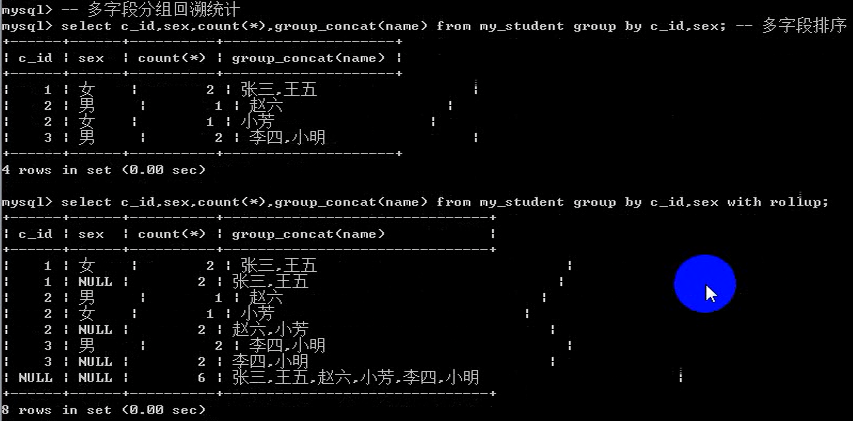
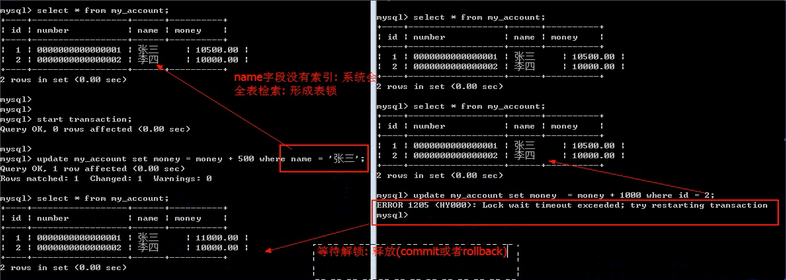

# MySQL基础学习笔记

---

### 基础知识

1、SQL：Structured Query Language，结构化查询语言。分为以下类型：

* DDL：Data Definition Language，数据定义语言，用来维护存储数据的结构（数据库、表），代表语句：`create`、`drop`、`alter`；
* DML：Data Manipulation Language，数据操纵语言，用来对对数据进行操作（数据表中的内容），代表语句：`insert`、`delete`、`update`；
* DQL：Data Query Language，数据查询语言，用来查询数据，代表语句：`select`；
* DCL：Data Control Language，数据控制语言，主要负责权限管理，代表语句：`grant`、`revoke`；

2、连接服务器

~~~plaintext
-- 连接数据库服务器
mysql -hlocalhost -P3306 -uroot -p

-- 断开连接
exit、quit、\q
~~~

3、注释

~~~plaintext
1、双中划线+空格： -- 这是注释内容
2、使用井号： # 这是注释内容
~~~

4、查看警告

~~~sql
show warnings;
~~~

5、校对集

校对集：数据比较的方式，有三种格式：

* _bin：binary，二进制比较，取出二进制，一位一位的比较，区分大小写；
* _cs：case sensitive，大小写敏感，区分大小写；
* _ci：case insensitive，大小写不敏感；

查看数据库支持的校对集： `show collations`；

校对集用于设置数据比较的方式，如排序（order by）、比较（>、<）等，使用不同校对集比较的结果可能不一样。另外，校对集必须在没有数据前设置好；如果已有数据再修改校对集，则不会起作用。

### 字符编码问题

~~~sql
-- 查看数据库服务器支持识别的字符集
show character set;

-- 查看数据库服务器默认对外处理的字符集
show variables like 'character_set%';
~~~

结果如下：

当使用cmd命令行工具作为客户端连接数据库时，因为cmd环境的字符集编码为gbk，并且是不可改变的，只能修改数据库服务器的字符集编码。

~~~sql
-- 修改服务器对客户端数据的字符集
set character_set_client=gbk;

-- 修改服务器返回给客户端结果数据的字符集
set character_set_result=gbk;
~~~

以上设置字符集编码的动作只对当前会话起作用，连接断开后需要重新设置。可以使用以下快捷方式设置：

~~~sql
set names gbk; -- 等价于 character_set_client、character_set_result、character_set_connection 三个
~~~

### 库操作

1、新增

~~~sql
create database 数据库名称 [库选项];
库选项：
字符集设定：charset/character set 字符集名称
校对集设定：collate 校对集名称

示例
create database demo charset utf8;
create database demo character set gbk;
create database `database` charset utf8; --关键字转义
create database 中文 charset utf8; --如果使用cmd环境为gbk，需先执行set names gbk;
~~~

执行创建数据库语句，会在数据库`data`目录下新建一个以数据库名称命名的文件夹，文件夹下有有一个`.opt`后缀的文件，保存了库选项信息：

2、查看

~~~sql
show databases;
show databases like 'pattern';
show create database 数据库名称;

--示例
show databases;
show databases like 'test\_%'; -- _代表单个字符，%代表多个字符；查询以‘test_’开头的数据库，\表示转义
show create database demo;
~~~

3、更改

~~~sql
alter database 数据库名称 [库选项];
注：数据库名称不可修改，库选项可以修改；

示例
alter database demo charset gbk;
~~~

4、删除

~~~sql
drop database 数据库名称;

示例
drop database demo;
~~~

### 表操作

1、新增

~~~sql
create table [if not exists] 表名(字段名 字段类型, 字段名 字段类型...)[表选项];

表选项：
字符集设定：charset/character set 字符集名称
校对集设定：collate 校对集名称
存储引擎：engine 'innodb|myisam'

示例
create table if not exists demo(
	name varchar(10),
	gender varchar(10),
	number varchar(10),
	age int
) charset utf8;
~~~

> 注：建表时需要在指定数据库下（use mydb），否则需要在表名前加上数据库名，如mydb.demo。

执行建表语句，会在对应数据库文件夹下生成相应的表结构文件（跟存储引擎有关）

2、查看

~~~sql
show tables;
show tables like 'pattern';
show create table 数据表名称;
show create table 数据表名称\g; -- 结果横向展示
show create table 数据表名称\G; -- 结果纵向展示
desc 数据表名称;
describe 数据表名称;
show columns from 数据表名称;

示例
show tables;
show tables like 'test\_%'; -- _代表单个字符，%代表多个字符；查询以‘test_’开头的表，\表示转义
show create table demo;
show create table demo\g;
show create table demo\G;
desc demo;
describe demo;
show columns from demo;
~~~

查看表结构：

3、更改

~~~sql
修改表
rename table 旧表名 to 新表名; -- 表重命名
alter table 表名 表选项； -- 修改表选项（字符集、校对集、存储引擎）

修改字段
alter table 表名 add [column] 字段名 字段类型 [列属性] [位置]; -- 添加字段，位置（First：第一个位置； After XXX：在指定列后； 默认值为最后）
alter table 表名 modify 字段名 字段类型 [列属性] [位置]; -- 修改字段
alter table 表名 change 旧字段名 新字段名 字段类型 [列属性] [位置]; -- 重命名字段
alter table 表名 drop 字段名; -- 删除字段

示例
rename table demo to my_demo;
alter table demo charset gbk;
alter table demo add column id int first;
alter table demo modify number char(10) after id;
alter table demo change gender sex varchar(10);
alter table demo drop age;
~~~

4、删除

~~~sql
drop table 表名1, 表名2...;

示例
drop table demo;
~~~

### 数据操作

1、新增

~~~sql
insert into 表名 values(值列表)[,(值列表)];

示例
insert into demo values
(1, 'no_001', 'aaa', 'male'),
(2, 'no_002', 'bbb', 'female'); --可一次插入多条数据
~~~

2、查看

~~~sql
select */字段列表 from 表名 [where 条件列表];

示例
select * from demo;
select id,name,age from demo where id=2;
~~~

3、更改

~~~sql
update 表名 set 字段名=值... [where 条件列表];

示例
update demo set name='ccc' where id=2;
~~~

4、删除

~~~sql
delete from 表名 [where 条件列表];

示例
delete from demo where id=1;
~~~

### 列类型

1、数值型-整数型

* 可使用`unsigned`控制是否有正负；

~~~sql
create table my_int(name tinyint)charset utf8;
insert into my_int values(255); -- error， 有符号数，已经超出范围，修改如下
create table my_int(name tinyint unsigned)charset utf8;
~~~

* 可使用`zerofill`进行前导0填充；

设置显示宽度，不会改变数值大小，当数值位数超过显示宽度时不作用，当数值位数不足显示宽度时，补0，一般配合`zerofill`使用：

~~~sql
create table my_int(name tinyint(4) zerofill)charset utf8;
~~~

* 也存在布尔`bool`类型，但是就是`tinyint(1)`的别名；

2、数值型-小数型-浮点型

* float(M,D)：M表示总长度，D表示小数部分长度，M-D表示整数部分长度；整数部分不能超出长度范围，小数部分超出范围部分系统会进行四舍五入（但如果是进位导致整数部分超出范围，系统也是允许的）；

~~~sql
create table my_float(
	f1 float,
	f2 float(10,2), --10在精度范围之外
	f2 float(6,2) --6在精度范围之内
)charset utf8;
~~~

3、数值型-小数型-定点型

* decimal(M,D)：M表示总长度，D表示小数部分长度，M-D表示整数部分长度；整数部分绝对不能超出长度范围；

~~~sql
create table my_decimal(
	f1 float(10,2),
	d2 decimal(10,2)
)charset utf8;
~~~

4、日期时间类型

~~~sql
-- 插入时间，可使用负数
insert into my_date(time) values('-11:50:54');
insert into my_date(time) values('-211:50:54');
insert into my_date(time) values('-2 11:50:54');

-- 插入年份，可使用两位或四位
insert into my_date(year) values(2019)
insert into my_date(year) values(69); -- year=2069
insert into my_date(year) values(70); -- year=1970

-- timestamp，只要所在记录更新，timestamp就自动更新

-- 获取时间戳
select unix_timestamp();
~~~

5、字符串类型

* 定长字符串：char，磁盘（二维表）在定义结构的时候，就已经确定了数据的最终存储长度。char（L)，L表示可以存储的长度，单位为字符，最大长度值为255；如char（4）在UTF-8环境下需要`4*3`个字节；
* 变长字符串：varchar，在分配空间的时候按照最大的空间来分配；但是实际上最终用了多少，是根据具体的数据来确定。varchar（L)，L表示可以存储的长度，单位为字符，最大长度值为65536；但是一般会多出1到2个字节来确定实际存储的长度；如varchar（10）在UTF-8环境下需要`10*3+1=31`个字节；

> 定长字符串比较浪费存储空间，但是效率高，在数据确定长度基本上一致时使用；变长字符串比较节省存储空间，但是效率较低。一般情况下，如果长度超过255，既不用定长字符串也不用变长字符串，使用text。

* 字符文本：text
* 二进制：blob
* 枚举：enum（元素列表）

~~~sql
create table my_enum(gender enum('男', '女', '保密'))charset utf8;
insert into my_enum values('男');
insert into my_enum values('女');
insert into my_enum values('保密');

select gender, gender+0 from my_enum; --枚举存储的实际上是数值而不是字符串本身，按照顺序从1开始

insert into my_enum values(1); --直接插入数值
~~~

> 枚举在定义的时候，系统会自动建立一个数据与枚举元素的对应关系（关系存放到日志中）；在进行数据插入的时候，系统自动将字符转换成对应的数字存储，在进行数据提取的时候，系统自动将数字转换成对应的字符显示。

* 集合：set（元素列表），集合跟枚举类似，存储数值，但是可以存储多个；

~~~sql
create table my_set(
	hobby set('篮球', '足球', '网球', '台球', '排球')
)charset utf8;
insert into my_set values('篮球,足球,台球');

select hobby, hobby+0 from my_set; --存储的实际上是数值而不是字符串本身
-- 关于存储数值的细节：
-- 根据集合的选项个数创建相应位数的二进制位，选项从左往右对应二进制从低到高的位；
-- 比如插入'篮球,足球,台球'，对应的二进制位01011，1表示该选项选中，0表示未选中；
-- hobby+0 的数值即为该二进制的值；
-- 插入元素的顺序不会影响存储

insert into my_set values(1); --2^0=1,第1个选项，即篮球；
insert into my_set values(2); --2^1=2,第2个选项，即足球；
insert into my_set values(3); --2^0+2^1=3,第1、2个选项，即篮球,足球；
~~~

### MySQL记录长度

1、mysql规定，任何一条** 记录 **的长度（记录所有字段长度之和）不能超过65535个字节，所以varchar永远达不到它的理论长度。

~~~sql
-- utf-8下varchar最大长度（21844）
create table my_utf8(
	name varchar(21844) --21844*3+2=65532+2=65534
)charset utf8;

-- gbk下varchar最大长度（32766）
create table my_gbk(
	name varchar(32766) --32766*2+2=65532+2=65534
)charset gbk;
~~~

2、mysql记录中，如果有任何一个字段允许为空，那么系统会从整条纪录中保留一个字节来存储NULL。

~~~sql
-- utf-8下完全利用所有长度（1+65534=65535）
create table my_utf8(
	age tinyint not null, --1
	name varchar(21844) not null --21844*3+2=65532+2=65534
)charset utf8;

-- gbk下完全利用所有长度（1+65534=65535）
create table my_gbk(
	age tinyint not null, --1
	name varchar(32766) not null --32766*2+2=65532+2=65534
)charset gbk;
~~~

必须添加`not null`约束，释放null占用的空间，才能完全利用长度。

3、mysql中，text文本字符串不占用记录长度，它是额外存储的；但是text文本字符串也属于记录的一部分，会占用记录的一部分长度：10个字节。

~~~sql
-- text占用10个字节长度
create table my_text(
	content text not null, --10
	name varchar(21841) not null --21841*3+2=65523+2=65525
)charset utf8;
~~~

### 列属性

1、空属性

* NULL（默认）
* NOT NULL

~~~sql
create table tab(
	id int not null,
	name varchar(10) null
)charset utf8;
~~~

2、默认值

* DEFAULT

~~~sql
create table tab(
	name varchar(10),
	age tinyint unsigned default 0,
	gender enum('男','女','保密') default '男'
)charset utf8;

insert into tab values('zhangsan', 10, default); --可以使用关键字default插入默认值
~~~

3、列描述

* COMMENT

~~~sql
create table tab(
	id int comment '编号',
	name varchar(10) comment '姓名'
)charset utf8;
~~~

4、主键

* PRIMARY KEY

~~~sql
-- 设置单个字段为主键
create table tab(
	id int primary key
)charset utf8;

-- 设置多个字段为主键
create table tab(
	id int,
	uid int,
	score float,
	primary key(id, uid)
)charset utf8;

-- 修改表的方式添加主键
create table tab(
	id int
)charset utf8;
alter table tab modify id int primary key;
alter table tab add primary key(id);

--删除主键
alter table tab drop primary key;

-- 主键不能更改，只能先删除，再添加

~~~

5、自增长

* AUTO_INCREMENT
* 字段本身是一个索引（key一栏有值）
* 字段类型必须是整型数值
* 从当前字段已有的最大值加1
* 当给定自增长字段的值为NULL或者默认值时触发
* 一张表只能有一个自增长字段

~~~sql
create table tab(
	id int primary key auto_increment
)charset utf8;
~~~

查看当前自增长的值：

修改当前自增长已经存在的值，只能比当前最大值还要大

~~~sql
alter table tab auto_increment=10; --如果设置的值比当前值小，不会报错，但是设置不起效，根本不会改变
~~~

查看自增长变量：

~~~sql
show variables like 'auto_increment%'
~~~

修改自增长变量：

~~~sql
set auto_increment_increment=5;
set auto_increment_offset=10;
~~~

> 修改这两个变量会影响整个数据库。且只对当前会话有效。

删除自增长：

~~~sql
alter table tab modify id int;
~~~

6、唯一键

* UNIQUE

~~~sql
create table tab(
	id int primary key auto_increment,
	name varchar(10) unique
)charset utf8;

create table tab(
	id int primary key auto_increment,
	name varchar(10),
	number varchar(20),
	unique key(number)
)charset utf8;

create table tab(
	id int primary key auto_increment,
	name varchar(10)
)charset utf8;
alter table tab add unique key(name);
~~~

更新：先删除再添加。

删除：

~~~sql
-- 先查出唯一键的索引名称，再删除（索引名称默认以字段名命名）
alter table tab drop index number;
~~~

### 关系

1、一对一

2、一对多

3、多对多

### 范式

范式（Normal Format），是离散数学中的概念，是为了解决一种数据的存储与优化问题：数据存储之后，凡是能够通过关系寻找出来的数据，坚决不再重复存储。其目标是为了减少数据的冗余。

范式是一种分层的结构，共六层，每一层都比上一层更加严格。若要满足下一层范式必须先满足上一层的。

1、第一范式（1NF）

在设计表存储数据的时候，如果表中设计的字段存储的数据，在取出来使用之前还需要额外的处理（如拆分），则说明表的设计不满足第一范式。即第一范式要求字段的数据具有原子性。

2、第二范式（2NF）

在数据表设计的过程中，如果有复合主键（多字段主键），且表中有字段并不是由整个主键来确定，而是依赖于主键中的某个字段（主键的部分）；即存在字段依赖主键的部分的问题，称之为部分依赖；第二范式就是要解决表设计不允许出现部分依赖。

3、第三范式（3NF）

理论上，一张表中所有的字段都应该直接依赖主键（逻辑主键除外）。如果表设计中存在一个字段，并不直接依赖主键，而是通过某个非主键字段依赖，而实现依赖主键。把这种不是直接依赖主键，而是依赖非主键字段的依赖关系称之为传递依赖。第三范式就是要解决传递依赖的问题。

4、逆规范化

有时候，在设计表的时候，如果一张表中有几个字段是需要从另外的表中去获取信息，理论上讲的确可以获取到想要的数据，但是效率会低一点。会刻意的在某些表中，不保存另外表的主键（逻辑主键），而是直接保存想要的数据信息；这样一来，在查询数据的时候，一张表就可以提供数据，不需要多表查询。

> 一般设计表的时候，只需要满足前三个范式即可。

### 高级操作

1、主键冲突（duplicate key）

~~~sql
create table tab(
	id int primary key,
	name varchar(20)
)charset utf8;

--更新
insert into tab(id,name) values(1, 'xxx') on duplicate key update id=2;

--替换
replace into tab(id,name) values(1, 'xxx');
~~~

2、蠕虫复制

从已有的数据中获取数据，然后将数据进行新增操作，数据成倍的增加。

* 从已有表创建新表（只复制表结构，不复制表数据）

~~~sql
create table 表名 like 数据库名.表名;
~~~

* 蠕虫复制（先查出数据，再将查出的数据插入表）

~~~sql
insert into 表名[(字段列表)] select */[字段列表] from 表名;
~~~

3、限制记录

~~~sql
update 表名 set 字段=值 [where 条件] [limit 更新数量];
update tab set name='zzz' where name='xxx' limit 3;

delete from 表名 [where 条件] [limit 更新数量];
delete from tab where id<10 limit 5;
~~~

4、删除

~~~sql
-- 先删除表，再创建该表；清空表，重置自增长；
truncate 表名；
~~~

5、select 选项

* All：默认的，保留所有的结果；
* distinct：去重；

6、字段别名

~~~sql
-- 字段名 [as] 别名

select id, name as 姓名, age 年龄 from tab;
~~~

7、分组

* group by

配合分组使用的常见函数：

* max()：分组中最大值；
* min()：分组中最小值；
* sum()：分组求和；
* avg()：分组平均值；
* count()：计数；count(*)统计所有记录数，count(字段名)统计字段数（null不统计）；

> 分组会按照分组字段升序排序。

group_concat()：该函数可对分组的结果中某个字段进行字符串连接；

~~~sql
create table tab(id int, sex char(10), name varchar(20))charset utf8;

select sex, group_concat(name) from tab group by sex;
~~~

回溯统计：with rollup

8、having 子句

* 分组统计的结果或者统计函数都只有having能够使用；
* having可以使用字段别名，where不能；where是从硬盘取数据，名字只能是字段名，别名是在数据进入到内存才产生的；

9、limit子句

* 用来限制长度（数据量）；limit 数据量；
* 用来限制起始位置，限制数量：limit 起始位置，数量；

### 索引

1、概述

系统根据某种算法，将已有的数据（以及未来新增的数据），单独建立一个文件，文件能够实现快速地匹配数据，并且能够快速找到对应表中的相应记录。

2、索引的意义

* 提升查询数据的效率；
* 约束数据的有效性

3、索引的分类

* 主键索引：primary key
* 唯一索引：unique key
* 全文索引：fulltext index，针对文章内部的关键字进行索引
* 普通索引：index

### 连接查询

1、交叉连接（笛卡尔积）

左表 cross join 右表

~~~sql
select * from tab1 cross join tab2;
~~~

2、内连接

左表 [inner] join 右表 on 左表.字段=右表.字段

~~~sql
select * from tab1 inner join tab2 on tab1.id=tab2.tid;
~~~

> 可以使用where代替on，但是where效率不如on。

3、外连接

左表 left/right join 右表 on 左表.字段=右表.字段

~~~sql
select * from tab1 left join tab2 on tab1.id=tab2.tid;
select * from tab1 right join tab2 on tab1.id=tab2.tid;
~~~

4、自然连接

* 左表 natural join 右表
* 左表 natural left/right join 右表

自然连接自动使用同名字段作为连接条件，连接之后会合并同名字段。

~~~sql
select * from tab1 natural join tab2;
select * from tab1 natural left join tab2;
select * from tab1 natural right join tab2;

-- 可以使用外连接模拟自然连接
select * from tab1 left join tab2 using(id);
~~~

### 外键

* FOREIGN KEY

* 外键存在的首要条件是，存储引擎需为innodb；如果不是innodb，外键可以创建成功，但是没有约束效果；
* 外键的字段类型必须与父表主键字段一致；
* 子表数据已存在的情况下建立外键，父表主键字段需存在对应的数据；

1、新增

~~~sql
-- 创建表时添加
create table tab(
	id int primary key,
	name varchar(10),
	c_id int,
	foreign key(c_id) references my_tab(id)
)charset utf8;

-- 修改表结构
alter table tab add [constraint f_key_1] foreign key(c_id) references my_tab(id);
~~~

2、删除

外键不可修改，只能先删除再添加。

~~~sql
alter table tab drop foreign key f_key_1;
~~~

3、约束

1）默认约束

* 对子表约束：子表数据进行写操作（增和改）的时候，如果对应的外键字段在父表中不存在，则操作失败；
* 对父表约束：父表数据进行写操作（删和改，涉及到主键本身），如果对应的主键在子表中已经被引用，则操作失败；

2）约束

* District：严格模式（默认），父表不能删除或者更新一个被子表数据引用的记录；
* Cascade：级联模式，父表的操作，对应子表关联的数据也跟着操作；
* set null：置空模式，父表的操作之后，子表对应数据（外键字段）被置空；

一般情况下，删除的时候子表置空，更新的时候子表级联操作。置空的前提是外键字段允许为空。

~~~sql
create table tab(
	id int primary key,
	name varchar(10),
	c_id int,
	foreign key(c_id) references my_tab(id) on delete set null on update cascade 
)charset utf8;
~~~

### 联合查询

select语句1  union  [union选项]  select语句2 ...

union选项：

* all：保留所有，不管重复；
* distinct：去重，默认选项；

联合查询只要求字段数量一致，字段类型不要求。

~~~sql
-- 使用order by必须要用括号括起来（如下），且要加上limit
(select * from tab where sex='男' order by age asc limit 99999999)
union
(select * from tab where sex='女' order by age desc limit 99999999);
~~~

### 子查询

1、子查询分类

1）按位置分类：子查询在外部查询中出现的位置

* from子查询：子查询出现在from之后；
* where子查询：子查询出现在where条件中；
* exists子查询：子查询出现在exists里面；

2）按结果分类：根据子查询得到的数据进行分类

* 标量子查询：子查询得到的结果是一行一列（出现的位置是在where之后）；
* 列子查询：子查询得到的结果是一列多行（出现的位置是在where之后）；
* 行子查询：子查询得到的结果是一行多列（多行多列，出现的位置是在where之后）；
* 表子查询：子查询得到的结果是多行多列（出现的位置是在from之后）；

2、标量子查询

~~~sql
--查找3班的学生
select s.* from student s where s.cid=(
	select c.id from class c where c.name='3班'
);
~~~

3、列子查询

~~~sql
--查找所有在读班级的学生
select s.* from student s where s.cid in (select c.id from class c);

select s.* from student s where s.cid =any (select c.id from class c);
select s.* from student s where s.cid =some (select c.id from class c);
select s.* from student s where s.cid =all (select c.id from class c);

select s.* from student s where s.cid !=any (select c.id from class c); --所有结果（null除外）
select s.* from student s where s.cid !=some (select c.id from class c);--所有结果（null除外）
select s.* from student s where s.cid !=all (select c.id from class c);--2条结果（null除外）
~~~

4、行子查询

~~~sql
--查找年龄最大、身高最高的学生
select s.* from student s where (s.age,s.height) = (
	select max(age), max(height) from student
);
~~~

5、表子查询

返回的结果是当做二维表来使用。也叫from子查询，得到的结果作为from的数据源。

~~~sql
--查找每个班身高最高的学生
select * from (
	select * from student order by height desc
) as stu group by cid;
~~~

6、exists子查询

~~~sql
--查询所有学生，班级存在的
select * from student s where exists(select * from class c where c.id=s.cid);
~~~

### 视图

1、创建

~~~sql
create view 视图名 as select语句；

create view my_view as select * from tab;
~~~

如果视图是由多张基本表构成，则字段不能重复。

2、查看

~~~sql
show tables like 'my_view';
desc my_view;
show create table my_view;
show create view my_view;
~~~

3、修改

~~~sql
alter view 视图名 as select语句；

alter view my_view as select * from my_tab;
~~~

4、删除

~~~sql
drop view 视图名；

drop view my_view;
~~~

5、新增数据

* 多表视图不能新增数据；
* 单表视图可以新增数据，但是视图中包含的字段必须有基表中所有不能为空（或者没有默认值）字段；

~~~sql
insert into my_view values(1, 'xxx');
~~~

6、删除数据

* 多表视图不能删除数据；
* 单表视图可以删除数据；

~~~sql
delete from my_view where id=1;
~~~

7、更新数据

* 多表视图和多表视图都可以更新数据；
* 更新限制：with check option，如果在新建视图的时候对某个字段做了限制，那么对视图数据进行更新操作的时候，系统会进行检验：要保证更新之后，数据依然可以被实体查询出来，否则不让更新；

~~~sql
update my_view set name='sss' where id=1;

create view my_view_1 as 
select * from tab where age>20
with check option;
update my_view_1 set age=19 where id=1; --error
~~~

8、视图算法

系统对视图内部select语句以及外部查询视图的select语句 的一种解析方式。

* undefined：未定义（默认），不是实际的算法，告诉系统视图没有定义算法，自己选择；
* temptable：临时表算法，先执行视图内部的select语句，再执行外部的select语句；
* merge：合并算法，系统先将视图内部的select语句与外部查询视图的select语句进行合并，然后执行，效率高（较常用）；

~~~sql
create algorithm=指定算法 view 视图名 as select语句；

create algorithm=merge view my_view as select * from tab;
~~~

如果视图的select语句中会包含一个查询子句，而且很有可能顺序比外部的查询语句要靠后，则一定要使用temptable算法；其它情况默认即可。

### 数据备份与恢复

1、数据表备份

直接进入数据库文件夹复制对应的表结构以及数据文件，还原的时候将内容放回去即可。

因为InnoDB是只有表结构，全部数据是集中存储的，复制只有表结构而没有数据的；而MyISAM是表数据和索引全部单独分开存储的，所以这种备份方式适合使用MyISAM引擎的表。

2、单表备份

1）备份：从表中选出一部分数据保存到外部文件中。（外部文件不能是已经存在的文件）

~~~sql
select */字段列表 into outfile 文件路径 from 数据源；
select * into outfile 'c:/tab.txt' from tab;

select */字段列表 into outfile 文件路径 fields 字段处理 lines 行处理 from 数据源；
字段处理：
1）enclosed by：字段使用什么内容包裹，默认是空字符串''；
2）terminated by：字段使用什么方式结束，默认是tab键，即'\t'；
3）escaped by：特殊符号用什么方式处理，默认是'\\'；
行处理：
1）starting by：每行以什么开始，默认是空字符串''；
2）terminated by：每行以什么结束，默认是'\r\n'；

select * into outfile 'c:/tab.txt'
fields enclosed by '"' terminated by '|'
lines starting by 'START:'
from tab;
~~~

只能备份表数据，不能备份表结构。

2）还原

将一个外部文件保存的数据重新恢复到表中。（表结构必须存在）

~~~sql
load data infile 文件路径 into table 表名[(字段列表)] fields 字段处理 lines 行处理；

load data infile 'c:/tab.txt' into table tab
fields enclosed by '"' terminated by '|'
lines starting by 'START:';
~~~

3、SQL备份

对表结构及表数据进行处理，变成对应的SQL语句，然后备份；还原的时候只要执行SQL语句即可。

~~~sql
mysqldump -hPup 数据库名称 [表名1[，表名2...]] > 文件名

mysqldump -uroot -proot mydb > c:/mydb.sql
mysqldump -uroot -proot mydb mytab > c:/mytab.sql
mysqldump -uroot -proot mydb mytab1,mytab2 > c:/mytab12.sql
~~~

~~~sql
mysql -hPup 数据库名称 < 文件名
mysql -uroot -proot mydb < c:/mydb.sql

source  文件名;
source c:/mydb.sql;
~~~

> mysqldump、mysql是外部命令；而source是内部指令，需登录mysql并在指定数据库下执行。

4、增量备份

不是针对数据或者SQL指令进行备份，是针对mysql服务器的日志文件进行备份。在指定时间段进行备份，备份数据不会重复，而且所有操作都会备份。

### 事务

事务开启之后，所有的操作都会临时保存到事务日志，事务日志只有在得到commit命令才会同步到数据表，其它任何情况都会清空（rollback，断电，断开连接等等）；

1、事务的特性（ACID）

* 原子性：Atomic，事务的整个操作是一个整体，不可分割，要么全部成功，要么全部失败；
* 一致性：Consistency，事务操作的前后，数据表中的数据没有变化；
* 隔离性：Isolation，事务操作是相互隔离不受影响的；
* 持久性：Durability，数据一旦提交不可改变，即会永久地改变表中的数据；

锁机制：Innodb默认是行锁，但是如果在事务操作的过程中没有使用到索引，那么系统会自动全表检索数据，自动升级为表锁；

2、事务操作分为两种：自动事务（默认）、手动事务。

1）自动事务

~~~sql
show variables like 'autocommit';
set autocommit=0;
--或者
set autocommit=off;

set autocommit=1;
--或者
set autocommit=on;
~~~

2）手动事务的操作流程：

* 开启事务：start transaction，告诉系统以下所有操作不要直接写入到数据表，先存放到事务日志；
* 进行事务操作；
* 关闭事务：（1）提交事务：commit，选择性地将事务日志文件中操作的结果保存到数据表（同步）；（2）回滚事务：rollback，直接清空事务日志；

3、回滚点

* 设置回滚点：savepoint 回滚点名称；
* 回到回滚点：rollback 回滚点名称；

~~~sql
start transaction;

update tabA set account=account-1000 where id=1;

savepoint sp1;

update tabB set account=account+1000 where id=2; //出现错误

rollback sp1;

update tabB set account=account+1000 where id=1;

commit;
~~~

### 变量

1、系统变量

1）查看变量：show variables;

~~~sql
show variables;
show variables like 'character%';
~~~

2）查看变量值：select @@变量名;

~~~sql
select @@version, @@autocommit, @@character_set_result;
~~~

3）修改变量值：

* 会话级别：set 变量名=值 或者 set @@变量名=值；
* 全局级别：set global 变量名=值；

2、自定义变量

所有自定义变量都是会话级别的。

1）定义变量：set @变量名=值；

~~~sql
set @myvar=1;
set @yourvar='abc';
~~~

2）查看变量：select @变量名；

~~~sql
select @myvar;
select @yourvar;
~~~

> MySQL为了区分‘=’的赋值特性和比较特性，重新定义了一个赋值符号，：=。即set @name := 'aaa'。

### 触发器

触发器（trigger）：

* 事件类型：增（insert）、删（delete）、改（update）；
* 触发时间：前（before）、后（after）；
* 触发对象：表中的每一条记录；

触发类型和触发时间组合成6种触发器，且一张表中只能同时拥有这6种，同一种不能重复定义。

1、创建

~~~sql
-- 临时修改语句结束符(后续代码中只有碰到语句结束符才算结束)
delimiter 自定义符号
create trigger 触发器名称 触发时间 事件类型 on 表名 for each row
begin
	多个语句
end
语句结束符
delimiter ; --还原语句结束符

delimiter $$
create trigger my_trigger after insert on my_tab for each row
begin
	update my_tab2 set num=3 where id=1;
end
$$
delimiter ;
~~~

> 所有的触发器都会保存到一张表中：information_schema.triggers。

2、查看

~~~sql
-- show triggers [like 'pattern'];
show triggers;
show triggers like 'my%';

-- show create trigger 触发器名称;
show create trigger my_trigger;
~~~

3、删除

~~~sql
-- drop trigger 触发器名称;
drop trigger my_trigger;
~~~

4、触发器记录

不管触发器是否触发，只要当某种操作准备执行，系统就会将当前要操作的记录的当前状态和即将执行之后的新的状态给分别保留下来，供触发器使用；其中，要操作的当前状态保存到old中，操作之后的可能形态保存到new中。old代表旧记录，new代表新记录；插入没有old，删除没有new。

~~~sql
delimiter $$
create trigger my_trigger after insert on my_tab for each row
begin
	update my_tab2 set num=num+new.num where id=new.id;
end
$$
delimiter ;
~~~

5、分支结构

~~~sql
-- 基本语法
if 条件 then
	语句1
else
	语句2
end if;
~~~

~~~sql
delimiter %%
create trigger my_trigger before insert on my_tab for each row
begin
	select num from my_tab2 where id=new.id into @num;
	if @num<new.num then
		update my_tab2 set num=num-new.num where id=new.id;
	end if;
end
%%
delimiter ;
~~~

6、循环结构

~~~sql
-- 基本语法
while 条件 do
	语句;
	结束条件;
end while;
~~~

循环控制：

* iterate：迭代，类似于continue；
* leave：离开，类似于break；

~~~sql
循环名字:while 条件 do
	语句;
	iterate/leave 循环名字;
end while;
~~~

### 函数

1、系统函数

* substring：截取子串

~~~sql
select substring('hello world', 1, 1); //h
select substring('你好世界', 1, 1); //你

-- 下标从1开始，截取单位为字符；
~~~

* char_length、length：字符长度、字节长度

~~~sql
select char_length('hello world'), char_length('你好世界'), length('hello world'), length('你好世界');

-- 11、4、11、8
~~~

* instr：判断某个字符串是否在指定字符串中包含，并返回位置

~~~sql
select instr('hello world', 'll'), instr('你好世界', '你'), instr('你好世界', 'w');

-- 3、1、0
~~~

* lpad、rpad：左/右填充

~~~sql
select lpad('hello world', 20, 'hi'), lpad('你好世界', 20, '欢迎');
~~~

* insert：字符串替换

~~~sql
select insert('hello world', 3, 3, 'y'); //hey world,从第3位开始的连续3位替换为y
~~~

* strcmp：字符串比较

~~~sql
select 
strcmp('hello', 'hey'), //-1
strcmp('hey', 'HEY'), //0
strcmp('hey', 'hello'); //1
~~~

2、定义函数

~~~sql
create function 函数名([形参列表]) returns 返回值类型
begin
	函数体
	返回值
end

create function myshow() returns int
return 100;

select myshow();
~~~

> 函数是属于数据库的，只能在所属数据库使用。

3、查看函数

~~~sql
-- show function status [like 'pattern'];
show function status;
show function status like 'my%';

-- show create function 函数名;
show create function myshow;
~~~

4、删除函数

~~~sql
-- drop function 函数名;
drop function myshow;
~~~

5、参数

~~~sql
-- 计算1到指定数的和
delimiter $$
create function myadd(num int) returns int
begin
	set @i=1;
	set @sum=0;
	while @i<=num do
		set @sum = @sum + @i;
		set @i = @i + 1;
	end while;
	return @sum;
end
$$
delimiter ;
~~~

6、作用域

MySQL的变量作用域与js的作用域类似。

* 全局变量：使用set定义，使用@标志的变量；
* 局部变量：使用declare关键字声明，没有@符号；必须在函数体开始之前声明；

~~~sql
-- 计算1到指定数的和
delimiter $$
create function myadd(num int) returns int
begin
	declare i int default 1;
	declare sum int default 0;
	mw:while i<=num do
		if i%5 = 0 then
			set i = i + 1;
			iterate mw;
		end if;
		set sum = sum + i;
		set i = i + 1;
	end while;
	return sum;
end
$$
delimiter ;
~~~

### 存储过程

1、创建

~~~sql
create procedure 名称([参数列表])
begin
	过程体
end

create procedure mypro()
select * from mytab;
~~~

2、查看

~~~sql
-- show procedure status [like 'pattern'];
show procedure status;
show procedure status like 'my%';

-- show create procedure 存储过程名;
show create procedure mypro;
~~~

3、调用

~~~sql
-- call 存储过程名;
call mypro();
~~~

4、删除

~~~sql
-- drop procedure 存储过程名;
drop procedure mypro;
~~~

5、参数类型

* in：数据只是从外部传入给内部使用（值传递），可以是数值也可以是变量；
* out：只允许过程内部使用（不用外部数据），给外部使用的（引用传递：外部的数据会被先清空才会进入到内部），只能是变量；
* inout：外部的可以在内部使用，内部修改也可以给外部使用（引用传递，只能是变量）；

~~~sql
create procedure 名称(in 参数名称 参数类型, out 参数名称 参数类型, inout 参数名称 参数类型)
begin
	过程体
end

delimiter $$
create procedure mypro(in i int, out o int, inout io int)
begin
	select i, o, io; //o一定是null
end
$$
delimiter ;

-- out、inout类型的参数必须传入变量
set @v1=1;
set @v2=2;
set @v3=3;
select @v1, @v2, @v3; //1、2、3
call mypro(@v1, @v2, @v3); //1、null、3
select @v1, @v2, @v3; //1、null、3
~~~

在存储过程中局部变量和全局变量不会互相影响；但是在存储过程调用结束后，out和inout类型会将过程内部对应的局部变量的值重新返回给对应传入的全局变量。

~~~sql
set @v1=1;
set @v2=2;
set @v3=3;

delimiter $$
create procedure mypro(in i int, out o int, inout io int)
begin
	select i, o, io; //1、null、3
	set i=10;
	set o=100;
	set io=1000;
	select i, o, io; //查看局部的:10、100、1000
	
	select @v1, @v2, @v3;  //查看全局的:1、2、3
	set @v1='a';
	set @v2='b';
	set @v3='c';
	select @v1, @v2, @v3;  //查看全局的:a、b、c
end
$$
delimiter ;

call mypro(@v1, @v2, @v3);
select @v1, @v2, @v3; //a、100、1000
~~~

### 常见存储引擎对比

Innodb与MyISAM的数据存储方式对比：

* Innodb：只有表结构，数据全部存储到ibdata1文件中；
* MyISAM：表数据和索引全部单独分开存储；

   

---

