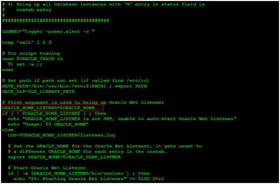

# CentOS 6.6安装Oracle 11g教程

---

### 环境说明

1、内存(RAM)要求：最小要求是 1GB，建议 2GB 及以上。

~~~plaintext
cat /proc/meminfo|head -1
~~~

2、交换内存(Swap)要求：设置跟物理内存一样。

~~~plaintext
cat /proc/swaps
~~~

3、临时文件目录要求：要求临时文件目录，如/tmp 的磁盘空间至少 1GB。这里/tmp是挂载在根目录下的，不止是1G的空间。

~~~plaintext
df -h
~~~

4、磁盘空间要求：企业版为4.35GB的安装空间和1.7GB以上的数据文件空间；标准版为4.22GB的安装空间和1.5GB以上的数据文件空间。

~~~plaintext
df -h
~~~

5、修改主机名：

~~~plaintext
sed -i "s/HOSTNAME=localhost.localdomain/HOSTNAME=oracledb/" /etc/sysconfig/network
hostname oracledb
~~~

~~~plaintext
vim /etc/sysconfig/network
~~~

注：重启系统使之生效。

6、添加主机名与IP对应记录：

~~~plaintext
vim /etc/hosts
~~~

7、附VMware虚拟机配置：

### 安装依赖程序包

1、相关依赖包：

~~~plaintext
binutils-2.17.50.0.6
compat-libstdc++-33-3.2.3
elfutils-libelf-0.125
elfutils-libelf-devel-0.97
gcc-4.1.2
gcc-c++-4.1.2
glibc-2.3.4
glibc-common-2.5
glibc-devel-2.5
glibc-headers-2.5
ksh-20060214
libaio-0.3.105
libaio-devel-0.3.105
libgcc-3.4.6
libstdc++-3.4.6
libstdc++-devel 4.1.2
make-3.81
sysstat-7.0.2
unixODBC-2.2.11-11.el6 (x86_64)or later
unixODBC-devel-2.2.11-11.el6(x86_64) or later
libXp
~~~

2、查看程序包是否已经安装：

~~~plaintext
yum list | grep 'package name'
~~~

3、安装依赖包：

~~~plaintext
yum install -y ksh binutils compat-libstdc++-33 elfutils-libelf elfutils-libelf-devel gcc gcc-c++ glibc glibc-common glibc-devel libaio libaio-devel libgcc libstdc++ libstdc++-devel make numactl sysstat libXp unixODBC unixODBC-devel
~~~

### 创建所需的用户组和账号

1、创建所需的用户组：

~~~plaintext
groupadd oinstall
groupadd dba
groupadd oper
~~~

2、创建所需的帐号：

~~~plaintext
#初始群组为 oinstall，有效群组为 dba、oper
useradd -g oinstall -G dba,oper oracle

#为oracle帐号设置密码(安装的时候需要登录)
passwd oracle
~~~

### 修改系统内核参数

1、编辑内核参数配置文件`/etc/sysctl.conf`，在该文件下修改或添加如下行：

~~~plaintext
fs.file-max = 6815744
fs.aio-max-nr = 1048576
kernel.shmall = 2097152
kernel.shmmax = 2147483648
kernel.shmmni = 4096
kernel.sem = 250 32000100 128
net.ipv4.ip_local_port_range = 9000 65500
net.core.rmem_default = 262144
net.core.rmem_max = 4194304
net.core.wmem_default = 262144
net.core.wmem_max = 1048576
~~~

~~~plaintext
vim /etc/sysctl.conf
~~~

2、执行以下命令使以上配置立即生效：

~~~plaintext
sysctl -p
~~~

注：

如果执行时报错：

~~~plaintext
error: "net.bridge.bridge-nf-call-ip6tables" is an unknown key
error: "net.bridge.bridge-nf-call-iptables" is an unknown key
error: "net.bridge.bridge-nf-call-arptables" is an unknown key
~~~

可以执行下面的命令：

~~~plaintext
modprobe bridge
~~~

再执行`sysctl -p`，就不报错了。

### 修改系统资源限制

1、编辑系统资源限制配置文件，在该文件添加如下行：

~~~plaintext
vim /etc/security/limits.conf
~~~

~~~plaintext
oracle soft nproc 2047
oracle hard nproc 16384
oracle soft nofile 1024
oracle hard nofile 65536
oracle soft stack 10240
~~~

### 关闭SELinux

1、编辑SELinux配置文件，将SELinux的值设为`disabled`，如下：

~~~plaintext
vim /etc/selinux/config
~~~

~~~plaintext
SELINUX=disabled
~~~

注：修改该文件可使重启系统后不启动SELinux。

2、关闭当前已开启的SELinux使用如下命令：

~~~plaintext
setenforce 0
~~~

### 创建所需的目录

1、把Oracle安装在 `/opt/oracle `目录下，所以需创建该目录：

~~~plaintext
mkdir /opt/oracle
chown oracle:oinstall /opt/oracle
chmod 755 /opt/oracle
~~~

2、安装时还需要设置 `Inventory `目录，所以需创建该目录：

~~~plaintext
mkdir /opt/oraInventory
chown oracle:oinstall /opt/oraInventory
chmod 755 /opt/oraInventory
~~~

### 上传安装包

1、Oracle 11g R2的安装包被压缩成两个文件：`linux.x64_11gR2_database_1of2.zip`、`linux.x64_11gR2_database_2of2.zip`，将它们上传到安装机器上`/home/oracle`目录下，并使用`unzip linux.x64_11gR2_database_1of2.zip`、`unzip linux.x64_11gR2_database_2of2.zip`命令进行解压缩，将得到一个名称为 `database` 的目录。

2、由于安装过程是以 oracle 身份进行的，所以需确保oracle帐号对 `/home/oracle/database` 有执行权限，可使用如下命令将该目录赋予oracle帐号所有，并拥有执行权限：

~~~plaintext
chmod -R 700 /home/oracle/database
chown -R oracle:oinstall /home/oracle/database
~~~

### 设置Oracle账号登录时的环境

1、以oracle用户登录，编辑文件`/home/oracle/.bash_profile`，添加如下行：

~~~plaintext
su oracle
vim /home/oracle/.bash_profile
~~~

~~~plaintext
#安装目录
ORACLE_BASE=/opt/oracle
#Oracle家目录
ORACLE_HOME=$ORACLE_BASE/11g
#实例名
ORACLE_SID=orcl
LD_LIBRARY_PATH=$ORACLE_HOME/lib 
PATH=$PATH:$ORACLE_HOME/bin:$HOME/bin 
export ORACLE_BASE ORACLE_HOME ORACLE_SID LD_LIBRARY_PATH PATH
~~~

2、保存退出后执行如下命令使以上设置立即生效：

~~~plaintext
source /home/oracle/.bash_profile
~~~

3、设置安装时默认语言为英文：

~~~plaintext
echo 'export LANG=en_US.UTF-8' >> ~/.bashrc
~~~

### 开始安装

1、以图形界面方式登录：

修改为5；

2、以oracle用户登录，不推荐root用户直接切换过去；

3、执行安装：

~~~plaintext
/home/oracle/database/runInstaller
~~~

### 安装过程图解

~~~plaintext
dd if=/dev/zero of=swapfile bs=1M count=1024
mkswap swapfile
swapon swapfile
free -m
~~~

### 测试验证

安装完毕，进行验证。利用system用户登录，查询v$tablespace的name字段：

### 修改启动脚本

1、修改 `/etc/oratab`（root用户）：

~~~plaintext
vim /etc/oratab
~~~

找到 `$ORACLE_HOME` 替换为 `$ORACLE_HOME` 变量的值，`$SID` 替换为 `$SID` 变量的值；`$SID:$ORACLE_HOME:N` 改为 `$SID:$ORACLE_HOME:Y`。最终配置文件改为如下所示：

~~~plaintext
orcl:/opt/oracle/11g:Y
~~~

2、修改启动脚本`dbstart`和关闭脚本`dbshut`：

修改`$ORACLE_HOME/bin/dbstart`和`$ORACLE_HOME/bin/dbshut`的内容，将`ORACLE_HOME_LISTNER=$1` 修改为：
`ORACLE_HOME_LISTNER=$ORACLE_HOME`。

3、命令说明（oracle用户下操作）：

~~~plaintext
#启动
./dbstart
#关闭
./dbshut
#启动监听服务
lsnrctl start
#停止监听服务
lsnrctl stop
#查看监听服务状态
lsnrctl status
~~~

4、编辑开机启动脚本（root用户）：

~~~plaintext
vim /etc/rc.d/init.d/oracle
~~~

内容如下：

~~~plaintext
#!/bin/bash
#chkconfig: 234 61 61
#description: Oracle 11g AutoRun Service.
#/etc/rc.d/init.d/oracle

case "$1" in
  start)
     # starts oracle listener and instance.
     echo "Starting Oracle Database:"
     su - oracle -lc "lsnrctl start"
     su - oracle -lc dbstart
     su - oracle -lc "emctl start dbconsole"
     ;;
  stop)
     # shutdown oracle listener and instance.
     echo "Shuting down Oracle Database:"
     su - oracle -lc "lsnrctl stop"
     su - oracle -lc dbshut
     su - oracle -lc "emctl stop dbconsole"
     ;;
  reload|restart)
     $0 stop
     $0 start
     ;;
  *)
     echo "Usage:{start|stop|reload|restart}"
exit 1
esac
exit 0
~~~

5、为脚本赋予执行权限（root用户）：

~~~plaintext
cd /etc/rc.d/init.d
chmod +x oracle
~~~

6、添加开机启动并做软链接（root用户）：

~~~plaintext
chmod 750 /etc/rc.d/init.d/oracle
ln -s /etc/rc.d/init.d/oracle /etc/rc2.d/S61oracle
ln -s /etc/rc.d/init.d/oracle /etc/rc3.d/S61oracle
ln -s /etc/rc.d/init.d/oracle /etc/rc4.d/S61oracle
ln -s /etc/rc.d/init.d/oracle /etc/rc5.d/S61oracle
ln -s /etc/rc.d/init.d/oracle /etc/rc0.d/K61oracle
ln -s /etc/rc.d/init.d/oracle /etc/rc6.d/K61oracle
chkconfig --add oracle
chkconfig --level 234 oracle on
~~~

7、若开机启动未能正常启动Oracle服务，先使用命令`lsnrctl status`查看监听服务有无启动，若无则使用`lsnrctl start`启动；若已启动，再查看Oracle实例是否启动；

查看Oracle实例ID：

~~~plaintext
echo $ORACLE_SID
~~~

启动Oracle实例：

~~~plaintext
sqlplus  /nolog
SQL> conn  / as sysdba
SQL> startup
~~~

注：若已启动就 `shutdown immediate` 再 `startup`  启动。

### 自定义脚本

为方便启动、关闭、重启Oracle服务，在`$ORACLE_HOME/bin`目录下定义`oracle_service.sh`脚本文件。

~~~plaintext
vim $ORACLE_HOME/bin/oracle_service.sh
~~~

内容如下：

~~~plaintext
#!/bin/bash
#description: Oracle 11g AutoRun Service.
#$ORACLE_HOME=/opt/oracle/11g
#location: $ORACLE_HOME/bin/oracle_service.sh

case "$1" in
  start)
     # starts oracle listener and instance service.
     echo "================================================="
     echo "      Starting Up Oracle Database Service:       "
     echo "================================================="
     echo "starting oracle listener service......"
     $ORACLE_HOME/bin/lsnrctl start
     echo "oracle listener service started!"
     echo "starting oracle instance service......"
     sh $ORACLE_HOME/bin/dbstart
     echo "oracle instance service started!"
     echo "starting oracle dbconsole service......"
     sh $ORACLE_HOME/bin/emctl start dbconsole
     echo "oracle dbconsole service started!"
     echo "================================================="
     echo "Oracle Database Service has started successfully!"
     echo "================================================="
     ;;
  stop)
     # shutdown oracle listener and instance service.
     echo "================================================="
     echo "     Shutting Down Oracle Database Service:      "
     echo "================================================="
     echo "stopping oracle listener service......"
     $ORACLE_HOME/bin/lsnrctl stop
     echo "oracle listener service stopped!"
     echo "stopping oracle instance service......"
     sh $ORACLE_HOME/bin/dbshut
     echo "oracle instance service stopped!"
     echo "stopping oracle dbconsole service......"
     sh $ORACLE_HOME/bin/emctl stop dbconsole
     echo "oracle dbconsole service stopped!"
     echo "================================================="
     echo "Oracle Database Service has stopped successfully!"
     echo "================================================="
     ;;
  reload|restart)
     $0 stop
     $0 start
     ;;
  *)
     echo "Usage:./oracle_service.sh {start|stop|reload|restart}"
exit 1
esac
exit 0
~~~

### 完成安装

1、防火墙开启1521端口：

~~~plaintext
vim /etc/sysconfig/iptables
~~~

添加以下内容：

~~~plaintext
-A INPUT -m state --state NEW -m tcp -p tcp --dport 1521 -j ACCEPT
~~~

重启防火墙生效：

~~~plaintext
service iptables restart
~~~

2、切换回文本模式启动CentOS系统。

### 参考文档

* [CentOS 6.6 安装 Oracle 11g r2](https://blog.51cto.com/shamereedwine/1760361)
* [CentOS下Oracle 11g图文安装教程](https://www.jb51.net/article/118871.htm)
* [CentOS7 安装 Oracle 12c 图文详解](https://www.linuxidc.com/Linux/2017-08/146528.htm)

   

---

