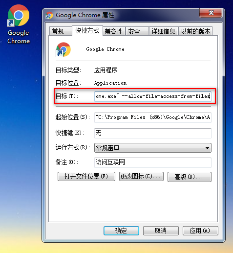
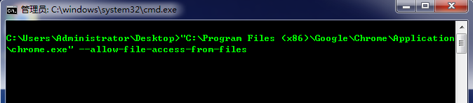
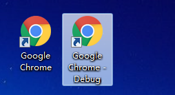

# Chrome浏览器处理本地Ajax跨域

---

在Chrome浏览器下使用Ajax异步请求，若直接通过 `file://` 访问本地文件就会报错。 报错信息如下： 

~~~plaintext
XMLHttpRequest cannot load file:///C:/wamp/www/ejs/abc.ejs. Cross origin requests are only supported for protocol schemes: http, data, chrome, chrome-extension, https, chrome-extension-resource. 
~~~

这是因为直接通过 `file://` 访问文件，Ajax本地跨域。浏览器为了安全性考虑，默认禁止跨域访问。

解决方法：给浏览器传入启动参数 `--allow-file-access-from-files`，允许跨域访问。

直接在Chrome浏览器快捷方式右键，点击属性，修改目标（在后面加上`--allow-file-access-from-files`，注意`--`前面有一个空格），这样就可以正确访问了。

**Tips:**

可以通过命令行加上参数来启动：

或者也可以复制一份快捷方式，添加启动参数，用于开发调试程序，原来的快捷方式保持不变。

   

---

