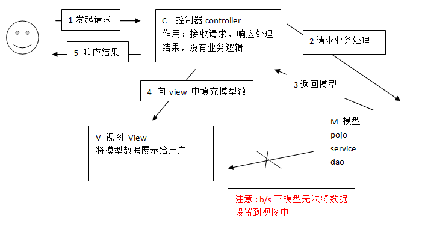

# SpringMVC基础学习笔记

---

### 概述

1、Spring Web MVC介绍

Spring Web MVC和Struts2都属于表现层的框架，它是Spring框架的一部分，我们可以从Spring的整体结构中看得出来：

MVC设计模式在B/S系统下的应用：

* 用户发起request请求至控制器(Controller)，控制器接收用户请求的数据，委托给模型进行处理；
* 控制器通过模型(Model)处理数据并得到处理结果，模型通常是指业务逻辑；
* 模型处理结果返回给控制器；
* 控制器将模型数据在视图(View)中展示：Web中模型无法将数据直接在视图上显示，需要通过控制器完成。如果在C/S应用中模型是可以将数据在视图中展示的。
* 控制器将视图response响应给用户，通过视图展示给用户要的数据或处理结果。

2、Spring Web MVC架构

1）架构流程

* 用户发送请求至前端控制器DispatcherServlet。
* DispatcherServlet收到请求调用HandlerMapping处理器映射器。
* 处理器映射器根据请求url找到具体的处理器，生成处理器对象及处理器拦截器(如果有则生成)一并返回给DispatcherServlet。
* DispatcherServlet通过HandlerAdapter处理器适配器调用处理器。
* 执行处理器(Controller，也叫后端控制器)。
* Controller执行完成返回ModelAndView。
* HandlerAdapter将Controller执行结果ModelAndView返回给DispatcherServlet。
* DispatcherServlet将ModelAndView传给ViewReslover视图解析器。
* ViewReslover解析后返回具体View。
* DispatcherServlet对View进行渲染视图（即将模型数据填充至视图中）。
* DispatcherServlet响应用户。

2）组件说明

以下组件通常使用框架提供实现：

* DispatcherServlet：前端控制器

用户请求到达前端控制器，它就相当于MVC模式中的C。DispatcherServlet是整个流程控制的中心，由它调用其它组件处理用户的请求，DispatcherServlet的存在降低了组件之间的耦合性。

* HandlerMapping：处理器映射器

HandlerMapping负责根据用户请求找到Handler即处理器，SpringMVC提供了不同的映射器实现不同的映射方式，例如：配置文件方式，实现接口方式，注解方式等。

* Handler：处理器

Handler 是继DispatcherServlet前端控制器的后端控制器，在DispatcherServlet的控制下Handler对具体的用户请求进行处理。由于Handler涉及到具体的用户业务请求，所以一般情况需要程序员根据业务需求开发Handler。

* HandlerAdapter：处理器适配器

通过HandlerAdapter对处理器进行执行，这是适配器模式的应用，通过扩展适配器可以对更多类型的处理器进行执行。

* View Resolver：视图解析器

View Resolver负责将处理结果生成View视图，View Resolver首先根据逻辑视图名解析成物理视图名即具体的页面地址，再生成View视图对象，最后对View进行渲染将处理结果通过页面展示给用户。 SpringMVC框架提供了很多的View视图类型，包括：jstlView、freemarkerView、pdfView等。一般情况下需要通过页面标签或页面模版技术将模型数据通过页面展示给用户，需要由程序员根据业务需求开发具体的页面。

### SpringMVC入门程序

1、导入spring3.2.0的jar包

2、前端控制器配置，在WEB-INF\web.xml中配置前端控制器：

~~~xml
<servlet>
	<servlet-name>springmvc</servlet-name>
	<servlet-class>org.springframework.web.servlet.DispatcherServlet</servlet-class>
	<init-param>
		<param-name>contextConfigLocation</param-name>
		<param-value>classpath:springmvc.xml</param-value>
	</init-param>
	<load-on-startup>1</load-on-startup>
</servlet>
<servlet-mapping>
	<servlet-name>springmvc</servlet-name>
	<url-pattern>*.action</url-pattern>
</servlet-mapping>
~~~

* load-on-startup：表示servlet随服务启动；
* url-pattern：`*.action`的请交给DispatcherServlet处理；
* contextConfigLocation：指定SpringMVC配置的加载位置，如果不指定则默认加载WEB-INF/[DispatcherServlet 的Servlet 名字]-servlet.xml。

Servlet拦截方式：

* 拦截固定后缀的url，比如设置为 *.do、*.action， 例如：/user/add.action ；此方法最简单，不会导致静态资源（jpg、js、css）被拦截。
* 拦截所有，设置为/，例如：/user/add  /user/add.action；此方法可以实现REST风格的url，很多互联网类型的应用使用这种方式。但是此方法会导致静态文件（jpg、js、css）被拦截后不能正常显示，需要特殊处理。
* 拦截所有，设置为/*，此设置方法错误，因为请求到Action，当action转到jsp时再次被拦截，提示不能根据jsp路径mapping成功。

3、SpringMVC配置文件

SpringMVC默认加载WEB-INF/[前端控制器的名字]-servlet.xml，也可以在前端控制器定义处指定加载的配置文件，如下：

~~~xml
<init-param>
	<param-name>contextConfigLocation</param-name>
	<param-value>classpath:springmvc.xml</param-value>
</init-param>
~~~

如上代码，通过contextConfigLocation加载classpath下的springmvc.xml配置文件。

4、配置处理器适配器

在springmvc.xml文件配置如下：

~~~xml
<bean class="org.springframework.web.servlet.mvc.SimpleControllerHandlerAdapter"/>
~~~

SimpleControllerHandlerAdapter：即简单控制器处理适配器，所有实现了org.springframework.web.servlet.mvc.Controller 接口的Bean作为SpringMVC的后端控制器。

5、处理器开发

~~~java
public class ItemList1 implements Controller {
	@Override
	public ModelAndView handleRequest(HttpServletRequest request, HttpServletResponse response) throws Exception {
		//商品列表
		List<Items> itemsList = new ArrayList<Items>();

		Items items_1 = new Items();
		items_1.setName("联想笔记本");
		items_1.setPrice(6000f);
		items_1.setDetail("ThinkPad T430 联想笔记本电脑！");

		Items items_2 = new Items();
		items_2.setName("苹果手机");
		items_2.setPrice(5000f);
		items_2.setDetail("iphone6苹果手机！");

		itemsList.add(items_1);
		itemsList.add(items_2);

		//创建modelAndView准备填充数据、设置视图
		ModelAndView modelAndView = new ModelAndView();
		//填充数据
		modelAndView.addObject("itemsList", itemsList);
		//视图
		modelAndView.setViewName("order/itemsList");

		return modelAndView;
	}
}
~~~

* org.springframework.web.servlet.mvc.Controller：处理器必须实现Controller 接口。
* ModelAndView：包含了模型数据及逻辑视图名。

6、配置处理器映射器

在springmvc.xml文件配置如下：

~~~xml
<beans xmlns="http://www.springframework.org/schema/beans" xmlns:xsi="http://www.w3.org/2001/XMLSchema-instance" xmlns:mvc="http://www.springframework.org/schema/mvc" xmlns:context="http://www.springframework.org/schema/context" xmlns:aop="http://www.springframework.org/schema/aop" xmlns:tx="http://www.springframework.org/schema/tx" xsi:schemaLocation="http://www.springframework.org/schema/beans http://www.springframework.org/schema/beans/spring-beans-3.2.xsd http://www.springframework.org/schema/mvc http://www.springframework.org/schema/mvc/spring-mvc-3.2.xsd http://www.springframework.org/schema/context http://www.springframework.org/schema/context/spring-context-3.2.xsd http://www.springframework.org/schema/aop http://www.springframework.org/schema/aop/spring-aop-3.2.xsd http://www.springframework.org/schema/tx http://www.springframework.org/schema/tx/spring-tx-3.2.xsd ">
	<!-- 处理器映射器 -->
	<!-- 根据bean的name进行查找Handler 将action的url配置在bean的name中 -->
	<bean class="org.springframework.web.servlet.handler.BeanNameUrlHandlerMapping" />
</beans>
~~~

BeanNameUrlHandlerMapping：表示将定义的Bean名字作为请求的url，需要将编写的Controller在Spring容器中进行配置，且指定bean的name为请求的url，且必须以.action结尾。

7、处理器配置

在springmvc.xml文件配置如下：

~~~xml
<!-- controller配置 -->
<bean name="/items1.action" id="itemList1" class="cn.demo.springmvc.controller.first.ItemList1"/>	
~~~

name="/items1.action"：前边配置的处理器映射器为BeanNameUrlHandlerMapping，如果请求的URL 为“上下文/items1.action”将会成功映射到ItemList1控制器。

8、配置视图解析器

在springmvc.xml文件配置如下：

~~~xml
<!-- ViewResolver -->
<bean class="org.springframework.web.servlet.view.InternalResourceViewResolver">
	<property name="viewClass" value="org.springframework.web.servlet.view.JstlView"/>
	<property name="prefix" value="/WEB-INF/jsp/"/>
	<property name="suffix" value=".jsp"/>
</bean>
~~~

* InternalResourceViewResolver：支持JSP视图解析；
* viewClass：JstlView表示JSP模板页面需要使用JSTL标签库，所以classpath中必须包含JSTL的相关jar包；
* prefix和suffix：查找视图页面的前缀和后缀，最终视图的址为：前缀+逻辑视图名+后缀，逻辑视图名需要在Controller中返回ModelAndView指定，比如逻辑视图名为hello，则最终返回的jsp视图地址 “WEB-INF/jsp/hello.jsp”。

9、视图开发

创建/WEB-INF/jsp/order/itemsList.jsp视图页面：

~~~jsp
<%@ page language="java" contentType="text/html; charset=UTF-8" pageEncoding="UTF-8"%>
<%@ taglib uri="http://java.sun.com/jsp/jstl/core" prefix="c" %>
<%@ taglib uri="http://java.sun.com/jsp/jstl/fmt"  prefix="fmt"%>
<!DOCTYPE html PUBLIC "-//W3C//DTD HTML 4.01 Transitional//EN" "http://www.w3.org/TR/html4/loose.dtd">
<html>
<head>
	<meta http-equiv="Content-Type" content="text/html; charset=UTF-8">
	<title>查询商品列表</title>
</head>
<body>
	商品列表：
	<table width="100%" border=1>
		<tr>
			<td>商品名称</td>
			<td>商品价格</td>
			<td>商品描述</td>
		</tr>
		<c:forEach items="${itemsList }" var="item">
		<tr>
			<td>${item.name }</td>
			<td>${item.price }</td>
			<td>${item.detail }</td>
		</tr>
		</c:forEach>
	</table>
</body>
</html>
~~~

10、部署在Tomcat测试

通过请求：http://localhost:8080/springmvc_first/items1.action ，如果页面输出商品列表就表明我们成功了。

### 核心组件介绍

1、DispatcherServlet

DispathcerServlet作为SpringMVC的中央调度器存在。DispatcherServlet创建时会默认从DispatcherServlet.properties文件加载springmvc所用的各个组件，如果在springmvc.xml中配置了组件则以springmvc.xml中配置的为准，DispatcherServlet的存在降低了SpringMVC各个组件之间的耦合度。

2、HandlerMapping处理器映射器

HandlerMapping 负责根据request请求找到对应的Handler处理器及Interceptor拦截器，将它们封装在HandlerExecutionChain 对象中给前端控制器返回。

3、BeanNameUrlHandlerMapping

BeanNameUrl处理器映射器，根据请求的url与Spring容器中定义的bean的name进行匹配，从而从Spring容器中找到bean实例。

~~~xml
<!—beanName Url映射器 -->
<bean class="org.springframework.web.servlet.handler.BeanNameUrlHandlerMapping"/>
~~~

4、SimpleUrlHandlerMapping

SimpleUrlHandlerMapping是BeanNameUrlHandlerMapping的增强版本，它可以将url和处理器bean的id进行统一映射配置。

~~~xml
<!—简单url映射 -->
<bean class="org.springframework.web.servlet.handler.SimpleUrlHandlerMapping">
	<property name="mappings">
		<props>
			<prop key="/items1.action">controller的bean id</prop>
			<prop key="/items2.action">controller的bean id</prop>
		</props>
	</property>
</bean>
~~~

5、HandlerAdapter处理器适配器

HandlerAdapter会根据适配器接口对后端控制器进行包装（适配），包装后即可对处理器进行执行，通过扩展处理器适配器可以执行多种类型的处理器，这里使用了适配器设计模式。

6、SimpleControllerHandlerAdapter

SimpleControllerHandlerAdapter简单控制器处理器适配器，所有实现了org.springframework.web.servlet.mvc.Controller 接口的Bean通过此适配器进行适配、执行。适配器配置如下：

~~~xml
<bean class="org.springframework.web.servlet.mvc.SimpleControllerHandlerAdapter" />
~~~

7、HttpRequestHandlerAdapter

HttpRequestHandlerAdapter，HTTP请求处理器适配器，所有实现了org.springframework.web.HttpRequestHandler 接口的Bean通过此适配器进行适配、执行。

适配器配置如下：

~~~xml
<bean class="org.springframework.web.servlet.mvc.HttpRequestHandlerAdapter"/>
~~~

Controller实现如下：

~~~java
public class ItemList2 implements HttpRequestHandler {
	@Override
	public void handleRequest(HttpServletRequest request, HttpServletResponse response) throws ServletException, IOException {
		// 商品列表
		List<Items> itemsList = new ArrayList<Items>();

		Items items_1 = new Items();
		items_1.setName("联想笔记本");
		items_1.setPrice(6000f);
		items_1.setDetail("ThinkPad T430 联想笔记本电脑！");

		Items items_2 = new Items();
		items_2.setName("苹果手机");
		items_2.setPrice(5000f);
		items_2.setDetail("iphone5  苹果手机！");

		itemsList.add(items_1);
		itemsList.add(items_2);

		// 填充数据
		request.setAttribute("itemsList", itemsList);

		// 视图
		request.getRequestDispatcher("/WEB-INF/jsp/order/itemsList.jsp").forward(request, response);
	}
}
~~~

从上边可以看出此适配器的handleRequest方法没有返回ModelAndView，可通过response修改定义响应内容，比如返回json数据：

~~~java
response.setCharacterEncoding("utf-8");
response.setContentType("application/json;charset=utf-8");
response.getWriter().write("json串");
~~~

### 注解映射器和适配器

1、Controller的代码

~~~java
@Controller
public class ItemList3 {
	@RequestMapping("/queryItem.action")
	public ModelAndView queryItem() {
		// 商品列表
		List<Items> itemsList = new ArrayList<Items>();

		Items items_1 = new Items();
		items_1.setName("联想笔记本");
		items_1.setPrice(6000f);
		items_1.setDetail("ThinkPad T430 联想笔记本电脑！");

		Items items_2 = new Items();
		items_2.setName("苹果手机");
		items_2.setPrice(5000f);
		items_2.setDetail("iphone6苹果手机！");

		itemsList.add(items_1);
		itemsList.add(items_2);

		// 创建modelAndView准备填充数据、设置视图
		ModelAndView modelAndView = new ModelAndView();
		// 填充数据
		modelAndView.addObject("itemsList", itemsList);
		// 视图
		modelAndView.setViewName("order/itemsList");

		return modelAndView;
	}
}
~~~

2、组件扫描器

使用组件扫描器省去在Spring容器配置每个Controller类的繁琐操作。使用`<context:component-scan>`自动扫描标记@controller的控制器类，配置如下：

~~~xml
<!-- 扫描controller注解,多个包中间使用半角逗号分隔 -->
<context:component-scan base-package="cn.demo.springmvc.controller.first"/>
~~~

3、RequestMappingHandlerMapping

注解式处理器映射器，对类中标记@ResquestMapping的方法进行映射，根据ResquestMapping定义的url匹配ResquestMapping标记的方法，匹配成功返回HandlerMethod对象给前端控制器，HandlerMethod对象中封装url对应的方法Method。 

从spring3.1版本开始，废除了DefaultAnnotationHandlerMapping的使用，推荐使用RequestMappingHandlerMapping完成注解式处理器映射。

配置如下：

~~~xml
<!--注解映射器 -->
<bean class="org.springframework.web.servlet.mvc.method.annotation.RequestMappingHandlerMapping"/>
~~~

注解描述：@RequestMapping，定义请求url到处理器功能方法的映射。

4、RequestMappingHandlerAdapter

注解式处理器适配器，对标记@ResquestMapping的方法进行适配。

从Spring3.1版本开始，废除了AnnotationMethodHandlerAdapter的使用，推荐使用RequestMappingHandlerAdapter完成注解式处理器适配。

配置如下：

~~~xml
<!--注解适配器 -->
<bean class="org.springframework.web.servlet.mvc.method.annotation.RequestMappingHandlerAdapter"/>
~~~

5、`<mvc:annotation-driven>`

SpringMVC使用`<mvc:annotation-driven>`自动加载RequestMappingHandlerMapping和RequestMappingHandlerAdapter，可用在springmvc.xml配置文件中使用`<mvc:annotation-driven>`替代注解处理器和适配器的配置。

### springmvc处理流程分析

* 用户发送请求到DispatcherServlet前端控制器；
* DispatcherServlet调用HandlerMapping（处理器映射器）根据url查找Handler；
* DispatcherServlet调用HandlerAdapter(处理器适配器)对HandlerMapping找到Handler进行包装、执行。HandlerAdapter执行Handler完成后，返回了一个ModleAndView(SpringMVC封装对象)；
* DispatcherServlet拿着ModelAndView调用ViewResolver（视图解析器）进行视图解析，解析完成后返回一个View（很多不同视图类型的View）；
* DispatcherServlet进行视图渲染，将Model中数据放到request域，在页面展示。

### 注解开发

1、@RequestMapping

通过RequestMapping注解可以定义不同的处理器映射规则。

1）URL路径映射

@RequestMapping(value="/item")或@RequestMapping("/item），value的值是数组，可以将多个url映射到同一个方法。

2）窄化请求映射

在class上添加@RequestMapping(url)指定通用请求前缀， 限制此类下的所有方法请求url必须以请求前缀开头，通过此方法对url进行分类管理。如下：

~~~java
//@RequestMapping放在类名上边，设置请求前缀 
@Controller
@RequestMapping("/item")

//方法名上边设置请求映射url，@RequestMapping放在方法名上边，如下：
@RequestMapping("/queryItem ")
~~~

访问地址为：/item/queryItem

3）请求方法限定 

* 限定GET方法：@RequestMapping(method = RequestMethod.GET)

如果通过POST访问则报错：HTTP Status 405 - Request method 'POST' not supported

例如：@RequestMapping(value="/editItem",method=RequestMethod.GET)

* 限定POST方法：@RequestMapping(method = RequestMethod.POST)

如果通过GET访问则报错：HTTP Status 405 - Request method 'GET' not supported

* GET和POST都可以：@RequestMapping(method={RequestMethod.GET,RequestMethod.POST})

2、Controller方法返回值

1）返回ModelAndView

Controller方法中定义ModelAndView对象并返回，对象中可添加model数据、指定view。

2）返回void

在Controller方法形参上可以定义request和response，使用request或response指定响应结果：

* 使用request转向页面，如下：

~~~java
request.getRequestDispatcher("页面路径").forward(request, response);
~~~

* 也可以通过response页面重定向：

~~~java
response.sendRedirect("url")
~~~

* 也可以通过response指定响应结果，例如响应json数据如下：

~~~java
response.setCharacterEncoding("utf-8");
response.setContentType("application/json;charset=utf-8");
response.getWriter().write("json串");
~~~

3）返回字符串

* 逻辑视图名：Controller方法返回字符串可以指定逻辑视图名，通过视图解析器解析为物理视图地址。

~~~java
//指定逻辑视图名，经过视图解析器解析为jsp物理路径：/WEB-INF/jsp/item/editItem.jsp
return "item/editItem";
~~~

* Redirect重定向：Contrller方法返回结果重定向到一个url地址，如下商品修改提交后重定向到商品查询方法，参数无法带到商品查询方法中。

~~~java
//重定向到queryItem.action地址,request无法带过去
return "redirect:queryItem.action";
~~~

redirect方式相当于“response.sendRedirect()”，转发后浏览器的地址栏变为转发后的地址，因为转发即执行了一个新的request和response。由于新发起一个request原来的参数在转发时就不能传递到下一个url，如果要传参数可以/item/queryItem.action后边加参数，如下：/item/queryItem?...&…..

* forward转发：Controller方法执行后继续执行另一个Controller方法，如下商品修改提交后转向到商品修改页面，修改商品的id参数可以带到商品修改方法中。

~~~java
//结果转发到editItem.action，request可以带过去
return "forward:editItem.action";
~~~

forward方式相当于“request.getRequestDispatcher().forward(request,response)”，转发后浏览器地址栏还是原来的地址。转发并没有执行新的request和response，而是和转发前的请求共用一个request和response。所以转发前请求的参数在转发后仍然可以读取到。

3、参数绑定

处理器适配器在执行Handler之前需要把HTTP请求的key/value数据绑定到Handler方法形参数上。

1）默认支持的参数类型

处理器形参中添加如下类型的参数处理适配器会默认识别并进行赋值：

* HttpServletRequest：通过request对象获取请求信息；
* HttpServletResponse：通过response处理响应信息；
* HttpSession：通过session对象得到session中存放的对象；
* Model/ModelMap：ModelMap是Model接口的实现类，通过Model或ModelMap向页面传递数据，如下：

~~~java
//调用service查询商品信息
Items item = itemService.findItemById(id);
model.addAttribute("item", item);
~~~

页面通过${item.XXXX}获取item对象的属性值。使用Model和ModelMap的效果一样，如果直接使用Model，SpringMVC会实例化ModelMap。

2）参数绑定介绍

注解适配器对RequestMapping标记的方法进行适配，对方法中的形参会进行参数绑定，早期SpringMVC采用PropertyEditor（属性编辑器）进行参数绑定将request请求的参数绑定到方法形参上，3.X之后SpringMVC就开始使用Converter进行参数绑定。

3）简单类型

当请求的参数名称和处理器形参名称一致时会将请求参数与形参进行绑定。

* 整型
* 字符串
* 单精度/双精度
* 布尔型

处理器方法：`public String editItem(Model model,Integer id,Boolean status) throws Exception`；

请求url：http://localhost:8080/springmvc_mybatis/item/editItem.action?id=2&status=false

说明：对于布尔类型的参数，请求的参数值为true或false。

* @RequestParam：使用@RequestParam常用于处理简单类型的绑定。

* value：参数名字，即入参的请求参数名字，如value=“item_id”表示请求的参数区中的名字为item_id的参数的值将传入；
* required：是否必须，默认是true，表示请求中一定要有相应的参数，否则将报：HTTP Status 400 - Required Integer parameter 'XXXX' is not present；
* defaultValue：默认值，表示如果请求中没有同名参数时的默认值；

定义如下：

~~~java
public String editItem(@RequestParam(value="item_id",required=true) String id) {
	
}
~~~

形参名称为id，但是这里使用value=" item_id"限定请求的参数名为item_id，所以页面传递参数的名必须为item_id。

注意：如果请求参数中没有item_id将抛出异常：HTTP Status 500 - Required Integer parameter 'item_id' is not present；

这里通过required=true限定item_id参数为必需传递，如果不传递则报400错误，可以使用defaultvalue设置默认值，即使required=true也可以不传item_id参数值。

4） POJO

4.1）简单POJO

将POJO对象中的属性名与传递进来的属性名对应，如果传进来的参数名称和对象中的属性名称一致则将参数值设置在POJO对象中。

页面定义如下：

~~~jsp
<input type="text" name="name"/>
<input type="text" name="price"/>
~~~

Contrller方法定义如下：

~~~java
@RequestMapping("/editItemSubmit")
public String editItemSubmit(Items items)throws Exception{
	System.out.println(items);
}
~~~

请求的参数名称和POJO的属性名称一致，会自动将请求参数赋值给POJO的属性。

4.2）包装POJO

如果采用类似struts中对象.属性的方式命名，需要将POJO对象作为一个包装对象的属性，action中以该包装对象作为形参。

包装对象定义如下：

~~~java
public class QueryVo {
	private Items items;
	//getter、setter...
}
~~~

页面定义：

~~~jsp
<input type="text" name="items.name" />
<input type="text" name="items.price" />
~~~

Controller方法定义如下：

~~~java
public String useraddsubmit(Model model, QueryVo queryVo)throws Exception{
	System.out.println(queryVo.getItems());
}
~~~

5）自定义参数绑定

需求：根据业务需求自定义日期格式进行参数绑定。

Converter：自定义Converter

~~~java
public class CustomDateConverter implements Converter<String, Date> {
	@Override
	public Date convert(String source) {
		try {
			SimpleDateFormat simpleDateFormat = new SimpleDateFormat("yyyy-MM-dd HH:mm:ss");
			return simpleDateFormat.parse(source);
		} catch (Exception e) {
			e.printStackTrace();
		}
		return null;
	}
}
~~~

配置方式1：

~~~xml
<mvc:annotation-driven conversion-service="conversionService"></mvc:annotation-driven>
<!-- conversionService -->
<bean id="conversionService" class="org.springframework.format.support.FormattingConversionServiceFactoryBean">
	<!-- 转换器 -->
	<property name="converters">
		<list>
			<bean class="cn.demo.ssm.controller.converter.CustomDateConverter"/>
		</list>
	</property>
</bean>
~~~

配置方式2：

~~~xml
<!--注解适配器 -->
<bean class="org.springframework.web.servlet.mvc.method.annotation.RequestMappingHandlerAdapter">
	<property name="webBindingInitializer" ref="customBinder"></property> 
</bean>

<!-- 自定义webBinder -->
<bean id="customBinder" class="org.springframework.web.bind.support.ConfigurableWebBindingInitializer">
	<property name="conversionService" ref="conversionService" />
</bean>

<!-- conversionService -->
<bean id="conversionService" class="org.springframework.format.support.FormattingConversionServiceFactoryBean">
	<!-- 转换器 -->
	<property name="converters">
		<list>
			<bean class="cn.demo.ssm.controller.converter.CustomDateConverter"/>
		</list>
	</property>
</bean>
~~~

6）集合类

6.1）字符串数组

页面选中多个checkbox向Controller方法传递，页面定义如下：

~~~jsp
<input type="checkbox" name="item_id" value="001"/>
<input type="checkbox" name="item_id" value="002"/>
<input type="checkbox" name="item_id" value="002"/>
~~~

传递到Controller方法中的格式是：001,002,003。Controller方法中可以用String[]接收，定义如下：

~~~java
public String deleteItem(String[] item_id) throws Exception {
	System.out.println(item_id);
｝
~~~

6.2）List

List中存放对象，并将定义的List放在包装类中，action使用包装对象接收。

List中对象：

~~~java
public class QueryVo {
	private List<Items> itemList;//商品列表
	//get、set方法..
}
~~~

页面定义如下：

~~~jsp
<tr>
	<td>
		<input type="text" name="itemsList[0].id" value="${item.id}"/>
	</td>
	<td>
		<input type="text" name="itemsList[0].name" value="${item.name }"/>
	</td>
	<td>
		<input type="text" name=" itemsList[0].price" value="${item.price}"/>
	</td>
</tr>
<tr>
	<td>
		<input type="text" name=" itemsList[1].id" value="${item.id}"/>
	</td>
	<td>
		<input type="text" name=" itemsList[1].name" value="${item.name }"/>
	</td>
	<td>
		<input type="text" name=" itemsList[1].price" value="${item.price}"/>
	</td>
</tr>
~~~

上边的静态代码改为动态jsp代码如下：

~~~jsp
<c:forEach items="${itemsList }" var="item" varStatus="s">
<tr>
	<td><input type="text" name="itemsList[${s.index }].name" value="${item.name }"/></td>
	<td><input type="text" name="itemsList[${s.index }].price" value="${item.price }"/></td>
	.....
	.....
</tr>
</c:forEach>
~~~

Contrller方法定义如下：

~~~java
public String useraddsubmit(Model model,QueryVo queryVo) throws Exception {
	System.out.println(queryVo.getItemList());
}
~~~

6.3）Map

在包装类中定义Map对象，并添加get/set方法，action使用包装对象接收。

包装类中定义Map对象如下：

~~~java
public class QueryVo {
	private Map<String, Object> itemInfo = new HashMap<String, Object>();
	//get、set方法..
}
~~~

页面定义如下：

~~~jsp
<tr>
	<td>学生信息：</td>
	<td>
		姓名：<input type="text" name="itemInfo['name']"/>
		年龄：<input type="text" name="itemInfo['price']"/>
	</td>
</tr>
~~~

Contrller方法定义如下：

~~~java
public String useraddsubmit(Model model, QueryVo queryVo) throws Exception {
	System.out.println(queryVo.getStudentinfo());
}
~~~

4、乱码问题

POST时中文乱码，在web.xml中加入：

~~~xml
<filter>
	<filter-name>CharacterEncodingFilter</filter-name>
	<filter-class>org.springframework.web.filter.CharacterEncodingFilter</filter-class>
	<init-param>
		<param-name>encoding</param-name>
		<param-value>utf-8</param-value>
	</init-param>
</filter>
<filter-mapping>
	<filter-name>CharacterEncodingFilter</filter-name>
	<url-pattern>/*</url-pattern>
</filter-mapping>
~~~

以上可以解决POST请求乱码问题。对于GET请求中文参数出现乱码解决方法有两个：

第一种是修改Tomcat配置文件添加编码与工程编码一致，如下：

~~~xml
<Connector URIEncoding="utf-8" connectionTimeout="20000" port="8080" protocol="HTTP/1.1" redirectPort="8443"/>
~~~

另外一种方法对参数进行重新编码：

~~~java
String userName = new 
String(request.getParamter("userName").getBytes("ISO8859-1"), "utf-8");
~~~

ISO8859-1是Tomcat默认编码，需要将Tomcat编码后的内容按utf-8编码。

5、与struts2不同

* SpringMVC的入口是一个servlet即前端控制器，而Struts2入口是一个filter过虑器。
* SpringMVC是基于方法开发(一个url对应一个方法)，请求参数传递到方法的形参，可以设计为单例或多例(建议单例)；Struts2是基于类开发，传递参数是通过类的属性，只能设计为多例。
* Struts采用值栈存储请求和响应的数据，通过OGNL存取数据； SpringMVC通过参数解析器是将request请求内容解析，并给方法形参赋值，将数据和视图封装成ModelAndView对象，最后又将ModelAndView中的模型数据通过reques域传输到页面。JSP视图解析器默认使用JSTL。

### Validation

B/S系统中对HTTP请求数据的校验多数在客户端进行，这也是出于简单及用户体验性上考虑，但是在一些安全性要求高的系统中服务端校验是不可缺少的，本节主要学习SpringMVC实现控制层添加校验。

Spring3支持JSR-303验证框架，JSR-303 是JAVA EE 6 中的一项子规范，叫做Bean Validation，官方参考实现是Hibernate Validator（与Hibernate ORM 没有关系），JSR 303 用于对Java Bean 中的字段的值进行验证。

1、加入jar包

2、配置validator

~~~xml
<!-- 校验器 -->
<bean id="validator" class="org.springframework.validation.beanvalidation.LocalValidatorFactoryBean">
	<!-- 校验器-->
	<property name="providerClass" value="org.hibernate.validator.HibernateValidator" />
	<!-- 指定校验使用的资源文件，如果不指定则默认使用classpath下的ValidationMessages.properties -->
	<property name="validationMessageSource" ref="messageSource" />
</bean>

<!-- 校验错误信息配置文件 -->
<bean id="messageSource" class="org.springframework.context.support.ReloadableResourceBundleMessageSource">
	<!-- 资源文件名-->
	<property name="basenames">   
		<list>    
			<value>classpath:CustomValidationMessages</value> 
		</list>   
	</property>
	<!-- 资源文件编码格式 -->
	<property name="fileEncodings" value="utf-8" />
	<!-- 对资源文件内容缓存时间，单位秒 -->
	<property name="cacheSeconds" value="120" />
</bean>
~~~

3、将validator加到处理器适配器

1）配置方式1

~~~xml
<mvc:annotation-driven validator="validator"></mvc:annotation-driven>
~~~

2）配置方式2

~~~xml
<!-- 自定义webBinder -->
<bean id="customBinder" class="org.springframework.web.bind.support.ConfigurableWebBindingInitializer">
	<property name="validator" ref="validator" />
</bean>

<!-- 注解适配器 -->
<bean class="org.springframework.web.servlet.mvc.method.annotation.RequestMappingHandlerAdapter">
	<property name="webBindingInitializer" ref="customBinder"></property>
</bean>
~~~

4、添加验证规则

~~~java
public class Items {
	private Integer id;

	@Size(min=1,max=30,message="{item.name.length.error}")
	private String name;

	@NotEmpty(message="{pic.is.null}")
	private String pic;

	//...
}
~~~

5、错误消息文件CustomValidationMessages

~~~plaintext
item.name.length.error=商品名称在1到30个字符之间
pic.is.null=请上传图片
~~~

如果在eclipse中编辑properties文件无法看到中文则参考“Eclipse开发环境配置-indigo.docx”添加propedit插件。

6、捕获错误

修改Controller方法：

~~~java
// 商品修改提交
@RequestMapping("/editItemSubmit")
public String editItemSubmit(@Validated @ModelAttribute("item") Items items, BindingResult result, @RequestParam("pictureFile") MultipartFile[] pictureFile, Model model) throws Exception {
	//如果存在校验错误则转到商品修改页面
	if (result.hasErrors()) {
		List<ObjectError> errors = result.getAllErrors();
		for(ObjectError objectError:errors){
			System.out.println(objectError.getCode());
			System.out.println(objectError.getDefaultMessage());
		}
		return "item/editItem";
	}
}
~~~

注意：添加@Validated表示在对items参数绑定时进行校验，校验信息写入BindingResult中，在要校验的POJO后边添加BingdingResult， 一个BindingResult对应一个POJO，且BingdingResult放在POJO的后边。

商品修改页面显示错误信息：

页头：

~~~jsp
<%@ page language="java" contentType="text/html; charset=UTF-8" pageEncoding="UTF-8"%>
<%@ taglib uri="http://java.sun.com/jsp/jstl/core" prefix="c" %>
<%@ taglib uri="http://java.sun.com/jsp/jstl/fmt"  
<%@ taglib prefix="spring" uri="http://www.springframework.org/tags" %>
~~~

在需要显示错误信息地方：

~~~jsp
<spring:hasBindErrors name="item">
	<c:forEach items="${errors.allErrors}" var="error">
		${error.defaultMessage } 
	</c:forEach>
</spring:hasBindErrors>
~~~

说明：`<spring:hasBindErrors name="item">`表示如果item参数绑定校验错误下边显示错误信息。

上边的方法也可以改为，在Controller方法中将error通过model放在request域，在页面上显示错误信息：

Controller方法：

~~~java
if(bindingResult.hasErrors()){
	model.addAttribute("errors", bindingResult);
}
~~~

页面：

~~~jsp
<c:forEach items="${errors.allErrors}" var="error">
	${error.defaultMessage } 
</c:forEach>
~~~

7、分组校验

如果两处校验使用同一个Items类则可以设定校验分组，通过分组校验可以对每处的校验个性化。

需求：商品修改提交只校验商品名称长度

定义分组：分组就是一个标识，这里定义一个接口：

~~~java
public interface ValidGroup1 {
	
}
public interface ValidGroup2 {
	
}
~~~

指定分组校验：

~~~java
public class Items {
	private Integer id;

	//这里指定分组ValidGroup1，此@Size校验只适用ValidGroup1校验
    @Size(min=1,max=30,message="{item.name.length.error}",groups={ValidGroup1.class})
    private String name;

	//...
}
~~~

~~~java
// 商品修改提交
@RequestMapping("/editItemSubmit")
public String editItemSubmit(@Validated(value={ValidGroup1.class}) @ModelAttribute("item") Items items, BindingResult result, @RequestParam("pictureFile") MultipartFile[] pictureFile, Model model) throws Exception {
	
}
~~~

在@Validated中添加value={ValidGroup1.class}表示商品修改使用了ValidGroup1分组校验规则，也可以指定多个分组中间用逗号分隔，@Validated(value={ValidGroup1.class，ValidGroup2.class })。

8、校验注解

* @Null：被注释的元素必须为 null；
* @NotNull：被注释的元素必须不为 null；
* @AssertTrue：被注释的元素必须为 true；
* @AssertFalse：被注释的元素必须为 false；
* @Min(value)：被注释的元素必须是一个数字，其值必须大于等于指定的最小值；
* @Max(value)：被注释的元素必须是一个数字，其值必须小于等于指定的最大值；
* @DecimalMin(value)：被注释的元素必须是一个数字，其值必须大于等于指定的最小值；
* @DecimalMax(value)：被注释的元素必须是一个数字，其值必须小于等于指定的最大值；
* @Size(max=, min=)：被注释的元素的大小必须在指定的范围内；
* @Digits (integer, fraction) ：被注释的元素必须是一个数字，其值必须在可接受的范围内；
* @Past：被注释的元素必须是一个过去的日期；
* @Future：被注释的元素必须是一个将来的日期；
* @Pattern(regex=,flag=)：被注释的元素必须符合指定的正则表达式；

Hibernate Validator 附加的 constraint

* @NotBlank(message =)：验证字符串非null，且长度必须大于0；
* @Email：被注释的元素必须是电子邮箱地址；
* @Length(min=,max=)：被注释的字符串的大小必须在指定的范围内；
* @NotEmpty：被注释的字符串的必须非空；
* @Range(min=,max=,message=)：被注释的元素必须在合适的范围内

### 数据回显

表单提交失败需要再回到表单页面重新填写，原来提交的数据需要重新在页面上显示。

1、简单数据类型

对于简单数据类型，如：Integer、String、Float等使用Model将传入的参数再放到request域实现显示。如下：

~~~java
@RequestMapping(value="/editItems", method={RequestMethod.GET})
public String editItems(Model model,Integer id)throws Exception {
	//传入的id重新放到request域
	model.addAttribute("id", id);
}
~~~

2、POJO类型

SpringMVC默认支持POJO数据回显，SpringMVC自动将形参中的POJO重新放回request域中，request的key为POJO的类名（首字母小写），如下：

~~~java
@RequestMapping("/editItemSubmit")
public String editItemSubmit(Integer id, ItemsCustom itemsCustom) throws Exception {
	
}
~~~

SpringMVC自动将itemsCustom放回request，相当于调用下边的代码：

~~~java
model.addAttribute("itemsCustom", itemsCustom);
~~~

如果key不是POJO的类名(首字母小写)，可以使用@ModelAttribute完成数据回显。@ModelAttribute作用如下：

1）绑定请求参数到POJO并且暴露为模型数据传到视图页面，此方法可实现数据回显效果。

~~~java
// 商品修改提交
@RequestMapping("/editItemSubmit")
public String editItemSubmit(Model model, @ModelAttribute("item") ItemsCustom itemsCustom) {}
~~~

页面：

~~~jsp
<tr>
	<td>商品名称</td>
	<td><input type="text" name="name" value="${item.name }"/></td>
</tr>
<tr>
	<td>商品价格</td>
	<td><input type="text" name="price" value="${item.price }"/></td>
</tr>
~~~

如果不用@ModelAttribute也可以使用model.addAttribute("item",  itemsCustom)完成数据回显。

2）将方法返回值暴露为模型数据传到视图页面。

~~~java
//商品分类
@ModelAttribute("itemtypes")
public Map<String, String> getItemTypes() {
	Map<String, String> itemTypes = new HashMap<String,String>();
	itemTypes.put("101", "数码");
	itemTypes.put("102", "母婴");
	return itemTypes;
}
~~~

页面：

~~~jsp
<select name="itemtype">
	<c:forEach items="${itemtypes }" var="itemtype">
		<option value="${itemtype.key }">${itemtype.value }</option>
	</c:forEach>
</select>
~~~

### 异常处理器

SpringMVC在处理请求过程中出现异常信息交由异常处理器进行处理，自定义异常处理器可以实现一个系统的异常处理逻辑。

1、异常处理思路

系统中异常包括两类：预期异常和运行时异常RuntimeException，前者通过捕获异常从而获取异常信息，后者主要通过规范代码开发、测试通过手段减少运行时异常的发生。

系统的Dao、Service、Controller出现都通过throws Exception向上抛出，最后由SpringMVC前端控制器交由异常处理器进行异常处理，如下图：

2、自定义异常类

为了区别不同的异常通常根据异常类型自定义异常类，这里我们创建一个自定义系统异常，如果Controller、Service、Dao抛出此类异常说明是系统预期处理的异常信息。

~~~java
public class CustomException extends Exception {
	/** serialVersionUID*/
	private static final long serialVersionUID = -5212079010855161498L;
	//异常信息
	private String message;

	public CustomException(String message){
		super(message);
		this.message = message;
	}

	public String getMessage() {
		return message;
	}
	public void setMessage(String message) {
		this.message = message;
	}
}
~~~

3、自定义异常处理器

~~~java
public class CustomExceptionResolver implements HandlerExceptionResolver {
	@Override
	public ModelAndView resolveException(HttpServletRequest request, HttpServletResponse response, Object handler, Exception ex) {
		ex.printStackTrace();
		CustomException customException = null;
		//如果抛出的是系统自定义异常则直接转换
		if(ex instanceof CustomException) {
			customException = (CustomException)ex;
		} else {
			//如果抛出的不是系统自定义异常则重新构造一个未知错误异常。
			customException = new CustomException("未知错误，请与系统管理 员联系！");
		}
		ModelAndView modelAndView = new ModelAndView();
		modelAndView.addObject("message", customException.getMessage());
		modelAndView.setViewName("error");
		return modelAndView;
	}
}
~~~

4、错误页面

~~~jsp
<%@ page language="java" contentType="text/html; charset=UTF-8" pageEncoding="UTF-8"%>
<%@ taglib uri="http://java.sun.com/jsp/jstl/core" prefix="c" %>
<%@ taglib uri="http://java.sun.com/jsp/jstl/fmt"  prefix="fmt"%> 
<!DOCTYPE html PUBLIC "-//W3C//DTD HTML 4.01 Transitional//EN" "http://www.w3.org/TR/html4/loose.dtd">
<html>
<head>
	<meta http-equiv="Content-Type" content="text/html; charset=UTF-8">
	<title>错误页面</title>
</head>
<body>
	您的操作出现错误如下： 
	${message }
</body>
</html>
~~~

5、异常处理器配置

在springmvc.xml中添加：

~~~xml
<!-- 异常处理器 -->
<bean id="handlerExceptionResolver" class="cn.demo.ssm.controller.exceptionResolver.CustomExceptionResolver"/>
~~~

6、异常测试

修改商品信息，id输入错误提示商品信息不存在。

修改Controller方法“editItem”，调用service查询商品信息，如果商品信息为空则抛出异常：

~~~java
// 调用service查询商品信息
Items item = itemService.findItemById(id);
if(item == null){
	throw new CustomException("商品信息不存在!");
}
~~~

在service中抛出异常方法同上。

### 上传图片

1、配置虚拟目录 

在Tomcat上配置图片虚拟目录，在Tomcat下conf/server.xml中添加：

~~~xml
<Context docBase="F:\develop\upload\temp" path="/pic" reloadable="false"/>
~~~

访问http://localhost:8080/pic 即可访问F:\develop\upload\temp下的图片。

也可以通过eclipse配置：

2、配置解析器

~~~xml
<!-- 文件上传 -->
<bean id="multipartResolver" class="org.springframework.web.multipart.commons.CommonsMultipartResolver">
	<!-- 设置上传文件的最大尺寸为5MB -->
	<property name="maxUploadSize">
		<value>5242880</value>
	</property>
</bean>
~~~

3、加入jar包

CommonsMultipartResolver解析器依赖commons-fileupload和commons-io，加入如下jar包：

4、图片上传

1）Controller：

~~~java
//商品修改提交
@RequestMapping("/editItemSubmit")
public String editItemSubmit(Items items, MultipartFile pictureFile) throws Exception {
	//原始文件名称
	String pictureFile_name =  pictureFile.getOriginalFilename();
	//新文件名称
	String newFileName = UUID.randomUUID().toString()+pictureFile_name.substring(pictureFile_name.lastIndexOf("."));
	//上传图片
	File uploadPic = new java.io.File("F:/develop/upload/temp/"+newFileName);
	if(!uploadPic.exists()){
		uploadPic.mkdirs();
	}
	//向磁盘写文件
	pictureFile.transferTo(uploadPic);
	//.....
}
~~~

2）页面：

form添加enctype="multipart/form-data"：

~~~jsp
<form id="itemForm" action="${pageContext.request.contextPath }/item/editItemSubmit.action" method="post" enctype="multipart/form-data">
	<input type="hidden" name="pic" value="${item.pic }" />
</form>
~~~

file的name与Controller形参一致：

~~~jsp
<tr>
	<td>商品图片</td>
	<td><c:if test="${item.pic !=null}">
		
		 
		</c:if> <input type="file" name="pictureFile" />
	</td>
</tr>
~~~

### JSON数据交互

1、@RequestBody

作用：@RequestBody注解用于读取HTTP请求的内容(字符串)，通过SpringMVC提供的HttpMessageConverter接口将读到的内容转换为json、xml等格式的数据并绑定到Controller方法的参数上。

本例子应用：@RequestBody注解实现接收HTTP请求的json数据，将json数据转换为Java对象。

2、@ResponseBody

作用：该注解用于将Controller的方法返回的对象，通过HttpMessageConverter接口转换为指定格式的数据如：json、xml等，通过Response响应给客户端。

本例子应用：@ResponseBody注解实现将Controller方法返回对象转换为json响应给客户端。

3、请求json，响应json实现

1）环境准备

SpringMVC默认用MappingJacksonHttpMessageConverter对json数据进行转换，需要加入jackson的包，如下：

2）配置json转换器

在注解适配器中加入messageConverters：

~~~xml
<!--注解适配器 -->
<bean class="org.springframework.web.servlet.mvc.method.annotation.RequestMappingHandlerAdapter">
	<property name="messageConverters">
		<list>
			<bean class="org.springframework.http.converter.json.MappingJacksonHttpMessageConverter"></bean>
		</list>
	</property>
</bean>
~~~

注意：如果使用`<mvc:annotation-driven />` 则不用定义上边的内容。

3）Controller编写

~~~java
// 商品修改提交json信息，响应json信息
@RequestMapping("/editItemSubmit_RequestJson")
public @ResponseBody Items editItemSubmit_RequestJson(@RequestBody Items items) throws Exception {
	System.out.println(items);
	//itemService.saveItem(items);
	return items;
}
~~~

4）页面js方法编写

~~~jsp

~~~

4、请求key/value，响应json实现

表单默认请求application/x-www-form-urlencoded格式的数据即key/value，通常有POST和GET两种方法，响应json数据是为了方便客户端处理，实现如下：

1）Controller编写

~~~java
// 商品修改提交，提交普通form表单数据，响应json
@RequestMapping("/editItemSubmit_ResponseJson")
public @ResponseBody Items editItemSubmit_ResponseJson(Items items) throws Exception {
	System.out.println(items);
	//itemService.saveItem(items);
	return items;
}
~~~

2）页面js方法编写

~~~javascript
function formsubmit() {
	var user = " name=测试商品&price=99.9";
	//alert(user);
	$.ajax({
		type: 'post', //这里改为get也可以正常执行
		url: '${pageContext.request.contextPath}/item/ editItemSubmit_RequestJson.action', 
//ContentType没指定将默认为：application/x-www-form-urlencoded
		data: user,
		success: function(data) {
			alert(data.name);
		}
	});
}
~~~

从上边的js代码看出，已去掉ContentType的定义，ContentType默认为：application/x-www-form-urlencoded格式。

5、小结

实际开发中常用第二种方法，请求key/value数据，响应json结果，方便客户端对结果进行解析。

### RESTful支持

1、添加DispatcherServlet的rest配置

~~~xml
<servlet>
	<servlet-name>springmvc-servlet-rest</servlet-name>
	<servlet-class>org.springframework.web.servlet.DispatcherServlet</servlet-class>
	<init-param>
		<param-name>contextConfigLocation</param-name>
		<param-value>classpath:spring/springmvc.xml</param-value>
	</init-param>
</servlet>
<servlet-mapping>
	<servlet-name>springmvc-servlet-rest</servlet-name>
	<url-pattern>/</url-pattern>
</servlet-mapping>
~~~

2、URL 模板模式映射

@RequestMapping(value="/ viewItems/{id}")：{×××}占位符，请求的URL可以是“/viewItems/1”或“/viewItems/2”，通过在方法中使用@PathVariable获取{×××}中的×××变量。

@PathVariable用于将请求URL中的模板变量映射到功能处理方法的参数上。

~~~java
@RequestMapping("/viewItems/{id}") 
public @ResponseBody viewItems(@PathVariable("id") String id, Model model) throws Exception{
	//方法中使用@PathVariable获取useried的值，使用model传回页面
	//调用 service查询商品信息
	ItemsCustom itemsCustom = itemsService.findItemsById(id);
	return itemsCustom;
}
~~~

如果RequestMapping中表示为"/viewItems/{id}"，id和形参名称一致，@PathVariable不用指定名称。

3、静态资源访问`<mvc:resources>`

如果在DispatcherServlet中设置url-pattern为 /则必须对静态资源进行访问处理。SpringMVC 的`<mvc:resources mapping="" location="">`实现对静态资源进行映射访问。

如下是对js文件访问配置：

~~~xml
<mvc:resources location="/js/" mapping="/js/**"/>
~~~

### 拦截器

1、定义

Spring Web MVC 的处理器拦截器类似于Servlet 开发中的过滤器Filter，用于对处理器进行预处理和后处理。

2、拦截器定义

实现HandlerInterceptor接口，如下：

~~~java
public class HandlerInterceptor1 implements HandlerInterceptor{
	/**
	 * controller执行前调用此方法
	 * 返回true表示继续执行，返回false中止执行
	 * 这里可以加入登录校验、权限拦截等
	 */
	@Override
	Public boolean preHandle(HttpServletRequest request, HttpServletResponse response, Object handler) throws Exception {
		// TODO Auto-generated method stub
		Return false;
	}

	/**
	 * controller执行后但未返回视图前调用此方法
	 * 这里可在返回用户前对模型数据进行加工处理，比如这里加入公用信息以便页面显示
	 */
	@Override
	Public void postHandle(HttpServletRequest request, HttpServletResponse response, Object handler, ModelAndView modelAndView) throws Exception {
		// TODO Auto-generated method stub
		
	}

	/**
	 * controller执行后且视图返回后调用此方法
	 * 这里可得到执行controller时的异常信息
	 * 这里可记录操作日志，资源清理等
	 */
	@Override
	Public void afterCompletion(HttpServletRequest request, HttpServletResponse response, Object handler, Exception ex) throws Exception {
		// TODO Auto-generated method stub
		
	}
}
~~~

3、拦截器配置

1）针对某种mapping配置拦截器

~~~xml
<bean class="org.springframework.web.servlet.handler.BeanNameUrlHandlerMapping">
	<property name="interceptors">
		<list>
			<ref bean="handlerInterceptor1"/>
			<ref bean="handlerInterceptor2"/>
		</list>
	</property>
</bean>

<bean id="handlerInterceptor1" class="springmvc.intercapter.HandlerInterceptor1"/>
<bean id="handlerInterceptor2" class="springmvc.intercapter.HandlerInterceptor2"/>
~~~

2）针对所有mapping配置全局拦截器

~~~xml
<!--拦截器 -->
<mvc:interceptors>
	<!--多个拦截器,顺序执行 -->
	<mvc:interceptor>
		<mvc:mapping path="/**"/>
		<bean class="cn.demo.springmvc.filter.HandlerInterceptor1"></bean>
	</mvc:interceptor>
	<mvc:interceptor>
		<mvc:mapping path="/**"/>
		<bean class="cn.demo.springmvc.filter.HandlerInterceptor2"></bean>
	</mvc:interceptor>
</mvc:interceptors>
~~~

4、正常流程测试

定义两个拦截器分别为：HandlerInterceptor1和HandlerInteptor2，每个拦截器的preHandler方法都返回true。

运行流程：

~~~plaintext
HandlerInterceptor1..preHandle..
HandlerInterceptor2..preHandle..

HandlerInterceptor2..postHandle..
HandlerInterceptor1..postHandle..

HandlerInterceptor2..afterCompletion..
HandlerInterceptor1..afterCompletion..
~~~

5、中断流程测试

定义两个拦截器分别为：HandlerInterceptor1和HandlerInteptor2。

运行流程：

1）HandlerInterceptor1的preHandler方法返回false，HandlerInterceptor2返回true，运行流程如下：

~~~plaintext
HandlerInterceptor1..preHandle..
~~~

从日志看出第一个拦截器的preHandler方法返回false后第一个拦截器只执行了preHandler方法，其它两个方法没有执行，第二个拦截器的所有方法不执行，且Controller也不执行了。

2）HandlerInterceptor1的preHandler方法返回true，HandlerInterceptor2返回false，运行流程如下：

~~~plaintext
HandlerInterceptor1..preHandle..
HandlerInterceptor2..preHandle..
HandlerInterceptor1..afterCompletion..
~~~

从日志看出第二个拦截器的preHandler方法返回false后第一个拦截器的postHandler没有执行，第二个拦截器的postHandler和afterCompletion没有执行，且Controller也不执行了。

总结：

* preHandle按拦截器定义顺序调用
* postHandler按拦截器定义逆序调用
* afterCompletion按拦截器定义逆序调用
* postHandler在拦截器链内所有拦截器返成功调用
* afterCompletion只有preHandle返回true才调用

6、拦截器应用

1）用户身份认证

~~~java
public class LoginInterceptor implements HandlerInterceptor {
	@Override
	public boolean preHandle(HttpServletRequest request, HttpServletResponse response, Object handler) throws Exception {
		//如果是登录页面则放行
		if(request.getRequestURI().indexOf("login.action")>=0){
			return true;
		}
		HttpSession session = request.getSession();
		//如果用户已登录也放行
		if(session.getAttribute("user")!=null){
			return true;
		}
		//用户没有登录挑战到登录页面
		request.getRequestDispatcher("/WEB-INF/jsp/login.jsp").forward(request, response);
		return false;
	}
}
~~~

2）用户登陆Controller

~~~java
//登陆提交
//userid：用户账号，pwd：密码
@RequestMapping("/login")
public String loginsubmit(HttpSession session, String userid, String pwd) throws Exception {
	//向session记录用户身份信息
	session.setAttribute("activeUser", userid);
	return "redirect:item/queryItem.action";
}

//退出
@RequestMapping("/logout")
public String logout(HttpSession session) throws Exception {
	//session过期
	session.invalidate();
	return "redirect:item/queryItem.action";
}
~~~

   

---

