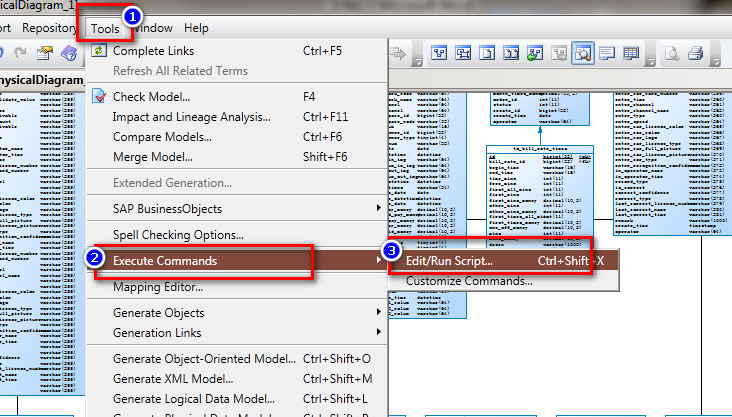

# PowerDesigner连接MySQL逆向生成PDM

---

### 准备工作

以ODBC方式连接MySQL，需要的mysql odbc连接软件如下：

* mysql-connector-odbc-5.3.6-win32.msi；
* mysql-connector-odbc-5.3.6-winx64.msi；

下载及安装过程这里略过。

### 创建PDM

1、创建新的Model

2、创建PDM视图

### 连接数据源

### 选择数据库表并生成

### 将Comment中的字符copy至Name中

因为文件中的name是英文，没有引入注释，在这里我们需要进行一步操作，把name替换成中文注释：

将Comment中的字符copy至Name中：

~~~plaintext
Option   Explicit   
ValidationMode   =   True   
InteractiveMode   =   im_Batch  
  
Dim   mdl   '   the   current   model  
  
'   get   the   current   active   model   
Set   mdl   =   ActiveModel   
If   (mdl   Is   Nothing)   Then   
      MsgBox   "There   is   no   current   Model "   
ElseIf   Not   mdl.IsKindOf(PdPDM.cls_Model)   Then   
      MsgBox   "The   current   model   is   not   an   Physical   Data   model. "   
Else   
      ProcessFolder   mdl   
End   If  
  
Private   sub   ProcessFolder(folder)   
On Error Resume Next  
      Dim   Tab   'running     table   
      for   each   Tab   in   folder.tables   
            if   not   tab.isShortcut   then   
                  tab.name   =   tab.comment  
                  Dim   col   '   running   column   
                  for   each   col   in   tab.columns   
                  if col.comment="" then  
                  else  
                        col.name=   col.comment   
                  end if  
                  next   
            end   if   
      next  
  
      Dim   view   'running   view   
      for   each   view   in   folder.Views   
            if   not   view.isShortcut   then   
                  view.name   =   view.comment   
            end   if   
      next  
  
      '   go   into   the   sub-packages   
      Dim   f   '   running   folder   
      For   Each   f   In   folder.Packages   
            if   not   f.IsShortcut   then   
                  ProcessFolder   f   
            end   if   
      Next   
end   sub
~~~

将Name中的字符copy至Comment中：

~~~plaintext
Option   Explicit   
ValidationMode   =   True   
InteractiveMode   =   im_Batch  
  
Dim   mdl   '   the   current   model  
  
'   get   the   current   active   model   
Set   mdl   =   ActiveModel   
If   (mdl   Is   Nothing)   Then   
      MsgBox   "There   is   no   current   Model "   
ElseIf   Not   mdl.IsKindOf(PdPDM.cls_Model)   Then   
      MsgBox   "The   current   model   is   not   an   Physical   Data   model. "   
Else   
      ProcessFolder   mdl   
End   If  
  
'   This   routine   copy   name   into   comment   for   each   table,   each   column   and   each   view   
'   of   the   current   folder   
Private   sub   ProcessFolder(folder)   
      Dim   Tab   'running     table   
      for   each   Tab   in   folder.tables   
            if   not   tab.isShortcut   then   
                  tab.comment   =   tab.name   
                  Dim   col   '   running   column   
                  for   each   col   in   tab.columns   
                        col.comment=   col.name   
                  next   
            end   if   
      next  
  
      Dim   view   'running   view   
      for   each   view   in   folder.Views   
            if   not   view.isShortcut   then   
                  view.comment   =   view.name   
            end   if   
      next  
  
      '   go   into   the   sub-packages   
      Dim   f   '   running   folder   
      For   Each   f   In   folder.Packages   
            if   not   f.IsShortcut   then   
                  ProcessFolder   f   
            end   if   
      Next   
end   sub
~~~

   

---

