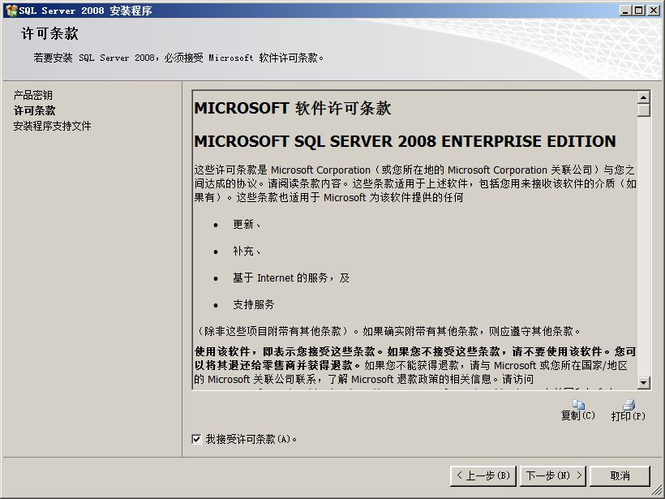
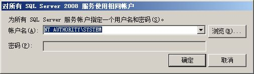
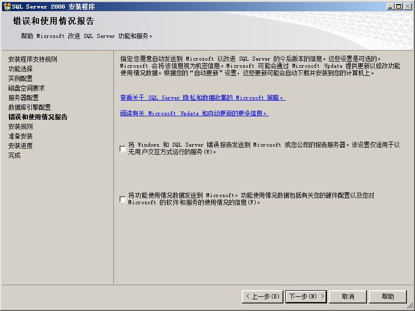

# SQLServer 2008安装教程

---

附：安装密钥

~~~plaintext
PTTFM-X467G-P7RH2-3Q6CG-4DMYB
~~~

注意事项：

安装SQLServer 2008过程中，如果遇到要求重启，重启后还是要求重启，重启了很多次也没有起作用，查了下是注册表的问题。解决方法如下：

window运行：`regedit`，然后找到`HKEY_LOCAL_MACHINE/SYSTEM/CurrentControlSet/Control/Session Manager/PendingFileRenameOperations`，右键 `PendingFileRenameOperations`，删除这一项即可！

   

---

