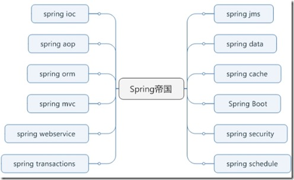

# Spring系列学习-开篇

---

### Spring简介

Spring 是一个开源框架。Spring 是于 2003 年兴起的一个轻量级的 Java 开发框架，由 Rod Johnson 在其著作 Expert One-On-One J2EE Development and Design 中阐述的部分理念和原型衍生而来。它是为了解决企业应用开发的复杂性而创建的。框架的主要优势之一就是其分层架构，分层架构允许使用者选择使用哪一个组件，同时为 J2EE 应用程序开发提供集成的框架。从简单性、可测试性和松耦合的角度而言，任何 Java 应用都可以从Spring中受益。Spring的核心是控制反转（IoC）和面向切面（AOP）。简单来说，Spring是一个分层的 JavaSE/EE full-stack（一站式）轻量级开源框架。

在开发人员的眼中Spring是帝国一样的存在，几乎个个领域的技术都有Spring的解决方案并且在基础框架选型为Spring后，后续相关的解决方案几乎都是优先选择Spring相关组件。

### Spring主要组件

* Spring IoC

IOC是Inversion of Control的缩写，多数书籍翻译成“控制反转”，还有些书籍翻译成为“控制反向”或者“控制倒置”。本来是由应用程序管理的对象之间的依赖关系，现在交给了容器管理，这就叫控制反转，即交给了IoC容器。Spring的IoC容器主要使用DI方式实现的，不需要主动查找，对象的查找、定位和创建全部由容器管理。Spring IoC 是 Spring 的核心，在Spring中主要用于管理容器中的Bean。

* Spring AOP

AOP是OOP的延续，是Aspect Oriented Programming的缩写，意思是面向方面编程。AOP实际是GoF设计模式的延续，设计模式孜孜不倦追求的是调用者和被调用者之间的解耦，AOP可以说也是这种目标的一种实现。Spring AOP 也是 Spring 的核心，利用AOP的技术可以用来做日志、权限、缓存等功能实现。

* Spring ORM

Spring支持大多数ORM框架，比如Hibernate，JPA，JDO，TopLink和iBatis（Spring2支持iBatis2，现在MyBatis3的Spring支持由MyBatis社区开发，并非Spring）。

* Spring MVC

Spring MVC 是一个MVC框架，通过实现Model-View-Controller模式来很好地将数据、业务与展现进行分离。从这样一个角度来说，Spring MVC和Struts、Struts2非常类似。

* Spring WebService

Spring 支持集成 Apache CXF、Axis2、xFire等不同集中WebService实现方案。

* Spring Transaction

Spring完美地支持了对事务的管理，目前主要有两种实现方案，一种是配置文件，一种是基于注解来实现。

* Spring JMS

Spring支持对ActiveMQ、RabbitMQ消息中间件的集成。

* Spring Data

Spring Data 作为 SpringSource 的其中一个父项目， 旨在统一和简化对各类型持久化存储， 而不拘泥于是关系型数据库还是 NoSQL 数据存储。

* Spring Cache

Spring 的缓存技术还具备相当的灵活性，不仅能够使用 SpEL（Spring Expression Language）来定义缓存的 key 和各种 condition，还提供开箱即用的缓存临时存储方案，也支持和主流的专业缓存例如 EHCache 集成。

* Spring Boot

SpringBoot是由Pivotal团队提供的全新框架，其设计目的是用来简化新Spring应用的初始搭建以及开发过程。该框架使用了特定的方式来进行配置，从而使开发人员不再需要定义样板化的配置。通过这种方式，SpringBoot致力于在蓬勃发展的快速应用开发领域（rapid application development）成为领导者。

* Spring Security

Spring Security是一个能够为基于Spring的企业应用系统提供声明式的安全访问控制解决方案的安全框架。它提供了一组可以在Spring应用上下文中配置的Bean，充分利用了Spring IoC（控制反转，Inversion of Control）、DI（ 依赖注入，Dependency Injection ）和AOP（面向切面编程）功能，为应用系统提供声明式的安全访问控制功能，减少了为企业系统安全控制编写大量重复代码的工作。

* Spring Schedule

Spring在Schedule这块支持JDK Timer、Concurrent、Quartz三种，这三种任务调度方案在实现机制和调用方法上都不同，但Spring通过对其包装，使得基于Spring能用统一的配置和编码风格来使用这三种schedule方案。

   

---

