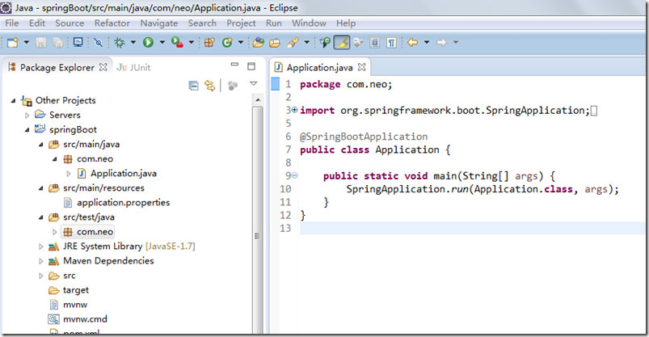

# SpringBoot系列学习-入门篇

---

### 什么是SpringBoot

Spring Boot 是由 Pivotal 团队提供的全新框架，其设计目的是用来简化新 Spring 应用的初始搭建以及开发过程。该框架使用了特定的方式来进行配置，从而使开发人员不再需要定义样板化的配置。用我的话来理解，就是 Spring Boot 其实不是什么新的框架，它默认配置了很多框架的使用方式，就像 Maven 整合了所有的 Jar 包，Spring Boot 整合了所有的框架。

### SpringBoot的好处

SpringBoot最大的好处，其实就是简单、快速、方便！平时如果我们需要搭建一个 Spring Web 项目的时候需要怎么做呢？

* 配置 web.xml，加载 Spring 和 Spring MVC；
* 配置数据库连接、配置 Spring 事务；
* 配置加载配置文件的读取，开启注解；
* 配置日志文件；
* ...
* 配置完成之后部署 Tomcat 调试；

现在非常流行微服务，如果我这个项目仅仅只是需要发送一个邮件，如果我的项目仅仅是生产一个积分；我都需要这样折腾一遍。

但是如果使用 Spring Boot 呢？很简单，我仅仅只需要非常少的几个配置就可以迅速方便地搭建起来一套 Web 项目或者是构建一个微服务。

### 快速入门

1、Maven 构建项目

* 访问 http://start.spring.io/ ；
* 选择构建工具 Maven Project、Java、Spring Boot 版本 2.1.3 以及一些工程基本信息；
* 点击 Generate Project 下载项目压缩包；
* 解压后，使用 Idea 导入项目，File -> New -> Model from Existing Source.. -> 选择解压后的文件夹 -> OK，选择 Maven 一路 Next，OK done；
* 如果使用的是 Eclipse，Import -> Existing Maven Projects -> Next -> 选择解压后的文件夹 -> Finsh，OK done。

2、Idea 构建项目

* 选择 File -> New —> Project... 弹出新建项目的框；
* 选择 Spring Initializr，Next 也会出现上述类似的配置界面，Idea 帮我们做了集成；
* 填写相关内容后，点击 Next 选择依赖的包再点击 Next，最后确定信息无误点击 Finish；

3、项目结构介绍

Spring Boot的基础结构共三个文件：

* src/main/java：程序开发以及主程序入口；
* src/main/resources：配置文件；
* src/test/java：测试程序；

另外，SpringBoot建议的目录结果如下：

root package结构：com.example.myproject

~~~plaintext
com
  +- example
    +- myproject
      +- Application.java
      |
      +- domain
      |  +- Customer.java
      |  +- CustomerRepository.java
      |
      +- service
      |  +- CustomerService.java
      |
      +- controller
      |  +- CustomerController.java
      |
~~~

* Application.java 建议放到跟目录下面，主要用于做一些框架配置；
* domain目录主要用于实体（Entity）与数据访问层（Repository）；
* service 层主要是业务类代码；
* controller 负责页面访问控制；

采用默认配置可以省去很多配置，当然也可以根据自己的喜欢来进行更改。最后，启动Application main方法，至此一个Java项目搭建好了。

### 引入Web模块

1、pom.xml中添加支持web的模块：

~~~xml
<dependency>
	<groupId>org.springframework.boot</groupId>
	<artifactId>spring-boot-starter-web</artifactId>
</dependency>
~~~

pom.xml文件中默认有两个模块：

* spring-boot-starter：核心模块，包括自动配置支持、日志和YAML；
* spring-boot-starter-test：测试模块，包括JUnit、Hamcrest、Mockito；

2、编写controller内容

~~~java
@RestController
public class HelloWorldController {
	@RequestMapping("/hello")
	public String index() {
		return "Hello World";
	}
}
~~~

@RestController的意思就是controller里面的方法都以json格式输出，不用再写什么jackjson配置的了。

3、启动主程序，打开浏览器访问http://localhost:8080/hello ，就可以看到效果了。

### 单元测试

打开的src/test/下的测试入口，编写简单的http请求来测试。使用mockmvc进行，利用MockMvcResultHandlers.print()打印出执行结果。

~~~java
@RunWith(SpringRunner.class)
@SpringBootTest
public class HelloWorldControlerTests {
	private MockMvc mvc;

	@Before
	public void setUp() throws Exception {
		mvc = MockMvcBuilders.standaloneSetup(new HelloWorldController()).build();
	}

	@Test
	public void getHello() throws Exception {
		mvc.perform(MockMvcRequestBuilders.get("/hello").accept(MediaType.APPLICATION_JSON)).andExpect(MockMvcResultMatchers.status().isOk())
			.andDo(MockMvcResultHandlers.print())
			.andReturn();
	}
}
~~~

### 开发环境的调试

热启动在正常开发项目中已经很常见了吧，虽然平时开发 web 项目过程中，改动项目启重启总是报错；但 Spring Boot 对调试支持很好，修改之后可以实时生效，需要添加以下的配置：

~~~xml
<dependencies>
	<dependency>
		<groupId>org.springframework.boot</groupId>
		<artifactId>spring-boot-devtools</artifactId>
		<optional>true</optional>
	</dependency>
</dependencies>
<build>
	<plugins>
		<plugin>
			<groupId>org.springframework.boot</groupId>
			<artifactId>spring-boot-maven-plugin</artifactId>
			<configuration>
				<fork>true</fork>
			</configuration>
		</plugin>
	</plugins>
</build>
~~~

该模块在完整的打包环境下运行的时候会被禁用。如果你使用java -jar启动应用或者用一个特定的classloader启动，它会认为这是一个“生产环境”。

### 总结

使用 Spring Boot 可以非常方便、快速搭建项目，使我们不用关心框架之间的兼容性，适用版本等各种问题，我们想使用任何东西，仅仅添加一个配置就可以，所以使用 Spring Boot 非常适合构建微服务。

   

---

