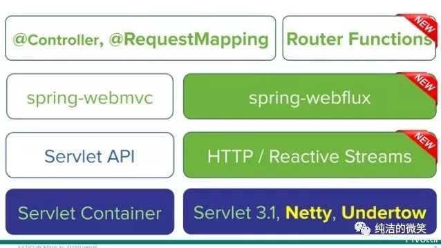

# SpringBoot系列学习-响应式编程和WebFlux入门

---

### 概述

Spring 5.0 中发布了重量级组件 Webflux，拉起了响应式编程的规模使用序幕。

WebFlux 使用的场景是异步非阻塞的，使用 Webflux 作为系统解决方案，在大多数场景下可以提高系统吞吐量。Spring Boot 2.0 是基于 Spring5 构建而成，因此 Spring Boot 2.X 将自动继承了 Webflux 组件，本篇给大家介绍如何在 Spring Boot 中使用 Webflux 。

为了方便大家理解，我们先来了解几个概念：

**响应式编程**

在计算机中，响应式编程或反应式编程（英语：Reactive Programming）是一种面向数据流和变化传播的编程范式。这意味着可以在编程语言中很方便地表达静态或动态的数据流，而相关的计算模型会自动将变化的值通过数据流进行传播。

例如，在命令式编程环境中，`a=b+c` 表示将表达式的结果赋给 a，而之后改变 b 或 c 的值不会影响 a 。但在响应式编程中，a 的值会随着 b 或 c 的更新而更新。

响应式编程是基于异步和事件驱动的非阻塞程序，只需要在程序内启动少量线程扩展，而不是水平通过集群扩展。

用大白话讲，我们以前编写的大部分都是阻塞类的程序，当一个请求过来时任务会被阻塞，直到这个任务完成后再返回给前端；响应式编程接到请求后只是提交了一个请求给后端，后端会再安排另外的线程去执行任务，当任务执行完成后再异步通知到前端。

**Reactor**

Java 领域的响应式编程库中，最有名的算是 Reactor 了。Reactor 也是 Spring 5 中反应式编程的基础，Webflux 依赖 Reactor 而构建。

Reactor 是一个基于 JVM 之上的异步应用基础库。为 Java 、Groovy 和其他 JVM 语言提供了构建基于事件和数据驱动应用的抽象库。Reactor 性能相当高，在最新的硬件平台上，使用无堵塞分发器每秒钟可处理 1500 万事件。

简单说，Reactor 是一个轻量级 JVM 基础库，帮助你的服务或应用高效，异步地传递消息。Reactor 中有两个非常重要的概念 Flux 和 Mono 。

**Flux 和 Mono**

Flux 和 Mono 是 Reactor 中的两个基本概念。Flux 表示的是包含 0 到 N 个元素的异步序列。在该序列中可以包含三种不同类型的消息通知：正常的包含元素的消息、序列结束的消息和序列出错的消息。当消息通知产生时，订阅者中对应的方法 onNext()、onComplete()和 onError()会被调用。

Mono 表示的是包含 0 或者 1 个元素的异步序列。该序列中同样可以包含与 Flux 相同的三种类型的消息通知。Flux 和 Mono 之间可以进行转换。对一个 Flux 序列进行计数操作，得到的结果是一个 Mono对象。把两个 Mono 序列合并在一起，得到的是一个 Flux 对象。

### WebFlux 是什么？

WebFlux 模块的名称是 spring-webflux，名称中的 Flux 来源于 Reactor 中的类 Flux。Spring webflux 有一个全新的非堵塞的函数式 Reactive Web 框架，可以用来构建异步的、非堵塞的、事件驱动的服务，在伸缩性方面表现非常好。

非阻塞的关键预期好处是能够以小的固定数量的线程和较少的内存进行扩展。在服务器端 WebFlux 支持2种不同的编程模型：

* 基于注解的 @Controller 和其他注解也支持 Spring MVC；
* Functional 、Java 8 lambda 风格的路由和处理；

如图所示，WebFlux 模块从上到下依次是 Router Functions、WebFlux、Reactive Streams 三个新组件。

* Router Functions：对标准的 @Controller，@RequestMapping 等的 Spring MVC 注解，提供一套函数式风格的 API，用于创建 Router、Handler 和Filter。
* WebFlux：核心组件，协调上下游各个组件提供响应式编程支持。
* Reactive Streams：一种支持背压 (Backpressure) 的异步数据流处理标准，主流实现有 RxJava 和 Reactor，Spring WebFlux 集成的是 Reactor。

默认情况下，Spring Boot 2 使用 Netty WebFlux，因为 Netty 在异步非阻塞空间中被广泛使用，异步非阻塞连接可以节省更多的资源，提供更高的响应度。通过比较 Servlet 3.1 非阻塞 I / O 没有太多的使用，因为使用它的成本比较高，Spring WebFlux 打开了一条实用的通路。

> 值得注意的是：支持 reactive 编程的数据库只有 MongoDB, redis, Cassandra, Couchbase。

**Spring Webflux**

Spring Boot 2.0 包括一个新的 spring-webflux 模块。该模块包含对响应式 HTTP 和 WebSocket 客户端的支持，以及对 REST，HTML 和 WebSocket 交互等程序的支持。一般来说，Spring MVC 用于同步处理，Spring Webflux 用于异步处理。

Spring Boot Webflux 有两种编程模型实现，一种类似 Spring MVC 注解方式，另一种是基于 Reactor 的响应式方式。

### 快速上手

1、添加 webflux 依赖

~~~xml
<dependency>
	<groupId>org.springframework.boot</groupId>
	<artifactId>spring-boot-starter-webflux</artifactId>
</dependency>
~~~

通过 IEDA 的依赖关系图我们可以返现spring-boot-starter-webflux依赖于spring-webflux、Reactor 和 Netty 相关依赖包。

2、创建 Controller

~~~java
@RestControllerpublic
class HelloController {
	@GetMapping("/hello")
	public Mono<String> hello() {
		return Mono.just("Welcome to reactive world ~");
	}
}
~~~

通过上面的示例可以发现，开发模式和之前 Spring MVC 的模式差别不是很大，只是在方法的返回值上有所区别：

* just() 方法可以指定序列中包含的全部元素。
* 响应式编程的返回值必须是 Flux 或者 Mono ，两者之间可以相互转换。

3、测试类

~~~java
@RunWith(SpringRunner.class)
@WebFluxTest(controllers = HelloController.class)
public class HelloTests {
	@Autowired
	WebTestClient client;
	@Test
	public void getHello() {
		client.get().uri("/hello").exchange().expectStatus().isOk();
	}
}
~~~

运行测试类，测试用例通过表示服务正常。启动项目后，访问地址：http://localhost:8080/hello， 页面返回信息：

~~~plaintext
Welcome to reactive world ~
~~~

证明 Webflux 集成成功。

以上便是 Spring Boot 集成 Webflux 最简单的 Demo ，后续我们继续研究 Webflux 的使用。

   

---

