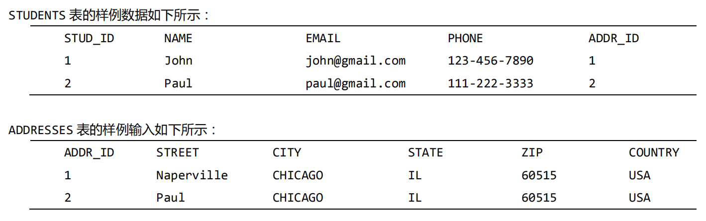
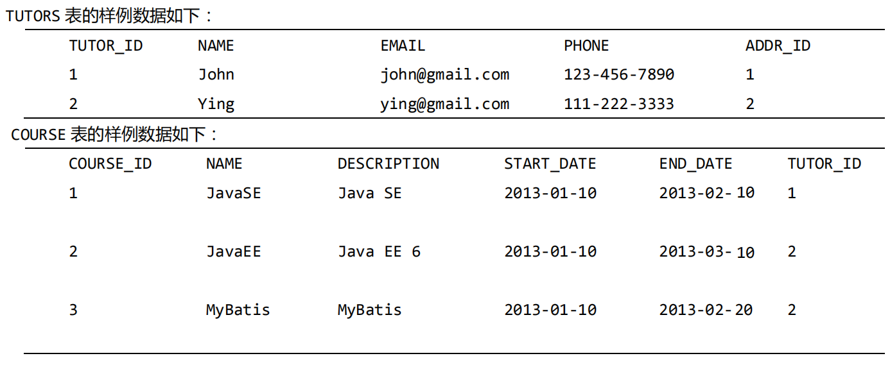

# Mybatis快速入门

---

### Mybatis简介

##### Mybatis基本概念

Mybatis 是一个简化和实现了 Java 数据持久化层(persistence layer)的开源框架，它抽象了大量的 JDBC 冗余代码，并提供了一个简单易用的 API 和数据库交互。Mybatis 的前身是 iBATIS，iBATIS 于 2002 年由 Clinton Begin 创建。MyBatis 3 是 iBATIS 的全新设计，支持注解和 Mapper。

Mybatis 流行的主要原因在于它的简单性和易使用性。在 Java 应用程序中，数据持久化层涉及到的工作有：将从数据库查询到的数据生成所需要的 Java 对象，以及将 Java 对象中的数据通过 SQL 持久化到数据库中。Mybatis 通过抽象底层的 JDBC 代码，自动化 SQL 结果集产生 Java 对象、Java 对象的数据持久化到数据库中的过程使得对 SQL 的使用变得容易。

##### Mybatis的特性

Mybatis具有以下特性：

* 消除了大量的JDBC冗余代码；
* 具有较低的学习曲线；
* 能很好地与传统数据库协同工作；
* 可以接受SQL语句；
* 提供了与Spring框架的集成支持；
* 提供了与第三方缓存框架的集成支持；
* 具有良好的性能；

### Mybatis入门示例

1、建表，并准备数据

~~~sql
CREATE TABLE STUDENTS(
	stud_id int(11) NOT NULL AUTO_INCREMENT,
	name varchar(50) NOT NULL,
	email varchar(50) NOT NULL,
	dob date DEFAULT NULL,
	PRIMARY KEY (stud_id)
) ENGINE=InnoDB AUTO_INCREMENT=1 DEFAULT CHARSET=latin1;

/*Sample Data for the students table */
insert into students(stud_id,name,email,dob) values (1,'Student1','student1@gmail.com','1983-06-25');
insert into students(stud_id,name,email,dob) values (2,'Student2','student2@gmail.com','1983-06-25');
~~~

2、添加依赖

~~~xml
<dependencies>
	<dependency>
		<groupId>org.mybatis</groupId>
		<artifactId>mybatis</artifactId>
		<version>3.2.2</version>
	</dependency>
	<dependency>
		<groupId>mysql</groupId>
		<artifactId>mysql-connector-java</artifactId>
		<version>5.1.22</version>
		<scope>runtime</scope>
	</dependency>
	<dependency>
		<groupId>org.slf4j</groupId>
		<artifactId>slf4j-api</artifactId>
		<version>1.7.5</version>
	</dependency>
	<dependency>
		<groupId>org.slf4j</groupId>
		<artifactId>slf4j-log4j12</artifactId>
		<version>1.7.5</version>
		<scope>runtime</scope>
	</dependency>
	<dependency>
		<groupId>log4j</groupId>
		<artifactId>log4j</artifactId>
		<version>1.2.17</version>
		<scope>runtime</scope>
	</dependency>
	<dependency>
		<groupId>junit</groupId>
		<artifactId>junit</artifactId>
		<version>4.11</version>
		<scope>test</scope>
	</dependency>
</dependencies>
~~~

3、添加log4j.properties

~~~plaintext
log4j.rootLogger=DEBUG, stdout
log4j.appender.stdout=org.apache.log4j.ConsoleAppender
log4j.appender.stdout.layout=org.apache.log4j.PatternLayout
log4j.appender.stdout.layout.ConversionPattern=%d [%-5p] %c - %m%n
~~~

4、Mybatis主配置文件mybatis-config.xml，放到classpath下。

~~~xml
<?xml version="1.0" encoding="utf-8"?>
<!DOCTYPE configuration PUBLIC "-//mybatis.org//DTD Config 3.0//EN" "http://mybatis.org/dtd/mybatis-3-config.dtd">
<configuration>
	<typeAliases>
		<typeAlias alias="Student" type="com.mybatis3.domain.Student" />
	</typeAliases>
	<environments default="development">
		<environment id="development">
			<transactionManager type="JDBC" />
			<dataSource type="POOLED">
				<property name="driver" value="com.mysql.jdbc.Driver" />
				<property name="url" value="jdbc:mysql://localhost:3306/test" />
				<property name="username" value="root" />
				<property name="password" value="admin" />
			</dataSource>
		</environment>
	</environments>
	<mappers>
		<mapper resource="com/mybatis3/mappers/StudentMapper.xml" />
	</mappers>
</configuration>
~~~

5、创建SQL映射器XML配置文件StudentMapper.xml，并放到com.mybatis3.mapper包中。

~~~xml
<?xml version="1.0" encoding="utf-8"?>
<!DOCTYPE mapper PUBLIC "-//mybatis.org//DTD Mapper 3.0//EN" "http://mybatis.org/dtd/mybatis-3-mapper.dtd">
<mapper namespace="com.mybatis3.mappers.StudentMapper">
	<resultMap type="Student" id="StudentResult">
		<id property="studId" column="stud_id" />
		<result property="name" column="name" />
		<result property="email" column="email" />
		<result property="dob" column="dob" />
	</resultMap>

	<select id="findAllStudents" resultMap="StudentResult">
		SELECT * FROM STUDENTS
	</select>

	<select id="findStudentById" parameterType="int" resultType="Student">
		SELECT STUD_ID AS STUDID, NAME, EMAIL, DOB FROM STUDENTS WHERE STUD_ID=#{Id}
	</select>

	<insert id="insertStudent" parameterType="Student">
		INSERT INTO STUDENTS(STUD_ID,NAME,EMAIL,DOB) VALUES(#{studId },#{name},#{email},#{dob})
	</insert>
</mapper>
~~~

6、封装MyBatisSqlSessionFactory

~~~java
package com.mybatis3.util;
import java.io.*;
import org.apache.ibatis.io.Resources;
import org.apache.ibatis.session.*;

public class MyBatisSqlSessionFactory {
	private static SqlSessionFactory sqlSessionFactory;
	public static SqlSessionFactory getSqlSessionFactory() {
		if(sqlSessionFactory == null) {
			InputStream inputStream;
			try {
				inputStream = Resources.getResourceAsStream("mybatis-config.xml");
				sqlSessionFactory = new SqlSessionFactoryBuilder().build(inputStream);
			} catch (IOException e) {
				throw new RuntimeException(e.getCause());
			}
		}
		return sqlSessionFactory;
	}
	public static SqlSession openSession() {
		return getSqlSessionFactory().openSession();
	}
}
~~~

7、业务代码

~~~java
package com.mybatis3.domain;
import java.util.Date;
public class Student {
	private Integer studId;
	private String name;
	private String email;
	private Date dob;
	// setters and getters
}

package com.mybatis3.mappers;
import java.util.List;
import com.mybatis3.domain.Student;
public interface StudentMapper {
	List<Student> findAllStudents();
	Student findStudentById(Integer id);
	void insertStudent(Student student);
}

package com.mybatis3.services;
import java.util.List;
import org.apache.ibatis.session.SqlSession;
import org.slf4j.Logger;
import org.slf4j.LoggerFactory;
import com.mybatis3.domain.Student;
import com.mybatis3.mappers.StudentMapper;
import com.mybatis3.util.MyBatisSqlSessionFactory;
public class StudentService {
	private Logger logger = LoggerFactory.getLogger(getClass());
	public List<Student> findAllStudents() {
		SqlSession sqlSession = MyBatisSqlSessionFactory.openSession();
		try {
			StudentMapper studentMapper = sqlSession.getMapper(StudentMapper.class);
			return studentMapper.findAllStudents();
		} finally {
			//If sqlSession is not closed then database Connection associated this sqlSession will not be returned to pool and application may run out of connections.
			sqlSession.close();
		}
	}
	public Student findStudentById(Integer studId) {
		logger.debug("Select Student By ID :{}", studId);
		SqlSession sqlSession = MyBatisSqlSessionFactory.openSession();
		try {
			StudentMapper studentMapper = sqlSession.getMapper(StudentMapper.class);
			return studentMapper.findStudentById(studId);
		} finally {
			sqlSession.close();
		}
	}
	public void createStudent(Student student) {
		SqlSession sqlSession = MyBatisSqlSessionFactory.openSession();
		try {
			StudentMapper studentMapper = sqlSession.getMapper(StudentMapper.class);
			studentMapper.insertStudent(student);
			sqlSession.commit();
		} finally {
			sqlSession.close();
		}
	}
}
~~~

8、测试代码

~~~java
package com.mybatis3.services;
import java.util.*;
import org.junit.*;
import com.mybatis3.domain.Student;
public class StudentServiceTest {
	private static StudentService studentService;
	@BeforeClass
	public static void setup() {
		studentService = new StudentService();
	}
	@AfterClass
	public static void teardown() {
		studentService = null;
	}
	@Test
	public void testFindAllStudents() {
		List<Student> students = studentService.findAllStudents();
		Assert.assertNotNull(students);
		for (Student student : students) {
			System.out.println(student);
		}
	}
	@Test
	public void testFindStudentById() {
		Student student = studentService.findStudentById(1);
		Assert.assertNotNull(student);
		System.out.println(student);
	}
	@Test
	public void testCreateStudent() {
		Student student = new Student();
		int id = 3;
		student.setStudId(id);
		student.setName("student_" + id);
		student.setEmail("student_" + id + "gmail.com");
		student.setDob(new Date());
		studentService.createStudent(student);
		Student newStudent = studentService.findStudentById(id);
		Assert.assertNotNull(newStudent);
	}
}
~~~

9、原理分析

首先，我们配置了 Mybatis 最主要的配置文件 mybatis-config.xml，里面包含了 JDBC 连接参数；配置了映射器 Mapper XML 配置文件，里面包含了 SQL 语句的映射。

接着，我们使用 mybatis-config.xml 内的信息创建了 SqlSessionFactory 对象。每个数据库环境应该就一个 SqlSessionFactory 对象实例，所以我们使用了单例模式只创建一个 SqlSessionFactory 实例。

我们创建了一个映射器 Mapper 接口 StudentMapper，其定义的方法签名和在 StudentMapper.xml 中定义的完全一样（即映射器 Mapper 接口中的方法名跟 StudentMapper.xml 中的 id 的值相同）。注意 StudentMapper.xml 中 namespace 的值被设置成 com.mybatis3.mappers.StudentMapper，是 StudentMapper 接口的完全限定名，这使我们可以使用接口来调用映射的 SQL 语句。

在 StudentService.java 中，我们在每一个方法中创建了一个新的 SqlSession，并在方法功能完成后关闭 SqlSession。每一个线程应该有它自己的 SqlSession 实例，SqlSession 对象实例不是线程安全的，并且不被共享。所以 SqlSession 的作用域最好就是其所在方法的作用域。从 Web 应用程序角度上看，SqlSession 应该存在于 request 级别作用域上。

### Mybatis引导配置

##### 概念

Mybatis 最关键的组成部分是 SqlSessionFactory，我们可以从中获取 SqlSession，并执行映射的 SQL 语句。SqlSessionFactory 对象可以通过基于 XML 的配置信息或者 Java API两种方式来创建。

##### 基于XML配置Mybatis

1、基本示例

~~~xml
<?xml version="1.0" encoding="utf-8"?>
<!DOCTYPE configuration PUBLIC "-//mybatis.org//DTD Config 3.0//EN" "http://mybatis.org/dtd/mybatis-3-config.dtd">
<configuration>
	<properties resource="application.properties">
		<property name="username" value="db_user" />
		<property name="password" value="verysecurepwd" />
	</properties>
	<settings>
		<setting name="cacheEnabled" value="true" />
	</settings>
	<typeAliases>
		<typeAlias alias="Tutor" type="com.mybatis3.domain.Tutor" />
		<package name="com.mybatis3.domain" />
	</typeAliases>
	<typeHandlers>
		<typeHandler handler="com.mybatis3.typehandlers.PhoneTypeHandler" />
		<package name="com.mybatis3.typehandlers" />
	</typeHandlers>
	<environments default="development">
		<environment id="development">
			<transactionManager type="JDBC" />
			<dataSource type="POOLED">
				<property name="driver" value="${jdbc.driverClassName}" />
				<property name="url" value="${jdbc.url}" />
				<property name="username" value="${jdbc.username}" />
				<property name="password" value="${jdbc.password}" />
			</dataSource>
		</environment>
		<environment id="production">
			<transactionManager type="MANAGED" />
			<dataSource type="JNDI">
				<property name="data_source" value="java:comp/jdbc/MyBatisDemoDS" />
			</dataSource>
		</environment>
	</environments>
	<mappers>
		<mapper resource="com/mybatis3/mappers/StudentMapper.xml" />
		<mapper url="file:///D:/mybatisdemo/mappers/TutorMapper.xml" />
		<mapper class="com.mybatis3.mappers.TutorMapper" />
	</mappers>
</configuration>
~~~

2、environment

Mybatis 支持配置多个 dataSource 环境，可以将应用部署到不同的环境上，如 DEV(开发环境)，TEST（测试环境），QA（质量评估环境），UAT(用户验收环境)，PRODUCTION（生产环境）等。可以通过将默认 environment 值设置成想要的 environment id 值。

在上述的配置中，默认的环境 environment 被设置成 development。当需要将程序部署到生产服务器上时，你不需要修改什么配置，只需要将默认环境 environment 值设置成生产环境的 environment id 属性即可。

有时候，我们可能需要在相同的应用下使用多个数据库。比如我们可能有 SHOPPING-CART 数据库来存储所有的订单明细；使用 REPORTS 数据库存储订单明细的合计，用作报告。如果你的应用需要连接多个数据库，你需要将每个数据库配置成独立的环境，并且为每一个数据库创建一个SqlSessionFactory。

~~~xml
<environments default="shoppingcart">
	<environment id="shoppingcart">
		<transactionManager type="MANAGED" />
		<dataSource type="JNDI">
			<property name="data_source" value="java:comp/jdbc/ShoppingcartDS" />
		</dataSource>
	</environment>
	<environment id="reports">
		<transactionManager type="MANAGED" />
		<dataSource type="JNDI">
			<property name="data_source" value="java:comp/jdbc/ReportsDS" />
		</dataSource>
	</environment>
</environments>
~~~

~~~java
inputStream = Resources.getResourceAsStream("mybatis-config.xml");
defaultSqlSessionFactory = new SqlSessionFactoryBuilder().build(inputStream);
cartSqlSessionFactory = new SqlSessionFactoryBuilder().build(inputStre
am, "shoppingcart");
reportSqlSessionFactory = new SqlSessionFactoryBuilder().build(inputStream, "reports");
~~~

3、数据源 dataSource

dataSource 元素被用来配置数据库连接属性。

~~~xml
<dataSource type="POOLED">
	<property name="driver" value="${jdbc.driverClassName}" />
	<property name="url" value="${jdbc.url}" />
	<property name="username" value="${jdbc.username}" />
	<property name="password" value="${jdbc.password}" />
</dataSource>
~~~

dataSource 的类型可以配置成其内置类型之一，如 UNPOOLED，POOLED，JNDI。 

* UNPOOLED：Mybatis 会为每一个数据库操作创建一个新的连接，并关闭它。该方式适用于只有小规模数量并发用户的简单应用程序上。
* POOLED：Mybatis 会创建一个数据库连接池，连接池中的一个连接将会被用作数据库操作。一旦数据库操作完成，Mybatis 会将此连接返回给连接池。在开发或测试环境中，经常使用此种方式。
* JNDI：Mybatis 从在应用服务器向配置好的 JNDI 数据源 dataSource 获取数据库连接。在生产环境中，优先考虑这种方式。

4、事务管理器 TransactionManager

Mybatis 支持两种类型的事务管理器： JDBC 和 MANAGED：

* JDBC 事务管理器被用作当应用程序负责管理数据库连接的生命周期（提交、回退等等）的时候。当你将 TransactionManager 属性设置成 JDBC，Mybatis 内部将使用 JdbcTransactionFactory 类创建 TransactionManager。例如，部署到 Apache Tomcat 的应用程序，需要应用程序自己管理事务。
* MANAGED 事务管理器是当由应用服务器负责管理数据库连接生命周期的时候使用。当你将 TransactionManager 属性设置成 MANAGED 时，Mybatis 内部使用 ManagedTransactionFactory 类创建事务管理器TransactionManager。例如，当一个JavaEE的应用程序部署在类似 JBoss，WebLogic，GlassFish 应用服务器上时，它们会使用 EJB 进行应用服务器的事务管理能力。在这些管理环境中，你可以使用 MANAGED 事务管理器。

5、属性 Properties

属性配置元素可以将配置值具体化到一个属性文件中，并且使用属性文件的 key 名作为占位符。在上述的配置中，我们将数据库连接属性具体化到了 application.properties 文件中，并且为 driver、url 等属性使用了占位符。

~~~plaintext
jdbc.driverClassName=com.mysql.jdbc.Driver
jdbc.url=jdbc:mysql://localhost:3306/mybatisdemo
jdbc.username=root
jdbc.password=admin
~~~

~~~xml
<properties resource="application.properties">
	<property name="jdbc.username" value="db_user" />
	<property name="jdbc.password" value="verysecurepwd" />
</properties>
<dataSource type="POOLED">
	<property name="driver" value="${jdbc.driverClassName}" />
	<property name="url" value="${jdbc.url}" />
	<property name="username" value="${jdbc.username}" />
	<property name="password" value="${jdbc.password}" />
</dataSource>
~~~

可以在`<properties>`元素中配置默认参数的值。如果`<properties>`中定义的元素和属性文件定义元素的 key值相同，它们会被属性文件中定义的值覆盖。

6、类型别名 typeAliases

在 SQL Mapper 配置文件中，对于 resultType 和 parameterType 属性值，我们需要使用 JavaBean 的完全限定名。但这种方式有点麻烦，我们可以为完全限定名取一个别名（alias），然后其需要使用完全限定名的地方使用别名，而不是到处使用完全限定名。

~~~xml
<typeAliases>
	<typeAlias alias="Student" type="com.mybatis3.domain.Student" />
	<typeAlias alias="Tutor" type="com.mybatis3.domain.Tutor" />
	<package name="com.mybatis3.domain" />
</typeAliases>
~~~

你可以不用为每一个 JavaBean 单独定义别名, 你可以为提供需要取别名的 JavaBean 所在的包(package)，Mybatis 会自动扫描包内定义的 JavaBeans，然后分别为 JavaBean 注册一个**小写字母开头**的非完全限定的类名形式的别名。

还有另外一种方式为 JavaBeans 起别名，使用注解@Alias：

~~~java
@Alias("StudentAlias")
public class Student{}
~~~

@Alias 注解将会覆盖配置文件中的`<typeAliases>`定义。

7、类型处理器 typeHandlers

Mybatis 通过抽象 JDBC 来简化了数据持久化逻辑的实现，Mybatis 在其内部使用 JDBC，提供了更简洁的方式实现了数据库操作。当 Mybatis 将一个 Java 对象作为输入参数执行 INSERT 语句操作时，它会创建一个 PreparedStatement 对象，并且使用 setXXX()方式对占位符设置相应的参数值。这里，XXX 可以是 Int，String，Date 等 Java 对象属性类型的任意一个。

但 Mybatis 是怎么知道对于 Integer 类型属性使用 setInt() 和 String 类型属性使用 setString()方法呢？其实 Mybatis 是通过使用类型处理器（type handlers）来决定这么做的。

Mybatis 对于以下的类型使用内建的类型处理器：所有的基本数据类型、基本类型的包裹类型、byte[]、java.util.Date、java.sql.Date、java,sql.Time、java.sql.Timestamp、Java 枚举类型等。所以当 Mybatis 发现属性的类型属于上述类型，他会使用对应的类型处理器将值设置到 PreparedStatement 中。同样地，当从 SQL 结果集构建 JavaBean 时，也有类似的过程。

假设表 STUDENTS 有一个 PHONE 字段，类型为 VARCHAR(15)，而 JavaBean Student 有一个 PhoneNumber 类定义类型的 phoneNumber 属性。

~~~java
public class PhoneNumber {
	private String countryCode;
	private String stateCode;
	private String number;
	public PhoneNumber() {}
	public PhoneNumber(String countryCode, String stateCode, String number) {
		this.countryCode = countryCode;
		this.stateCode = stateCode;
		this.number = number;
	}
	public PhoneNumber(String string) {
		if(string != null) {
			String[] parts = string.split("-");
			if(parts.length > 0) this.countryCode = parts[0];
			if(parts.length > 1) this.stateCode = parts[1];
			if(parts.length > 2) this.number = parts[2];
		}
	}
	public String getAsString() {
		return countryCode + "-" + stateCode + "-" + number;
	}
	// Setters and getters
}

public class Student {
	private Integer id;
	private String name;
	private String email;
	private PhoneNumber phone;
	// Setters and getters
}
~~~

~~~xml
<insert id="insertStudent" parameterType="Student">
	insert into students(name,email,phone) values(#{name},#{email},#{phone})
</insert>
~~~

这里，phone 参数需要传递给#{phone}；而 phone 对象是 PhoneNumber 类型。然而，Mybatis 并不知道该怎样来处理这个类型的对象。为了让 Mybatis 明白怎样处理这个自定义的 Java 对象类型，如 PhoneNumber，我们可以创建一个自定义的类型处理器：

~~~java
package com.mybatis3.typehandlers;
import java.sql.CallableStatement;
import java.sql.PreparedStatement;
import java.sql.ResultSet;
import java.sql.SQLException;
import org.apache.ibatis.type.BaseTypeHandler;
import org.apache.ibatis.type.JdbcType;
import com.mybatis3.domain.PhoneNumber;
public class PhoneTypeHandler extends BaseTypeHandler<PhoneNumber> {
	@Override
	public void setNonNullParameter(PreparedStatement ps, int i, PhoneNumber parameter, JdbcType jdbcType) throws SQLException {
		ps.setString(i, parameter.getAsString());
	}
	@Override
	public PhoneNumber getNullableResult(ResultSet rs, String columnName) throws SQLException {
		return new PhoneNumber(rs.getString(columnName));
	}
	@Override
	public PhoneNumber getNullableResult(ResultSet rs, int columnIndex) throws SQLException {
		return new PhoneNumber(rs.getString(columnIndex));
	}
	@Override
	public PhoneNumber getNullableResult(CallableStatement cs, int columnIndex) throws SQLException {
		return new PhoneNumber(cs.getString(columnIndex));
	}
}
~~~

实现了自定义的类型处理器，需要在 mybatis-config.xml 中注册它：

~~~xml
<?xml version="1.0" encoding="utf-8"?>
<!DOCTYPE configuration PUBLIC "-//mybatis.org//DTD Config 3.0//EN" "http://mybatis.org/dtd/mybatis-3-config.dtd">
<configuration>
	<properties resource="application.properties" />
	<typeHandlers>
		<typeHandler handler="com.mybatis3.typehandlers. PhoneTypeHandler" />
	</typeHandlers>
</configuration>
~~~

注册 PhoneTypeHandler 后, Mybatis 就能够将 Phone 类型的对象值存储到 VARCHAR 类型的列上。

8、全局参数设置 Settings

为满足应用特定的需求，Mybatis 默认的全局参数设置可以被覆盖(overridden)掉。

~~~xml
<settings>
	<setting name="cacheEnabled" value="true" />
	<setting name="lazyLoadingEnabled" value="true" />
	<setting name="multipleResultSetsEnabled" value="true" />
	<setting name="useColumnLabel" value="true" />
	<setting name="useGeneratedKeys" value="false" />
	<setting name="autoMappingBehavior" value="PARTIAL" />
	<setting name="defaultExecutorType" value="SIMPLE" />
	<setting name="defaultStatementTimeout" value="25000" />
	<setting name="safeRowBoundsEnabled" value="false" />
	<setting name="mapUnderscoreToCamelCase" value="false" />
	<setting name="localCacheScope" value="SESSION" />
	<setting name="jdbcTypeForNull" value="OTHER" />
	<setting name="lazyLoadTriggerMethods" value="equals,clone,hashCode ,toString" />
</settings>
~~~

9、SQL 映射定义 Mappers

Mapper XML 文件中包含的 SQL 映射语句将会被应用通过使用其 statementid 来执行。我们需要在 mybatis-config.xml 文件中配置 SQL Mapper 文件的位置。

~~~xml
<mappers>
	<mapper resource="com/mybatis3/mappers/StudentMapper.xml" />
	<mapper url="file:///D:/mybatisdemo/app/mappers/TutorMapper.xml" />
	<mapper class="com.mybatis3.mappers.TutorMapper" />
	<package name="com.mybatis3.mappers" />
</mappers>
~~~

* resource 属性用来指定在 classpath 中的 mapper 文件。
* url 属性用来通过完全文件系统路径或者 Web URL 地址来指向 mapper 文件。
* class 属性用来指向一个 mapper 接口。
* package 属性用来指向可以找到 Mapper 接口的包名。

##### 基于Java API配置Mybatis

Mybatis 的 SqlSessionFactory 接口除了使用基于 XML 的配置创建外也可以通过 Java API 编程式地被创建。每个在 XML 中配置的元素，都可以编程式的创建。

~~~java
public static SqlSessionFactory getSqlSessionFactory() {
	SqlSessionFactory sqlSessionFactory = null;
	try {
		DataSource dataSource = DataSourceFactory.getDataSource();
		TransactionFactory transactionFactory = new JdbcTransactionFactory();
		Environment environment = new Environment("development", transactionFactory, dataSource);
		Configuration configuration = new Configuration(environment);
		configuration.getTypeAliasRegistry().registerAlias("student", Student.class);
		configuration.getTypeHandlerRegistry().register(PhoneNumber.class, PhoneTypeHandler.class);
		configuration.addMapper(StudentMapper.class);
		sqlSessionFactory = new SqlSessionFactoryBuilder().build(configuration);
	} catch (Exception e) {
		throw new RuntimeException(e);
	}
	return sqlSessionFactory;
}
~~~

1、环境配置 Environment

Mabatis 连接的每一个数据库创建一个 Enviroment 对象。为了使用每一个环境，我们需要为每一个环境 environment 创建一个 SqlSessionFactory 对象。而创建 Environment 对象，我们需要 java.sql.DataSource和 TransactionFactory 实例。

2、数据源 DataSource

~~~java
public class DataSourceFactory {
	public static DataSource getDataSource() {
		String driver = "com.mysql.jdbc.Driver";
		String url = "jdbc:mysql://localhost:3306/mybatisdemo";
		String username = "root";
		String password = "admin";
		PooledDataSource dataSource = new PooledDataSource(driver, url, username, password);
		return dataSource;
	}
}

public class DataSourceFactory {
	public static DataSource getDataSource() {
		String jndiName = "java:comp/env/jdbc/MyBatisDemoDS";
		try {
			InitialContext ctx = new InitialContext();
			DataSource dataSource = (DataSource) ctx.lookup(jndiName);
			return dataSource;
		} catch (NamingException e) {
			throw new RuntimeException(e);
		}
	}
}
~~~

3、事务工厂 TransactionFactory

Mybatis 支持以下两种 TransactionFactory 实现：

* JdbcTransactionFactory
* ManagedTransactionFactory

如果你的应用程序运行在未托管（non-managed）的环境中，你应该使用JdbcTransactionFactory：

~~~java
DataSource dataSource = DataSourceFactory.getDataSource();
TransactionFactory txnFactory = new JdbcTransactionFactory();
Environment environment = new Environment("development", txnFactory, dataSource);
~~~

如果你的应用程序运行在未托管（non-managed）的环境中,并且使用容器支持的事务管理服务，你应该使用ManagedTransactionFactory：

~~~java
DataSource dataSource = DataSourceFactory.getDataSource();
TransactionFactory txnFactory = new ManagedTransactionFactory();
Environment environment = new Environment("development", txnFactory, dataSource);
~~~

4、类型别名 typeAliases

Mybatis 提供以下几种通过 Configuration 对象注册类型别名的方法：

~~~java
//根据默认的别名规则，使用一个类的首字母小写、非完全限定的类名作为别名注册
configuration.getTypeAliasRegistry().registerAlias(Student.class);

//指定别名注册
configuration.getTypeAliasRegistry().registerAlias("Student",Student.class);

//通过类的完全限定名注册相应类别名
configuration.getTypeAliasRegistry().registerAlias("Student",
"com.mybatis3.domain.Student");

//为某一个包中的所有类注册别名
configuration.getTypeAliasRegistry().registerAliases("com.mybatis3.domain");

//为在com.mybatis3.domain package包中所有的继承自Identifiable类型的类注册别名
configuration.getTypeAliasRegistry().registerAliases("com.mybatis3.domain", Identifiable.class);
~~~

5、类型处理器 typeHandlers

Mybatis 提供了一系列使用 Configuration 对象注册类型处理器（type handler）的方法。我们可以通过以下方式注册自定义的类处理器：

~~~java
//为某个特定的类注册类处理器
configuration.getTypeHandlerRegistry().register(PhoneNumber.class, PhoneTypeHandler.class);

//注册一个类处理器
configuration.getTypeHandlerRegistry().register(PhoneTypeHandler.class);

//注册 com.mybatis3.typehandlers 包中的所有类型处理器
configuration.getTypeHandlerRegistry().register("com.mybatis3.typehandlers");
~~~

6、全局参数设置 Settings

Mybatis 提供了一组默认的，能够很好地适用大部分的应用的全局参数设置。然而，你可以稍微调整这些参数，让它更好地满足你应用的需要。你可以使用下列方法将全局参数设置成想要的值。

~~~java
configuration.setCacheEnabled(true);
configuration.setLazyLoadingEnabled(false);
configuration.setMultipleResultSetsEnabled(true);
configuration.setUseColumnLabel(true);
configuration.setUseGeneratedKeys(false);
configuration.setAutoMappingBehavior(AutoMappingBehavior.PARTIAL);
configuration.setDefaultExecutorType(ExecutorType.SIMPLE);
configuration.setDefaultStatementTimeout(25);
configuration.setSafeRowBoundsEnabled(false);
configuration.setMapUnderscoreToCamelCase(false);
configuration.setLocalCacheScope(LocalCacheScope.SESSION);
configuration.setAggressiveLazyLoading(true);
configuration.setJdbcTypeForNull(JdbcType.OTHER);
Set<String> lazyLoadTriggerMethods = new HashSet<String>();
lazyLoadTriggerMethods.add("equals");
lazyLoadTriggerMethods.add("clone");
lazyLoadTriggerMethods.add("hashCode");
lazyLoadTriggerMethods.add("toString");
configuration.setLazyLoadTriggerMethods(lazyLoadTriggerMethods );
~~~

7、Mappers

Mybatis 提供了一些使用 Configuration 对象注册 Mapper XML 文件和 Mappe 接口的方法。

~~~java
//添加一个 Mapper 接口
configuration.addMapper(StudentMapper.class);

//添加 com.mybatis3.mappers 包中的所有 Mapper XML 文件或者 Mapper 接口
configuration.addMappers("com.mybatis3.mappers");

//添加所有 com.mybatis3.mappers 包中的继承了特定 Mapper 接口的 Maper 接口，如 BaseMapper
configuration.addMappers("com.mybatis3.mappers", BaseMapper.class);
~~~

> Mappers 应该在 typeAliases 和 typeHandler 注册后再添加到 configuration中。

##### 自定义 Mybatis 日志

Mybatis 使用其内部 LoggerFactory 作为真正的日志类库使用的门面。其内部的 LaggerFactory 会将日志记录任务委托给如下的所示某一个日志实现，日志记录优先级由上到下顺序递减：

* SLF4J
* Apache Commons Logging
* Log4j 2
* Log4j
* JDK logging

如果 Mybatis 未发现上述日志记录实现，则 Mybatis 的日志记录功能无效。

如果在你的运行环境中，在 classpath 中有多个可用的日志类库，并且你希望 Mybaits 使用某个特定的日志实现，你可以通过调用以下其中一个方法：

* org.apache.ibatis.logging.LogFactory.useSlf4jLogging();
* org.apache.ibatis.logging.LogFactory.useLog4JLogging();
* org.apache.ibatis.logging.LogFactory.useLog4J2Logging();
* org.apache.ibatis.logging.LogFactory.useJdkLogging();
* org.apache.ibatis.logging.LogFactory.useCommonsLogging();
* org.apache.ibatis.logging.LogFactory.useStdOutLogging();

> 如果你想自定义 Mybatis 日志记录，你应该在调用任何其它方法之前调用以上的其中一个方法。如果你想切换到的日志记录类库在运行时期无效，Mybatis 将会忽略这一请求。

### 基于XML配置SQL映射器

##### 映射器配置文件和映射器接口

1、映射器配置文件

我们可以通过字符串（字符串形式为：映射器配置文件所在的包名 namespace + 在文件内定义的语句 id，如包名 com.mybatis3.mappers.StudentMapper 和语句 id findStudentById 组成）调用映射的 SQL 语句，但是这种方式容易出错。你需要检查映射器配置文件中的定义，以保证你的输入参数类型和结果返回类型是有效的。

~~~xml
<?xml version="1.0" encoding="utf-8"?>
<!DOCTYPE mapper PUBLIC "-//mybatis.org//DTD Mapper 3.0//EN" "http://mybatis.org/dtd/mybatis-3-mapper.dtd">
<mapper namespace="com.mybatis3.mappers.StudentMapper">
	<select id="findStudentById" parameterType="int" resultType="Student">
		select stud_id as studId, name, email, dob from Students where stud_id=#{studId}
	</select>
</mapper>
~~~

~~~java
public Student findStudentById(Integer studId) {
	SqlSession sqlSession = MyBatisUtil.getSqlSession();
	try {
		Student student = sqlSession.selectOne("com.mybatis3.mappers.StudentMapper.findStudentById", studId);
		return student;
	} finally {
		sqlSession.close();
	}
}
~~~

2、映射器接口

Mybatis 通过使用映射器 Mapper 接口提供了更好的调用映射语句的方法。一旦我们通过映射器配置文件配置了映射语句，我们可以创建一个完全对应的一个映射器接口，接口名跟配置文件名相同，接口所在包名也跟配置文件所在包名完全一 样 ( 如 StudentMapper.xml 所 在 的 包 名 是 com.mybatis3.mappers ，对应的接口名就是com.mybatis3.mappers.StudentMapper.java ）。映射器接口中的方法签名也跟映射器配置文件中完全对应：方法名为配置文件中 id 值；方法参数类型为 parameterType 对应值；方法返回值类型为 returnType 对应值。

~~~java
package com.mybatis3.mappers;
public interface StudentMapper {
	Student findStudentById(Integer id);
}
~~~

在 StudentMapper.xml 映射器配置文件中，其名称空间 namespace 应该跟 StudentMapper 接口的完全限定名保持一致。另外，StudentMapper.xml 中语句 id，parameterType，returnType 应该分别和 StudentMapper 接口中的方法名，参数类型，返回值相对应。

~~~java
public Student findStudentById(Integer studId) {
	SqlSession sqlSession = MyBatisUtil.getSqlSession();
	try {
		StudentMapper studentMapper = sqlSession.getMapper(StudentMapper.class);
		return studentMapper.findStudentById(studId);
	} finally {
		sqlSession.close();
	}
}
~~~

> 即使映射器 Mapper 接口可以以类型安全的方式调用映射语句，但是我们也要负责书写正确的，匹配方法名、参数类型和返回值的映射器 Mapper 接口。如果映射器 Mapper 接口中的方法和 XML 中的映射语句不能匹配，会在运行期抛出一个异常。实际上，指定 parameterType 是可选的；Mybatis 可以使用反射机制来决定 parameterType。但是，从配置可读性的角度来看，最好指定parameterType 属性。如果 parameterType 没有被提及，开发者必须查看Mapper XML 配置和 Java 代码了解传递给语句的输入参数的数据类型。

##### 映射语句

1、INSERT语句

一个 INSERT SQL 语句可以用`<insert>`元素在映射器 XML 配置文件中配置。

~~~xml
<insert id="insertStudent" parameterType="Student">
	INSERT INTO STUDENTS(STUD_ID,NAME,EMAIL, PHONE) VALUES(#{studId},#{name},#{email},#{phone})
</insert>
~~~

~~~java
int count = sqlSession.insert("com.mybatis3.mappers.StudentMapper.insertStudent", student);
~~~

也可以：

~~~java
package com.mybatis3.mappers;
public interface StudentMapper {
	int insertStudent(Student student);
}

StudentMapper mapper = sqlSession.getMapper(StudentMapper.class);
int count = mapper.insertStudent(student);
~~~

2、自动生成主键

在上述的 INSERT 语句中，我们为可以自动生成（auto-generated）主键的列 STUD_ID 插入值。我们可以使用 useGeneratedKeys 和 keyProperty 属性让数据库生成 auto_increment 列的值，并将生成的值设置到其中一个输入对象属性内。

~~~xml
<insert id="insertStudent" parameterType="Student" useGeneratedKeys="true" keyProperty="studId">
	INSERT INTO STUDENTS(NAME, EMAIL, PHONE) VALUES(#{name},#{email},#{phone})
</insert>
~~~

这里 STUD_ID 列值将会被 MySQL 数据库自动生成，并且生成的值会被设置到 student 对象的 studId 属性上。

~~~java
StudentMapper mapper = sqlSession.getMapper(StudentMapper.class);
mapper.insertStudent(student);
int studentId = student.getStudId();
~~~

有些数据库如 Oracle 并不支持 AUTO_INCREMENT 列，其使用序列（SEQUENCE）来生成主键值。假设我们有一个名为 STUD_ID_SEQ 的序列来生成 SUTD_ID 主键值。使用如下代码来生成主键：

~~~xml
<insert id="insertStudent" parameterType="Student">
	<selectKey keyProperty="studId" resultType="int" order="BEFORE">
		SELECT ELEARNING.STUD_ID_SEQ.NEXTVAL FROM DUAL
	</selectKey>
	INSERT INTO STUDENTS(STUD_ID,NAME,EMAIL, PHONE) VALUES(#{studId},#{name},#{email},#{phone})
</insert>
~~~

这里我们使用了`<selectKey>`子元素来生成主键值，并将值保存到 Student 对象的 studId 属性上。 属性order=“before”表示 Mybatis 将取得序列的下一个值作为主键值，并且在执行 INSERT SQL 语句之前将值设置到studId 属性上。

我们也可以在获取序列的下一个值时，使用触发器（trigger）来设置主键值，并且在执行 INSERT SQL 语句之前将值设置到主键列上。如果你采取这样的方式，则对应的 INSERT 映射语句如下所示：

~~~xml
<insert id="insertStudent" parameterType="Student">
	INSERT INTO STUDENTS(NAME,EMAIL, PHONE) VALUES(#{name},#{email},#{phone})
	<selectKey keyProperty="studId" resultType="int" order="AFTER">
		SELECT ELEARNING.STUD_ID_SEQ.CURRVAL FROM DUAL
	</selectKey>
</insert>
~~~

3、UPDATE语句

一个 UPDATE SQL 语句可以在`<update>`元素在映射器 XML 配置文件中配置。

~~~xml
<update id="updateStudent" parameterType="Student">
	UPDATE STUDENTS SET NAME=#{name}, EMAIL=#{email}, PHONE=#{phone} WHERE STUD_ID=#{studId}
</update>
~~~

~~~java
int noOfRowsUpdated = sqlSession.update("com.mybatis3.mappers.StudentMapper.updateStudent", student);
~~~

也可以：

~~~java
package com.mybatis3.mappers;
public interface StudentMapper {
	int updateStudent(Student student);
}

StudentMapper mapper = sqlSession.getMapper(StudentMapper.class);
int noOfRowsUpdated = mapper.updateStudent(student);
~~~

4、删除语句

一个 DELETE SQL 语句可以在`<delete>`元素在映射器 XML 配置文件中配置。

~~~xml
<delete id="deleteStudent" parameterType="int">
	DELETE FROM STUDENTS WHERE STUD_ID=#{studId}
</delete>
~~~

~~~java
int studId = 1;
int noOfRowsDeleted = sqlSession.delete("com.mybatis3.mappers.StudentMapper.deleteStudent", studId);
~~~

也可以：

~~~java
package com.mybatis3.mappers;
public interface StudentMapper {
	int deleteStudent(int studId);
}

StudentMapper mapper = sqlSession.getMapper(StudentMapper.class);
int noOfRowsDeleted = mapper.deleteStudent(studId);
~~~

5、SELECT语句

~~~xml
<select id="findStudentById" parameterType="int" resultType="Student">
	SELECT STUD_ID, NAME, EMAIL, PHONE FROM STUDENTS WHERE STUD_ID=#{studId}
</select>
<select id="findAllStudents" resultType="Student">
	SELECT STUD_ID AS studId, NAME,EMAIL, PHONE FROM STUDENTS
</select>
~~~

~~~java
int studId =1;
Student student = sqlSession.selectOne("com.mybatis3.mappers.StudentMapper.findStudentById", studId);

List<Student> students = sqlSession.selectList("com.mybatis3.mappers.StudentMapper.findAllStudents");
~~~

也可以：

~~~java
package com.mybatis3.mappers;
public interface StudentMapper {
	Student findStudentById(Integer studId);
	List<Student> findAllStudents();
}

StudentMapper mapper = sqlSession.getMapper(StudentMapper.class);
Student student = mapper.findStudentById(studId);

StudentMapper mapper = sqlSession.getMapper(StudentMapper.class);
List<Student> students = mapper.findAllStudents();
~~~

Mybatis 根据集合的类型，会采用适当的集合实现，如下所示： 

* 对于 List，Collection，Iterable 类型，Mybatis 将返回 java.util.ArrayList；
* 对于 Map 类型，Mybatis 将返回 java.util.HashMap；
* 对于 Set 类型，Mybatis 将返回 java.util.HashSet；
* 对于 SortedSet 类型，Mybatis 将返回 java.util.TreeSet；

##### 映射结果

ResultMaps 被用来将SQL SELECT 语句的结果集映射到 JavaBeans 的属性中。我们可以定义结果集映射ResultMaps并且在一些 SELECT 语句上引用 resultMap。Mybatis 的结果集映射 ResultMaps 特性非常强大，你可以使用它将简单的 SELECT 语句映射到复杂的一对一和一对多关系的 SELECT 语句上。

1、简单ResultMap

~~~xml
<resultMap id="StudentResult" type="com.mybatis3.domain.Student">
	<id property="studId" column="stud_id" />
	<result property="name" column="name" />
	<result property="email" column="email" />
	<result property="phone" column="phone" />
</resultMap>
<select id="findAllStudents" resultMap="StudentResult">
	SELECT * FROM STUDENTS
</select>
<select id="findStudentById" parameterType="int" resultMap="StudentResult">
	SELECT * FROM STUDENTS WHERE STUD_ID=#{studId}
</select>
~~~

表示 resultMap 的 StudentResult id 值应该在此名空间内是唯一的。并且 type 属性应该是完全限定类名或者是返回类型的别名。

`<result>`子元素被用来将一个 resultset 列映射到 JavaBean 的一个属性中。`<id>`元素和`<result>`元素功能相同，不过它被用来映射到唯一标识属性，用来区分和比较对象（一般和主键列相对应）。 在`<select>`语句中，我们使用了 resultMap 属性，而不是 resultType 来引用 StudentResult 映射。当`<select>`语 句中配置了 resutlMap 属性，Mybatis 会使用此数据库列名与对象属性映射关系来填充 JavaBean 中的属性。

> resultType 和 resultMap 二者只能用其一，不能同时使用。

2、查询结果填充到 HashMap 中

~~~xml
<select id="findStudentById" parameterType="int" resultType="map">
	SELECT * FROM STUDENTS WHERE STUD_ID=#{studId}
</select>
<select id="findAllStudents" resultType="map">
	SELECT STUD_ID, NAME, EMAIL, PHONE FROM STUDENTS
</select>
~~~

~~~java
HashMap<String,Object> studentMap = sqlSession.selectOne("com.mybatis3.mappers.StudentMapper.findStudentById", studId);
System.out.println("stud_id :"+studentMap.get("stud_id"));
System.out.println("name :"+studentMap.get("name"));
System.out.println("email :"+studentMap.get("email"));
System.out.println("phone :"+studentMap.get("phone"));

List<HashMap<String, Object>> studentMapList = sqlSession.selectList("com.mybatis3.mappers.StudentMapper.findAllStudents");
for(HashMap<String, Object> studentMap : studentMapList) {
	System.out.println("studId :" + studentMap.get("stud_id"));
	System.out.println("name :" + studentMap.get("name"));
	System.out.println("email :" + studentMap.get("email"));
	System.out.println("phone :" + studentMap.get("phone"));
}
~~~

将 resultType 配置成 map，即 java.util.HashMap 的别名。在这种情况下，结果集的列名将会作为 Map 中的 key 值，而列值将作为 Map 的 value 值。

3、扩展ResultMap

可以从另外一个`<resultMap>`，拓展出一个新的`<resultMap>`，这样，原先的属性映射可以继承过来。

~~~xml
<resultMap type="Student" id="StudentResult">
	<id property="studId" column="stud_id" />
	<result property="name" column="name" />
	<result property="email" column="email" />
	<result property="phone" column="phone" />
</resultMap>
<resultMap type="Student" id="StudentWithAddressResult" extends="StudentResult">
	<result property="address.addrId" column="addr_id" />
	<result property="address.street" column="street" />
	<result property="address.city" column="city" />
	<result property="address.state" column="state" />
	<result property="address.zip" column="zip" />
	<result property="address.country" column="country" />
</resultMap>

<select id="findStudentById" parameterType="int" resultMap="StudentResult">
	SELECT * FROM STUDENTS WHERE STUD_ID=#{studId}
</select>
<select id="selectStudentWithAddress" parameterType="int" resultMap="StudentWithAddressResult">
	SELECT STUD_ID, NAME, EMAIL, PHONE, A.ADDR_ID, STREET, CITY, STATE, ZIP, COUNTRY FROM STUDENTS S LEFT OUTER JOIN ADDRESSES A ON S.ADDR_ID=A.ADDR_ID WHERE STUD_ID=#{studId}
</select>
~~~

4、一对一映射

~~~java
public class Address {
	private Integer addrId;
	private String street;
	private String city;
	private String state;
	private String zip;
	private String country;
	// setters & getters
}
public class Student {
	private Integer studId;
	private String name;
	private String email;
	private PhoneNumber phone;
	private Address address;
	//setters & getters
}
~~~

~~~xml
<resultMap type="Student" id="StudentWithAddressResult">
	<id property="studId" column="stud_id" />
	<result property="name" column="name" />
	<result property="email" column="email" />
	<result property="phone" column="phone" />
	<result property="address.addrId" column="addr_id" />
	<result property="address.street" column="street" />
	<result property="address.city" column="city" />
	<result property="address.state" column="state" />
	<result property="address.zip" column="zip" />
	<result property="address.country" column="country" />
</resultMap>
<select id="selectStudentWithAddress" parameterType="int" resultMap="StudentWithAddressResult">
	SELECT STUD_ID, NAME, EMAIL, A.ADDR_ID, STREET, CITY, STATE, ZIP, COUNTRY FROM STUDENTS S LEFT OUTER JOIN ADDRESSES A ON S.ADDR_ID=A.ADDR_ID WHERE STUD_ID=#{studId}
</select>
~~~

~~~java
public interface StudentMapper {
	Student selectStudentWithAddress(int studId);
}

//使用
int studId = 1;
StudentMapper studentMapper = sqlSession.getMapper(StudentMapper.class);
Student student = studentMapper.selectStudentWithAddress(studId);
System.out.println("Student :" + student);
System.out.println("Address :" + student.getAddress());
~~~

上例展示了一对一关联映射的一种方法。然而，使用这种方式映射，如果 address 结果需要在其他的 SELECT 映射语句中映射成 Address 对象，我们需要为每一个语句重复这种映射关系。Mybatis 提供了更好地实现一对一关联映射的方 法：嵌套结果 ResultMap 和嵌套 select 查询语句。

1）使用嵌套结果 ResultMap 实现一对一关系映射

我们可以使用一个嵌套结果 ResultMap 方式来获取 Student 及其 Address 信息。

~~~xml
<resultMap type="Address" id="AddressResult">
	<id property="addrId" column="addr_id" />
	<result property="street" column="street" />
	<result property="city" column="city" />
	<result property="state" column="state" />
	<result property="zip" column="zip" />
	<result property="country" column="country" />
</resultMap>
<resultMap type="Student" id="StudentWithAddressResult">
	<id property="studId" column="stud_id" />
	<result property="name" column="name" />
	<result property="email" column="email" />
	<association property="address" resultMap="AddressResult" />
</resultMap>

<select id="findStudentWithAddress" parameterType="int" resultMap="StudentWithAddressResult">
	SELECT STUD_ID, NAME, EMAIL, A.ADDR_ID, STREET, CITY, STATE, ZIP, COUNTRY FROM STUDENTS S LEFT OUTER JOIN ADDRESSES A ON S.ADDR_ID=A.ADDR_ID WHERE STUD_ID=#{studId}
</select>
~~~

也可以使用`<association>` 定义内联的 resultMap：

~~~xml
<resultMap type="Student" id="StudentWithAddressResult">
	<id property="studId" column="stud_id" />
	<result property="name" column="name" />
	<result property="email" column="email" />
	<association property="address" javaType="Address">
		<id property="addrId" column="addr_id" />
		<result property="street" column="street" />
		<result property="city" column="city" />
		<result property="state" column="state" />
		<result property="zip" column="zip" />
		<result property="country" column="country" />
	</association>
</resultMap>

<select id="findStudentWithAddress" parameterType="int" resultMap="StudentWithAddressResult">
	SELECT STUD_ID, NAME, EMAIL, A.ADDR_ID, STREET, CITY, STATE, ZIP, COUNTRY FROM STUDENTS S LEFT OUTER JOIN ADDRESSES A ON S.ADDR_ID=A.ADDR_ID WHERE STUD_ID=#{studId}
</select>
~~~

使用嵌套结果 ResultMap 方式，关联的数据可以通过简单的查询语句（如果需要的话，需要与 joins 连接操作配合）进行加载。

2）使用嵌套查询实现一对一关系映射

我们可以通过使用嵌套 select 查询来获取 Student 及其 Address 信息。

~~~xml
<resultMap type="Address" id="AddressResult">
	<id property="addrId" column="addr_id" />
	<result property="street" column="street" />
	<result property="city" column="city" />
	<result property="state" column="state" />
	<result property="zip" column="zip" />
	<result property="country" column="country" />
</resultMap>
<select id="findAddressById" parameterType="int" resultMap="AddressResult">
	SELECT * FROM ADDRESSES WHERE ADDR_ID=#{id}
</select>

<resultMap type="Student" id="StudentWithAddressResult">
	<id property="studId" column="stud_id" />
	<result property="name" column="name" />
	<result property="email" column="email" />
	<association property="address" column="addr_id" select="findAddressById" />
</resultMap>
<select id="findStudentWithAddress" parameterType="int" resultMap="StudentWithAddressResult">
	SELECT * FROM STUDENTS WHERE STUD_ID=#{Id}
</select>
~~~

在此方式中，`<association>`元素的 select 属性被设置成了 id 为 findAddressById 的语句。这里，两个分开的 SQL 语句将会在数据库中执行，第一个调用 findStudentById 加载 student 信息，而第二个调用 findAddressById 来加载 address 信息。Addr_id 列的值将会被作为输入参数传递给 selectAddressById 语句。

~~~java
StudentMapper mapper = sqlSession.getMapper(StudentMapper.class);
Student student = mapper.selectStudentWithAddress(studId);
System.out.println(student);
System.out.println(student.getAddress());
~~~

5、一对多映射

~~~java
public class Course {
	private Integer courseId;
	private String name;
	private String description;
	private Date startDate;
	private Date endDate;
	private Integer tutorId;
	//setters & getters
}
public class Tutor {
	private Integer tutorId;
	private String name;
	private String email;
	private Address address;
	private List<Course> courses;
	//setters & getters
}
~~~

我们可以使用`<collection>`元素将一对多类型的结果映射到一个对象集合上。`<collection>`元素被用来将多行课程结果映射成一个课程 Course 对象的一个集合。和一对一映射一样，我们可以使用嵌套结果 ResultMap 和嵌套 Select 语句两种方式映射实现一对多映射。

1）使用内嵌结果 ResultMap 实现一对多映射

~~~xml
<resultMap type="Course" id="CourseResult">
	<id column="course_id" property="courseId" />
	<result column="name" property="name" />
	<result column="description" property="description" />
	<result column="start_date" property="startDate" />
	<result column="end_date" property="endDate" />
</resultMap>
<resultMap type="Tutor" id="TutorResult">
	<id column="tutor_id" property="tutorId" />
	<result column="tutor_name" property="name" />
	<result column="email" property="email" />
	<collection property="courses" resultMap="CourseResult" />
</resultMap>

<select id="findTutorById" parameterType="int" resultMap="TutorResult">
	SELECT T.TUTOR_ID, T.NAME AS TUTOR_NAME, EMAIL, C.COURSE_ID, C.NAME, DESCRIPTION, START_DATE, END_DATE FROM TUTORS T LEFT OUTER JOIN ADDRESSES A ON T.ADDR_ID=A.ADDR_ID LEFT OUTER JOIN COURSES C ON T.TUTOR_ID=C.TUTOR_ID WHERE T.TUTOR_ID=#{tutorId}
</select>
~~~

这里使用了一个简单的使用了 JOINS 连接的 Select 语句获取讲师及其所教课程信息。`<collection>`元素的 resultMap 属性设置成了 CourseResult，CourseResult 包含了 Course 对象属性与表列名之间的映射。

2）使用嵌套 Select 语句实现一对多映射

~~~xml
<resultMap type="Course" id="CourseResult">
	<id column="course_id" property="courseId" />
	<result column="name" property="name" />
	<result column="description" property="description" />
	<result column="start_date" property="startDate" />
	<result column="end_date" property="endDate" />
</resultMap>
<select id="findCoursesByTutor" parameterType="int" resultMap="CourseResult">
	SELECT * FROM COURSES WHERE TUTOR_ID=#{tutorId}
</select>

<resultMap type="Tutor" id="TutorResult">
	<id column="tutor_id" property="tutorId" />
	<result column="tutor_name" property="name" />
	<result column="email" property="email" />
	<collection property="courses" column="tutor_id" select="findCoursesByTutor" />
</resultMap>
<select id="findTutorById" parameterType="int" resultMap="TutorResult">
	SELECT T.TUTOR_ID, T.NAME AS TUTOR_NAME, EMAIL FROM TUTORS T WHERE T.TUTOR_ID=#{tutorId}
</select>
~~~

在这种方式中，`<aossication>`元素的 select 属性被设置为 id 为 findCourseByTutor 的语句，用来触发单独的 SQL 查询加载课程信息。tutor_id 这一列值将会作为输入参数传递给 findCouresByTutor 语句。

~~~java
public interface TutorMapper {
	Tutor findTutorById(int tutorId);
}
TutorMapper mapper = sqlSession.getMapper(TutorMapper.class);
Tutor tutor = mapper.findTutorById(tutorId);
System.out.println(tutor);
List<Course> courses = tutor.getCourses();
for (Course course : courses) {
	System.out.println(course);
}
~~~

> 嵌套 Select 语句查询会导致 N+1 选择问题。首先，主查询将会执行（1 次），对于主查询返回的每一行，另外一个查询将会被执行（主查询 N 行，则此查询 N 次）。对于大型数据库而言，这会导致很差的性能问题。

##### 动态SQL

1、If 条件

`<if>`元素被用来有条件地嵌入 SQL 片段，如果测试条件被赋值为 true，则相应地 SQL 片段将会被添加到 SQL 语句中。

~~~xml
<resultMap type="Course" id="CourseResult">
	<id column="course_id" property="courseId" />
	<result column="name" property="name" />
	<result column="description" property="description" />
	<result column="start_date" property="startDate" />
	<result column="end_date" property="endDate" />
</resultMap>
<select id="searchCourses" parameterType="hashmap" resultMap="CourseResult">
SELECT * FROM COURSES WHERE TUTOR_ID= #{tutorId}
<if test="courseName != null">
	AND NAME LIKE #{courseName}
</if>
<if test="startDate != null">
	AND START_DATE >= #{startDate}
</if>
<if test="endDate != null">
	AND END_DATE <= #{endDate}
</if>
</select>
~~~

~~~java
public interface CourseMapper {
	List<Course> searchCourses(Map<String, Object> map);
}
public void searchCourses() {
	Map<String, Object> map = new HashMap<String, Object>();
	map.put("tutorId", 1);
	map.put("courseName", "%java%");
	map.put("startDate", new Date());
	CourseMapper mapper = sqlSession.getMapper(CourseMapper.class);
	List<Course> courses = mapper.searchCourses(map);
	for (Course course : courses) {
		System.out.println(course);
	}
}
~~~

> Mybatis 是使用 ONGL（Object Graph Navigation Language）表达式来构建动态 SQL 语句。

2、choose,when 和 otherwise 条件

~~~xml
<select id="searchCourses" parameterType="hashmap" resultMap="CourseResult">
SELECT * FROM COURSES
<choose>
	<when test="searchBy == 'Tutor'">
		WHERE TUTOR_ID= #{tutorId}
	</when>
	<when test="searchBy == 'CourseName'">
		WHERE name like #{courseName}
	</when>
	<otherwise>
		WHERE TUTOR start_date >= now()
	</otherwise>
</choose>
</select>
~~~

Mybatis 计算`<choose>`测试条件的值，且使用第一个值为 TRUE 的子句。如果没有条件为 true，则使用`<otherwise>` 内的子句。

3、Where 条件

有时候，所有的查询条件（criteria）应该是可选的。在需要使用至少一种查询条件的情况下，我们应该使用 WHERE子句。并且， 如果有多个条件，我们需要在条件中添加 AND 或 OR。Mybatis 提供了`<where>`元素支持这种类型的动态 SQL 语句。

~~~xml
<select id="searchCourses" parameterType="hashmap" resultMap="CourseResult">
SELECT * FROM COURSES
<where>
	<if test=" tutorId != null ">
		TUTOR_ID= #{tutorId}
	</if>
	<if test="courseName != null">
		AND name like #{courseName}
	</if>
	<if test="startDate != null">
		AND start_date >= #{startDate}
	</if>
	<if test="endDate != null">
		AND end_date <= #{endDate}
	</if>
</where>
</select>
~~~

`<where>`元素只有在其内部标签有返回内容时才会在动态语句上插入 WHERE 条件语句。并且，如果 WHERE 子句以 AND 或者 OR 打头，则打头的 AND 或 OR 将会被移除。

如果 tutor_id 参数值为 null，并且 courseName 参数值不为 null，则`<where>`标签会将 `AND name like #{courseName}` 中的 AND 移除掉，生成的 SQL WHERE 子句为：`where name like #{courseName}`。

4、trim条件

`<trim>`元素和`<where>`元素类似，但是`<trim>`提供了添加前缀/后缀 或者 移除前缀/后缀方面提供更大的灵活性。

~~~xml
<select id="searchCourses" parameterType="hashmap" resultMap="CourseResult">
SELECT * FROM COURSES
<trim prefix="WHERE" prefixOverrides="AND | OR">
	<if test=" tutorId != null ">
		TUTOR_ID= #{tutorId}
	</if>
	<if test="courseName != null">
		AND name like #{courseName}
	</if>
</trim>
</select>
~~~

如果任意一个`<if>`条件为 true，`<trim>`元素会插入 WHERE，并且移除紧跟 WHERE 后面的 AND 或 OR。

5、foreach 循环

`<foreach>`可以迭代遍历一个数组或者列表，构造 AND/OR 条件或一个 IN 子句。

~~~xml
<select id="searchCoursesByTutors" parameterType="map" resultMap="CourseResult">
SELECT * FROM COURSES
<if test="tutorIds != null">
	<where>
		<foreach item="tutorId" collection="tutorIds">
			OR tutor_id=#{tutorId}
		</foreach>
	</where>
</if>
</select>
~~~

~~~java
public interface CourseMapper {
	List<Course> searchCoursesByTutors(Map<String, Object> map);
}
public void searchCoursesByTutors() {
	Map<String, Object> map = new HashMap<String, Object>();
	List<Integer> tutorIds = new ArrayList<Integer>();
	tutorIds.add(1);
	tutorIds.add(3);
	tutorIds.add(6);
	map.put("tutorIds", tutorIds);
	CourseMapper mapper = sqlSession.getMapper(CourseMapper.class);
	List<Course> courses = mapper.searchCoursesByTutors(map);
	for (Course course : courses) {
		System.out.println(course);
	}
}
~~~

~~~xml
<select id="searchCoursesByTutors" parameterType="map" resultMap="CourseResult">
SELECT * FROM COURSES
<if test="tutorIds != null">
	<where>
		tutor_id IN
		<foreach item="tutorId" collection="tutorIds" open="(" separator="," close=")">
			#{tutorId}
		</foreach>
	</where>
</if>
</select>
~~~

6、 set 条件

`<set>`元素和`<where>`元素类似，如果其内部条件判断有任何内容返回时，他会插入 SET SQL 片段。

~~~xml
<update id="updateStudent" parameterType="Student">
update students
<set>
	<if test="name != null">name=#{name},</if>
	<if test="email != null">email=#{email},</if>
	<if test="phone != null">phone=#{phone},</if>
</set>
where stud_id=#{id}
</update>
~~~

如果`<if>`条件返回了任何文本内容，`<set>`将会插入 set 关键字和其文本内容，并且会剔除将末尾的 “，”。

### 基于注解配置SQL映射器

##### 映射语句

1、@Insert

我们可以使用 @Insert 注解来定义一个 INSERT 映射语句：

~~~java
package com.mybatis3.mappers;
public interface StudentMapper {
	@Insert("INSERT INTO STUDENTS(STUD_ID,NAME,EMAIL,ADDR_ID, PHONE) VALUES(#{studId},#{name},#{email},#{address.addrId},#{phone})")
	int insertStudent(Student student);
}
~~~

2、自动生成主键

我们可以使用@Options 注解的 userGeneratedKeys 和 keyProperty 属性让数据库产生 auto_increment（自增长）列的值，然后将生成的值设置到输入参数对象的属性中。

~~~java
@Insert("INSERT INTO STUDENTS(NAME,EMAIL,ADDR_ID, PHONE) VALUES(#{name},#{email},#{address.addrId},#{phone})")
@Options(useGeneratedKeys = true, keyProperty = "studId")
int insertStudent(Student student);
~~~

有一些数据库如 Oracle，并不支持 AUTO_INCREMENT 列属性，它使用序列（SEQUENCE）来产生主键的值。我们可以使用@SelectKey 注解来为任意 SQL 语句来指定主键值，作为主键列的值。

~~~java
@Insert("INSERT INTO STUDENTS(STUD_ID,NAME,EMAIL,ADDR_ID, PHONE) VALUES(#{studId},#{name},#{email},#{address.addrId},#{phone})")
@SelectKey(statement="SELECT STUD_ID_SEQ.NEXTVAL FROM DUAL", keyProperty="studId", resultType=int.class, before=true)
int insertStudent(Student student);
~~~

这里我们使用了@SelectKey 来生成主键值，并且存储到了 student 对象的 studId 属性上。由于我们设置了before=true，该语句将会在执行 INSERT 语句之前执行。如果你使用序列作为触发器来设置主键值，我们可以在 INSERT 语句执行后，从 sequence_name.currval 获取数据库产生的主键值。

~~~java
@Insert("INSERT INTO STUDENTS(NAME,EMAIL,ADDR_ID, PHONE) VALUES(#{name},#{email},#{address.addrId},#{phone})")
@SelectKey(statement="SELECT STUD_ID_SEQ.CURRVAL FROM DUAL", keyProperty="studId", resultType=int.class, before=false)
int insertStudent(Student student);
~~~

3、@Update

~~~java
@Update("UPDATE STUDENTS SET NAME=#{name}, EMAIL=#{email}, PHONE=#{phone} WHERE STUD_ID=#{studId}")
int updateStudent(Student student);
~~~

4、@Delete

~~~java
@Delete("DELETE FROM STUDENTS WHERE STUD_ID=#{studId}")
int deleteStudent(int studId);
~~~

5、@Select

~~~java
package com.mybatis3.mappers;
public interface StudentMapper {
	@Select("SELECT STUD_ID AS STUDID, NAME, EMAIL, PHONE FROM STUDENTS WHERE STUD_ID=#{studId}")
	Student findStudentById(Integer studId);
}
~~~

##### 映射结果

1、@Results

可以将查询结果通过别名或者是@Results 注解与 JavaBean 属性映射起来。

~~~java
package com.mybatis3.mappers;
public interface StudentMapper {
	@Select("SELECT * FROM STUDENTS")
	@Results({
		@Result(id = true, column = "stud_id", property = "studId"),
		@Result(column = "name", property = "name"),
		@Result(column = "email", property = "email"),
		@Result(column = "addr_id", property = "address.addrId")
	})
	List<Student> findAllStudents();

	@Select("SELECT * FROM STUDENTS WHERE STUD_ID=#{studId}")
	@Results({
		@Result(id = true, column = "stud_id", property = "studId"),
		@Result(column = "name", property = "name"),
		@Result(column = "email", property = "email"),
		@Result(column = "addr_id", property = "address.addrId")
	})
	Student findStudentById(int studId);
}
~~~

@Results 注解和映射器 XML 配置文件元素`<resultMap>`相对应。然而，Mybatis3.2.2 不能为@Results 注解赋予一个 ID。所以，不像`<resultMap>`元素，我们不应在不同的映射语句中重用@Results 声明。这意味着即使@Results注解完全相同，我们也需要(在不同的映射接口中)重复@Results 声明。

这里两个语句的@Results 配置完全相同，但是我必须得重复它。这里有一个解决方法。我们可以创建一个映射器 Mapper 配置文件， 然后配置`<resultMap>`元素，然后使用@ResultMap 注解引用此`<resultMap>`。

~~~xml
<mapper namespace="com.mybatis3.mappers.StudentMapper">
	<resultMap type="Student" id="StudentResult">
		<id property="studId" column="stud_id" />
		<result property="name" column="name" />
		<result property="email" column="email" />
		<result property="phone" column="phone" />
	</resultMap>
</mapper>
~~~

~~~java
public interface StudentMapper {
	@Select("SELECT * FROM STUDENTS WHERE STUD_ID=#{studId}")
	@ResultMap("com.mybatis3.mappers.StudentMapper.StudentResult")
	Student findStudentById(int studId);

	@Select("SELECT * FROM STUDENTS")
	@ResultMap("com.mybatis3.mappers.StudentMapper.StudentResult")
	List<Student> findAllStudents();
}
~~~

2、一对一映射

Mybatis 提供了@One 注解来使用嵌套 select 语句（Nested-Select）加载一对一关联查询数据。

~~~java
public interface StudentMapper {
	@Select("SELECT ADDR_ID AS ADDRID, STREET, CITY, STATE, ZIP, COUNTRY FROM ADDRESSES WHERE ADDR_ID=#{id}")
	Address findAddressById(int id);

	@Select("SELECT * FROM STUDENTS WHERE STUD_ID=#{studId}")
	@Results({
		@Result(id = true, column = "stud_id", property = "studId"),
		@Result(column = "name", property = "name"),
		@Result(column = "email", property = "email"),
		@Result(property = "address", column = "addr_id",
		one = @One(select = "com.mybatis3.mappers.StudentMapper.findAddressById"))
	})
	Student selectStudentWithAddress(int studId);
}
~~~

这里使用了@One 注解的 select 属性来指定一个使用了完全限定名的方法上，该方法会返回一个 Address 对象。使用 column=”addr_id”，则 STUEDNTS 表中列 addr_id 的值将会作为输入参数传递给 findAddressById()方法。如果@One SELECT 查询返回了多行结果，则会抛出 TooManyResultsException 异常。

~~~java
int studId = 1;
StudentMapper studentMapper = sqlSession.getMapper(StudentMapper.class);
Student student = studentMapper.selectStudentWithAddress(studId);
System.out.println("Student :"+student);
System.out.println("Address :"+student.getAddress());
~~~

可以通过基于 XML 的映射器配置，使用嵌套结果 ResultMap 来加载一对一关联的查询。而 MyBatis3.2.2 版本，并没有对应的注解支持。但是我们可以在映射器 Mapper 配置文件中配置`<resultMap>`并且使用@ResultMap 注解来引用它。

~~~xml
<mapper namespace="com.mybatis3.mappers.StudentMapper">
	<resultMap type="Address" id="AddressResult">
		<id property="addrId" column="addr_id" />
		<result property="street" column="street" />
		<result property="city" column="city" />
		<result property="state" column="state" />
		<result property="zip" column="zip" />
		<result property="country" column="country" />
	</resultMap>
	<resultMap type="Student" id="StudentWithAddressResult">
		<id property="studId" column="stud_id" />
		<result property="name" column="name" />
		<result property="email" column="email" />
		<association property="address" resultMap="AddressResult" />
	</resultMap>
</mapper>
~~~

~~~java
public interface StudentMapper {
	@Select("select stud_id, name, email, a.addr_id, street, city, state, zip, country" + " FROM students s left outer join addresses a on s.addr_id=a.addr_id" + " where stud_id=#{studId} ")
	@ResultMap("com.mybatis3.mappers.StudentMapper.StudentWithAddressResult")
	Student selectStudentWithAddress(int id);
}
~~~

3、一对多映射

Mybatis 提供了@Many 注解，用来使用嵌套 Select 语句加载一对多关联查询。

~~~java
public interface TutorMapper {
	@Select("select addr_id as addrId, street, city, state, zip, country from addresses where addr_id=#{id}")
	Address findAddressById(int id);

	@Select("select * from courses where tutor_id=#{tutorId}")
	@Results({
		@Result(id = true, column = "course_id", property = "courseId"),
		@Result(column = "name", property = "name"),
		@Result(column = "description", property = "description"),
		@Result(column = "start_date" property = "startDate"),
		@Result(column = "end_date" property = "endDate")
	})
	List<Course> findCoursesByTutorId(int tutorId);

	@Select("SELECT tutor_id, name as tutor_name, email, addr_id FROM tutors where tutor_id=#{tutorId}")
	@Results({
		@Result(id = true, column = "tutor_id", property = "tutorId"),
		@Result(column = "tutor_name", property = "name"),
		@Result(column = "email", property = "email"),
		@Result(property = "address", column = "addr_id",
		one = @One(select = " com.mybatis3.mappers.TutorMapper.findAddressById")),
		@Result(property = "courses", column = "tutor_id",
		many = @Many(select = "com.mybatis3.mappers.TutorMapper.findCoursesByTutorId"))
	})
	Tutor findTutorById(int tutorId);
}
~~~

这里我们使用了@Many 注解的 select 属性来指向一个完全限定名称的方法，该方法将返回一个 `List<Course>`对象。使用 column=”tutor_id”，TUTORS 表中的 tutor_id 列值将会作为输入参数传递给 findCoursesByTutorId()方法。

可以通过基于 XML 的映射器配置，使用嵌套结果 ResultMap 来加载一对多关联的查询。而 Mybatis3.2.2 版本，并没有对应的注解支持。但是我们可以在映射器 Mapper 配置文件中配置`<resultMap>`并且使用@ResultMap 注解来引用它。

~~~xml
<mapper namespace="com.mybatis3.mappers.TutorMapper">
	<resultMap type="Address" id="AddressResult">
		<id property="addrId" column="addr_id" />
		<result property="street" column="street" />
		<result property="city" column="city" />
		<result property="state" column="state" />
		<result property="zip" column="zip" />
		<result property="country" column="country" />
	</resultMap>
	<resultMap type="Course" id="CourseResult">
		<id column="course_id" property="courseId" />
		<result column="name" property="name" />
		<result column="description" property="description" />
		<result column="start_date" property="startDate" />
		<result column="end_date" property="endDate" />
	</resultMap>
	<resultMap type="Tutor" id="TutorResult">
		<id column="tutor_id" property="tutorId" />
		<result column="tutor_name" property="name" />
		<result column="email" property="email" />
		<association property="address" resultMap="AddressResult" />
		<collection property="courses" resultMap="CourseResult" />
	</resultMap>
</mapper>
~~~

~~~java
public interface TutorMapper {
	@Select("SELECT T.TUTOR_ID, T.NAME AS TUTOR_NAME, EMAIL, A.ADDR_ID, STREET, CITY, STATE, ZIP, COUNTRY, COURSE_ID, C.NAME, DESCRIPTION, START_DATE, END_DATE FROM TUTORS T LEFT OUTER JOIN ADDRESSES A ON T.ADDR_ID=A.ADDR_ID LEFT OUTER JOIN COURSES C ON T.TUTOR_ID=C.TUTOR_ID WHERE T.TUTOR_ID=#{tutorId}")
	@ResultMap("com.mybatis3.mappers.TutorMapper.TutorResult")
	Tutor selectTutorById(int tutorId);
}
~~~

##### 动态SQL

1、@SelectProvider

~~~java
package com.mybatis3.sqlproviders;
import org.apache.ibatis.jdbc.SQL;
public class TutorDynaSqlProvider {
	public String findTutorByIdSql(int tutorId) {
		return "SELECT TUTOR_ID AS tutorId, NAME, EMAIL FROM TUTORS WHERE TUTOR_ID=" + tutorId;
	}
}
~~~

~~~java
@SelectProvider(type=TutorDynaSqlProvider.class, method="findTutorByIdSql")
Tutor findTutorById(int tutorId);
~~~

使用字符串拼接的方法来构建 SQL 语句是非常困难的，并且容易出错。所以 Mybaits 提供了一个 SQL 工具类不使用字符串拼接的方式，简化构造动态 SQL 语句。

~~~java
package com.mybatis3.sqlproviders;
import org.apache.ibatis.jdbc.SQL;
public class TutorDynaSqlProvider {
	public String findTutorByIdSql(final int tutorId) {
		return new SQL() {{
			SELECT("tutor_id as tutorId, name, email");
			FROM("tutors");
			WHERE("tutor_id=" + tutorId);
		}}.toString();
	}
}
~~~

SQL 工具类会处理以合适的空格前缀和后缀来构造 SQL 语句。

动态 SQL provider 方法可以接收以下其中一种参数：

* 无参数
* 和映射器 Mapper 接口的方法同类型的参数
* java.util.Map

1）如果 SQL 语句不输入参数，你可以使用不带参数的 SQL Provider 方法。

~~~java
Tutor findTutorById(int tutorId);
~~~

~~~java
public String findTutorByIdSql() {
	return new SQL() {{
		SELECT("tutor_id as tutorId, name, email");
		FROM("tutors");
		WHERE("tutor_id = #{tutorId}");
	}}.toString();
}
~~~

这里没有使用输入参数构造 SQL 语句，所以它可以是一个无参方法。

2）如果映射器 Mapper 接口方法只有一个参数，那么可以定义 SQL Provider 方法，它接受一个与 Mapper 接口方法相同类型的参数。

~~~java
Tutor findTutorById(int tutorId);
~~~

~~~java
public String findTutorByIdSql(final int tutorId) {
	return new SQL() {{
		SELECT("tutor_id as tutorId, name, email");
		FROM("tutors");
		WHERE("tutor_id=" + tutorId);
	}}.toString();
}
~~~

3）如果映射器 Mapper 接口有多个输入参数，我们可以使用参数类型为 java.util.Map 的方法作为 SQL provider 方法。然后映射器 Mapper 接口方法所有的输入参数将会被放到 map 中，以param1、param2...等等作为 key，将输入参数按序作为 value。你也可以使用 0，1，2 等作为 key 值来取的输入参数。

~~~java
@SelectProvider(type = TutorDynaSqlProvider.class, method = "findTutorByNameAndEmailSql")
Tutor findTutorByNameAndEmail(String name, String email);
~~~

~~~java
public String findTutorByNameAndEmailSql(Map<String, Object> map) {
	String name = (String) map.get("param1");
	String email = (String) map.get("param2");
	//you can also get those values using 0,1 keys
	//String name = (String) map.get("0");
	//String email = (String) map.get("1");
	return new SQL() {{
		SELECT("tutor_id as tutorId, name, email");
		FROM("tutors");
		WHERE("name=#{name} AND email=#{email}");
	}}.toString();
}
~~~

4）SQL 工具类也提供了其他的方法来表示 JOINS，ORDER_BY，GROUP_BY 等等。

~~~java
public class TutorDynaSqlProvider {
	public String selectTutorById() {
		return new SQL() {{
			SELECT("t.tutor_id, t.name as tutor_name, email");
			SELECT("a.addr_id, street, city, state, zip, country");
			SELECT("course_id, c.name as course_name, description, start_date, end_date");
			FROM("TUTORS t");
			LEFT_OUTER_JOIN("addresses a on t.addr_id=a.addr_id");
			LEFT_OUTER_JOIN("courses c on t.tutor_id=c.tutor_id");
			WHERE("t.TUTOR_ID = #{id}");
		}}.toString();
	}
}

public interface TutorMapper {
	@SelectProvider(type = TutorDynaSqlProvider.class, method = "selectTutorById")
	@ResultMap("com.mybatis3.mappers.TutorMapper.TutorResult")
	Tutor selectTutorById(int tutorId);
}
~~~

由于没有支持使用内嵌结果 ResultMap 的一对多关联映射的注解支持，我们可以使用基于 XML 的`<resultMap>`配置，然后与@ResultMap 映射。

~~~xml
<mapper namespace="com.mybatis3.mappers.TutorMapper">
	<resultMap type="Address" id="AddressResult">
		<id property="id" column="addr_id" />
		<result property="street" column="street" />
		<result property="city" column="city" />
		<result property="state" column="state" />
		<result property="zip" column="zip" />
		<result property="country" column="country" />
	</resultMap>
	<resultMap type="Course" id="CourseResult">
		<id column="course_id" property="id" />
		<result column="course_name" property="name" />
		<result column="description" property="description" />
		<result column="start_date" property="startDate" />
		<result column="end_date" property="endDate" />
	</resultMap>
	<resultMap type="Tutor" id="TutorResult">
		<id column="tutor_id" property="id" />
		<result column="tutor_name" property="name" />
		<result column="email" property="email" />
		<association property="address" resultMap="AddressResult" />
		<collection property="courses" resultMap="CourseResult"></collection>
	</resultMap>
</mapper>
~~~

2、@InsertProvider

~~~java
public class TutorDynaSqlProvider {
	public String insertTutor(final Tutor tutor) {
		return new SQL() {{
			INSERT_INTO("TUTORS");
			if (tutor.getName() != null) {
				VALUES("NAME", "#{name}");
			}
			if (tutor.getEmail() != null) {
				VALUES("EMAIL", "#{email}");
			}
		}}.toString();
	}
}

public interface TutorMapper {
	@InsertProvider(type = TutorDynaSqlProvider.class, method = "insertTutor")
	@Options(useGeneratedKeys = true, keyProperty = "tutorId")
	int insertTutor(Tutor tutor);
}
~~~

3、@UpdateProvider

~~~java
public class TutorDynaSqlProvider {
	public String updateTutor(final Tutor tutor) {
		return new SQL() {{
			UPDATE("TUTORS");
			if (tutor.getName() != null) {
				SET("NAME = #{name}");
			}
			if (tutor.getEmail() != null) {
				SET("EMAIL = #{email}");
			}
			WHERE("TUTOR_ID = #{tutorId}");
		}}.toString();
	}
}

public interface TutorMapper {
	@UpdateProvider(type = TutorDynaSqlProvider.class, method = "updateTutor")
	int updateTutor(Tutor tutor);
}
~~~

4、@DeleteProvider

~~~java
public class TutorDynaSqlProvider {
	public String deleteTutor(int tutorId) {
		return new SQL() {{
			DELETE_FROM("TUTORS");
			WHERE("TUTOR_ID = #{tutorId}");
		}}.toString();
	}
}

public interface TutorMapper {
	@DeleteProvider(type = TutorDynaSqlProvider.class, method = "deleteTutor")
	int deleteTutor(int tutorId);
}
~~~

### Mybatis缓存

将从数据库中加载的数据缓存到内存中，是很多应用程序为了提高性能而采取的一贯做法。Mybatis 对通过映射的 SELECT 语句加载的查询结果提供了内建的缓存支持。默认情况下，启用一级缓存；即，如果你使用同一个 SqlSession 接口对象调用了相同的 SELECT 语句，则直接会从缓存中返回结果，而不是再查询一次数据库。

我们可以在 SQL 映射器 XML 配置文件中使用`<cache />`元素添加全局二级缓存。当你加入了`<cache />`元素，将会出现以下情况：

* 所有的在映射语句文件定义的`<select>`语句的查询结果都会被缓存；
* 所有的在映射语句文件定义的`<insert>`,`<update>` 和`<delete>`语句将会刷新缓存；
* 缓存根据最近最少被使用（Least Recently Used，LRU）算法管理；
* 缓存不会被任何形式的基于时间表的刷新（没有刷新时间间隔），即不支持定时刷新机制；
* 缓存将存储 1024 个查询方法返回的列表或者对象的引用；
* 缓存会被当作一个读/写缓存。这是指检索出的对象不会被共享，并且可以被调用者安全地修改，不会其他潜在的调用者或者线程的潜在修改干扰（即缓存是线程安全的）。

也可以通过复写默认属性来自定义缓存的行为：

~~~xml
<cache eviction="FIFO" flushInterval="60000" size="512" readOnly="true"/>
~~~

* eviction：此处定义缓存的移除机制，默认值是 LRU。其可能的值有：LRU(least recently used，最近最少使用)、FIFO(first in first out，先进先出)、SOFT(soft reference，软引用)、WEAK(weak reference，弱引用)。 
* flushInterval：定义缓存刷新间隔，以毫秒计。默认情况下不设置，所以不使用刷新间隔，缓存 cache 只有调用语句的时候刷新。
* size：此表示缓存 cache 中能容纳的最大元素数。默认值是 1024，你可以设置成任意的正整数。
* readOnly：一个只读的缓存 cache 会对所有的调用者返回被缓存对象的同一个实例（实际返回的是被返回对象的一份引用）。一个读/写缓存 cache 将会返回被返回对象的一分拷贝（通过序列化）。默认情况下设置为 false。

一个缓存的配置和缓存实例被绑定到映射器配置文件所在的名空间（namespace）上，所以在相同名空间内的所有语句被绑定到一个 cache 中。

默认的映射语句的 cache 配置如下：

~~~xml
<select ... flushCache="false" useCache="true"/>
<insert ... flushCache="true"/>
<update ... flushCache="true"/>
<delete ... flushCache="true"/>
~~~

你可以为任意特定的映射语句复写默认的 cache 行为；例如，对一个 select 语句不使用缓存，可以设置 useCache=“false”。

除了内建的缓存支持，Mybatis 也提供了与第三方缓存类库如 Ehcache，OSCache，Hazelcast 的集成支持。

### Mybatis其它特性

##### 处理枚举类型

Mybatis 支持开箱方式持久化 enum 类型属性。假设 STUDENTS 表中有一列 gender（性别）类型为 varchar，存储”MALE”或者“FEMALE”两种值。并且，Student 对象有一个 enum 类型的 gender 属性：

~~~java
public enum Gender {
	FEMALE, MALE
}
public class Student {
	private Integer id;
	private String name;
	private String email;
	private PhoneNumber phone;
	private Address address;
	private Gender gender;
	//setters and getters
}
~~~

默认情况下，Mybatis 使用 EnumTypeHandler 来处理 enum 类型的 Java 属性，并且将其存储为 enum 值的名称。你不需要为此做任何额外的配置。你可以可以向使用基本数据类型属性一样使用 enum 类型属性。

~~~xml
<insert id="insertStudent" parameterType="Student" useGeneratedKeys="true" keyProperty="id">
	insert into students(name,email,addr_id, phone,gender) values(#{name},#{email},#{address.addrId},#{phone},#{gender})
</insert>
~~~

当你执行 insertStudent 语句的时候，Mybatis 会取 Gender 枚举（FEMALE/MALE）的名称，然后将其存储到 GENDER列中。如果你希望存储原 enum 的顺序位置，而不是 enum 名，你需要明确地配置它。如果你想存储 FEMALE 为 0，MALE 为 1 到 gender 列中，你需要在 mybatis-config.xml 文件中配置EnumOrdinalTypeHandler：

~~~xml
<typeHandler handler="org.apache.ibatis.type.EnumOrdinalTypeHandler" javaType="com.mybatis3.domain.Gender"/>
~~~

##### 处理 CLOB/BLOB 类型数据

Mybatis 提供了内建的对 CLOB/BLOB 类型列的映射处理支持。

~~~sql
CREATE TABLE USER_PICS(
	ID INT(11) NOT NULL AUTO_INCREMENT,
	NAME VARCHAR(50) DEFAULT NULL,
	PIC BLOB,
	BIO LONGTEXT,
	PRIMARY KEY (ID)
) ENGINE=INNODB AUTO_INCREMENT=1 DEFAULT CHARSET=LATIN1;
~~~

默认情况下，Mybatis将 CLOB 类型的列映射到 java.lang.String 类型上，而把 BLOB 列映射到 byte[] 类型上。

~~~java
public class UserPic {
	private int id;
	private String name;
	private byte[] pic;
	private String bio;
	//setters & getters
}
~~~

~~~xml
<insert id="insertUserPic" parameterType="UserPic">
	INSERT INTO USER_PICS(NAME, PIC,BIO) VALUES(#{name},#{pic},#{bio})
</insert>
<select id="getUserPic" parameterType="int" resultType="UserPic">
	SELECT * FROM USER_PICS WHERE ID=#{id}
</select>
~~~

~~~java
public void insertUserPic() {
	byte[] pic = null;
	try {
		File file = new File("C:\\Images\\UserImg.jpg");
		InputStream is = new FileInputStream(file);
		pic = new byte[is.available()];
		is.read(pic);
		is.close();
	} catch (FileNotFoundException e) {
		e.printStackTrace();
	} catch (IOException e) {
		e.printStackTrace();
	}
	String name = "UserName";
	String bio = "put some lenghty bio here";
	UserPic userPic = new UserPic(0, name, pic , bio);
	SqlSession sqlSession = MyBatisUtil.openSession();
	try {
		UserPicMapper mapper = sqlSession.getMapper(UserPicMapper.class);
		mapper.insertUserPic(userPic);
		sqlSession.commit();
	} finally {
		sqlSession.close();
	}
}

public void getUserPic() {
	UserPic userPic = null;
	SqlSession sqlSession = MyBatisUtil.openSession();
	try {
		UserPicMapper mapper = sqlSession.getMapper(UserPicMapper.class);
		userPic = mapper.getUserPic(1);
	} finally {
		sqlSession.close();
	}
	byte[] pic = userPic.getPic();
	try {
		OutputStream os = new FileOutputStream(new File("C:\\Images\\UserImage_FromDB.jpg"));
		os.write(pic);
		os.close();
	} catch (FileNotFoundException e) {
		e.printStackTrace();
	} catch (IOException e) {
		e.printStackTrace();
	}
}
~~~

##### 传入多个输入参数

Mybatis 中的映射语句有一个 parameterType 属性来制定输入参数的类型。如果我们想给映射语句传入多个参数的话，我们可以将所有的输入参数放到 HashMap 中，将 HashMap 传递给映射语句。Mybatis 还提供了另外一种传递多个输入参数给映射语句的方法。

~~~java
public interface StudentMapper {
	List<Student> findAllStudentsByNameEmail(String name, String email);
}
~~~

~~~xml
<select id="findAllStudentsByNameEmail" resultMap="StudentResult">
	select stud_id, name,email, phone from Students where name=#{param1} and email=#{param2}
</select>
~~~

这里#{param1}引用第一个参数 name，而#{param2}引用了第二个参数 email。

~~~java
StudentMapper studentMapper = sqlSession.getMapper(StudentMapper.class);
studentMapper.findAllStudentsByNameEmail(name, email);
~~~

##### 多行结果集映射成 Map

如果你有一个映射语句返回多行记录，并且你想以 HashMap 的形式存储记录的值，使用记录列名作为 key 值，而记录对应值或为 value 值。我们可以使用 sqlSession.selectMap()。

~~~xml
<select id=" findAllStudents" resultMap="StudentResult">
	select * from Students
</select>
~~~

~~~java
Map<Integer, Student> studentMap = sqlSession.selectMap("com.mybatis3.mappers.StudentMapper.findAllStudents", "studId");
~~~

##### 使用 RowBounds 对结果集进行分页

Mybatis 可以使用 RowBounds 逐页加载表数据，RowBounds 对象可以使用 offset 和 limit 参数来构建。参数 offset 表示开始位置，而 limit 表示要取的记录的数目。

~~~xml
<select id="findAllStudents" resultMap="StudentResult">
	select * from Students
</select>
~~~

~~~java
int offset =0, limit =25;
RowBounds rowBounds = new RowBounds(offset, limit);
List<Student> = studentMapper.getStudents(rowBounds);
~~~

##### 使用 ResultSetHandler 自定义结果集 ResultSet 处理

Mybatis 在将查询结果集映射到 JavaBean 方面提供了很大的选择性。但是，有时候我们会遇到由于特定的目的，需要我们自己处理 SQL 查询结果的情况。Mybatis 提供了 ResultHandler 插件形式允许我们以任何自己喜欢的方式处理结果集 ResultSet。

对于 sqlSession.select()方法，我们可以传递给它一个 ResultHandler 的实现，它会被调用来处理 ResultSet的每一条记录。

~~~java
public Map<Integer, String> getStudentIdNameMap() {
	final Map<Integer, String> map = new HashMap<Integer, String>();
	SqlSession sqlSession = MyBatisUtil.openSession();
	try {
		sqlSession.select("com.mybatis3.mappers.StudentMapper.findAllStudents", new ResultHandler() {
			@Override
			public void handleResult(ResultContext context) {
				Student student = (Student) context.getResultObject();
				map.put(student.getStudId(), student.getName());
			}
		});
	} finally {
		sqlSession.close();
	}
	return map;
}
~~~

### 集成Spring

##### 在 Spring 应用程序中配置 MyBatis

MyBatis-Spring 是 MyBatis 框架的子模块，用来提供与当前流行的依赖注入框架 Spring 的无缝集成。通过使用 MyBatis-Spring 模块，我们可以在 Spring 的应用上下文 ApplicationContext 中配置 MyBatis Beans，Spring 会负责实例化 SqlSessionFactory 对象以及创建 SqlSession 对象，并将其注入到 DAO 或者 Service 类中。并且，你可以使用 Spring 的基于注解的事务管理功能，不用自己在数据访问层中书写事务处理代码了。

1、安装依赖

~~~xml
<dependency>
	<groupId>org.mybatis</groupId>
	<artifactId>mybatis-spring</artifactId>
	<version>1.2.0</version>
</dependency>
<dependency>
	<groupId>org.springframework</groupId>
	<artifactId>spring-context-support</artifactId>
	<version>3.1.3.RELEASE</version>
	<exclusions>
		<exclusion>
			<groupId>commons-logging</groupId>
			<artifactId>commons-logging</artifactId>
		</exclusion>
	</exclusions>
</dependency>
<dependency>
	<groupId>org.springframework</groupId>
	<artifactId>spring-jdbc</artifactId>
	<version>3.1.3.RELEASE</version>
</dependency>
<dependency>
	<groupId>org.springframework</groupId>
	<artifactId>spring-test</artifactId>
	<version>3.1.3.RELEASE</version>
	<scope>test</scope>
</dependency>
<dependency>
	<groupId>org.aspectj</groupId>
	<artifactId>aspectjrt</artifactId>
	<version>1.6.8</version>
</dependency>
<dependency>
	<groupId>org.aspectj</groupId>
	<artifactId>aspectjweaver</artifactId>
	<version>1.6.8</version>
</dependency>
<dependency>
	<groupId>cglib</groupId>
	<artifactId>cglib-nodep</artifactId>
	<version>2.2</version>
</dependency>
<dependency>
	<groupId>commons-dbcp</groupId>
	<artifactId>commons-dbcp</artifactId>
	<version>1.4</version>
</dependency>
~~~

2、applicationContext.xml

~~~xml
<beans>
	<bean id="dataSource" class="org.springframework.jdbc.datasource. DriverManagerDataSource">
		<property name="driverClassName" value="com.mysql.jdbc.Driver" />
		<property name="url" value="jdbc:mysql://localhost:3306/elearning" />
		<property name="username" value="root" />
		<property name="password" value="admin" />
	</bean>
	<bean id="sqlSessionFactory" class="org.mybatis.spring.SqlSessionFactoryBean">
		<property name="dataSource" ref="dataSource" />
		<property name="typeAliases" value="com.mybatis3.domain.Student, com.mybatis3.domain.Tutor" />
		<property name="typeAliasesPackage" value="com.mybatis3.domain" />
		<property name="typeHandlers" value="com.mybatis3.typehandlers.PhoneTypeHandler" />
		<property name="typeHandlersPackage" value="com.mybatis3.typehandlers" />
		<property name="mapperLocations" value="classpath*:com/mybatis3/**/*.xml" />
		<property name="configLocation" value="WEB-INF/mybatisconfig.xml" />
	</bean>
</beans>
~~~

* dataSource：它引用了 dataSource bean；
* typeAliases：它指定了一系列的完全限定名的类名列表，用逗号隔开，这些别名将通过默认的别名规则创建（将首字母小写的非无完全限定类名作为别名）；
* typeAliasesPackage：它指定了一系列包名列表，用逗号隔开，包内含有需要创建别名的 JavaBeans；
* typeHandlers：它指定了一系列的类型处理器类的完全限定名的类名列表，用逗号隔开；
* typeHandlersPackage：它指定了一系列包名列表，用逗号隔开，包内含有需要被注册的类型处理器类；
* mapperLocations：它指定了 SQL 映射器 Mapper XML 配置文件的位置；
* configLocation：它指定了 MyBatisSqlSessionFactory 配置文件所在的位置；

##### 使用 SqlSession

一旦 SqlSessionFactory bean 被配置，我们需要配置 SqlSessionTemplate bean。SqlSessionTemplate bean 是一个线程安全的 Spring bean，我们可以从中获取到线程安全的 SqlSession 对象。由于 SqlSessionTemplate 提供线程安全的 SqlSession 对象，你可以在多个 Spring bean 实体对象中共享 SqlSessionTemplate 对象。从概念上看，SqlSessionTemplate 和 Spring 的 DAO 模块中的 JdbcTemplate 非常相似。

~~~xml
<bean id="sqlSession" class="org.mybatis.spring.SqlSessionTemplate">
	<constructor-arg index="0" ref="sqlSessionFactory" />
</bean>
~~~

~~~java
public class StudentDaoImpl implements StudentDao {
	private SqlSession sqlSession;
	public void setSqlSession(SqlSession session) {
		this.sqlSession = session;
	}
	public void createStudent(Student student) {
		StudentMapper mapper = this.sqlSession.getMapper(StudentMapper.class);
		mapper.insertStudent(student);
	}
}
~~~

~~~xml
<bean id="studentDao" class="com.mybatis3.dao.StudentDaoImpl">
	<property name="sqlSession" ref="sqlSession" />
</bean>
~~~

或者：

~~~java
@Repository
public class StudentDaoImpl implements StudentDao {
	private SqlSession sqlSession;
	@Autowired
	public void setSqlSession(SqlSession session) {
		this.sqlSession = session;
	}
	public void createStudent(Student student) {
		StudentMapper mapper = this.sqlSession.getMapper(StudentMapper.class);
		mapper.insertStudent(student);
	}
}
~~~

还有另外一种注入 Sqlsession 对象的方法，即通过拓展继承 SqlSessionDaoSupport。这种方式让我们可以在执行映射语句时，加入任何自定义的逻辑。

~~~java
public class StudentMapperImpl extends SqlSessionDaoSupport implements StudentMapper {
	public void createStudent(Student student) {
		StudentMapper mapper = getSqlSession().getMapper(StudentMapper.class);
		mapper.insertAddress(student.getAddress());
		//Custom logic
		mapper.insertStudent(student);
	}
}
~~~

~~~xml
<bean id="studentMapper" class="com.mybatis3.dao.StudentMapperImpl">
	<property name="sqlSessionFactory" ref="sqlSessionFactory" />
</bean>
~~~

##### 使用映射器

1、我们可以使用 MapperFactoryBean 将映射器 Mapper 接口配置成 Spring bean 实体。

~~~java
public interface StudentMapper {
	@Select("select stud_id as studId, name, email, phone from students where stud_id=#{id}")
	Student findStudentById(Integer id);
}
~~~

~~~xml
<bean id="studentMapper" class="org.mybatis.spring.mapper.MapperFactoryBean">
	<property name="mapperInterface" value="com.mybatis3.mappers.StudentMapper" />
	<property name="sqlSessionFactory" ref="sqlSessionFactory" />
</bean>
~~~

~~~java
public class StudentService {
	private StudentMapper studentMapper;
	public void setStudentMapper(StudentMapperstudentMapper) {
		this. studentMapper = studentMapper;
	}
	public void createStudent(Student student) {
		this.studentMapper.insertStudent(student);
	}
}
~~~

~~~xml
<bean id="studentService" class="com.mybatis3.services. StudentService">
	<property name="studentMapper" ref="studentMapper" />
</bean>
~~~

2、分别配置每一个映射器 Mapper 接口是一个非常单调的过程。我们可以使用 MapperScannerConfigurer 来扫描包（package）中的映射器 Mapper 接口，并自动地注册。

~~~xml
<bean class="org.mybatis.spring.mapper.MapperScannerConfigurer">
	<property name="basePackage" value="com.mybatis3.mappers" />
</bean>
~~~

如果映射器 Mapper 接口在不同的包(package)中，你可以为 basePackage 属性指定一个以逗号分隔的包名列表。

3、`<mybatis:scan/>`

`<mybatis:scan>`元素将在特定的以逗号分隔的包名列表中搜索映射器 Mapper 接口。使用这个新的 MyBatis-Spring 名空间你需要添加以下的 schema 声明：

~~~xml
<beans xmlns="http://www.springframework.org/schema/beans" xmlns:xsi="http://www.w3.org/2001/XMLSchema-instance" xmlns:mybatis="http://mybatis.org/schema/mybatis-spring" xsi:schemaLocation="http://www.springframework.org/schema/beans http://www.springframework.org/schema/beans/spring-beans.xsd http://mybatis.org/schema/mybatis-spring http://mybatis.org/schema/mybatis-spring.xsd">
	<mybatis:scan base-package="com.mybatis3.mappers" />
</beans>
~~~

`<mybatis:scan>`元素提供了下列的属性来自定义扫描过程：

* annotation：扫描器将注册所有的在base-package包内并且匹配指定注解的映射器Mapper接口。
* factory-ref：当 Spring 上下文中有多个 SqlSessionFactory 实例时 ， 需要指定某一特定的SqlSessionFactory 来创建映射器 Mapper 接口。正常情况下，只有应用程序中有一个以上的数据源才会使用。
* marker-interface：扫描器将注册在 base-package 包中的并且继承了特定的接口类的映射器 Mapper 接口。
* template-ref：当 Spring 上下文中有多个 SqlSessionTemplate 实例时，需要指定某一特定的SqlSessionTemplate 来创建映射器 Mapper 接口。正常情况下，只有应用程序中有一个以上的数据源才会使用。
* name-generator：BeannameGenerator 类的完全限定类名，用来命名检测到的组件。

4、@MapperScan

Spring 框架 3.x+版本支持使用@Configuration 和@Bean 注解来提供基于 Java 的配置。如果你倾向于使用基于 Java 的配置，你可以使用@MapperScan 注解来扫描映射器 Mapper 接口。@MapperScan 和`<mybatis:scan/>`工作方式相同，并且也提供了对应的自定义选项。

~~~java
@Configuration
@MapperScan("com.mybatis3.mappers")
public class AppConfig {
	@Bean
	public DataSource dataSource() {
		return new PooledDataSource("com.mysql.jdbc.Driver", "jdbc:mysql://localhost:3306/elearning", "root", "admin");
	}
	@Bean
	public SqlSessionFactory sqlSessionFactory() throws Exception {
		SqlSessionFactoryBeansessionFactory = new SqlSessionFactoryBean();
		sessionFactory.setDataSource(dataSource());
		return sessionFactory.getObject();
	}
}
~~~

@MapperScan 注解有以下属性供自定义扫描过程使用：

* annotationClass：扫描器将注册所有的在 base-package 包内并且匹配指定注解的映射器 Mapper 接口。
* markerInterface：扫描器将注册在 base-package 包中的并且继承了特定的接口类的映射器 Mapper 接口。
* sqlSessionFactoryRef：当 Spring 上下 文 中有一个以上的 SqlSesssionFactory 时，用来指定特 定SqlSessionFactory。
* sqlSessionTemplateRef：当 Spring 上下文中有一个以上的 sqlSessionTemplate 时，用来指定特定sqlSessionTemplate。
* nameGenerator：BeanNameGenerator 类用来命名在 Spring 容器内检测到的组件。
* basePackageClasses：basePackages()的类型安全的替代品。包内的每一个类都会被扫描。
* basePackages：扫描器扫描的基包，扫描器会扫描内部的 Mapper 接口。注意包内的至少有一个方法声明的才会被注册。具体类将会被忽略。

> 与注入 Sqlsession 相比，更推荐使用注入 Mapper，因为它摆脱了对 MyBatis API 的依赖。

##### 使用 Spring 进行事务管理

只使用 Mybatis，你需要写事务控制相关代码，如提交或者回退数据库操作。

~~~java
public Student createStudent(Student student) {
	SqlSession sqlSession = MyBatisUtil.getSqlSessionFactory().openSession();
	try {
		StudentMapper mapper = sqlSession.getMapper(StudentMapper.class);
		mapper.insertAddress(student.getAddress());
		mapper.insertStudent(student);
		sqlSession.commit();
		return student;
	} catch (Exception e) {
		sqlSession.rollback();
		throw new RuntimeException(e);
	} finally {
		sqlSession.close();
	}
}
~~~

我们可以使用 Spring 的基于注解的事务处理机制来避免书写上述的每个方法中控制事务的冗余代码。为了能使用 Spring 的事务管理功能，我们需要在 Spring 应用上下文中配置 TransactionManager bean 实体对象：

~~~xml
<bean id="transactionManager" class="org.springframework.jdbc.datasource.DataSourceTransactionManager">
	<property name="dataSource" ref="dataSource" />
</bean>

<tx:annotation-driven transaction-manager="transactionManager"/>
~~~

现在你可以在 Spring service bean 上使用@Transactional 注解，表示在此 service 中的每一个方法都应该在一个事务中运行。如果方法成功运行完毕，Spring 会提交操作。如果有运行期异常发生，则会执行回滚操作。另外，Spring 会将 MyBatis 的异常转换成合适的 DataAccessExceptions，这样会为特定错误上提供额外的信息。

~~~java
@Service
@Transactional
public class StudentService {
	@Autowired
	private StudentMapper studentMapper;
	public Student createStudent(Student student) {
		studentMapper.insertAddress(student.getAddress());
		if(student.getName().equalsIgnoreCase("")) {
			throw new RuntimeException("Student name should not be empty.");
		}
		studentMapper.insertStudent(student);
		return student;
	}
}
~~~

##### 综合示例

1、applicationContext.xml

~~~xml
<beans>
	<context:annotation-config />
	<context:component-scan base-package="com.mybatis3" />
	<context:property-placeholder location="classpath:application.properties" />
	<tx:annotation-driven transaction-manager="transactionManager" />
	<bean id="transactionManager" class="org.springframework.jdbc.datasource.DataSourceTransactionManager">
		<property name="dataSource" ref="dataSource" />
	</bean>
	<bean class="org.mybatis.spring.mapper.MapperScannerConfigurer">
		<property name="basePackage" value="com.mybatis3.mappers" />
	</bean>
	<bean id="sqlSession" class="org.mybatis.spring.SqlSessionTemplate">
		<constructor-arg index="0" ref="sqlSessionFactory" />
	</bean>
	<bean id="sqlSessionFactory" class="org.mybatis.spring.SqlSessionFactoryBean">
		<property name="dataSource" ref="dataSource" />
		<property name="typeAliases" value="com.mybatis3.domain.Student,com.mybatis3.domain.Tutor" />
		<property name="typeAliasesPackage" value="com.mybatis3.domain" />
		<property name="typeHandlers" value="com.mybatis3.typehandlers.PhoneTypeHandler" />
		<property name="typeHandlersPackage" value="com.mybatis3.typehandlers" />
		<property name="mapperLocations" value="classpath*:com/mybatis3/**/*.xml" />
	</bean>
	<bean id="dataSource" class="org.springframework.jdbc.datasource.DriverManagerDataSource">
		<property name="driverClassName" value="${jdbc.driverClassName}"></property>
		<property name="url" value="${jdbc.url}"></property>
		<property name="username" value="${jdbc.username}"></property>
		<property name="password" value="${jdbc.password}"></property>
	</bean>
</beans>
~~~

2、示例代码

~~~java
@RunWith(SpringJUnit4ClassRunner.class)
@ContextConfiguration(locations = "classpath:applicationContext.xml")
public class StudentServiceTest {
	@Autowired
	private StudentService studentService;
	@Test
	public void testCreateStudent() {
		Address address = new Address(0, "Quaker RidgeRd.", "Bethel", "Brooklyn", "06801", "USA");
		Student stud = new Student();
		long ts = System.currentTimeMillis();
		stud.setName("stud_" + ts);
		stud.setEmail("stud_" + ts + "@gmail.com");
		stud.setAddress(address);
		Student student = studentService.createStudent(stud);
		assertNotNull(student);
		assertEquals("stud_" + ts, student.getName());
		assertEquals("stud_" + ts + "@gmail.com", student.getEmail());
		System.err.println("CreatedStudent: " + student);
	}

	@Test(expected = DataAccessException.class)
	public void testCreateStudentForException() {
		Address address = new Address(0, "Quaker RidgeRd.", "Bethel", "Brooklyn", "06801", "USA");
		Student stud = new Student();
		long ts = System.currentTimeMillis();
		stud.setName("Timothy");
		stud.setEmail("stud_" + ts + "@gmail.com");
		stud.setAddress(address);
		studentService.createStudent(stud);
		fail("You should not reach here");
	}
}
~~~

   

---

