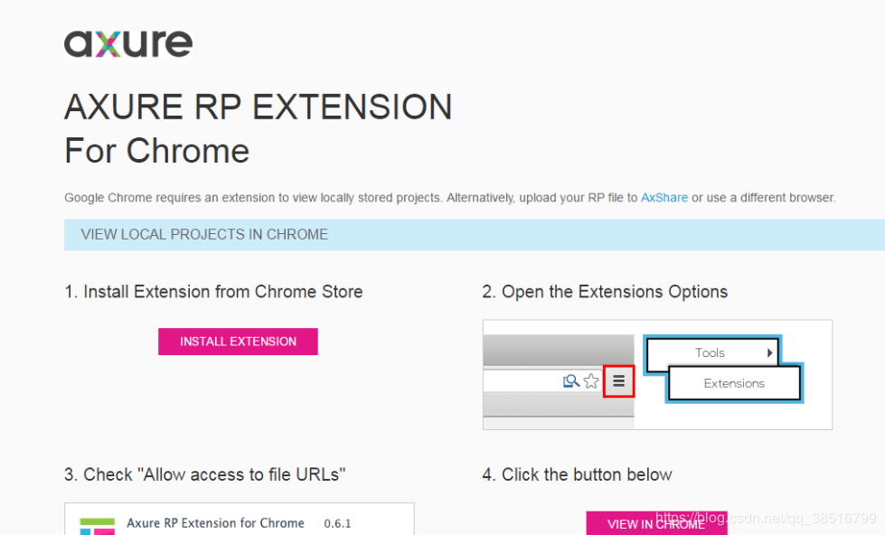

# Chrome浏览器安装Axure RP扩展

---

使用Chrome浏览器打开原型文件的html，会跳转到如下页面：

打开原型所在文件夹->resources->chrome，找到Axure RP Extension for Chrome插件：`axure-chrome-extension.crx`。

把`axure-chrome-extension.crx`文件扩展名修改为`.rar`，然后解压。

打开浏览器，输入`chrome://extensions/`，右上角打开开发者模式，选择 "加载已解压的扩展程序"，选择文件后安装，完成。

   

---

