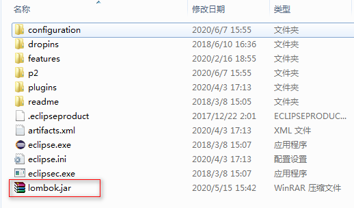
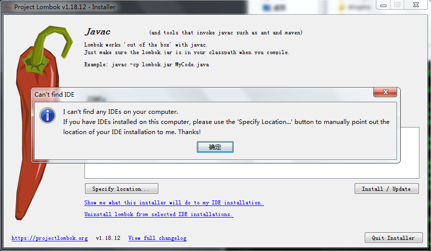
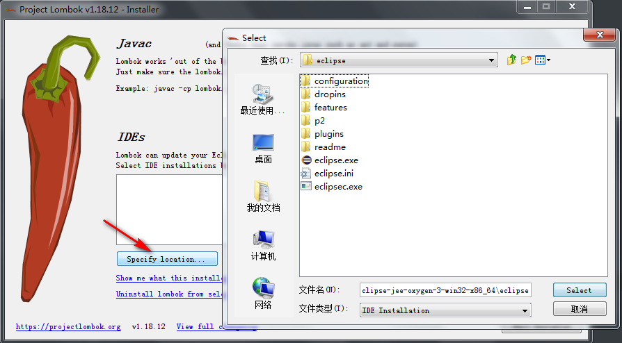
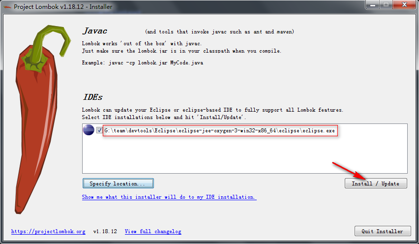
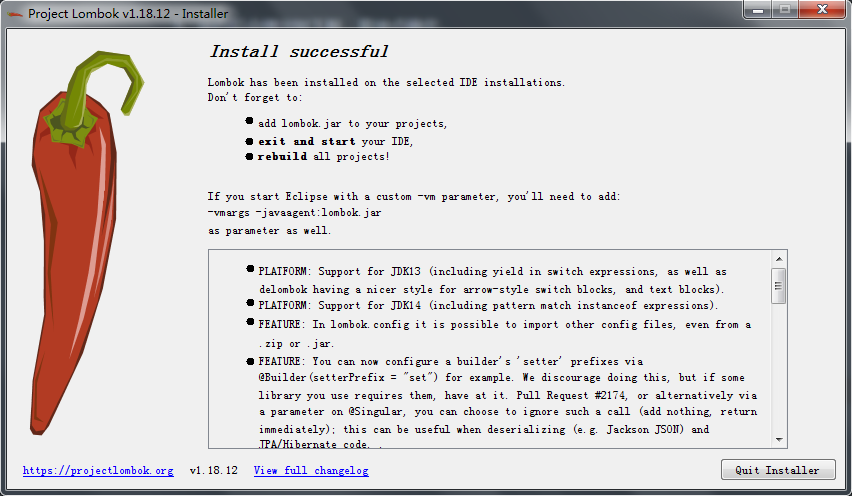
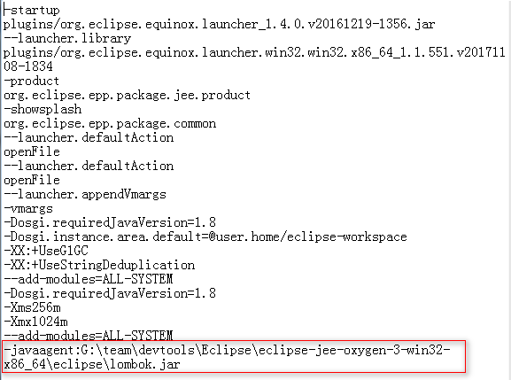

# Eclipse安装lombok插件

---

1、将 `lombok.jar` 放在eclipse安装目录下，和 `eclipse.ini` 文件平级即可：

2、在 `lombok.jar` 的目录下，运行： 

~~~plaintext
java -jar lombok.jar
~~~

3、运行后会弹出如下框，直接点确定：

4、点specify location按钮，选择eclipse的安装目录，选择到eclipse这一层即可：

5、按如下图步骤点击install即可：

6、成功后如下图： 

7、可以在 `eclipse.ini` 中查看是否真的安装成功：

8、重启eclipse，再clean project。

   

---

