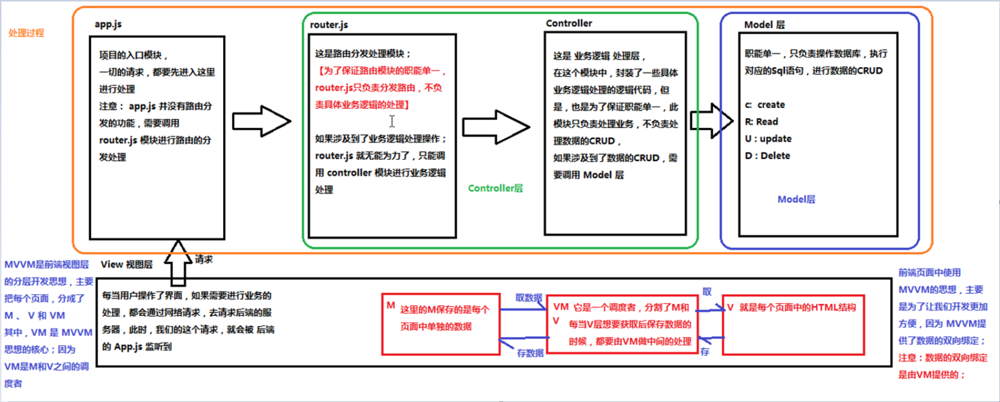

# Vue基础学习笔记

---

1、框架和库的区别

* 框架：是一套完整的解决方案，对项目的侵入性较大，如果项目需要更换框架，则需要重新架构整个项目；
* 库：提供某一个小功能，对项目侵入性较小，如果某个库无法完成需求，很容易切换到其它库来实现；

2、MVC与MVVM的关系

3、示例程序

~~~html
<body>
	
{ {msg} }

</body>

~~~

4、v-cloak

~~~html

{ {msg} }

~~~

如上所示，在网络延迟的情况下，`{ {msg} }`会直接显示在页面上，即插值表达式的闪烁问题，影响用户体验；

~~~html

{ {msg} }

~~~

加上v-cloak，通过观察页面元素，发现页面加载完成前div会加上v-cloak属性，页面加载完毕该属性消失，所以可以设置该属性样式来隐藏。

> v-text可以避免插值表达式的闪烁问题。

5、v-text与v-html

* v-text：作普通文本输出；
* v-html：会解析成HTML内容；

~~~html

========== { {msg} } ==========

结果：
========== Hello World ==========

========== ==========

结果：
Hello World

~~~

v-text会覆盖掉原有的内容。

6、v-bind

~~~html

{ {msg} }

{ {msg} }

~~~

7、v-on

~~~html

{ {msg} }

{ {msg} }

~~~

8、事件修饰符

* stop：阻止冒泡；
* prevent：阻止默认事件；
* capture：使用捕获模式；
* self：只有当事件在元素本身发生时才触发回调；
* once：只触发一次；

~~~html
<input type="button" @click.stop="func" />
<input type="button" @click.once="func" />
<input type="button" @click.once.stop="func" />
~~~

9、自定义按键修饰符

~~~html
<input type="text" @keyup.enter="func" />
<input type="text" @keyup.13="func" />
~~~

按键别名一览：enter、tab、delete、esc、space、up、down、right、left；

可通过全局配置修改按键修饰符：

~~~plaintext
Vue.config.keyCodes.f1=112
~~~

10、跑马灯效果

~~~html

	<input type="button" value="开始" @click="start" />
	<input type="button" value="停止" @click="end" />
	<h4>{ {msg} }</h4>

~~~

11、v-model

~~~html
<input type="text" v-model="msg" />
~~~

> v-model能够实现数据的双向绑定。

12、绑定class样式

~~~html

{ {msg} }

{ {msg} }

{ {msg} }

{ {msg} }

~~~

13、绑定style样式

~~~html

{ {msg} }

{ {msg} }

{ {msg} }

~~~

14、v-for

~~~html

第{ {i} }次
 //从1开始

{ {item} }

{ {index} } === { {item} }

{ {index} } === { {key} } === { {value} }

~~~

> 在2.0版本以后，key属性必须指定，用于确定唯一。key的值为字符串/数值。

15、v-if与v-show

~~~html

{ {msg} }

{ {msg} }

~~~

当flag为false时，v-if不会在页面生成div元素；v-show会生成但是添加了display:none；

> 一般而言，v-if有更高的切换消耗，而v-show有更高的初始渲染消耗；因此，如需频繁地切换元素使用v-show较好。

16、过滤器

1）全局过滤器

~~~html

{ { msg | formatter1 | formatter2('[', ']') } }

~~~

2）私有过滤器

~~~html

{ { date | dateFormat } }

~~~

> 过滤器只能用在插值表达式和v-bind表达式中。私有过滤器的优先级高于全局过滤器。

17、自定义指令

1）全局指令

~~~html
<input type="text" v-focus />
<input type="text" v-color="'red'" v-fontweight="900" />

~~~

2）私有指令

~~~html
<input type="text" v-color="'red'" v-fontweight="900" />

~~~

3）钩子函数

* bind：指令第一次绑定到元素时调用，只调用一次；
* inserted：被绑定元素插入父节点时调用；
* update：当VNode更新的时候调用，会调用多次；
* componentUpdated：当VNode（包括子组件）更新的时候调用，会调用多次；
* unbind：指令与元素解绑时调用一次；

4）钩子函数的参数

* el
* binding：name、value、oldValue、 expression、arg、modifiers
* vnode
* oldVnode

示例：

~~~javascript
bind: function(el, binding, vnode, oldVnode) {
    binding.name
    binding.value
    binding.oldValue
    binding.expression
    binding.arg
    binding.modifiers
}
~~~

18、自定义组件

1）全局组件

方式一：

~~~html

	<my-comp></my-comp>

~~~

方式二：

~~~html

	<my-comp></my-comp>

~~~

方式三：

~~~html

	<my-comp></my-comp>

<template id="tmpl">
	

		
Hello World

	

</template>

~~~

> 组件名称为驼峰表示法的在使用时应转换为"-"的形式。template指向的模板只能有一个根节点。

2）私有组件

~~~html

	<my-comp1></my-comp1>
	<my-comp2></my-comp2>
	<my-comp3></my-comp3>

<template id="tmpl">
	

		
Hello World

	

</template>

~~~

3）组件中的data

~~~html

	<my-comp></my-comp>

~~~

> 组件中的data必须是一个function并返回一个对象。

4）组件切换

方式一：

~~~html

	<login v-if="flag"></login>
	<register v-else></register>

~~~

方式二：

~~~html

	<component :is="componentId"></component>

~~~

5）组件传值

父组件向子组件传值：

~~~html

	<my-comp :msg="'Hello World'"></my-comp>

~~~

子组件向父组件传值：

~~~html

	<my-comp @func="show"></my-comp>

<template id="tmpl">
	

		
Hello World

	

</template>

~~~

6）使用ref获取DOM元素和组件引用

~~~html

	
Hello Vue

	<my-comp ref="myCom"></my-comp>

~~~

19、组件生命周期

~~~html

	<input type="button" value="change msg" @click="change" />
	
{ {msg} }

~~~

20、vue-resource

1）基本使用

~~~html

	<input type="button" value="Get" @click="getInfo" />
	<input type="button" value="Post" @click="postInfo" />

~~~

2）全局配置

~~~plaintext
// 数据接口的根域名
Vue.http.options.root='http://localhost:8080/test/';

// emulateJSON
Vue.http.options.emulateJSON=true;
~~~

21、路由 vue-router

1）基本使用

~~~html

	<a href="#/login">Login</a>
	<a href="#/register">Register</a>
	
	<router-link to="/login">LOGIN</router-link>
	<router-link to="/register" tag="span">REGISTER</router-link>
	<!-- router-link 默认渲染成a标签，可以通过tag属性指定生成的标签 -->
	
	<router-view></router-view>

~~~

2）参数传递

~~~html

	<router-link to="/login?id=666">LOGIN</router-link>
	<router-link to="/register/777">REGISTER</router-link>
	<router-view></router-view>

~~~

3）路由嵌套

~~~html

	<router-view></router-view>

<template id="tmpl">
	

		<h3>Account</h3>
		<router-link to="/account/login">LOGIN</router-link>
		<router-link to="/account/register">REGISTER</router-link>
	

</template>

~~~

4）命名视图

~~~html

	<router-view></router-view>
	

		<router-view name="left"></router-view>
		<router-view name="right"></router-view>
	

~~~

5）编程式导航

~~~html

	<input type="button" value="跳转" @click="go" />

~~~

22、watch

~~~html

	<input type="text" v-model="firstName" />
	<input type="text" v-model="lastName" />
	<input type="text" v-model="fullName" />

~~~

23、computed

~~~html

	<input type="text" v-model="firstName" />
	<input type="text" v-model="lastName" />
	<input type="text" v-model="fullName" />

~~~

24、Promise

~~~javascript
function getFile(path) {
    var promise = new Promise(function(resolve, reject) { //new Promise方法一执行，里面的代码就运行了
        fs.readFile(path, 'utf-8', (err, data) => {
            if(err) return reject(err);
            resolve(data);
        });
    });
    return promise;
}

getFile('./file1.txt').then(data => {
    console.log(data);
    return getFile('./file2.txt')
}, err => {
    
}).then(data => {
    console.log(data);
    return getFile('./file3.txt')
}).then(data => {
    console.log(data);
}).catch(err => { //只要前面有一个出现异常，都会终止并进入到当前块
    
});
~~~

25、动画

1）使用过渡类名实现动画

~~~html

	<input type="button" value="toggle" @click="flag=!flag" />
	<transition :duration="500">
		
{ {msg} }

	</transition>
	
	<!-- 指定前缀的类名 -->
	<transition name="my">
		
{ {msg} }

	</transition>
	
	<!-- 自定义类名 -->
	<transition enter-active-class="enterActive" leave-active-class="leaveActive" :duration="{enter:200, leave:300}">
		
{ {msg} }

	</transition>

~~~

2）使用第三方类库实现动画（animate.css）

3）钩子函数实现半场动画

~~~html

	<input type="button" value="toggle" @click="flag=!flag" />
	<transition 
		@before-enter="func"
		@enter="func"
		@after-enter="func"
		@enter-cancelled="func"
		
		@before-leave="func"
		@leave="func"
		@after-leave="func"
		@leave-cancelled="func" >
		
{ {msg} }

	</transition>

~~~

4）示例：模拟购物车小球飞入

~~~html

	<input type="button" value="加入购物车" @click="add" />
	<transition @before-enter="ballBeforeEnter" @enter="ballEnter" @after-enter="ballAfterEnter">
		

	</transition>

~~~

5）transition-group

~~~html

	<input type="button" value="add" @click="add"/>
	<ul>
		<transition-group appear>
            <li v-for="item in list" :key="item.id">{ {item.name} }</li>
        </transition-group>
	</ul>
	
	<transition-group appear tag="ul">
		<li v-for="item in list" :key="item.id">{ {item.name} }</li>
	</transition-group>

~~~

26、webpack

1）安装

~~~plaintext
# 全局安装
npm install webpack -g
# 安装到项目
npm install webpack --save-dev
~~~

> -S = --save, -D = --save-dev

2）项目结构

~~~plaintext
project
- dist
- src
-- css
-- images
-- js
-- main.js
-- index.html
- package.json
~~~

3）安装依赖

~~~plaintext
cd project
npm install jquery -S
~~~

4）main.js

~~~javascript
import $ from 'jquery'

// do something...
~~~

5）index.html

~~~html
<html>
<head>
	<!--  -->
	<!-- main.js使用到了ES6语法，浏览器不能识别，需经过webpack转换 -->
	
</head>
<body></body>
</html>
~~~

6）构建

~~~plaintext
webpack ./src/main.js ./dist/bundle.js
~~~

打开页面，运行成功。

7）使用配置文件

~~~plaintext
# 项目根路径下创建webpack默认配置文件
cd project
touch webpack.config.js
~~~

webpack.config.js内容：

~~~javascript
const path = require('path')

module.exports = {
    entry: path.join(__dirname, './src/main.js'),
    output: {
        path: path.join(__dirname, './dist'),
        filename: 'bundle.js'
    }
}
~~~

~~~plaintext
# 使用默认配置文件构建
webpack
~~~

8）webpack-dev-server 实现热部署

~~~plaintext
npm i webpack-dev-server -D
~~~

因为webpack-dev-server是安装到项目中，不是全局安装的，所以不能在命令行中直接运行。可以通过package.json的scripts脚本来运行：

~~~javascript
...
scripts: {
    "dev": "webpack-dev-server"
}
...
~~~

~~~plaintext
npm run dev
~~~

此时，会把输出路径更改为/。webpack生成的bundle.js不再存放到dist目录下，而是托管到/路径下（在内存中生成一个虚拟的bundle.js）。所以在index.html中应该导入/路径下的bundle.js：

~~~html

~~~

打开浏览器，访问http://localhost:8080/src/index.html 。如果要自动打开浏览器，配置如下：

~~~javascript
...
scripts: {
    "dev": "webpack-dev-server --open --port 80 --contentBase src --hot"
}
...
~~~

--open等参数如果不想写在dev命令后面，也可以配置到webpack.config.js中，如下：

~~~javascript
const path = require('path')
const webpack = require('webpack') //启用热更新（第2步）

module.exports = {
    entry: path.join(__dirname, './src/main.js'),
    output: {
        path: path.join(__dirname, './dist'),
        filename: 'bundle.js'
    },
    devServer: {
        open: true,
        port: 80,
        contentBase: 'src',
        hot: true //启用热更新（第1步）
    },
    plugins: [
        new webpack.HotModuleReplacementPlugin() //启用热更新（第3步）
    ]
}
~~~

可见，使用配置文件的方式来配置参数在热更新的配置上相对麻烦。

> webpack-dev-server是依赖于webpack的，所以也需要把webpack安装到本地项目中。

9）html-webpack-plugin

使用该插件生成一个内存中的/index.html文件（与前面/bundle.js文件类似），从而避免频繁访问磁盘上的./src/index.html，以加快访问速度。

~~~plaintext
npm i html-webpack-plugin -D
~~~

webpack.config.js添加如下内容：

~~~javascript
const path = require('path')
const webpack = require('webpack') //启用热更新（第2步）
const htmlWebpackPlugin = require('html-webpack-plugin')

module.exports = {
    entry: path.join(__dirname, './src/main.js'),
    output: {
        path: path.join(__dirname, './dist'),
        filename: 'bundle.js'
    },
    devServer: {
        open: true,
        port: 80,
        contentBase: 'src',
        hot: true //启用热更新（第1步）
    },
    plugins: [
        new webpack.HotModuleReplacementPlugin(), //启用热更新（第3步）
        new htmlWebpackPlugin({
            template: path.join(__dirname, './src/index.html'),
            filename: 'index.html'
        })
    ]
}
~~~

通过观察生成的/index.html文件源码，发现已经帮我们导入了/bundle.js文件，所以不用我们手动导入了，./src/index.html文件注释掉如下内容。

~~~html
<!--  -->
~~~

10）处理样式文件

~~~plaintext
cnpm i style-loader css-loader less less-loader node-sass sass-loader -D
~~~

main.js

~~~javascript
import $ from 'jquery'
import './css/index.css'
import './css/index.less'
import './css/index.scss'

// do something...
~~~

webpack.config.js

~~~javascript
const path = require('path')
const webpack = require('webpack') //启用热更新（第2步）
const htmlWebpackPlugin = require('html-webpack-plugin')

module.exports = {
    entry: path.join(__dirname, './src/main.js'),
    output: {
        path: path.join(__dirname, './dist'),
        filename: 'bundle.js'
    },
    devServer: {
        open: true,
        port: 80,
        contentBase: 'src',
        hot: true //启用热更新（第1步）
    },
    plugins: [
        new webpack.HotModuleReplacementPlugin(), //启用热更新（第3步）
        new htmlWebpackPlugin({
            template: path.join(__dirname, './src/index.html'),
            filename: 'index.html'
        })
    ],
    module: {
        rules: [
            {test: /\.css$/, use: ['style-loader', 'css-loader']},
            {test: /\.less$/, use: ['style-loader', 'css-loader', 'less-loader']},
            {test: /\.scss$/, use: ['style-loader', 'css-loader', 'sass-loader']}
        ]
    }
}
~~~

11）处理URL地址（图片、字体文件等）

~~~plaintext
cnpm i file-loader url-loader -D
~~~

webpack.config.js

~~~javascript
const path = require('path')
const webpack = require('webpack') //启用热更新（第2步）
const htmlWebpackPlugin = require('html-webpack-plugin')

module.exports = {
    entry: path.join(__dirname, './src/main.js'),
    output: {
        path: path.join(__dirname, './dist'),
        filename: 'bundle.js'
    },
    devServer: {
        open: true,
        port: 80,
        contentBase: 'src',
        hot: true //启用热更新（第1步）
    },
    plugins: [
        new webpack.HotModuleReplacementPlugin(), //启用热更新（第3步）
        new htmlWebpackPlugin({
            template: path.join(__dirname, './src/index.html'),
            filename: 'index.html'
        })
    ],
    module: {
        rules: [
            {test: /\.(jpg|png|gif|bmp|jpeg)$/, use: 'url-loader?limit=4096&name=[hash:8]-[name].[ext]'}, //大小超过limit的值会以base64形式显示，name指定以原文件名加上8位hash值来命名
            {test: /\.(ttf|eot|svg|woff|woff2)$/, use: 'url-loader'}
        ]
    }
}
~~~

12）Babel

将ES6等高版本js语法转换为低版本语法，有两套包可供选择。

~~~plaintext
# 第1套包
cnpm i babel-core babel-loader babel-plugin-transform-runtime -D
# 第2套包
cnpm i babel-preset-env babel-preset-stage-0 -D
~~~

webpack.config.js

~~~javascript
const path = require('path')
const webpack = require('webpack') //启用热更新（第2步）
const htmlWebpackPlugin = require('html-webpack-plugin')

module.exports = {
    entry: path.join(__dirname, './src/main.js'),
    output: {
        path: path.join(__dirname, './dist'),
        filename: 'bundle.js'
    },
    devServer: {
        open: true,
        port: 80,
        contentBase: 'src',
        hot: true //启用热更新（第1步）
    },
    plugins: [
        new webpack.HotModuleReplacementPlugin(), //启用热更新（第3步）
        new htmlWebpackPlugin({
            template: path.join(__dirname, './src/index.html'),
            filename: 'index.html'
        })
    ],
    module: {
        rules: [
            {test: /\.js$/, use: 'babel-loader', exclude: /node_modules/}
        ]
    }
}
~~~

在项目根目录下新建.babelrc文件，内容如下：

~~~javascript
{
    "presets": ["env", "stage-0"],
    "plugins": ["transform-runtime"]
}
~~~

13）整合Vue

~~~plaintext
npm i vue -S
~~~

main.js

~~~javascript
import Vue from 'vue'

var vm = new Vue({
    el: '#app',
    data: {}
});
~~~

以上方式不能正常运行，因为`import Vue from 'vue'`导入的包是 runtime-only的形式，不像在页面上用`

~~~

main.js

~~~javascript
import Vue from 'vue'
import App from './App.vue'

var vm = new Vue({
    el: '#app',
    data: {},
    //components: {
    //    App
    //},
    render: c => c(App)
});
//如果导入的是runtime-only的vue，不能以components注册组件，应该用render函数的形式。
~~~

15）整合vue-router

~~~plaintext
npm i vue-router -S
~~~

App.vue

~~~html
<template>
	

		<h3>{ {msg} }</h3>
		<router-view></router-view>
	

</template>

~~~

router.js

~~~javascript
import VueRouter from 'vue-router'
import welcome from './components/welcome.vue'
import account from './components/account.vue'
import login from './components/login.vue'
import register from './components/register.vue'

var router = new VueRouter({
    routes: [
        {path: '/welcome', component: welcome},
        {
            path: '/account',
            component: account,
            children: [
                {path: '/login', component: login},
                {path: '/register', component: register}
            ]
        }
    ]
})

export default router
~~~

main.js

~~~javascript
import Vue from 'vue'
import VueRouter from 'vue-router'

import app from './App.vue'
import router from './router.js'

Vue.use(VueRouter)

var vm = new Vue({
    el: '#app',
    data: {},
    router,
    render: c => c(app)
});
~~~

27、render

~~~html

~~~

28、vuex

vuex是一个专为Vue.js应用程序开发的状态管理模式，它采用集中式存储管理应用的所有组件的状态，并以相应的规则保证状态以一种可预测的方式发生变化。(即vuex是一个全局的共享数据存储区域)。

基本使用

~~~html

	<comp1></comp1>
	<comp2></comp2>

~~~

   

---

