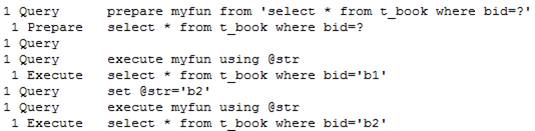

# MySQL的预编译功能

---

### 预编译的好处

大家平时都使用过JDBC中的PreparedStatement接口，它有预编译功能。什么是预编译功能呢？它有什么好处呢？

当客户发送一条SQL语句给服务器后，服务器总是需要校验SQL语句的语法格式是否正确，然后把SQL语句编译成可执行的函数，最后才是执行SQL语句。其中校验语法，和编译所花的时间可能比执行SQL语句花的时间还要多。

如果我们需要执行多次insert语句，但只是每次插入的值不同，MySQL服务器也是需要每次都去校验SQL语句的语法格式，以及编译，这就浪费了太多的时间。如果使用预编译功能，那么只对SQL语句进行一次语法校验和编译，所以效率要高。

### MySQL执行预编译

MySQL执行预编译分为如下三步：

* 执行预编译语句，例如：prepare myfun from 'select * from t_book where bid=?'
* 设置变量，例如：set @str='b1'
* 执行语句，例如：execute myfun using @str

如果需要再次执行myfun，那么就不再需要第一步，即不需要再编译语句了：

* 设置变量，例如：set @str='b2'
* 执行语句，例如：execute myfun using @str

通过查看MySQL日志可以看到执行的过程：

### 使用Statement执行预编译

使用Statement执行预编译就是把上面的SQL语句执行一次。

~~~java
Connection con = JdbcUtils.getConnection();
Statement stmt = con.createStatement();
stmt.executeUpdate("prepare myfun from 'select * from t_book where bid=?'");
stmt.executeUpdate("set @str='b1'");
ResultSet rs = stmt.executeQuery("execute myfun using @str");
while(rs.next()) {
	System.out.print(rs.getString(1) + ", ");
	System.out.print(rs.getString(2) + ", ");
	System.out.print(rs.getString(3) + ", ");
	System.out.println(rs.getString(4));
}

stmt.executeUpdate("set @str='b2'");
rs = stmt.executeQuery("execute myfun using @str");

while(rs.next()) {
	System.out.print(rs.getString(1) + ", ");
	System.out.print(rs.getString(2) + ", ");
	System.out.print(rs.getString(3) + ", ");
	System.out.println(rs.getString(4));
}

rs.close();
stmt.close();
con.close();
~~~

### useServerPrepStmts参数

默认使用PreparedStatement是不能执行预编译的，这需要在url中给出useServerPrepStmts=true参数（MySQL Server 4.1之前的版本是不支持预编译的，而Connector/J在5.0.5以后的版本，默认是没有开启预编译功能的）。例如：

~~~plaintext
jdbc:mysql://localhost:3306/test?useServerPrepStmts=true
~~~

这样才能保证mysql驱动会先把SQL语句发送给服务器进行预编译，然后在执行executeQuery()时只是把参数发送给服务器。

### cachePrepStmts参数

当使用不同的PreparedStatement对象来执行相同的SQL语句时，还是会出现编译两次的现象，这是因为驱动没有缓存编译后的函数key，导致二次编译。如果希望缓存编译后函数的key，那么就要设置cachePrepStmts参数为true。例如：

~~~plaintext
jdbc:mysql://localhost:3306/test?useServerPrepStmts=true&cachePrepStmts=true
~~~

### 打开批处理

MySQL的批处理也需要通过参数来打开：

~~~plaintext
rewriteBatchedStatements=true
~~~

   

---

