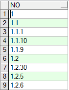
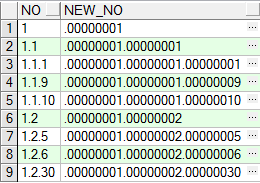

# Oracle开发技巧汇总-章节序号排序

---

### 章节排序问题

我们知道，一般篇幅较大的书籍，都分为很多章，每章下又有很多节，还有小节等。其层次的关系都是以这种方式来表达的：

~~~plaintext
1
1.1
1.1.1
1.1.1.1
1.1.1.2
1.2
1.2.1
2
2.1
2.1.1.1
...
~~~

每个数值之间由点分隔，要对其按照正常的章节顺序做排序，可以利用字符串的排序方式，固定长度排序。只要对分段中的每个数值都给予固定长度，不足者补0，这样就能满足此类排序要求。现在以固定长度8作为例子：

~~~sql
WITH temp AS ( 
	SELECT '1' AS NO FROM dual 
	UNION ALL 
	SELECT '1.1' AS NO FROM dual 
	UNION ALL 
	SELECT '1.1.1' AS NO FROM dual 
	UNION ALL 
	SELECT '1.1.9' AS NO FROM dual 
	UNION ALL 
	SELECT '1.1.10' AS NO FROM dual 
	UNION ALL 
	SELECT '1.2' AS NO FROM dual 
	UNION ALL 
	SELECT '1.2.5' AS NO FROM dual 
	UNION ALL 
	SELECT '1.2.6' AS NO FROM dual 
	UNION ALL 
	SELECT '1.2.30' AS NO FROM dual 
) 
SELECT NO, regexp_replace(replace('.'||NO, '.', '.00000000'), '0+([^\.]{8})', '\1') new_no FROM temp ORDER BY new_no ASC; 
~~~

普通排序：

正常排序：

   

---

