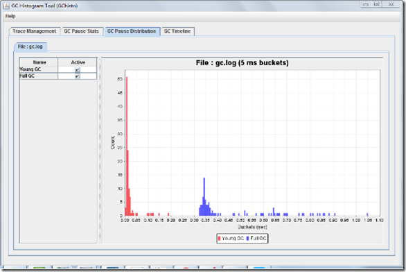
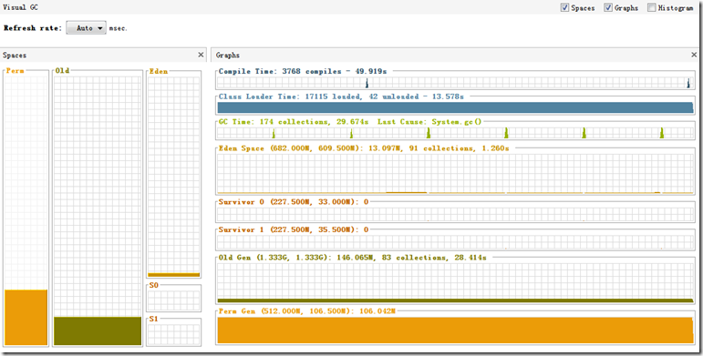
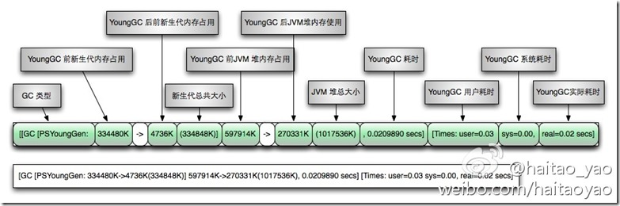
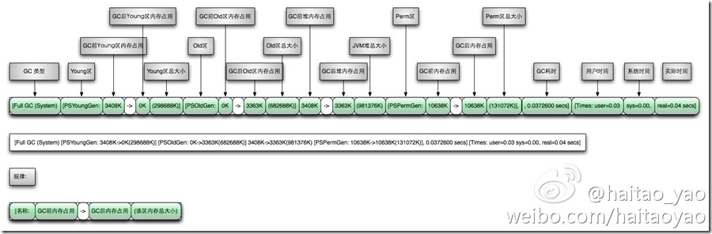
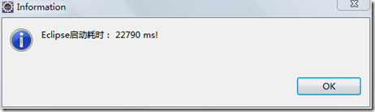
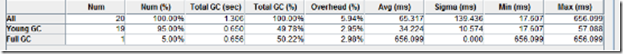
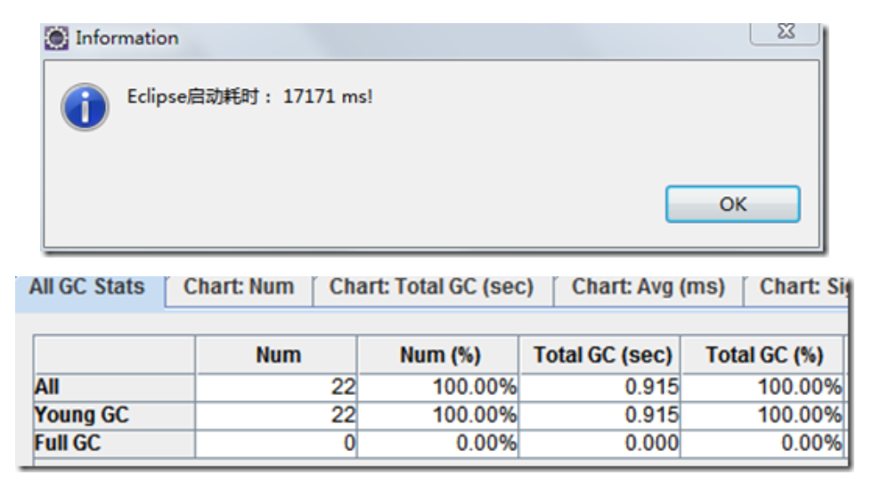
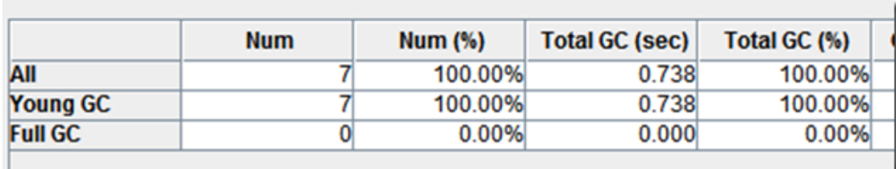
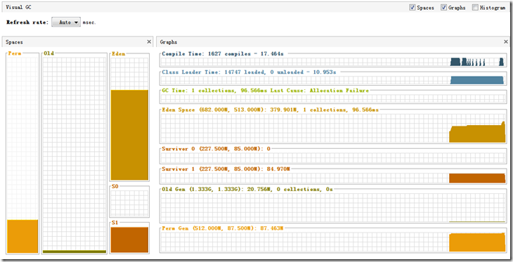
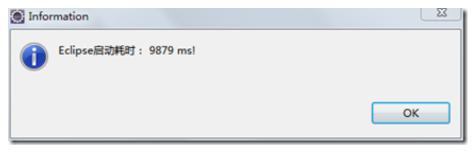

# JVM系列学习-JVM调优-从eclipse开始

---

### 概述

什么是JVM调优呢？JVM调优就是根据gc日志分析JVM内存分配、回收的情况来调整各区域内存比例或者gc回收的策略，更深一层就是根据dump出来的内存结构和线程栈来分析代码中不合理的地方给予改进。eclipse优化主要涉及的是前者，通过gc日志来分析。本文主要是通过分析eclipse gc日志为例来示例如何根据gc日志来分析JVM内存而进行调优，像根据关闭eclipse启动项、关闭各种校验等措施来优化eclipse本文不再阐述，网上有很多，本次测试的eclipse已经进行了配置上面的优化。

### 准备环境

eclipse版本：Release 4.5.0

eclipse 默认配置：eclipse.ini

~~~plaintext
-startup
plugins/org.eclipse.equinox.launcher_1.3.100.v20150511-1540.jar
--launcher.library
plugins/org.eclipse.equinox.launcher.win32.win32.x86_64_1.1.300.v20150602-1417
-product
org.eclipse.epp.package.jee.product
--launcher.defaultAction
openFile
--launcher.XXMaxPermSize
256M
-showsplash
org.eclipse.platform
--launcher.XXMaxPermSize
256m
--launcher.defaultAction
openFile
--launcher.appendVmargs
-vmargs
-Dosgi.requiredJavaVersion=1.7
-Xms256m
-Xmx1024m
~~~

在配置的末尾处添加如下配置：

* -XX:+PrintGCDetails   // 输出GC的详细日志
* -XX:+PrintGCDateStamps // 输出GC的时间戳（以日期的形式）
* -Xloggc:gc.log  // 输出GC的详细日志

eclipse启动计时插件：

http://www.chendd.cn/information/viewInformation/experienceShare/148.a

GChisto.jar:gc日志分析工具jar包一个：

Visual GC: java自带的内存监控工具，通过visual gc可以实时的监控到各个内存区域的变化。

### 如何分析GC日志

摘录GC日志一部分（第1部分为年轻代GC回收，第2部分为Full GC回收）：

~~~plaintext
2016-07-05T10:43:18.093+0800: 25.395: [GC [PSYoungGen: 274931K->10738K(274944K)] 371093K->147186K(450048K), 0.0668480 secs] [Times: user=0.17 sys=0.08, real=0.07 secs]
~~~

~~~plaintext
2016-07-05T10:43:18.160+0800: 25.462: [Full GC [PSYoungGen: 10738K->0K(274944K)] [ParOldGen: 136447K->140379K(302592K)] 147186K->140379K(577536K) [PSPermGen: 85411K->85376K(171008K)], 0.6763541 secs] [Times: user=1.75 sys=0.02, real=0.68 secs]
~~~

通过上面日志分析得出，PSYoungGen、ParOldGen、PSPermGen属于Parallel收集器。其中PSYoungGen表示gc回收前后年轻代的内存变化；ParOldGen表示gc回收前后老年代的内存变化；PSPermGen表示gc回收前后永久区的内存变化。Young gc 主要是针对年轻代进行内存回收比较频繁，耗时短；Full GC会对整个堆内存进行回城，耗时长，因此一般尽量减少Full GC的次数。

通过两张图非常明显看出gc日志构成：

Young GC日志：

Full GC日志

### 启动调优

启动eclipse查看默认配置下启动时间大概是22秒。

根据GChisto分析gc日志看出来，启动过程中进行了一次full gc,19次minor gc;full gc和young gc的时间差不多都是0.65秒左右。

1、第一步优化

为了避免内存频繁的动态扩展，直接把-Xms配置和-Xmx一致，修改如下：-Xms1024m

修改完毕，重新启动：

启动时间缩小到17秒，分析gc日志得出young gc22次，full gc没有了! 但是young gc增加了两次。

2、第二步优化

因为本机的内存8G，给eclipse分配1g还是有点小了，简单粗暴直接所有内存配置加倍。

配置如下：

~~~plaintext
--launcher.XXMaxPermSize
512M
--launcher.XXMaxPermSize
512m
-Xms2048m
-Xmx2048m
~~~

启动时间缩小到15秒，但是 young gc已经缩短到只有7次，说明因为gc回收导致eclipse 启动慢的问题已经初步解决。

3、第三步优化

通过Visual GC看到在eclipse启动的时候classloader加载class的时间有一些，关闭字节码可能会优化一部分启动时间，加入如下参数：

-Xverify:none（关闭Java字节码验证，从而加快了类装入的速度）

重新启动测试,启动时间已经优化到了9秒！

查看启动日志，young gc 的次数仅仅只有了一次！

4、至此优化结束，附最终的eclipse.ini文件

~~~plaintext
-startup
plugins/org.eclipse.equinox.launcher_1.3.100.v20150511-1540.jar
--launcher.library
plugins/org.eclipse.equinox.launcher.win32.win32.x86_64_1.1.300.v20150602-1417
-product
org.eclipse.epp.package.jee.product
--launcher.defaultAction
openFile
--launcher.XXMaxPermSize
512M
-showsplash
org.eclipse.platform
--launcher.XXMaxPermSize
512m
--launcher.defaultAction
openFile
--launcher.appendVmargs
-vmargs
-Dosgi.requiredJavaVersion=1.7
-Xms2048m
-Xmx2048m
-Xverify:none
-XX:+PrintGCDetails                 
-XX:+PrintGCDateStamps
-Xloggc:gc.log
~~~

   

---

